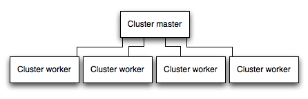

# Лучшие практики production: производительность и надежность {#best-practice-performance-and-reliability}

В этой статье рассматриваются лучшие практики производительности и надежности для Express-приложений в production.

Эта тема находится на стыке "devops", объединяя разработку и эксплуатацию. Поэтому материал разделен на две части:

-   Что делать в коде (часть dev):
    -   [Используйте gzip compression](#use-gzip-compression)
    -   [Не используйте synchronous functions](#do-not-use-synchronous-functions)
    -   [Логируйте корректно](#log-correctly)
    -   [Корректно обрабатывайте исключения](#handle-exceptions-properly)
-   Что делать в окружении/инфраструктуре (часть ops):
    -   [Установите NODE_ENV в "production"](#set-node_env-to-production)
    -   [Обеспечьте автоперезапуск приложения](#ensure-app-automatically-restarts)
    -   [Запускайте приложение в кластере](#run-your-app-in-a-cluster)
    -   [Кэшируйте результаты запросов](#cache-request-results)
    -   [Используйте балансировщик нагрузки](#use-a-load-balancer)
    -   [Используйте reverse proxy](#use-a-reverse-proxy)

## Что делать в коде {#what-to-do-in-code}

Ниже перечислено, что можно сделать в коде для улучшения производительности приложения:

-   [Используйте gzip compression](#use-gzip-compression)
-   [Не используйте synchronous functions](#do-not-use-synchronous-functions)
-   [Логируйте корректно](#log-correctly)
-   [Корректно обрабатывайте исключения](#handle-exceptions-properly)

### Используйте gzip compression {#use-gzip-compression}

Gzip-сжатие может существенно уменьшить размер тела ответа и тем самым ускорить веб-приложение. Для gzip в Express используйте middleware [compression](https://www.npmjs.com/package/compression). Например:

```js
const compression = require('compression');
const express = require('express');
const app = express();

app.use(compression());
```

Для высоконагруженного production-сайта лучше всего реализовать сжатие на уровне reverse proxy (обратного прокси) (см. [Use a reverse proxy](#use-a-reverse-proxy)). В этом случае middleware сжатия в приложении не требуется. Подробнее о включении gzip в Nginx — [Module ngx_http_gzip_module](http://nginx.org/en/docs/http/ngx_http_gzip_module).

### Не используйте synchronous functions {#do-not-use-synchronous-functions}

Синхронные функции и методы блокируют процесс до завершения. Один вызов может занять микросекунды или миллисекунды, но на высоконагруженных сайтах такие вызовы суммируются и снижают производительность. В production их лучше избегать.

Хотя в Node и многих модулях есть синхронные и асинхронные версии функций, в production всегда используйте асинхронные. Синхронные вызовы допустимы разве что при первичном старте приложения.

Можно использовать CLI-флаг `--trace-sync-io`, чтобы выводить предупреждение и stack trace при каждом использовании синхронного API. Это не для production, а для подготовки к нему. Подробнее в [node command-line options documentation](https://nodejs.org/api/cli#cli_trace_sync_io).

### Логируйте корректно {#log-correctly}

Обычно логирование в приложении нужно по двум причинам: для отладки и для фиксации активности приложения (все остальное). В разработке часто используют `console.log()` и `console.error()` для вывода в терминал. Но [эти функции синхронные](https://nodejs.org/api/console#console), если вывод идет в терминал или файл, поэтому для production они плохо подходят, если только вывод не перенаправляется в другую программу.

#### Для отладки

Если логирование нужно для отладки, вместо `console.log()` используйте специализированный модуль, например [debug](https://www.npmjs.com/package/debug). Он позволяет через переменную окружения DEBUG управлять тем, какие debug-сообщения отправлять в `console.error()`. Чтобы приложение оставалось асинхронным, вывод `console.error()` все равно лучше перенаправлять в другую программу. Впрочем, в production обычно не отлаживаются.

#### Для активности приложения

Если вы логируете активность приложения (например, трафик или API-вызовы), вместо `console.log()` используйте библиотеку логирования вроде [Pino](https://www.npmjs.com/package/pino) — это один из самых быстрых и эффективных вариантов.

### Корректно обрабатывайте исключения {#handle-exceptions-properly}

Node-приложения падают при необработанных исключениях. Если не обрабатывать исключения и не предпринимать нужные действия, Express-приложение аварийно завершится и станет недоступным. Если следовать советам из [Ensure your app automatically restarts](#ensure-app-automatically-restarts), приложение восстановится после падения. К счастью, Express обычно быстро стартует, но лучше вообще избегать падений — а для этого нужно правильно обрабатывать исключения.

Чтобы обрабатывать все исключения, используйте следующие подходы:

-   [Используйте try-catch](#use-try-catch)
-   [Используйте promises](#use-promises)

Прежде чем углубляться в детали, полезно понимать базовую обработку ошибок в Node/Express: error-first callbacks и проброс ошибок через middleware. В Node для асинхронных функций принят формат "error-first callback": первый параметр callback — объект ошибки, далее идут данные результата. Если ошибки нет, первым параметром передают null. Callback должен учитывать эту конвенцию, чтобы корректно обрабатывать ошибки. В Express лучшая практика — использовать `next()` для проброса ошибок по цепочке middleware.

Подробнее об основах обработки ошибок:

-   [Error Handling in Node.js](https://www.tritondatacenter.com/node-js/production/design/errors)

#### Используйте try-catch {#use-try-catch}

Try-catch — это конструкция JavaScript для перехвата исключений в синхронном коде. Например, с ее помощью можно обрабатывать ошибки парсинга JSON, как показано ниже.

Ниже пример использования try-catch для обработки исключения, которое могло бы привести к падению процесса. Middleware-функция принимает query-параметр "params", содержащий JSON-объект.

```js
app.get('/search', (req, res) => {
    // Simulating async operation
    setImmediate(() => {
        const jsonStr = req.query.params;
        try {
            const jsonObj = JSON.parse(jsonStr);
            res.send('Success');
        } catch (e) {
            res.status(400).send('Invalid JSON string');
        }
    });
});
```

Однако try-catch работает только для синхронного кода. Поскольку платформа Node в основном асинхронная (особенно в production), try-catch не перехватит многие исключения.

#### Используйте promises {#use-promises}

Когда в `async`-функции выбрасывается ошибка или внутри нее ожидается отклоненный promise, эти ошибки передаются в обработчик ошибок так же, как при вызове `next(err)`.

```js
app.get('/', async (req, res, next) => {
    const data = await userData(); // If this promise fails, it will automatically call `next(err)` to handle the error.

    res.send(data);
});

app.use((err, req, res, next) => {
    res.status(err.status ?? 500).send({
        error: err.message,
    });
});
```

Также можно использовать асинхронные функции как middleware, и роутер обработает ошибки при отклонении promise. Например:

```js
app.use(async (req, res, next) => {
    req.locals.user = await getUser(req);

    next(); // This will be called if the promise does not throw an error.
});
```

Лучшая практика — обрабатывать ошибки как можно ближе к месту их возникновения. Поэтому, хотя роутер теперь умеет это делать автоматически, предпочтительно ловить и обрабатывать ошибку прямо в middleware, не полагаясь полностью на отдельный error-handling middleware.

#### Чего не стоит делать

Не стоит подписываться на событие `uncaughtException`, которое возникает, когда исключение «всплывает» до event loop. Обработчик `uncaughtException` меняет стандартное поведение процесса: процесс продолжит работу несмотря на исключение. Это может казаться способом избежать падения приложения, но продолжение работы после необработанного исключения — опасная и не рекомендуемая практика, потому что состояние процесса становится ненадежным и непредсказуемым.

Кроме того, использование `uncaughtException` официально считается [crude](https://nodejs.org/api/process#process_event_uncaughtexception). Поэтому слушать `uncaughtException` — плохая идея. Именно поэтому рекомендуются несколько процессов и супервизоры: падение и последующий перезапуск часто являются самым надежным способом восстановиться после ошибки.

Также не рекомендуется использовать [domains](https://nodejs.org/api/domain). Обычно это не решает проблему, а сам модуль признан устаревшим.

## Что делать в окружении / инфраструктуре {#what-to-do-in-environment-and-infrastructure}

Ниже перечислено, что можно сделать в системном окружении для улучшения производительности:

-   [Установите NODE_ENV в "production"](#set-node_env-to-production)
-   [Обеспечьте автоперезапуск приложения](#ensure-app-automatically-restarts)
-   [Запускайте приложение в кластере](#run-your-app-in-a-cluster)
-   [Кэшируйте результаты запросов](#cache-request-results)
-   [Используйте балансировщик нагрузки](#use-a-load-balancer)
-   [Используйте reverse proxy](#use-a-reverse-proxy)

### Установите NODE_ENV в "production" {#set-node_env-to-production}

Переменная окружения NODE_ENV задает среду, в которой работает приложение (обычно development или production). Один из самых простых способов повысить производительность — установить NODE_ENV в `production`.

Установка NODE_ENV в "production" заставляет Express:

-   Кэшировать шаблоны представлений.
-   Кэшировать CSS-файлы, генерируемые из CSS-расширений.
-   Генерировать менее подробные сообщения об ошибках.

[Тесты показывают](https://www.dynatrace.com/news/blog/the-drastic-effects-of-omitting-node-env-in-your-express-js-applications/), что только этот шаг может увеличить производительность приложения примерно в три раза!

Если нужно писать код, зависящий от окружения, проверяйте значение NODE_ENV через `process.env.NODE_ENV`. Учтите, что чтение любых переменных окружения имеет накладные расходы по производительности, поэтому делайте это умеренно.

В разработке переменные окружения обычно задают в интерактивной оболочке, например через `export` или файл `.bash_profile`. Но на production-сервере так делать обычно не стоит — лучше использовать init-систему ОС (systemd). Следующий раздел подробнее описывает init-систему, но настройка `NODE_ENV` настолько важна (и проста), что вынесена отдельно.

В systemd используйте директиву `Environment` в unit-файле. Например:

```sh

Environment=NODE_ENV=production
```

Подробнее: [Using Environment Variables In systemd Units](https://www.flatcar.org/docs/latest/setup/systemd/environment-variables/).

### Обеспечьте автоперезапуск приложения {#ensure-app-automatically-restarts}

В production приложение не должно простаивать. Это означает, что его нужно автоматически перезапускать и при падении приложения, и при падении сервера. Даже если вы надеетесь, что этого не случится, на практике нужно учитывать оба сценария:

-   Использовать process manager для перезапуска приложения (и Node) при падении.
-   Использовать init-систему ОС для перезапуска process manager после падения ОС. Также можно использовать init-систему и без process manager.

Node-приложения падают при необработанных исключениях. Прежде всего убедитесь, что приложение хорошо протестировано и обрабатывает исключения (подробнее в [handle exceptions properly](#handle-exceptions-properly)). Но как страховка обязательно настройте механизм автоперезапуска при падении.

#### Используйте process manager {#use-a-process-manager}

В разработке приложение часто запускают командой `node server.js` или аналогичной. Для production это рискованно: при падении приложение останется недоступным до ручного перезапуска. Чтобы обеспечить автоперезапуск, используйте process manager. Это «контейнер» для приложений, который упрощает деплой, повышает доступность и позволяет управлять приложением во время работы.

Помимо автоперезапуска, process manager позволяет:

-   Получать метрики runtime-производительности и потребления ресурсов.
-   Динамически менять настройки для улучшения производительности.
-   Управлять кластеризацией (pm2).

Исторически было популярно использовать Node.js process manager, например [PM2](https://github.com/Unitech/pm2). Если хотите, смотрите их документацию. Однако для управления процессами рекомендуется опираться на init-систему.

#### Используйте init-систему {#use-an-init-system}

Следующий уровень надежности — автозапуск приложения при перезапуске сервера. Системы могут падать по разным причинам. Чтобы приложение поднималось после падения сервера, используйте встроенную init-систему ОС. Наиболее распространенная сегодня — [systemd](https://wiki.debian.org/systemd).

Есть два способа использовать init-систему с Express-приложением:

-   Запускать приложение через process manager и регистрировать process manager как сервис в init-системе. Process manager перезапустит приложение при падении, а init-система — process manager при рестарте ОС. Это рекомендуемый вариант.
-   Запускать приложение (и Node) напрямую через init-систему. Это немного проще, но без дополнительных преимуществ process manager.

##### Systemd {#systemd}

Systemd — это менеджер системы и сервисов в Linux. Большинство популярных дистрибутивов Linux используют systemd как init-систему по умолчанию.

Файл конфигурации сервиса systemd называется _unit file_ и имеет расширение `.service`. Ниже пример unit-файла для прямого управления Node-приложением. Значения в `<angle brackets>` замените на свои:

```sh
[Unit]
Description=<Awesome Express App>

[Service]
Type=simple
ExecStart=/usr/local/bin/node </projects/myapp/index.js>
WorkingDirectory=</projects/myapp>

User=nobody
Group=nogroup

Environment=NODE_ENV=production

LimitNOFILE=infinity

LimitCORE=infinity

StandardInput=null
StandardOutput=syslog
StandardError=syslog
Restart=always

[Install]
WantedBy=multi-user.target
```

Подробнее о systemd: [systemd reference (man page)](http://www.freedesktop.org/software/systemd/man/systemd.unit).

### Запускайте приложение в кластере {#run-your-app-in-a-cluster}

В многоядерной системе можно кратно повысить производительность Node-приложения, запустив кластер процессов. Кластер поднимает несколько инстансов приложения, в идеале по одному на ядро CPU, распределяя нагрузку между ними.



ВАЖНО: Поскольку инстансы приложения работают как отдельные процессы, они не разделяют память. То есть объекты локальны для каждого инстанса. Поэтому хранить состояние в коде приложения нельзя. Вместо этого используйте in-memory хранилище, например [Redis](http://redis.io/), для данных сессий и состояния. Это ограничение относится почти ко всем формам горизонтального масштабирования — как кластерам процессов, так и нескольким физическим серверам.

В кластерных приложениях worker-процессы могут падать по отдельности, не затрагивая остальные. Помимо производительности, изоляция сбоев — еще одна причина использовать кластер. При падении worker-процесса обязательно логируйте событие и запускайте новый процесс через cluster.fork().

#### Использование модуля cluster в Node {#use-the-cluster-module}

Кластеризация реализуется через [cluster module](https://nodejs.org/api/cluster) в Node. Он позволяет master-процессу поднимать worker-процессы и распределять входящие соединения между ними.

#### Использование PM2 {#use-pm2}

Если вы деплоите приложение через PM2, можно использовать кластеризацию _без_ изменения кода приложения. Сначала убедитесь, что [application is stateless](https://pm2.keymetrics.io/docs/usage/specifics/#stateless-apps), то есть процесс не хранит локальные данные (например, сессии, websocket-соединения и т. п.).

При запуске приложения через PM2 можно включить **cluster mode** и запустить нужное число инстансов, например по количеству доступных CPU. Количество процессов в кластере можно менять через CLI `pm2` без остановки приложения.

Чтобы включить cluster mode, запустите приложение так:

```bash
$ pm2 start npm --name my-app -i 4 -- start
$ pm2 start npm --name my-app -i max -- start
```

Это также настраивается в PM2 process file (`ecosystem.config.js` или аналогичном) через параметры `exec_mode: 'cluster'` и `instances` с числом worker-процессов.

После запуска приложение можно масштабировать так:

```bash
$ pm2 scale my-app +3
$ pm2 scale my-app 2
```

Подробнее о кластеризации в PM2 см. [Cluster Mode](https://pm2.keymetrics.io/docs/usage/cluster-mode/) в документации PM2.

### Кэшируйте результаты запросов {#cache-request-results}

Еще одна стратегия повышения производительности в production — кэшировать результаты запросов, чтобы приложение не повторяло одни и те же операции для одинаковых запросов.

Используйте кэширующий сервер, например [Varnish](https://www.varnish-cache.org/) или [Nginx](https://blog.nginx.org/blog/nginx-caching-guide) (см. также [Nginx Caching](https://serversforhackers.com/nginx-caching/)), чтобы заметно ускорить приложение.

### Используйте балансировщик нагрузки {#use-a-load-balancer}

Как бы хорошо ни было оптимизировано приложение, один инстанс может обработать только ограниченную нагрузку. Один из способов масштабирования — запуск нескольких инстансов и распределение трафика через балансировщик нагрузки. Это повышает производительность, скорость и масштабируемость по сравнению с одиночным инстансом.

Балансировщик нагрузки обычно выступает как reverse proxy, который маршрутизирует трафик между несколькими инстансами приложения и серверами. Для настройки балансировщика нагрузки можно использовать [Nginx](https://nginx.org/en/docs/http/load_balancing) или [HAProxy](https://www.digitalocean.com/community/tutorials/an-introduction-to-haproxy-and-load-balancing-concepts).

При балансировке может понадобиться гарантировать, что запросы с конкретным session ID попадают в процесс, который их создал. Это называется _session affinity_ или _sticky sessions_. Проблема часто решается рекомендацией выше — хранить сессионные данные во внешнем хранилище вроде Redis (в зависимости от архитектуры приложения). Подробнее: [Using multiple nodes](https://socket.io/docs/v4/using-multiple-nodes/).

### Используйте reverse proxy {#use-a-reverse-proxy}

Reverse proxy (обратный прокси) располагается перед веб-приложением и выполняет вспомогательные операции над запросами помимо их маршрутизации в приложение. Он может обрабатывать страницы ошибок, сжатие, кэширование, раздачу файлов, балансировку нагрузки и многое другое.

Передача задач, не требующих знания состояния приложения, на reverse proxy освобождает Express для прикладной логики. Поэтому в production рекомендуется запускать Express за reverse proxy, таким как [Nginx](https://www.nginx.org/) или [HAProxy](https://www.haproxy.org/).
