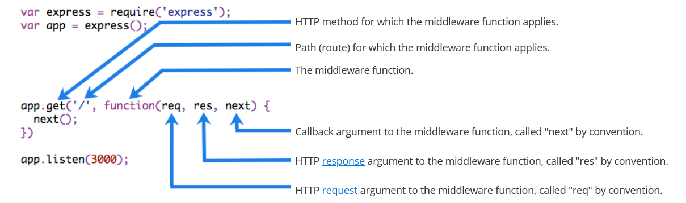

# Создание middleware для приложений Express

Функции _middleware_ имеют доступ к объекту запроса (`req`), объекту ответа (`res`) и функции `next` в request-response цикле приложения. `next` — это функция роутера Express, которая при вызове передает выполнение следующему middleware.

Middleware-функции могут выполнять следующие задачи:

-   Выполнять произвольный код.
-   Изменять объекты запроса и ответа.
-   Завершать request-response цикл.
-   Вызывать следующий middleware в стеке.

Если текущий middleware не завершает request-response цикл, он обязан вызвать `next()`, чтобы передать управление следующему middleware. Иначе запрос «повиснет».

На следующем рисунке показаны элементы вызова middleware-функции:



Начиная с Express 5, middleware, возвращающий Promise, автоматически вызывает `next(value)`, если Promise отклоняется или выбрасывается ошибка. В `next` передается отклоненное значение или выброшенный Error.

## Пример

Ниже пример простого приложения "Hello World" на Express. Далее в статье мы добавим к нему три middleware-функции: `myLogger` для вывода сообщения в лог, `requestTime` для добавления времени HTTP-запроса и `validateCookies` для проверки входящих cookie.

```js
const express = require('express');
const app = express();

app.get('/', (req, res) => {
    res.send('Hello World!');
});

app.listen(3000);
```

### Middleware-функция myLogger

Вот простой пример middleware-функции "myLogger". Она просто печатает "LOGGED", когда через нее проходит запрос к приложению. Функция присваивается переменной `myLogger`.

```js
const myLogger = function (req, res, next) {
    console.log('LOGGED');
    next();
};
```

!!!alert ""

    Обратите внимание на вызов `next()`. Он запускает следующий middleware в приложении. Функция `next()` не является частью Node.js или Express API — это третий аргумент, который передается middleware-функции. Формально его можно назвать как угодно, но по соглашению всегда используют имя "next". Чтобы избежать путаницы, придерживайтесь этого соглашения.

Чтобы подключить middleware, вызовите `app.use()` и передайте функцию middleware. Например, код ниже подключает `myLogger` перед маршрутом корневого пути (/).

```js
const express = require('express');
const app = express();

const myLogger = function (req, res, next) {
    console.log('LOGGED');
    next();
};

app.use(myLogger);

app.get('/', (req, res) => {
    res.send('Hello World!');
});

app.listen(3000);
```

Каждый раз при получении запроса приложение печатает в терминал сообщение "LOGGED".

Порядок подключения middleware важен: что подключено раньше, выполняется раньше.

Если `myLogger` подключить после маршрута корневого пути, запрос до него не дойдет, и приложение не выведет "LOGGED", потому что обработчик корневого маршрута завершает request-response цикл.

Middleware `myLogger` просто выводит сообщение, а затем передает запрос следующему middleware в стеке через вызов `next()`.

### Middleware-функция requestTime

Теперь создадим middleware "requestTime" и добавим в объект запроса свойство `requestTime`.

```js
const requestTime = function (req, res, next) {
    req.requestTime = Date.now();
    next();
};
```

Теперь приложение использует middleware `requestTime`. Callback-функция маршрута корневого пути также использует свойство, которое middleware добавляет в `req` (объект запроса).

```js
const express = require('express');
const app = express();

const requestTime = function (req, res, next) {
    req.requestTime = Date.now();
    next();
};

app.use(requestTime);

app.get('/', (req, res) => {
    let responseText = 'Hello World!<br>';
    responseText += `<small>Requested at: ${req.requestTime}</small>`;
    res.send(responseText);
});

app.listen(3000);
```

Когда вы отправляете запрос к корню приложения, в браузере отображается временная метка запроса.

### Middleware-функция validateCookies

Наконец, создадим middleware, который проверяет входящие cookie и отправляет ответ 400, если cookie некорректны.

Ниже пример функции, которая проверяет cookie через внешний асинхронный сервис.

```js
async function cookieValidator(cookies) {
    try {
        await externallyValidateCookie(cookies.testCookie);
    } catch {
        throw new Error('Invalid cookies');
    }
}
```

Здесь мы используем middleware `cookie-parser`, чтобы разобрать входящие cookie из `req` и передать их в функцию `cookieValidator`. Middleware `validateCookies` возвращает Promise; при отклонении автоматически сработает обработчик ошибок.

```js
const express = require('express');
const cookieParser = require('cookie-parser');
const cookieValidator = require('./cookieValidator');

const app = express();

async function validateCookies(req, res, next) {
    await cookieValidator(req.cookies);
    next();
}

app.use(cookieParser());

app.use(validateCookies);

// error handler
app.use((err, req, res, next) => {
    res.status(400).send(err.message);
});

app.listen(3000);
```

!!!alert ""

    Обратите внимание, что `next()` вызывается после `await cookieValidator(req.cookies)`. Это гарантирует: если `cookieValidator` выполнится успешно, будет вызван следующий middleware в стеке. Если передать в `next()` любое значение (кроме строк `'route'` или `'router'`), Express сочтет текущий запрос ошибочным и пропустит все оставшиеся middleware/маршруты, не предназначенные для обработки ошибок.

Поскольку у вас есть доступ к объекту запроса, объекту ответа, следующей middleware-функции в стеке и всему Node.js API, возможности middleware практически безграничны.

Подробнее о middleware в Express: [Using Express middleware](./using-middleware.md).

## Конфигурируемый middleware

Если middleware должен настраиваться, экспортируйте функцию, которая принимает объект параметров (или другие аргументы) и возвращает реализацию middleware на их основе.

Файл: `my-middleware.js`

```js
module.exports = function (options) {
    return function (req, res, next) {
        // Implement the middleware function based on the options object
        next();
    };
};
```

Теперь middleware можно использовать так:

```js
const mw = require('./my-middleware.js');

app.use(mw({ option1: '1', option2: '2' }));
```

Примеры конфигурируемого middleware смотрите в [cookie-session](https://github.com/expressjs/cookie-session) и [compression](https://github.com/expressjs/compression).
