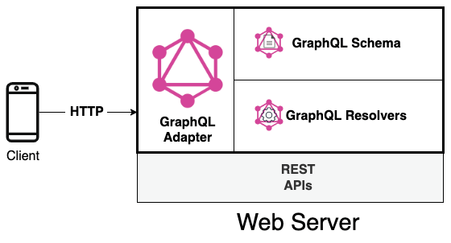
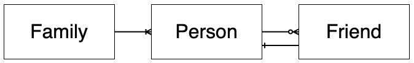
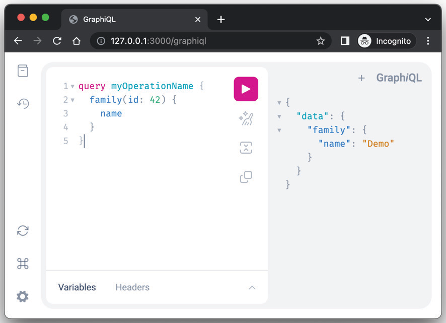
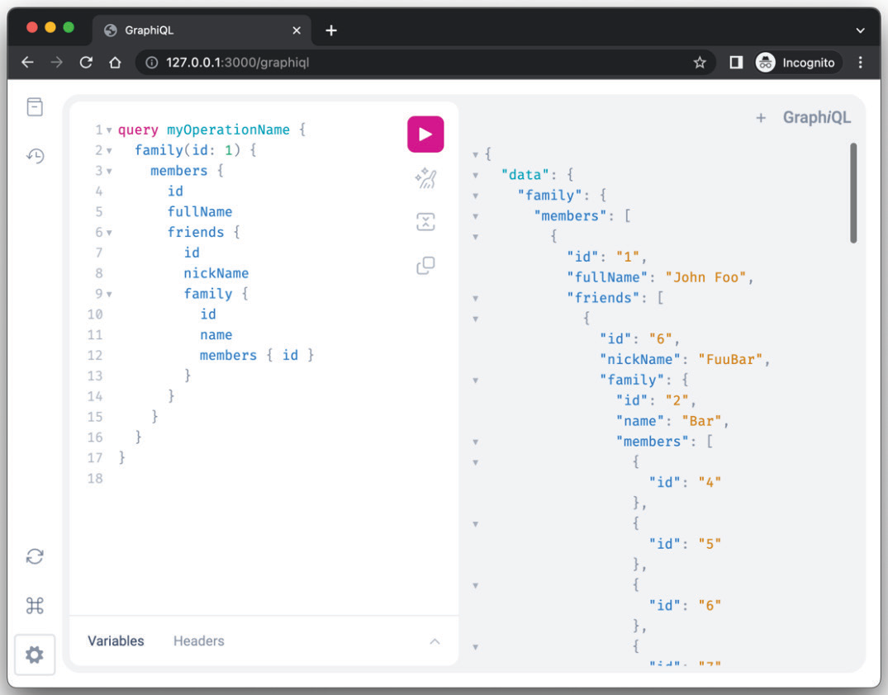
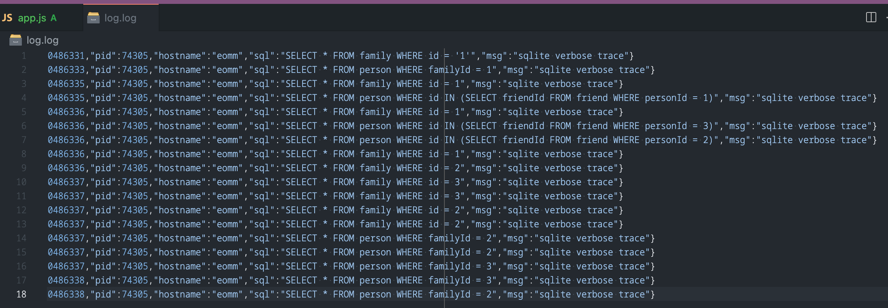

# Разработка GraphQL API

<big>GraphQL набирает популярность, и с каждым днем все больше сервисов раскрывают свои API с помощью этого языка запросов. **Интерфейс GQL API** поможет вашим потребителям API получить минимальный набор необходимых им данных, пользуясь интуитивно понятной и всегда обновляемой документацией. GraphQL является первоклассным гражданином в экосистеме Fastify.</big>

Давайте узнаем, как добавить обработчики GraphQL с помощью специального плагина, избегая распространенных подводных камней и используя преимущества особой архитектуры Fastify.

Вот путь обучения, который мы пройдем в этой главе:

-   Что такое GraphQL?
-   Написание схемы GQL
-   Как сделать схему GQL живой?
-   Как повысить производительность резолвера?
-   Управление ошибками GQL

!!!info "Технические требования"

    Чтобы успешно завершить эту главу, вам потребуется:

    -   Рабочая установка Node.js 18
    -   [VS Code IDE](https://code.visualstudio.com/)
    -   Рабочая командная оболочка

    :material-source-repository: Все сниппеты в этой главе находятся на [GitHub](https://github.com/PacktPublishing/Accelerating-Server-Side-Development-with-Fastify/tree/main/Chapter%2014).

## Что такое GraphQL? {#what-is-graphql}

GraphQL — это новый язык, который изменил то, как веб-сервер раскрывает данные и как клиент их потребляет. Учитывая структуру данных нашего приложения, мы можем представить каждый источник данных в виде графа, состоящего из узлов (объектов) и ребер (отношений), соединяющих их.

Вот краткий пример GraphQL-запроса, который отображает семью и ее членов:

```graphql
query {
    family(id: 5) {
        id
        members {
            fullName
            friends {
                fullName
            }
        }
    }
}
```

Прочитав наш первый GraphQL-запрос, мы можем сразу понять иерархию отношений. Сущность `Family` имеет множество сущностей `Person` в качестве свойства массива `members`. Каждый элемент `members` может иметь несколько сущностей `Person` в качестве `friends`. Обычно строку GQL-запроса называют **GQL-документом**.

JSON-ответ на наш GQL-запрос может выглядеть следующим образом:

```json
{
    "data": {
        "family": {
            "id": 5,
            "members": [
                {
                    "fullName": "Foo Bar",
                    "friends": []
                },
                {
                    "fullName": "John Doe",
                    "friends": [
                        { "fullName": "Michael Gray" },
                        { "fullName": "Greta Gray" }
                    ]
                },
                {
                    "fullName": "Jane Doe",
                    "friends": [
                        { "fullName": "Greta Gray" }
                    ]
                }
            ]
        }
    }
}
```

Видя предыдущий пример, вы можете предположить, что если бы вы хотели получить те же данные, используя архитектуру REST API, то вам пришлось бы выполнить множество HTTP-вызовов, например:

-   Вызов конечной точки `GET /family/5` для получения членов семьи
-   Вызов `GET /person/id` для каждого члена семьи, чтобы получить информацию о его друзьях.

Такая простота взаимодействия гарантирована, поскольку GraphQL — это декларативный, интуитивно понятный и гибкий язык, позволяющий сосредоточиться на форме данных. Его задача — разработать структурированную и продуктивную среду для упрощения получения API клиентом.

Для достижения своих целей он имеет множество принципов проектирования:

-   **Ориентированность на продукт**: Язык строится вокруг требований потребителей и визуализации данных.
-   **Иерархичность**: Запрос имеет иерархическую форму, которая определяет структуру данных ответа
-   **Стронг-типирование**: Сервер определяет систему типов приложений, используемую для проверки каждого запроса и документирования результатов ответа
-   **Определенный клиентом ответ**: Клиент знает возможности сервера и то, какие из них ему разрешено использовать
-   **Интроспективный**: Система типов сервиса GraphQL может быть запрошена с помощью самого языка GraphQL для создания мощных инструментов.

Эти принципы лежат в основе спецификации GraphQL, и подробнее о них вы можете [узнать на сайте](http://spec.graphql.org/).

Но что нужно для реализации спецификации GraphQL? Давайте выясним это в следующем разделе.

### Как Fastify поддерживает GraphQL? {#how-does-fastify-support-graphql}

GraphQL описывает язык, но мы должны реализовать спецификацию, чтобы поддерживать его грамматику. Итак, мы рассмотрим, как реализовать GraphQL в Fastify, пока изучаем спецификацию. Мы напишем исходный код для поддержки примера GQL, который мы рассматривали в предыдущем разделе.

Для начала нам нужно определить компоненты. На следующей диаграмме показаны архитектурные концепции, поддерживающие GraphQL:

<figure markdown>

<figcaption>Рисунок 14.1 — Базовая архитектура компонентов GraphQL</figcaption>
</figure>

На _рисунке 14.1_ показано несколько основных понятий о GraphQL:

-   Любой клиент может выполнить документ GraphQL, выполнив HTTP-запрос к веб-серверу.
-   Веб-сервер понимает GQL-запрос, используя **GraphQL-адаптер**, который взаимодействует с определением **GraphQL-схемы** и **GraphQL-резольверами**. Все эти понятия будут рассмотрены далее в разделе [Как сделать живую схему GQL?](#how-to-make-live-a-gql-schema).
-   Веб-сервер может без проблем открывать несколько REST API помимо GQL.

Для реализации нашего первого GraphQL-сервера мы будем следовать следующему прямолинейному процессу:

1.  Определите схему GQL.
2.  Напишите простой сервер Fastify.
3.  Добавьте плагин `mercurius` и адаптер GraphQL, разработанный для Fastify, к установке Fastify.
4.  Реализуйте GQL-резольверы.

Итак, давайте начнем работать над синтаксисом GQL, чтобы написать нашу первую схему.

## Написание GQL-схемы {#writing-the-gql-schema}

Мы должны написать схему GQL, используя его **систему типов**. Если мы сначала подумаем о наших данных, нам будет проще их реализовать. Давайте попробуем преобразовать следующую диаграмму в схему:

<figure markdown>

<figcaption>Рисунок 14.2 — Взаимосвязь данных</figcaption>
</figure>

Отношение данных на _рисунке 14.2_ описывает сущности и отношения между ними:

-   У _семьи_ есть несколько членов.
-   У _человека_ может быть множество _друзей_, которые являются другими членами _семьи_.

Таким образом, мы можем представить эти сущности в виде **объектных типов**, написав следующий **язык определения схем (SDL)**:

```
type Family {
  id: ID!
  name: String!
  members: [Person!]!
}
type Person {
  id: ID!
  family: Family!
  fullName: String!
  nickName: String
  friends: [Person!]!
}
```

Синтаксис для определения сущности GQL легко читается. Мы определили два типа. Каждый тип имеет имя в `PascalCase` и список **полей**, окруженных фигурными скобками.

Каждое поле определяется словами `<имя поля>: <тип поля>`. Тип поля определяет тип значения поля ответа. Возможно, в предыдущем блоке кода вы увидели восклицательный знак в конце. Это **GQL-модификатор типа**, который объявляет поле не нулевым. Возможные варианты синтаксиса:

-   `<имя поля>: <тип поля>!`: Не нулируемое поле. Клиент всегда должен ожидать значение ответа.
-   `<имя поля>: [<тип поля>]`: Поле возвращает обнуляемый массив с обнуляемыми элементами.
-   `<имя поля>: [<тип поля>!]`: Возвращаемый массив является обнуляемым, но в нем не будет обнуляемых элементов.
-   `<Имя поля>: [<тип поля>!]!`: Определяет не нуллируемый массив без элементов `null`. В результате массив может оказаться пустым.

Тип поля может быть другим типом, определенным самостоятельно, как мы сделали для типа `family`, или может быть **скаляром**. Скаляр представляет собой примитивное значение, и по умолчанию каждый адаптер GQL реализует:

-   `Int`: Представляет знаковое 32-битное число.
-   `Float`: Представляет значения с плавающей точкой.
-   `String`: Текстовое значение данных, представленное в виде символов UTF-8.
-   `Boolean`: Истинное или ложное значение.
-   `ID`: Представляет собой **уникальный идентификатор (UID)**. Принимает числовые значения, но всегда сериализуется как строка.

Спецификация позволяет определять дополнительные скаляры, такие как `Date` или `DateTime`.

Теперь мы написали наши объектные типы GQL, но как использовать их для чтения и редактирования? Давайте узнаем это в следующем разделе.

### Определение операций GQL {#defining-gql-operations}

Документ GQL может содержать различные **операции**:

-   `query`: Действие только для чтения
-   `mutation`: Операция записи и чтения.
-   `subscription`: Постоянное соединение с запросом, которое извлекает данные в ответ на события.

Эти операции должны быть определены в схеме GQL, чтобы их мог использовать клиент. Давайте улучшим наш SDL, добавив следующий код:

```
type Query {
  family(id: ID!): Family
}
type Mutation {
  changeNickName(personId: ID!, nickName: String!): Person
}
type Subscription {
  personChanged: Person
}
```

Предыдущий фрагмент кода добавляет по одной операции для каждого типа, поддерживаемого спецификацией GQL. Как вы можете прочитать, мы использовали синтаксис типа `<операция>`. Эти типы называются **корневыми типами операций**. Каждое поле в определениях этих специальных типов будет соответствовать резольверу, который реализует нашу бизнес-логику.

В дополнение к тому, что мы узнали из вводного раздела [Написание схемы GQL](#writing-the-gql-schema) об определении `type`, мы видим, что некоторые поля имеют входные параметры: `family(id: ID!): Family`. Фактически, синтаксис такой же, как мы обсуждали ранее, но есть один дополнительный аргумент, который мы можем объявить как функцию JavaScript: `<имя поля>(<аргументы поля>): <тип поля>`.

Как мы уже писали в нашем примере SDL, аргументы поля `changeNickName` могут быть либо списком полей. Когда мы должны иметь дело с большим количеством параметров, мы можем использовать тип **input**. Объект типа `input` работает как объект `type`, но может использоваться только в качестве пользовательского ввода. Он полезен, когда нам нужно объявить более сложные объекты ввода. Давайте добавим в нашу схему GQL еще одну мутацию, которая принимает тип `input`:

```
input NewNickName {
  personId: ID!
  nick: String!
}
type Mutation {
  // ...
  changeNickNameWithInput(input: NewNickName!): Person!
}
```

Мы определили GQL-тип `input NewNickName`, который похож на тип объекта `Person`, но не содержит полей, которые пользователь не может задать.

Отлично! Мы написали схему GQL нашего приложения. Вы увидели все основные вещи, необходимые для определения схем GQL. Прежде чем углубляться в спецификацию GQL, изучая другие ключевые слова и допустимые синтаксисы, мы должны консолидировать наше приложение, реализовав бизнес-логику. Пришло время писать код!

## Как сделать живую схему GQL? {#how-to-make-live-a-gql-schema}

В разделе [Writing the GQL Schema](#writing-the-gql-schema) мы написали GQL-схему приложения. Теперь нам нужно инициализировать новый проект npm. Для простоты и чтобы сосредоточиться только на логике GQL, мы можем создать его, выполнив следующий код:

```sh
mkdir family-gql
cd family-gql/
npm init --yes
npm install fastify@4 mercurius@11
```

Мы готовы создать наш первый файл, `gql-schema.js`. Здесь мы можем просто скопировать схему GQL, которую мы написали в предыдущем разделе:

```js
module.exports = `
# the GQL Schema string
`;
```

Прежде чем продолжить, стоит упомянуть, что существует два разных способа определения схемы GQL в Node.js:

-   **Schema-first**: Схема GQL — это строка, написанная в соответствии со спецификацией GQL.
-   **Code-first**: Схема GQL генерируется внешним инструментом, например, модулем `graphql npm`.

В этой главе мы будем следовать реализации schema-first, поскольку она является наиболее общей и позволяет получить четкое представление о схеме без запуска приложения для ее генерации во время выполнения.

Пришло время загрузить схему, которую мы написали в разделе [Writing the GQL schema](#writing-the-gql-schema), и запустить GQL-сервер. Рассмотрим, как это сделать, в следующем разделе.

### Запуск GQL-сервера {#starting-the-gql-server}

Чтобы создать GQL-сервер, нам нужно создать экземпляр Fastify и зарегистрировать плагин mercurius, как мы узнали на протяжении всей этой книги. Создайте новый файл app.js:

```js
const Fastify = require('fastify');
// [1]
const mercurius = require('mercurius');
const gqlSchema = require('./gql-schema');
async function run() {
    const app = Fastify({ logger: { level: 'debug' } });
    //[2]
    const resolvers = {};
    app.register(mercurius, {
        schema: gqlSchema,
        resolvers,
    });
    await app.listen({ port: 3000 });
}
run();
```

Вы должны быть в состоянии прочитать этот небольшой фрагмент кода Fastify. Мы импортировали адаптер GQL и схему в строке `[1]`. В строке `[2]` мы объявили пустой объект `resolvers` и зарегистрировали плагин `mercurius` на сервере приложений. Если мы запустим приложение под управлением `node app.js`, оно запустится корректно и будет готово принять GQL-запрос.

Для проверки мы можем запустить команду `curl`, например, так:

```sh
curl --location --request POST 'http://localhost:3000/graphql' \
  --header 'Content-Type: application/json' \
  --data-raw '{"query":"query { family(id: 5){ id }
}","variables":{}}'
```

Команда вернет пустой ответ:

```json
{
    "data": {
        "family": null
    }
}
```

Давайте сделаем шаг назад и проанализируем происходящее:

1.  Регистрация плагина `mercurius` приводит к появлению конечной точки `/graphql`, готовой принимать запросы GQL.
2.  Поскольку опция `resolvers` является пустым объектом, все операции приложения не выполняют никакой бизнес-логики, и на выходе получается значение `null` по умолчанию.
3.  Каждый клиент может выполнить HTTP-запрос к обслуживаемой конечной точке GQL. Формат HTTP-запроса также определяется спецификацией GQL.

К отправке GQL-запроса по HTTP предъявляется очень мало требований:

-   Должен быть параметр `query`, который содержит строку GQL-запроса.
-   Можно определить параметр `variables`, который будет выполнять роль специального заполнителя в строке GQL-запроса. Он должен быть обычным JSON-объектом.
-   HTTP-запрос должен быть вызовом метода GET или POST. В первом случае параметры должны быть переданы как параметр строки запроса. Во втором случае полезная нагрузка запроса должна представлять собой объект JSON, как это было в нашем примере с `curl`.

Если вы хотите узнать все подробности о спецификации, вы можете глубоко погрузиться в эту тему в [официальной документации](https://graphql.org/learn/serving-over-http/). Mercurius поддерживает все спецификации, так что вам не нужно беспокоиться об этом!

!!!note "Параметр OperationName"

    В качестве опции вы можете определить более одного типа корневой операции в одном GQL-запросе. В этом случае в HTTP-запрос необходимо добавить дополнительный параметр `operationName`. Он будет выбирать операцию для выполнения. Примером может служить включение в полезную нагрузку GQL-запроса операций `mutation` и `query`, а затем указание, какая из них должна быть выполнена. Этот способ часто используется на этапе разработки, и вы увидите его в действии в следующем разделе.

Мы запустили наш GQL-сервер, но нам нужно добавить нашу бизнес-логику, поэтому пришло время реализовать некоторые GQL-резольверы в следующем разделе.

### Реализация нашего первого резольвера GQL-запросов {#implementing-our-first-gql-query-resolver}

GQL-резольверы реализуют бизнес-логику нашего приложения. Функцию резольвера можно прикрепить почти к каждой возможности схемы GQL, за исключением типа корневых операций. Вкратце перечислим все компоненты системы типов, которые могут иметь пользовательскую функцию resolver:

-   Объекты типа
-   Поля типа
-   Скаляры
-   Перечисления
-   Директивы и союзы

Мы не будем подробно обсуждать эти темы, поскольку они выходят за рамки данной книги.

Как мы уже говорили в разделе [Определение операций GQL](#defining-gql-operations), операция определяется как поле корневого типа операции, поэтому реализация запроса `family(id: ID!)` будет похожа на реализацию резольвера поля.

Прежде чем мы продолжим наш путь к реализации резольверов, нам понадобится база данных для подключения. Чтобы сосредоточиться на аспекте GQL в этой главе, мы применим некоторые быстрые клавиши, чтобы создать максимально быструю конфигурацию для работы с GQL. Итак, давайте добавим в наш файл `app.js` экземпляр SQLite in-memory, который будет заполняться имитируемыми данными при каждом перезапуске. Мы должны выполнить команду `npm install fastify-sqlite`, а затем отредактировать наш файл приложения, как показано ниже:

```js
// ...
const app = Fastify({ logger: true });
await app.register(require('fastify-sqlite'), {
    promiseApi: true,
});
await app.sqlite.migrate({
    migrationsPath: 'migrations/',
});
// ...
```

Этот фрагмент кода добавляет плагин `fastify-sqlite` к нашему приложению Fastify. По умолчанию он подключает наше приложение к экземпляру SQLite в памяти. Модуль добавляет удобную утилиту `migrate`, которая позволяет нам запускать все файлы `.sql`, включенные в директорию `migrations/`, которую мы должны создать. В папке `migrations/` мы можем создать новый файл `001-init.sql`, содержащий нашу схему SQL, которая воссоздает таблицы и отношения, показанные на _Рисунке 14.2_. Кроме того, сценарий должен добавить некоторые имитированные данные, чтобы ускорить создание прототипа. Вы можете просто скопировать и вставить его из [репозитория](https://github.com/PacktPublishing/Accelerating-Server-Side-Development-with-Fastify/tree/main/Chapter%2014/migrations) книги.

Проект на GQL готов, и теперь мы можем реализовать бизнес-логику. Нам нужно настроить переменную `resolvers`, которую мы написали в разделе [Запуск GQL-сервера](#starting-the-gql-server). Конфигурация относительно проста и выглядит следующим образом:

```js
const resolvers = {
    Query: {
        family: async function familyFunc(
            parent,
            args,
            context,
            info
        ) {
            context.reply.log.info(
                'TODO my business logic'
            );
            return {
                id: 42,
                name: 'Demo',
            };
        },
    },
};
```

Если мы попробуем проанализировать реализацию запроса `family(id: ID!)`, то сразу поймем структуру параметра `resolvers`. Ключ `Query` представляет **корневой тип операции запроса**, и все его ключи должны совпадать с записью в соответствующем корневом типе операции, определенном в схеме GQL.

!!!note "Контроль соответствия"

    Во время запуска Fastify, если мы добавим функцию resolver в объект конфигурации `Query`, не объявив ее в нашей схеме GQL, Mercurius выдаст ошибку.

Объект `resolvers` сообщает нам, что существует запрос с именем `family`. Каждый раз, когда поступает GQL-запрос, GQL-адаптер должен выполнить нашу функцию `familyFunc`. Резольвер может быть как асинхронной, так и синхронной функцией, принимающей четыре параметра:

1.  `parent` — это возвращаемое значение предыдущего резольвера. Вы должны знать, что для резолверов запроса и мутации это всегда пустой объект, потому что предыдущих резолверов не существует. Не волнуйтесь, если это еще не ясно — через некоторое время мы рассмотрим пример.
2.  `args` — это параметр JSON, содержащий все входные параметры запроса. В нашем примере запрос family определяет обязательный входной параметр `id`. Таким образом, `args.id` будет содержать входные данные пользователя.
3.  `context` — это общий объект для всех резолверов. Mercurius создает его для каждого запроса и выполняет его с ключом `app`, связывая приложение Fastify и объект `reply`.
4.  Аргумент `info` представляет собой узел GraphQL и его состояние выполнения. Это низкоуровневый объект, и вам редко придется иметь с ним дело.

Теперь мы можем отправить запрос на наш сервер, но я согласен с тем, что писать команду `curl` очень громоздко. Итак, давайте рассмотрим еще одну классную возможность Mercurius. Если мы немного подправим конфигурацию, то сможем открыть отличную утилиту:

```js
app.register(mercurius, {
    schema: gqlSchema,
    graphiql: true,
    resolvers,
});
```

Включение опции `graphiql` включит клиент GraphQL (обратите внимание на _i_ в `graphiql`). Запустив приложение node `app.js` и перейдя в браузере по адресу <http://127.0.0.1:3000/graphiql>, вы увидите следующий интерфейс:

<figure markdown>

<figcaption>Рисунок 14.3 — Пользовательский интерфейс graphiql</figcaption>
</figure>

До сих пор мы писали декларацию схемы GQL, но теперь нам нужно написать строку запроса GQL, чтобы запросить сервер. Интерфейс `graphiql` позволяет нам играть с нашим сервером GraphQL. Он извлекает схему GQL и предоставляет нам автозаполнение и другие утилиты для более удобного написания GQL-документов.

Так, мы можем использовать его для выполнения простого запроса `family (id:42) { name }`, как показано на _Рисунке 14.3_. Синтаксис направлен на выполнение запроса `family` с аргументом id, установленным в `42`. Между фигурными скобками мы должны перечислить все поля типа **объекта**, которые мы хотим прочитать с сервера. Таким образом, мы вынуждены выбирать только интересующие нас данные, не расходуя ресурсы и сохраняя полезную нагрузку как можно более легкой.

Запустив запрос, нажав кнопку _play_ в центре экрана, мы запустим обращение к серверу, который покажет ответ в правой части экрана. Вы можете заметить, что поле JSON `data` содержит полезную нагрузку ответа. Эта структура также определена спецификацией.

Если мы перейдем к логам сервера, то увидим сообщение в логе `TODO my business logic`. Это означает, что преобразователь был успешно выполнен. На самом деле, вывод показывает нам `name: "Demo"`, что соответствует значению функции `familyFunc`. Обратите внимание, что запрос не содержит поля `id`, даже если преобразователь вернул его. Это правильно, поскольку вызывающая сторона не включила его в запрос GQL-документа.

Все становится интересным, но теперь пора выполнить настоящий SQL-запрос:

```js
const resolvers = {
    Query: {
        family: async function familyFunc(
            parent,
            args,
            context,
            info
        ) {
            const sql = SQL`SELECT * FROM Family WHERE id = ${args.id}`;
            const familyData = await context.app.sqlite.get(
                sql
            );
            context.reply.log.debug(
                { familyData },
                'Read familyData'
            );
            return familyData;
        },
    },
};
```

Новая реализация `familyFunc` относительно проста:

1.  Составьте оператор `sql` для выполнения.
2.  Запускаем запрос, используя подключение к базе данных через декоратор `context.app.sqlite`.
3.  Записать вывод в лог для отладки и вернуть результат.

Поскольку существует соответствие между столбцами таблицы SQL `Family` и полями объектного типа `Family` GQL, мы можем вернуть результат, полученный непосредственно из базы данных.

!!!note "Управление вводом данных пользователем в SQL-запросах"

    Вы могли заметить, что оператор `sql` был инстанцирован утилитой шаблонов с метками `SQL`. Он инициализируется следующим образом: `const SQL = require('@nearform/sql')`. Модуль `@nearform/sql` обеспечивает уровень безопасности для работы с пользовательским вводом, защищая нашу базу данных от попыток SQL-инъекций.

Теперь мы можем сделать шаг вперед и прочитать членов семьи. Для этого нам нужно просто изменить тело запроса GQL:

```
query myOperationName {
  family(id: 1) {
    name
    id
    members {
      id
      fullName
    }
  }
}
```

Если мы выполним этот запрос, то получим ошибку:

```json
{
    "data": {
        "family": null
    },
    "errors": [
        {
            "message": "Cannot return null for non-nullable field Family.members.",
            "locations": [{ "line": 5, "column": 5 }],
            "path": ["family", "members"]
        }
    ]
}
```

Важно знать, что ответ на ошибку GQL по HTTP всегда имеет статус HTTP 200 и массив `errors`, в котором перечислены все проблемы, найденные для каждого выполняемого запроса. Фактически, мы можем попытаться запустить несколько запросов с одной полезной нагрузкой:

```
query myOperationName {
  one: family(id: 1) {
    name
    id
  }
  two: family(id: 1) {
    members {
      fullName
    }
  }
}
```

Новый фрагмент кода запускает два запроса в рамках одного имени операции. В этом случае обязательно нужно определить **алиас**, что мы и сделали, добавив `<label>`: перед объявлением поля. Обратите внимание, что вы можете использовать псевдонимы для настройки имени свойства ответа объекта `data`. При написании нескольких запросов или мутаций вы должны знать, что запросы выполняются параллельно, а мутации сервер выполняет последовательно.

Ответ на предыдущий GQL-документ будет похож на первый из этого раздела, но обратите внимание на объект `data`:

```json
{
    "data": {
        "one": {
            "name": "Foo",
            "id": "1"
        },
        "two": null
    },
    "errors": [
        {
            "message": "Cannot return null for non-nullable field Family.members.",
            "locations": [{ "line": 9, "column": 5 }],
            "path": ["two", "members"]
        }
    ]
}
```

В полезной нагрузке ответа содержится псевдоним `one` с корректным выводом. Вместо этого свойство `two` является `null` и имеет соответствующий элемент в массиве `errors`.

Прочитав сообщение об ошибке, мы можем понять, что сервер возвращает значение `null` для объектного типа `Family`, и этот случай конфликтует с `members: [Person!]!` определением схемы GQL из-за восклицательного знака. Мы определили, что у каждого класса `Family` есть хотя бы один член, но как их получить? Давайте выясним это в следующем разделе.

### Реализация разрешителей объектов типа {#implementing-type-object-resolvers}

Нам нужно получить члены объектного типа `Family`, чтобы правильно реализовать разрешитель `family(id: ID!)`. У нас может возникнуть соблазн добавить еще один запрос к функции `familyFunc`, которую мы написали в разделе [Implementing our first GQL query resolver](#implementing-our-first-gql-query-resolver). Это неправильный подход к работе с GQL. Мы должны стремиться к созданию системы, которая была бы автосогласованной. Это означает, что что бы ни возвращала операция запроса, тип `Family` не должен знать о своих отношениях, чтобы выполнить их, но тип `Family` должен знать, что делать. Давайте отредактируем код `app.js` следующим образом:

```js
const resolvers = {
    Query: {
        family: async function familyFunc() {
            // ...
        },
    },
    Family: {
        members: async function membersFunc(
            parent,
            args,
            context,
            info
        ) {
            const sql = SQL`SELECT * FROM Person WHERE familyId = ${parent.id}`;
            const membersData = await context.app.sqlite.all(
                sql
            );
            return membersData;
        },
    },
};
```

Следующий фрагмент кода должен прояснить, что думает спецификация GQL. Мы добавили резольвер `Family.members`, используя тот же шаблон для операции корня запроса:

```
<Type object name>: {
  <field name 1>: <resolver function-1>,
  <field name n>: <resolver function-n>
}
```

Таким образом, если мы прочитаем следующий запрос, то сможем попытаться предсказать выполняемые резолверы:

```
query {
  family(id: 1) {
    name
    members {
      id
      fullName
    }
  }
}
```

В этом примере мы можем предсказать следующее:

1.  Выполняется преобразователь запроса `family`, и возвращается тип `Family`.
2.  Тип `Family` запускает резольвер `name`. Поскольку мы не определили его, поведение по умолчанию — возврат свойства в том же имени, путем чтения объекта из _шага 1_.
3.  Тип `Family` запускает резольвер `members`. Поскольку мы его определили, выполняется функция `membersFunc`. В этом случае аргумент `parent`, о котором мы упоминали в разделе [Implementing our first GQL query resolver](#implementing-our-first-gql-query-resolver), равен объекту, возвращенному на _шаге 1_ обработки. Поскольку поле `members` ожидает массив типа `Person`, мы должны вернуть массив `object`, отображающий его структуру.
4.  Тип `Person` управляет резольверами id и `fullName`. Так как мы их не определили, будет применено поведение по умолчанию, как описано в _шаге 2_.

На данный момент вы должны быть поражены мощью GQL, и все связи и возможности, которые он предлагает, должны быть вам понятны.

Сейчас я проведу вас немного дальше, потому что мы получаем новую ошибку: `Cannot return null for non-nullable field Person.fullName.`! Давайте исправим ее с помощью следующей реализации типа `Person`:

```js
const resolvers = {
    Query: {
        // ...
    },
    Family: {
        // ...
    },
    Person: {
        nickName: function nickNameFunc(parent) {
            return;
            parent.nick;
        },
        fullName: async function fullNameFunc(
            parent,
            args,
            context
        ) {
            const sql = SQL`SELECT * FROM Family WHERE id = ${parent.familyId}`;
            const familyData = await context.app.sqlite.get(
                sql
            );
            return `${parent.name} ${familyData.name}`;
        },
        family: async function familyFunc(
            parent,
            args,
            context
        ) {
            const sql = SQL`SELECT * FROM Family WHERE id = ${parent.familyId}`;
            const familyData = await context.app.sqlite.get(
                sql
            );
            return familyData;
        },
        friends: async function friendsFunc(
            parent,
            args,
            context
        ) {
            const sql = SQL`SELECT * FROM Person WHERE id IN (SELECT friendId FROM Friend WHERE personId = ${parent.id})`;
            const friendsData = await context.app.sqlite.all(
                sql
            );
            return friendsData;
        },
    },
};
```

Как вы можете видеть в предыдущем фрагменте кода, мы реализовали все резольверы полей `Person`. Функция `nickName` должна быть вполне понятна: столбец `nick` в базе данных не соответствует определению схемы GQL, поэтому нам нужно научить адаптер GQL читать соответствующее значение `nickName`. В резольверах `Person.family` и `Person.friends` применяется та же логика, которую мы обсуждали в случае с `Family.members`. В целях эксперимента в резолвере `fullName` используется несколько иная бизнес-логика путем конкатенации имен человека и семьи.

!!!note "Правильный ли это дизайн?"

    Если вы спросите себя, хорошо ли структурирован наш источник данных, то ответ будет _нет_. Резольвер `fullName` спроектирован очень странным образом, чтобы лучше оценить оптимизацию, о которой мы поговорим в следующем разделе.

Теперь, выполнив наш предыдущий HTTP-запрос, он должен работать, как и ожидалось, и мы можем приступить к выполнению сложных запросов, таких как следующий:

<figure markdown>

<figcaption>Рисунок 14.4 — Сложный GQL-запрос</figcaption>
</figure>

Как видите, теперь можно перемещаться по графу приложения, открытому нашим GQL-сервером, так что можно читать: члены семьи каждого друга, которые есть у каждого члена семьи `1`.

Отлично! Теперь вы знаете, как реализовать любой GQL-резольвер, вы должны быть в состоянии самостоятельно реализовать мутации, которые мы определили в разделе [Определение GQL-операций](#defining-gql-operations). Концепция та же: вам нужно будет добавить свойство `Mutation` к объекту `resolvers` в файле `app.js`. Если вам нужна помощь, вы можете проверить решение, посмотрев URL репозитория главы по адресу <https://github.com/PacktPublishing/Accelerating-Server-Side-Development-with-Fastify/tree/main/Chapter%2014>.

Вы, наверное, заметили, что наша реализация запускает тонны SQL-запросов к базе данных для одного GQL-запроса! Это совсем не хорошо! Итак, давайте посмотрим, как мы можем это исправить в следующем разделе.

## Как улучшить производительность резолвера? {#how-to-improve-resolver-performance}

Если мы будем вести лог каждого SQL-запроса, попадающего в нашу базу данных при выполнении GQL-запроса на _рисунке 14.4_, то насчитаем впечатляющее количество — 18 запросов! Для этого можно обновить конфигурацию плагина SQLite следующим образом:

```js
const app = Fastify({ logger: { level: 'trace' } });
await app.register(require('fastify-sqlite'), {
    verbose: true,
    promiseApi: true,
});
```

С новой конфигурацией вы сможете увидеть все SQL-выполнения, которые были запущены во время разрешения GQL-запроса, а также увидите множество дублирующихся запросов:

<figure markdown>

<figcaption>Рисунок 14.5 — Все SQL-запросы, выполняемые преобразователем семейств</figcaption>
</figure>

Эта проблема называется **N+1 problem**, которая снижает производительность сервиса и тратит много ресурсов сервера. Конечно, сервер GraphQL стремится обеспечить простоту над сложностью. Он отказывается от написания больших SQL-запросов с многочисленными соединениями и условиями, чтобы удовлетворить отношения между объектами.

Решением для этого повседневного случая является использование **DataLoader**. DataLoader — это стандартный механизм загрузки данных, который управляет доступом к источникам данных приложения, выполняя следующие действия:

-   **Пакетирование**: Это агрегирует запросы, выполненные в одном тике цикла событий или в заданном временном интервале, давая вам возможность выполнить один запрос к самому источнику данных
-   **Кэширование**: Кэширование результатов запросов для каждого GQL-запроса, так что если вы читаете один и тот же элемент несколько раз, вы прочитаете его из источника данных один раз

Реализация DataLoader API обеспечивается модулем `dataloader` npm, который можно установить, выполнив команду `npm install dataloader`. Давайте посмотрим, как его использовать после добавления в наш проект.

Первым шагом будет создание нового файла `data-loaders/family.js` со следующим кодом:

```js
const SQL = require('@nearform/sql');
const DataLoader = require('dataloader');
module.exports = function buildDataLoader(app) {
    const dl = new DataLoader(
        async function fetcher(ids) {
            const secureIds = ids.map((id) => SQL`${id}`);
            const sql = SQL`SELECT * FROM Family WHERE id IN (${SQL.glue(
                secureIds,
                ','
            )})`;
            const familyData = await app.sqlite.all(sql);
            return ids.map((id) =>
                familyData.find(
                    (f) => `${f.id}` === `${id}`
                )
            );
        },
        {
            cacheKeyFn: (key) => `${key}`,
        }
    );
    return dl;
};
```

Мы создали фабричную функцию `buildDataLoader`, которая создает новый экземпляр `DataLoader`, требующий аргумента функции. Реализация довольно проста, поскольку на вход мы получаем массив `ids`, который можно использовать для составления SQL-запроса с условием `IN`.

!!!note "Метод `SQL.glue`"

    Обратите внимание, что для выполнения простого условия SQL `IN` нам пришлось написать немного больше кода. Это необходимо, потому что SQLite не поддерживает параметры массива, как вы можете прочитать в [официальном репозитории](https://github.com/TryGhost/node-sqlite3/issues/762). Функция `SQL.glue` позволяет нам конкатенировать массив идентификаторов без потери проверок безопасности, реализованных модулем `@nearform/sql`.

Наиболее важной логикой, на которую следует обратить внимание, является этап `ids.map()`. Функция `fetcher` должна возвращать массив результатов, каждый элемент которого соответствует порядку входных идентификаторов. Еще одним важным моментом является опция `cacheKeyFn`. Поскольку DataLoader может быть вызван с помощью строковых или числовых идентификаторов, приведение всех значений к строкам позволит избежать неприятных несовпадений из-за типа данных аргумента — по той же причине мы применяем защиту типа при выполнении `familyData.find()`.

Теперь вы должны быть в состоянии реализовать файлы `data-loaders/person.js`, `data-loaders/person-by-family.js` и `data-loaders/friend.js`, используя тот же шаблон.

Мы почти завершили интеграцию. Теперь мы должны добавить DataLoaders в контекст GQL-запроса, поэтому нам нужно еще немного отредактировать конфигурацию Mercurius:

```js
const FamilyDataLoader = require('./data-loaders/family');
const PersonDataLoader = require('./data-loaders/person');
const PersonByFamilyDataLoader = require('./data-loaders/person-by-family');
const FriendDataLoader = require('./data-loaders/friend');
// ...
app.register(mercurius, {
    schema: gqlSchema,
    graphiql: true,
    context: async function (request, reply) {
        const familyDL = FamilyDataLoader(app);
        const personDL = PersonDataLoader(app);
        const personsByFamilyDL = PersonByFamilyDataLoader(
            app
        );
        const friendDL = FriendDataLoader(app);
        return {
            familyDL,
            personDL,
            personsByFamilyDL,
            friendDL,
        };
    },
    resolvers,
});
```

Мы можем расширить стандартный аргумент контекста, вводимый в каждую функцию резолвера, задав параметр Mercurius `context`.

Последний шаг — обновление резолверов приложения. Каждый резолвер должен прочитать данные, используя `DataLoaders`, сохраненный в параметре `context`. Вот окончательный результат:

```js
const resolvers = {
    Query: {
        family: function familyFunc(
            parent,
            args,
            context,
            info
        ) {
            return context.familyDL.load(args.id);
        },
    },
    Person: {
        fullName: async function fullName(
            parent,
            args,
            context,
            info
        ) {
            const familyData = await context.familyDL.load(
                parent.familyId
            );
            return `${parent.name} ${familyData.name}`;
        },
        friends: async function friendsFunc(
            parent,
            args,
            context,
            info
        ) {
            const friendsData = await context.friendDL.load(
                parent.id
            );
            const personsData = await context.personDL.loadMany(
                friendsData.map((f) => f.friendId)
            );
            return personsData;
        },
    },
};
```

В предыдущем фрагменте кода вы можете увидеть несколько примеров использования DataLoader'ов. Каждый DataLoader предлагает две функции, `load` и `loadMany` для чтения одного или нескольких элементов. Теперь, если мы прочитаем лог SQLite, то увидим, что количество запросов сократилось на две трети!

<figure markdown>

<figcaption>Рисунок 14.6 — DataLoaders агрегирует запросы</figcaption>
</figure>

Приложение GraphQL было оптимизировано! Вы узнали наиболее гибкий и стандартный способ повышения производительности реализации GQL. Мы должны упомянуть, что Mercurius поддерживает опцию конфигурации загрузчика. Она менее гибкая, чем DataLoader, но вы можете углубиться в эту тему, прочитав [следующую запись в блоге](https://backend.cafe/how-to-use-dataloader-with-mercurius-graphql).

Теперь мы рассмотрим последнюю тему этой главы, чтобы получить полное представление о создании GQL-сервера с помощью Fastify и Mercurius: как работать с ошибками?

## Управление ошибками GQL {#managing-gql-errors}

Спецификация GraphQL определяет формат ошибки. Пример этого мы видели в разделе [Реализация нашего первого распознавателя GQL-запросов](#implementing-our-first-gql-query-resolver). Общими свойствами являются:

-   `message`: Описание сообщения
-   `locations`: Координаты документа GraphQL-запроса, вызвавшего ошибку
-   `path`: Поле ответа, в котором произошла ошибка
-   `extensions`: Необязательное поле для включения пользовательских свойств вывода

В Mercurius мы можем настраивать ошибку `message`, бросая или возвращая объект `Error`:

```js
const resolvers = {
    Query: {
        family: async function familyFunc(
            parent,
            args,
            context,
            info
        ) {
            const familyData = await context.familyDL.load(
                args.id
            );
            if (!familyData) {
                throw new Error(
                    `Family id ${args.id} not found`
                );
            }
            return familyData;
        },
    },
};
```

Если мы хотим расширить поле элементов `errors`, мы должны следовать спецификации, используя поле `extensions`. Чтобы сделать это с помощью Mercurius, мы должны использовать расширение объекта `Error`. Мы можем заменить предыдущий фрагмент кода следующим новым:

```js
throw new mercurius.ErrorWithProps(
    `Family id ${args.id} not found`,
    {
        ERR_CODE: 404,
    }
);
```

Используя объект `ErrorWithProps`, мы можем добавить столько свойств, сколько нам нужно, в поле `extensions`.

Наконец, мы должны знать, что Fastify и Mercurius управляют необработанными ошибками в нашем приложении, чтобы избежать утечек памяти и падений сервера. Эти ошибки могут содержать конфиденциальную информацию, поэтому мы можем добавить опцию `errorFormatter` для их обфускации:

```js
app.register(mercurius, {
    errorFormatter: (result, context) => {
        result.errors = result.errors.map(
            hideSensitiveData
        );
        return mercurius.defaultErrorFormatter(
            result,
            context
        );
    },
    // [...] previous configuration
});
function hideSensitiveData(error) {
    if (error.extensions) {
        return error;
    }
    error.message = 'Internal server error';
    return error;
}
```

Функция `errorFormatter` вызывается только тогда, когда сервер возвращает не пойманные ошибки. Функция `hideSensitiveData` проверяет, является ли ошибка действительной ошибкой приложения или общей. Если это последняя, мы должны переписать сообщение об ошибке, чтобы сохранить метаданные `locations` и `path`. Обратите внимание, что все элементы `result.errors` являются экземплярами класса `GraphQLError`, поэтому мы должны различать ошибки приложения с помощью поля `extensions`.

Отлично! Мы рассмотрели все возможные особенности обработки ошибок, чтобы построить надежную и однородную систему реагирования и управления ошибками.

!!!success "Резюме"

    Эта глава была плотным и интенсивным учебным лагерем по миру GraphQL. Теперь у вас есть прочная базовая теория для понимания экосистемы GQL и того, как она работает под капотом каждого GQL-адаптера.

    Мы построили GraphQL-сервер с нуля, используя Fastify и Mercurius. Все знания, полученные из [Главы 1](../basic/what-is-fastify.md) этой книги, актуальны, потому что у приложения Fastify больше нет секретов для вас.

    В дополнение к знаниям о Fastify вы можете определить схему GQL и реализовать ее резольверы. Мы решили проблему N+1 и теперь знаем, как правильно с ней справиться и создать быстрое и надежное приложение.

    Наконец-то в вашем распоряжении полный набор инструментов для создания отличных API. Вы готовы еще больше улучшить свою кодовую базу, внедрив TypeScript в следующей главе!
