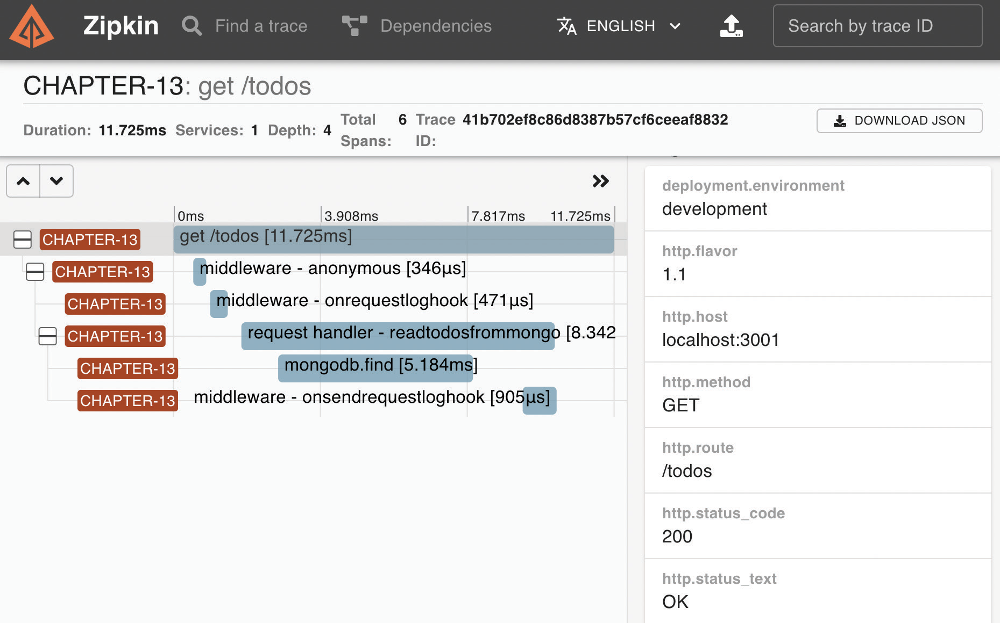
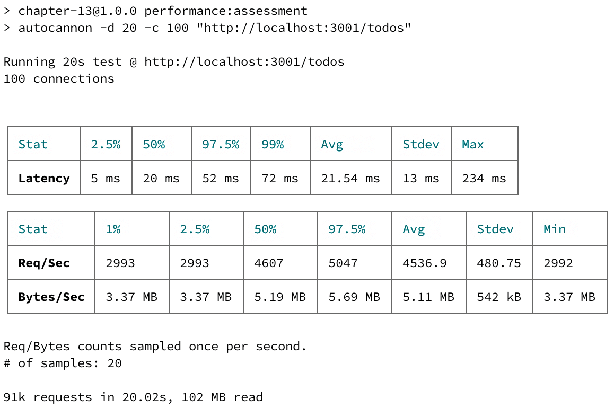
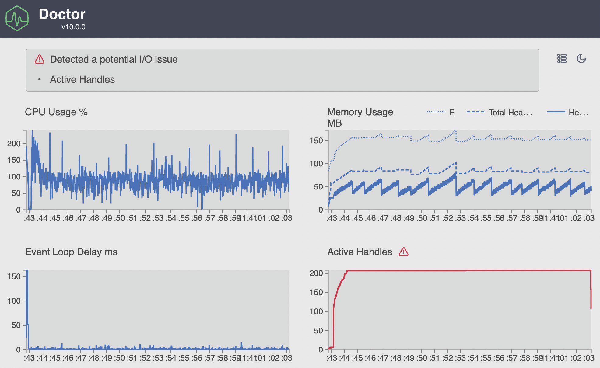
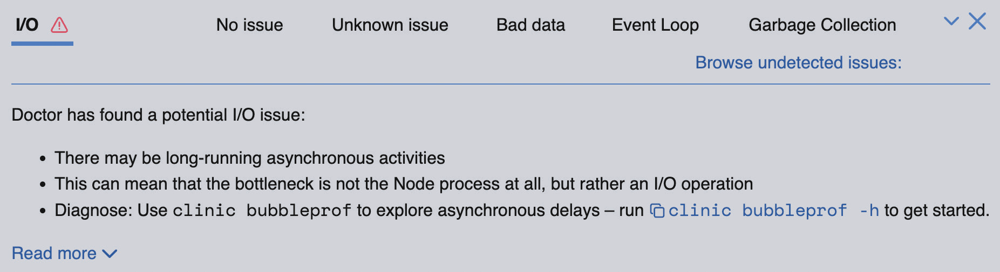
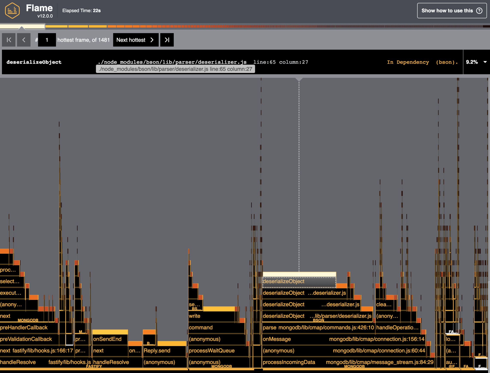
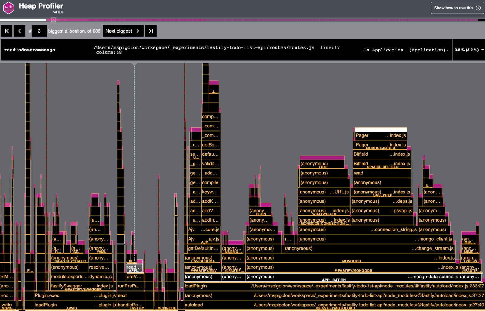
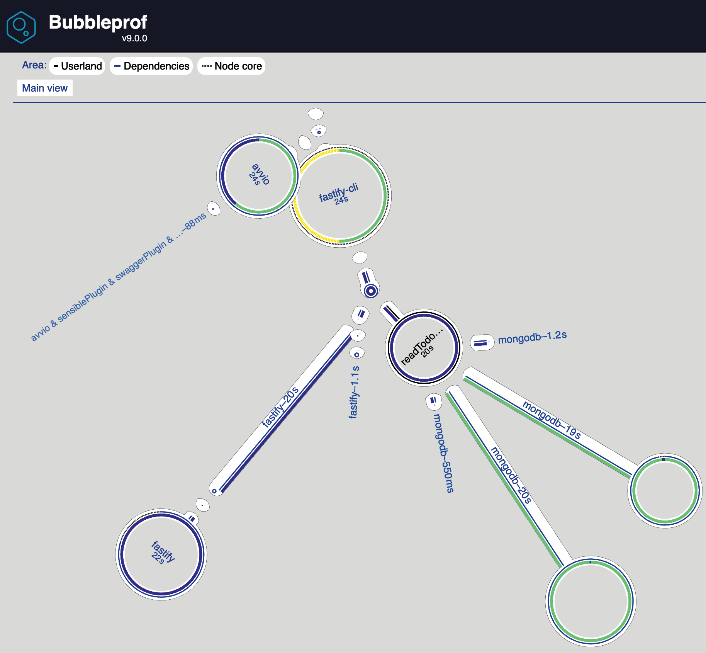
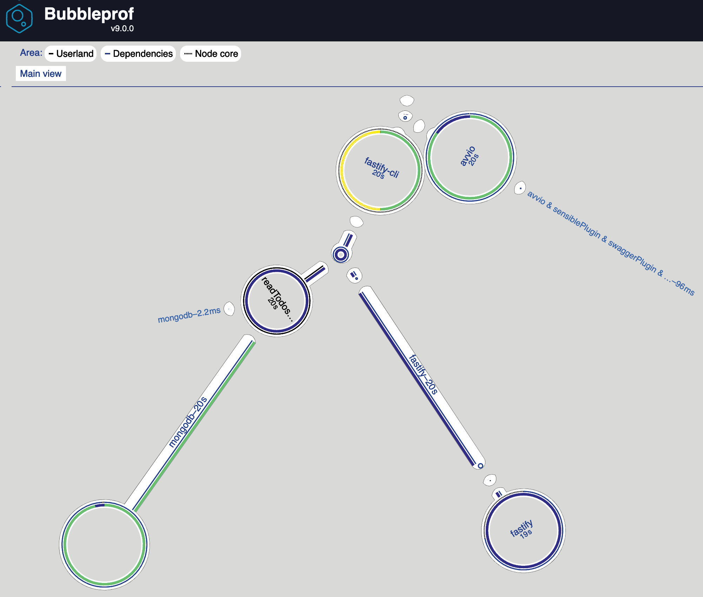
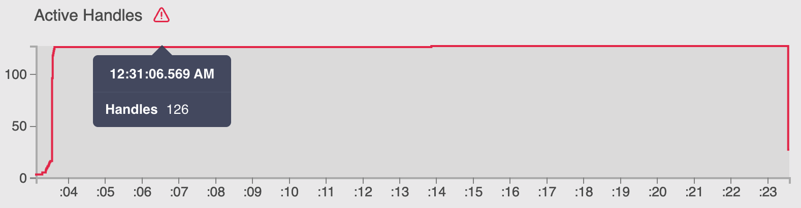

# Оценка и улучшение производительности

<big>Мы все знаем, что Fastify работает быстро, но достаточно ли быстр ваш код для Fastify? Узнайте, как измерить **производительность вашего приложения**, чтобы повысить его ценность для бизнеса и качество кода.</big>

Анализируя метрики, вы сможете избежать регрессии скорости и выявить узкие места или утечки памяти, которые могут привести к краху вашей системы. Вы узнаете, как добавить библиотеку инструментов в приложение Fastify, чтобы проанализировать реакцию сервера на большой объем трафика. Мы получим общее представление о том, как понимать и действовать в зависимости от результатов измерений для поддержания производительности сервера и его здорового состояния.

Именно этот путь обучения мы пройдем в этой главе:

-   Зачем измерять производительность?
-   Как измерить производительность приложения
-   Как анализировать данные
-   Как оптимизировать приложение

!!!info "Технические требования"

    Как уже упоминалось в предыдущих главах, вам понадобится следующее:

    -   Рабочая установка Node.js 18
    -   [VS Code IDE](https://code.visualstudio.com/)
    -   Рабочая командная оболочка

    :material-source-repository: Все фрагменты в этой главе находятся на [GitHub](https://github.com/PacktPublishing/Accelerating-Server-Side-Development-with-Fastify/tree/main/Chapter%2013).

## Зачем измерять производительность? {#why-measure-performance}

Приятно, конечно, пойти на ужин и впечатлить гостей, рассказав им, что наши API обслуживают 10 000 запросов в секунду, но никого не волнуют цифры, которые не приносят никакой пользы.

Производительность приложения влияет на бизнес компании во многих отношениях, которые часто недооцениваются, потому что проблему производительности нельзя заметить с первого взгляда, как это бывает с ошибками. На самом деле производительность отвечает за следующее:

-   Медленный API, что может привести к уходу клиентов с вашего сайта, как показано [в этом исследовании](https://www.shopify.com/enterprise/site-performance-page-speed-ecommerce).
-   Сервер в состоянии простоя во время высокой нагрузки, что является пустой тратой ресурсов, которая влияет на счет вашей инфраструктуры
-   Неоптимизированный код API, который может тратить ресурсы, влияющие на ваши расходы на инфраструктуру.

Поэтому, чтобы сэкономить деньги и открыть новые возможности для бизнеса, очень важно измерять производительность приложения, но как это сделать? Давайте разберемся в этом процессе.

Чтобы повысить производительность приложения, необходимо определить, с чего начать, и выбрать, в каком направлении двигаться. Цикл **Оптимизация** поможет вам в этом процессе и сосредоточится на решении:


<center>Рисунок 13.1 - Цикл оптимизации</center>

Каждый шаг - это ключ к улучшению производительности:

1.  **Измерение**: Мы должны определить базовый уровень, от которого следует отталкиваться, выбрав определенные **ключевые показатели эффективности (KPI)**, которые можно измерять и оценивать в дальнейшем.
2.  **Анализировать**: Нам нужно понять и изучить KPI, собранные на предыдущем этапе, чтобы определить, как их улучшить, и найти узкие места. Если KPI удовлетворяют нашим ожиданиям, мы можем просто наблюдать за их выполнением, не предпринимая никаких других действий.
3.  **Оптимизация**: Мы применяем необходимые действия, определенные на предыдущем этапе. Мы можем внести изменения в нашу кодовую базу или даже в архитектуру приложения. В конце концов, мы снова начнем с первого шага, чтобы оценить результаты.

Следуя этому циклу, вы сможете оценить производительность приложения и держать ее под контролем, чтобы избежать регрессии. Обратите внимание, что этот рабочий процесс адаптируется к любой сфере деятельности компании, от продаж до информационных технологий.

Мы увидели общую картину этой методологии, но что происходит, когда она действует? Об этом мы узнаем в следующем разделе.

## Как измерить производительность приложения? {#how-to-measure-an-applications-performance}

Следуя циклу оптимизации, первым шагом к улучшению чего-либо в любой сфере деятельности является установление базовой линии. Точка отсчета будет разной для каждого отдела компании. Например, отдел продаж будет измерять объем продаж или выручку с течением времени, чтобы установить цели по улучшению.

Итак, нам нужно определить, что стоит измерять, определив границы метрик нашего приложения. Понятно, что наша первая задача - выбрать, что измерять. Наиболее распространенными метриками являются следующие:

-   Время отклика HTTP и количество запросов
-   рейтинг ошибок
-   метрики процессов, такие как использование процессора, памяти и сборщика мусора.

Каждый пункт - это KPI. Каждый KPI требует своего подхода и анализа. Несмотря на различия, эти показатели тесно связаны между собой, поскольку неадекватное управление ресурсами влияет на задержку ответа, а высокий рейтинг ошибок может увеличить использование памяти.

Измерение KPI приложения - обязательный шаг в реализации **Обсервативности** приложения, то есть возможности понять состояние системы, проверив ее выходные данные.

!!!note "Наблюдаемость приложений"

    Концепции следующего раздела применимы как к целой системе, так и к отдельному приложению Node.js. В этой главе обсуждается Application Observability и ставится задача улучшить сам проект, поскольку мониторинг системы не входит в сферу применения этой книги. Тем не менее, то, что вы узнаете, будет ценно и пригодно для повторного использования при создании более совершенных систем.

Основу наблюдаемости составляют:

-   **Логи**: Вы можете узнать о состоянии и ходе выполнения приложения, читая и анализируя его выходные данные. Мы обсуждали это в [Главе 11](../real-project/logging.md).
-   **Метрики**: Это числовые представления значений, которые может собирать приложение. Они более надежны, готовы к обработке и легче хранятся. По сравнению с логами, они имеют неограниченный срок хранения. Вы собрали их в [главе 10](../real-project/deploy.md).
-   **Трассировка**: Представляет собой часть подробной информации из жизненного цикла запроса в системе. В следующем разделе мы рассмотрим пример [Измерение времени ответа HTTP](#measuring-the-http-response-time) с помощью инструментария приложения Fastify.

Все эти компоненты имеют общий логический костяк. Мы можем считать их сырыми логами разных форматов и свойств, которые имеют одну и ту же логику жизненного цикла, как мы видели в разделе [How to consolidate the logs](../real-project/logging.md#how-to-consolidate-the-logs) главы 11.

Список столпов упорядочен от наименее подробной до наиболее тонкой информации. Я считаю, что пример стоит больше, чем 10 000 слов, поэтому предположим, что нам нужно оценить конечную точку `POST /todo`, которую мы создавали начиная с [главы 7](../real-project/restful-api.md).

В этом случае в логах будет указано, когда начался запрос и когда он закончился, добавлена отладочная информация.

Метрика говорит нам о значении KPI в определенный момент времени. Например, она отвечает на вопрос, сколько тодо было создано на одного пользователя сегодня? Эту информацию легко обрабатывать, если вы хотите узнать среднее количество созданных _тодо_ и другую статистику.

Данные трассировки покажут нам, что запрос потратил 10 миллисекунд на получение данных из базы данных, 20 миллисекунд на вставку новых данных и еще 30 миллисекунд на отправку уведомления.

Чтобы лучше понять этот пример и оценить различия, давайте сосредоточимся на том, как измерять время ответа HTTP в следующем разделе.

### Измерение времени ответа HTTP {#measuring-the-http-response-time}

KPI времени отклика - это простой параметр, который легко понять даже нетехническим специалистам, и он обычно используется для описания состояния работоспособности API. Он показывает общее количество времени, которое приложение потратило на обработку HTTP-запроса и ответ клиенту.

Время отклика дает нам точный показатель в миллисекундах, позволяющий следить за временем работы каждой конечной точки. Заметив любое изменение в этом значении, мы можем оценить, положительно или отрицательно новая функция влияет на работоспособность маршрута. Затем мы можем действовать соответствующим образом, как мы увидим в разделе [Как анализировать данные](#how-to-analyze-the-data).

!!!note "Сетевые задержки"

    Время отклика API иногда может вводить в заблуждение, поскольку оно не включает дополнительные сетевые задержки, возникающие, если ваш сервер находится в другом регионе по отношению к клиенту. Обсуждение сложных архитектурных сценариев не входит в задачи этой книги. Если вы хотите углубиться в этот аспект, вы можете начать с прочтения этой [статьи](https://www.datadoghq.com/knowledge-center/infrastructure-monitoring/).

Мы уже измеряем общее время запроса, записывая в лог поле `responseTime`, как объясняется в [Главе 11](../real-project//logging.md). Эту информацию можно считывать непосредственно из производственной среды и постоянно проверять. Более того, это помогает нам определить, какие API имеют приоритет над другими, поскольку они требуют большего внимания. Этот аспект полезен, учитывая, что мы не можем сосредоточиться на сотнях конечных точек одновременно, поэтому эта информация поможет нам определить приоритетность определенных API.

Время отклика не является подробной информацией, поскольку это сумма всех действий, выполняемых нашей конечной точкой для ответа на запрос клиента. Например, если наш API выполняет запрос к базе данных и внешний HTTP-вызов к стороннему API, какая из этих двух операций займет больше времени?

Поскольку мы организуем данные для их анализа на следующем этапе цикла оптимизации, мы должны собрать больше информации, **отслеживая** приложение; в противном случае задача анализа будет сложнее, и оптимизация может оказаться неудачной.

!!!note "Отслеживание выборки"

    Если логи требуют больших затрат ресурсов, то трассировка обходится еще дороже, поскольку создает огромные объемы данных. По этой причине при работе с трассировкой обязательно нужно задавать конфигурацию выборки. В этом разделе вы увидите пример.

Теперь, когда мы знаем, что мы хотим измерять, мы можем начать модернизацию нашего приложения Fastify.

### Инструментирование приложения Fastify {#instrumenting-the-fastify-application}

Чтобы отследить любое приложение Fastify, целесообразно принять [спецификацию **OpenTelemetry**](https://opentelemetry.io/), продвигаемую Linux Foundation. Она предоставляет набор общих механизмов для генерации, сбора и экспорта телеметрических данных, таких как метрики и информация о трассировке. Несмотря на то, что в настоящее время лог не поддерживается этим инструментом, мы в безопасности, поскольку уже настроили лог приложения в [Глава 11](../real-project/logging.md).

Приняв спецификацию OpenTelemetry, вы сможете включить модули, реализующие этот стандарт, и ваше приложение будет экспортировать метрики и данные трассировки в хорошо известном формате. Выбирая этот подход, вы отделяете данные телеметрии от **инструмента мониторинга производительности приложений (APM)**. Программное обеспечение APM является обязательным инструментом для анализа данных трассировки. Оно обеспечивает простой способ просмотра данных телеметрии и их отображения в виде графиков и четких визуализаций. Иначе было бы невозможно понять необработанные данные трассировки и связи внутри них.

Настало время написать код! Вкратце о том, что мы собираемся делать, можно описать следующие шаги:

1.  Интегрируйте модули OpenTelemetry в ваше приложение для составления списка дел Fastify.
2.  Визуализируйте данные телеметрии с помощью Zipkin, системы трассировки с открытым исходным кодом. Она менее мощная, чем коммерческий APM, но это бесплатное решение для каждого разработчика, начинающего этот путь.
3.  Улучшение трассировки и метрической информации.

Прежде чем мы начнем, необходимо установить все необходимые пакеты OpenTelemetry, поэтому вам нужно выполнить следующую команду установки:

```sh
npm install @opentelemetry/api@1.3.0 @opentelemetry/exporter-
zipkin@1.8.0 @opentelemetry/instrumentation@0.34.0 @opentelemetry/
instrumentation-dns@0.31.0 @opentelemetry/instrumentation-
fastify@0.31.0 @opentelemetry/instrumentation-http@0.34.0 @
opentelemetry/instrumentation-mongodb@0.33.0 @opentelemetry/sdk-
node@0.34.0 @opentelemetry/sdk-trace-node@1.8.0 @opentelemetry/
semantic-conventions@1.8.0
```

Модулей много, но мы собираемся использовать их все в предстоящем сценарии. Нам нужно создать новый файл `configs/tracing.js`, который будет содержать всю логику трассировки.

Скрипт будет разбит на три логических блока. Первый посвящен импорту:

```js
const packageJson = require('../package.json');
// [1]
const {
    NodeTracerProvider,
} = require('@opentelemetry/sdk-trace-node');
const {
    SemanticResourceAttributes,
} = require('@opentelemetry/semantic-conventions');
const { Resource } = require('@opentelemetry/resources');
const {
    ParentBasedSampler,
    TraceIdRatioBasedSampler,
} = require('@opentelemetry/sdk-trace-base');
// [2]
const {
    registerInstrumentations,
} = require('@opentelemetry/instrumentation');
const {
    DnsInstrumentation,
} = require('@opentelemetry/instrumentation-dns');
const {
    HttpInstrumentation,
} = require('@opentelemetry/instrumentation-http');
const {
    FastifyInstrumentation,
} = require('@opentelemetry/instrumentation-fastify');
const {
    MongoDBInstrumentation,
} = require('@opentelemetry/instrumentation-mongodb');
// [3]
const {
    BatchSpanProcessor,
} = require('@opentelemetry/sdk-trace-base');
const {
    ZipkinExporter,
} = require('@opentelemetry/exporter-zipkin');
```

Утверждения `require` - это в основном модули, `[1]`, которые предоставляют API OpenTracing для настройки системы. Требования, `[2]`, - это классы `Instrumentation`, которые помогут нам отследить некоторые пакеты для использования, экономя наше время и обеспечивая отличную отправную точку. Через некоторое время мы увидим результат. Наконец, компонент `Exporter`, `[3]`, отвечает за отправку данных трассировки в любую систему.

!!!note "Как использовать собственный APM"

    Как уже объяснялось ранее, для визуализации данных трассировки мы будем использовать Zipkin. Если вы хотите использовать коммерческий APM, такой как DataDog или Instana, вам придется заменить экспортер Zipkin в файле `tracing.js`. Полный список экспортеров вы можете найти в официальной документации [OpenTelemetry documentation](https://opentelemetry.io/registry/?language=js&component=exporter) или у вашего поставщика APM.

Второй логический блок кода - это конфигурация OpenTelemetry:

```js
const sdk = new NodeTracerProvider({
    sampler: new ParentBasedSampler({
        root: new TraceIdRatioBasedSampler(1),
    }),
    resource: new Resource({
        [SemanticResourceAttributes.DEPLOYMENT_ENVIRONMENT]:
            process.env.NODE_ENV,
        [SemanticResourceAttributes.SERVICE_NAME]:
            packageJson.name,
        [SemanticResourceAttributes.SERVICE_VERSION]:
            packageJson.version,
    }),
});
registerInstrumentations({
    tracerProvider: sdk,
    instrumentations: [
        new DnsInstrumentation(),
        new HttpInstrumentation(),
        new FastifyInstrumentation(),
        new MongoDBInstrumentation(),
    ],
});
```

В конфигурации есть параметр `resource` для настройки основных метаданных, которые будут отображаться для каждой трассировки. Массив `instrumentations` вставляет код в основной модуль нашего приложения, такой как http-пакет Node.js или установка `fastify` для мониторинга нашего приложения.

Как правило, эти классы выполняют **monkey patching** - эта техника модифицирует внутренний кэш Node.js и действует как «человек посередине». Хотя некоторые версии Node.js предоставляют экспериментальные модули `async_hook` и `trace_events`, monkey patching по-прежнему широко используется пакетами трассировки. Опция `sampler` - это контроллер для фильтрации определенных событий трассировки, чтобы уменьшить объем хранимых данных. Пример конфигурации представляет собой фильтр pass-all, который вам нужно будет настроить после того, как вы станете более уверенно использовать этот инструмент.

Последний блок кода, завершающий файл `tracing.js`, предназначен для использования переменной `sdk`:

```js
const exporter = new ZipkinExporter({
    url: 'http://localhost:9411/api/v2/spans',
});
sdk.addSpanProcessor(new BatchSpanProcessor(exporter));
sdk.register({});
console.log('OpenTelemetry SDK started');
```

Сначала `exporter` будет передавать или выставлять данные любой внешней системе. Обратите внимание, что если `exporter` передает данные, то он реализует логику Push. Если же `exporter` раскрывает HTTP-маршрут (который внешняя система должна вызвать, чтобы получить данные), то он реализует логику Pull.

Функция `register` применяет обезьяньи патчи к модулям нашего приложения, чтобы начать получать все трассировки. Ее архитектура, скрипт OpenTelemetry, должна быть запущена до загрузки нашего приложения, поэтому нам нужно отредактировать стартовый скрипт `package.json`, добавив новый аргумент:

```
"start": "fastify start --require ./configs/tracing.js -l info --options app.js",
```

Таким образом, скрипт OpenTelemetry будет запущен раньше приложения Fastify. По этой причине плагин `@fastify/env` запустится не сразу, и нам может потребоваться загрузить файл `.env` в наш файл `tracing.js`.

!!!note "Стандартные аргументы Node.js"

    Fastify CLI эмулирует аргумент `--require` в Node.js CLI. По этой причине, если вы не используете Fastify CLI, вы можете использовать ту же опцию для интеграции OpenTelemetry в ваше приложение. Более подробную информацию можно найти в [официальной документации](https://nodejsdev.ru/api/cli/#-r-require-module).

На данном этапе мы все еще можем запускать наше приложение как обычно с помощью `npm start`, но без сохранения данных трассировки, поскольку `exporter` еще не настроен. Давайте посмотрим, как это сделать.

### Визуализация данных трассировки {#visualizing-the-tracing-data}

Мы вполне готовы начать трассировку, но нам нужен экземпляр Zipkin в нашей системе. Мы можем использовать `docker` для этой задачи. Добавьте эти новые команды утилиты в `package.json`:

```
    "zipkin:start": "docker run --rm --name fastify-zipkin -d -p
9411:9411 openzipkin/zipkin:2",
    "zipkin:stop": "docker container stop fastify-zipkin",
```

После этого выполните команду `npm run zipkin:start` в вашей оболочке, и вы сможете обратиться к URL `http://localhost:9411/zipkin` через браузер.

После выполнения команды `npm run mongo:start && npm start` приложение готово к вызову конечной точки `GET /todos`, и, нажав кнопку **RUN QUERY** в Zipkin, вы увидите следующий результат:


<center>Рисунок 13.2 - Домашняя страница Zipkin</center>

На главной странице Zipkin мы видим обзор всех логов, которые мы перехватываем из нашего приложения. Теперь, если вы нажмете кнопку **SHOW** для конечной точки `GET /todos`, вы сможете увидеть подробности:



<center>Рисунок 13.3 - Страница детализации запроса</center>

На странице подробностей вы получите полный обзор выполненных хуков и сможете оценить время выполнения каждого шага вашего обработчика.

!!!note "Важность именованных функций"

    На _Рисунке 13.3_ вы видите анонимную промежуточную функцию: хук внутри стрелочной функции. Помните, что когда в этом нет острой необходимости, вы можете принять именованную функцию для чтения имен функций в вашем APM-программе, и это сделает отладку намного более гладкой. На _Рисунке 13.3_ мы также можем видеть `onrequestloghook`, который мы определили в [Главе 11](../real-project/logging.md).

Теперь мы можем использовать пользовательский интерфейс Zipkin в качестве отправной точки для поиска конечных точек, которые требуют последующего анализа и могут быть оптимизированы. Многие коммерческие APM-инструменты предлагают функции мониторинга и отправки оповещений напрямую, без необходимости копаться в исходных данных. В этом разделе мы рассмотрели основные понятия, которые помогут вам выбрать решение, соответствующее вашим потребностям. Приняв спецификацию OpenTelemetry, ваше приложение не будет зависеть от производителя.

Поздравляем - теперь мы можем измерить детали выполнения каждого маршрута. Мы можем перейти к следующей фазе цикла оптимизации: анализу.

## Как анализировать данные {#how-to-analyze-the-data}

После завершения цикла оптимизации мы должны проанализировать результаты измерений, чтобы понять следующее:

-   Можно ли улучшить производительность приложения?
-   На чем следует сосредоточиться в первую очередь?
-   Как мы можем ее улучшить?
-   Где находится узкое место?

Например, если мы проанализируем _Рисунок 13.3_, обработчик тратит большую часть времени на операцию `find` в MongoDB. Это означает, что мы должны сосредоточиться на этой части, пытаясь проверить, применимо ли следующее:

-   правильно ли мы установили пул соединений
-   Мы создали выделенный индекс.

На основании того, так это или нет, можно определить некоторые границы, которые могут быть оптимизированы на следующем этапе цикла оптимизации.

Конечно, при мониторинге всех маршрутов приложения нам понадобится множество фильтров, чтобы выбрать все маршруты, требующие нашего внимания, например медленные конечные точки или API с высоким уровнем ошибок.

Обратите внимание, что иногда данные не могут быть такими подробными, как в этом примере. Допустим, измерения показывают, что одна конкретная конечная точка работает ужасно. В этом случае мы должны детально проанализировать целевой обработчик.

Чтобы детально проанализировать его, нам помогут определенные инструменты. Начнем с определения локальной базовой линии с помощью [autocannon](https://www.npmjs.com/package/autocannon). Этот модуль представляет собой инструмент бенчмаркинга для стресс-тестирования конечной точки. Давайте посмотрим на результат, выполнив команды:

```sh
npm install autocannon@7 -g
npm pkg set scripts.performance:assessment="autocannon -d 20 -c 100"
npm run performance:assessment -- http://localhost:3000/todos
```

Эта оценка производительности запустит 100 соединений в течение 20 секунд и выдаст отличный отчет следующим образом:



<center>Рисунок 13.4 - Отчет по автопушке</center>

На данный момент у нас есть базовый показатель: конечная точка `GET /todos` на _нашей рабочей машине_ в среднем обрабатывает около 4500 запросов в секунду и имеет задержку в 20 миллисекунд. Конечно, абсолютного значения, к которому следует стремиться, не существует; оно полностью зависит от бизнес-логики API и его потребителей. В качестве общего правила можно сказать следующее:

-   Приблизительно до 150 миллисекунд задержки API является отзывчивым
-   До 300 миллисекунд API является приемлемым.
-   Если задержка составляет 1 000 миллисекунд и выше, API может негативно повлиять на ваш бизнес.

Теперь мы можем поискать более подробную информацию, установив новый инструмент: [Clinic.js](https://clinicjs.org/). Следующие команды выполняются для установки модуля и сохранения некоторых новых скриптов `package.json`:

```sh
npm install clinic@12 -D
npm pkg set scripts.clinic:doctor="clinic doctor --on-port 'autocannon
-d 20 -c 100 http://localhost:3000/todos' -- node index.js"
npm run clinic:doctor
```

Команда `clinic:doctor` выполнит следующие действия:

1.  Запустит приложение.
2.  Запустите тест `autocannon`.
3.  Построение и открытие отличного HTML-отчета автоматически при остановке приложения вручную.

Возможно, вы заметили использование `node index.js` в скрипте `clinic:doctor`. К сожалению, Clinic.js не поддерживает никаких команд, кроме node. По этой причине необходимо создать новый файл `index.js` в корневом каталоге проекта, как показано ниже:

```js
const { listen } = require('fastify-cli/helper');
const argv = ['-l', 'info', '--options', 'app.js'];
listen(argv);
```

В предыдущем сценарии инициализация `tracing.js` пропущена, поскольку в центре внимания этого этапа анализа находится одна конечная точка или аспект приложения, а инструментарий трассировки может затруднить наш глубокий анализ, поскольку он добавляет шум в результаты, показанные на _рисунке 13.5_.

По завершении команды `clinic:doctor` в вашем браузере должно появиться нечто похожее на этот график:



<center>Рисунок 13.5 - Вывод отчета Clinic.js</center>

Как видите, Clinic.js очень подробен и предоставляет нам обзор всей работы. Он настолько умен, что даже подсказывает нам, на чем и почему следует сосредоточить внимание:



<center>Рисунок 13.6 - Предложения Clinic.js</center>

Читая вывод Clinic.js, мы можем получить общее представление о нашем приложении, пока `autocannon` проводит его стресс-тестирование. Мы можем углубиться в каждый график из этой общей картины с помощью команд Clinic.js в следующих разделах.

### Создание графика пламени {#creating-a-flame-graph}

Когда использование процессора и цикла событий слишком велико, могут возникнуть проблемы с нашей кодовой базой или внешними модулями, установленными в нашем приложении. В этом случае нам нужно построить **пламенный график**, который показывает время выполнения функций в процентах. Абстрагируясь от времени, легче найти узкое место.

В качестве примера мы можем выполнить следующую команду:

```
clinic flame --on-port 'autocannon -d 20 -c 100 http://localhost:3000/todos' -- node index.js
```

После его запуска вы увидите что-то вроде следующего:



<center>Рисунок 13.7 - График пламени</center>

На графике, приведенном на предыдущем рисунке, показано работающее приложение. Ось x представляет собой все время выполнения, каждый столбик - стек вызовов функций, а длина столбика - время, затраченное процессором на каждую функцию. Это означает, что чем шире полоса, тем больше функция замедляет работу нашего приложения, поэтому мы должны стремиться к толстым полосам.

В качестве эксперимента мы можем модифицировать обработчик `GET /todos`, чтобы замедлить работу функции-обработчика и посмотреть на график плохого пламени в качестве сравнения, поэтому давайте добавим эту строку кода в файл `routes/routes.js`:

```js
fastify.get('/todos', {
    handler: async function readTodosFromMongo(
        request,
        reply
    ) {
        require('fs').readFileSync(__filename); // waste CPU cycles
        // ...
    },
});
```

После этого изменения кода мы можем повторно запустить команду `clinic flame` и ждать отчета:


<center>Рисунок 13.8 - Нездоровый график пламени</center>

Как видно на _Рисунке 13.8_, значительная горизонтальная полоса занимает около 27 % времени процессора! Это функция, которую необходимо оптимизировать. Прочитав стек вызовов функции, мы сразу же найдем источник проблемы - файл `routes/routes.js` - и исправим код.

Граф пламени - это мощный инструмент для поиска проблем, связанных с нашей кодовой базой, и решения проблем с высоким использованием процессора и высокой задержкой цикла событий.

Мы еще не закончили с командами Clinic.js - давайте погрузимся в следующий раздел, чтобы узнать следующее.

### Как проверить проблемы с памятью {#how-to-check-memory-issues}

Отчет `clinic doctor` на _Рисунке 13.5_ показывает использование памяти с течением времени. Он помогает понять, есть ли в нашем приложении **утечка памяти**, которая может привести к исчерпанию памяти или краху процесса. Утечка памяти происходит, когда программа выделяет память системы, определяя переменные или закрытия, а после ее использования сборщик мусора Node.js не может освободить выделенную память. Обычно такая ситуация возникает, когда код не освобождает инстанцированные объекты.

На _Рисунке 13.5_ мы видим положительное поведение памяти, так как ее тенденция стабильна, потому что среднее значение не растет со временем, как вы можете видеть на _Рисунке 13.10_. Падения, которые вы видите на этом же рисунке, вызваны работой сборщика мусора Node.js, который освобождает память неиспользуемых объектов. На том же рисунке в правом верхнем углу графика мы видим три линии:

-   **Resident Set Size (RSS)**: Общий объем оперативной памяти, выделенный для выполнения процесса. Сюда входит исходный код, объекты ядра Node.js и стек вызовов.
-   **Общая выделенная куча**: Выделенная память, которую мы можем использовать для инстанцирования ресурсов приложения.
-   **Используемая куча**: Общий размер реально используемого пространства кучи, которое содержит все объекты, строки и закрытия приложения.

Я не буду утомлять вас тем, как работает Node.js и движок V8 под ним, но, возможно, вам будет интересно углубиться в эту тему, прочитав эту [статью](https://deepu.tech/memory-management-in-v8/).

Clinic.js дает нам еще один инструмент для проверки использования памяти приложением. Попробуйте выполнить команду `heap`:

```
clinic heap --on-port 'autocannon -d 20 -c 100 http://localhost:3000/todos' -- node index.js
```

Как обычно, в ответ мы получаем прекрасный отчет следующего содержания:



<center>Рисунок 13.9 - Граф кучи</center>

Использование памяти приложением на _Рисунке 13.9_ можно представить в виде пламенного графика, о чем говорилось в разделе [Создание пламенного графика](#creating-a-flame-graph). Ось x представляет собой общий объем выполнения нашего приложения, и чем больше столбик функции, тем больше памяти ей выделено. В этом случае мы также должны проверить самый большой столбик, чтобы сократить использование памяти.

Например, давайте попробуем добавить утечку памяти в маршрут `GET /todos`:

```js
const simpleCache = new Map();
fastify.get('/todos', {
    handler: async function readTodosFromMongo(
        request,
        reply
    ) {
        const cacheKey = 'todos-' + request.id;
        if (simpleCache.has(cacheKey)) {
            return simpleCache.get(cacheKey);
        }
        const todos = Array.from(1e6).fill('*');
        simpleCache.set(cacheKey, todos);
        return todos;
    },
});
```

В предыдущем, ошибочном примере кода мы хотели добавить слой кэша, чтобы уменьшить количество выполняемых запросов. К сожалению, мы создали `cacheKey` с опечаткой. По этой причине проверка `simpleCache.has()` всегда будет ложной, а объект `simpleCache` будет продолжать добавлять новые ключи. Более того, мы не реализовали метод очистки кэша, поэтому объект `simpleCache` будет продолжать расти. Выполнив сначала команду `clinic`, мы получим четкий график утечки памяти:


<center>Рисунок 13.10 - Обзор утечек памяти</center>

Однако если вместо этого мы выполним команду `clinic heap`, то получим более точные сведения о возникшей проблеме:


<center>Рисунок 13.11 - Подробности утечки памяти</center>

Взглянув на график кучи, мы видим три большие горизонтальные полосы, вызванные нашей неправильной реализацией кэширования. Команда heap имеет решающее значение для решения проблем с памятью, поскольку ее возможности указывают нам правильное направление. Clinic.js предоставляет нам фантастический инструмент, но сюрпризы еще не закончились. Давайте посмотрим еще один полезный инструмент.

### Как определить ресурсы ввода-вывода {#how-to-identify-io-resources}

На рисунке 13.5\_ показан график **Active Handles**, который подсчитывает файловые дескрипторы, открытые как файлы и сокеты. Он предупреждает нас о необходимости держать под контролем ресурсы ввода-вывода. На самом деле, мы провели тест `autocannon` и установили 100 одновременных соединений, так почему же этот график показывает нам 200 активных обработчиков?

Чтобы выяснить это, нам нужно воспользоваться командой `clinic bubble`:

```
clinic bubble --on-port 'autocannon -d 20 -c 100 http://localhost:3000/todos' -- node index.js
```

Отчет «Пузырь» - это новый вид отчета, который отличается от предыдущих построенных нами графиков. Вот вывод:



<center>Рисунок 13.12 - Отчет в виде пузырька</center>

Каждый пузырек представляет собой время ввода/вывода, поэтому чем больше пузырек, тем больше времени вам придется на него потратить. На самом деле этот график выглядит довольно хорошо. Нет очевидного большего пузыря для анализа, но если вы присмотритесь, то увидите, что зеленые пузыри оба связаны с MongoDB, и один из них - самый большой.

!!!note "Устранение неполадок"

    Чтобы сгенерировать графики пузырьков, вам нужно будет отключить логгер Fastify. Clinic.js не поддерживает рабочие потоки Node.js, а модуль логгера pino использует эти возможности. Такая несовместимость приведет к появлению нечитаемых графиков. Кроме того, при генерации отчета вы можете столкнуться с ошибкой `Analysing dataError: premature close`. Это известная проблема, зависящая от операционной системы и версии Node.js, как [описано здесь](https://github.com/clinicjs/node-clinic-bubbleprof/issues/399). В качестве решения можно вручную применить быстрое исправление.

Нажав на пузырек, мы можем изучить график и заметить, что асинхронная операция `"makeConnection@mongodb"` выполняется медленнее всего. Здесь у нас нет четкого решения, как в случае с предыдущими графиками кучи и пламени, но нам нужно подумать о подсказках, которые дает нам этот пузырьковый график.

Если присмотреться к конфигурации MongoDB, то мы не устанавливали никаких опций, а прочитали значения клиента по умолчанию с [официального сайта](https://www.mongodb.com/docs/drivers/node/current/fundamentals/connection/#connection-options).

Мы видим, что опция `maxPoolSize` по умолчанию равна 100. Это все объясняет! Clinic.js показывает нам 100 сокетов, открытых autocannon, и 100 соединений, открытых к MongoDB! Это явная ошибка в конфигурации, поскольку мы хотим ограничить количество соединений, открытых для сторонних систем. Мы можем исправить файл `plugins/mongo-data-source.js` с помощью следующих опций:

```js
fastify.register(fastifyMongo, {
    forceClose: true,
    maxPoolSize: 20,
    minPoolSize: 10,
    url: fastify.secrets.MONGO_URL,
});
```

Теперь, если мы повторно выполним команду `bubble`, мы увидим, что большой пузырь исчез:



<center>Рисунок 13.13 - Проблема с подключением к MongoDB решена</center>

Новый пузырьковый график выглядит даже лучше, чем на _Рисунок 13.12_, и, проверив новый прогон доктора, мы можем сказать, что счетчик **Active Handles** соответствует ожиданиям и находится под контролем:



<center>Рисунок 13.14 - Активные обработчики после настройки максимального пула MongoDB</center>

На предыдущем рисунке показано 100 соединений и максимум 20 соединений с MongoDB. Такая оптимизация защитит нашу базу данных от потенциальных атак, цель которых - насытить сеть системы и повторно использовать соединение из пула, экономя время.

Команда `bubble` - это последний секрет, который раскрыл нам Clinic.js. Надеюсь, с этого момента у вас появится новая точка зрения на конфигурацию вашего приложения и все его движущиеся части.

В следующем разделе мы рассмотрим последний шаг цикла оптимизации.

## Как оптимизировать приложение {#how-to-optimize-the-application}

Чтобы оптимизировать приложение, мы должны начать с результатов фазы анализа рабочего процесса цикла оптимизации. Действия, которые мы можем предпринять, очень разнообразны:

-   **Не предпринимать никаких действий**: Анализ данных показывает, что оптимизация невозможна или не стоит усилий по улучшению производительности.
-   **Оптимизация кодовой базы**: Данные говорят нам, что в нашей кодовой базе есть плохие алгоритмы или плохая реализация бизнес-логики, и мы можем переписать ее, чтобы ускорить работу сервера
-   **Архитектурные действия**: Данные указывают на узкое место в системе, например на устаревшую базу данных.
-   **Настройка конфигурации**: Анализ показывает, что изменение конфигурации может повысить производительность.

Шаг **Не действовать** постоянно пересматривается на основе данных, которые мы будем продолжать измерять и анализировать с течением времени.

Для каждого типа действий необходимо получить свои знания. Работа в фантастической и разнородной команде помогает охватить все эти аспекты, которые не всегда связаны с повседневной работой разработчика. В разделе [Как анализировать данные](#how-to-analyze-the-data) мы уже видели пример для каждого случая использования:

-   **Оптимизация кодовой базы**: Решается с помощью пламенного графа
-   **Архитектурные действия**: Это решается внедрением кэша для уменьшения количества запросов к базе данных
-   **Настройка конфигурации**: Пузырьковый граф помогает нам найти правильную конфигурацию для MongoDB.

По этой причине мы сосредоточимся на оптимизации кодовой базы, упомянув все лучшие практики и общие проблемы, которые я обнаружил в своем опыте многих и многих часов, проведенных за анализом данных метрик. В следующих разделах собраны предложения и идеи, которые вам необходимо знать.

### Внутренние компоненты Node.js, которые вам нужно знать {#nodejs-internals-that-you-need-to-know}

Объектная модель JavaScript основана на внутренних концепциях конструкций `Shape`. Каждый объект имеет как минимум одну конструкцию `Shape`, которая сопоставляет свойства объекта со смещением памяти, где хранится значение. Объекты могут совместно использовать одну и ту же `Shape`, что приводит к повышению производительности за счет сокращения использования памяти и доступа к ней.

Проблемы возникают, когда объект вроде бы имеет одну `Shape`, но из-за банальной ошибки в кодировании создается несколько конструкций `Shape`. Таким образом, каждый раз, когда вы мутируете `Shape`, добавляя или удаляя свойства, вы влияете на общую производительность приложения.

Поэтому, если в ходе анализа были обнаружены проблемы с памятью, например частая сборка мусора, следует проверить, как строятся и обрабатываются объекты в приложении.

Как правило, все свойства объекта следует объявлять во время объявления. Ниже приведен неоптимизированный код:

```js
const object = {};
if (something()) {
    object.value = 1;
} else {
    object.key = 'value';
    object.value = 2;
}
```

Чтобы оптимизировать предыдущий фрагмент кода, достаточно написать: `const object = { value: undefined, key: undefined }`. Аналогично, если вы хотите удалить свойство, вы можете установить для него значение `undefined`.

Чтобы укрепить эти базовые понятия Node.js, вы можете обратиться к этому замечательному видео - <https://mathiasbynens.be/notes/shapes-ics> - снятому Матиасом Байненсом, разработчиком Google и членом TC39.

### Безопасность параллельной работы {#the-safety-of-parallel-running}

Иногда проще представить себе последовательность шагов, которые будет выполнять наше программное обеспечение, но это не так. Типичным примером является следующий:

```js
const user = await database.readUser(10);
const userTasks = await database.readUserTask(user);
const userNeeds = await database.readUserNeeds(user);
```

Это можно оптимизировать с помощью метода `Promise.all`:

```js
const [userTasks, userNeeds] = await Promise.all([
    database.readUserTask(user),
    database.readUserNeeds(user),
]);
```

Если у вас есть массив пользователей, вы можете сделать то же самое, но при этом вы должны оценить длину массива. Так, если ваш массив содержит более 100 элементов, вы не можете создать 1 000 промисов, поскольку это может привести к ошибке ограничения памяти, особенно если конечная точка вызывается несколько раз одновременно. Поэтому можно разбить массив на более мелкие и обрабатывать их по одной группе за раз. Для этой задачи отлично подходит модуль [`p-map`](https://www.npmjs.com/package/p-map).

### Управление соединениями {#connection-management-takeaways}

Когда мы работаем с внешней системой, мы должны учитывать, что установление соединения - это тяжелый процесс. По этой причине мы всегда должны знать, сколько соединений у нашего приложения со сторонними программами, и настраивать его соответствующим образом. Мой контрольный список выглядит следующим образом:

-   Поддерживает ли модуль Node.js внешней системы пул соединений?
-   Сколько одновременных пользователей должен обслуживать каждый экземпляр приложения?
-   Каковы лимиты подключений к внешней системе?
-   Можно ли настроить имя соединения?
-   Как настроена сеть сервера приложений?

Эти простые вопросы много раз помогали мне определить оптимальные настройки сети, в основном баз данных.

!!!note "Остерегайтесь преждевременной оптимизации"

    Теперь, когда вы знаете об оптимизации кода, вы можете попасть в ловушку преждевременной оптимизации. Эта ловушка делает вашу работу сложнее и напряженнее, если вы пытаетесь написать оптимизированное программное обеспечение. Поэтому, прежде чем писать код, который работает параллельно или кэширует большое количество данных, важно начать с написания простой функции-обработчика, которая просто работает.

Теперь вы знаете обо всех аспектах, о которых следует подумать, когда нужно оптимизировать производительность приложения.

## Резюме {#summary}

В этой плотной главе мы затронули множество концепций, которые помогут нам измерить, проанализировать и оптимизировать производительность приложения. Этот цикл оптимизации представляет собой практический рабочий процесс, которому нужно следовать шаг за шагом для решения этой сложной задачи, что может привести к отличным достижениям в бизнесе, таким как повышение продаж или общей удовлетворенности клиентов.

Теперь вы можете оценить модуль трассировки. Зная, как он работает, вы можете интегрировать его в любое приложение, чтобы начать процесс измерения. Вы также знаете, какое стороннее программное обеспечение вам понадобится для обработки и визуализации данных, например APM. Более того, теперь вы можете глубже изучить любую проблему производительности, детально проанализировав ее, при поддержке некоторых инструментов с открытым исходным кодом. И последнее, но не менее важное: обнаружив проблему, вы можете спланировать оптимизацию для ее решения и итеративно повысить производительность конечных точек вашего приложения.

Вы завершили этот путь к созданию производительного и поддерживаемого приложения Fastify! Пришло время запустить код в производство!

Далее следует последняя часть этой книги, в которой будут рассмотрены некоторые продвинутые темы. Первой из них будет GraphQL. В следующей главе вы узнаете о GQL и о том, как запустить его поверх вашего приложения Fastify.

Счастливого кодинга с Fastify!
