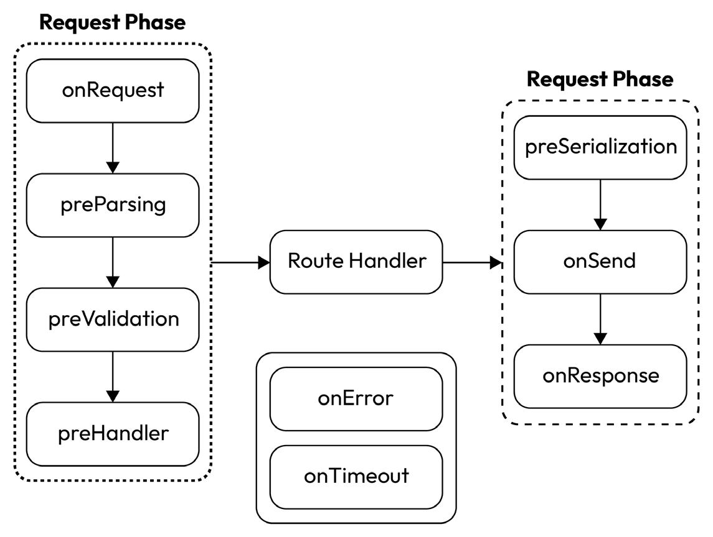

# Exploring Hooks

In this chapter, we will learn what makes Fastify different from the majority of other web frameworks. In fact, contrary to several other frameworks that have the concept of middleware, Fastify is based on **hooks**. They all have different use cases, and mastering their usage is key to developing stable and production-ready server applications.

Even if the topic is considered somehow complex, the goal of the subsequent sections is to give a good overview of how the Fastify framework “thinks” and build the right confidence in using these tools.

Before going into their details, though, we need to introduce another concept that makes everything even possible. Namely, we need to learn about the **lifecycle** of Fastify applications.

In this chapter, we will focus on these concepts:

-   What is a lifecycle?
-   Declaring hooks
-   Understanding the application lifecycle
-   Understanding the request and reply lifecycle

## Technical requirements

To follow this chapter, you will need the following:

-   A text editor, such as VS Code
-   A working Node.js v18 installation
-   Access to a shell such as Bash or CMD
-   The `curl` command-line application

All the code snippets for this chapter are available on GitHub at <https://github.com/PacktPublishing/Accelerating-Server-Side-Development-with-Fastify/tree/main/Chapter%204>.

## What is a lifecycle?

When talking about a lifecycle in the context of a framework, we refer to the order in which the functions are executed. The tricky part is that application developers write only a subset of its code while the rest is developed and bundled by the framework developers.

During the application execution, the function calls bounce between internal and user-written code, and it might be hard to follow what is going on. So, it comes naturally at this point that having deep knowledge of this subject is crucial.

The lifecycle depends on the architecture of the framework. Two well-known architectures are usually used to develop a web framework:

-   **Middleware-based architecture**: Thanks to its more manageable learning curve, this is the most known lifecycle architecture, but time has proved it to have some significant drawbacks. When working with this architecture, an application developer must care about the order of declaration of the middleware functions since it influences the order of execution at runtime. Of course, it can be hard to track the execution order in bigger and more complex applications across multiple modules and files. Moreover, writing reusable code might be more challenging because every moving part is more tidily coupled. As a final note, every middleware function will be executed at every cycle, whether needed or not.
-   **Hook-based architecture**: Fastify, unlike some other famous frameworks, implements a hook- based one. This kind of architecture was a precise design decision from day one since a hook system is more scalable and easier to maintain in the long run. As a nice bonus, since a hook only executes if needed, it usually leads to faster applications! However, it is worth mentioning that it is also harder to master. As we already briefly mentioned, we have different and specific components to deal with in a hook-based architecture.

For the rest of this chapter, we will talk in detail about hook-based architecture.

When dealing with web frameworks, there are usually at least two main lifecycles:

-   **The application lifecycle**: This lifecycle is in charge of the different phases of the application server execution. It mainly deals with the server boot sequence and shutdown. We can attach “global” functionalities that are shared between every route and plugin. Moreover, we can act at a specific moment of the lifecycle execution, adding a proper hook function. The most common actions we perform are after the server is started or before it shuts down.
-   **The request/reply lifecycle**: The request/response phase is the core of every client-server application. Almost the entirety of the execution time is spent inside this sole sequence. For this reason, this lifecycle usually has way more phases and therefore hooks we can add to it. The most common ones are content parsers, serializers, and authorization hooks.

Now that we understand more about the lifecycle types, we can spend the rest of the chapter learning how Fastify implements them.

## Declaring hooks

In the previous section, we saw that a server-side application usually has two main lifecycles. So, being a hook-based web framework and following its philosophy of giving complete control to developers, Fastify emits a specific event every time it advances to the next phase. Furthermore, these phases follow a rigid and well-defined execution order. Knowing it enables us to add functionality at a specific point during the boot or the execution of our application.

One essential and beneficial side effect of this approach is that, as developers, we don’t care about the declaration order of our hooks since the framework guarantees that they will be invoked at the right moment in time.

The mechanism described works because Fastify, under the hood, defines a “hook runner” that runs the callback functions declared for every known event. As developers, we need a method to attach our hooks to the Fastify instance. The `addHook` hook allows us to do precisely that, besides being an application or request/reply hook.

!!!note "Callback-based versus async hooks"

In [_Chapter 2_](./plugin-system.md), we saw that we could declare plugins with two different styles: callback-based and async functions. The same applies here. Again, it is essential to choose one style and stick with it. Mixing them can lead to unexpected behavior. As already decided in this book, we will use only async functions. One last thing to remember is that some hooks are only synchronous. We will clarify this when speaking about them.

As we can see in the following `add-hook.cjs` snippet method, it takes two arguments:

• A name of the event we want to listen • The callback function:

```js
// ...
fastify.addHook('onRequest', (...) => {})
// ...
```

Here, we omitted the callback’s signature and the return value since every hook has its own.

We can call `addHook` on the same event multiple times to declare more than one hook. In the following sections, we will learn all the events emitted by Fastify and describe every callback function in depth.

## Understanding the application lifecycle

The application lifecycle covers the boot process and the execution of our application server. In particular, we refer to loading the plugins, adding routes, making the HTTP server run, and eventually closing it. Fastify will emit four different events, allowing us to interact with the behavior of every phase:

-   `onRoute`
-   `onRegister`
-   `onReady`
-   `onClose`

Now, for every event of the previous list, let’s check the respective callback signature and most common use cases.

### The onRoute hook

The `onRoute` hook event is triggered every time a route is added to the Fastify instance. This callback is a **synchronous function** that takes one argument, commonly called `routeOptions`. This argument is a mutable object reference to the route declaration object itself, and we can use it to modify route properties.

This hook is encapsulated and doesn’t return any value. Therefore, one of the most common use cases is adding route-level hooks or checking for the presence of a specific option value and acting accordingly.

We can see a trivial example in `on-route.cjs`, where we add a custom route-level `preHandler` function to the route properties:

```js
const Fastify = require('fastify');
const app = Fastify({ logger: true });
app.addHook('onRoute', (routeOptions) => {
    // [1]
    async function customPreHandler(request, reply) {
        request.log.info('Hi from customPreHandler!');
    }
    app.log.info('Adding custom preHandler to the route.');
    routeOptions.preHandler = [
        ...(routeOptions.preHandler ?? []),
        customPreHandler,
    ]; // [2]
});
app.route({
    // [3]
    url: '/foo',
    method: 'GET',
    schema: {
        200: {
            type: 'object',
            properties: {
                foo: {
                    type: 'string',
                },
            },
        },
    },
    handler: (req, reply) => {
        reply.send({ foo: 'bar' });
    },
});
app.listen({ port: 3000 })
    .then(() => {
        app.log.info('Application is listening.');
    })
    .catch((err) => {
        app.log.error(err);
        process.exit();
    });
```

After setting up the Fastify instance, we add a new `onRoute` hook (`[1]`). The sole purpose of this hook is to add a route-level `preHandler` hook (`[2]`) to the route definition, even if there weren’t any previous hooks defined for this route (`[3]`).

Here, we can learn two important outcomes that will help us when dealing with route-level hooks:

-   The `routeOptions` object is mutable, and we can change its properties. However, if we want to keep the previous values, we need to explicitly re-add them (`[2]`).
-   Route-level hooks are arrays of hook functions (we will see more about this later in the chapter).

Now, we can check the output of the snippet by opening a new terminal and running the following command:

```sh
$ node on-route.cjs
```

This command will start our server on port `3000`.

Now we can use curl in a different terminal window to request the server and check the result in the server console:

```sh
$ curl localhost:3000/foo
```

We can search for the message `"Hi from customPreHandler!"` in the logs to check whether our customHandler was executed:

```
{"level":30,"time":1635765353312,"pid":20344,"hostname":"localhost","r
eqId":"req-1","msg":"Hi from customPreHandler!"}
```

This example only scratches the surfaces of the possible use cases. We can find the complete definition of the routeOptions properties in the official documentation (<https://www.fastify.io/docs/latest/Reference/Routes/#routes-options>).

### The onRegister hook

The `onRegister` hook is similar to the previous one regarding how it works, but we can use it when dealing with plugins. In fact, for every registered plugin that creates a new encapsulation context, the `onRegister` hooks are executed before the registration.

We can use this hook to discover when a new context is created and add or remove functionality; as we already learned, during the plugin’s registration and thanks to its robust encapsulation, Fastify creates a new instance with a child context. Note that this hook’s callback function won’t be called if the registered plugin is wrapped in `fastify-plugin`.

The `onRegister` hook accepts a synchronous callback with two arguments. The first parameter is the newly created Fastify instance with its encapsulated context. The latter is the `options` object passed to the plugin during the registration.

The following `on-register.cjs` snippet shows an easy yet non-trivial example that covers encapsulated, and non-encapsulated plugins use cases:

```js
const Fastify = require('fastify');
const fp = require('fastify-plugin');
const app = Fastify({ logger: true });
app.decorate('data', { foo: 'bar' }); // [1]
app.addHook('onRegister', (instance, options) => {
    app.log.info({ options });
    instance.data = { ...instance.data }; // [2]
});
app.register(
    async function plugin1(instance, options) {
        instance.data.plugin1 = 'hi'; // [3]
        instance.log.info({ data: instance.data });
    },
    { name: 'plugin1' }
);
app.register(
    fp(async function plugin2(instance, options) {
        instance.data.plugin2 = 'hi2'; // [4]
        instance.log.info({ data: instance.data });
    }),
    { name: 'plugin2' }
);
app.ready()
    .then(() => {
        app.log.info('Application is ready.');
        app.log.info({ data: app.data }); // [5]
    })
    .catch((err) => {
        app.log.error(err);
        process.exit();
    });
```

First, we decorate the top-level Fastify instance with a custom data object (`[1]`). Then we attach an `onRegister` hook that logs the `options` plugin and shallow-copy the `data` object (`[2]`). This will effectively create a new object that inherits the `foo` property, allowing us to have encapsulated the `data` object. At `[3]`, we register our first plugin that adds the `plugin1` property to the object. On the other hand, the second plugin is registered using `fastify-plugin` (`[4]`), and therefore Fastify will not trigger our `onRegister` hook. Here, we modify the data object again, adding the `plugin2` property to it.

!!!note "Shallow-copy versus deep copy"

    Since an object is just a reference to the allocated memory address in JavaScript, we can copy the objects in two different ways. By default, we “shallow-copy” them: if one source object’s property references another object, the copied property will point to the same memory address. We implicitly create a link between the old and new property. If we change it in one place, it is reflected in the other. On the other hand, deep-copying an object means that whenever a property references another object, we will create a new reference and, therefore, a memory allocation. Since deep copying is expensive, all methods and operators included in JavaScript make shallow copies.

Let’s execute this script in a terminal window and check the logs:

```sh
$ node on-register.cjs
{"level":30,"time":1636192862276,"pid":13381,"hostname":"localhost",
"options":{"name":"plugin1"}}
{"level":30,"time":1636192862276,"pid":13381,"hostname":"localhost",
"data":{"foo":"bar","plugin1":"hi"}}
{"level":30,"time":1636192862277,"pid":13381,"hostname":"localhost",
"data":{"foo":"bar","plugin2":"hi2"}}
{"level":30,"time":1636192862284,"pid":13381,"hostname":"localhost",
"msg":"Application is ready."}
{"level":30,"time":1636192862284,"pid":13381,"hostname":"localhost",
"data":{"foo":"bar","plugin2":"hi2"}}
```

We can see that adding a property in `plugin1` hasn’t any repercussions on the top-level data property. On the other hand, since `plugin2` is loaded using `fastify-plugin`, it has the same context as the main Fastify instance (`[5]`), and the `onRegister` hook isn’t even called.

### The onReady hook

The `onReady` hook is triggered after `fastify.ready()` is invoked and before the server starts listening. If the call to ready is omitted, then `listen` will automatically call it, and these hooks will be executed anyway. Since we can define multiple `onReady` hooks, the server will be ready to accept incoming requests only after all of them are completed.

Contrary to the other two hooks we already saw, this one is asynchronous. Therefore, it is crucial to define it as an async function or manually call the `done` callback to progress with the server boot and code execution. In addition to this, the `onReady` hooks are invoked with the `this` value bound to the Fastify instance.

!!!note "A bound this context"

    When dealing with Fastify functionalities that have an explicitly bound `this` value, as in the case of the `onReady` hook, it is essential to use the old function syntax instead of the arrow function one. Using the latter will prevent binding, making it impossible to access the instance and custom data added to it.

In the `on-ready.cjs` snippet, we show a straightforward example of the Fastify bound context:

```js
const Fastify = require('fastify');
const app = Fastify({ logger: true });
app.decorate('data', 'mydata'); // [1]
app.addHook('onReady', async function () {
    // [2]
    app.log.info(this.data);
});
app.ready()
    .then(() => {
        app.log.info('Application is ready.');
    })
    .catch((err) => {
        app.log.error(err);
        process.exit();
    });
```

At `[1]`, we decorate the primary instance with a dummy value. Then we add one `onReady` hook using the async function syntax. After that, we log the `data` value to show the bound this inside it (`[2]`).

Running this snippet will produce a short output:

```
{"level":30,"time":1636284966854,"pid":3660,"hostname":"localhost",
"msg":"mydata"}
{"level":30,"time":1636284966855,"pid":3660,"hostname":" localhost ",
"msg":"Application is ready."}
```

We can check that `mydata` is logged before the application is ready and that, indeed, we have access to the Fastify instance via `this`.

### The onClose hook

While the hooks we learned about in the last three sections are used during the boot process, on the other hand, `onClose` is triggered during the shutdown phase right after `fastify.close()` is called. Thus, it is handy when plugins need to do something right before stopping the server, such as cleaning database connections. This hook is asynchronous and accepts one argument, the Fastify instance. As usual, when dealing with async functionalities, there is also an optional `done` callback (the second argument) if the async function isn’t used.

In the `on-close.cjs` example, we choose to use the async function to log a message:

```js
const Fastify = require('fastify');
const app = Fastify({ logger: true });
app.addHook('onClose', async (instance) => {
    // [1]
    instance.log.info('onClose hook triggered!');
});
app.ready()
    .then(async () => {
        app.log.info('Application is ready.');
        await app.close(); // [2]
    })
    .catch((err) => {
        app.log.error(err);
        process.exit();
    });
```

After adding a dummy `onClose` ([1]) hook, we explicitly call `app.close()` on [2] to trigger it.

After running the example, we can see that the last thing logged is indeed the hook line:

```
{"level":30,"time":1636298033958,"pid":4257,"hostname":"localhost",
"msg":"Application is ready."}
{"level":30,"time":1636298033959,"pid":4257,"hostname":"localhost ",
"msg":"onClose hook triggered!"}
```

With the `onClose` hook, we have finished our discussion about the application-level lifecycle. Now, we will move to the more numerous and, therefore, exciting request-reply hooks.

## Understanding the request and reply lifecycle

When executing a Fastify server application, the vast majority of the time is spent in the request-reply cycle. As developers, we define routes that the clients will call and produce a response based on the incoming conditions. In true Fastify philosophy, we have several events at our disposal to interact with this cycle. As usual, they will be triggered automatically by the framework only when needed. These hooks are fully encapsulated so that we can control their execution context with the `register` method.

As we saw in the previous section, we had four application hooks. Here, we have nine request and reply hooks:

-   `onRequest`
-   `preParsing`
-   `preValidation`
-   `preHandler`
-   `preSerialization`
-   `onSend`
-   `onResponse`
-   `onError`
-   `onTimeout`

Since they are part of the request/reply cycle, the trigger order of these events is crucial. Therefore, the first seven elements of the list are written from the first to the last. Furthermore, `onError` and `onTimeout` can be triggered in no specific order at every step in the cycle since an error or a timeout can happen at any point.

Let’s take a look at the following image to understand the Fastify request/reply lifecycle better:



<center>Figure 4.1: The request and reply lifecycle</center>

For clarity, we divided the hooks into groups using bubbles. As we already said, there are three main groups.

Inside the dotted bubble, we can see the request phase. These callback hooks are called, in top-down order, following the arrow’s direction, before the user-defined handler for the current route.

The dashed bubble contains the reply phase, whose hooks are called after the user-defined route handler. Every hook, at every point, can throw an error or go into the timeout. If it happens, the request will finish in the solid bubble, leaving the normal flow.

We will learn more about request and reply hooks in the subsequent sections, starting from error handling.

### Handling errors inside hooks

During the hook execution, an error can occur. Since hooks are just asynchronous callback functions automatically invoked by the framework, error handling follows the same rules for standard JavaScript functions. Again, the only main difference is the two styles defining them.

If we choose the callback style (remember, in this book, we are only using the async function style), we have to pass the error manually to the done callback:

```js
fastify.addHook('onRequest', (request, reply, done) => {
    done(new Error('onRequest error'));
});
```

On the other hand, when declaring an async function, it is enough to throw the error:

```js
fastify.addHook('onResponse', async (request, reply) => {
    throw new Error('Some error');
});
```

Since we have access to the reply object, we can also change the reply’s response code and reply to the client directly from the hook. If we choose not to reply in the case of an error or to reply with an error, then Fastify will call the `onError` hook.

Now that we understand how errors modify the request-reply flow, we can finally start analyzing every hook Fastify puts at our disposal.

### The onRequest hook

As the name implies, the `onRequest` hook is triggered every time there is an incoming request. Since it is the first event on the execution list, the `body` request is always null because body parsing doesn’t happen yet. The hook function is asynchronous and accepts two parameters, the `Request` and `Reply` Fastify objects.

Besides showing how `onRequest` works, the following `on-request.cjs` snippet also shows how the hook encapsulation works (as we already said, the encapsulation is valid for every other hook as well):

```js
const Fastify = require('fastify');
const app = Fastify({ logger: true });
app.addHook('onRequest', async (request, reply) => {
    // [1]
    request.log.info(
        'Hi from the top-level onRequest hook.'
    );
});
app.register(async function plugin1(instance, options) {
    instance.addHook(
        'onRequest',
        async (request, reply) => {
            // [2]
            request.log.info(
                'Hi from the child-level onRequest hook.'
            );
        }
    );
    instance.get(
        '/child-level',
        async (_request, _reply) => {
            // [3]
            return 'child-level';
        }
    );
});
app.get('/top-level', async (_request, _reply) => {
    // [4]
    return 'top-level';
});
app.listen({ port: 3000 }).catch((err) => {
    app.log.error(err);
    process.exit();
});
```

The first thing we do is add a top-level `onRequest` hook (`[1]`). Then we register a plugin that defines another `onRequest` hook (`[2]`) and a GET `/child-level` route (`[3]`). Finally, we add another GET route on the `/top-level` path (`[4]`).

Let’s run the script in the terminal and check the output:

```sh
$ node on-request.cjs
{"level":30,"time":1636444514061,"pid":30137,"hostname":
"localhost","msg":"Server listening at http://127.0.0.1:3000"}
```

This time our server is running on port `3000`, and it is waiting for incoming connections.

We can open another terminal and use `curl` to make our calls.

First of all, let’s get the `/child-level` route:

```sh
$ curl localhost:3000/child-level
child-level
```

We can see that `curl` was able to get the route response correctly. Switching the terminal window again to the one that is running the server, we can check the logs:

```
{"level":30,"time":1636444712019,"pid":30137,"hostname":"localhost",
"reqId":"req-1","req":{"method":"GET","url":"/child-level","hostname":
"localhost:3000","remoteAddress":"127.0.0.1","remotePort":56903},
"msg":"incoming request"}
{"level":30,"time":1636444712021,"pid":30137,"hostname":" localhost ",
"reqId":"req-1","msg":"Hi from the top-level onRequest hook."}
{"level":30,"time":1636444712023,"pid":30137,"hostname":" localhost ",
"reqId":"req-1","msg":"Hi from the child-level onRequest hook."}
{"level":30,"time":1636444712037,"pid":30137,"hostname":" localhost ",
"reqId":"req-1","res":{"statusCode":200},"responseTime"
:16.760624945163727,"msg":"request completed"}
```

We can spot immediately that both hooks were triggered during the request-response cycle. Moreover, we can also see the order of the invocations: first, `"Hi from the top-level onRequest hook"`, and then `"Hi from the child-level onRequest hook"`.

To ensure that hook encapsulation is working as expected, let’s call the `/top-level` route. We can switch again to the terminal where `curl` ran and type the following command:

```sh
$ curl localhost:3000/top-level
top-level
```

Now coming back to the server log output terminal, we can see the following:

```
{"level":30,"time":1636444957207,"pid":30137,"hostname":"
localhost","reqId":"req-2","req":{"method":"GET","url":"/
top-level","hostname":"localhost:3000","remoteAddress":"127.0.0.1",
"remotePort":56910},"msg":"incoming request"}
{"level":30,"time":1636444957208,"pid":30137,"hostname":
" localhost ","reqId":"req-2","msg":"Hi from the top-level onRequest
hook."}
{"level":30,"time":1636444957210,"pid":30137,"hostname":" localhost
","reqId":"req-2","res":{"statusCode":200},"responseTime":
1.8535420298576355,"msg":"request completed"}
```

This time, the logs show that only the top-level hook was triggered. This is an expected behavior, and we can use it to add hooks scoped to specific plugins only.

### The preParsing hook

Declaring a `preParsing` hook allows us to transform the incoming request payload before it is parsed. This callback is asynchronous and accepts three parameters: `Request`, `Reply`, and the payload stream. Again, the `body` request is null since this hook is triggered before `preValidation`. Therefore, we must return a stream if we want to modify the incoming payload. Moreover, developers are also in charge of adding and updating the `receivedEncodedLength` property of the returned value.

The `pre-parsing.cjs` example shows how to change the incoming payload working directly with streams:

```js
const Fastify = require('fastify');
const { Readable } = require('stream');
const app = Fastify({ logger: true });
app.addHook(
    'preParsing',
    async (request, _reply, payload) => {
        let body = '';
        for await (const chunk of payload) {
            // [1]
            body += chunk;
        }
        request.log.info(JSON.parse(body)); // [2]
        const newPayload = new Readable(); // [3]
        newPayload.receivedEncodedLength = parseInt(
            request.headers['content-length'],
            10
        );
        newPayload.push(
            JSON.stringify({ changed: 'payload' })
        );
        newPayload.push(null);
        return newPayload;
    }
);
app.post('/', (request, _reply) => {
    request.log.info(request.body); //[4]
    return 'done';
});
app.listen({ port: 3000 }).catch((err) => {
    app.log.error(err);
    process.exit();
});
```

At `[1]`, we declare our `preParsing` hook that consumes the incoming `payload` stream and creates a `body` string. We then parse the body (`[2]`) and log the content to the console. At `[3]`, we create a new `Readable` stream, assign the correct `receivedEncodedLength` value, push new content into it, and return it. Finally, we declare a dummy route (`[4]`) to log the `body` object.

Running the script in a terminal will start our server on port `3000`:

```sh
$ node pre-parsing.cjs
{"level":30,"time":1636532643143,"pid":38684,"hostname":
"localhost","msg":"Server listening at http://127.0.0.1:3000"}
```

Now in another terminal window, we can use `curl` to call the route and check the logs:

```sh
$ curl --header "Content-Type: application/json" \
  --request POST \
  --data '{"test":"payload"}' localhost:3000
done
```

Returning to the server terminal, we can see this output:

```
{"level":30,"time":1636534552994,"pid":39232,"hostname":"localhost",
"reqId":"req-1","req":{"method":"POST","url":"/","hostname":
"localhost:3000","remoteAddress":"127.0.0.1","remotePort":58837},
"msg":"incoming request"}
{"level":30,"time":1636534553005,"pid":39232,"hostname":" localhost
","reqId":"req-1","test":"payload"}
{"level":30,"time":1636534553010,"pid":39232,"hostname":" localhost
","reqId":"req-1","changed":"payload"}
{"level":30,"time":1636534553018,"pid":39232,"hostname":" localhost
","reqId":"req-1","res":{"statusCode":200},"responseTime":23.695625007
152557,"msg":"request completed"}
```

Those logs show us how the payload changed after the `preParsing` call. Now, looking back at the `pre-parsing.cjs` snippet, the first call to the logger (`[2]`) logged the original body we sent from `curl`, while the second call (`[3]`) logged the `newPayload` content.

### The preValidation hook

We can use the `preValidation` hook to change the incoming payload before it is validated. Since the parsing has already happened, we finally have access to the `body` request, which we can modify directly.

The hook receives two arguments, `request` and `reply`. In the `pre-validation.cjs` snippet, we can see that the callback is asynchronous and doesn’t return any value:

```js
const Fastify = require('fastify');
const app = Fastify({ logger: true });
app.addHook('preValidation', async (request, _reply) => {
    request.body = {
        ...request.body,
        preValidation: 'added',
    };
});
app.post('/', (request, _reply) => {
    request.log.info(request.body);
    return 'done';
});
app.listen({ port: 3000 }).catch((err) => {
    app.log.error(err);
    process.exit();
});
```

The example adds a simple `preValidation` hook that modifies the parsed `body` object. Inside the hook, we use the spread operator to add a property to the body, and then we assign the new value to the `request.body` property again.

As usual, we can start our server in a terminal window:

```sh
$ node pre-validation.cjs
{"level":30,"time":1636538075248,"pid":39965,"hostname":"localhost",
"msg":"Server listening at http://127.0.0.1:3000"}
```

Then, after opening a second terminal,, we can make the same call we did for the `preParsing` hook:

```sh
$ curl --header "Content-Type: application/json" \
  --request POST \
  --data '{"test":"payload"}' localhost:3000
```

In the server output we can see that our payload is changed:

```
"level":30,"time":1636538082315,"pid":39965,"hostname":"localhost","r
eqId":"req-1","req":{"method":"POST","url":"/","hostname":"localhost:
3000","remoteAddress":"127.0.0.1","remotePort":59225},"msg":"incoming
request"}
{"level":30,"time":1636538082326,"pid":39965,"hostname":" localhost
","reqId":"req-1","test":"payload","preValidation":"added"}
{"level":30,"time":1636538082338,"pid":39965,"hostname":" localhost
","reqId":"req-1","res":{"statusCode":200},"responseTime":22.288374960
422516,"msg":"request completed"}
```

### The preHandler hook

The `preHandlder` hook is an async function that receives the request and the reply as its arguments, and it is the last callback invoked before the route handler. Therefore, at this point of the execution, the `request.body` object is fully parsed and validated. However, as we can see in `pre-handler.cjs` example, we can still modify the body or query values using this hook to perform additional checks or request manipulation before executing the handler:

```js
const Fastify = require('fastify');
const app = Fastify({ logger: true });
app.addHook('preHandler', async (request, reply) => {
    request.body = { ...request.body, prehandler: 'added' };
    request.query = {
        ...request.query,
        prehandler: 'added',
    };
});
app.post('/', (request, _reply) => {
    request.log.info({ body: request.body });
    request.log.info({ query: request.query });
    return 'done';
});
app.listen({ port: 3000 }).catch((err) => {
    app.log.error(err);
    process.exit();
});
```

Usually, this is the most used hook by developers, but it shouldn’t be the case. More often than not, other hooks that come before `preHandler` are better suited for the vast majority of purposes. For example, frequently, the body doesn’t need to be fully parsed and validated before performing our actions on the incoming request. Instead, we should use `preHandler` only when accessing or manipulating validated body properties.

Since this last snippet doesn’t add anything new, we are omitting the output of running it. If needed, the same steps we used to run `pre-validation.cjs` can also be used here.

### The preSerialization hook

The `preSerialization` hook is in the group of three hooks that are called after the route handler. The other two are `onSend` and `onResponse`, and we will cover them in the following sections.

Let’s focus on the first one here. Since we are dealing with the response payload, `preSerialization` has a similar signature to the `preParsing` hook. It accepts a `request` object, a `reply` object, and a third payload parameter. We can use its return value to change or replace the response object before serializing and sending it to the clients.

There are two essential things to remember about this hook:

-   It is not called if the payload argument is `string`, `Buffer`, `stream`, or `null`
-   If we change the payload, it will be changed for every response, including errored ones

The following `pre-serialization.cjs` example shows how we can add this hook to the Fastify instance:

```js
const Fastify = require('fastify');
const app = Fastify({ logger: true });
app.addHook(
    'preSerialization',
    async (request, reply, payload) => {
        return { ...payload, preSerialization: 'added' };
    }
);
app.get('/', (request, _reply) => {
    return { foo: 'bar' };
});
app.listen({ port: 3000 }).catch((err) => {
    app.log.error(err);
    process.exit();
});
```

Inside the hook, we use the spread operator to copy the original payload and then add a new property. At this point, it is just a matter of returning this newly created object to modify the body before returning it to the client.

Let’s run the snippet from the terminal:

```sh
$ node pre-serialization.cjs
{"level":30,"time":1636709732482,"pid":60009,"hostname":"localhost",
"msg":"Server listening at http://127.0.0.1:3000"}
```

Now, as usual, in a different terminal window, we can use `curl` to do our call to the server:

```sh
$ curl localhost:3000
{"foo":"bar","preSerialization":"added"}
```

### The onSend hook

The `onSend` hook is the last hook invoked before replying to the client. Contrary to `preSerialization`, the `onSend` hook receives a payload that is already serialized. Moreover, it is always called, no matter the type of response payload. Even if it is harder to do, we can use this hook to change our response too, but this time we have to return one of `string`, `Buffer`, `stream`, or `null`. Finally, the signature is identical to `preSerialization`.

Let’s make an example in the `on-send.cjs` snippet with the most straightforward payload, a string:

```js
const Fastify = require('fastify');
const app = Fastify({ logger: true });
app.addHook('onSend', async (request, reply, payload) => {
    const newPayload = payload.replace('foo', 'onSend');
    return newPayload;
});
app.get('/', (request, _reply) => {
    return { foo: 'bar' };
});
app.listen({ port: 3000 }).catch((err) => {
    app.log.error(err);
    process.exit();
});
```

Since the payload is already serialized as a `string`, we can use the `replace` method to modify it before returning it to the client.

We can use the same `curl` method we already know to check whether the returned payload has `foo` replaced with `onSend`.

### The onResponse hook

The `onResponse` hook is the last hook of the request-reply lifecycle. This callback is called after the reply has already been sent to the client. Therefore, we can’t change the payload anymore. However, we can use it to perform additional logic, such as calling external services or collecting metrics. It takes two arguments, `request` and `reply`, and doesn’t return any value. We can see a concrete example in `on-response.cjs`:

```js
const Fastify = require('fastify');
const app = Fastify({ logger: true });
app.addHook('onResponse', async (request, reply) => {
    request.log.info('onResponse hook'); // [1]
});
app.get('/', (request, _reply) => {
    return { foo: 'bar' };
});
app.listen({ port: 3000 }).catch((err) => {
    app.log.error(err);
    process.exit();
});
```

The example is, again, straightforward. We add a dummy `onResponse` hook that prints a line to the log output. Running it using the usual method will show the log.

On the other hand, since inside the `on-response.cjs` snippet, we changed our code slightly and made the hook call `reply.send()`; we have a very different result:

```js
app.addHook('onResponse', async (request, reply) => {
    reply.send('onResponse');
});
```

Even if the client receives the response correctly, our server will throw the `"Reply was already sent."` error. The error doesn’t affect the request-response cycle, and it is only printed on the output. As usual, we can try this behavior by running the server and making a request using `curl`.

### The onError hook

This hook is triggered only when the server sends an error as the payload to the client. It runs after `customErrorHandler` if provided or after the default one integrated into Fastify. Its primary use is to do additional logging or to modify the reply headers. We should keep the error intact and avoid calling `reply.send` directly. The latter will result in the same error we encountered trying to do the same inside the `onResponse` hook. The snippet shown in the `on-error.cjs` example makes it easier to understand:

```js
const Fastify = require('fastify');
const app = Fastify({ logger: true });
app.addHook('onError', async (request, _reply, error) => {
    // [1]
    request.log.info(`Hi from onError hook:
    ${error.message}`);
});
app.get('/foo', async (_request, _reply) => {
    return new Error('foo'); // [2]
});
app.get('/bar', async (_request, _reply) => {
    throw new Error('bar'); // [3]
});
app.listen({ port: 3000 }).catch((err) => {
    app.log.error(err);
    process.exit();
});
```

First, we define an `onError` hook at `[1]` that logs the incoming error message. We don’t want to change the `error` object to return any value from this hook, as we already said. So then, we define two routes: `/foo` (`[2]`) returns an error while `/bar` (`[3]`) throws an error.

We can run the snippet in a terminal:

```
$ node on-error.cjs
{"level":30,"time":1636719503620,"pid":62791,"hostname":"localhost",
"msg":"Server listening at http://127.0.0.1:3000"}
```

Now, in a different terminal window, we can make two different calls to our server:

```
$ curl localhost:3000/bar
{"statusCode":500,"error":"Internal Server Error","message":"bar"}
> curl localhost:3000/foo
{"statusCode":500,"error":"Internal Server Error","message":"foo"}
```

Checking the server log terminal will show us that, in both cases, the `onError` hook was triggered correctly.

### The onTimeout hook

This is the last hook we still need to discuss. It depends on the `connectionTimeout` option, whose default value is 0. Therefore, `onTimeout` will be called if we pass a custom `connectionTimeout` value to the Fastify factory. In `on-timeout.cjs`, we use this hook to monitor the requests that time out. Since it is only executed when the connection socket is hung up, we can’t send any data to the client:

```js
const Fastify = require('fastify');
const { promisify } = require('util');
const wait = promisify(setTimeout);
const app = Fastify({
    logger: true,
    connectionTimeout: 1000,
}); // [1]
app.addHook('onTimeout', async (request, reply) => {
    request.log.info(`The connection is closed.`); // [2]
});
app.get('/', async (_request, _reply) => {
    await wait(5000); // [3]
    return '';
});
app.listen({ port: 3000 }).catch((err) => {
    app.log.error(err);
    process.exit();
});
```

At `[1]`, we pass the `connectionTimeout` option to the Fastify factory, setting its value to `1` second. Then we add an `onTimeout` hook that prints to logs every time a connection is closed (`[2]`). Finally, we add a route that waits for `5` seconds before responding to the client (`[3]`).

Let’s run the snippet:

```sh
$ node on-timeout.cjs
{"level":30,"time":1636721785344,"pid":63255,"hostname":"localhost",
"msg":"Server listening at http://127.0.0.1:3000"}
```

Now from a different terminal window, we can make our call:

```sh
$ curl localhost:3000
curl: (52) Empty reply from server
```

The connection was closed by the server, and the client received an empty response.

We can return to the application log terminal window and check the output to see that our `onTimeout` hook was called:

```
{"level":30,"time":1636721844526,"pid":63298,"hostname":"localhost","
reqId":"req-1","req":{"method":"GET","url":"/","hostname":"localhost:
3000","remoteAddress":"127.0.0.1","remotePort":65021},"msg":"incoming
request"}
{"level":30,"time":1636721845536,"pid":63298,"hostname":"
localhost","reqId":"req-1","msg":"The connection is closed."}
```

### Replying from a hook

Besides throwing an error, there is another way of early exiting from the request phase execution flow at any point. Terminating the chain is just a matter of sending the reply from a hook: this will prevent everything that comes after the current hook from being executed. For example, this can be useful when implementing authentication and authorization logic.

However, there are some quirks when dealing with asynchronous hooks. For example, after calling `reply.send` to respond from a hook, we need to return the `reply` object to signal that we are replying from the current hook.

The `reply-from-hook.cjs` example will make everything clear:

```js
app.addHook('preParsing', async (request, reply) => {
    const authorized = await isAuthorized(request); // [1]
    if (!authorized) {
        reply.code(401);
        reply.send('Unauthorized'); //[2]
        return reply; // [3]
    }
});
```

We check whether the current user is authorized to access the resource `[1]`. Then, when the user misses the correct permissions, we reply from the hook directly `[2]` and return the `reply` object to signal it `[3]`. We are sure that the hook chain will stop its execution here, and the user will receive the `'Unauthorized'` message.

### Route-level hooks

Until now, we declared our hooks at the application level. However, as we mentioned previously in this chapter, request/response hooks can also be declared on a route level. Thus, as we can see in `route-level-hooks.cjs`, we can use the route definition to add as many hooks as we like, allowing us to perform actions only for a specific route:

```js
app.route({
  method: 'GET',
  url: '/',
  onRequest: async (request, reply) => {},
  onResponse: async (request, reply) => {},
  preParsing: async (request, reply) => {},
  preValidation: async (request, reply) => {},
  preHandler: async (request, reply) => {},
  preSerialization: async (request, reply, payload) => {},
  onSend: [async (request, reply, payload) => {}, async
    (request, reply, payload) => {}], // [1]
  onError: async (request, reply, error) => {},
  onTimeout: async (request, reply) => {},
  handler: function (request, reply) {},
})
```

If we need to declare more than one hook for each category, we can define an array of hooks instead (`[1]`). As a final note, it is worth mentioning that these hooks are always executed as last in the chain.

Route-level hooks conclude this section. It is undoubtedly a longer one, but it is packed with concepts that are the core of the Fastify framework.

## Summary

In this chapter, we learned one of the Fastify concepts that make it different from most web frameworks. Even if it might be a new concept to many developers, mastering hooks will unleash the path to highly performant, maintainable, and reusable application components. In fact, contrary to middleware, when we define a hook, we are guaranteed that our code is executed only when it makes sense, boosting the application’s performance. Furthermore, having a well-defined order of execution can help with debugging and runtime checking.

In the next chapter, we will learn how to make user inputs safe and speed up our server thanks to validation and serialization.
