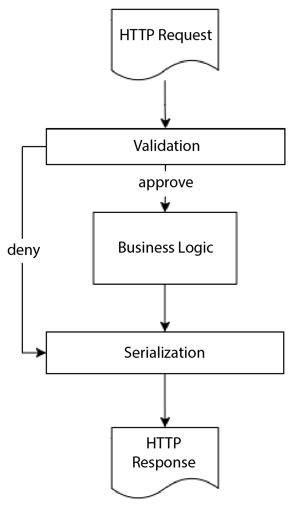
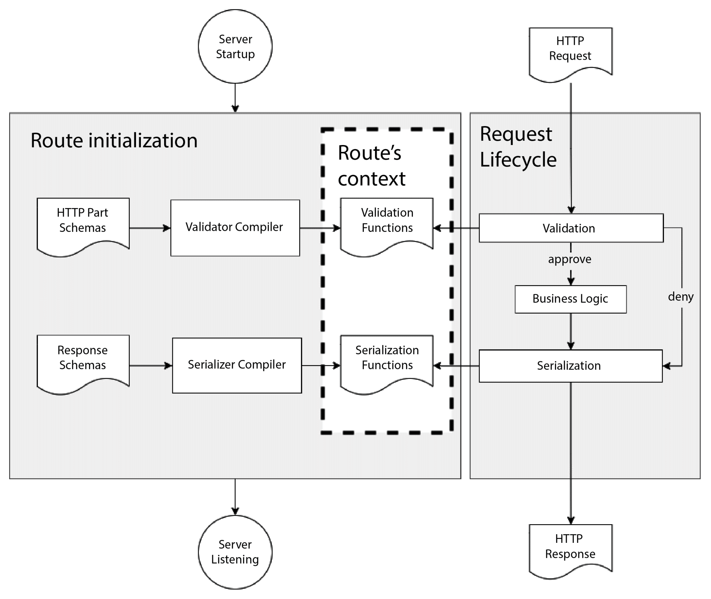
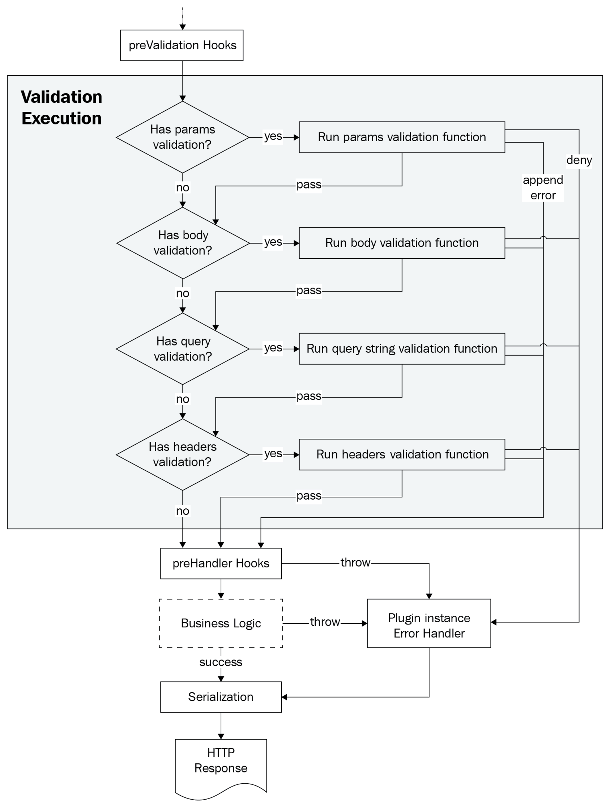
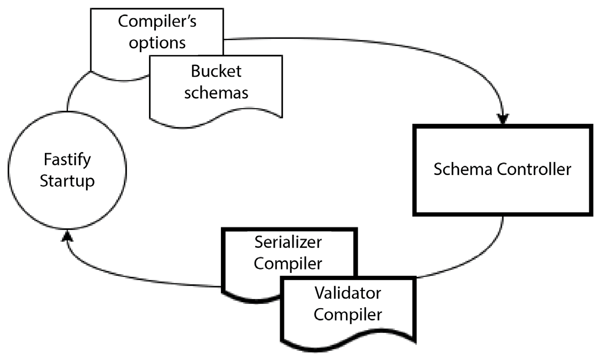

# Изучение валидации и сериализации

Fastify безопасен и быстр, но это не защищает его от злоупотреблений. В этой главе вы узнаете, как реализовать безопасные конечные точки с проверкой ввода и сделать их быстрее с помощью процесса сериализации.

Этот фреймворк предоставляет все необходимые инструменты для использования этих двух критически важных шагов, которые поддержат вас при раскрытии простых интерфейсов API и позволят вашим клиентам использовать их.

Вы узнаете, как использовать и настраивать компоненты Fastify, чтобы контролировать и адаптировать стандартную настройку к логике вашего приложения.

Именно этот путь обучения мы рассмотрим в этой главе:

-   Понимание валидации и сериализации
-   Понимание процесса валидации
-   Настройка компилятора валидатора
-   Управление компилятором валидатора
-   Понимание процесса сериализации

## Технические требования {#technical-requirements}

Как уже упоминалось в предыдущих главах, вам понадобится следующее:

-   Рабочая установка Node.js 18
-   Текстовый редактор для работы с кодом примера
-   HTTP-клиент для тестирования кода, например CURL или Postman.

Все фрагменты в этой главе находятся на [GitHub](https://github.com/PacktPublishing/Accelerating-Server-Side-Development-with-Fastify/tree/main/Chapter%205).

## Понимание валидации и сериализации {#understanding-validation-and-serialization}

Fastify был создан с акцентом на опыт разработчика и на сокращение усилий разработчика, необходимых для создания нового проекта. По этой причине в Fastify встроены функции, позволяющие снизить следующие нагрузки:

-   Проверка правильности ввода данных пользователем
-   Фильтрация вывода сервера.

Цель — найти решения и предотвратить наиболее распространенные атаки безопасности, такие как внедрение кода или раскрытие конфиденциальных данных. Ответ заключается в объявлении ожидаемого формата входных и выходных данных для каждого маршрута. Поэтому процессы валидации и сериализации были введены во фреймворк по проекту:



<center>Рисунок 5.1 — Этапы валидации и сериализации</center>

Эта предыдущая диаграмма показывает макроархитектуру этапов жизненного цикла запроса, о которой вы подробно читали в [_главе 4_](./hooks.md).

Фаза **Валидация** происходит, когда **HTTP-запрос** поступает на сервер. Он позволяет одобрить или запретить доступ к шагу **Бизнес-логика**.

Этап **Сериализация** преобразует высокоуровневые данные, созданные бизнес-логикой, такие как объекты JSON или ошибки, в низкоуровневые данные (`strings` или `buffers`) для ответа на запрос клиента.

Следующий вопрос: как определить информацию, проходящую через валидацию, и данные ответа? К счастью, решением является спецификация **JSON Schema**, которая принята как Fastify, так и веб-сообществом.

Но что такое JSON Schema? Мы собираемся разобраться в этой важной концепции приложения, которая фокусируется на безопасности и скорости. Следующие разделы скорее теоретические, чем практические: нам нужно знать, как работает система, прежде чем увидеть ее в действии, иначе мы можем упустить важные концепции.

### Спецификация JSON Schema {#the-json-schema-specification}

Стандарт JSON Schema описывает структуру документов JSON. Поэтому, используя интерпретатор JSON Schema, можно проверить, соответствует ли объект JSON определенной структуре, и действовать соответствующим образом.

Написание схемы дает вам возможность применить некоторую автоматизацию к вашему Node.js-приложению:

-   Проверка JSON-объектов
-   Генерация документации
-   Фильтрация полей JSON-объектов

Стандарт все еще находится в стадии черновика и достиг версии 2020-12. По умолчанию Fastify v4 принимает более старую версию спецификации, **Draft-07**, которая широко поддерживается и используется. По этой причине все последующие примеры JSON Schema будут следовать этому стандарту. Давайте посмотрим на практике, как выглядит JSON Schema, попробовав проверить следующий JSON-объект через схему:

```json
{
    "id": 1,
    "name": "Foo",
    "hobbies": ["Soccer", "Scuba"]
}
```

Соответствующая JSON-схема может иметь следующую структуру:

```json
{
    "$schema": "http://json-schema.org/draft-07/schema#",
    "$id": "http://foo/user",
    "type": "object",
    "properties": {
        "identifier": {
            "type": "integer"
        },
        "name": {
            "type": "string",
            "maxLength": 50
        },
        "hobbies": {
            "type": "array",
            "items": {
                "type": "number"
            }
        }
    },
    "required": ["id", "name"]
}
```

Как видите, схема представляет собой JSON, который можно читать даже без знания стандартного формата. Давайте попробуем разобраться в ней вместе.

В качестве входных данных мы ожидаем объект `type` с некоторыми свойствами, которые мы назвали и настроили следующим образом:

-   Обязательное поле `identifier` должно быть целым числом
-   Обязательная строка `имя`, которая не может быть длиннее 50 символов
-   Необязательный массив строк `hobbies`.

В этом случае вывод программного интерпретатора, проверяющего, соответствует ли входной JSON схеме, будет успешным. Та же проверка будет неудачной, если входной объект не содержит одного из обязательных полей или если один из типов не соответствует полю `type` схемы.

До сих пор мы говорили о проверке JSON-объекта, но не упоминали о сериализации. Эти два аспекта различны, и их разделяет только спецификация JSON Schema. Спецификация написана с учетом процесса валидации. Сериализация — это приятный «побочный эффект», введенный для повышения безопасности и производительности; мы увидим, как это сделать в этом разделе.

Пример схемы, который мы только что рассмотрели, — это демонстрация базового синтаксиса схемы, который станет более интуитивным. JSON Schema поддерживает большой набор ключевых слов для реализации строгой проверки, таких как значения по умолчанию, рекурсивные объекты, типы ввода даты и времени, формат электронной почты и так далее.

Полный обзор спецификации JSON Schema мог бы занять целую книгу. Поэтому вы можете углубить свои знания по этому аспекту, заглянув на [официальный сайт](https://json-schema.org/). К концу этой главы мы рассмотрим и другие ключевые слова, а новые будут вводиться и описываться постепенно.

Как вы могли заметить, читая предыдущий пример схемы, некоторые ключевые слова имеют префикс в виде символа доллара, `$`. Это специальные метаданные, определенные в проекте стандарта. Одним из наиболее важных и часто используемых является свойство `$id`. Оно однозначно идентифицирует JSON-схему, и Fastify полагается на него для обработки объектов схемы и их повторного использования в приложении.

Ключевое слово `$schema` в примере говорит нам о формате JSON-документа, который является Draft-07. Если вы видите схему JSON на этих страницах, то подразумевается, что она соответствует этой версии из-за настроек Fastify по умолчанию.

Теперь мы имеем представление о том, что такое схема, но как она интегрируется с логикой Fastify? Давайте выясним.

### Составление схемы JSON {#compiling-a-json-schema}

Схемы JSON недостаточно для проверки JSON-документа. Нам нужно преобразовать схему в функцию, которую сможет выполнить наше программное обеспечение. По этой причине необходимо использовать **компилятор**, который выполнит эту работу.

Важно понимать, что компилятор JSON Schema пытается реализовать спецификацию, добавляя ценные функции для облегчения нашей повседневной работы. Это подразумевает знание того, какой компилятор использует ваше приложение, чтобы подправить конфигурацию и получить преимущества от некоторых дополнительных возможностей, таких как новые нестандартные ключевые слова, принудительное приведение типов и дополнительные форматы ввода.

!!!note "Блокировка реализации компилятора"

    Как правило, написание JSON Schema с использованием ключевых слов и возможностей нового компилятора приводит к блокировке. В этом случае вы не сможете изменить компилятор, и у вас могут возникнуть проблемы при интеграции, которая опирается только на стандартные JSON-схемы, например при генерации документов API. Это нормально, если учесть все плюсы и минусы, которые мы представим в этой главе.

Такая же логика была реализована и в процессе сериализации. Идея была довольно проста: если можно построить функцию JavaScript для проверки объекта JSON, то можно скомпилировать новую функцию, которая будет выдавать строку. Строка будет основана только на полях, определенных в источнике схемы JSON!

Следуя этому шагу, вы можете определить только те данные, которые должны входить на ваш сервер и выходить из приложения! Это повышает безопасность приложения. На самом деле, реализация компилятора имеет надежный механизм блокировки инъекций кода, и вы можете настроить его на отбраковку плохих входных данных, таких как слишком длинные `strings`.

Теперь мы прояснили суть JSON Schema и объяснили, как она может помочь улучшить приложение в компоненте компилятора. Давайте разберемся, как Fastify интегрировал эту логику во фреймворк.

### Компиляторы Fastify {#fastifys-compilers}

По умолчанию Fastify имеет два компилятора:

-   **Компилятор валидатора**: Компилирует JSON-схему для проверки входных данных запроса
-   **Компилятор сериализатора**: Компилирует JSON-схему ответа для сериализации данных приложения.

Эти компиляторы, по сути, являются модулями Node.js, которые принимают JSON-схему на вход и выдают нам функцию. Помните об этом, потому что это будет важно позже, в разделе [Создание нового компилятора валидатора](#building-a-new-validator-compiler).

Подробный рабочий процесс Fastify можно представить следующим образом:



<center>Рисунок 5.2 — Рабочий процесс компиляции JSON-схемы в Fastify</center>

Как вы можете видеть, существует два различных процесса:

-   Инициализация **маршрута**, где схемы компилируются на этапе запуска.
-   Запрос через **Request Lifecycle**, который использует скомпилированные функции, хранящиеся в контексте маршрута.

Теперь вы должны иметь полное представление об общих компонентах Fastify и реализуемой ими логике. Пришло время увидеть все это в действии. Обратите внимание, что для облегчения понимания и во избежание путаницы мы будем обсуждать валидацию и сериализацию отдельно.

## Понимание процесса валидации {#understanding-the-validation-process}

Процесс валидации в Fastify следует одной и той же логике для проверки входящих частей HTTP-запроса. Эта бизнес-логика состоит из двух основных шагов, как мы видели на _рисунке 5.2_:

-   Компиляция схемы, выполняемая **компилятором валидатора**.
-   Выполнение валидации

Мы обсудим эти аспекты по очереди.

### Компилятор валидатора {#the-validator-compiler}

Fastify не реализует интерпретатор JSON Schema самостоятельно. Тем не менее, он интегрировал модуль [Ajv](https://www.npmjs.com/package/ajv) для выполнения процесса валидации. Интеграция Ajv в Fastify реализована для того, чтобы сделать его как можно более быстрым и поддержать инкапсуляцию. Вы всегда сможете изменить настройки по умолчанию и предоставить приложению новый интерпретатор JSON Schema, но как это сделать, мы узнаем позже, в разделе [Управление компилятором валидатора](#managing-the-validator-compiler).

!!!note "Версия Ajv"

    Fastify включил модуль Ajv версии 8. Это важно знать, когда нужно искать новые конфигурации или обращаться за поддержкой к сообществу Ajv. Кроме того, версия Ajv определяет поддерживаемые версии JSON Schema. На момент написания статьи последней версией модуля Ajv является v8, которая поддерживает спецификацию 2020-12.

Компонент компилятора валидатора представляет собой фабричную функцию, которая должна компилировать схемы маршрутов приложения. Каждый маршрут может определять одну схему для каждой части HTTP:

-   `params` для параметров пути
-   `body` для полезной нагрузки
-   `querystring` (или поле псевдонима `query`) для строк запроса URL
-   `headers` для заголовков запроса.

Все эти свойства являются необязательными, поэтому вы можете свободно выбирать, какая часть HTTP должна быть проверена.

Схемы должны быть указаны во время объявления маршрута:

```js
app.post(
    '/echo/:myInteger',
    {
        schema: {
            params: jsonSchemaPathParams,
            body: jsonSchemaBody,
            querystring: jsonSchemaQuery,
            headers: jsonSchemaHeaders,
        },
    },
    function handler(request, reply) {
        reply.send(request.body);
    }
);
```

Готово! Теперь при каждом запуске приложения схемы будут компилироваться компилятором валидатора по умолчанию. Сгенерированные функции будут храниться в контексте маршрута, поэтому каждый HTTP-запрос, который попадает на конечную точку `/echo/:myinteger`, будет выполнять процесс валидации.

Мы можем вызвать конечную точку с неверными данными, чтобы проверить наш код, например, `/echo/not-a-number`. Такой ввод вызовет ошибку валидации, и мы получим ответ `400 Bad Request`:

```json
{
    "statusCode": 400,
    "error": "Bad Request",
    "message": "params.myInteger should be integer"
}
```

Как мы видели, компиляция кажется относительно простой, но вы также должны знать, что эта функция _полностью инкапсулирована_. Этот архитектурный паттерн, который мы уже обсуждали, устроен следующим образом:

-   Один компилятор валидации для разных контекстов плагинов, и они не будут сталкиваться.
-   Вы можете добавлять схемы с одним и тем же `$id` в разные контексты, и они могут иметь разную структуру.

Прежде чем продолжить обсуждение компилятора валидатора и того, как его настраивать и изменять, давайте продолжим этот «счастливый путь», чтобы получить полное представление об одном из ключевых аспектов Fastify.

### Выполнение валидации {#validation-execution}

Fastify применяет валидацию части HTTP-запроса во время жизненного цикла запроса: после выполнения хуков `preValidation` и перед хуками `preHandler`.

Цель этой проверки — проверить формат входных данных и выдать одно из этих действий:

-   **Pass**: Успешно проверяет часть HTTP-запроса.
-   **Deny**: Выбрасывает ошибку, если валидация части HTTP-запроса не прошла.
-   **Append error**: При неудачной проверке части HTTP-запроса и успешном продолжении процесса — настройка опции маршрута `attachValidation`.

Этот процесс не предназначен для проверки корректности данных — для этого следует полагаться на хук `preHandler`.

Как вы видели в предыдущем примере кода, объект `schema` имеет определенную структуру, где каждое свойство сопоставляет HTTP-часть: `params`, `body`, `querystring` и `headers`. Когда вы устанавливаете для JSON-схемы значение `body`, полезная нагрузка HTTP-запроса по умолчанию должна представлять собой JSON-ввод. Вы можете изменить это поведение, и мы рассмотрим, как это сделать в следующем разделе.

В предыдущих главах все наши примеры маршрутов не содержали опцию маршрута `schema`. Таким образом, _мы пропускали фазу проверки_ жизненного цикла запроса.

!!!note "Порядок выполнения проверки"

    Список HTTP-частей, упомянутый в разделе [Компилятор валидатора](#the-validator-compiler), упорядочен по выполнению. Это означает, что если валидация `params` не пройдет, последующие HTTP-части обрабатываться не будут.

Процесс валидации довольно прост. Давайте рассмотрим логику этого процесса более подробно, рассмотрев весь жизненный цикл запроса:



<center>Рисунок 5.3 — Рабочий процесс выполнения валидации</center>

Давайте разберемся в схеме пошагово:

-   Пунктирная стрелка — это HTTP-запрос, который начал свой жизненный цикл на сервере Fastify и достиг шага хука `preValidation`. Все работает, как ожидалось, и мы готовы начать **выполнение валидации**.
-   Каждая HTTP-часть проверяется, если во время объявления маршрута была предоставлена JSON-схема.
-   Если проверка пройдена, мы переходим к следующему шагу.
-   При неудачной проверке выбрасывается определенный объект `Error`, который будет обработан **обработчиком ошибок**, настроенным в экземпляре сервера, где был зарегистрирован маршрут. Обратите внимание, что ошибка подавляется, если установлена опция маршрута `attachValidation`. Мы рассмотрим пример в разделе [Управление потоком](#flow-control).
-   Если все проверки прошли успешно, жизненный цикл продолжает свой путь к хукам `preHandler`, и дальше все будет происходить так, как обсуждалось в предыдущих главах.
-   Пунктирная рамка **Бизнес-логика** представляет собой выполнение обработчика, которое было опущено, поскольку изображение специально сфокусировано на проверке потока выполнения.

Эти шаги происходят, когда в определении маршрута устанавливается опция схемы, как в предыдущем фрагменте кода в разделе [Компилятор валидатора](#the-validator-compiler).

Теперь у нас есть полный обзор всего процесса валидации, начиная с запуска и заканчивая временем работы сервера. Представленная информация охватывает наиболее распространенные случаи использования приложения и, благодаря настройкам Fastify по умолчанию, готова к использованию.

Отличным приложениям нужны отличные функции. Поэтому сейчас мы сосредоточимся на настройке компилятора валидатора.

## Настройка компилятора валидатора {#customizing-the-validator-compiler}

Fastify предоставляет множество опций для обеспечения гибкого процесса валидации и полного контроля над ним. Мы рассмотрим все возможные настройки по очереди, так что к концу этого раздела вы станете гуру компилятора валидатора! Давайте начнем это путешествие шаг за шагом!

### Управление потоком {#flow-control}

В предыдущем разделе мы упоминали опцию маршрута `attachValidation` — пришло время рассмотреть пример (хотя вы, вероятно, уже знаете, как ее использовать, благодаря предыдущим главам):

```js
app.get('/attach-validation', {
    attachValidation: true,
    schema: {
        headers: jsonSchemaHeaders,
    },
    handler: (request, reply) => {
        reply.send(request.validationError);
    },
});
```

Добавление флага в параметр маршрута предотвратит возникновение ошибки проверки. Вместо этого процесс выполнения валидации будет прерван при первой же ошибке, и процесс будет продолжен, поскольку валидация прошла успешно. В этом случае к аргументу `request` будет присоединен объект `validationError`. Последующие объекты маршрута в жизненном цикле запроса должны справиться с ошибкой и действовать соответствующим образом, иначе ошибка не будет обработана. Как и в предыдущем примере кода, функция-обработчик выполняется всегда.

### Понимание конфигурации Ajv {#understanding-the-ajv-configuration}

Конфигурация Ajv определяет, как строятся функции валидации и как они будут вести себя в тех или иных обстоятельствах. По умолчанию используются следующие настройки, и о них стоит знать:

```json
{
    "coerceTypes": "array",
    "useDefaults": true,
    "removeAdditional": true,
    "uriResolver": require("fast-uri"),
    "allErrors": false,
    "nullable": true
}
```

Давайте разберемся в них, а затем приведем пример, чтобы увидеть все эти опции в действии:

-   Флаг `coerceTypes` пытается привести входные данные к типу, определенному в схеме. Например, если свойством входного тела является строка `foo: "42"`, а само поле определено как `type: integer`, то поле `request.body.foo` будет приведено к типу Number. Значение `array` мы рассмотрим позже в этом разделе.
-   Опция `useDefaults` включает использование ключевого слова `default` JSON Schema, позволяя вам определить начальное значение, если свойство отсутствует или не определено.
-   Параметр `removeAdditional` позволяет удалить из поля HTTP-части все свойства, не указанные в JSON Schema.
-   `uriResolver` — параметр, введенный сообществом Fastify. Он еще больше ускоряет обработку Ajv-модуля.
-   JSON-объект может содержать несколько ошибок валидации, например, два поля с неправильным типом данных. Флаг `allErrors` настраивает функцию валидации на остановку при первой ошибке.
-   Флаг `nullable` позволяет использовать синтаксический сахар ключевого слова `nullable` в схемах JSON.

Эти и другие опции хорошо документированы на сайте [Ajv](https://ajv.js.org/options.html). Вы можете обратиться к ним, чтобы найти новые опции или изменить те, что используются по умолчанию. В разделе [Настройка компилятора валидатора Ajv по умолчанию](#configuring-the-default-ajv-validator-compiler) мы рассмотрим несколько наиболее используемых конфигураций в качестве базовых.

Важно отметить, что эти опции позволяют функции валидации манипулировать исходными данными запроса. Это означает, что исходное тело запроса будет обработано и изменено.

!!!note "Как создается хук предварительной проверки?"

    Хук `preValidation` был впервые введен в ядро Fastify из-за манипуляций с телом, которые выполняли функции валидации. Это было необходимо только в ограниченных случаях, например, для подписанных тел, которые требуют немодифицированного ввода клиента.

Чтобы увидеть все это в действии, вот JSON-схема:

```js
const ajvConfigDemoSchema = {
    type: 'object',
    properties: {
        coerceTypesDemo: { type: 'integer' },
        useDefaultsDemo: {
            type: 'string',
            default: 'hello',
        },
        removeAdditional: {
            type: 'object',
            additionalProperties: false,
            properties: {
                onlyThisField: {
                    type: 'boolean',
                },
            },
        },
        nullableDemo: { type: 'string', nullable: true },
        notNullableDemo: { type: 'string' },
    },
};
```

Эта схема вводит три новых ключевых слова:

-   Свойство `default` позволяет определить значение по умолчанию, когда объект ввода JSON не содержит свойства `useDefaultsDemo` или его значение равно `null`.
-   Параметр `additionalProperties` используется для управления обработкой дополнительных свойств. В примере вы видите `boolean false`, который выводит дополнительные данные из HTTP-части. Объект также может применять более сложные фильтры. Обратитесь к [официальной спецификации](https://json-schema.org/understanding-json-schema/reference/object.html#additional-properties).
-   Флаг `nullable` не определен в стандарте. Это синтаксический сахар, позволяющий избежать стандартного определения типа для `nullable` полей: `{ type: ["string", "null"] }`.

Использование этой схемы в обработчике маршрута даст нам четкое понимание настраиваемых опций:

```js
app.post('/config-in-action', {
    schema: {
        body: ajvConfigDemoSchema,
    },
    handler(request, reply) {
        reply.send(request.body);
    },
});
```

Вызов конечной точки, определенной со следующей полезной нагрузкой, должен установить ответ с измененным телом после выполнения функции проверки:

```sh
curl --location --request POST 'http://localhost:8080/config-in-
action' \
--header 'Content-Type: application/json' \
--data-raw '{
    "coerceTypesDemo": "42",
    "removeAdditional": {
        "remove": "me",
        "onlyThisField": true
    },
    "nullableDemo": null,
    "notNullableDemo": null
}'
```

На выходе мы должны получить такой ответ:

```json
{
    "coerceTypesDemo": 42,
    "removeAdditional": {
        "onlyThisField": true
    },
    "nullableDemo": null,
    "notNullableDemo": "",
    "useDefaultsDemo": "hello"
}
```

Изменения выделены, и каждое название свойства описывает опцию Ajv, которая вызвала изменение.

На данный момент мы имеем полное представление о конфигурации компилятора валидаторов по умолчанию. Это охватывает наиболее распространенные случаи использования и дает вам возможность использовать его из коробки, не мучаясь со сложной конфигурацией и не изучая модуль `Ajv`. К сожалению, для управления реальным приложением крайне важно контролировать все компоненты и конфигурацию Fastify. В следующем разделе вы узнаете, как настроить компилятор валидатора.

## Управление компилятором валидатора {#managing-the-validator-compiler}

Fastify предлагает вам возможность настроить компилятор валидатора двумя различными способами:

-   Настройка стандартного компилятора валидатора Ajv
-   Внедрение совершенно нового компилятора валидаторов, например, нового модуля компилятора JSON Schema.

Эти возможности дают вам полный контроль над процессом валидации и возможность реагировать на любые ситуации, с которыми вы можете столкнуться, например, принять новый модуль компилятора валидатора или управлять тем, как пакет Ajv обрабатывает входные данные.

### Настройка компилятора валидатора Ajv по умолчанию {#configuring-the-default-ajv-validator-compiler}

В разделе [Понимание конфигурации Ajv](#understanding-the-ajv-configuration) мы рассмотрели настройки Ajv по умолчанию и ссылку на его документацию, чтобы изучить их все. Если вы найдете полезные опции, которые хотели бы применить, вы можете установить их во время инстанцирования экземпляра Fastify:

```js
const app = fastify({
    ajv: {
        customOptions: {
            coerceTypes: 'array',
            removeAdditional: 'all',
        },
        plugins: [[require('ajv-keywords'), 'transform']],
    },
});
```

Фабрика Fastify принимает параметр Ajv. Параметр имеет два основных поля:

-   `customOptions` позволяет расширить настройки Ajv. Обратите внимание, что этот JSON будет объединен с настройками по умолчанию.
-   Массив `plugins` принимает внешние плагины Ajv.

В примере используются новые настройки, которые мне больше всего нравятся. Значение `coerceTypes` решает проблему, когда вам нужно получить параметр массива через `querystring`:

```js
app.get('/search', {
    handler: echo,
    schema: {
        query: {
            item: {
                type: 'array',
                maxItems: 10,
            },
        },
    },
});
```

Без `coerceTypes: 'array'`, если ваша конечная точка получает только один параметр, он не будет принудительно приведен к массиву в пределах одного элемента по умолчанию, что приведет к ошибке несоответствия типов. Обратите внимание, что эта опция уже установлена Fastify по умолчанию.

Значение опции `removeAdditional` позволяет избежать переопределения `additional Properties: false` во всех наших объектах схемы. Обратите внимание, что очень важно перечислить все свойства в схемах приложения, иначе вы не сможете прочитать входные данные в своих обработчиках!

!!!note "Объявление короткой схемы JSON Schema"

    В предыдущем примере в схеме запроса отсутствовали некоторые обязательные поля JSON Schema: `type` и `properties`. Fastify обернет входную JSON-схему в родительские JSON-схемы, если не распознает эти два свойства. Так работает синтаксический сахар Fastify, облегчающий настройку маршрута.

После поля опций конфигурации Ajv `customOptions` можно установить свойство `plugins`. Оно добавляет новые возможности и ключевые слова в спецификацию JSON Schema, улучшая работу разработчика.

Опция `plugins` должна представлять собой массив, каждый элемент которого должен быть одним из следующих:

-   Функция плагина Ajv.
-   Двухэлементный массив, где первый элемент — функция плагина Ajv, а второй — опции плагина.

Как это использовать, можно увидеть в следующем фрагменте. Мы регистрируем один и тот же плагин несколько раз для того, чтобы показать синтаксис:

```js
plugins: [
    require('ajv-keywords'), // [1]
    [
        // [2]
        require('ajv-keywords'),
        'transform',
    ],
];
```

Как вы уже убедились, компилятор валидатора Fastify очень настраиваемый и позволяет подобрать оптимальные параметры для вашего приложения. Мы почти охватили все параметры, которые Fastify раскрывает, чтобы настроить компилятор по умолчанию.

До сих пор мы использовали вывод валидации как есть, но если вы задаетесь вопросом, можно ли его настроить, то, конечно, можно! Давайте посмотрим, как это сделать.

### Ошибка валидации {#the-validation-error}

Функция валидатора будет выбрасывать ошибку всякий раз, когда HTTP-часть не соответствует схеме маршрута. Обработчик ошибок контекста маршрута управляет ошибкой. Приведем небольшой пример, показывающий, как пользовательский обработчик ошибок может по-другому управлять ошибкой проверки ввода:

```js
app.get('/custom-error-handler', {
    handler: echo,
    schema: {
        query: { myId: { type: 'integer' } },
    },
});
app.setErrorHandler(function (error, request, reply) {
    if (error.validation) {
        const { validation, validationContext } = error;
        this.log.warn({ validationError: validation });
        const errorMessage = `Validation error on
    ${validationContext}`;
        reply.status(400).send({ fail: errorMessage });
    } else {
        this.log.error(error);
        reply.status(500).send(error);
    }
});
```

Как видите, при неудачной проверке к объекту Error добавляются два параметра:

-   Свойство `validationContext` — это строковое представление HTTP-части, отвечающее за генерацию ошибки
-   Поле `validation` — это необработанный объект ошибки, возвращенный реализацией компилятора валидатора.

Обработчик ошибок Fastify по умолчанию управляет объектом ошибки Ajv и возвращает ясное сообщение об ошибке.

!!!note "Тип данных ошибки проверки"

    Компилятор по умолчанию создает массив ошибок Ajv. Поэтому свойство `validation` генерируется скомпилированной функцией Ajv. Всякий раз, когда мы используем пользовательский компилятор валидатора с новым форматом ошибок, поле `validation` соответствующим образом изменяет свой тип данных.

Настройка обработчика ошибок дает вам возможность сделать так, чтобы ошибки валидации соответствовали формату ошибок, выводимых вашим приложением. Пример мы рассмотрели ранее, в разделе [The validator compiler](#the-validator-compiler).

Если же вам нужно просто настроить сообщение об ошибке, то в Fastify есть опция и для этого! Опция `schemaErrorFormatter` принимает функцию, которая должна сгенерировать объект `Error`, который будет выброшен во время процесса валидации. Эта опция может быть задана следующими способами:

-   Во время инициализации корневого сервера
-   В качестве опции маршрута
-   Или на экземпляре регистрации плагина.

Ниже приведен полный обзор трех возможностей в том же порядке, что и в предыдущем списке:

```js
const app = fastify({
    schemaErrorFormatter: function (errors, httpPart) {
        //[1]
        return new Error('root error formatter');
    },
});
app.get('/custom-route-error-formatter', {
    handler: echo,
    schema: { query: { myId: { type: 'integer' } } },
    schemaErrorFormatter: function (errors, httpPart) {
        //[2]
        return new Error('route error formatter');
    },
});
app.register(function plugin(instance, opts, next) {
    instance.get('/custom-error-formatter', routeConfig);
    instance.setSchemaErrorFormatter(function (
        errors,
        httpPart
    ) {
        // [3]
        return new Error('plugin error formatter');
    });
    next();
});
```

Входная функция `setSchemaErrorFormatter` должна быть синхронной. Она будет получать необработанный объект `errors`, возвращаемый скомпилированной функцией валидации, плюс часть HTTP, которая не является валидной.

До сих пор мы настраивали стандартный компилятор валидатора Fastify, поскольку он генерирует функцию валидации для вывода ошибок. Настроек довольно много, но они позволяют настроить ваш сервер по своему усмотрению, не сталкиваясь со сложностью компиляции. Нам еще предстоит объяснить, как изменить реализацию компилятора валидатора, но сначала мы должны научиться повторно использовать JSON-схемы.

### Повторное использование JSON-схем {#reusing-json-schemas}

На первый взгляд схемы JSON могут показаться огромными и длинными для чтения и понимания. На самом деле, в разделе [The JSON Schema specification](#the-json-schema-specification) мы видели ~20-строчную схему для проверки трехпольного объекта JSON.

Спецификация JSON Schema решает эту проблему, предоставляя возможность повторного использования схемы с помощью ключевого слова `$ref`. Это свойство используется для ссылки на схему и должно представлять собой строковый URI. `$ref` может ссылаться на внешнюю JSON-схему или на локальную схему в самой схеме.

Чтобы сослаться на внешнюю схему, необходимо выполнить следующие два действия:

1.  Установить свойство `$id` внешней схемы и значения `$ref` для ссылки на нее.
2.  Добавьте внешнюю схему в контекст Fastify, вызвав метод `app.addSchema(json Schema)`.

Чтобы лучше понять это, мы рассмотрим пример:

```js
app.addSchema({
    $id: 'http://myapp.com/user.json',
    definitions: {
        user: {
            $id: '#usermodel',
            type: 'object',
            properties: {
                name: { type: 'string', maxLength: 50 },
            },
        },
        address: {
            $id: 'address.json',
            definitions: {
                home: {
                    $id: '#house',
                    type: 'string',
                    maxLength: 150,
                },
                work: {
                    $id: '#job',
                    type: 'string',
                    maxLength: 200,
                },
            },
        },
    },
});
```

Метод `addSchema` принимает в качестве аргумента действительную JSON-схему, которая должна иметь значение `$id`. В противном случае ссылка на схему невозможна. Если значение `$id` отсутствует, будет выдана ошибка. Добавив схему, следуя этому примеру, мы сможем ссылаться на нее в свойстве `schema` конфигурации маршрута.

!!!note "Идентификатор схемы `$id`."

    В предыдущем блоке кода значение `$id` является абсолютным **Uniform Resource (URI)**. Спецификация JSON Schema определяет, что `$id` корневой схемы должен быть в этом формате. Набор URI не обязательно должен быть реальной конечной точкой HTTP, как в примере. Он должен быть уникальным. Следование спецификации поможет вам использовать внешние инструменты для работы со схемами вашего приложения, например, для создания документации. В качестве примера я предпочитаю использовать URI в таком формате: `schema:myapplication:user:create`, что можно обобщить как `schema:<код приложения>:<модель>:<сфера>`.

Чтобы сослаться на [схему](http://myapp.com/user.json), мы должны использовать ключевое слово `$ref`:

```js
app.post('/schema-ref', {
    handler: echo,
    schema: {
        body: {
            type: 'object',
            properties: {
                user: {
                    $ref:
                        'http://myapp.com/user.json#usermodel',
                }, // [1]
                homeAdr: {
                    $ref:
                        'http://myapp.com/address.json#house',
                }, // [2]
                jobAdr: {
                    $ref:
                        'http://myapp.com/address.json#/definitions/work',
                    // [3]
                },
                notes: { $ref: '#/definitions/local' }, // [4]
            },
            definitions: {
                local: { type: 'boolean' },
            },
        },
    },
});
```

Мы использовали четыре различных формата ссылок на URI. Как правило, формат `$ref` имеет следующий синтаксис:

```
<absolute URI>#<local fragment>
```

Вот краткое объяснение:

1.  **Ссылка на внешний фрагмент**: Свойство пользователя указывает на внешний `$id`, определенный в URI домена `user.json`.
2.  **Ссылка на внешний фрагмент подсхемы**: `homeAdr` заменил абсолютный URI из `user.json` на `address.json`. Это происходит потому, что если `$id` не начинается с символа `#`, то это относительный путь к корневому URI. Таким образом, во внешней схеме мы определили подсхему `address.json`.
3.  **Относительный путь к внешней подсхеме**: Локальный фрагмент может быть относительным путем к применяемой JSON-схеме. Обратите внимание, что в относительном пути используется имя JSON-поля `work`, а не значение `$id`.
4.  **Локальная ссылка**: Вы можете ссылаться на саму схему. Если `$ref` не содержит абсолютного URI перед символом `#`, локальный фрагмент разрешается локально.

Этот пример дает вам полный набор инструментов и помогает определить собственные ссылки на схему. Эта настройка охватывает наиболее распространенные случаи использования. На самом деле спецификация является исчерпывающей и охватывает гораздо больше случаев использования, которые не могут быть адаптированы к нашим приложениям. Вы можете обратиться к официальному [примеру документации](https://datatracker.ietf.org/doc/html/draft-handrews-json-schema-01#section-8.2.4), чтобы глубже погрузиться в связывание `$ref` и `$id`.

Мы научились делиться схемами в приложении и использовать их в конфигурации наших маршрутов. Но как их читать? Давайте узнаем это в следующем разделе.

#### Извлечение ваших схем {#retrieving-your-schemas}

Вы должны знать, что схемы, добавленные с помощью метода `addSchema()`, хранятся в компоненте `bucket`. Каждый экземпляр плагина имеет один экземпляр `bucket` для поддержки инкапсуляции. Давайте посмотрим на этот код:

```js
app.register(async (instance, opts) => {
    instance.addSchema({
        $id: 'http://myapp.com/user.json',
        type: 'string',
        maxLength: 10,
    });
});
app.register(async (instance, opts) => {
    instance.addSchema({
        $id: 'http://myapp.com/user.json',
        type: 'string',
        maxLength: 50,
    });
});
```

Добавление двух схем с одинаковым `$id` приведет к ошибке на этапе запуска. Обычная логика Fastify будет применяться как всегда: схемы, добавленные в родительской области видимости плагина, наследуются в дочерней. Но две схемы могут иметь одинаковый `$id` только в разных инкапсулированных контекстах.

!!!note "Fastify любит оптимизировать"

    Как уже говорилось, у каждого контекста плагина есть компонент `bucket`, который содержит все схемы контекста. Это не совсем верно. Объекты схем могут быть огромными и повторяющимися. Поэтому Fastify оптимизирует логику работы с ведрами, чтобы сократить количество экземпляров `ведер` до минимума, необходимого для их изоляции в инкапсулированном контексте. Например, добавление всех схем общего приложения в корневой контекст приводит к созданию одного экземпляра `bucket`.

Чтобы прочитать схемы приложения из компонента `bucket`, вы можете использовать эти методы:

```js
const json = instance.getSchema(
    'http://myapp.com/user.json'
);
const jsonIdSchemaPair = instance.getSchemas();
```

Для получения соответствующей схемы `getSchema(id)` необходим строковый аргумент `$id`. Метод `getSchemas()` возвращает пару ключ-значение JSON, где ключом является `$id` схемы, а значением — сама JSON-схема.

Теперь мы знаем обо всех аспектах стандартного компилятора валидаторов, но как же его настроить и расширить? Пришло время отказаться от него в пользу собственного!

### Создание нового компилятора валидаторов {#building-a-new-validator-compiler}

Компилятор валидатора Fastify может быть полностью заменен. Это может понадобиться в следующих случаях:

-   Вам нужен уникальный компилятор валидатора для каждой части HTTP. Например, вам нужна определенная конфигурация Ajv для части body и другая конфигурация для `querystring`.
-   Вы предпочитаете использовать другой модуль компилятора JSON Schema, например, `@hapi/joi` или `yup`.
-   Вы хотите создать свой компилятор для оптимизации вашего приложения.

Важно помнить, что переписывание этого компонента Fastify требует знания потока валидации, потому что неспособность найти схемы — одна из самых распространенных ловушек.

Fastify предоставляет вам несколько способов заменить компилятор:

-   **Фабрика контроллеров схем** корневого экземпляра.
-   Компонент компилятора валидатора или сериализатора корневого экземпляра или плагина.

Эти два варианта взаимодействуют друг с другом, как показано на следующей диаграмме:



<center>Рисунок 5.4 — Процесс настройки компилятора</center>

Во время запуска Fastify решает, когда ему нужен компилятор валидатора или компилятор сериализатора, основываясь на следующих вопросах:

-   Нужен ли компилятор корневому или подключаемому экземпляру?
-   Есть ли уже компилятор у корневого экземпляра или экземпляра плагина?
-   Изменились ли схемы `bucket` по сравнению с родительским экземпляром?

Когда все эти условия выполняются, Fastify запрашивает фабрику контроллеров схем для создания нового компилятора. Обратите внимание, что следующая логика применима как к компилятору валидатора, так и к компилятору сериализатора. Мы сосредоточимся на компиляторе валидатора, но принцип работы одинаков для каждого из них. Компилятор сериализатора мы рассмотрим в разделе [Компилятор сериализатора](#the-serializer-compiler).

Входные данные для создания компилятора следующие:

-   Опция компилятора. Для компилятора валидации она соответствует свойству опции `ajv` приложения.
-   Схемы `bucket` экземпляра.

Внутри этих аргументов фабрика должна создать компилятор Fastify.

Компилятор валидатора — это функция, которая, учитывая схемы маршрута, должна вернуть новую функцию для проверки частей HTTP-запроса — мы знаем, это кажется немного сложным, но давайте посмотрим на пример, чтобы понять эту идею:

```js
const app = fastify({
    schemaController: {
        // [1]
        compilersFactory: {
            buildValidator: myCompilerFactory, // [2]
        },
    },
});
app.addSchema({
    $id: 'http://myapp.com/string.json',
    type: 'string',
    maxLength: 50,
});
function myCompilerFactory(
    externalSchemas,
    ajvServerOption
) {
    return myValidatorCompiler; // [3]
}
function myValidatorCompiler(routeData) {
    const { schema, method, url, httpPart } = routeData;
    return function validate(jsonPayload) {
        // [4]
        return true;
    };
}
```

В примере показаны все сущности контроллера схемы, которые являются простыми функциями, которые на самом деле ничего не делают. Тем не менее, они дают нам отличный обзор того, как отдельные части могут работать вместе, добавляя некоторые `console.log` отчеты во время ваших экспериментов.

!!!note "Отказ от ответственности"

    Наберитесь терпения и постарайтесь следовать коду: мы собираемся изучить функцию, которая возвращает функцию, которая возвращает другую функцию! При первом чтении довольно легко заблудиться, но держитесь!

Появился новый параметр `schemaController` `[1]`. Этот параметр позволяет нам настраивать и брать под контроль компиляторы через объект `compilersFactory`. Он принимает два параметра, `buildValidator` и `buildSerializer`.

Мы сосредоточимся на первом: предоставим на вход функцию `[2]`. Функция `myCompilerFactory` может получить доступ ко всем схемам экземпляра через аргумент `externalSchemas` и `ajvServerOption`. В данном примере имеется только одна внешняя схема, `'http://myapp.com/string.json'`, а опции сервера ajv пусты.

!!!note "Внешние схемы"

    Аргумент `externalSchemas` предоставляется ведерком схем Fastify. Он заполняется при внутреннем вызове `instance.getSchemas()`. Слово «внешние» относится к тем схемам, на которые ссылаются схемы маршрутов.

`myCompilerFactory` выполняется всякий раз, когда Fastify требуется новый компилятор, основываясь на контрольном списке, который мы видели в начале этого раздела. Например, для случая наименьшего объема памяти достаточно вызвать эту функцию один раз: для всего приложения нужен только один компилятор валидаторов.

!!!note "Fastify использует те же API, что и пользователь."

    Важно отметить, что Fastify использует этот API для реализации контроллера схемы по умолчанию. Реализация `myCompilerFactory` по умолчанию создает экземпляр Ajv по умолчанию, и он изолирован во внешнем модуле с именем `@fastify/ajv-compiler`. Благодаря этому модулю можно запустить Fastify с другой версией Ajv из коробки. Пожалуйста, проверьте его!

Функция `myCompilerFactory` возвращает функцию `myValidatorCompiler` `[3]`. Цель последней функции — «скомпилировать» входную схему и преобразовать ее в исполняемую функцию JavaScript. Функция `myValidatorCompiler` выполняется на этапе запуска, один раз для каждой JSON-схемы маршрута. Аргумент `routeData` — это объект в координатах маршрута, где применяется следующее:

-   `chema` — объект, указанный в опции schema маршрута (извините за избыточность).
-   `method` — строка HTTP-метода маршрута в верхнем регистре.
-   `url` — необработанная строка URL маршрута. Например, параметры пути, такие как `/hello/:name`.
-   `httpPart` указывает нам, какая часть HTTP-запроса должна быть проверена. Это может быть одна из хорошо известных строк `body`, `params`, `querystring` или `headers`.

Функция `myValidatorCompiler` `[3]` возвращает... еще одну функцию! Это последняя, клянусь. Функция `validate` `[4]` — это то, что должна выдать компиляция схемы. Она хранится в контексте маршрута и выполняется для каждого HTTP-запроса, направленного к этой конечной точке. Схему этого процесса мы видели на _Рисунке 5.3_.

Функция `validate` — это та, которая выполняется, когда сервер слушает. Поток `chemaController`, как мы только что видели, выполняется один раз во время запуска, и это самая тяжелая задача, которую Fastify должен выполнить перед приемом входящих запросов. На практике компонент Fastify `schemaController` по умолчанию использует модуль Ajv для создания этих функций `validate` — не больше, не меньше.

В примере мы настроили `schemaController` с валидацией, которая всегда возвращает `true`. Но мы можем реализовать нашу логику на основе `httpPart`, например, использовать первичную функцию валидации для `querystring` и `headers` и более сложную для части `body`. Наиболее распространенным вариантом использования является применение различных настроек ajv для каждой части HTTP. См. [полный пример](https://github.com/fastify/help/issues/128).

Поздравляем! Вы изучили самые сложные компоненты Fastify. Чтобы получить полный контроль над этими функциями, может потребоваться некоторое время, поэтому не спешите — не торопитесь. Помните, что контроллер схемы можно не настраивать и использовать по умолчанию. В этом разделе мы рассмотрели, как система работает «под капотом», но это все равно ценный вариант для изучения, потому что тогда у вас не будет неприятных сюрпризов во время разработки приложения.

Теперь, когда вы узнали о компоненте Schema Controller Factory, его настройке и кастомизации, мы можем двигаться дальше. Сохраняйте спокойствие, дальше будет проще.

### Настройка компилятора валидатора схем {#customizing-the-schema-validator-compiler}

В предыдущем разделе мы рассмотрели Schema Controller Factory, один из двух способов замены компилятора схем Fastify. Глядя на _Рисунок 5.4_ и условия проверки того, должен ли Fastify создавать компилятор, мы можем ответить на вопрос _Есть ли уже компилятор у корня или экземпляра плагина_?

Настроить валидатор схемы на данном этапе довольно просто:

```js
app.setValidatorCompiler(myValidatorCompiler); // [1]
app.register(async function plugin(instance, opts) {
    instance.setValidatorCompiler(myValidatorCompiler); // [2]
    app.post('/schema-ref', {
        handler: echo,
        validatorCompiler: myValidatorCompiler, // [3]
        schema: {
            body: mySchema,
        },
    });
});
```

Переменная `myValidatorCompiler` — это то же самое, что и в предыдущем разделе: она имеет тот же интерфейс и возвращает тот же результат.

Как вы знаете, Fastify позволяет настраивать компилятор схем в два этапа:

-   Настройка компилятора валидатора для корневого экземпляра приложения `[1]` или экземпляра плагина `[2]`.
-   Настроить компилятор валидатора для отдельного маршрута через опции маршрута `[3]`.

Как мы только что видели в примере, настройка компилятора валидатора заставляет Fastify пропустить вызов Schema Controller Factory. Вместо создания фабрики используется предоставленная вами функция.

Этот тип настройки проще в применении по сравнению с фабрикой контроллеров схем, и он дает вам возможность изменять даже самые мелкие части вашего приложения. Типичной функцией этой возможности является поддержка двух разных компиляторов в одном приложении Fastify. Это очень полезно для миграции приложений, написанных с использованием модуля `joi`. Пример приведен в следующем коде:

```js
app.register(async function plugin(instance, opts) {
    function joiCompiler({
        schema,
        method,
        url,
        httpPart,
    }) {
        return function (data) {
            return schema.validate(data);
        };
    }
    instance.setValidatorCompiler(joiCompiler);
    instance.post('/joi', {
        handler: echo,
        schema: {
            body: Joi.object({
                hello: Joi.string().required(),
            }),
        },
    });
});
```

Все маршруты, зарегистрированные в `plugin`, полагаются на возвращаемую функцию `joiCompiler` для проверки HTTP-частей. Обратите внимание, что аргумент `schema` на самом деле является объектом экземпляра `Joi.object()`. Он был предоставлен во время регистрации маршрута, и это совсем не стандартная JSON-схема. Fastify не жалуется на это, потому что вы предоставили пользовательский компилятор валидатора, так что все в порядке, если предоставленный компилятор знает, как управлять объектом входной схемы.

Маршруты, зарегистрированные вне контекста плагина, полагаются на компилятор валидаторов Fastify по умолчанию! Мы должны еще раз поблагодарить инкапсуляцию!

Теперь процесс валидации и все его части больше не имеют для вас секретов. Вы получили глубокие знания о том, как входные данные маршрутов проверяются перед выполнением обработчика.

Настало время познакомиться с компилятором сериализатора, но не волнуйтесь, концепции, которые мы изучили в этом обширном разделе, будут использоваться и в следующем.

## Понимание процесса сериализации {#understanding-the-serialization-process}

Сериализация — это процесс преобразования сложных объектов или примитивных данных в корректный тип данных, который можно передать клиенту. К **действительному типу данных** относятся строка, поток или буфер.

В разделе [Понимание валидации и сериализации](#understanding-validation-and-serialization) мы представили концепцию процесса сериализации Fastify, который использует схемы JSON для адаптации полезной нагрузки ответа к определенному формату. Это единственная задача, которую выполняет данный процесс. Он не применяет никакой проверки выходных данных. Это часто вызывает путаницу, поскольку схема JSON ассоциируется с этапом проверки. Поэтому правильнее было бы сравнить его с обработкой фильтров, а не с валидацией.

Действующие акторы очень похожи на те, что мы видели в разделе [Создание нового компилятора валидаторов] (#building-a-new-validator-compiler), с некоторыми дополнениями. На следующей диаграмме, _Рисунок 5.5_, мы представим эти дополнения, расширив блок **Serialization**, который мы видели на _Рисунке 5.3_:


<center>Рисунок 5.5 — Рабочий процесс сериализации</center>

На _рисунке 5.5_ показан полный рабочий процесс, выполняемый Fastifty для сериализации полезной нагрузки ответа, который вы отправляете, вызывая `reply.send()` или выполняя оператор `return` в обработчике `async`.

!!!note "Слишком много полезной нагрузки"

    Чтобы сделать этот раздел более понятным, мы будем называть выходной объект конечной точки **ответной полезной нагрузкой**. Для справки, это тот объект, который вы передаете в качестве аргумента методу `reply.send()`. **сериализованная полезная нагрузка** — это полезная нагрузка ответа, преобразованная к правильному типу данных и готовая к передаче клиенту.

Диаграмма может показаться немного сложной, но она сжимает эти правила Fastify:

-   Отправка или возврат объекта, который не является строкой, буфером или потоком, запускает процесс сериализации.
-   Возврат или отбрасывание объекта с ошибкой запускает обработчик ошибок, который мы рассматривали в [главе 3](./routes.md)
-   Fastify применяет обратную реакцию, чтобы избежать голодания запросов из-за неправильного использования компонента, например, выброса ошибки в обработчик ошибок

Давайте начнем детально анализировать _Рисунок 5.5_. Первое, что бросается в глаза, — это то, что процесс сериализации пропускается, когда полезная нагрузка ответа является допустимым типом данных. Обычно это происходит при рендеринге веб-страницы или при загрузке файла.

Когда полезная нагрузка ответа не является валидной, она обрабатывается пятью основными блоками, которые управляют полезной нагрузкой:

-   Хуки `preSerialization` манипулируют полезной нагрузкой до сериализации. Мы видели это в действии в [Главе 4](./hooks.md).
-   Обработчик ошибок должен обработать ошибку и ответить на HTTP-запрос. Как видите, он выполняется только один раз, но мы читали о нем в [Главе 3](./routes.md).
-   Сериализатор **Reply Serializer** — это новый простой компонент. Он должен преобразовать объект в допустимый тип данных.
-   Функция **Route's Serialization Function** создается компилятором сериализатора.
-   Последний компонент, **Сериализатор ответов по умолчанию**, действует при отсутствии настройки.

Благодаря блок-схеме вам будет легче ориентироваться в процессе сериализации. Например, понятно, что пользовательский сериализатор ответов имеет приоритет над функцией сериализации. Но давайте посмотрим на код, чтобы узнать, как использовать эти компоненты для сериализации полезной нагрузки ответа.

### Сериализатор ответов {#the-reply-serializer}

Этот компонент помогает управлять ответом, который не является JSON и должен быть сериализован в другом формате. Это синхронная функция, которая должна возвращать корректный тип данных (строку, поток или буфер). Если возвращается или выбрасывается что-то другое, в ответ будет отправлена фатальная ошибка. Контекстом `this` сериализатора ответа является сам объект ответа — может быть полезно установить дополнительные заголовки.

Использование довольно простое на данном этапе вашего пути в мире Fastify:

```js
function mySerializer(payload, statusCode) {
    return `<payload>${payload}</payload>`;
}
app.setReplySerializer(mySerializer); // [1]
app.get('/reply-serializer', function handler(
    request,
    reply
) {
    reply
        .type('application/xml')
        .serializer(mySerializer) // [2]
        .send({ hello: 'world' });
});
```

Вы можете назначить пользовательский сериализатор корневому или подключаемому экземпляру сервера `[1]`. Как обычно, в этом случае все маршруты, зарегистрированные в этом контексте, будут его выполнять.

Другой вариант — запускать пользовательский сериализатор только при необходимости, вызывая метод `reply.serializer()` и передавая `serializer` в качестве аргумента `[2]`. В этом случае не забудьте установить заголовок content-type, иначе вы можете столкнуться с непредсказуемыми результатами работы Fastify.

Это все, что вы должны знать о сериализаторе ответов. Этот компонент используется для ответов с типами содержимого, которые не являются JSON, например XML, буферы сжатия, YML и так далее.

Закрыв эту скобку, мы можем начать завершать наше путешествие по сериализации, обсудив функцию сериализации, создаваемую компилятором сериализатора.

### Компилятор сериализатора {#the-serializer-compiler}

Компилятор сериализатора создает JavaScript-функцию из JSON-схемы для сериализации полезной нагрузки ответа. Он удаляет все поля, которые не объявлены в схеме, и принудительно изменяет тип выводимых полей. Эти задачи выполняет стандартный компилятор сериализатора Fastify.

Модулем, который компилирует JSON-схемы, является [`fast-json-stringify`](https://www.npmjs.com/package/fast-json-stringify).

!!!note "Прирост скорости"

    Процесс сериализации через скомпилированную функцию сокращает время, затрачиваемое на сериализацию JSON-объекта ответа. Модули `fast-json-stringify` и Fastify опубликовали всеобъемлющий [benchmark](https://github.com/fastify/benchmarks/), который сравнивает их с другими фреймворками.

Но как мы можем использовать схему JSON для сериализации полезной нагрузки? Давайте посмотрим на пример:

```js
app.post('/filter', {
    async handler(request, reply) {
        return {
            username: 'Foo',
            password: 'qwerty',
        };
    },
    schema: {
        response: {
            '2xx': {
                type: 'object',
                properties: {
                    username: { type: 'string' },
                },
            },
        },
    },
});
```

В этом фрагменте кода показано новое поле опции в объекте опций маршрута схемы: свойство `response`. Оно принимает объект JSON, в котором каждый ключ должен быть следующим:

-   Код статуса HTTP, такой как `200`, `404` или `500`.
-   Шаблон кода состояния HTTP выглядит как: `2xx`, то есть все коды состояния от `200` до `299`.

Таким образом, вы можете настроить каждый ответ с помощью определенной JSON-схемы.

Как вы можете видеть, конечная точка `/filter` возвращает поле `password`, но благодаря схеме ответа оно не будет отправлено клиенту! Объект схемы будет использовать те же схемы в ключевом слове `$ref`, что и компилятор валидатора: они совместно используют схемы `bucket`, как было сказано в разделе [Как собрать новый компилятор валидатора](#building-a-new-validator-compiler).

!!!note "Знание компилятора сериализатора по умолчанию"

    Модуль `fast-json-stringify` имеет собственную реализацию, и он поддерживает не все ключевые слова, предоставляемые валидатором Ajv. Это вполне объяснимо, поскольку у них разные функции. Один из ярких примеров, на котором вам стоит поучиться: хотя свойство `maxLength` строкового поля является основополагающим для валидации ввода, оно игнорируется стандартным JSON-сериализатором. Помните, что стандартная сериализация JSON Schema не проверяет данные; она только фильтрует и принудительно изменяет типы.

Теперь мы знаем, как использовать стандартный компилятор сериализатора Fastify, но как его можно настроить? Давайте узнаем об этом в следующем разделе.

### Управление компилятором сериализатора {#managing-the-serializer-compiler}

Точно так же, как вы можете настроить компилятор валидатора, вы можете сделать то же самое с компилятором сериализатора. Для завершения фрагмента кода, описанного на _Рисунке 5.5_, посмотрите следующий код:

```js
const app = fastify({
    serializerOpts: { rounding: 'ceil' },
    schemaController: {
        compilersFactory: {
            buildSerializer: myFactory, // [1]
        },
    },
});
app.addSchema({
    $id: 'http://myapp.com/string.json',
    type: 'string',
});
function myFactory(
    externalSchemas,
    serializerOptsServerOption
) {
    return mySerializerCompiler; // [2]
}
function mySerializerCompiler(routeData) {
    const {
        schema,
        method,
        url,
        httpStatus,
    } = routeData[3]; //
    return function serializer(responsePayload) {
        // [4]
        return `This is the payload ${responsePayload}`;
    };
}
```

Исходный код должен выглядеть очень знакомо: логический поток такой же, как мы обсуждали в разделе [Как собрать новый компилятор валидатора](#building-a-new-validator-compiler), с минимальными изменениями:

1.  Опция `compilersFactory` принимает новое свойство `buildSerializer`.
2.  Функция `myFactory` получает на вход `serializerOptsServerOption`, равный объекту `serializerOpts` (вместо `ajv`).
3.  Функция `mySerializerCompiler` получает `httpStatus` в качестве маршрутных данных `[3]`. Валидатор получает `httpPart`.
4.  Компилятор должен вернуть синхронную функцию [4], которая строит строковый объект.

Скомпилированная функция хранится в контексте маршрута, и она будет выполнена, когда этого потребует процесс сериализации, как мы видели на _Рисунке 5.5_.

Наконец, как и компилятор валидатора, вы можете установить компилятор сериализатора в каждом контексте, в котором он вам нужен:

```js
app.setSerializerCompiler(mySerializerCompiler); // [1]
app.register(async function plugin(instance, opts) {
    instance.setSerializerCompiler(mySerializerCompiler)[2]; //
    app.post('/respose-schema', {
        handler: echo,
        serializerCompiler: mySerializerCompiler, // [3]
        schema: {
            response: {
                '2xx': mySchema,
                '5xx': myErrorSchema,
            },
        },
    });
});
```

Способ настройки компилятора в Fastify соответствует способу настройки валидатора:

-   Настройте компилятор сериализатора для экземпляра корневого приложения `[1]` или экземпляра плагина `[2]`.
-   Настроить компилятор сериализатора для отдельного маршрута через опции маршрута `[3]`.

Мы изучили компилятор сериализатора, не раздражая вас повторением логики, лежащей в основе контроллера схемы.

Вы должны быть в состоянии настроить сериализатор Fastify и изменить модуль, реализующий компиляцию схемы, взяв библиотеку, которая лучше всего соответствует вашим потребностям. Как вы уже прочитали, Fastify сохраняет последовательность своих компонентов, используя надежные паттерны, которые облегчают процесс обучения и улучшают сам фреймворк.

## Резюме {#summary}

В этой главе мы проделали долгий путь внутри Fastify, чтобы раскрыть возможности схемы JSON. Теперь вы понимаете, почему определение схемы JSON является критически важным этапом в настройке вашего приложения. Это может быть непростой задачей, но проверка данных и быстрый отклик — две основные причины, по которым это необходимо сделать.

Мы рассмотрели основы спецификации JSON Schema и то, как использовать ее в наших маршрутах, применяя компоненты Fastify по умолчанию. Мы не отходили от настройки этих компонентов, и теперь, когда вы видите весь процесс, вы можете управлять ими для достижения своих целей.

Это было нелегко. Концепции, описанные в этой главе, чаще всего неправильно используются разработчиками, использующими Fastify. Вы проделали большую работу, и я надеюсь, что диаграммы помогли вам понять логику, лежащую в основе валидации и сериализации.

Эта глава — последняя теоретическая: поздравляю! Во многих разделах главы мы читаем концепции, которые уже обсуждались в предыдущих главах. Это доказательство того, что архитектура Fastify рекурсивна во всех своих компонентах.

Теперь все становится серьезнее: в следующей главе мы начнем строить реальное приложение, которое будем использовать на протяжении всей книги, чтобы создать надежный, многократно используемый проект-скаффолдинг.
