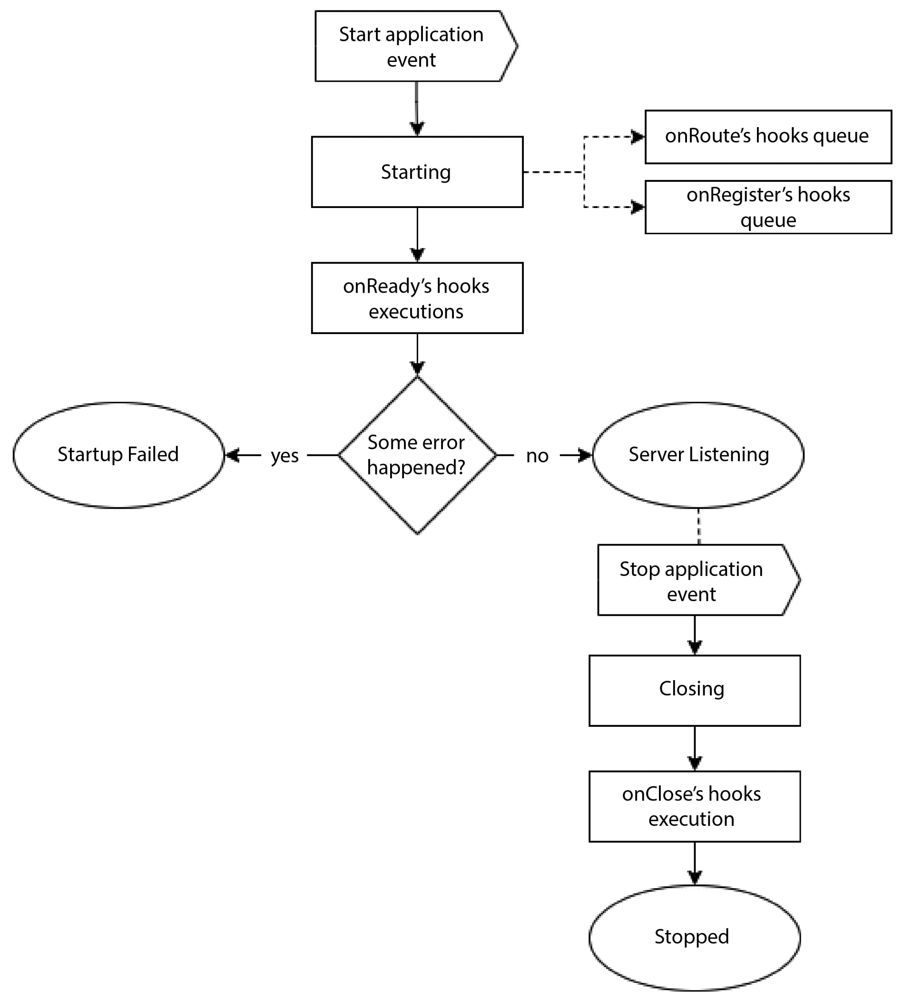
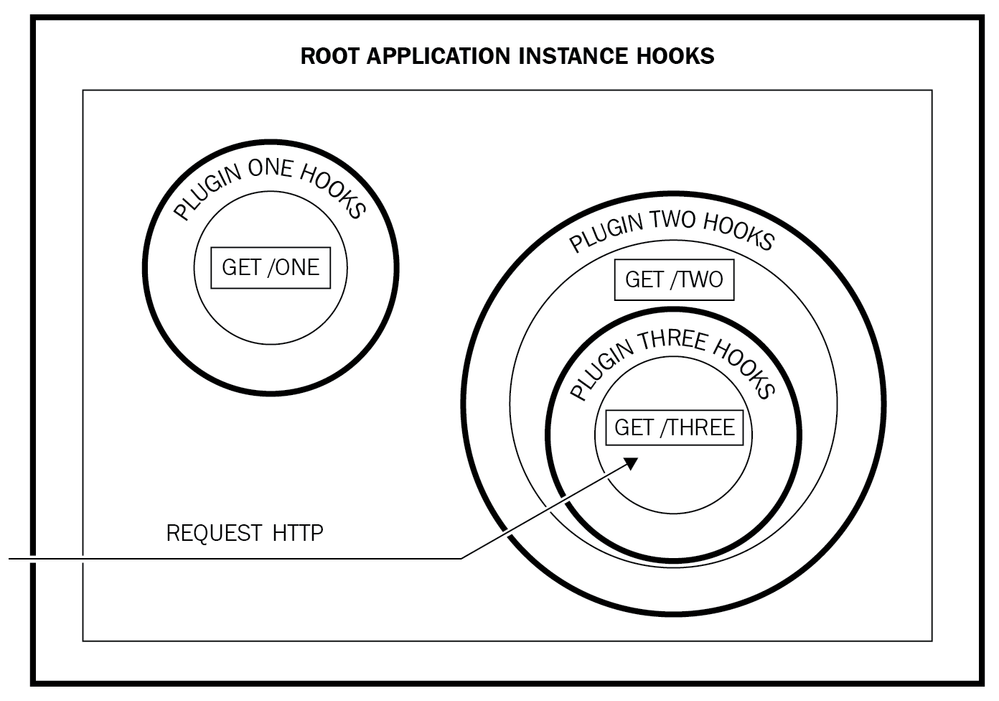

# Что такое Fastify?

В наши дни просто создать надежное приложение недостаточно, а время, необходимое для вывода приложения на рынок, стало одним из основных ограничений, с которыми приходится сталкиваться команде разработчиков. По этой причине Node.js является наиболее используемой средой выполнения, которую в настоящее время применяют компании. Node.js доказала, насколько легко и гибко можно создавать веб-приложения. Чтобы конкурировать на этой технологической сцене, которая движется со скоростью света, вам необходимы правильные инструменты и фреймворки, которые помогут вам создавать надежные, безопасные и быстрые приложения. Темпы зависят не только от производительности программного обеспечения, но и от времени, которое необходимо потратить на добавление новых функций, а также на поддержание надежности и расширяемости программного обеспечения.

<big>**Fastify** обеспечивает удобство разработки без ущерба для производительности, безопасности и читаемости исходных текстов. В этой книге вы получите все необходимые знания, чтобы использовать этот фреймворк наиболее выгодным образом.</big>

В этой главе мы расскажем, что такое Fastify, почему он был создан и как он может ускорить процесс разработки. Вы освоите базовый синтаксис для запуска приложения, добавите свои первые конечные точки и узнаете, как настроить сервер для обзора всех необходимых опций.

Вы начнете изучать все возможности, которые предлагает этот фреймворк, и как можно скорее начнете работать с ним. Есть первый базовый пример, который мы реализуем, чтобы объяснить особенности фреймворка. Мы разберем конфигурацию окружения и то, как правильно завершить работу приложения.

В этой главе мы рассмотрим следующие темы:

-   Что такое Fastify?
-   Запуск сервера
-   Добавление основных маршрутов
-   Добавление базового экземпляра плагина
-   Понимание типов конфигурации
-   Завершение работы приложения

!!!info "Технические требования"

    Прежде чем приступить к работе, вам понадобится среда разработки для написания и выполнения вашего первого кода Fastify. Вам необходимо настроить:

    -   Текстовый редактор или IDE, например VS Code
    -   [Node.js v18](https://nodejs.org/it/download/) или выше
    -   HTTP-клиент для тестирования кода; вы можете использовать браузер, CURL или Postman.

    :material-source-repository: Все примеры кода в этой главе можно найти на [GitHub](https://github.com/PacktPublishing/Accelerating-Server-Side-Development-with-Fastify/tree/main/Chapter%201).

## Что такое Fastify? {#what-is-fastify}

**Fastify** — это веб-фреймворк Node.js, используемый для создания серверных приложений. Он поможет вам разработать HTTP-сервер и создать API простым, быстрым, масштабируемым и безопасным способом!

Он появился на свет в конце 2016 года, а с момента первого релиза в 2018 году развивался со скоростью света. Он присоединился к _OpenJS Foundation_ в качестве At-Large проекта в 2020 году, когда достиг версии 3, с которой мы и будем работать!

Этот фреймворк фокусируется на уникальных аспектах, которые не встречаются в большинстве других веб-фреймворков:

-   Улучшение опыта разработчиков: Это упрощает их работу и продвигает систему **плагинового дизайна**. Эта архитектура помогает структурировать приложение на более мелкие куски кода и применять хорошие шаблоны программирования, такие как **DRY (Don't Repeat Yourself)**, **Immutability**, и **Divide & Conquer**.
-   Всеобъемлющая производительность: Этот фреймворк создан для того, чтобы быть самым быстрым.
-   В соответствии с развитием среды исполнения Node.js: Это включает в себя быстрое исправление ошибок и предоставление новых возможностей.
-   Готовность к использованию: Fastify поможет вам настроить наиболее распространенные проблемы, с которыми вы можете столкнуться в процессе внедрения, такие как протоколирование приложений, обеспечение безопасности, автоматическое выполнение тестов и разбор пользовательского ввода.
-   Ориентирован на сообщество: Поддерживает пользователей фреймворка и прислушивается к их мнению.

В результате мы получаем гибкий и легко расширяемый фреймворк, который позволит вам создавать компоненты многократного использования. Эти концепции позволят вам быстрее и быстрее разрабатывать **доказательство концепции (PoC)** или крупные приложения. Создание системы плагинов займет меньше времени, чтобы удовлетворить потребности бизнеса, не теряя при этом возможности создать отличную кодовую базу и производительное приложение.

Более того, Fastify имеет четкую политику долгосрочной поддержки (LTS), которая поддерживает вас при планировании обновлений вашей платформы и постоянно обновляет версии и возможности Node.js.

Fastify предоставляет вам все эти возможности через небольшой набор компонентов, которые мы рассмотрим в следующем разделе.

### Компоненты Fastify {#fastifys-components}

Fastify упрощает создание и управление HTTP-сервером и жизненным циклом HTTP-запроса, скрывая сложность стандартных модулей Node.js. В нем есть два типа компонентов: **основные компоненты** и **утилитарные элементы**. Первые составляют фреймворк, и для создания приложения необходимо работать именно с ними. Вторые включают в себя все функции, которые вы можете использовать по своему усмотрению для улучшения многократного использования кода.

Основными компонентами, которым будет уделено основное внимание в этой книге и которые мы рассмотрим в этой главе, являются:

-   **корневой экземпляр приложения** представляет собой API Fastify в вашем распоряжении. Он управляет и контролирует стандартный класс Node.js `http.Server` и задает все конечные точки и поведение по умолчанию для каждого запроса и ответа.
-   Экземпляр **плагина** — это дочерний объект экземпляра приложения, который имеет тот же интерфейс. Он изолирует себя от других плагинов, позволяя создавать независимые компоненты, которые не могут изменять другие контексты. В [_Главе 2_](./plugin-system.md) этот компонент рассматривается более подробно, но некоторые примеры мы увидим и здесь.
-   Объект `Request` — это обертка стандартного для Node.js `http.IncomingMessage`, который создается при каждом обращении клиента. Он облегчает доступ к пользовательскому вводу и добавляет функциональные возможности, такие как ведение журнала и метаданные клиента.
-   Объект `Reply` представляет собой обертку стандартного для Node.js `http.ServerResponse` и облегчает отправку ответа пользователю.

Компонентами утилиты, которые будут рассмотрены в [главе "Изучение хуков"](./hooks.md), являются:

-   Функции **хуков**, которые действуют, когда это необходимо, в течение жизненного цикла приложения или отдельного запроса и ответа
-   **декораторы**, которые позволяют дополнить функции, установленные по умолчанию в основных компонентах, избегая дублирования кода
-   **парсеры**, которые отвечают за преобразование полезной нагрузки запроса к примитивному типу.

Вот и все! Все эти компоненты работают вместе, чтобы предоставить вам инструментарий, который поддерживает вас на каждом этапе жизни вашего приложения, от прототипирования до тестирования, не забывая при этом об эволюции вашей кодовой базы до управляемой.

!!!note "Много имен для одного компонента"

    Очень важно знать название компонента, особенно экземпляра плагина. У него много синонимов, и самые распространенные из них — plugin, instance или child instance. В официальной документации Fastify эти термины используются широко и взаимозаменяемо, поэтому полезно иметь их в виду.

Мы ознакомились со всеми элементами, которые создают каркас Fastify и реализуют его основные аспекты. Благодаря этому краткому введению вы знаете их имена, и мы будем использовать их в следующих разделах. В следующих главах мы подробнее рассмотрим каждый компонент и раскроем их секреты.

## Запуск вашего сервера {#starting-your-server}

Прежде чем приступить к работе с Fastify, необходимо создать среду разработки. Чтобы создать пустой проект с помощью `npm`, откройте системную оболочку и выполните следующие команды:

```sh
mkdir fastify-playground
cd fastify-playground/
npm init --yes
npm install fastify
```

Эти команды создают пустую папку и инициализируют проект Node.js в новой директории; вы должны увидеть сообщение об успешном выполнении каждой команды `npm <command>`.

Теперь мы готовы запустить HTTP-сервер с Fastify, поэтому создайте новый файл `start.cjs` и проверьте эти несколько строк:

```js
const fastify = require('fastify'); // [1]
const serverOptions = {
    // [2]
    logger: true,
};
const app = fastify(serverOptions); // [3]
app.listen({
    port: 8080,
    host: '0.0.0.0',
}).then((address) => {
    // [4]
    // Сервер теперь прослушивает ${address}
});
```

Давайте разберем каждый из элементов этого кода. Импортируемый фреймворк представляет собой фабричную функцию `[1]`, которая создает сервер Fastify **корневой экземпляр приложения**.

!!!note "Стиль кода книги"

    Все фрагменты кода в книге написаны на **CommonJS (CJS)**. Синтаксис CJS был предпочтительнее, чем **ECMAScript Modules (ESM)**, поскольку он еще не полностью поддерживается такими инструментами, как **мониторинг производительности приложений (APM)** или тестовые фреймворки. Использование функции `require` для импорта модулей позволяет нам сосредоточиться на коде, избегая вопросов, которые не могут быть рассмотрены в этой книге.

Фабрика принимает необязательный входной объект JSON `[2]` для настройки сервера и его поведения — например, поддержки HTTPS и протокола HTTP2. Вы получите полный обзор этого вопроса позже в этой главе. Экземпляр приложения, возвращаемый фабрикой, позволяет нам создавать приложение, добавляя в него маршруты, настраивая и управляя фазами запуска и остановки HTTP-сервера.

После того как сервер построил наш экземпляр `[3]`, мы можем выполнить метод `listen`, который вернет `Promise`. Его ожидание приведет к запуску сервера `[4]`. Этот метод предоставляет широкий набор интерфейсов для настройки того, где слушать входящие запросы, и наиболее распространенным является настройка `PORT` и `HOST`.

!!!note "listen"

    Вызов `listen` с хостом `0.0.0.0` заставит ваш сервер принимать любые неопределенные IPv4-адреса. Эта настройка необходима для приложения-контейнера Docker или любого приложения, которое напрямую выходит в интернет; в противном случае внешние клиенты не смогут обратиться к вашему HTTP-серверу.

Чтобы выполнить предыдущий код, необходимо выполнить следующую команду:

```sh
node starts.cjs
```

Это запустит сервер Fastify, а обращение к URL `http://localhost:8080/` с помощью HTTP-клиента или просто браузера должно показать ответ 404, потому что мы еще не добавили ни одного маршрута.

Поздравляем — вы запустили свой первый сервер Fastify! Вы можете завершить его, нажав кнопки ++ctrl+c++ или ++cmd+c++.

Мы увидели компонент корневого экземпляра в действии. Всего за несколько строк кода мы смогли запустить HTTP-сервер без всякой нагрузки! Прежде чем продолжить копаться в коде, в следующем разделе мы начнем понимать, что делает Fastify под капотом, когда мы его запускаем.

### Обзор жизненного цикла и хуков {#lifecycle-and-hooks-overview}

Fastify реализует две системы, которые регулируют его внутренний рабочий процесс: **жизненный цикл приложения** и **жизненный цикл запроса**. Эти два жизненных цикла вызывают большой набор событий в течение жизни приложения. Прослушивание этих событий позволит нам настроить поток данных вокруг конечных точек или просто добавить инструменты мониторинга.

Жизненный цикл приложения отслеживает состояние экземпляра приложения и запускает этот набор событий:

-   Событие `onRoute` происходит, когда вы добавляете конечную точку к экземпляру сервера.
-   Событие `onRegister` уникально тем, что происходит при создании нового **капсулированного контекста**.
-   Событие `onReady` выполняется, когда приложение готово начать прослушивать входящие HTTP-запросы
-   Событие `onClose` выполняется, когда сервер останавливается.

Все эти события являются хуками Fastify. Точнее, функция, которая запускается всякий раз, когда в системе происходит определенное событие, — это **хук**. Хуки, которые прослушивают события жизненного цикла приложения, называются **прикладными хуками**. Они могут перехватывать и контролировать фазы загрузки сервера приложений, которые включают в себя:

-   инициализацию маршрутов и плагинов
-   Запуск и закрытие приложения.

Вот пример быстрого использования того, что происходит после добавления этого кода перед вызовом `listen` в предыдущем блоке кода:

```js
app.addHook('onRoute', function inspector(routeOptions) {
    console.log(routeOptions);
});
app.addHook('onRegister', function inspector(
    plugin,
    pluginOptions
) {
    console.log(
        'Chapter 2, Plugin System and Boot Process'
    );
});
app.addHook('onReady', function preLoading(done) {
    console.log('onReady');
    done();
});
app.addHook('onClose', function manageClose(done) {
    console.log('onClose');
    done();
});
```

Мы видим, что существует два основных API-интерфейса для этих хуков:

-   Хуки `onRoute` и `onRegister` имеют некоторые объектные аргументы. Эти типы могут манипулировать только входным объектом, добавляя побочные эффекты. Побочный эффект изменяет значение свойств объекта, вызывая новое поведение самого объекта.
-   Хуки `onReady` и `onClose` вместо этого имеют функцию ввода в стиле callback. Входная функция `done` может повлиять на запуск приложения, поскольку сервер будет ждать ее завершения до тех пор, пока вы ее не вызовете. За это время можно загрузить некоторые внешние данные и сохранить их в локальном кэше. Если вы вызовете обратный вызов с объектом ошибки в качестве первого параметра, `done(new Error())`, приложение будет слушать, и ошибка вылезет наружу, нарушив запуск сервера. Поэтому очень важно загружать соответствующие данные и управлять ошибками, чтобы они не блокировали работу сервера.

Как показано в предыдущем примере, запуск нашего исходного кода выведет в консоль только строку `onReady`. Почему наши хуки не работают? Это происходит потому, что события, которые мы прослушиваем, еще не сработали. Они начнут работать к концу этой главы!

Обратите внимание, что всякий раз, когда интерфейс Fastify выражает аргумент `done` или `next`, вы можете опустить его и предоставить вместо него асинхронную функцию. Таким образом, вы можете написать:

```js
app.addHook('onReady', async function preLoading() {
    console.log('async onReady');
    // the done argument is gone!
});
```

Если вам не нужно выполнять асинхронный код, например ввод-вывод в файловую систему или во внешний ресурс, такой как база данных, вы можете предпочесть стиль обратного вызова. Он предоставляет простую функцию в аргументе `done` и является чуть более производительным, чем async-функция!

Вы можете вызвать метод `addHook()` несколько раз, чтобы поставить функции хуков в очередь. Fastify гарантирует, что все они будут выполнены в порядке добавления.

Все эти этапы можно представить в виде такого потока выполнения:



<center>Рисунок 1.1 — Жизненный цикл приложения</center>

В начале работы приложения хуки `onRoute` и `onRegister` выполняются каждый раз, когда создается новый маршрут или новый инкапсулированный контекст (об инкапсулированном контексте мы поговорим в конце этой главы, в разделе [_Добавление экземпляра базового плагина_](#adding-a-basic-plugin-instance)). Пунктирные линии на _Рисунке 1.1_ означают, что функции этих хуков выполняются синхронно и не ожидаются до запуска сервера. Когда приложение загружается, выполняется очередь хуков `onReady`, и сервер начнет прослушивание, если на этом этапе запуска не возникнет ошибок. Только после того, как приложение будет запущено, оно сможет получать события остановки. Эти события запускают этап закрытия, во время которого перед остановкой сервера будет выполнена очередь хуков `onClose`. Этап закрытия будет рассмотрен в разделе [_Завершение работы приложения_](#shutting-down-the-application).

Жизненный цикл запроса, напротив, содержит гораздо больше событий. Но сохраняйте спокойствие — в [главе "Использование хуков"](./hooks.md) о них подробно рассказывается, и вы узнаете, как их использовать, зачем они существуют и когда их следует применять. Хуки, прослушивающие события жизненного цикла запроса, — это **хуки запроса и ответа**. Этот жизненный цикл определяет поток каждого HTTP-запроса, который получит ваш сервер. Сервер обрабатывает запрос в две фазы:

-   Маршрутизация: на этом этапе необходимо найти функцию, которая должна оценить запрос.
-   Обработка запроса выполняет набор событий, составляющих жизненный цикл запроса.

Запрос вызывает эти события в порядке очереди во время его обработки:

1.  `onRequest`: сервер получает HTTP-запрос и направляет его на реальную конечную точку. Теперь запрос готов к обработке.
2.  `preParsing` происходит перед оценкой полезной нагрузки тела запроса.
3.  Хук `preValidation` запускается перед применением **JSON Schema validation** к частям запроса. Проверка схемы — важный этап каждого маршрута, поскольку он защищает вас от вредоносной полезной нагрузки запроса, направленной на утечку системных данных или атаку на ваш сервер. В [главе "Валидация и сериализация"](./validation-serialization.md) этот основной аспект рассматривается более подробно, и будут показаны некоторые опасные атаки.
4.  `preHandler` выполняется перед обработчиком конечной точки.
5.  `preSerialization` выполняет действия перед преобразованием полезной нагрузки ответа в строку, буфер или поток для отправки клиенту.
6.  `onError` выполняется только в том случае, если во время жизненного цикла запроса произошла ошибка.
7.  `onSend` — это последняя возможность манипулировать полезной нагрузкой ответа перед отправкой клиенту.
8.  `onResponse` выполняется после того, как HTTP-запрос был завершен.

Позже мы увидим несколько примеров. Надеюсь, вам понравились спойлеры! Но сначала мы должны глубоко погрузиться в сервер Fastify, чтобы понять, как его использовать и как он взаимодействует с жизненным циклом.

### Корневой экземпляр приложения {#the-root-application-instance}

Корневой экземпляр приложения — это основной API, необходимый для создания вашего API. Все функции, управляющие запросами входящего клиента, должны быть зарегистрированы в нем, и это обеспечивает набор хелперов, которые позволяют вам наилучшим образом организовать приложение. Мы уже рассмотрели, как создать его с помощью оператора `const app = fastify(serverOptions)`. Теперь мы представим общий обзор возможных вариантов настройки и использования этого объекта.

**Параметры сервера**

Когда вы создаете сервер Fastify, перед запуском HTTP-сервера вам необходимо выбрать некоторые ключевые аспекты. Вы можете настроить их, предоставив объект `option input`, который имеет множество параметров, перечисленных в [документации Fastify](https://www.fastify.io/docs/latest/Reference/Server/).

Сейчас мы рассмотрим все аспекты, которые можно задать с помощью этой конфигурации:

-   Параметр `logger` дает вам возможность адаптировать стандартный логгер к вашему удобству и системной инфраструктуре для архивирования распределенных логов и содержательных логов; в [главе "Логирование приложений"](../real-project/logging.md) будет подробно рассмотрено, как лучше настроить эти параметры.
-   `https: object` настраивает сервер на прослушивание сокетов **Transport Layer Security (TLS)**. Некоторые примеры мы увидим позже в [главе "Создание RESTful API"](../real-project/restful-api.md).
-   `keepAliveTimeout`, `connectionTimeout` и `http2SessionTimeout` — это несколько параметров таймаута, по истечении которого сокет HTTP-запроса будет удален, освободив ресурсы сервера. Эти параметры передаются в стандартный Node.js `http.Server`.
-   Настройка маршрутизации для обеспечения более строгих или более слабых ограничений — например, URL без учета регистра и более детальный контроль для направления запроса к обработчику на основе дополнительной информации, такой как заголовок запроса вместо HTTP-метода и HTTP URL. Мы рассмотрим это в [главе "Работа с маршрутами"](./routes.md).
-   `maxParamLength: number<length>` ограничивает длину строки параметра пути.
-   `bodyLimit: number<byte>` ограничивает размер полезной нагрузки тела запроса.
-   `http2: boolean` запускает HTTP2-сервер, который полезен для создания долгоживущего соединения, оптимизирующего обмен данными между клиентом и сервером.
-   Параметр `ajv` настраивает параметры проверки по умолчанию, чтобы улучшить соответствие вашей настройке. В [главе "Валидация и сериализация"](./validation-serialization.md) будет показано, как его использовать.
-   Функция `serverFactory`: управляет создаваемым низкоуровневым HTTP-сервером. Эта функция является хорошим подспорьем при работе в бессерверной среде.
-   Настройки безопасности по умолчанию `onProtoPoisoning` и `onConstructorPoisoning` являются наиболее консервативными и обеспечивают безопасность приложения по умолчанию. Изменять их рискованно, и вы должны рассмотреть все вопросы безопасности, поскольку это влияет на стандартный парсер тела запроса и может привести к инъекции кода. В [главе "Хуки"](./hooks.md) будет показан пример этих параметров в действии.

Вы перегружены всеми этими параметрами? Не волнуйтесь. Мы рассмотрим некоторые из них на следующих примерах. Представленные параметры не только позволяют адаптировать Fastify к широкому спектру общих случаев использования, но и расширяют эту возможность до граничных случаев; обычно вам может не понадобиться настраивать все эти параметры вообще. Просто помните, что настройки по умолчанию готовы к использованию в производстве и обеспечивают наиболее безопасные параметры по умолчанию и наиболее полезные утилиты, такие как обработчики `404 Not Found` и `500 Error`.

**Свойства экземпляра приложения**

Сервер Fastify предоставляет набор ценных свойств для доступа:

-   Геттер `app.server`, который возвращает стандартный для Node.js `http.Server` или `https.Server`.
-   `app.log` возвращает логгер приложения, который можно использовать для вывода полезной информации.
-   `app.initialConfig` для доступа к начальной конфигурации в режиме только для чтения. Это будет удобно для плагинов, которым нужно читать конфигурацию сервера.

Мы можем увидеть их в действии при запуске сервера:

```js
await app.listen({
    port: 0,
    host: '0.0.0.0',
});
app.log.debug(
    app.initialConfig,
    'Fastify listening with the config'
);
const { port } = app.server.address();
app.log.info('HTTP Server port is %i', port);
```

Установка параметра `port` в `0` попросит операционную систему назначить неиспользуемый порт хоста вашему HTTP-серверу, к которому вы сможете обратиться через стандартный метод Node.js `address()`. Запустив код, вы увидите в консоли выходной лог, в котором отображаются свойства сервера.

К сожалению, мы не сможем увидеть вывод журнала `debug`. Журнал не отображается, потому что Fastify защищает нас от неправильной конфигурации, поэтому по умолчанию уровень журнала находится на отметке `info`. Значения уровня журнала, принятые по умолчанию: `fatal`, `error`, `warn`, `info`, `debug`, `trace` и `silent`. Полную настройку журнала мы увидим в [главе "Логирование приложений"](../real-project/logging.md).

Итак, чтобы исправить эту проблему, нам нужно просто обновить наш параметр `serverConfig` следующим образом:

```js
const serverOptions = {
    logger: {
        level: 'debug',
    },
};
```

Таким образом, при следующем перезапуске сервера мы увидим распечатанный журнал! Мы уже познакомились со свойствами экземпляра; в следующем разделе мы представим методы экземпляра сервера.

**Методы экземпляра приложения**

Экземпляр приложения позволяет нам создавать приложение, добавлять маршруты и использовать компоненты Fastify по умолчанию. Мы уже познакомились с методом `app.addHook(eventName, hookHandler)`, который добавляет новую функцию, запускаемую всякий раз, когда **жизненный цикл запроса** или **жизненный цикл приложения** вызывает зарегистрированное событие.

Для создания приложения в вашем распоряжении имеются следующие методы:

-   `app.route(options[, handler])` добавляет новую конечную точку на сервер.
-   `app.register(plugin)` добавляет плагины к экземпляру сервера, при необходимости создавая новый контекст сервера. Этот метод обеспечивает Fastify **капсулирование**, о котором будет рассказано в [главе "Система плагинов"](./plugin-system.md).
-   `app.ready([callback])` загружает все приложения без прослушивания HTTP-запроса.
-   `app.listen(port|options [,host, callback])` запускает сервер и загружает приложение.
-   `app.close([callback])` выключает сервер и запускает поток закрытия. Это дает возможность закрыть все оставшиеся соединения с базой данных или завершить запущенные задачи.
-   `app.inject(options[, callback])` загружает сервер до достижения им состояния готовности и отправляет имитирующий HTTP-запрос. Об этом методе вы узнаете в [главе "Тестирование приложений"](../real-project/testing.md).

Это семейство API вернет нативный `Promise`, если вы не предоставите параметр обратного вызова. Этот шаблон кода работает для каждой функции, которую предоставляет Fastify: везде, где есть аргумент обратного вызова, вы можете опустить его и получить вместо него промис!

Теперь у вас есть полное представление о компоненте экземпляра сервера Fastify и логике жизненного цикла, которую он реализует. Мы готовы использовать все, что прочитали до этого момента, и добавить в приложение наши первые маршруты.

## Добавление основных маршрутов {#adding-basic-routes}

**Маршруты** — это вход в нашу бизнес-логику. HTTP-сервер существует только для того, чтобы управлять маршрутами и открывать их клиентам. Маршрут обычно идентифицируется по HTTP-методу и URL. Этот кортеж соответствует реализации обработчика функций. Когда клиент обращается к маршруту с HTTP-запросом, выполняется обработчик функции.

Мы готовы добавить первые маршруты в наше игровое приложение. Перед вызовом `listen` мы можем написать следующее:

```js
app.route({
    url: '/hello',
    method: 'GET',
    handler: function myHandler(request, reply) {
        reply.send('world');
    },
});
```

Метод `route` принимает объект JSON в качестве параметра для установки обработчика HTTP-запросов и координат конечной точки. Этот код добавит конечную точку `GET /hello`, которая будет запускать функцию `myHandler` всякий раз, когда HTTP-запрос будет соответствовать HTTP-методу и URL, который был только что задан. Обработчик должен реализовать бизнес-логику вашей конечной точки, считывая данные из компонента `request` и возвращая ответ клиенту через объект `reply`.

Обратите внимание, что выполнение предыдущего кода в вашем исходном коде должно запустить хук `onRoute`, который спал до этого; теперь URL `http://localhost:8080/hello` должен ответить, и у нас наконец-то есть наша первая конечная точка!

!!!note "Хук `onRoute` не работает?"

    Если хук `onRoute` ничего не показывает на консоли терминала, помните, что метод `addRoute` должен быть вызван после функции `addHook`! Вы заметили, какой характер может иметь хук: хуки в приложении синхронны и срабатывают при наступлении события, поэтому порядок кода для таких хуков имеет значение. Эта тема будет подробно рассмотрена в [главе "Хуки"](./hooks.md).

Когда запрос поступает на сервер Fastify, фреймворк берет на себя заботу о маршрутизации. По умолчанию он обрабатывает метод HTTP и URL от клиента и ищет нужный обработчик для выполнения. Когда маршрутизатор находит подходящую конечную точку, запускается жизненный цикл запроса. Если совпадения нет, запрос будет обработан стандартным обработчиком 404.

Вы видели, как легко добавляются новые маршруты, но можно ли сделать это еще более кратко? Да, можно!

### Краткое объявление {#shorthand-declaration}

Метод HTTP, URL и обработчик являются обязательными параметрами для определения новых конечных точек. Чтобы сделать объявление маршрутов менее многословным, Fastify поддерживает три различных синтаксиса сокращений:

```js
app.get(url, handlerFunction); // [1]
app.get(url, {
    // [2]
    handler: handlerFunction,
    // другие опции
});
app.get(url, [options], handlerFunction); // [3]
```

Первое сокращение `[1]` является самым минимальным, поскольку принимает на вход строку URL и обработчик. Второй синтаксис `[2]` с опциями будет принимать на вход строку URL и объект JSON с ключом обработчика со значением функции. Последний вариант `[3]` смешивает два предыдущих синтаксиса и позволяет вам предоставить строковый URL, параметры маршрута и функцию-обработчик отдельно: это будет полезно для тех маршрутов, которые имеют одинаковые параметры, но не одинаковый обработчик!

Все методы HTTP, включая `GET`, `POST`, `PUT`, `HEAD`, `DELETE`, `OPTIONS` и `PATCH`, поддерживают это объявление. Вам необходимо вызвать соответствующую коррелированную функцию: `app.post()`, `app.put()`, `app.head()` и так далее.

### Обработчик {#the-handler}

**Обработчик маршрута** — это функция, которая должна реализовать бизнес-логику конечной точки. Fastify предоставит вашим обработчикам все свои основные компоненты, чтобы обслужить запрос клиента. Объектные компоненты `request` и `reply` будут предоставлены в качестве аргументов и обеспечат экземпляр сервера через привязку к функции:

```js
function business(request, reply) {
    // `this` — это экземпляр приложения Fastify
    reply.send({ helloFrom: this.server.address() });
}
app.get('/server', business);
```

Использование стрелочной функции не позволит вам получить контекст функции. Без контекста у вас не будет возможности использовать ключевое слово `this` для доступа к экземпляру приложения. Синтаксис стрелочных функций может быть не самым удачным выбором, потому что он может привести к потере отличной нефункциональной возможности: организации исходного кода! Следующий обработчик выбросит ошибку `Cannot read property 'server' of undefined`:

```js
app.get('/fail', (request, reply) => {
    // `this` не определено
    reply.send({ helloFrom: this.server.address() });
});
```

!!!note "Контекстная подсказка"

    Лучше всего выбирать именованные функции. На самом деле, отказ от обработчиков стрелочных функций поможет вам отладить приложение и разбить код на более мелкие файлы, не несущие в себе скучных вещей, таких как экземпляр приложения и объекты логирования. Это позволит вам писать более короткий код и быстрее реализовывать новые конечные точки. Контекстная привязка работает не только с обработчиками, но и с каждой функцией ввода Fastify, например, с хуком!

Бизнес-логика может быть синхронной или асинхронной: Fastify поддерживает оба интерфейса, но вы должны знать, как управлять объектом `reply` в вашем исходном коде. В обеих ситуациях обработчик никогда не должен вызывать `reply.send(payload)` более одного раза. Если это произойдет, то сработает только первый вызов, а последующие будут проигнорированы, не блокируя выполнение кода:

```js
app.get('/multi', function multi(request, reply) {
    reply.send('one');
    reply.send('two');
    reply.send('three');
    this.log.info('this line is executed');
});
```

Предыдущий обработчик ответит одной строкой, а следующие вызовы `reply.send` выдадут в консоль ошибку `FST_ERR_REP_ALREADY_SENT`.

Чтобы облегчить эту задачу, Fastify поддерживает возврат даже в обработчике синхронной функции. Таким образом, мы сможем переписать наш пример первой секции следующим образом:

```js
function business(request, reply) {
    return { helloFrom: this.server.address() };
}
```

Благодаря этому поддерживаемому интерфейсу вы не запутаетесь в многочисленных вызовах `reply.send`!

Асинхронная функция-обработчик может полностью избежать вызова метода `reply.send`. Она может возвращать полезную нагрузку напрямую. Для этого мы можем обновить конечную точку `GET /hello`:

```js
app.get('/hello', async function myHandler(request, reply) {
    return 'hello'; // simple returns of a payload
});
```

Это изменение не приведет к изменению вывода исходной конечной точки: мы обновили синхронный интерфейс на асинхронный, соответственно изменив способ управления полезной нагрузкой ответа. Асинхронные функции, которые не выполняют метод `send`, могут быть полезны для повторного использования обработчиков в других функциях-обработчиках, как в следующем примере:

```js
async function foo(request, reply) {
    return { one: 1 };
}
async function bar(request, reply) {
    const oneResponse = await foo(request, reply);
    return {
        one: oneResponse,
        two: 2,
    };
}
app.get('/foo', foo);
app.get('/bar', bar);
```

Как видите, мы определили две именованные функции: `foo` и `bar`. Обработчик `bar` выполняет функцию `foo` и использует возвращаемый объект для создания новой полезной нагрузки ответа.

Отказ от объекта `reply` и возвращение полезной нагрузки ответа открывает новые возможности для повторного использования функций-обработчиков, поскольку вызов метода `reply.send()` явно не позволит манипулировать результатами, как это делает обработчик `bar`.

Обратите внимание, что функция синхронизации может возвращать цепочку `Promise`. В этом случае Fastify будет управлять ею как асинхронной функцией! Посмотрите на этот обработчик, который возвращает содержимое файла:

```js
const fs = require('fs/promises');
app.get('/file', function promiseHandler(request, reply) {
    const fileName = './package.json';
    const readPromise = fs.readFile(fileName, {
        encoding: 'utf8',
    });
    return readPromise;
});
```

В этом примере обработчик представляет собой синхронную функцию, которая возвращает `readPromise:Promise`. Fastify дождется ее выполнения и ответит на HTTP-запрос полезной нагрузкой, возвращенной цепочкой промисов. Выбор синтаксиса функции `async` или `sync` и `Promise` зависит от результата. Если содержимое, возвращаемое `Promise` — это то что вам нужно, можно не добавлять дополнительную обертку async-функции, поскольку это замедлит выполнение обработчика.

### Компонент `Reply` {#the-reply-component}

Мы уже познакомились с объектным компонентом `Reply`. Он пересылает ответ клиенту и предоставляет все, что нужно для полного ответа на запрос. Он предоставляет полный набор функций для управления всеми аспектами ответа:

-   `reply.send(payload)` отправит клиенту полезную нагрузку ответа. В качестве полезной нагрузки может выступать строка, объект JSON, буфер, поток или объект `Error`. Его можно заменить, вернув тело ответа в функцию обработчика.
-   `reply.code(number)` установит код статуса ответа.
-   `reply.header(key, value)` добавит заголовок ответа.
-   `reply.type(string)` — это сокращение для определения заголовка `Content-Type`.

Методы компонента `Reply` можно объединить в один оператор для уменьшения шума в коде следующим образом: `reply.code(201).send('done')`.

Еще одним полезным свойством компонента `Reply` является автоопределение заголовков. Длина `Content-Length` равна длине выходной полезной нагрузки, если вы не зададите ее вручную. `Content-Type` преобразует строки в `text/ plain`, объект JSON в `application/json`, а поток или буфер в значение `application/ octet-stream`. Кроме того, при завершении запроса возвращается HTTP-статус `200 Successful`, а при возникновении ошибки — `500 Internal Server Error`.

Если вы отправляете объект `Class`, Fastify попытается вызвать `payload.toJSON()` для создания выходной полезной нагрузки:

```js
class Car {
    constructor(model) {
        this.model = model;
    }
    toJSON() {
        return {
            type: 'car',
            model: this.model,
        };
    }
}
app.get('/car', function (request, reply) {
    return new Car('Ferrari');
});
```

Отправка ответа с новым экземпляром `Car` клиенту приведет к выводу JSON, возвращенному функцией `toJSON`, реализованной самим классом. Это полезно знать, если вы активно используете такие паттерны, как **Model View Controller (MVC)** или **Object Relational Mapping (ORM)**.

### Первый POST-маршрут {#the-first-post-route}

До сих пор мы рассматривали только примеры HTTP `GET` для получения данных из бэкенда. Чтобы отправить данные с клиента на сервер, мы должны перейти на HTTP-метод `POST`. Fastify помогает нам читать входные данные клиента, потому что входные и выходные данные JSON это "пассажиры бизнес-класса", и для их обработки нам нужно только получить доступ к компоненту `Request`, полученному в качестве аргумента обработчика:

```js
const cats = [];
app.post('/cat', function saveCat(request, reply) {
    cats.push(request.body);
    reply.code(201).send({ allCats: cats });
});
```

Этот код будет хранить полезную нагрузку тела запроса в массиве in-memory и отправлять ее обратно в качестве результата.

Вызов конечной точки `POST /cat` вашим HTTP-клиентом будет достаточен для разбора полезной нагрузки запроса и получения корректного JSON-ответа! Вот пример простого запроса, выполненного с помощью `curl`:

```sh
$> curl --request POST "http://127.0.0.1:8080/cat" --header "Content-Type: application/json" --data-raw "{\"name\":\"Fluffy\"}"
```

Команда отправит кота `Fluffy` на нашу конечную точку, которая разберет полезную нагрузку и сохранит ее в массиве `cats`.

Чтобы выполнить эту задачу, достаточно обратиться к компоненту `Request`, не прибегая к сложной настройке или установке внешних модулей! Теперь давайте подробнее рассмотрим объект `Request` и то, что он предлагает из коробки.

### Компонент `Request` {#the-request-component}

Во время реализации POST-маршрута мы читаем свойство `request.body`. Тело — это один из наиболее часто используемых ключей для доступа к данным HTTP-запроса. Вы можете получить доступ к другой части запроса через API:

-   `request.query` возвращает JSON-объект с ключом и значением, содержащий все входные параметры запроса.
-   `request.params` отображает параметры пути URL в JSON-объект.
-   `request.headers` отображает заголовки запроса в JSON-объект.
-   `request.body` возвращает полезную нагрузку тела запроса. Это будет JSON-объект, если заголовок Content-Type запроса имеет значение `application/json`. Если его значение `text/plain`, то значение тела будет строкой. В остальных случаях вам потребуется создать парсер для чтения полезной нагрузки запроса.

Компонент `Request` способен считывать информацию о клиенте и процессе маршрутизации:

```js
app.get('/xray', function xRay(request, reply) {
    // отправить обратно все свойства запроса
    return {
        id: request.id, // id, присвоенный запросу в req-<progress>
        ip: request.ip, // ip-адрес клиента
        ips: request.ips, // ip-адрес прокси-сервера
        hostname: request.hostname, // имя хоста клиента
        protocol: request.protocol, // протокол запроса
        method: request.method, // метод HTTP запроса
        url: request.url, // URL-адрес запроса
        routerPath: request.routerPath, // URL-адрес универсального обработчика
        is404: request.is404, // был ли запрос отправлен или нет
    };
});
```

`request.id` — это строковый идентификатор формата `"req-<progression number>"`, который Fastify присваивает каждому запросу. Номер прогрессии начинается с `1` при каждом перезапуске сервера. Цель идентификатора — связать все журналы, относящиеся к запросу:

```js
app.get('/log', function log(request, reply) {
    request.log.info('hello'); // [1]
    request.log.info('world');
    reply.log.info('late to the party'); // то же, что и request.log
    app.log.info('unrelated'); // [2]
    reply.send();
});
```

Запрос к конечной точке `GET /log` выведет на консоль шесть журналов:

-   Два журнала из стандартной конфигурации Fastify, которые будут отслеживать входящий запрос и определять время ответа
-   Четыре журнала, записанные ранее в обработчике.

Вывод должен быть следующим:

```txt
{"level":30,"time":1621781167970,"pid":7148,"hostname":"
EOMM-XPS","reqId":"req-1","req":{"method":"GET","url":"/
log","hostname":"localhost:8080","remoteAddress":"127.
0.0.1","remotePort":63761},"msg":"incoming request"}
{"level":30,"time":1621781167976,"pid":7148,"hostname":"EOMM-
XPS","reqId":"req-1","msg":"hello"}
{"level":30,"time":1621781167977,"pid":7148,"hostname":"EOMM-
XPS","reqId":"req-1","msg":"world"}
{"level":30,"time":1621781167978,"pid":7148,"hostname":"EOMM-
XPS","reqId":"req-1","msg":"late to the party"}
{"level":30,"time":1621781167979,"pid":7148,"hostname":"EOMM-
XPS","msg":"unrelated"}
{"level":30,"time":1621781167991,"pid":7148,"hostname":"EOMM-
XPS","reqId":"req-1","res":{"statusCode":200},"responseTime":17.831200
003623962,"msg":"request completed"}
```

Обратите внимание, что только команды `request.log` и `reply.log` `[1]` имеют поле `reqId`, а логгер приложения — нет `[2]`.

Функция идентификатора запроса может быть настроена с помощью этих серверных опций, если она не подходит для вашего системного окружения:

```js
const app = fastify({
    logger: true,
    disableRequestLogging: true, // [1]
    requestIdLogLabel: 'reqId', // [2]
    requestIdHeader: 'request-id', // [3]
    genReqId: function (httpIncomingMessage) {
        // [4]
        return `foo-${Math.random()}`;
    },
});
```

Отключив логирование запросов и ответов `[1]`, вы возьмете на себя отслеживание обращений клиентов. Параметр `[2]` настраивает имя поля, выводимого в логах, а `[3]` сообщает Fastify о необходимости получения идентификатора, который будет присвоен входящему запросу, из определенного HTTP-заголовка. Если заголовок не содержит ID, функция `genReqId` `[4]` должна сгенерировать новый ID.

Формат вывода журнала по умолчанию — это JSON-строка, предназначенная для использования внешним программным обеспечением для анализа данных. В среде разработки это не так, поэтому для получения человекочитаемого вывода необходимо установить в проект новый модуль:

```sh
npm install pino-pretty –-save-dev
```

Затем обновите настройки регистратора, как показано ниже:

```js
const serverOptions = {
    logger: {
        level: 'debug',
        transport: {
            target: 'pino-pretty',
        },
    },
};
```

Перезапуск сервера с этой новой конфигурацией сразу же покажет более приятный для чтения вывод. Конфигурация логгера обеспечивается pino. Pino — это внешний модуль, который обеспечивает функцию логирования по умолчанию в Fastify. Мы рассмотрим этот модуль в [главе "Логирование приложений"](../real-project/logging.md).

### Параметрические маршруты {#parametric-routes}

Чтобы задать параметр пути, мы должны написать специальный синтаксис URL, используя двоеточие перед именем нашего параметра. Давайте добавим конечную точку `GET` рядом с нашим предыдущим маршрутом `POST /cat`:

```js
app.get('/cat/:catName', function readCat(request, reply) {
    const lookingFor = request.params.catName;
    const result = cats.find(
        (cat) => cat.name == lookingFor
    );
    if (result) {
        return { cat: result };
    } else {
        reply.code(404);
        throw new Error(`cat ${lookingFor} not found`);
    }
});
```

Этот синтаксис поддерживает и регулярные выражения. Например, если вы хотите изменить созданный ранее маршрут так, чтобы он принимал только числовой параметр, вам нужно написать строку `RegExp` в конце имени параметра между скобками:

```js
app.get('/cat/:catIndex(\\d+)', function readCat(
    request,
    reply
) {
    const lookingFor = request.params.catIndex;
    const result = cats[lookingFor];
    // ...
});
```

Добавление регулярного выражения к имени параметра заставит маршрутизатор оценить его, чтобы найти правильное соответствие маршруту. В этом случае обработчик будет выполнен только в том случае, если `catIndex` — это число; в противном случае запрос будет отменен откатом 404.

!!!note "Подводные камни регулярных выражений"

    Не злоупотребляйте синтаксисом регулярных выражений в параметрах пути, так как это чревато снижением производительности. Более того, несовпадение регулярных выражений приведет к ответу 404. Возможно, вам будет полезно проверить параметр с помощью валидатора Fastify, который мы представляем в [главе "Валидация и сериализация"](./validation-serialization.md), чтобы в ответ получить код состояния `400 Bad Request`.

Маршрутизатор Fastify также поддерживает синтаксис подстановочных знаков. Это может быть полезно для перенаправления корневого пути или для ответа на набор маршрутов с одним и тем же обработчиком:

```js
app.get('/cat/*', function sendCats(request, reply) {
    reply.send({ allCats: cats });
});
```

Обратите внимание, что эта конечная точка не будет конфликтовать с предыдущей, поскольку они не пересекаются, благодаря порядку совпадения:

1.  Идеальное совпадение: `/cat`.
2.  Соответствие параметру пути: `/cat/:catIndex`.
3.  Подстановочные символы: `/cat/*`
4.  Параметр пути с регулярным выражением: `/cat/:catIndex(\\d+)`.

Под капотом Fastify использует пакет `find-my-way` для маршрутизации HTTP-запросов, и вы можете воспользоваться его возможностями.

В этом разделе мы рассмотрели, как добавлять новые маршруты в наше приложение и сколько утилит предоставляет нам Fastify, от ведения журнала приложения до разбора пользовательского ввода. Кроме того, мы рассказали о высокой гибкости объекта `reply` и о том, как он помогает нам при возврате сложного JSON клиенту. Теперь мы готовы пойти дальше и начать разбираться в основах системы плагинов Fastify.

## Добавление базового экземпляра плагина {#adding-a-basic-plugin-instance}

Ранее мы говорили об экземпляре плагина как о дочернем компоненте экземпляра приложения.

Чтобы создать такой экземпляр, достаточно написать следующее:

```js
app.register(
    function myPlugin(pluginInstance, opts, next) {
        pluginInstance.log.info(
            'I am a plugin instance, children of app'
        );
        next();
    },
    { hello: 'the opts object' }
);
```

Эти простые строки только что создали **капсулированный контекст**: это означает, что каждое событие, хук, плагин и декоратор, зарегистрированные в функции `myPlugin` scope, будут оставаться внутри этого контекста и всех его дочерних элементов. В качестве опции вы можете предоставить объект ввода в качестве второго параметра функции `register`. В этом случае входные данные будут переданы в параметр `opts` плагина. Если вы переместите плагин в другой файл, это станет чрезвычайно полезным при совместном использовании конфигурации через файлы.

Чтобы увидеть, как действует инкапсулированный контекст, мы можем изучить вывод следующего примера:

```js
app.addHook('onRoute', buildHook('root')); // [1]
app.register(async function pluginOne(
    pluginInstance,
    opts
) {
    pluginInstance.addHook(
        'onRoute',
        buildHook('pluginOne')
    );
    // [2]
    pluginInstance.get('/one', async () => 'one');
});
app.register(async function pluginTwo(
    pluginInstance,
    opts
) {
    pluginInstance.addHook(
        'onRoute',
        buildHook('pluginTwo')
    );
    // [3]
    pluginInstance.get('/two', async () => 'two');
    pluginInstance.register(async function pluginThree(
        subPlugin,
        opts
    ) {
        subPlugin.addHook(
            'onRoute',
            buildHook('pluginThree')
        );
        // [4]
        subPlugin.get('/three', async () => 'three');
    });
});
function buildHook(id) {
    return function hook(routeOptions) {
        console.log(
            `onRoute ${id} called from ${routeOptions.path}`
        );
    };
}
```

Выполнение предыдущего кода приведет к выполнению `[2]` и `[4]` только один раз, потому что внутри `pluginOne` и `pluginThree` был зарегистрирован только один маршрут, а каждый плагин зарегистрировал только один хук. Вместо этого хук `onRoute` `[1]` выполняется три раза. Это происходит потому, что он был добавлен в экземпляр `app`, который является родительской областью видимости всех плагинов. По этой причине хук `root` будет слушать события своего контекста и дочерних.

Эта функция имеет бесконечный список преимуществ, с которыми вы «познакомитесь» в этой книге. Чтобы лучше объяснить преимущества этой функции, представьте каждый плагин в виде изолированной коробки, которая может содержать другие коробки и так далее, где экземпляр приложения Root является первичным контейнером для всех плагинов. Предыдущий код можно представить в виде такой диаграммы:



<center>Рисунок 1.2 — Инкапсулированные контексты</center>

Запрос направляется в нужную конечную точку (квадрат на диаграмме), и он задействует все хуки, зарегистрированные на каждом экземпляре плагина, которые включают обработчик назначения.

Каждый блок является автономным и не влияет на поведение других своих собратьев, что позволяет быть уверенным в том, что проблема не затронет другие части приложения, кроме той, в которой она возникла. Более того, система выполняет только те функции хуков, которые нужны вашим маршрутам! Это позволяет вам и вашей команде работать над разными частями приложения, не влияя друг на друга и не вызывая побочных эффектов. Кроме того, изоляция дает вам гораздо больше контроля над тем, что происходит на конечных точках. Для примера: вы можете добавить в свою кодовую базу выделенное подключение к базе данных для горячих путей без дополнительных усилий!

Этот пример плагина более наглядно показал систему плагинов Fastify в действии. Он должен помочь вам понять разницу между _корневым экземпляром приложения_ и _экземплярами плагинов_. Теперь вы имеете представление о том, насколько мощной является система плагинов и какие преимущества она реализует благодаря своему дизайну:

-   **Инкапсуляция**: Все хуки, плагины и декораторы, добавленные в плагин, привязываются к контексту плагина
-   **Изоляция**: Каждый экземпляр плагина является самодостаточным и не изменяет соседние плагины.
-   **Наследование**: Плагин наследует конфигурацию родительского плагина

Система плагинов будет подробно рассмотрена в [_главе 2_](./plugin-system.md).

Теперь мы готовы изучить, как управлять различными типами конфигурации, необходимыми приложению Fastify для корректной работы.

## Понимание типов конфигурации {#understanding-configuration-types}

В Fastify мы должны рассмотреть возможность разделения конфигурации на три типа, чтобы лучше организовать наше приложение:

-   **Опции сервера**: Предоставляют настройки для фреймворка Fastify для запуска и поддержки вашего приложения. Мы уже представляли их ранее, когда описывали, как инстанцировать экземпляр сервера в разделе _Корневой экземпляр приложения_.
-   **Конфигурация плагина**: Предоставляет все параметры для настройки ваших плагинов или плагинов сообщества.
-   **Конфигурация приложения**: Определяет настройки конечной точки.

Это может быть реализовано с помощью функции загрузчика конфигурации:

```js
const environment = process.env.NODE_ENV; // [1]
async function start() {
    const config = await staticConfigLoader(environment); // 2
    const app = fastify(config.serverOptions.factory);
    app.register(plugin, config.pluginOptions.fooBar);
    app.register(plugin, {
        // [3]
        bar: function () {
            return config.pluginOptions ? 42 : -42;
        },
    });
    await app.listen(config.serverOptions.listen);
    async function staticConfigLoader(env) {
        return {
            // [4]
            env,
            serverOptions: getServerConfig(),
            pluginOptions: {},
            applicationOptions: {},
        };
    }
}
start();
```

В этом примере показаны основные моменты работы загрузчика конфигурации:

1.  Он должен принимать окружение в качестве входных данных. Это будет иметь принципиальное значение при написании тестов.
2.  Это должна быть асинхронная функция: вы будете загружать настройки из другого источника, требующего ввода-вывода.
3.  Она должна управлять исключительно примитивными типами.
4.  Для наглядности ее можно разделить на три основных объекта.

Конфигурация плагина часто нуждается во входном параметре, который не является функцией, подобной примитивному типу. Это было бы частью потока кода, поскольку функция действует на основе входных строк, таких как пароли, URL и так далее.

Это краткое введение показывает логику, которую необходимо учитывать при создании более сложного кода. Такое разделение помогает нам задуматься о том, как лучше разделить наши конфигурационные файлы. Полный пример мы рассмотрим в [главе "Структура проекта"](../real-project/project-structure.md).

Теперь мы можем настроить и запустить наш сервер Fastify; пришло время выключить его.

## Выключение приложения {#shutting-down-the-application}

До сих пор мы убивали наш сервер нажатием клавиш ++ctrl+c++ или ++cmd+c++. Эта комбинация клавиш посылает прерывание `SIGINT` процессу Node.js, что приводит к безусловному завершению работы. Если не управлять этим поведением, то выполняющийся HTTP-запрос может быть прерван, что приведет к возможной потере данных или внесет несоответствия в наше приложение.

Чтобы обеспечить изящное закрытие сервера, необходимо вызвать метод `close` корневого экземпляра:

```js
process.once('SIGINT', function closeApplication() {
    app.close(function closeComplete(err) {
        if (err) {
            app.log.error(err, 'error turning off');
        } else {
            app.log.info('bye bye');
        }
    });
});
```

Добавление этой сигнальной ручки предотвратит завершение работы сервера, что позволит полностью выполнить запросы и предотвратит прием новых HTTP-запросов. Новые запросы будут получать ошибку `HTTP Status 503 — Service Unavailable`, пока приложение находится в фазе закрытия.

Вызов метода `close` приведет к срабатыванию хука `onClose`. Все плагины, которые прослушивают это событие, получат его в начале процесса закрытия, так как плагин базы данных закроет соединение.

Fastify гарантирует, что хук `onClose` будет выполнен один раз, даже если метод `close` сервера будет вызван несколько раз. Обратите внимание, что функция обратного вызова `close` будет выполняться при каждом вызове.

Нашей реализации, к сожалению, недостаточно, чтобы охватить все случаи использования, с которыми может столкнуться приложение. Если плагины не разрешат хук `onClose` из-за ошибки или разрыва соединения, наш сервер превратится в зомби, который будет ждать вечность, чтобы закрыться изящно. По этой причине нам необходимо разработать максимальный промежуток времени, по истечении которого приложение должно остановиться. Итак, давайте разберем пример принудительного закрытия с использованием асинхронного интерфейса Fastify:

```js
process.once('SIGINT', async function closeApplication() {
    const tenSeconds = 6000;
    const timeout = setTimeout(function forceClose() {
        app.log.error('force closing server');
        process.exit(1);
    }, tenSeconds);
    timeout.unref();
    try {
        await app.close();
        app.log.info('bye bye');
    } catch (err) {
        app.log.error(
            err,
            'the app had trouble turning off'
        );
    }
});
```

В предыдущем коде мы установили таймер таймаута, который не держит цикл событий Node.js активным благодаря вызову `unref`. Если обратный вызов `close` не выполнится через 10 секунд, процесс завершится с ненулевым результатом. Этот паттерн реализован во многих плагинах, созданных сообществом Fastify, с которыми вы можете ознакомиться на странице [_Ecosystem_](https://www.fastify.io/ecosystem/).

Выключение сервера может оказаться непростой задачей, но Fastify предоставляет набор функций, которые помогают нам избежать потери данных и завершить все оставшиеся задачи приложения. Мы рассмотрели, как решить эту проблему с помощью паттерна, который гарантирует остановку сервера за разумное время. Взгляд на плагины сообщества — хороший способ узнать, как найти внешний плагин, реализующий паттерн и предоставляющий нам эту возможность, без необходимости реализовывать ее самостоятельно.

!!!success "Резюме"

    В этой первой главе был представлен полный обзор фреймворка Fastify. В ней были рассмотрены все основные возможности, которые он предлагает, что позволило вам начать «играть» с приложениями.

    К настоящему моменту вы узнали, как инстанцировать сервер, добавлять маршруты, включать и выключать его. Вы увидели базовую конфигурацию регистратора и научились ее использовать. Однако важнее всего то, что вы поняли основные концепции, лежащие в основе Fastify и его компонентов. Вы получили краткое представление о хуках запросов и более подробные примеры, касающиеся хуков приложений. Наконец, вам было представлено простое описание жизненного цикла, контролирующего выполнение кода.

    Теперь, когда вы уверенно владеете синтаксисом, приготовьтесь к изучению деталей этого замечательного фреймворка! В следующей главе мы расширим процесс загрузки Fastify и откроем для себя новые возможности, которые значительно облегчат нашу повседневную работу. Кроме того, мы подробно изучим систему плагинов, чтобы освоить ее и начать создавать свои первые плагины.
