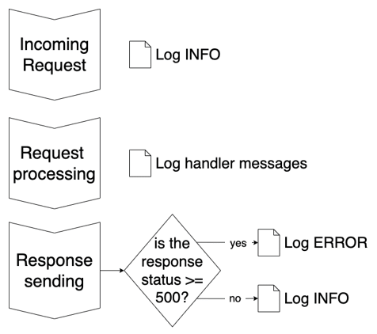
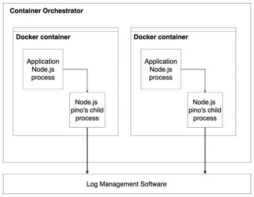

# Логирование приложений

<big>Программное обеспечение не разговаривает с нами. Иногда нам хочется, чтобы приложение объяснило, что происходит и почему что-то работает не так, как ожидалось. По этой причине очень важно научить приложение разговаривать с нами с помощью **логирования**.</big>

В этой главе мы рассмотрим, как реализовать содержательные логи приложения, чтобы помочь нам понять, что происходит в нашем программном обеспечении. Очень важно следить за тем, чтобы все работало так, как ожидалось, а также отслеживать, что пошло не так.

Вы узнаете, как настроить идеальную конфигурацию протоколирования без потери важной информации. Кроме того, вы узнаете, как избежать записи бессмысленных данных и распечатать только то, что вам нужно.

В этой главе мы рассмотрим следующие этапы обучения:

-   Как использовать логгер Fastify
-   Расширение стандартного логгера
-   Сбор логов
-   Управление распределенными журналами

!!!info "Технические требования"

    Как и в предыдущих главах, вам понадобится следующее:

    -   Рабочая установка Node.js 18
    -   [VS Code IDE](https://code.visualstudio.com/)
    -   Публичный репозиторий GitHub
    -   Рабочая командная оболочка

    :material-source-repository: Все фрагменты в этой главе находятся на [GitHub](https://github.com/PacktPublishing/Accelerating-Server-Side-Development-with-Fastify/tree/main/Chapter%2011).

## Как использовать логгер Fastify {#how-to-use-fastifys-logger}

Логирование приложений — один из столпов наблюдаемости приложений. Она предоставляет полезную информацию, позволяющую понять, что делает система, и определить, где возникает ошибка. Хорошая система протоколирования обладает следующими качествами:

-   **Консолидировать**: Это отправляет журналы на определенный выход.
-   **Структура**: Она обеспечивает формат для запросов и анализа текстовых сообщений.
-   **Контекст**: Добавляет метаданные, основанные на среде выполнения.
-   **Безопасность**: Применяет фильтры и сокращает объем данных, чтобы скрыть конфиденциальную информацию.
-   **Verbosity**: Устанавливает степень серьезности журнала в зависимости от среды. К сожалению, ведение журналов не бесплатно, так как требует затрат ресурсов системы, поэтому мы не можем просто записывать в журнал все подряд, не влияя на производительность приложения.

В целом, вы можете легко понять, правильно ли реализованы журналы приложений или нет. Но никогда не стоит недооценивать важность протоколирования.

На самом деле, когда у вас возникают проблемы в производстве, вызванные неизвестной и загадочной ошибкой, а журнал ошибок выводит туманное сообщение типа `undefined не является функцией`, в этот момент уже слишком поздно действовать, и вы не можете воспроизвести событие ошибки, потому что оно исчезло.

Логгер — это не просто спаситель, когда все горит. Журнал — это помощник в выполнении следующих задач:

-   **Аудит**: Отслеживает события, чтобы воссоздать навигацию пользователя и использование API.
-   **Метрики**: Отслеживается время, затраченное на один запрос или операцию, чтобы выявить возможные узкие места.
-   **Анализ**: Подсчитывает метрики конечных точек, чтобы спланировать рефакторинг и оптимизацию кодовой базы, например, выбрать маршруты, которые замедляют работу системы и должны быть изолированы
-   **Оповещение**: Это запускает предупреждение, когда определенные события распознаются с помощью мониторинга метрик.

Fastify поможет вам справиться с любыми ситуациями, потому что в нем есть все инструменты, необходимые для создания готового к производству приложения. Как уже говорилось в [Главе 1](../basic/what-is-fastify.md), фреймворк Fastify включает в себя модуль [`pino` logger module](https://getpino.io), который предоставляет все необходимое для того, чтобы ваше приложение говорило с вами. Прежде чем приступать к работе над кодом, нам необходимо понять некоторые базовые концепции, иначе мы можем заблудиться в дебрях конфигурации.

### Как Pino регистрирует сообщения приложения {#how-pino-logs-the-applications-messages}

Прежде чем начать, нам нужно кратко рассказать о Pino, самом быстром логгере в экосистеме Node.js. По умолчанию он выводит данные в потоки **stdout** и **stderr**. Эти потоки выводят строковое сообщение в консоль нашей оболочки, чтобы мы могли прочитать вывод на экране. Более подробную информацию вы можете получить, прочитав [эту статью](https://en.wikipedia.org/wiki/Standard_streams).

Чтобы записать что-то в журнал, нам нужно вызвать один из методов, соответствующих **уровню журнала**. Вот список в порядке возрастания серьезности:

-   `log.trace()`: Используется для печати сообщений очень низкой степени серьезности
-   `log.debug()`: Это уровень для диагностических сообщений низкой степени серьезности
-   `log.info()`: Печатаются журналы с информационным текстом
-   `log.warn()`: Указывает на проблемы или случаи, которые не должны были произойти
-   `log.error()`: Используется для отслеживания сбоев
-   `log.fatal()`: Указывает на серьезную ошибку, которая может привести к падению сервера.

Вы можете настроить журнал так, чтобы включать или выключать вывод журнала в зависимости от уровня журнала. Например, если установить пороговое значение `warn`, все журналы более низкого уровня серьезности не будут отображаться.

Все функции журнала имеют одинаковый интерфейс использования. Для наглядности мы можем перефразировать интерфейс в такие формы:

```js
const pino = require('pino')
const log = pino({ level: 'debug' })
log.debug('Hello world') // [1]
// {"level":30,"time":1644055693539,"msg":"Hello world"}
log.info('Hello world from %s', 'Fastify') // [2]
// {"level":30,"time":1644055693539,"msg":"Hello world from
   Fastify"}
log.info({ hello: 'world' }, 'Cheers') // [3]
// {"level":30,"time":1644055693539,"hello":"world","msg":
   "Cheers"}
log.info({ hello: 'world' }, 'Cheers %s', 'me') // [4]
// {"level":30,"time":1644055693539,"hello":"world","msg":
   "Cheers me"}
```

Первый синтаксис, `[1]`, регистрирует простое строковое сообщение. Он помогает в отладке и трассировке. Второй интерфейс, `[2]`, показывает нам, как Pino интерполирует строки: когда найден первый строковый аргумент, все последующие параметры будут использованы для заполнения его заполнителя. В примере кода `[2]` мы используем `%s` для заполнителя строки: вы можете использовать `%d` для чисел и `%o` для объектов JSON.

!!!note "Оптимизация интерполяции строк"

    Если вы планируете скрыть уровень журнала, вам следует предпочесть строковую интерполяцию `pino`, а не литералы шаблона или конкатенацию строк. Для примера, если написать <code>log.debug(\`Hello ${name}\`)</code>, то при каждом выполнении оператора будет обрабатываться литерал шаблона, даже если уровень журнала `DEBUG` скрыт. Это пустая трата ресурсов. Вместо этого оператор `log.debug('Hello $s', name)` не выполняет интерполяцию строк, если соответствующий уровень журнала не нуждается в выводе.

Третий синтаксис журнала `[3]` показывает, что мы можем включить объект JSON в вывод журнала, задав строковое сообщение. Этот API можно использовать и для логирования объектов `Error`. Наконец, `[4]`, который мы видели в предыдущем фрагменте кода, суммирует журнал JSON-объектов и строковую интерполяцию.

Как вы видели, на выходе получается [JSON-строка журнала](https://jsonlines.org/), в которую по умолчанию добавляется дополнительная информация, например, время журнала в миллисекундах с момента временной метки Unix, уровень журнала в виде целого числа, а также координаты системы (которые были удалены из вывода фрагмента для компактности). Вы можете настроить каждое выводимое поле JSON, управляя опциями или применяя **сериализатор**. Сериализатор журнала — это функция, которая должна возвращать JSON-объект, например строку или JSON-объект. Эта функция позволяет нам добавлять или удалять информацию из лога, поэтому давайте рассмотрим пример:

```js
const pino = require('pino');
const log = pino({
    serializers: {
        user: function userSerializer(value) {
            return { id: value.userId };
        },
    },
});
const userObj = { userId: 42, imageBase64: 'FOOOO...' };
log.info({ user: userObj, action: 'login' });
// {"level":30,"time":1644136926862,"user":{"id":42}, "action":"login"}
```

В предыдущем фрагменте кода `userObj` содержит свойство `imageBase64`, которое не должно регистрироваться, поскольку оно не является полезным и представляет собой огромную строку `base64`, которая может замедлить процесс регистрации. Поэтому, когда нам нужно зарегистрировать учетную запись приложения, мы можем определить соглашение, согласно которому соответствующий JSON должен быть присвоен свойству `user`, как показано на рисунке. Поскольку мы определили сериализатор `user` при объявлении экземпляра журнала, функция `userSerializer` будет выполнена, а ее вывод будет использован в качестве выходных данных. Таким образом мы централизовали логику регистрации объекта `user` в одной операции. Теперь мы можем регистрировать пользователя таким же образом из всего приложения.

Формат вывода JSON нельзя изменить из коробки. Это требование, чтобы быть самым быстрым логгером в панораме Node.js. Чтобы быть гибким для каждого разработчика, экосистема `pino` снабжена множеством **транспортеров**. Это плагины, которые позволяют вам делать следующее:

-   **Transform**: Преобразует вывод журнала в другой строковый формат, отличный от JSON, например [`syslog`](https://datatracker.ietf.org/doc/html/rfc5424)
-   **Передача**: Передача журналов во внешнюю систему, например **программу управления журналами**.

Формат JSON широко поддерживается и может быть легко сохранен и обработан внешними инструментами анализа, называемыми программным обеспечением для управления журналами. Это программное обеспечение позволяет собирать данные, осуществлять поиск и создавать отчеты, а также хранить их для последующего хранения и анализа.

Конфигурация транспорта зависит от того, что вы собираетесь делать в журналах. Например, если у вас уже есть программное обеспечение для управления журналами, вам может потребоваться адаптация к его формату строк журналов.

!!!note "Использование pino в качестве регистратора"

    Обратите внимание, что существует множество способов передачи записей в стороннюю систему, не связанных с `pino`, например, команда платформы, но это выходит за рамки основной темы данной книги.

Теперь, когда у вас есть общее представление о `pino`, нам нужно перейти к деталям конфигурации протоколирования, открываемым Fastify. Итак, давайте перейдем к рассмотрению всех аспектов настройки конфигурации логирования.

### Настройка конфигурации логирования {#customizing-logging-configuration}

В [Главе 3](../basic/routes.md) мы рассмотрели, как установить уровень журнала и конфигурацию красивой печати, но это гораздо больше, чем просто настройка журнала.

Конфигурация главного журнала должна быть предоставлена экземпляру Fastify во время его инициализации. Это можно сделать тремя способами, как показано в следующем фрагменте кода:

```js
const app = fastify({ logger: true }); // [1]
const app = fastify({
    logger: pinoConfigObject, // [2]
});
const app = fastify({
    logger: new MyLogger(), // [3]
});
```

Первый вариант, `[1]`, хорош, когда нам нужно попробовать несколько фрагментов кода и быстро и грязно посмотреть стандартную конфигурацию журнала Fastify.

Второй интерфейс, `[2]`, — это тот, который мы использовали до сих пор в книге, последний раз он упоминался в [главе 6](./project-structure.md). Свойство `logger` сервера принимает JSON-объект, соответствующий опциям `pino`. Мы задаем эти опции, настраивая аргументы `fastify-cli -l info --pretty-logs`. Полный список опций можно получить, прочитав [документацию Pino](https://getpino.io/#/docs/api?id=options-object).

Последний вход, `[3]`, позволяет вам предоставить новый модуль логгера и не использовать `pino` по умолчанию. Он также позволяет вам предоставить собственный экземпляр `pino`. Это полезно, если вы хотите использовать новый крупный релиз, не дожидаясь нового релиза Fastify.

!!!note "Не изменяйте библиотеку логгера"

    В этой главе вы не узнаете, как изменить модуль логгеров Fastify. Мы надеемся, что вы понимаете, почему этого делать не следует, иначе вы потеряете все тонкие настройки, которые дает фреймворк. Если вам нужно это сделать, вы можете прочитать наши рассуждения на [Stack Overflow](https://stackoverflow.com/questions/55264854/how-can-i-use-custom-logger-in-fastify/55266062).

Эти опции позволяют нам настроить базовые параметры журнала. На этом возможности не заканчиваются. С помощью Fastify можно сделать гораздо больше! Вы можете настроить уровень журнала и сериализаторы на следующих уровнях:

-   Уровень экземпляра сервера
-   Уровень плагина
-   Уровень маршрута

Давайте рассмотрим пример. Сначала нам нужен простой обработчик, который печатает массив `hello`:

```js
async function helloHandler(request, reply) {
    const hello = ['hello', 'world'];
    request.log.debug({ hello });
    return 'done';
}
```

Теперь мы можем повторно использовать этот обработчик, чтобы увидеть разное поведение в трех случаях, перечисленных ранее:

```js
const app = fastify({
    logger: {
        level: 'error',
        serializers: {
            hello: function serializeHello(data) {
                return data.join(',');
            },
        },
    },
});
app.get('/root', helloHandler);
app.inject('/root');
```

Ожидаемого вывода нет, поскольку журнал `hello` находится на уровне отладки, и мы установили порог `error`. Функция `serializeHello` вообще не выполняется. Эта настройка будет использоваться по умолчанию для всех дочерних контекстов и маршрутов, поскольку она назначается корню экземпляра сервера Fastify.

Как упоминалось ранее в этом разделе, мы можем расширить стандартную конфигурацию журнала сервера, используя две дополнительные опции плагина, управляемые самим Fastify:

```js
app.register(
    async function plugin(instance, opts) {
        instance.get('/plugin', helloHandler);
    },
    {
        logLevel: 'trace',
        logSerializers: {
            hello: function serializeHello(data) {
                return data.join(':');
            },
        },
    }
);
app.inject('/plugin');
```

Свойства `logLevel` и `logSerializers` обрабатываются Fastify, и они будут перезаписывать настройки журнала по умолчанию для экземпляра `plugin`. Это означает, что даже дочерние контексты и маршруты плагина унаследуют новую конфигурацию журнала. В этом случае ожидаемым результатом будет строка, конкатенированная двойным двоеточием:

```
{"level":20,"time":1644139826692,"pid":80527,"hostname":"MyPC","reqId"
:"req-1","hello":"hello:world"}
```

Объект опции маршрута поддерживает те же специальные свойства `logLevel` и `logSerializers`:

```js
app.get('/route', {
    handler: helloHandler,
    logLevel: 'debug',
    logSerializers: {
        hello: function toString(data) {
            return data.join('+');
        },
    },
});
app.inject('/route');
```

В примере кода маршрута теперь ожидается вывод строки, конкатенированной с помощью символа плюс:

```
{"level":20,"time":1644140376244,"pid":82198,"hostname":"MyPC
","reqId":"req-1","hello":"hello+world"}
```

Такая тонкая настройка уровня журнала — отличная возможность. Например, вы можете установить уровень `error` для стабильных маршрутов и пороговое значение `info` для совершенно новых маршрутов, которые должны использоваться в бета-версии, прежде чем считать их долговечными. Такая оптимизация снижает влияние бета-конечных точек на систему, которая может страдать от низкого уровня журнала для каждого маршрута приложения, что приводит к значительному увеличению счетчика журналов.

!!!note "Логи не бесплатны"

    Как мы уже говорили, журналы не бесплатны: они требуют затрат на использование ресурсов системы, но есть и экономические издержки. Некоторые системы управления логлайнами устанавливают цену за логлайн или размер логлайна. Fastify поможет вам контролировать этот аспект управления проектом.

Молодцы, теперь вы поняли, как настроить логгер вашего приложения под свои нужды. На данный момент мы создали основу, с которой можно начать настройку Pino. В следующем разделе мы будем использовать все возможности, о которых узнали в этой главе.

## Улучшение конфигурации логгера по умолчанию {#enhancing-the-default-logger-configuration}

Вы знаете, какие опции доступны в логгере, но что такое ценная конфигурация, и как мы можем интегрировать ее в наше приложение? Прежде всего, нам нужно определить, какие журналы мы ожидаем для каждого запроса:



<center>Рисунок 11.1 — Логика журнала запросов</center>

Как показано на _рисунке 11.1_, для каждого запроса мы ожидаем такие строки журнала: одна для входящего запроса, опционально, сколько сообщений журнала обработчика вы реализуете, и, наконец, одна для вывода ответа. Все эти строки журнала будут связаны друг с другом полем **reqId** (request-id). Это уникальный идентификатор, который генерируется для каждого запроса, когда сервер получает его. Мы уже описывали свойство `reqId` в главе 1 в разделе [The Request component](../basic/what-is-fastify.md#the-request-component).

Мы можем начать реализовывать это следующим образом:

-   Использование стандартного журнала запросов и ответов, реализованного в Fastify
-   Выполнение собственного лога с помощью хуков `onRequest` и `onSend`.

Первый вариант более прост в реализации, но он имеет меньше возможностей для настройки, поскольку вы не можете настроить сообщение. Кроме того, журнал запросов Fastify по умолчанию запускается раньше других хуков, и вы не сможете прочитать дополнительную информацию. Последний вариант прост в настройке и открыт для расширенных конфигураций.

Мы будем следовать пользовательской реализации для нашего приложения _Fastify to-do list_, реализованной в предыдущей [главе 10](./deploy.md), и следовать логике на _рисунке 11.1_, выполняя следующие действия:

1.  Отключите стандартный журнал запросов Fastify. Для этого отредактируйте файл `configs/server-options.js`, добавив в него свойство `disableRequestLogging: true`, которое мы рассматривали в [главе 1](../basic/what-is-fastify.md).
2.  Добавляем хук `onRequest` и `onResponse` в файл `plugins/error-handler.js`.

Хук будет выглядеть следующим образом:

```js
fastify.addHook('onRequest', async (req) => {
    req.log.info({ req }, 'incoming request');
});
fastify.addHook('onResponse', async (req, res) => {
    req.log.info({ req, res }, 'request completed');
});
```

Обратите внимание, что мы добавили объект `req` в журнал ответов, так как он полезен для добавления информации об URL запроса. Причиной добавления этих хуков в файл `error-handler` является централизация отслеживания HTTP-запросов. Теперь этот файл содержит все минимальные процессы логирования запросов.

Если сравнить стандартный вывод Fastify с нашей установкой, то мы потеряли свойство `responseTime` из строки журнала ответа. Теперь мы можем исправить это, добавив первый пользовательский сериализатор логов. Давайте создадим новый файл `configs/logger-options.js`. Этот документ будет содержать следующие опции Пино:

```js
module.exports = {
    level: process.env.LOG_LEVEL,
    serializers: {
        res: function (reply) {
            return {
                statusCode: reply.statusCode,
                responseTime: reply.getResponseTime(),
            };
        },
    },
};
```

Можно добавить длительность HTTP-запроса в вывод журнала, чтобы определить сериализатор `res`. Обратите внимание, что сначала необходимо установить свойство `level`. На самом деле, настройка конфигурации логгера имеет приоритет над аргументами `fastify-cli`, поэтому добавление новой переменной окружения `LOG_LEVEL` будет обязательным. Мы также не должны забыть зарегистрировать эту новую переменную в файле `schemas/dotenv.json`.

Чтобы правильно загрузить новый файл `logger-options.js` в файл `configs/server-options.js`, сделайте следующее:

```js
const loggerOptions = require('./logger-options');
module.exports = {
    disableRequestLogging: true,
    logger: loggerOptions,
    // ...
};
```

Теперь при вызове конечной точки будут выведены две строки журнала, которые мы можем отформатировать для улучшения читабельности. Хук `onRequest` выведет следующее:

```json
{
    "level": 30,
    "time": 1644273077696,
    "pid": 20340,
    "hostname": "MyPC",
    "reqId": "req-1",
    "req": {
        "method": "GET",
        "url": "/",
        "hostname": "localhost:3001",
        "remoteAddress": "127.0.0.1",
        "remotePort": 51935
    },
    "msg": "incoming request"
}
```

Хук `onResponse` выводит информацию об ответе:

```json
{
    "level": 30,
    "time": 1644273077703,
    "pid": 20340,
    "hostname": "MyPC",
    "reqId": "req-1",
    "req": {
        "method": "GET",
        "url": "/",
        "hostname": "localhost:3001",
        "remoteAddress": "127.0.0.1",
        "remotePort": 51935
    },
    "res": {
        "statusCode": 200,
        "responseTime": 8.60491693019867
    },
    "msg": "request completed"
}
```

Вы можете настроить свойства сообщения трассировки, добавив нужные вам данные. Как уже упоминалось в разделе [Как использовать логгер Fastify](#how-to-use-fastifys-logger), хороший логлайн должен иметь Контекст.

Контекст запроса помогает нам ответить на следующие распространенные вопросы:

-   Какая конечная точка выдала лог?
-   Вошел ли клиент в систему и кто был его пользователем?
-   Каковы были данные запроса?
-   Где находятся все строки журнала, относящиеся к конкретному запросу?

Теперь мы можем получить ответы на все эти вопросы, улучшив сериализаторы журнала. Поэтому давайте вернемся к файлу `configs/logger-options.js` и создадим новый сериализатор req для объекта HTTP-запроса:

```js
serializers: {
	req: function (request) {
		const shouldLogBody = request.context.config.logBody === true
		return {
			method: request.method,
			url: request.url,
			routeUrl: request.routerPath,
			version: request.headers?.['accept-version'],
			user: request.user?.id,
			headers: request.headers,
			body: shouldLogBody ? request.body : undefined,
			hostname: request.hostname,
			remoteAddress: request.ip,
			remotePort: request.socket?.remotePort
		}
	},
	res: function (reply) {
		// ...
	},
}
```

Новая конфигурация `req` эмулирует конфигурацию по умолчанию и добавляет больше полезной информации:

-   Свойство `routeUrl` кажется излишним, но оно печатает URL маршрута. Это полезно для тех URL, которые содержат параметры пути: в этом случае запись журнала `url` включает в себя входные значения, заданные клиентом. Так, например, вы получите `url: '/foo/42'`, `routeUrl: '/foo/:id'`.
-   Поле `user` показывает, кто сделал HTTP-запрос и был ли у клиента правильный логин. Поскольку процесс авторизации происходит в разные моменты времени, это свойство ожидается только при регистрации объекта `reply`.
-   Вхождение `headers` выводит заголовки запроса. Обратите внимание, что это пример. Лучше всего сначала определить, какие заголовки вам нужно регистрировать, а затем выводить только ограниченный набор.
-   Свойство `body` выводит полезную нагрузку запроса. Первое, что следует отметить, это то, что запись всего тела запроса может быть вредной из-за размера самого тела или из-за разумного содержания данных. Можно настроить маршруты, которые должны регистрировать полезную нагрузку, задав пользовательское поле в объекте опций маршрута:

    ```js
    fastify.post('/', {
        config: { logBody: true },
        handler: async function testLog(request, reply) {
            return { root: true };
        },
    });
    ```

Еще одна деталь, на которую нужно обратить внимание, — условие `|| undefined`, чтобы избежать ложных значений в лог-листе. `pino` вытесняет из лога все `undefined` свойства, но печатает `null`.

Мы добавляем все больше и больше контекста в лог запроса, что помогает нам собрать всю информацию, необходимую для отладки ответа на ошибку или просто отслеживания использования маршрутов приложения.

Вывод контекста в журнал может привести к раскрытию конфиденциальной информации, такой как пароли, маркеры доступа или личные данные (электронная почта, номера мобильных телефонов и так далее). Конфиденциальные данные не должны попадать в журналы, но давайте посмотрим, как можно скрыть эти данные в следующем разделе.

### Как скрыть конфиденциальные данные {#how-to-hide-sensitive-data}

В предыдущем разделе мы распечатали много информации, но как защитить эти данные? Мы упоминали, что хороший логлайн должен обеспечивать безопасность. Поэтому мы должны выполнить **редактирование данных**, которое маскирует строки перед их записью в журнал. `pino` поддерживает эту функцию из коробки, поэтому необходимо еще раз подправить файл `configs/logger-options.js`:

```js
module.exports = {
    level: process.env.LOG_LEVEL || 'warn',
    redact: {
        censor: '***',
        paths: [
            'req.headers.authorization',
            'req.body.password',
            'req.body.email',
        ],
    },
    serializers: {
        // ...
    },
};
```

Опция `redact` позволяет настроить, какие пути поиска должны быть замаскированы в строке `censor` для использования вместо исходного значения. В примере мы задали три прямых поиска. Рассмотрим `req.body.password`: если логгер найдет объект `req` в сущности `body` и свойство `password`, он применит сокращение.

Действующая опция конфигурации redact скроет значение свойства из журнала следующим образом:

```json
{
    // ...
    "req": {
        "method": "POST",
        "url": "/login",
        "routeUrl": "/login",
        "headers": {
            "authorization": "***",
            "content-length": "60"
        },
        "body": {
            "email": "***",
            "password": "***"
        }
        /// ...
    },
    "res": {
        "statusCode": 200,
        "responseTime": 11.697166919708252
    },
    "msg": "request completed"
}
```

Редактирование журналов — обязательный шаг для обеспечения безопасности системы и предотвращения возможных утечек данных. Вы должны четко представлять себе, какие маршруты будут регистрировать вводимые пользователем данные. Опция маршрута `logBody`, которую мы рассмотрели в предыдущем разделе, поможет вам контролировать ее и действовать соответствующим образом.

Обратите внимание, что редактирование не будет выполнено, если поле `password` будет перемещено в объект-обертку JSON. Оно не сработает, если свойство изменит регистр на `Password` (заглавная буква). Редакт поддерживает подстановочные знаки, такие как `*.password`, но это также сильно влияет на производительность логгера и, как следствие, самого приложения. Более подробную информацию по этому аспекту вы можете получить, прочитав [официальную документацию](https://github.com/pinojs/pino/blob/master/docs/redaction.md#path-syntax).

Чтобы убедиться, что подробная конфигурация, подобная той, которую мы обсуждаем, работает правильно, мы можем написать тест, который проверяет корректность цензуры в конфигурации. Для этого мы можем создать файл `test/logger.test.js`. Мы собираемся перенаправлять сообщения журнала приложения в пользовательский поток, где мы сможем обрабатывать каждую строку журнала. Для этого мы должны запустить `npm install split2`, чтобы облегчить работу с потоком. Затем мы можем реализовать следующий тест:

```js
const split = require('split2');
t.test('logger must redact sensible data', async (t) => {
    t.plan(2);
    const stream = split(JSON.parse);
    const app = await buildApp(
        t,
        { LOG_LEVEL: 'info' },
        { logger: { stream } }
    );
    await app.inject({
        method: 'POST',
        url: '/login',
        payload: { username: 'test', password: 'icanpass' },
    });
    for await (const line of stream) {
        // [1]
    }
});
```

Этот фрагмент кода представляет собой тест-скаффолдинг, который читает все строки журнала, которые выводит наше приложение. Мы используем опцию `logger.stream` для перенаправления вывода `pino` без изменения опций `configs/logger-options.js`, таких как опция reduct. После инъекции HTTP-запроса мы можем проверить выданные логи. Утверждения в `[1]` будут выглядеть следующим образом:

```js
if (line.msg === 'request completed') {
    t.ok(line.req.body, 'the request does log the body');
    t.equal(
        line.req.body.password,
        '***',
        'field redacted'
    );
    break;
}
```

Пройдет ли тест, который мы только что создали, или нет, зависит от настроек файла `.env`. Это вызвано ошибкой на этапе загрузки. Если при запуске тестов вы попытаетесь продумать последовательность загрузки файлов приложения, то получите следующие шаги:

1.  Файл `.env` загружается плагином `fastify-cli`.
2.  Плагин `fastify-cli` загружает файл `configs/server-options.js`.
3.  Файл `configs/logger-options.js` загружается для создания экземпляра Fastify. При этом будет использоваться текущая переменная окружения `process.env.LOG_LEVEL`.
4.  Плагин `fastify-cli` объединяет загруженную конфигурацию с третьим параметром `buildApp`, где мы задаем опцию `stream`.
5.  Плагин `@fastify/autoload` загрузит все приложения, включая файл `plugins/config.js`, который будет читать свойство `configData` теста, которое мы видели в [Глава 9](./testing.md).

Как мы можем исправить эту ситуацию? К счастью, `pino` поддерживает установку уровня журнала во время выполнения. Поэтому нам нужно обновить файл `plugins/config.js`, добавив в него следующее утверждение:

```js
module.exports = fp(async function configLoader (fastify, opts) {
  await fastify.register(fastifyEnv, { ... })
  fastify.log.level = fastify.secrets.LOG_LEVEL
  // ...
})
```

Можно обновлять уровень журнала во время выполнения, и это дает нам возможность настраивать уровень журнала в тестах, не влияя на производственный сценарий. Более того, мы узнали, что можем изменять серьезность журнала во время выполнения, изменяя verbosity в разделе [How to use Fastify's logger](#how-to-use-fastifys-logger)! Это позволяет адаптировать журнал к ситуации, например, вести журнал в течение фиксированного времени в режиме `debug`, а затем вернуться к `warn` автоматически без перезапуска сервера. Возможности поистине безграничны.

Теперь вы знаете, как лучше всего выводить полезный контекст и обеспечивать безопасность каждого лога. Теперь давайте выясним, как их хранить.

## Сбор логов #collecting-the-logs}

Чтение журналов можно выполнять на своем компьютере во время разработки, но это нереально делать во время производства или даже в общей тестовой среде. Чтение записей не масштабируется, но если вы попробуете оценить количество журналов, которые будет писать ваше приложение на уровне `info`, вы получите представление.

Если 10 клиентов отправляют 5 запросов в секунду, то это равно 100 строкам в секунду в день. Таким образом, файл журнала будет содержать более 8 миллионов строк только для одной установки приложения. Если мы масштабируем приложение до двух узлов, нам нужно будет искать в двух разных файлах, но если бы мы пошли по этому пути, файлы журнала были бы бесполезны, потому что они были бы недоступны.

Как уже говорилось в начале этой главы, хорошая настройка журналов позволяет нам консолидировать их в программном обеспечении для управления журналами, поэтому давайте посмотрим, как это сделать.

### Как консолидировать журналы {#how-to-consolidate-the-logs}

Прежде чем рассматривать вопрос о том, где консолидировать журналы, мы должны сосредоточиться на субъекте, который отправляет журналы в пункт назначения. Все наиболее известные программные системы управления журналами предоставляют конечную точку HTTP для отправки записей, поэтому возникает вопрос: должно ли наше приложение отправлять журнал во внешнюю систему?

Ответ — _нет_, и мы узнаем, почему, начиная со следующей диаграммы:



<center>Рисунок 11.2 — Процесс Node.js отправляет логи</center>

В сценарии на _Рисунке 11.2_ мы видим гипотетическую производственную конфигурацию, в которой наше приложение, упакованное в контейнер Docker, отправляет вывод лога непосредственно в программное обеспечение для управления логами. Транспортеры `pino` способны запускать новый дочерний процесс Node.js, чтобы свести затраты приложения на ведение логов к минимуму. Теперь, когда мы знаем больше об этой отличной оптимизации, мы все же хотели бы задать следующие вопросы:

-   Что делать, если программа управления логами не работает из-за технического обслуживания или проблем с сервером?
-   Должно ли приложение запускаться, если оно не может подключиться к внешнему месту назначения лога?
-   Влияет ли ведение логов на производительность приложения?
-   Должно ли приложение знать о месте назначения логов?

Мы думаем, вы согласитесь, что единственный возможный ответ на все эти вопросы — _нет_. Обратите внимание, что этот сценарий применим ко всем архитектурам системы, потому что на _Рисунке 11.2_ показан контейнер Docker, в котором работает наше приложение. Однако это может быть и сервер, на котором вручную запускается наше приложение Node.js. По этой причине правильным действием для реализации консолидации логов является двухэтапный процесс, как показано в следующей исправленной схеме:


<center>Рисунок 11.3 — Внешний агент отправляет лог</center>

В архитектуре, показанной на _Рисунке 11.3_, вы заметите, что приложение должно вести лог в выходные потоки `stdout` и `stderr`. Таким образом, вам не нужно будет настраивать транспорт `pino`, а хост контейнера будет использовать меньше ресурсов. За чтение и обработку сообщений будет отвечать контейнерный оркестрант. Эта задача выполняется программным **агентом**, который обычно предоставляется программным обеспечением для управления логами. В рамках этой схемы мы отделили прикладную логику лога от его назначения, изолировав первое от проблем, с которыми может столкнуться внешнее хранилище.

Отделение производителя сообщений лога от потребителя сообщений не является на 100% точным: ваше приложение должно генерировать поддерживаемую структуру через программное обеспечение для управления логами, поэтому вам необходимо проверить это у выбранного вами носителя.

Например, некоторые внешние хранилища логов требуют наличия поля `@timestamp` вместо стандартного свойства Fastify `time`, но это можно легко настроить, изменив опцию `timestamp` в `pino`. Для полноты картины здесь приведен пример редактирования файла `configs/logger-options.js`:

```js
module.exports = {
    level: process.env.LOG_LEVEL,
    timestamp: () => {
        const dateString = new Date(
            Date.now()
        ).toISOString();
        return `,"@timestamp":"${dateString}"`;
    },
    redact: {
        // ...
    },
};
```

Предыдущий пример кода показывает, что можно настроить и формат выводимой даты, заменив время эпохи по умолчанию на количество миллисекунд, прошедших с 1 января 1970 года в 00:00 по Гринвичу.

Тем не менее, вам необходимо настроить политику хранения логов. Лог может оказаться бесполезным по истечении разумного периода времени, или вам может потребоваться архивировать сообщения на более длительный срок для выполнения какого-либо юридического соглашения. Хорошее программное обеспечение для управления логами поможет вам решить все эти тривиальные задачи.

С другой стороны, вы можете столкнуться с необходимостью отправки лога приложения напрямую во внешний сервис. Возможно, в вашем распоряжении нет контейнерного оркестратора или вы хотите вести лог в файл. Итак, давайте посмотрим, как решить эту проблему.

### Консолидация логов с помощью транспортов Pino {#consolidating-logs-by-using-pino-transports}

Транспорты Pino — это компоненты, предназначенные для отправки логов в пункт назначения, например, в файловую систему или программное обеспечение для управления логами. Каждый транспорт представляет собой Node.js **рабочий поток**. Рабочий поток позволяет выполнять JavaScript параллельно и более ценен при выполнении операций, требующих больших затрат процессора. Таким образом, `pino` избавляет основное приложение от необходимости запускать тривиальный код для управления логами.

Как обычно, вы можете настроить его, задав файл `configs/logger-options.js`. Первым экспериментом будет лог в файловой системе, поэтому давайте посмотрим на следующий код:

```js
module.exports = {
    level: process.env.LOG_LEVEL,
    transport: {
        target: 'pino/file',
        options: {
            destination: require('path').join(
                __dirname,
                '../logs/errors.log'
            ),
        },
        level: 'error',
    },
    timestamp: () => {
        // ...
    },
};
```

При добавлении конфигурации `transport` мы должны задать некоторые параметры:

-   `target` — это транспорт, который будет выполняться. Вы можете указать путь для запуска пользовательской реализации транспорта или плагина с именем `pino-redis` или `pino-mongodb` для пересылки логов в соответствующие базы данных.
-   Объект `options` — это параметр, передаваемый реализации транспорта.
-   Опционально свойство `level` ограничивает количество логов, которые будет получать и обрабатывать транспортер.

Эта простая настройка будет хранить все логи `error` в специальном файле.

!!!note "Ротация лога"

    Важно отметить, что `pino/file` не заботится о ротации логов или исчерпании файловой системы. Для этих задач вы можете полагаться на такие инструменты, как `logrotate` по адресу `https://github.com/logrotate/logrotate`.

Как вы увидите, запустив сервер Fastify, эта настройка не будет печатать никаких логов в `stdout`, что сильно затрудняет процесс разработки. Поэтому нам нужно настроить два вида транспорта для нашего случая. Для этого нам нужно немного изменить предыдущую конфигурацию:

```js
module.exports = {
    level: process.env.LOG_LEVEL,
    transport: {
        targets: [
            {
                target: 'pino/file',
                options: {
                    destination: require('path').join(
                        __dirname,
                        '../logs/error.log'
                    ),
                },
                level: 'trace',
            },
            {
                target: 'pino/file',
                options: { destination: 1 },
            },
        ],
    },
    timestamp: () => {
        // ...
    },
};
```

Мы можем перечислить все необходимые нам транспорты, добавив свойство массива `targets`. В данном случае первая `target` похожа на ту, что была настроена ранее в начале этого раздела для сохранения сообщений в файл. Вторая — это по-прежнему цель `pino/file`. Цель `pino/file` — это встроенный транспорт, который записывает лог в дескриптор файла. Если аргумент `destination` является строкой, то будет открыт файловый дескриптор, как показано в пункте первой цели. Если же параметр является целым числом, то транспорт будет записывать в него. По умолчанию каждый процесс Unix имеет три стандартных файловых дескриптора:

-   `0 stdin`: Это для стандартного ввода
-   `1 stdout`: Это стандартный вывод
-   `2 stderr`: Это для стандартной ошибки

Если вы хотите прочитать об этом подробнее, вы можете начать с этой [статьи](https://ru.wikipedia.org/wiki/Файловый_дескриптор).

Если конфигурация транспорта не содержит параметра `level`, он будет получать все сообщения в соответствии с настройками серьезности основного экземпляра регистратора.

Полный список транспортов можно найти в официальной [документации](https://github.com/pinojs/pino/blob/master/docs/ecosystem.md). Вы можете найти вдохновение или интеграции, уже разработанные сопровождающими `pino`, чтобы помочь вам найти хорошее программное обеспечение для управления логами для использования в вашей повседневной работе.

!!!note "Конфликты в логах"

    При использовании транспортов в вашем приложении могут возникнуть проблемы с запуском файла `test/logger.test.js`. Транспорты имеют приоритет над параметром `stream`, который мы задали в разделе [Как скрыть конфиденциальные данные](#how-to-hide-sensitive-data), поэтому тестовый поток не будет получать строки лога. Чтобы исправить это, вам нужно опустить опции `transports` при запуске тестов. Это можно сделать, проверив объект `process.env`.

В этом разделе мы рассмотрели проблемы сбора логов и способы их решения путем создания надежной архитектуры системы или единой конфигурации `pino`. Теперь вы знаете об этих темах, которые часто упускаются из виду. Теперь, когда у нас есть единая точка доступа для чтения логов приложения, нам нужно знать, как сделать их доступными для поиска.

## Управление распределенными логами {#managing-distributed-logs}

Fastify много раз облегчал нам работу, и всегда у него есть отличный способ выполнения сложных задач. Это относится и к распределенным логам. Под распределенными записями мы подразумеваем ситуацию, когда один HTTP-запрос клиента приводит к множеству запросов в нашем приложении или во всей системе. В предыдущем разделе [Улучшение стандартной конфигурации логгеров](#enhancing-the-default-logger-configuration) мы узнали, как добавить контекст в лог Fastify, но как связать все эти сообщения с одним HTTP-запросом? А как насчет внешнего API-вызова на другой сервер Fastify? Для этого мы должны правильно настроить идентификатор запроса `reqId`.

Идентификатор запроса — это идентификатор всей вашей системы, позволяющий отследить все логи, сгенерированные одним HTTP-запросом. В Fastify вы не можете легко удалить поле request-id из выходного сообщения, поэтому всякий раз, когда вы используете `request.log` или `reply.log`, вы будете получать свойство `reqId`.

Мы можем настроить генерацию имени и значения поля request-id. Как вы видели, по умолчанию используется формат `reqId: "req-${counter}"`, где счетчик — это числовая последовательность в памяти, начинающаяся от 1 до ~2 миллиардов.

Чтобы изменить эти два значения, нам нужно обновить файл `configs/server-options.js`:

```js
module.exports = {
    disableRequestLogging: true,
    logger: loggerOptions,
    requestIdLogLabel: 'requestId',
    requestIdHeader: 'x-request-id',
    genReqId(req) {
        return (
            req.headers['x-amz-request-id'] ||
            crypto.randomUUID()
        );
    },
    ajv: {
        // ...
    },
};
```

Эти новые параметры лога не включены в свойство `logger`, поскольку они относятся к домену Fastify. Параметр `requestIdLogLabel` изменяет имя поля вывода в лог-линии.

Поле `requestIdHeader` принимает строку, представляющую имя заголовка HTTP-запроса. Этот параметр всегда будет оцениваться для установки входящего HTTP ID. Вы можете отключить его, установив значение `false`. Функция `genReqId` является последним запасным вариантом, когда корректный заголовок не найден, или проверка заголовка была отключена. Реализация функции зависит от вас: в предыдущем примере мы обращаемся к заголовку другого запроса. Мы сгенерируем случайную строку **универсально уникального идентификатора (UUID)**, чтобы присвоить ее входящему вызову, если он отсутствует.

Наконец, мы должны помнить, что следует предпочесть `request.log` или `reply.log` объекту `fastify.log`, чтобы получить `request-id` в выводе лога. Более того, нам необходимо передавать идентификатор запроса всем внутренним вызовам. Например, если сервис `POST/register`, созданный в [Глава 8](./auth.md), уведомляет микросервис биллинга, нам нужно включить значение `request-id` в правильный заголовок:

```js
async function fastifyHandler(request, reply) {
    const userId = await saveUser(request.body);
    await billingService.createWallet(userId, {
        headers: {
            'x-request-id': request.id,
        },
    });
    return { done: true };
}
```

В фрагменте кода показан возможный пример распространения `request-id` для сохранения всех обращений клиентов, связанных с запросом их создателя.

Настроив `request-id` в Fastify, вы сможете фильтровать свои логи с помощью программы управления логами, которая собирает их в приложении. Лог ошибок легко покажет весь их поток в вашей системе, что позволит вам отлаживать и копать глубже для эффективного решения проблем.

Опции журнала `request-id` — это последняя конфигурация, которую мы должны были обсудить, чтобы завершить наше путешествие в мир логов. Вы получили все знания, необходимые для установки и настройки всех этих свойств в соответствии с вашими потребностями, и на этом мы завершаем эту главу.

!!!success "Резюме"

    В этой главе мы обсудили важность ведения логов и то, как сфокусироваться на улучшении этой функции. Мы изучили множество новых опций Fastify для улучшения читаемости логов приложения. Теперь вы имеете полное представление о модуле pino и знаете, как настроить его в зависимости от архитектуры вашей системы.

    Мы успешно настроили редактирование логов, чтобы защитить наши лог-файлы и скрыть конфиденциальные данные, что является одной из самых сложных задач, но мы все равно сделали это легко, благодаря готовой к использованию в производстве цепочке инструментов Fastify.

    Вы прочитали о некоторых архитектурных паттернах для сбора логов в сложных сценариях и об аспектах, которые необходимо учитывать при работе с логами.

    Вы готовы перейти к [Главе 12](../advanced/microservices.md), где вы узнаете, как разделить наше приложение на более мелкие и независимые части.
