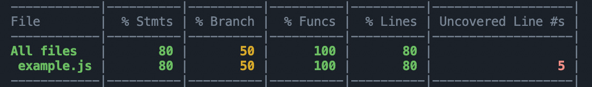
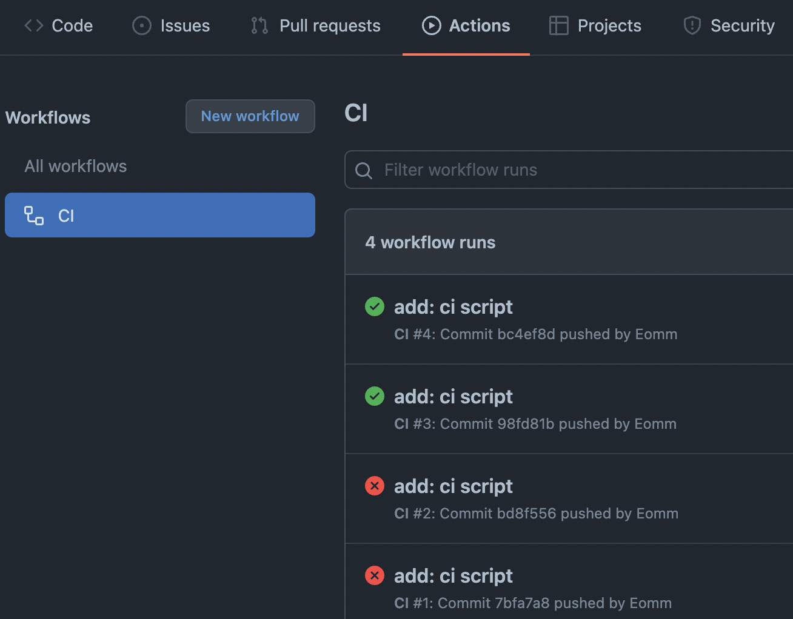
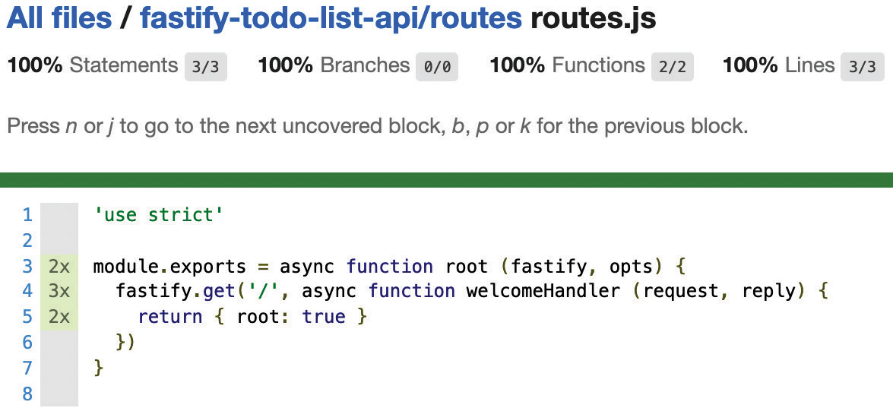

# Тестирование приложений

<big>Правильное **тестирование** — это основной и важный аспект, который сделает приложение надежным на долгие годы. Fastify поставляется с несколькими интегрированными инструментами, специально разработанными для того, чтобы сделать процесс тестирования как можно более простым. Это означает, что написание тестов приложения не будет вызывать раздражения и замедлять работу. Тем не менее, Fastify не зависит от прогонщика тестов; он прекрасно интегрируется с выбранным вами прогонщиком.</big>

В этой главе вы узнаете, как использовать интегрированные методы и запускать тесты параллельно без необходимости крутить реальный HTTP-сервер.

В этой главе мы рассмотрим следующий путь обучения:

-   Написание хороших тестов
-   Тестирование приложения Fastify
-   Работа со сложными тестами
-   Ускорение работы тестового набора
-   Где должны выполняться тесты

!!!info "Технические требования"

    Чтобы пройти эту главу, вам понадобится следующее:

    -   Рабочая установка Node.js 18
    -   [IDE VSCode](https://code.visualstudio.com/)
    -   установка Docker
    -   Публичный репозиторий GitHub
    -   Рабочая командная оболочка

    :material-source-repository: Все фрагменты в этой главе находятся на [GitHub](https://github.com/PacktPublishing/Accelerating-Server-Side-Development-with-Fastify/tree/main/Chapter%209).

## Написание хороших тестов {#writing-good-tests}

Создание тестов для приложения — это инвестиция, которая избавит вас от стресса, который может вызвать новый проект. Благодаря этим тестам вы можете быть (довольно) уверены в реализации новых функций или исправлении ошибок, не ломая существующее программное обеспечение. К сожалению, написание тестов часто приносится в жертву, когда на проект не хватает времени. Кроме того, многие считают это занятие скучным и удручающим из-за множества препятствий, с которыми вы можете столкнуться при тестировании HTTP-сервера, например, уже используемого порта сервера. Поэтому тесты часто пишутся на скорую руку и без должного внимания.

Можно сказать, что набор тестов приложения является успешным при следующих условиях:

-   Он автоматизирован — вам достаточно нажать одну кнопку, чтобы выполнить многочасовую работу.
-   Его легко поддерживать — добавление нового теста должно быть простым и не занимать больше времени, чем разработка самой функции.
-   Запуск тестов не должен занимать много времени.
-   Каждый разработчик может запускать тесты локально на своем компьютере.

Команда Fastify знает об этом и постаралась предоставить вам необходимые инструменты для поддержки в решении этих ключевых для успеха проекта задач.

Мы познакомимся с миром тестирования, чтобы узнать, как написать правильные тесты для приложения, которое мы разработали к настоящему моменту, начиная с [главы 6](./project-structure.md).

Итак, давайте перейдем к краткому введению в тестирование.

### Какие тесты нужно написать? {#what-tests-need-to-be-written}

Существует масса книг о тестах и о том, как их писать, и эта глава не ставит своей целью заменить эти источники. Эта книга предлагает вам практический подход, основанный на нашем опыте и охватывающий наиболее распространенные случаи использования, с которыми вы столкнетесь в процессе разработки.

Вам нужно будет различать следующие основные категории тестов:

-   **Unit-тесты**: Проверяют, что небольшой фрагмент программного обеспечения работает так, как ожидалось. Юнит-тесты в основном используются для проверки утилит или плагинов. Например, тестирование утилиты, которая дезинфицирует пользовательский ввод, является юнит-тестом.
-   **Интеграционные тесты**: Они направлены на то, чтобы убедиться, что все части вашего приложения работают вместе. Обычно интеграционные тесты требуют дополнительной настройки для корректной работы, поскольку они полагаются на внешние сервисы, такие как база данных или API сторонних разработчиков. Например, выполнение HTTP-запроса для проверки того, что строка была вставлена в базу данных, является интеграционным тестом.
-   **Функциональные тесты**: эти тесты отслеживают бизнес-требования и реальные сценарии, воспроизводящие использование приложения. Например, функциональный тест проверяет, может ли пользователь успешно зарегистрироваться и войти в нашу систему.
-   **Регрессионные тесты**: Каждая исправленная ошибка в вашем приложении должна сопровождаться тестом, который не сработает до того, как исправление будет применено к коду. Например, каждое исправление должно сопровождаться регрессионным тестом, связанным с тем, что требует реализация, например, работающая база данных или необычное использование API клиентом.

Независимо от используемого фреймворка, каждому приложению необходим этот минимальный набор тестов, чтобы обеспечить ценную поддержку проекта.

!!!note "Пирамида тестирования"

    Для более глубокого изучения тестов вам следует прочитать эти статьи: <https://martinfowler.com/bliki/TestPyramid.html> и <https://martinfowler.com/articles/practical-test-pyramid.html>. В этих статьях подробно объясняется, как тесты влияют на жизненный цикл вашего приложения. Первая анализирует, что за каждым тестом стоит денежная стоимость, а вторая показывает, как сбалансировать стоимость и написание тестов, потому что это разумные аспекты.

С учетом сказанного, самое сложное при написании тестов — это составить список всех сценариев использования, которые необходимо охватить. Контрольный список, которому я следую, включает в себя составление минимального списка тестов и определение приоритетов, как показано ниже:

1.  Добавить базовые тесты, чтобы убедиться в правильной загрузке приложения.
2.  Написать как минимум один успешный пример, охватывающий _счастливый путь_ для каждой конечной точки. Счастливый путь — это более простой случай, когда не происходит никаких ошибок.
3.  Напишите хотя бы один пример отказа, описывающий _несчастливый путь_ для каждой конечной точки. Как вы можете себе представить, несчастливый путь охватывает наиболее распространенные ошибки, такие как неправильный пароль при попытке пользователя войти в систему.
4.  Бизнес-кейсы должны помочь вам в определении наиболее распространенных сценариев, таких как регистрация пользователя и отписка от рабочего процесса.

Теперь мы знаем, зачем мы будем писать тесты и _какие_ тесты нам нужны, но мы также должны понимать, _как_ мы можем их писать. Давайте узнаем это в следующем разделе.

### Как писать тесты? {#how-to-write-tests}

Реализация тестового случая с помощью «чистого» Node.js проста и помогает понять основные концепции тестирования.

Давайте создадим файл `example.js`, в котором мы будем проверять, что переменная равна числу `42`:

```js
const assert = require('assert');
const myVar = '42';
assert.strictEqual(myVar, 42);
```

Запуск этого файла с помощью `node example.js` приведет к выдаче ошибки:

```
AssertionError [ERR_ASSERTION]: Expected values to be strictly equal:
'42' !== 42
```

Поздравляем! Вы написали свой первый неудачный тест!

Этот шаг очень важен при реализации тестов; _тесты должны быть неудачными_ в первую очередь. Когда у вас есть «красные» тесты, вы определяете входные данные и ожидаемый выход. Сделав это, вы можете начать писать код и проверять, соответствует ли реализация желаемому результату.

!!!note "Разработка, основанная на тестировании"

    Написание неудачных тестов называется «красной фазой» в **Test-Driven Development (TDD)**. Это методология, созданная Кентом Беком для написания более качественных и хорошо протестированных программных приложений. Даже если вы не знаете или не используете этот процесс, вы можете извлечь из него пользу, применяя некоторые простые правила, подобные тем, что мы рассмотрели в этом разделе.

В нашем примере объявление `myVar` соответствует нашей реализации, и мы заметили первую ошибку в коде — строка `'42'` не равна числу `42`! Исправив код и запустив файл заново, мы не получим никакого результата; это означает, что тест успешно завершен.

Отсюда следует, что наши тестовые файлы состоят из длинного списка **утверждений**, которые определяют наши ожидания. Когда эти утверждения успешны, мы можем сказать, что тесты пройдены или «зеленые».

Еще одно понятие, которое необходимо знать о тестировании, — это **покрытие**. Это позволяет понять, какая часть вашего кода тестируется. Давайте посмотрим на пример обновления нашего предыдущего тестового файла:

```js
const assert = require('assert');
const myVar = 42;
if (typeof myVar === 'string') {
    assert.strictEqual(myVar, '42');
} else {
    assert.strictEqual(myVar, 42);
}
```

Предыдущий фрагмент — это простой пример кода, который поможет вам освоиться с концепцией покрытия; оператор if всегда будет `false`, как мы и ожидали.

Теперь нам нужно использовать внешний инструмент, чтобы увидеть покрытие в действии. В частности, мы будем использовать инструмент покрытия `istanbul` и его интерфейс командной строки под названием `nyc`:

```sh
npx nyc node example.js
```

Предыдущая команда загружает модуль `nyc`, благодаря `npx`, и запускает `node example.js`. В результате мы получаем красивый четкий отчет:



<center>Рисунок 9.1 — Отчет о покрытии</center>

Этот отчет рассказывает нам много интересного о выполнении теста:

-   `% Stmts`: Процент выполнения утверждений во время выполнения.
-   `% Branch`: Процент проверенных путей, по которым может следовать код. Ветвь создается с помощью условных операторов (`if`, тернарного оператора, операторов `&&` и `||`), условных циклов (таких как `while`, `for` и `do-while`), операторов `break` и `continue`, а также параметров функции по умолчанию.
-   `Uncovered Line #s`: Строки исходного кода не были выполнены.

Узнать больше о выходном отчете вы можете [посетить сайт](https://istanbul.js.org/).

!!!note "100 % покрытие не означает отсутствие ошибок"

    Достижение 100-процентного покрытия кода может быть сложной задачей, а иногда и пустой тратой времени. Вам не нужно бороться за достижение такого покрытия, чтобы считать свое приложение протестированным. Вы должны сосредоточиться на тестовых случаях, которые важны для вашего приложения; один более функциональный тест лучше, чем не очень полезный тест для достижения 100-процентного покрытия.

Отчет о покрытии удобно анализировать; вы можете обнаружить мертвые ветви кода, которые нужно удалить, или случаи использования, которые вы забыли перечислить и проверить. Таким образом, упрощается ведение кодовой базы, и можно следить за результатами отчета, в то время как набор тестов становится все больше.

Теперь вы узнали основные понятия о тестировании — утверждения и покрытие. Все фреймворки для тестирования Node.js предоставляют эти две возможности. Когда вы будете сравнивать пакеты, чтобы выбрать лучший для себя, настоятельно рекомендуем вам начать оценивать утверждения, которые реализует фреймворк, и отчеты о покрытии, которые он генерирует.

Теперь мы готовы к написанию тестов нашего приложения в следующем разделе.

## Тестирование приложения Fastify {#testing-the-fastify-application}

Мы готовы реализовать тесты для нашего приложения Fastify. Прежде чем начать, нам нужно выбрать фреймворк, который поможет нам написать код. Давайте сначала выполним эту задачу!

### Установка фреймворка для тестирования {#installing-the-test-framework}

В панораме Node.js существует множество фреймворков для тестирования. Некоторые из них имеют множество мнений, а другие стараются быть агностическими. Мы не будем обсуждать сравнение самых известных модулей. Стоит упомянуть наиболее используемые сообществом (в алфавитном порядке):

-   [AVA](https://www.npmjs.com/package/ava)
-   [Jest](https://www.npmjs.com/package/jest)
-   [Mocha](https://www.npmjs.com/package/mocha)
-   [node-tap](https://www.npmjs.com/package/tap)
-   [Tape](https://www.npmjs.com/package/tape)

Мы будем использовать фреймворк `node-tap`, потому что он обладает всеми ключевыми возможностями из коробки, не требуя дополнительной настройки, например, следующими:

-   Простая в использовании и надежная реализация
-   Всеобъемлющие утверждения
-   Параллельное выполнение тестов
-   HTML-формат отчета о покрытии

Он прост в использовании, а исходный код легко читается, так что это идеальный вариант.

!!!note "Выбирайте с умом"

    У вас может возникнуть соблазн использовать самый скачиваемый фреймворк для тестирования из предыдущего списка, например Jest или Mocha. Однако вы должны знать, что эти фреймворки не были разработаны для тестирования серверного кода Node.js. Они в значительной степени полагаются на неявные глобалы — антипаттерн для тестирования предсказуемых результатов работы программного обеспечения. Это может повлиять на работу разработчика: <https://github.com/fastify/help/issues/555>.

Тем не менее, `node-tap` в значительной степени используется командой Fastify. Это может показаться мелочью, но стоит помнить — иногда в документации к плагинам нет полного примера кода, но обязательно есть несколько тестов, которые можно прочитать, чтобы получить больше информации и полноценный рабочий пример.

Нам нужно установить зависимость `node-tap`, выполнив команду `npm install tap@15 --save-dev`. Давайте посмотрим, как использовать его API.

### Создание теста читов для `node-tap` {#creating-your-node-tap-cheatsheet-test}

Прежде чем писать тесты приложения, нам нужно научиться использовать `node-tap`. Поэтому давайте создадим комплексный тестовый файл, чтобы ознакомиться со всеми наиболее используемыми функциями.

Создайте новый файл `test/cheatsheet.test.js` и напишите этот код:

```js
const t = require('tap');
t.test('a test description', (t) => {
    t.plan(1);
    const myVar = '42';
    t.equal(myVar, 42, 'this number is 42');
});
```

В предыдущем коде показан минимальный тестовый пример, который уже учит нас нескольким хорошим практикам. После импорта модуля мы можем начать определять наши тестовые случаи с помощью метода `t.test()`. Мы должны предоставить описание теста и тестовую функцию, которая реализует логику для проверки работоспособности нашего кода.

Тестовая функция принимает один единственный аргумент. Это объект `node-tap`, который предоставляет вам методы утверждений для реализации теста `logic.t.plan()` — это обязательная настройка; вы должны объявить, сколько утверждений будет выполнено в вашем тестовом примере. Если вы не зададите этот параметр, тест будет провален.

!!!note "Пропустите план теста"

    Метод `t.plan()` — лучший способ убедиться, что все утверждения были проверены. Он незаменим, когда вы тестируете асинхронный код в стиле callback. Если вы не знаете, сколько именно утверждений выполнит ваш код, для удобства вы можете использовать `t.end()` вместо установки `t.plan()` на начальном этапе реализации.

Запустить скрипт так же просто, как запустить node `test/cheatsheet.test.js`. Вы увидите красивый вывод, показывающий все успешные и неудачные шаги. Однако пример кода должен завершиться неудачей. Попробуйте исправить это и запустить файл заново. Спойлер: `myVar` — это не число, как мы узнали в предыдущем разделе [Как писать тесты](#how-to-write-tests).

Умный читатель должен был заметить, что функция утверждения `t.equal()` следует строгому сравнению. Почти все функции утверждения `node-tap` принимают три параметра в следующем порядке:

1.  Какое значение вы хотите сравнить?
2.  Какое значение вы ожидаете?
3.  Необязательное строковое сообщение или объект опции.

Давайте проверим наиболее используемые функции утверждения, добавив новые тестовые случаи в наш тестовый файл.

Чтобы проверить, что объект JSON похож на другой, мы не можем использовать `t.equal`, который используется для сравнения значений. Вместо этого мы должны использовать следующий метод для сравнения полей каждого объекта:

```js
const sameStructure = { hello: 'world' };
t.strictSame(
    sameStructure,
    { hello: 'world' },
    'the object is correct'
);
```

Мы хотим проверить, есть ли в JSON-объекте некоторые поля, в некоторых других случаях. Поэтому мы должны использовать функцию `match`:

```js
const almostLike = {
    hello: 'world',
    foo: 'bar',
};
t.match(
    almostLike,
    { hello: 'world' },
    'the object is similar'
);
```

Мы проверили, что переменная `almostLike` имеет, по крайней мере, поле свойства `hello`. Утверждение `t.match()` более мощное, чем в предыдущем примере. Оно обрабатывает каждое регулярное выражение против всех перечисляемых полей входного JSON-файла. Вы можете попробовать его, задав объект `RegExp` Node.js:

```js
t.match(
    almostLike,
    {
        hello: 'world',
        foo: /BAR/i,
    },
    'the object is similar with regex'
);
```

В прошлом примере входное свойство `foo` должно соответствовать регулярному выражению `/BAR/i`.

В последних функциях утверждения мы увидим булевы проверки и вложенные тесты:

```js
t.test('sub test', function testFunction(t) {
    t.plan(2);
    const falsyValue = null;
    t.notOk(falsyValue, 'it is a falsy value');
    t.test('boolean asserions', (subTapTest) => {
        subTapTest.plan(1);
        subTapTest.ok(true, 'true is ok');
    });
});
```

В этом фрагменте кода вы можете прочитать функции `t.notOk()` и `subTapTest.ok()`, которые передают, является ли значение ложным или истинным соответственно. Более того, в примере показан вызов `t.test()` внутри другого `t.test()`. Этот подтест позволяет лучше организовать сценарии использования и сгруппировать их в логические шаги. Обратите внимание, что подтест `t.test()` считается утверждением, когда устанавливается счетчик планов.

Прежде чем перейти к следующему разделу, мы должны поговорить еще об одном моменте. До сих пор мы рассматривали синхронные функции. Как насчет `async` функций? С помощью `node-tap` это сделать легко:

```js
const fs = require('fs').promises;
t.test('async test', async (t) => {
    const fileContent = await fs.readFile(
        './package.json',
        'utf8'
    );
    t.type(
        fileContent,
        'string',
        'the file content is a string'
    );
    await t.test('check main file', async (subTest) => {
        const json = JSON.parse(fileContent);
        subTest.match(json, { version: '1.0.0' });
        const appIndex = await fs.readFile(
            json.main,
            'utf8'
        );
        subTest.match(
            appIndex,
            'use strict',
            'the main file is correct'
        );
    });
    t.pass('test completed');
});
```

Если посмотреть на пример кода, то в качестве параметра мы указали функцию `async`. Нам не нужно устанавливать `t.plan` или вызывать функцию `t.end`. По умолчанию тест заканчивается, когда промис, возвращенный операцией `async`, успешно выполнен. Если `Promise` отклоняется, тест завершается неудачей.

Еще одно замечание по поводу кода — функция `t.test()` возвращает `Promise`, который можно ожидать. Это может быть полезно для последовательного выполнения некоторых тестов. Подробнее об этом мы поговорим в разделе _Ускорение работы тестового набора_.

Вы можете полагаться на новое утверждение `t.pass()`, чтобы быть уверенным в порядке выполнения кода, поскольку оно служит вехой, которой должен соответствовать наш код.

Мы узнали, как использовать `node-tap` и писать утверждения, которые мы будем использовать для тестирования приложения Fastify. Мы рассмотрели не все утверждения, имеющиеся в нашем распоряжении. Для получения дополнительной информации вы можете заглянуть в [официальную документацию](https://node-tap.org/docs/api/asserts/).

Теперь перейдем к следующему разделу и применим на практике то, что мы узнали до сих пор.

### Как писать тесты с помощью Fastify? {#how-to-write-tests-with-fastify}

Мы готовы написать первый тест приложения! Написание хороших тестов — это процесс, и он требует начинать с основы, чтобы построить прочную структуру. Мы будем многократно повторять один и тот же файл, чтобы многократно улучшить набор тестов.

Как уже говорилось в разделе [Начало оптимального проекта](./project-structure.md#starting-an-optimal-project) главы 6, сначала нам нужно подумать о тестах, которые мы собираемся написать. Самые основные вопросы, которые мы можем задать нашему тесту, следующие:

-   Правильно ли запускается приложение?
-   Готовы ли маршруты к приему входящих HTTP-запросов?
-   Управляет ли приложение нездоровой системой?

Чтобы ответить на эти вопросы, мы можем написать файл `test/basic.test.js`:

```js
const t = require('tap');
t.todo('the application should start', async (t) => {});
t.todo('the alive route is online', async (t) => {});
t.todo('the application should not start', async (t) => {});
```

Мы перечислили тестовые случаи, которые будем писать, используя метод `t.todo()` вместо обычного `t.test()`. «Todo» служит напоминанием о необходимости найти те функции, которые должны быть реализованы.

Давайте начнем с первого теста. Нам нужно загрузить приложение, но мы используем модуль `fastify-cli` для загрузки нашего файла `app.js`. К счастью, есть утилита `fastify-cli/helper`, которая поможет нам:

```js
const fcli = require('fastify-cli/helper');
const startArgs = '-l info --options app.js';
t.test('the application should start', async (t) => {
    const envParam = {
        NODE_ENV: 'test',
        MONGO_URL: 'mongodb://localhost:27017/test',
    };
    const app = await fcli.build(startArgs, {
        configData: envParam,
    });
    t.teardown(() => {
        app.close();
    });
    await app.ready();
    t.pass('the application is ready');
});
```

Прежде всего, нам нужно загрузить утилиту `fastify-cli/helper`. Она работает как команда `fastify` в теге `package.json > scripts`. На самом деле, нам нужна константа `startArgs`, которая включает в себя ту же конфигурацию, которую мы используем для запуска сервера. Вы можете скопировать и вставить ее из скрипта `start` в `package.json`.

Метод `fcli.build()` — это асинхронная функция, которая возвращает экземпляр Fastify. Это то же самое, что выполнить команду `fastify start <args>` из оболочки. Ключевое отличие заключается в том, что сервер не прослушивается. Разницу между `fastify.ready()` и `fastify.listen()` мы уже рассматривали в [Глава 2](../basic/plugin-system.md).

Обратите внимание, что функция `build` принимает дополнительный параметр JSON. Второй аргумент option принимает параметр `configData`, `opts`, полученный в качестве входных данных в файле `app.js`:

```js
module.exports = async function (fastify, opts) { ... }
```

Эта техника является одной из лучших для внедрения всех возможных конфигураций, поддерживаемых приложением. Мы протестируем все возможные комбинации без построения странных алгоритмов загрузки файлов с помощью сопоставления шаблонов.

Чтобы завершить настройку теста, нам нужно отредактировать файл `plugins/config.js`, добавив в него следующую строку:

```js
await fastify.register(fastifyEnv, {
    confKey: 'secrets',
    data: opts.configData,
    schema: fastify.getSchema('schema:dotenv'),
});
```

Таким образом, мы можем управлять источником данных `@fastify/env`. По умолчанию плагин считывает данные из `process.env`. Если добавить в плагин параметр `data`, он будет предпочтительнее, чем `env`, что позволит запускать тесты, управляя переменными окружения.

После создания экземпляра Fastify нам нужно отследить, что мы хотим закрыть сервер по окончании теста. Метод `t.teardown()` принимает функцию, выполняемую при выполнении этого условия. Если мы забудем добавить ее, тестовый сценарий никогда не завершится, потому что открытые соединения с базой данных будут поддерживать работу среды выполнения Node.js.

Если посмотреть на последние две строки тестовой реализации, то мы запускаем `await app.ready()` для загрузки приложения без запуска HTTP-сервера. Все плагины и маршруты загружаются только в случае успешного завершения загрузки. Этот тест помогает нам найти общесистемные ошибки, такие как неработающие плагины или неправильная конфигурация.

Перед началом тестов мы не должны забыть включить MongoDB, выполнив команду `npm run mongo:start`. Теперь команда `node test/basic.test.js` приводит к успешному запуску тестов.

Вы завершили первый важный шаг на пути к проверенному в боях приложению Fastify! Теперь давайте выполним остальные тесты, сосредоточившись на пошаговом улучшении нашего кода.

Второй тестовый пример включает в себя проверку работоспособности базового маршрута. Первая задача — избежать повторения кода для создания экземпляра Fastify. Это было бы просто — скопировать и вставить, но посмотрите на следующий код:

```js
async function buildApp(t, env = envParam, serverOptions) {
    const app = await fcli.build(
        startArgs,
        { configData: env },
        serverOptions
    );
    t.teardown(() => {
        app.close();
    });
    return app;
}
t.test('the alive route is online', async (t) => {
    const app = await buildApp(t);
    const response = await app.inject({
        method: 'GET',
        url: '/',
    });
    t.same(response.json(), { root: true });
});
```

Мы определили функцию `buildApp`, которая снижает сложность сборки приложения. Она требует на вход тестовый объект и необязательный JSON-объект, имитирующий переменные окружения. Кроме того, можно объединить содержимое файла `configs/server-options.js` с объектом `serverOptions`, указав третий параметр для функции `fcli.build`. Это действительно удобно — иметь возможность контролировать каждый аспект вашего сервера Fastify при выполнении тестов.

Новая заметная утилита — `app.inject(options[, callback])`. Эта функция представляет собой метод экземпляра Fastify, который запускает сервер со статусом готовности и создает фальшивый HTTP-запрос на сервере Fastify. Это означает, что приложение полностью загружено, но HTTP-сервер не прослушивает входящие HTTP-запросы. Тем не менее, вы можете вызывать свои маршруты, внедряя фальшивый HTTP-запрос. Поддельный HTTP-запрос имитирует настоящий HTTP-запрос, создавая объекты `http.IncomingMessage` и `http.ServerResponse`.

Работа приложения без удержания порта хоста имеет большие преимущества:

-   Тесты выполняются быстрее
-   Можно запускать тесты одновременно

Интерфейс `app.inject()` принимает аргумент JSON для составления HTTP-запроса. Наиболее используемые свойства следующие:

-   `method`: HTTP-метод запроса.
-   `url` или `path`: URL-адрес для вызова во время поддельного запроса.
-   `headers`: JSON-строка с ключом, задающая заголовки запроса.
-   `payload` или `body`: Это может быть строка, буфер, поток или объект JSON. Последний будет стробирован, а заголовок content-type по умолчанию будет установлен как `application/json`.
-   `query`: JSON-строка с ключом для задания строки запроса.
-   `cookies`: Строка-ключ JSON для присоединения к заголовкам cookies запроса.

Полный список опций вы можете найти, прочитав документацию по `light-my-request` по адресу <https://github.com/fastify/light-my-request#injectdispatchfunc-options-callback>.

API `inject` возвращает `Promise`, когда обратный вызов отсутствует — как это делает `app.ready()`. `Promise` выполняет расширенный объект `http.ServerResponse`, который вы можете прочитать упрощенным способом — например, мы использовали `response.json()` для получения JSON в нашем примере кода. Это работает только в том случае, если приложение возвращает полезную нагрузку в формате JSON. В остальных случаях вы можете получить доступ к этим свойствам:

-   `statusCode`: Возвращает номер ответа с кодом статуса HTTP
-   `headers`: Возвращает JSON-объект с ключевой строкой, который отображает заголовки ответа
-   `payload`: Возвращает полезную нагрузку ответа в виде строки UTF-8
-   `rawPayload`: Возвращает полезную нагрузку ответа в виде объекта `Buffer`.
-   `cookies`: Возвращает JSON-строку с ключом, отображающую заголовки cookie ответа.

Модуль `light-my-request` делает тестирование приложения дружественным и простым, благодаря перечисленным опциональным утилитам, уменьшающим количество кода, который мы должны написать, и увеличивающим количество того, что мы можем утверждать. Предыдущий фрагмент кода, реализующий тест маршрута, можно свести к следующим трем шагам:

1.  Создание приложения.
2.  Создание поддельного HTTP-вызова.
3.  Проверка вывода ответа.

Надеюсь, вы в восторге от этого, как и я! Всего за несколько строк кода мы смогли раскрутить все приложение и сделать HTTP-вызов на сервер Fastify.

И последнее, но не менее важное: мы должны разобраться со случаями ошибок. Тестирование счастливого пути приложения может стать скучным в какой-то момент в будущем. Настоящая задача — проверить, как программа справляется с ошибками, такими как разрыв соединения или неправильный ввод данных. Мы завершим наши базовые тесты, добавив несколько подтестов к случаю `t.todo('приложение не должно запускаться')`.

Мы заставим плохое окружение проверить, что сервер не запускается при неправильной конфигурации, но мы также должны быть уверены, что ошибка сообщает нам правильную информацию. Давайте перейдем к следующему коду:

```js
t.test(
    'the application should not start',
    async (mainTest) => {
        mainTest.test(
            'if there are missing ENV vars',
            async (t) => {
                try {
                    await buildApp(t, {
                        NODE_ENV: 'test',
                        MONGO_URL: undefined,
                    });
                    t.fail('the server must not start');
                } catch (error) {
                    t.ok(error, 'error must be set');
                    t.match(
                        error.message,
                        "required property 'MONGO_URL'"
                    );
                }
            }
        );
    }
);
```

В этом фрагменте кода мы добавили подтест, который проверяет, правильно ли реагирует плагин `@fastify/env` на невыполнение предварительных условий. Метод `t.fail()` работает как ловушка; при выполнении он останавливает тест и устанавливает его как неудачный. Тем самым вы заявляете, что «этот код не должен выполняться».

Еще один полезный тест, который можно добавить, — недоступное соединение `mongodb`:

```js
mainTest.test('when mongodb is unreachable', async (t) => {
    try {
        await buildApp(t, {
            NODE_ENV: 'test',
            MONGO_URL: 'mongodb://localhost:27099/test',
        });
        t.fail('the server must not start');
    } catch (error) {
        t.ok(error, 'error must be set');
        t.match(error.message, 'connect ECONNREFUSED');
    }
});
```

Если вы неправильно зададите `MONGO_URL`, сервер Fastify не сможет подключиться и не запустится, как ожидалось.

Отлично! Теперь вы написали свои первые базовые тесты приложения. Еще многое нужно учесть, чтобы объявить свое приложение протестированным, но теперь у вас есть прочные знания инструментов и методологии, чтобы добавлять все больше и больше проверок.

В следующем разделе мы улучшим возможности повторного использования кода и опыт разработчика, чтобы писать тесты как можно более гладко.

### Как улучшить опыт разработчика? {#how-to-improve-the-developer-experience}

Прежде чем писать все тестовые случаи для конечных точек приложения, мы должны спросить себя, есть ли повторяющиеся задачи, которые мы должны автоматизировать. В самом деле, нам нужно не забывать запускать контейнер MongoDB и останавливать его каждый раз. По этой причине мы можем оптимизировать этот процесс, добавив простой скрипт, который будет запускаться перед тестами. Для этого мы будем использовать модуль [`dockerode`](https://www.npmjs.com/package/dockerode).

Давайте создадим файл с именем `test/helper-docker.js`, а затем отобразим команду `docker run` в конфигурацию:

```js
const Containers = {
    mongo: {
        name: 'fastify-mongo',
        Image: 'mongo:5',
        Tty: false,
        HostConfig: {
            PortBindings: {
                '27017/tcp': [
                    {
                        HostIp: '0.0.0.0',
                        HostPort: '27017',
                    },
                ],
            },
            AutoRemove: true,
        },
    },
};
```

Предыдущий код будет полезен для управления всеми образами Docker, которые могут понадобиться нам в будущем. Этот фрагмент кода повторяет команду `docker run -d -p 27017:27017 --rm --name fastify-mongo mongo:5` в виде сценария Node.js, который легче поддерживать и читать.

Теперь программа должна уметь делать следующее:

-   Понимать, запущена ли MongoDB
-   Запустить контейнер MongoDB
-   Остановить контейнер MongoDB

На этом этапе мы можем определить интерфейс, экспортируемый файлом `helper-docker.js`:

```js
const Docker = require('dockerode');
function dockerConsole() {
    const docker = new Docker();
    return {
        async getRunningContainer(container) {
            // TODO
        },
        async startContainer(container) {
            // TODO
        },
        async stopContainer(container) {
            // TODO
        },
    };
}
module.exports = dockerConsole;
module.exports.Containers = Containers;
```

Мы можем использовать модуль `dockerode` для реализации служебной функции, чтобы узнать это. Чтобы получить запущенный контейнер, скрипт должен прочитать все запущенные контейнеры, а затем найти интересующий нас:

```js
async getRunningContainer(container) {
	const containers = await docker.listContainers();
	return containers.find((running) => {
		return running.Names.some((name) =>
			name.includes(container.name)
		);
	});
},
```

Аргументом `container` будет `Containers.mongo`, определенный в фрагменте кода в начале этого раздела.

Чтобы реализовать функцию, запускающую контейнер вместо него, нам нужно передать тот же объект `Containers.mongo` в `dockerode`:

```js
async startContainer(container) {
	const run = await this.getRunningContainer(
		container
	);
	if (!run) {
		await pullImage(container);
		const containerObj = await docker.createContainer(
			container
		);
		await containerObj.start();
	}
},
```

Функция `startContainer` запустит сервер MongoDB локально, если он еще не запущен — приятно и просто!

Наконец, последняя утилита функции `stopContainer` для остановки контейнера будет выглядеть следующим образом:

```js
async stopContainer(container) {
	const run = await this.getRunningContainer(
		container
	);
	if (run) {
		const containerObj = await docker.getContainer(
			run.Id
		);
		await containerObj.stop();
	}
},
```

Мы завершили работу над утилитой `docker`, но нам все еще нужно использовать ее в наших тестах. Для этого нам нужно обновить исходный код `basic.test.js`, добавив следующий скрипт:

```js
const dockerHelper = require('./helper-docker');
const docker = dockerHelper();
const { Containers } = dockerHelper;
t.before(async function before() {
    await docker.startContainer(mongo);
});
t.teardown(async () => {
    await docker.stopContainer(
        dockerHelper.Containers.mongo
    );
});
```

Вы должны уметь распознавать три этапа сценария:

1.  Загрузка сценария `helper-docker` и инициализация переменных.
2.  Установите функцию `t.before()`, которая запустит контейнер MongoDB. Функция `before` будет выполняться один раз и перед всеми функциями `t.test()`.
3.  Функция `teardown` остановит контейнер, когда все тесты будут завершены.

Теперь, когда вам и вашей команде понадобится запустить тесты, больше не нужно будет помнить о чем-то большем, чем просто выполнить `npm test`.

Тестирование приложения еще не завершено, как и рефакторинг исходного кода. Этот процесс — непрерывная эволюция, и ему еще потребуется несколько итераций, прежде чем он станет стабильным. Мы написали только один единственный тестовый файл. Следующей задачей будет написание нового тестового файла, не дублируя исходный код. Итак, давайте завершим наши тесты в следующем разделе.

## Работа со сложными тестами {#dealing-with-complex-tests}

До сих пор мы рассматривали простые тесты, которые не требовали многократных запросов к API. Итак, давайте создадим файл `test/login.test.js` для проверки регистрации и первого входа пользователя в наше приложение. Мы будем использовать то, чему научились до сих пор, помня о том, что не хотим повторять код.

Нам нужно построить экземпляр Fastify, чтобы написать новые тестовые случаи, как мы это делали в файле `test/basic.test.js`. Для этого нам нужно сделать следующее:

1.  Создайте новый файл утилиты и назовите его `test/helper.js`.
2.  В файл `test/helper.js` переместите функцию `buildApp` и ее конфигурационные переменные `startArgs` и `envParam`. Это действие требует некоторого копирования и вставки.
3.  Обновите файл `test/basic.test.js` в рамках нового импорта, `const { buildApp } = require('./helper')`.

Таким образом, мы сможем повторно использовать код для инстанцирования приложения Fastify во всех тестовых файлах, которые мы собираемся создать. Теперь мы готовы к написанию более сложных тестов.

### Повторное использование нескольких запросов {#reusing-multiple-requests}

У каждого маршрута есть требования к данным, которые можно удовлетворить, повторив рабочий процесс клиента — например, нам нужно сначала создать пользователя, чтобы протестировать его удаление. Итак, мы можем приступить к написанию тестовых примеров для процесса входа в систему. Набор тестов должен ответить на следующие вопросы:

-   Блокирует ли проверка авторизации неавторизованных пользователей?
-   Работают ли конечные точки регистрации и входа в систему так, как ожидалось?

Первая проверка должна убедиться, что защищенные маршруты защищены, поэтому мы можем внедрить немного больше логики в исходный код теста:

```js
t.test('cannot access protected routes', async (t) => {
    const app = await buildApp(t);
    const privateRoutes = ['/me'];
    for (const url of privateRoutes) {
        const response = await app.inject({
            method: 'GET',
            url,
        });
        t.equal(response.statusCode, 401);
        t.same(response.json(), {
            statusCode: 401,
            error: 'Unauthorized',
            message:
                'No Authorization was found in request.headers',
        });
    }
});
```

Мы можем итерировать массив `privateRoutes`, чтобы проверить, защищены ли маршруты. Здесь я показываю, как можно автоматизировать код, не повторяясь.

Прежде чем войти в приложение, пользователь должен зарегистрироваться на платформе, поэтому мы должны добавить тест для этого. Сейчас это простая задача, но вот код для полноты картины:

```js
t.test('register the user', async (t) => {
    const app = await buildApp(t);
    const response = await app.inject({
        method: 'POST',
        url: '/register',
        payload: {
            username: 'test',
            password: 'icanpass',
        },
    });
    t.equal(response.statusCode, 201);
    t.same(response.json(), { registered: true });
});
```

Затем нам нужно протестировать конечную точку входа, чтобы убедиться, что она работает так, как ожидалось. Она должна возвращать **JWT-токен** (как обсуждалось в [Глава 8](./auth.md)), и мы можем использовать его для доступа к конечным точкам `privateRoutes`. Как вы можете себе представить, тест на вход в систему прост и выглядит следующим образом:

```js
t.test('successful login', async (t) => {
    const app = await buildApp(t);
    const login = await app.inject({
        method: 'POST',
        url: '/authenticate',
        payload: {
            username: 'test',
            password: 'icanpass',
        },
    });
    t.equal(login.statusCode, 200);
    t.match(login.json(), { token: /(\w*\.){2}.*/ });
});
```

Тест аутентификации выполняет вызов `POST`, предоставляя правильные данные пользователя и проверяя, что служба возвращает строку токена. Вы можете применить более строгую проверку и к выходному токену. Теперь мы можем использовать сгенерированный токен, добавив новый подтест после утверждения `t.match()`:

```js
t.test('access protected route', async (t) => {
    const response = await app.inject({
        method: 'GET',
        url: '/me',
        headers: {
            authorization: `Bearer ${login.json().token}`,
        },
    });
    t.equal(response.statusCode, 200);
    t.match(response.json(), { username: 'John Doe' });
});
```

Тест `access protected route` полагается на объект `login` для аутентификации запроса и успешного доступа к конечной точке. Обратите внимание, что в подтесте не нужно создавать приложение; мы можем использовать то, которое было создано в родительском тестовом примере. Можно создать сложные рабочие процессы и смоделировать все сценарии, чтобы охватить бизнес-кейсы.

### Имитация данных {#mocking-the-data}

Чтобы завершить наше путешествие по тестам, мы должны поговорить о **мокингах**. Макет — это поддельная реализация реального компонента приложения, которая действует условно, чтобы имитировать поведение, которое трудно воспроизвести. Мы будем использовать макет для проверки неудачной регистрации, когда служба вставляет данные в базу данных.

Многие инструменты помогут вам написать имитатор, но мы оставим это на низком уровне, чтобы понять, как он работает. Давайте перейдем к коду:

```js
function cleanCache() {
    Object.keys(require.cache).forEach(function (key) {
        delete require.cache[key];
    });
}
t.test('register error', async (t) => {
    const path = '../routes/data-store.js';
    cleanCache(); // [1]
    require(path); // [2]
    require.cache[require.resolve(path)].exports = {
        // [3]
        async store() {
            throw new Error('Fail to store');
        },
    };
    t.teardown(cleanCache); // [4]
    const app = await buildApp(t);
    const response = await app.inject({
        url: '/register',
        // ...
    });
    t.equal(response.statusCode, 500);
});
```

Моки полагаются на то, как Node.js загружает исходный код приложения. По этой причине нам нужно взять на себя логику по умолчанию для нашей области видимости. Каждый раз, когда выполняется оператор `require('something')`, в экспортируемых данных `module.exports` создается глобальный кэш, так что если вы запустите оператор `require` дважды, файл будет загружен только один раз. Учитывая это, нам нужна функция для очистки этого кэша, чтобы внедрить нашу имитационную реализацию. Нам нужна функция `cleanCache`, которая удаляет весь загруженный код. Это совсем не эффективно. Вы можете отфильтровать вывод на основе пути к вашему проекту, чтобы оптимизировать его.

Тестовая реализация делает несколько вещей перед вызовом функции `buildApp` (как показано в предыдущем блоке кода):

1.  `[1]` очищает кэш; нам нужно удалить все кэшированные файлы, использующие файл `path`. Невозможно знать каждый файл, который его использует, поэтому мы очистим весь кэш в качестве демонстрации.
2.  По адресу `[2]` загружаем целевой файл, над которым собираемся поиздеваться.
3.  В `[3]` применяем имитацию к кэшу. Для этого нам необходимо знать интерфейс файла `path`. Как вы понимаете, это инвазивный тест, который не адаптируется ни к какому рефактору.
4.  Наконец, блок `[4]` должен удалить реализацию mock по завершении теста, чтобы позволить Node.js перезагрузить оригинальный файл. Мы не можем очистить только кэш `path`, потому что все файлы, которые использовал mock, были кэшированы в самом mock.

Как видите, техника тестирования с помощью макета требует знаний о внутреннем устройстве Node.js. Модули, которые помогают вам имитировать код, работают так же, как и предыдущий фрагмент кода, но обеспечивают лучший пользовательский опыт. Более того, этот тест может измениться со временем, когда изменится файл `path`. Вы должны оценить, нужно ли вам объединять тесты внутри кодовой базы.

Иногда этот метод не подходит. Примером может служить сторонний модуль, который не нужно тестировать в тестовом наборе, например, внешняя библиотека авторизации.

Теперь вы добавили в свой тестовый набор новые инструменты, которые вы будете использовать для оценки большего количества вариантов при реализации тестового набора. В предыдущем разделе мы замедлили тестирование, очистив кэш. Давайте узнаем, как ускорить тесты в следующем разделе.

## Ускорение работы тестового набора {#speeding-up-the-test-suite}

В реальном приложении не так много тестов, но все они довольно быстрые. Пока ваш проект будет расти, тесты будут занимать все больше времени и раздражать. Нередко набор тестов выполняется в течение 15 минут, но это слишком много времени! Сейчас мы посмотрим, как можно ускорить выполнение тестов, чтобы избежать подобной ситуации, распараллелив их выполнение и оценив, какие подводные камни таит в себе эта техника.

### Выполнение тестов параллельно {#running-tests-in-parallel}

Чтобы улучшить выполнение тестов, нам нужно обновить тестовый скрипт в файле `package.json`:

```json
"test": "tap test/**/**.test.js",
```

Команда `npm test` выполнит все файлы в папке `test/`, которые заканчиваются суффиксом `test.js`. Самое интересное, что каждый файл выполняется параллельно на отдельном процессе Node.js! Тем не менее, это скрывает некоторые соображения, о которых вы должны знать при написании тестов:

-   `process.env` отличается для каждого тестового файла.
-   Нет общих глобальных переменных для всех файлов (и тестов)
-   Модуль `require` выполняется по крайней мере один раз для каждого порожденного процесса Node.js
-   Выполнение `process.exit()` остановит один файл выполнения

Это не ограничения, но наличие этих правил поможет вам организовать код наилучшим образом и быстрее всего выполнять тесты. Кроме того, вы вынуждены избегать глобальных объектов и функций, которые добавляют [побочные эффекты](https://softwareengineering.stackexchange.com/questions/40297/what-is-a-side-effect). По этой причине паттерн фабрики, который мы приняли с первой главы, является большим выигрышем — каждый тестовый пример будет создавать свои собственные объекты со своей конфигурацией, не конфликтуя с другими файлами.

!!!note "Аргумент `--jobs`"

    Командный интерфейс `tap` принимает параметр `-j=<n> --job=<n>`, который задает, сколько тестовых файлов может быть запущено параллельно. По умолчанию это значение равно количеству ядер процессора системы. Установка значения `1` отключает параллельность.

Во фреймворке `node-tap` есть обширный раздел о [параллельном выполнении тестов](https://node-tap.org/docs/api/parallel-tests/).

### Как управлять общими ресурсами? {#how-to-manage-shared-resources}

Управление общими ресурсами — это афера с параллелизмом. Для достижения этого результата нам нужно реализовать последний рефактор в нашем тестовом наборе. Общий ресурс, о котором я говорю, — это база данных. Использовать утилиту `helper-docker` в каждом тестовом файле — не вариант. Мы столкнемся с ошибками, связанными с тем, что порт хоста уже используется, или с конфликтом Docker, как, например, в следующем случае:

```
Conflict. The container name "/fastify-mongo" is already in use by
container "e24326". You have to remove (or rename) that container to
be able to reuse that name
```

Есть несколько вариантов решения этой проблемы:

-   Настроить конфигурацию каждого тестового файла. Запуск контейнера базы данных для каждого файла требует много системных ресурсов, поэтому вы должны тщательно оценить этот вариант. Это самый простой способ решить проблему, но в результате мы замедлим работу набора.
-   Изменить базу данных. Сейчас мы используем настоящую базу данных, но в экосистеме npm есть много альтернатив, например, базы данных in-memory, эмулирующие базы данных NoSQL или SQL. Это, безусловно, хороший вариант, который вы должны принять во внимание.
-   Создайте предтестовые и посттестовые скрипты для раскрутки общих ресурсов перед выполнением тестов. Обратите внимание, что для каждого файла нужен свой набор данных или схема базы данных для проверки утверждений, иначе один тест может стереть все данные для других тестов!

Это наиболее распространенные решения проблемы общих ресурсов. Первый вариант не работает при ограниченных ресурсах. Второй вариант не работает, если вы используете базу данных, которая не имеет реализации in-memory. Поэтому мы будем использовать третий вариант, потому что он научит вас одному реальному сценарию, который работает всегда. Не бойтесь. Это вопрос небольшого рефакторинга исходного кода.

Давайте создадим новый файл `test/run-before.js`; вырежем и вставим код `before/teardown` из файла `test/basic.test.js`. Новый файл будет выглядеть следующим образом:

```js
const t = require('tap');
const dockerHelper = require('./helper-docker');
const docker = dockerHelper();
const { Containers } = dockerHelper;
t.before(async function before() {
    await docker.startContainer(Containers.mongo);
});
```

Файл `basic.test.js` будет становиться все меньше и меньше с каждым рефактором. Это значит, что у нас все отлично. Теперь нам нужен еще один файл под названием `test/run-after.js`. Он будет похож на `run-before`, но вместо `t.before()` мы должны вырезать функцию `teardown`:

```js
t.teardown(async () => {
    await docker.stopContainer(Containers.mongo);
});
```

Мы почти закончили рефакторинг. Теперь мы должны обновить файл `basic.test.js`, обновив все использования `buildApp` и установив базу данных по умолчанию:

```js
const app = await buildApp(t, {
    MONGO_URL: 'mongodb://localhost:27017/basis-test-db',
});
```

Затем наступает очередь файла `login.test.js` создать свой собственный экземпляр базы данных:

```js
const app = await buildApp(t, {
    MONGO_URL: 'mongodb://localhost:27017/login-test-db',
});
```

Наконец, нам нужно использовать два новых аргумента `node-tap`, отредактировав файл `package.json`:

```json
"test": "tap --before=test/run-before.js test/**/**.test.js --after=test/run-after.js",
"test:nostop": "tap --before=test/before.js test/**/**.test.js"
```

Параметр `--before` выполнит входной файл до запуска всего набора тестов. Аргумент `--after` выполняет то же самое, но в конце выполнения тестового набора. Обратите внимание, что дополнение `test:nostop` равнозначно сценарию `test`, но не останавливает и не очищает сервер базы данных в конце процесса. Этот сценарий очень полезен, когда вы занимаетесь разработкой и вам нужно проверить данные в базе данных вручную.

Вам сложно управлять общими ресурсами? Если да, то благодаря паттерну стиля кодирования Fastify вы должны стать очень удобными в работе с этими рефакторами. Мы можем делать это только потому, что здесь нет глобальных объектов, и мы можем инстанцировать столько экземпляров Fastify, сколько нам нужно, не заботясь о портах хоста.

Теперь у вас есть начальные знания, чтобы справиться со сложностью параллелизма. Это нелегко, но вы можете преодолеть сложность с помощью понятного кода и многократно используемых функций.

В следующем разделе мы дадим несколько предложений, чтобы продвинуть вашу кодовую базу к звездам.

## Где должны выполняться тесты {#where-tests-should-run}

До сих пор мы выполняли наши тесты вручную на компьютере. Это хорошо, и это обязательно на этапе разработки. Однако этого недостаточно, потому что наша установка может быть отредактирована, или у нас могут быть нефиксированные файлы.

Чтобы решить эту проблему, можно добавить конвейер **Continuous Integration (CI)**, который запускается удаленно для управления нашим репозиторием. Основные обязанности CI-конвейера заключаются в следующем:

-   Запуск набора тестов для проверки кода в удаленном Git-репозитории
-   Создание кодовой базы для создания артефактов, если это необходимо
-   Выпуск артефактов путем запуска конвейера **Continuous Delivery (CD)** для развертывания программного обеспечения.

Рабочий процесс CI будет уведомлять нас о своем статусе, и если он находится в красном состоянии, значит, тесты приложения не прошли последнюю фиксацию. Удаленный запуск тестов позволит избежать ложноположительных результатов из-за настроек нашего локального окружения.

Мы построим простой рабочий процесс CI, используя GitHub Actions. Это бесплатный сервис для публичных репозиториев, с бесплатной ограниченной квотой для частных. Мы не будем вдаваться в подробности и просто вкратце рассмотрим, как легко начать использовать CI-конвейер.

Чтобы создать рабочий процесс CI, вам нужно создать новый файл с именем `.github/workflows/ci.yml`. Исходный текст должен быть следующим:

```yml
name: CI
on: [push, pull_request]
jobs:
    test-job:
        runs-on: ubuntu-latest
        steps:
            - name: Check out the source code
              uses: actions/checkout@v2
            - name: Install Node.js
              uses: actions/setup-node@v2
              with:
                  node-version: 18
            - name: Install Dependencies
              run: npm install
            - name: Run Tests
              run: npm test
```

Как видите, в скрипте прописаны все шаги, которые необходимо выполнить для запуска проекта:

1.  Проверьте исходный код.
2.  Установите нужную версию Node.js.
3.  Установите проект.
4.  Запустите тестовый скрипт.

Этот пошаговый процесс является ключевым в конфигурации CI. Если вы захотите попробовать другие поставщики, например CircleCI, Bitbucket Pipelines или Travis CI, вам придется изменить синтаксис конфигурационного файла, но логика останется неизменной.

Коммит предыдущего примера кода автоматически запустит действие GitHub. Вы можете увидеть это, заглянув на вкладку **Actions** репозитория, как показано на следующем снимке экрана:



<center>Рисунок 9.2 — Выполнение CI</center>

Как видно на _Рисунке 9.2_, рабочий процесс завершится неудачей с первой попытки. Нам нужно исправить наш тестовый сценарий. Поэтому мы должны прочитать вывод консоли, чтобы понять, что именно не работает должным образом.

Самые наблюдательные из вас заметили бы эту ошибку в конце команды `npm test`, даже если тесты прошли успешно:

```
ERROR: Coverage for lines (85.41%) does not meet global threshold
(100%)
ERROR: Coverage for functions (91.66%) does not meet global threshold
(100%)
ERROR: Coverage for branches (0%) does not meet global threshold
(100%)
ERROR: Coverage for statements (85.41%) does not meet global threshold
(100%)
```

Ошибка связана с конфигурацией `node-tap` по умолчанию, которая требует 100-процентного покрытия. Чтобы достичь этого уровня покрытия, мы должны добавить новый флаг в тестовый скрипт `package.json`:

```json
"test": "tap --before=test/run-before.js test/**/**.test.js --after=test/run-after.js --no-check-coverage",
"test:coverage": "tap --coverage-report=html --before=test/run-before.js test/**/**.test.js --after=test/run-after.js",
```

Аргумент `--no-check-coverage` решает проблему отказа теста из-за того, что его покрытие ниже порога в 100 %.

Последним дополнением, завершающим это путешествие по фреймворку `node-tap` и тестам приложений, является скрипт `test:coverage`, добавленный в предыдущем фрагменте кода. Запуск скрипта с помощью команды `npm run test:coverage` должен открыть браузер вашей системы, в конце которого будет показан красивый HTML-отчет, как показано ниже:


<center>Рисунок 9.3 — Отчет HTML о покрытии</center>

Если браузер не открывает веб-страницу автоматически, можно открыть ее вручную, щелкнув на файле `coverage/lcov-report/index.html`, который был сгенерирован в корневом пути проекта во время выполнения теста.

На рисунке 9.3\_ показано, как можно построить отчет о покрытии, по которому можно перемещаться с помощью браузера. Щелкнув на выделенных синим цветом ссылках, вы увидите каждый файл репозитория и то, сколько раз та или иная строка кода была выполнена во время выполнения теста:



<center>Рисунок 9.4 — Покрытие исходного кода</center>

Вывод покрытия поможет вам понять, что именно не тестируется в вашем приложении, что позволит вам принять соответствующие решения.

!!!success "Резюме"

    Эта глава насыщена информацией о новых процессах и инструментах. Теперь вам должно быть удобно разрабатывать набор тестов для бэкенд-приложения Node.js. Вы должны быть в состоянии оценить фреймворк для тестирования, который соответствует вашим потребностям и повышает вашу производительность.

    Вы научились использовать `node-tap`, начиная с базовых утверждений и заканчивая продвинутым параллельным выполнением тестов. Более того, вы сможете протестировать приложение Fastify и воспользоваться преимуществами функции Fastify `inject`. Вам не придется беспокоиться о тестировании маршрутов вашего API, независимо от уровня сложности.

    Наконец, мы увидели, как интегрировать CI-конвейер с помощью GitHub Actions и его логики, чтобы оградить наш репозиторий от регрессий и производственных проблем.

    Теперь вы готовы перейти к следующему шагу и создать безопасное и надежное приложение. Ранее в этой главе мы уже упоминали о CD; теперь пришло время увидеть его в действии в [Глава 10](./deploy.md).
