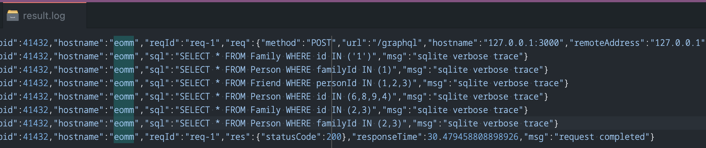

# Developing a GraphQL API

GraphQL is growing in popularity, and every day, more and more services expose their API using this query language. The GQL API interface will help your API consumers to retrieve the minimal set of data they need, benefiting from intuitive and always up-to-date documentation. GraphQL is a first-class citizen in the Fastify ecosystem. Let’s learn how to add GraphQL handlers using a dedicated plugin, avoiding common pitfalls and taking advantage of Fastify’s peculiar architecture.

Here’s the learning path we will cover in this chapter:

-   What is GraphQL?
-   Writing the GQL schema
-   How to make live a GQL schema?
-   How to improve resolver performance?
-   Managing GQL errors

## Technical requirements

To complete this chapter successfully, you will need:

-   A working Node.js 18 installation
-   The [VS Code IDE](https://code.visualstudio.com/)
-   A working command shell

All the snippets in this chapter are on [GitHub](https://github.com/PacktPublishing/Accelerating-Server-Side-Development-with-Fastify/tree/main/Chapter%2014).

## What is GraphQL?

GraphQL is a new language that has changed how a web server exposes data and how the client consumes it. Considering our application’s data structure, we could map every data source to a graph of nodes (objects) and edges (relations) to connect them.

Here’s a quick example of a GraphQL query that maps a family and its members:

```graphql
query {
    family(id: 5) {
        id
        members {
            fullName
            friends {
                fullName
            }
        }
    }
}
```

By reading our first GraphQL query, we can immediately understand the relation hierarchy. A `Family` entity has many `Person` as a `members` array property. Each item of `members` may have some `Person` entities as `friends`. Commonly, a GQL request string is called a **GQL document**.

The JSON response to our GQL query request could be as follows:

```json
{
    "data": {
        "family": {
            "id": 5,
            "members": [
                {
                    "fullName": "Foo Bar",
                    "friends": []
                },
                {
                    "fullName": "John Doe",
                    "friends": [
                        { "fullName": "Michael Gray" },
                        { "fullName": "Greta Gray" }
                    ]
                },
                {
                    "fullName": "Jane Doe",
                    "friends": [
                        { "fullName": "Greta Gray" }
                    ]
                }
            ]
        }
    }
}
```

Seeing the previous quick example, you may guess that if you wanted to get the same data by using a REST API architecture, you should have executed many HTTP calls, such as:

-   Calling the `GET /family/5` endpoint to get the family members
-   Calling `GET /person/id` for each member to get the person’s friends

This easy communication is guaranteed because GraphQL is a declarative, intuitive, and flexible language that lets us focus on the data shape. Its scope is to develop a structured and productive environment to simplify the client’s API fetching.

To reach its goals, it has many design principles:

-   **Product-centric**: The language is built around the consumers’ requirements and data visualization
-   **Hierarchical**: The request has a hierarchical shape that defines the response data structure
-   **Strong-typing**: The server defines the application type system used to validate every request and document the response results
-   **Client-specified response**: The client knows the server capabilities and which one it is allowed to consume
-   **Introspective**: The GraphQL service’s type system can be queried using GraphQL itself to create powerful tools

These principles drive the GraphQL specification, and you can find more about them at <http://spec.graphql.org/>.

But what do you need to implement the GraphQL specification? Let’s find out in the next section.

### How does Fastify support GraphQL?

GraphQL describes the language, but we must implement the specification to support its grammar. So, we are going to see how to implement GraphQL in Fastify while we explore the specification. We will write the source code to support the GQL example we saw in the previous section.

First, we need to identify the components. The following diagram shows the architectural concepts that support GraphQL:


<center>Figure 14.1 – Basic GraphQL component architecture</center>

_Figure 14.1_ shows us a few essential concepts about GraphQL:

-   Any client can execute a GraphQL document by performing an HTTP request to the web server.
-   The web server understands the GQL request, using a **GraphQL adapter** that interfaces with the **GraphQL schema** definition and the **GraphQL resolvers**. You are going to learn all these concepts further in the [How to make live a GQL schema?](#how-to-make-live-a-gql-schema) section.
-   A web server could expose some REST APIs besides the GQL one without any issues.

The straightforward process we are going to follow to implement our first GraphQL server is as follows:

1.  Define the GQL schema.
2.  Write a simple Fastify server.
3.  Add the `mercurius` plugin, and the GraphQL adapter designed for Fastify, to the Fastify installation.
4.  Implement the GQL resolvers.

So, let’s start working on the GQL syntax to write our first schema.

## Writing the GQL schema

We must write the GQL schema by using its **type system**. If we think first about our data, it will be easier to implement it. Let’s try to convert the following diagram to a schema:


<center>Figure 14.2 – Data relation</center>

The data relation in _Figure 14.2_ describes the entities and the relations between them:

-   A _family_ has multiple members
-   A _person_ may have numerous _friends_ that are other _family_ members

So, we can represent these entities into **object types** by writing the following **Schema Definition Language (SDL)**:

```
type Family {
  id: ID!
  name: String!
  members: [Person!]!
}
type Person {
  id: ID!
  family: Family!
  fullName: String!
  nickName: String
  friends: [Person!]!
}
```

The syntax to define a GQL entity is easily readable. We have defined two types. Each type has a `PascalCase` name and a list of **fields** surrounded by curly braces.

Each field is defined by `<field name>: <field type>`. The field type defines the response field’s value type. You may have seen a trailing exclamation mark in the preceding code block. It is a **GQL type modifier** that declares the field as not nullable. The possible syntaxes are:

-   `<field name>: <field type>!`: Not nullable field. The client must always expect a response value.
-   `<field name>: [<field type>]`: The field returns a nullable array with nullable items.
-   `<field name>: [<field type>!]`: The returned array is nullable, but it will not have any nullable items.
-   `<field name>: [<field type>!]!`: Defines a not nullable array without any `null` items. It can still be an empty array as a result.

The field type can be of another type defined by ourselves, as we did for the `family` one, or it can be a **scalar**. A scalar represents a primitive value, and by default, every GQL adapter implements:

-   `Int`: Represents a signed 32-bit numeric.
-   `Float`: Represents floating-point values.
-   `String`: Text data value represented as UTF-8 chars.
-   `Boolean`: True or false value.
-   `ID`: Represents a **unique identifier (UID)**. It accepts numeric input, but it is always serialized as a string.

The specification lets you define additional scalars, such as `Date` or `DateTime`.

We have now written our GQL object types, but how can we use them to read and edit them? Let’s find out in the next section.

### Defining GQL operations

A GQL document may contain different **operations**:

-   `query`: A read-only action
-   `mutation`: A write and read operation-
-   `subscription`: A persistent request connection that fetches data in response to events

These operations must be defined in the GQL schema to be consumed by the client. Let’s improve our SDL by adding the following code:

```
type Query {
  family(id: ID!): Family
}
type Mutation {
  changeNickName(personId: ID!, nickName: String!): Person
}
type Subscription {
  personChanged: Person
}
```

The previous code snippet adds one operation for each type, supported by the GQL specification. As you can read, we used the type `<operation>` syntax. These types are called **root operation types**. Each field in these special types’ definitions will match a resolver that implements our business logic.

In addition to what we learned in the [Writing the GQL schema](#writing-the-gql-schema) introduction section about the `type` definition, we can see that some fields have input parameters: `family(id: ID!): Family`. In fact, the syntax is the same as we discussed previously, but there is one additional argument that we can declare as a JavaScript function: `<field name>(<field arguments>): <field type>`.

As we wrote in our SDL example, the arguments of the `changeNickName` field can either be a list of fields. When we must deal with more and more parameters, we can use an **input type**. The `input` type object works like a `type` object, but can only be used as the user’s input. It is useful when we must declare more complex input objects. Let’s add to our GQL schema another mutation that accepts an `input` type:

```
input NewNickName {
  personId: ID!
  nick: String!
}
type Mutation {
  // ...
  changeNickNameWithInput(input: NewNickName!): Person!
}
```

We have defined an `input NewNickName` GQL Type that looks like the `Person` object type but omits the fields that the user can’t set.

Well done! We have written our application GQL schema. You have seen all the basic things you need to define your GQL schemas. Before digging deeper into the GQL specification by exploring other keywords and valid syntaxes, we must consolidate our application by implementing the business logic. It is time to write some code!

## How to make live a GQL schema?

In the [Writing the GQL Schema](#writing-the-gql-schema) section, we wrote the application’s GQL schema. Now, we need to initialize a new npm project. For the sake of simplicity and in order to focus on the GQL logic only, we can build it by running the following code:

```sh
mkdir family-gql
cd family-gql/
npm init --yes
npm install fastify@4 mercurius@11
```

We are ready to create our first file, `gql-schema.js`. Here, we can just copy-paste the GQL schema we wrote in the previous section:

```js
module.exports = `
# the GQL Schema string
`;
```

Before proceeding further, it is worth mentioning that there are two different ways to define a GQL schema with Node.js:

-   **Schema-first**: The GQL schema is a string written following the GQL specification
-   **Code-first**: The GQL schema is generated by an external tool, such as the `graphql npm` module

In this chapter, we will follow the schema-first implementation as it is the most generic and allows you to get a clear overview of the schema without starting the application to generate it at runtime.

It is time to load the schema we wrote in the [Writing the GQL schema](#writing-the-gql-schema) section and start the GQL server. Let’s see how to do it in the next section.

### Starting the GQL server

To build a GQL server, we need to create a Fastify instance and register the mercurius plugin, as we have learned throughout this book. Create a new app.js file:

```js
const Fastify = require('fastify');
// [1]
const mercurius = require('mercurius');
const gqlSchema = require('./gql-schema');
async function run() {
    const app = Fastify({ logger: { level: 'debug' } });
    //[2]
    const resolvers = {};
    app.register(mercurius, {
        schema: gqlSchema,
        resolvers,
    });
    await app.listen({ port: 3000 });
}
run();
```

You should be able to read this small Fastify code snippet. We imported the GQL adapter and schema at line `[1]`. At `[2]`, we declared an empty `resolvers` object and registered the `mercurius` plugin into the app server. If we start the application running `node app.js`, it will start correctly, and it will be ready to receive a GQL request.

For the sake of a test, we can run the `curl` command, like so:

```sh
curl --location --request POST 'http://localhost:3000/graphql' \
  --header 'Content-Type: application/json' \
  --data-raw '{"query":"query { family(id: 5){ id }
}","variables":{}}'
```

The command will get back an empty response:

```json
{
    "data": {
        "family": null
    }
}
```

Let’s step back and analyze what is happening:

1.  Registering the `mercurius` plugin will expose a `/graphql` endpoint ready to receive GQL requests.
2.  Since the `resolvers` option is an empty object, all the application’s operations do not run any business logic, and the output is a `null` value by default.
3.  Each client can execute an HTTP request to the GQL endpoint to be served. The HTTP request format is defined by the GQL specification as well.

Sending a GQL query over HTTP has very few requirements:

-   There must be a `query` parameter that contains the GQL string request.
-   It is possible to define a `variables` parameter that will fulfill a special placeholder in the GQL request string. It must be a plain JSON object.
-   The HTTP request must be a GET or a POST method call. In the former case, the parameters must be submitted as a query-string parameter. In the latter option, the request payload must be a JSON object—as we did in our `curl` example.

If you want to know every detail about the specification, you can deep dive into this topic at the [official documentation](https://graphql.org/learn/serving-over-http/). Mercurius supports all the specifications, so you don’t need to worry about it!

!!!note "The operationName parameter"

    Optionally, you can define more than one root operation type per GQL request. In this case, you need to add an extra `operationName` parameter to the HTTP request. It will select the operation to execute. An example is including a `mutation` and a `query` operation in a GQL request payload, and then specifying which one you want to run. It is often used during the development phase, and you will see it in action in the next section.

We have spun up our GQL server, but we need to add our business logic, so it is time to implement some GQL resolvers in the next section.

### Implementing our first GQL query resolver

GQL resolvers implement the business logic of our application. It is possible to attach a resolver function to almost every GQL schema capability, except the root operations type. To recap, let's list all the type system’s components that can have a custom resolver function:

-   Type objects
-   Type fields
-   Scalars
-   Enums
-   Directives and unions

We will not discuss these topics in depth as they are out of the scope of this book.

As we discussed in the [Defining GQL operations](#defining-gql-operations) section, an operation is defined as a root operation type’s field, so implementing the `family(id: ID!)` query will be like implementing a field’s resolver.

Before continuing our journey into the resolvers implementation, we need a database to connect with. To focus on the GQL aspect of this chapter, we will apply some shortcuts to set up the fastest configuration possible to play with GQL. So, let’s add an in-memory SQLite instance to our `app.js` file that will be fulfilled with mocked data at every restart. We must run the `npm install fastify-sqlite` command and then edit our application file, like so:

```js
// ...
const app = Fastify({ logger: true });
await app.register(require('fastify-sqlite'), {
    promiseApi: true,
});
await app.sqlite.migrate({
    migrationsPath: 'migrations/',
});
// ...
```

The code snippet adds the `fastify-sqlite` plugin to our Fastify application. It will connect our application to an in-memory SQLite instance by default. The module adds a convenient `migrate` utility that lets us run all the `.sql` files included in the `migrations/` directory, which we must create. In the `migrations/` folder, we can create a new `001-init.sql` file that contains our SQL schema, which recreates the tables and relations in _Figure 14.2_. Moreover, the script should add some mocked data to speed up our prototyping. You can simply copy and paste it from the book’s [repository](https://github.com/PacktPublishing/Accelerating-Server-Side-Development-with-Fastify/tree/main/Chapter%2014/migrations).

The scaffolding GQL project is ready, and now we can implement the business logic. We need to set up the `resolvers` variable we wrote in the [Starting the GQL server](#starting-the-gql-server) section. The configuration is relatively straightforward, as follows:

```js
const resolvers = {
    Query: {
        family: async function familyFunc(
            parent,
            args,
            context,
            info
        ) {
            context.reply.log.info(
                'TODO my business logic'
            );
            return {
                id: 42,
                name: 'Demo',
            };
        },
    },
};
```

If we try to analyze the `family(id: ID!)` query implementation, we can immediately understand the structure of the `resolvers` parameter. The `Query` key represents the **query root operation type**, and all its keys must match an entry in the corresponding root operation type defined in the GQL schema.

!!!note "Matching control"

    During the Fastify startup, if we add a resolver function to the `Query` configuration object without declaring it in our GQL schema, then Mercurius will throw an error.

The `resolvers` object tells us that there is a query named `family`. Whenever a GQL request comes in, the GQL adapter must execute our `familyFunc` function. The resolver can be either an async or sync function that accepts four parameters:

1.  `parent` is the returned value from the previous resolver. You need to know that it is always an empty object for query and mutation resolvers because there are no previous resolvers. Don’t worry if it is not clear yet—we will see an example in a while.
2.  `args` is a JSON parameter that contains all the query’s input parameters. In our example, the family query defines a mandatory input parameter, `id`. So, `args.id` will have the user’s input.
3.  `context` is a shared object across all the resolvers. Mercurius builds it for every request and fulfills it with the `app` key, linking the Fastify application and the `reply` object.
4.  The `info` argument represents the GraphQL node and its execution state. It is a low-level object, and you rarely need to deal with it.

Now, we can submit a query against our server, but I agree that writing a `curl` command is cumbersome. So, let’s explore another cool Mercurius feature. If we tweak the configuration a bit, we can unlock a great utility:

```js
app.register(mercurius, {
    schema: gqlSchema,
    graphiql: true,
    resolvers,
});
```

Turning on the `graphiql` option will turn on a GraphQL client (note the _i_ in `graphiql`). Running the node `app.js` application and navigating your browser to <http://127.0.0.1:3000/graphiql>, you will see the following interface:


<center>Figure 14.3 – The graphiql user interface</center>

So far, we wrote the GQL schema declaration, but now we need to write a GQL request string, to probe the server. The `graphiql` interface lets us play with our GraphQL server. It fetches the GQL schema and gives us autocompletion and other utilities to write GQL documents more easily.

So, we can use it to run a simple `family (id:42) { name }` query, as shown in _Figure 14.3_. The syntax aims to run the `family` query with the id argument set to `42`. Between the curly braces, we must list all the fields of the **object type** we want to read from the server. In this way, we are forced to select only the data we are interested in without wasting resources and keeping the payload as light as possible.

Running the query by pressing the _play_ button in the center of the screen, we will trigger a call to the server, which will show the response on the right of the screen. You may notice that a `data` JSON field wraps the response payload. This structure is defined by the specification as well.

If we move to the server’s logs, we should see a `TODO my business logic` log message. This means that the resolver has been executed successfully. In fact, the output shows us `name: "Demo"`, which matches the `familyFunc` function’s value. Note that the query does not contain the `id` field even if the resolver returned it. This is correct, as the caller did not include it in the GQL document query.

Things are getting interesting, but it is time to run a real SQL query now:

```js
const resolvers = {
    Query: {
        family: async function familyFunc(
            parent,
            args,
            context,
            info
        ) {
            const sql = SQL`SELECT * FROM Family WHERE id = ${args.id}`;
            const familyData = await context.app.sqlite.get(
                sql
            );
            context.reply.log.debug(
                { familyData },
                'Read familyData'
            );
            return familyData;
        },
    },
};
```

The new `familyFunc` implementation is relatively straightforward:

1.  Compose the `sql` statement to execute.
2.  Run the query by using the database connection through the `context.app.sqlite` decorator.
3.  Log the output for debugging and return the result.

Since there is a match between the SQL `Family` table’s columns and the `Family` GQL object type’s fields, we can return what we get directly from the database.

!!!note "Managing user input in SQL queries"

You might have observed that the `sql` statement has been instantiated by the `SQL` tagged template utility. It is initialized like so: `const SQL = require('@nearform/sql')`. The `@nearform/sql` module provides a security layer to deal with the user input, protecting our database from SQL injection attempts.

Now, we can take a step forward by reading the family’s members. To do this, we just need to modify our GQL request body:

```
query myOperationName {
  family(id: 1) {
    name
    id
    members {
      id
      fullName
    }
  }
}
```

If we run this query, we will get back an error:

```json
{
    "data": {
        "family": null
    },
    "errors": [
        {
            "message": "Cannot return null for non-nullable field Family.members.",
            "locations": [{ "line": 5, "column": 5 }],
            "path": ["family", "members"]
        }
    ]
}
```

It is important to know that a GQL error response over HTTP always has HTTP status 200 and an `errors` array that lists all the issues found for each query you were executing. In fact, we can try to run multiple queries with a single payload:

```
query myOperationName {
  one: family(id: 1) {
    name
    id
  }
  two: family(id: 1) {
    members {
      fullName
    }
  }
}
```

The new code snippet runs two queries within the same operation name. In this case, it is mandatory to define an **alias** as we did by prepending `<label>`: before the field declaration. Note that you can use aliases to customize the response properties name of the `data` object. When writing multiple queries or mutations, you must know that queries are executed in parallel, while the server executes mutations serially instead.

The response to the previous GQL document will be similar to the first one of this section, but take a look at the `data` object:

```json
{
    "data": {
        "one": {
            "name": "Foo",
            "id": "1"
        },
        "two": null
    },
    "errors": [
        {
            "message": "Cannot return null for non-nullable field Family.members.",
            "locations": [{ "line": 9, "column": 5 }],
            "path": ["two", "members"]
        }
    ]
}
```

The response payload contains the `one` alias with a valid output. Instead, the `two` property is `null` and has a corresponding item in the `errors` array.

Reading the error message, we can understand that the server is returning the `null` value for the `Family` object type, and this case conflicts with the `members: [Person!]!` GQL schema definition due to the exclamation mark. We defined that every `Family` class has at least one member, but how could we fetch them? Let’s find it out in the next section.

### Implementing type object resolvers

We must fetch the members of the `Family` object type to be able to implement the `family(id: ID!)` resolver correctly. We could be tempted to add another query to the `familyFunc` function we wrote in the [Implementing our first GQL query resolver](#implementing-our-first-gql-query-resolver) section. This is not the right approach to working with GQL. We must aim to build a system that is auto-consistent. This means that whatever the query operation returns, the `Family` type should not be aware of its relations to fulfill them, but the `Family` type has to know what to do. Let’s edit the `app.js` code, as follows:

```js
const resolvers = {
    Query: {
        family: async function familyFunc() {
            // ...
        },
    },
    Family: {
        members: async function membersFunc(
            parent,
            args,
            context,
            info
        ) {
            const sql = SQL`SELECT * FROM Person WHERE familyId = ${parent.id}`;
            const membersData = await context.app.sqlite.all(
                sql
            );
            return membersData;
        },
    },
};
```

The following code snippet should unveil what the GQL specification thinks. We have added a `Family.members` resolver by using the same pattern for the query root operation:

```
<Type object name>: {
  <field name 1>: <resolver function-1>,
  <field name n>: <resolver function-n>
}
```

So, if we read the following query, we can try to predict the resolvers that are being executed:

```
query {
  family(id: 1) {
    name
    members {
      id
      fullName
    }
  }
}
```

In this example, we can predict the following:

1.  The `family` query resolver is executed, and a `Family` type is returned.
2.  The `Family` type runs the `name` resolver. Since we did not define it, the default behavior is returning the property within the same name, by reading the object from _step 1_.
3.  The `Family` type runs the `members` resolver. Since we have defined it, the `membersFunc` function is executed. In this case, the `parent` argument we mentioned in the [Implementing our first GQL query resolver](#implementing-our-first-gql-query-resolver) section equals the object returned at _step 1_ of the processing. Since the `members` field expects a `Person` type array, we must return an `object` array that maps its structure.
4.  The `Person` type runs the id and `fullName` resolvers. Since we did not define them, the default behavior is applied as described in _step 2_.

At this point, you should be astonished by the GQL power, and all the connections and possibilities it offers should be clear to you.

I will take you a little further now because we are getting a new error: `Cannot return null for non-nullable field Person.fullName.`! Let’s fix it with the following `Person` type implementation:

```js
const resolvers = {
    Query: {
        // ...
    },
    Family: {
        // ...
    },
    Person: {
        nickName: function nickNameFunc(parent) {
            return;
            parent.nick;
        },
        fullName: async function fullNameFunc(
            parent,
            args,
            context
        ) {
            const sql = SQL`SELECT * FROM Family WHERE id = ${parent.familyId}`;
            const familyData = await context.app.sqlite.get(
                sql
            );
            return `${parent.name} ${familyData.name}`;
        },
        family: async function familyFunc(
            parent,
            args,
            context
        ) {
            const sql = SQL`SELECT * FROM Family WHERE id = ${parent.familyId}`;
            const familyData = await context.app.sqlite.get(
                sql
            );
            return familyData;
        },
        friends: async function friendsFunc(
            parent,
            args,
            context
        ) {
            const sql = SQL`SELECT * FROM Person WHERE id IN (SELECT friendId FROM Friend WHERE personId = ${parent.id})`;
            const friendsData = await context.app.sqlite.all(
                sql
            );
            return friendsData;
        },
    },
};
```

As you can see in the previous code snippet, we have implemented all the `Person` fields’ resolvers. The `nickName` function should be quite clear: the database’s `nick` column does not match the GQL schema definition, so we need to teach the GQL adapter how to read the corresponding `nickName` value. The `Person.family` and the `Person.friends` resolvers apply the same logic we discussed per `Family.members`. Just for the sake of the experiment, the `fullName` resolver uses a slightly different business logic by concatenating the person’s and family’s names.

!!!note "Is this design correct?"

    If you ask yourself if our data source is well structured, the answer is _no_. The `fullName` resolver is designed in a very odd way to better appreciate the optimization we will discuss in the next section.

Now, running our previous HTTP request, it should work as expected, and we can start to run complex queries like the following:


<center>Figure 14.4 – A complex GQL query</center>

As you can see, it is now possible to navigate the application graph exposed by our GQL server, so it is doable reading: the family members of every friend that each member of family `1` has.

Well done! Now you know how to implement any GQL resolver, you should be able to implement by yourself the mutations we defined in the [Defining GQL operations](#defining-gql-operations) section. The concepts are the same: you will need to add a `Mutation` property to the `resolvers` object in the `app.js` file. If you need help, you can check the solution by looking at the chapter’s repository URL at <https://github.com/PacktPublishing/Accelerating-Server-Side-Development-with-Fastify/tree/main/Chapter%2014>.

You may have noticed that our implementation runs tons of SQL queries against the database for a single GQL request! This is not good at all! So, let’s see how we can fix this in the next section.

## How to improve resolver performance?

If we log every SQL query hitting our database when we run the GQL request in _Figure 14.4_, we will count an impressive amount of 18 queries! To do so, you can update the SQLite plugin configuration to the following:

```js
const app = Fastify({ logger: { level: 'trace' } });
await app.register(require('fastify-sqlite'), {
    verbose: true,
    promiseApi: true,
});
```

With the new configuration, you will be able to see all the SQL executions that have been run during the resolution of the GQL request, and you will see a lot of duplicated queries too:


<center>Figure 14.5 – All SQL queries run by the family resolver</center>

This issue is called the **N+1 problem**, which ruins the service performance and wastes many server resources. For sure, a GraphQL server aims to provide simplicity over complexity. It deprecates the writing of big SQL queries with multiple joins and conditions to satisfy the relations between objects.

The solution to this everyday use case is adopting a **DataLoader**. A DataLoader is a standard data loading mechanism that manages access to the application’s data sources by doing the following:

-   **Batching**: This aggregates the queries executed in a single tick of the event loop or in a configured timeframe, giving you the possibility to run a single request against the data source itself
-   **Caching**: This caches the queries’ results per each GQL request, so if you read the same item multiple times, you will read it from the data source once

The implementation of the DataLoader API is provided by the `dataloader` npm module that you can install by running `npm install dataloader`. Let’s see how to use it, after adding it to our project.

The first step is creating a new `data-loaders/family.js` file with the following code:

```js
const SQL = require('@nearform/sql');
const DataLoader = require('dataloader');
module.exports = function buildDataLoader(app) {
    const dl = new DataLoader(
        async function fetcher(ids) {
            const secureIds = ids.map((id) => SQL`${id}`);
            const sql = SQL`SELECT * FROM Family WHERE id IN (${SQL.glue(
                secureIds,
                ','
            )})`;
            const familyData = await app.sqlite.all(sql);
            return ids.map((id) =>
                familyData.find(
                    (f) => `${f.id}` === `${id}`
                )
            );
        },
        {
            cacheKeyFn: (key) => `${key}`,
        }
    );
    return dl;
};
```

We built a `buildDataLoader` factory function that instantiates a new `DataLoader` instance that requires a function argument. The implementation is quite straightforward since we get an input array of `ids`, which we can use to compose a SQL query with an `IN` condition.

!!!note "The `SQL.glue` method"

    Note that we had to write a bit more code to execute a simple SQL `IN` condition. This is necessary because SQLite does not support array parameters, as you can read in the [official repository](https://github.com/TryGhost/node-sqlite3/issues/762). The `SQL.glue` function lets us concatenate the array of ids without losing the security checks implemented by the `@nearform/sql` module.

The most crucial logic to be aware of is the `ids.map()` phase. The `fetcher` function must return an array of results where each element matches the input IDs’ order. Another important takeaway is the `cacheKeyFn` option. Since the DataLoader could be called by using string or numeric IDs, coercing all the values to strings will avoid us unpleasant unmatch due to the argument’s data type— for the same reason, we are applying the same type guard when we run `familyData.find()`.

Now, you should be able to implement the `data-loaders/person.js`, `data-loaders/person-by-family.js`, and `data-loaders/friend.js` files by using the same pattern.

We have almost completed our integration. Now, we must add the DataLoaders to the GQL request’s context, so we need to edit the Mercurius configuration a bit more:

```js
const FamilyDataLoader = require('./data-loaders/family');
const PersonDataLoader = require('./data-loaders/person');
const PersonByFamilyDataLoader = require('./data-loaders/person-by-family');
const FriendDataLoader = require('./data-loaders/friend');
// ...
app.register(mercurius, {
    schema: gqlSchema,
    graphiql: true,
    context: async function (request, reply) {
        const familyDL = FamilyDataLoader(app);
        const personDL = PersonDataLoader(app);
        const personsByFamilyDL = PersonByFamilyDataLoader(
            app
        );
        const friendDL = FriendDataLoader(app);
        return {
            familyDL,
            personDL,
            personsByFamilyDL,
            friendDL,
        };
    },
    resolvers,
});
```

We can extend the default context argument injected into each resolver function by setting Mercurius’s `context` parameter.

The last step is updating the application’s resolvers. Each resolver must read the data, using the DataLoaders stored in the `context` parameter. Here is the final result:

```js
const resolvers = {
    Query: {
        family: function familyFunc(
            parent,
            args,
            context,
            info
        ) {
            return context.familyDL.load(args.id);
        },
    },
    Person: {
        fullName: async function fullName(
            parent,
            args,
            context,
            info
        ) {
            const familyData = await context.familyDL.load(
                parent.familyId
            );
            return `${parent.name} ${familyData.name}`;
        },
        friends: async function friendsFunc(
            parent,
            args,
            context,
            info
        ) {
            const friendsData = await context.friendDL.load(
                parent.id
            );
            const personsData = await context.personDL.loadMany(
                friendsData.map((f) => f.friendId)
            );
            return personsData;
        },
    },
};
```

In the previous code snippet, you can see a few examples of the DataLoaders’ usage. Each DataLoader offers two functions, `load` and `loadMany` to read one item or more. Now, if we read the SQLite verbose logging here, we can appreciate that the queries have been cut down by two-thirds!



<center>Figure 14.6 – DataLoaders aggregate the queries</center>

The GraphQL application has been optimized! You have learned the most flexible and standard way to improve the performance of a GQL implementation. We have to mention that Mercurius supports a loader configuration option. It is less flexible than the DataLoader, but you can deep dive into this topic by reading the [following blog post](https://backend.cafe/how-to-use-dataloader-with-mercurius-graphql).

We will now go through the last topic of this chapter to get a comprehensive overview of building a GQL server with Fastify and Mercurius: how to deal with errors?

## Managing GQL errors

The GraphQL specification defines the error’s format. We have seen an example of it in the [Implementing our first GQL query resolver](#implementing-our-first-gql-query-resolver) section. The common properties are:

-   `message`: A message description
-   `locations`: The GraphQL request document’s coordinates that triggered the error
-   `path`: The response field that encountered the error
-   `extensions`: Optional field to include custom output properties

With Mercurius, we can customize the `message` error by throwing or returning an `Error` object:

```js
const resolvers = {
    Query: {
        family: async function familyFunc(
            parent,
            args,
            context,
            info
        ) {
            const familyData = await context.familyDL.load(
                args.id
            );
            if (!familyData) {
                throw new Error(
                    `Family id ${args.id} not found`
                );
            }
            return familyData;
        },
    },
};
```

If we want to extend the `errors` items’ field, we must follow the specification by using the `extensions` field. To do that with Mercurius, we must use its `Error` object extension. We can replace the previous code snippet with the following new one:

```js
throw new mercurius.ErrorWithProps(
    `Family id ${args.id} not found`,
    {
        ERR_CODE: 404,
    }
);
```

Using the `ErrorWithProps` object, we can append as many properties as we need to the `extensions` field.

Finally, we should be aware that Fastify and Mercurius manage unhandled errors in our application to avoid memory leaks and crashes of the server. Those errors may have sensitive information, so we can add the `errorFormatter` option to obfuscate them:

```js
app.register(mercurius, {
    errorFormatter: (result, context) => {
        result.errors = result.errors.map(
            hideSensitiveData
        );
        return mercurius.defaultErrorFormatter(
            result,
            context
        );
    },
    // [...] previous configuration
});
function hideSensitiveData(error) {
    if (error.extensions) {
        return error;
    }
    error.message = 'Internal server error';
    return error;
}
```

The `errorFormatter` function is called only when the server returns some uncaught errors. The `hideSensitiveData` function checks whether the error is a valid application error or a generic one. In case it is the latter, we have to overwrite the error message to preserve its `locations` and `path` metadata. Note that all the `result.errors` items are `GraphQLError` class instances, so we must differentiate the application’s errors using the `extensions` field.

Great! We have seen all the possible error handling peculiarities to build a solid and homogeneous error response and management.

## Summary

This chapter has been a dense and intensive boot camp about the GraphQL world. Now, you have a strong base theory to understand the GQL ecosystem and how it works under the hood of every GQL adapter.

We have built a GraphQL server from zero using Fastify and Mercurius. All the knowledge gained from this book’s [Chapter 1](../basic/what-is-fastify.md) is valid because a Fastify application doesn’t have any more secrets for you.

On top of your Fastify knowledge, you are able to define a GQL schema and implement its resolvers. We have solved the N+1 problem and now know the proper steps to manage it and create a fast and reliable application.

You finally have a complete toolkit at your disposal to create great APIs. You are ready to improve your code base even further by adopting TypeScript in the next chapter!
