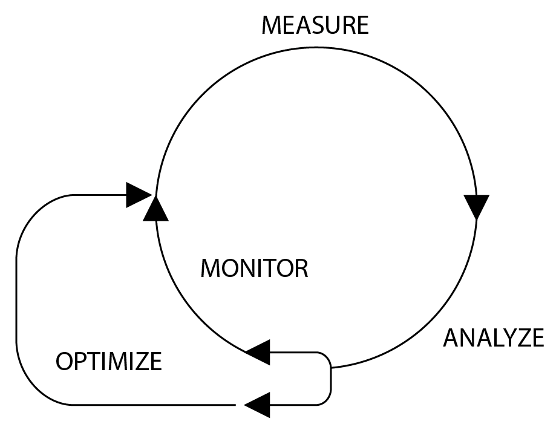
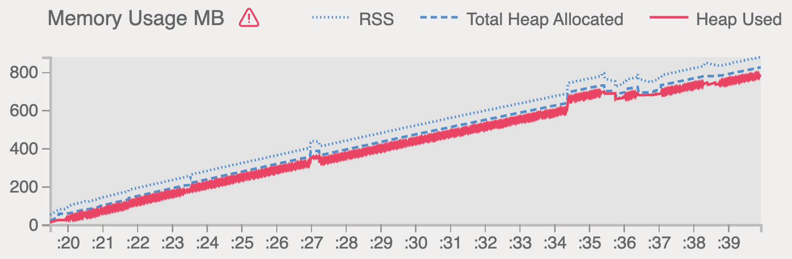
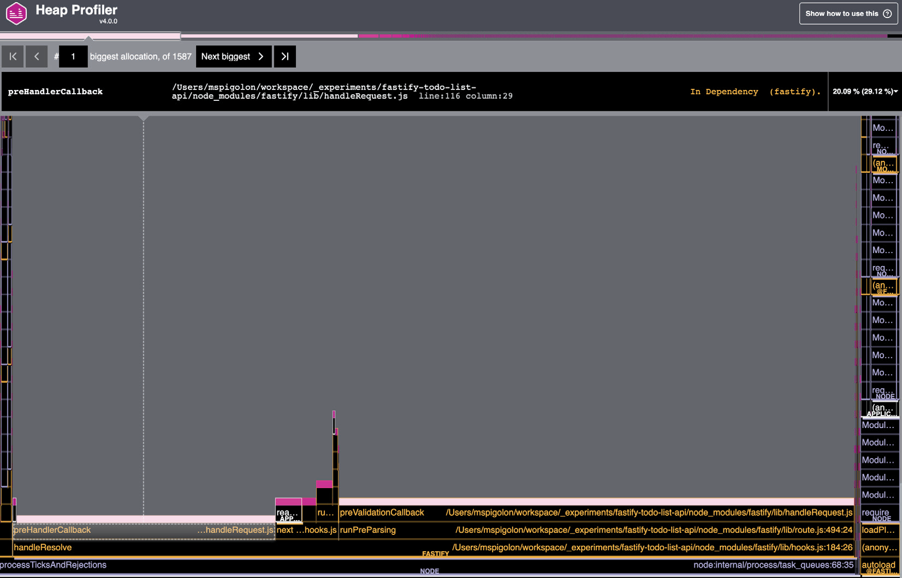

# Performance Assessment and Improvement

We all know that Fastify is fast – but is your code fast enough for Fastify? Learn how to measure your application’s performance to improve your business value and the quality of your code. By analyzing the metrics, you will avoid introducing speed regressions and identify bottlenecks or memory leaks that could crash your system. You will learn how to add an instrumentation library to a Fastify application to analyze how the server reacts to a high volume of traffic. We will get an overview to understand and act accordingly depending on your measurements to maintain your server’s performance and its healthy status.

This is the learning path we will take in this chapter:

-   Why measure performance?
-   How to measure an application’s performance
-   How to analyze the data
-   How to optimize the application

Technical requirements

As mentioned in earlier chapters, you will need the following:

-   A working Node.js 18 installation
-   The [VS Code IDE](https://code.visualstudio.com/)
-   A working command shell

All the snippets in this chapter are on [GitHub](https://github.com/PacktPublishing/Accelerating-Server-Side-Development-with-Fastify/tree/main/Chapter%2013).

## Why measure performance?

It sounds nice to go out for dinner and impress our guests by telling them that our APIs serve 10,000 requests per second, but nobody cares about numbers that do not bring any value.

An application’s performance impacts a company’s business in many ways, which are often underestimated because you can’t see a performance issue at first sight as you can with a bug. In fact, performance is responsible for the following:

-   A slow API, which may result in customers abandoning your website, as documented by this research: <https://www.shopify.com/enterprise/site-performance-page-speed-ecommerce>
-   A server in an idle state during high-load traffic, which is a waste of resources that impacts your infrastructure bill
-   Unoptimized API code, which may waste resources that affect your infrastructure bill

Therefore, to save money and open new business opportunities, it is crucial to measure the application’s performance, but how can we do so? Let’s start unraveling this process.

To improve an application’s performance, you need to define where to start and choose which direction to follow. The **Optimization Cycle** supports you during this discovery process and focuses on the resolution:



<center>Figure 13.1 – The Optimization Cycle</center>

Each step is a key to improving performance:

1.  **Measure**: We must define a baseline to start from by selecting certain **Key Performance Indicators (KPIs)** that can be measured and evaluated further.
2.  **Analyze**: We need to understand and explore the KPIs collected in the previous step to define how to improve them and find any bottlenecks. When the KPI satisfies our expectations, we can just monitor the performance without taking any other action.
3.  **Optimize**: We apply the required actions identified in the previous step. We may make changes to our code base or even to the application’s architecture. In the end, we will start again at the first step to evaluate the results.

By following this cycle, you will be able to assess the application’s performance and keep it under control in order to avoid regression. Note that this workflow adapts to every area of a company’s work, from sales to information technology.

We have seen the overall picture of this methodology, but what happens when it’s in action? We are going to discover it in the next section.

## How to measure an application’s performance?

By following the Optimization Cycle, the first step to improving something in every work field is that we need to set a baseline. The starting point will be different for each company’s department. For instance, the sales team will measure the sales or the revenue over time to set its improvement goals.

So, we need to define what is worth measuring by defining our application’s metrics boundaries. It’s clear that our first challenge is choosing what to measure. The most common metrics are the following:

-   HTTP response times and request rates
-   Error ratings
-   Process metrics such as CPU, memory, and Garbage Collector usage

Each bullet point is a KPI. Every KPI requires a different approach and a different analysis. Despite their differences, these measurements are strongly connected since inadequate resource management will impact the response latency, and a high error rating may increase memory usage.

Measuring an application’s KPIs is a mandatory step in implementing application **Observability**, which is the capability to understand the system’s state by checking its output.

!!!note "Application Observability"

    The following section’s concepts apply to a whole system or a single Node.js application. This chapter discusses Application Observability and aims at improving a project itself, as system monitoring is not in the scope of this book. Nevertheless, what you will learn will be valuable and reusable for building better systems.

The pillars of Observability are as follows:

-   **Logs**: You can learn about an application’s status and progress by reading and analyzing the output. We discussed this in [Chapter 11](../real-project/logging.md).
-   **Metrics**: These are numeric value representations that an application can collect. These are more reliable, ready to be processed, and easier to store. Compared to logs, they have an indefinite retention policy. You collected them in [Chapter 10](../real-project/deploy.md).
-   **Tracing**: This represents a piece of detailed information from the request life cycle over the system. We will see an example in the next section, [Measuring the HTTP response time](#measuring-the-http-response-time) by instrumenting the Fastify application.

All these pillars share a common backbone of logic. We can consider all of them raw logs in different formats and properties that share the same life cycle logic as we saw in the [How to consolidate the logs](../real-project/logging.md#how-to-consolidate-the-logs) section of Chapter 11.

The pillar list is ordered from the least detailed to the most fine-grained information. I think an example is worth more than 10,000 words, so let’s assume we have to assess the `POST /todo` endpoint that we have been building since [Chapter 7](../real-project/restful-api.md).

In this case, the logs would tell us when the request started and when it ended by adding debugging information.

A metric tells us what the KPI value at a specific time was. For example, it answers the question, how many todos were created per user today? This information is easy to process if you want to know the average number of _todos_ created and other statistics.

The tracing data would show us that a request spent 10 milliseconds fetching the data from the database, 20 milliseconds inserting the new data, and 30 additional milliseconds sending a notification.

To understand this example and appreciate the differences better, let us focus on how to measure the HTTP response time in the next section.

### Measuring the HTTP response time

The KPI of response time is a simple parameter that even non-technical people can easily understand, and it is commonly used to describe an API’s health status. It reports the total amount of time the application spent handling an HTTP request and replying to the client.

The response time provides us with a precise measure in milliseconds to monitor the overtime for each endpoint. By noticing any variation in this value, we can evaluate whether a new feature impacts the route’s health positively or negatively. We can then act accordingly, as we will see in the [How to analyze the data](#how-to-analyze-the-data) section.

!!!note "Network latencies"

    The API response time can sometimes be misleading because it does not include additional network latencies that are introduced if your server is in a different region from the client. Discussing complex architectural scenarios is not within the scope of this book. If you want to go deeper into this aspect, you can start by reading this [article](https://www.datadoghq.com/knowledge-center/infrastructure-monitoring/).

We are already measuring the overall request time by logging the `responseTime` field, as explained in [Chapter 11](../real-project//logging.md). This information can be read directly from the production environment and can be checked constantly. Moreover, it helps us set which APIs have priority over others, as they need more attention. This aspect is beneficial considering that we can’t focus on hundreds of endpoints at the same time, so this information will help us prioritize certain APIs.

The response time is not detailed information because it is the sum of all the steps performed by our endpoint to reply to the client’s request. For example, if our API makes a database query and an external HTTP call to a third-party API, which of these two operations costs more time?

Since we are arranging the data to analyze it in the next Optimization Cycle step, we must collect more information by **tracing** the application; otherwise, the analysis task will be more complex and optimization may not be successful.

!!!note "Tracing sampling"

    While logs have a resource cost, tracing is even more expensive because it produces huge data volumes. For this reason, when dealing with tracing, it is mandatory to set the sampling configuration. You will see an example in this section.

Now that we know what we want to measure, we can start to upgrade our Fastify application.

### Instrumenting the Fastify application

To trace any Fastify application, it is wise to adopt the **OpenTelemetry** specification published at <https://opentelemetry.io/> and promoted by the Linux Foundation. This provides a set of shared mechanisms for generating, collecting, and exporting telemetry data, such as metrics and tracing information. Even though logs are currently not supported by this tool, we are safe because we have already set the application’s logs in [Chapter 11](../real-project/logging.md).

By adopting the OpenTelemetry specification, you will be able to include modules that implement this standard, and your application will export metrics and tracing data in a well-known format. By choosing this approach, you decouple your telemetry data from the **Application Performance Monitoring (APM)** tool. The APM software is a must-have for analyzing your tracing data. It provides a straightforward way to see the telemetry data and put it into graphs and clear visualizations. Otherwise, it would be impossible to understand the raw tracing data and the connections within it.

It is now time to write some code! To recap what we are going to do, here are the steps:

1.  Integrate the OpenTelemetry modules into your Fastify to-do list application.
2.  Visualize the telemetry data by using Zipkin, an open source tracing system. It is less powerful than a commercial APM, but it is a free solution for every developer starting this journey.
3.  Improve the tracing and metric information.

Before we start, it is mandatory to install all the OpenTelemetry packages we need, so you need to run the following installation command:

```sh
npm install @opentelemetry/api@1.3.0 @opentelemetry/exporter-
zipkin@1.8.0 @opentelemetry/instrumentation@0.34.0 @opentelemetry/
instrumentation-dns@0.31.0 @opentelemetry/instrumentation-
fastify@0.31.0 @opentelemetry/instrumentation-http@0.34.0 @
opentelemetry/instrumentation-mongodb@0.33.0 @opentelemetry/sdk-
node@0.34.0 @opentelemetry/sdk-trace-node@1.8.0 @opentelemetry/
semantic-conventions@1.8.0
```

These are a lot of modules, but we are going to use them all in the upcoming script. We need to create a new `configs/tracing.js` file that will contain all the tracing logic.

The script will be split into three logic blocks. The first one is dedicated to imports:

```js
const packageJson = require('../package.json');
// [1]
const {
    NodeTracerProvider,
} = require('@opentelemetry/sdk-trace-node');
const {
    SemanticResourceAttributes,
} = require('@opentelemetry/semantic-conventions');
const { Resource } = require('@opentelemetry/resources');
const {
    ParentBasedSampler,
    TraceIdRatioBasedSampler,
} = require('@opentelemetry/sdk-trace-base');
// [2]
const {
    registerInstrumentations,
} = require('@opentelemetry/instrumentation');
const {
    DnsInstrumentation,
} = require('@opentelemetry/instrumentation-dns');
const {
    HttpInstrumentation,
} = require('@opentelemetry/instrumentation-http');
const {
    FastifyInstrumentation,
} = require('@opentelemetry/instrumentation-fastify');
const {
    MongoDBInstrumentation,
} = require('@opentelemetry/instrumentation-mongodb');
// [3]
const {
    BatchSpanProcessor,
} = require('@opentelemetry/sdk-trace-base');
const {
    ZipkinExporter,
} = require('@opentelemetry/exporter-zipkin');
```

The `require` statements are mainly the modules, `[1]`, which provide the OpenTracing APIs to set up the system. The requirements, `[2]`, are the `Instrumentation` classes, which will help us trace some packages for use, saving us time and providing a great starting point. We are going to see the output in a while. Finally, the `Exporter` component, `[3]`, is responsible for submitting the tracing data to any system.

!!!note "How to use your own APM"

    As previously explained, we are going to use Zipkin to visualize the tracing data. If you would like to use a commercial APM such as DataDog or Instana, you would have to replace the Zipkin exporter in the `tracing.js` file. For a complete list of exporters, you can rely on the official [OpenTelemetry documentation](https://opentelemetry.io/registry/?language=js&component=exporter) or your APM vendor.

The second code block logic is the OpenTelemetry configuration:

```js
const sdk = new NodeTracerProvider({
    sampler: new ParentBasedSampler({
        root: new TraceIdRatioBasedSampler(1),
    }),
    resource: new Resource({
        [SemanticResourceAttributes.DEPLOYMENT_ENVIRONMENT]:
            process.env.NODE_ENV,
        [SemanticResourceAttributes.SERVICE_NAME]:
            packageJson.name,
        [SemanticResourceAttributes.SERVICE_VERSION]:
            packageJson.version,
    }),
});
registerInstrumentations({
    tracerProvider: sdk,
    instrumentations: [
        new DnsInstrumentation(),
        new HttpInstrumentation(),
        new FastifyInstrumentation(),
        new MongoDBInstrumentation(),
    ],
});
```

The configuration has the `resource` parameter to configure some basic metadata that will be displayed for every trace. The `instrumentations` array injects the code into our application’s core module, such as Node.js’s http package or the `fastify` installation to monitor our application.

Generally, these classes perform **monkey patching** – this technique modifies the internal Node.js cache and acts as a man-in-the-middle. Although some versions of Node.js provide experimental `async_hook` and `trace_events` modules, monkey patching is still broadly used by tracing packages. The `sampler` option is a controller to filter out certain tracing events to reduce the amount of stored data. The example configuration is a pass-all filter that you need to customize after becoming more confident using this tool.

The last code block to complete the `tracing.js` file is for the usage of the `sdk` variable:

```js
const exporter = new ZipkinExporter({
    url: 'http://localhost:9411/api/v2/spans',
});
sdk.addSpanProcessor(new BatchSpanProcessor(exporter));
sdk.register({});
console.log('OpenTelemetry SDK started');
```

At first, `exporter` will transmit or expose the data to any external system. Note that if `exporter` submits the data, it will implement Push logic. Instead, if `exporter` exposes an HTTP route (which the external system must call to get the data), it will implement Pull logic.

The `register` function applies monkey patching to our application’s modules to start getting all the traces. Its architecture, the OpenTelemetry script, must be run before our application loads, so we need to edit `package.json`’s start script by adding a new argument:

```
"start": "fastify start --require ./configs/tracing.js -l info --options app.js",
```

By doing so, the OpenTelemetry script will run before the Fastify application. For this reason, the `@fastify/env` plugin will not start right away and it may be necessary for us to load the `.env` file into our `tracing.js` file.

!!!note "Node.js standard arguments"

    The Fastify CLI emulates the Node.js CLI’s `--require` argument. For this reason, if you are not using the Fastify CLI, you can use the same option to integrate OpenTelemetry within your application. More detail can be found on the [official documentation](https://nodejs.org/api/cli.html#-r---require-module).

At this stage, we can still run our application as usual with `npm start`, but without storing any tracing data because `exporter` is not configured yet. Let’s see how to do that.

### Visualizing the tracing data

We are quite ready to start the tracing, but we need a Zipkin instance on our system. We can use `docker` for this task. Add these new utility commands to `package.json`:

```
    "zipkin:start": "docker run --rm --name fastify-zipkin -d -p
9411:9411 openzipkin/zipkin:2",
    "zipkin:stop": "docker container stop fastify-zipkin",
```

After that, run `npm run zipkin:start` in your shell and you should be able to reach the <http://localhost:9411/zipkin> URL from your browser.

After running the `npm run mongo:start && npm start` command, the application is ready to call the `GET /todos` endpoint, and by pressing Zipkin’s **RUN QUERY** button, you should see this output:


<center>Figure 13.2 – The Zipkin home page</center>

From Zipkin’s home page, we have an overview of all the trace logs we are capturing from our application. Now, if you press the **SHOW** button for the `get /todos` endpoint, you will be able to see the details:


<center>Figure 13.3 – The request detail page</center>

From the detail page, you have a complete overview of the hooks that have been executed, and you can evaluate the timing of every step of your handler.

!!!note "The importance of named functions"

In _Figure 13.3_, you can see an anonymous middleware function: a hook within an arrow function. Remember that when it’s not strictly necessary, you can adopt a named function to read the functions’ names in your APM software, and this will make debugging much smoother. We can also see `onrequestloghook` in _Figure 13.3_, which we defined in [Chapter 11](../real-project/logging.md).

Now, we can use the Zipkin UI as a starting point to search for endpoints that require a follow-up analysis and may need to be optimized. Many commercial APM tools offer features that monitor and send you an alert directly, without the need to dig into raw data. In this section, you have covered the core concepts that will support you in choosing a solution that fits your needs. By adopting the OpenTelemetry specification, your application will be vendor-agnostic.

Congratulations – now, we can measure every route’s execution detail. We can proceed to the next phase in the Optimization Cycle: the analysis.

## How to analyze the data

Following the Optimization Cycle, we must analyze the measurement result to understand the following:

-   Can the application performance be improved?
-   Where should we focus first?
-   How can we improve it?
-   Where is the bottleneck?

For example, if we analyze _Figure 13.3_, the handler spends most of its time on the MongoDB `find` operation. This means that we should focus on that part, trying to check whether the following applies:

-   We have set the connection pool correctly
-   We have created a dedicated index

Based on whether this is the case or not, you can define some boundaries that can be further optimized in the next Optimization Cycle step.

Of course, when monitoring all the application’s routes, we will need many filters to select all the routes that require our attention, such as slow endpoints or APIs with a high error rate.

Note that, at times, the data cannot be as detailed as in this example. Let’s assume that the measurement says that one specific endpoint performs terribly. In this case, we must analyze the target handler in detail.

To analyze it in detail, certain tools can help us with this difficult task. Let’s start by defining our local baseline using [autocannon](https://www.npmjs.com/package/autocannon). This module is a benchmarking tool to stress test an endpoint. Let’s see the output by running the commands:

```sh
npm install autocannon@7 -g
npm pkg set scripts.performance:assessment="autocannon -d 20 -c 100"
npm run performance:assessment -- http://localhost:3000/todos
```

This performance assessment will run 100 connections within 20 seconds and will produce an excellent report as follows:


<center>Figure 13.4 – An autocannon report</center>

At this point, we have a baseline: the `GET /todos` endpoint in _our working machine_ manages approximately 4,500 requests per second on average and has a 20-millisecond latency. Of course, there is no absolute value to aim for; it depends entirely on the API’s business logic and its consumers. As a general rule, we can say the following:

-   Up to approximately 150 milliseconds of latency, the API is responsive
-   Up to 300 milliseconds, the API is acceptable
-   If it is 1,000 milliseconds or above, the API may impact your business negatively

Now, we can search for more details by installing a new tool: [Clinic.js](https://clinicjs.org/). The following commands are run to install the module and store some new `package.json` scripts:

```sh
npm install clinic@12 -D
npm pkg set scripts.clinic:doctor="clinic doctor --on-port 'autocannon
-d 20 -c 100 http://localhost:3000/todos' -- node index.js"
npm run clinic:doctor
```

The `clinic:doctor` command will do the following:

1.  Start the application.
2.  Run the `autocannon` test.
3.  Build and open an excellent HTML report automatically when you stop the application manually.

You may have noticed the `node index.js` usage in the `clinic:doctor` script. Unfortunately, Clinic.js does not support any command other than node. For this reason, it is mandatory to create a new `index.js` file on the project’s root directory, as follows:

```js
const { listen } = require('fastify-cli/helper');
const argv = ['-l', 'info', '--options', 'app.js'];
listen(argv);
```

The previous script skips the `tracing.js` initialization because the focus of this analysis phase is on a single endpoint or aspect of an application and the tracing instrumentation could make our deep analysis harder, as it adds noise to the output shown in _Figure 13.5_.

Upon the completion of the `clinic:doctor` command, you should see something similar to this graph in your browser:


<center>Figure 13.5 – Output of the Clinic.js report</center>

As you can see, Clinic.js is very detailed and provides us with an overview of the entire performance. It is so smart that it even suggests to us where to focus our attention and why:


By reading the Clinic.js output, we can get an overview of our application while `autocannon` stress tests it. We can go deeper into each graph from this big picture with Clinic.js commands in the next sections.

### Creating a flame graph

When the CPU and the event loop usage are too high, there can be issues with our code base or the external modules installed in our application. In this case, we will need to make a **flame graph**, which shows us the functions’ execution time as percentages. By abstracting the time, it makes it easier to find a bottleneck.

As an example, we can run this command:

```
clinic flame --on-port 'autocannon -d 20 -c 100 http://localhost:3000/todos' -- node index.js
```

When it has run, you will see something like the following:


<center>Figure 13.7 – A flame graph</center>

The graph in the preceding figure shows a healthy application. The x-axis represents the entire execution time, every stacked bar is the function call stack, and the length of a bar represents the time spent by the CPU on each function. This means that the wider the bar, the more the function slows down our application, so we should aim for thick bars.

As an experiment, we can modify the `GET /todos` handler to slow the handler function and look at a bad flame graph as a comparison, so let’s add this code line to the `routes/routes.js` file:

```js
fastify.get('/todos', {
    handler: async function readTodosFromMongo(
        request,
        reply
    ) {
        require('fs').readFileSync(__filename); // waste CPU cycles
        // ...
    },
});
```

After this code change, we can rerun the `clinic flame` command and wait for the report:


<center>Figure 13.8 – An unhealthy flame graph</center>

As you can see in _Figure 13.8_, a significant horizontal bar occupies about 27% of the CPU’s time! This would be a function that needs to be optimized. By reading the function’s call stack, we would find the issue’s source immediately – the `routes/routes.js` file – and fix the code.

A flame graph is a powerful tool for finding issues related to our code base and solving high CPU usage and high event loop delay.

We are not done with the Clinic.js commands yet – let’s dive into the next section to discover the next one.

### How to check memory issues

The `clinic doctor` report in _Figure 13.5_ shows the memory usage over time. It helps us understand whether our application has a **memory leak** that could lead to memory exhaustion or a crash of the process. A memory leak happens when the program allocates the system’s memory by defining variables or closures and, after its usage, the Node.js garbage collector cannot release this allocated memory. Usually, this situation happens when the code does not release the instantiated objects.

In _Figure 13.5_, we can see positive memory behavior, as its trend is stable because the mean value does not grow over time, as you can see in _Figure 13.10_. The drops you see in the same figure are triggered by Node.js’s garbage collector, which frees up the unused object’s memory. In the same image, in the upper-right graph, we can see three lines:

-   **Resident Set Size (RSS)**: The total RAM allocated for the process execution. This includes the source code, the Node.js core objects, and the call stack.
-   **Total heap allocated**: The memory allocated that we can use to instantiate the application’s resources.
-   **Heap used**: The total size of the heap space actually in use, which contains all the application’s objects, strings, and closures.

I will not bother you with how Node.js and the V8 engine underneath work, but you may find it interesting to go into this topic deeper by reading this [article](https://deepu.tech/memory-management-in-v8/).

Clinic.js gives us another tool to check the application’s memory usage. Try to run the `heap` command:

```
clinic heap --on-port 'autocannon -d 20 -c 100 http://localhost:3000/todos' -- node index.js
```

As usual, we get back a nice report to read as follows:


<center>Figure 13.9 – A heap graph</center>

The application’s memory usage in _Figure 13.9_ can be read as a flame graph, as discussed in the [Creating a flame graph](#creating-a-flame-graph) section. The x-axis represents the total amount of our application execution, and the bigger the function’s bar is, the more memory is allocated to it. In this case, we must also check the biggest bar to reduce memory usage.

For example, let’s try and add a memory leak into the `GET /todos` route:

```js
const simpleCache = new Map();
fastify.get('/todos', {
    handler: async function readTodosFromMongo(
        request,
        reply
    ) {
        const cacheKey = 'todos-' + request.id;
        if (simpleCache.has(cacheKey)) {
            return simpleCache.get(cacheKey);
        }
        const todos = Array.from(1e6).fill('*');
        simpleCache.set(cacheKey, todos);
        return todos;
    },
});
```

In the previous, wrong code example, we wanted to add a cache layer to reduce the number of queries we were executing. Unfortunately, we created the `cacheKey` with a typo. For this reason, the `simpleCache.has()` check will always be false, and the `simpleCache` object will continue to add new keys. Moreover, we did not implement a cache clearing method, so the `simpleCache` object will continue to grow. By running the `clinic` command first, we will get a clear memory leak graph:



<center>Figure 13.10 – Memory leak overview</center>

However, if we run the `clinic heap` command instead, we will get more precise detail about the issue we have introduced:



<center>Figure 13.11 – Memory leak details</center>

Looking at the heap graph, we can see three big horizontal bars caused by our incorrect implementation of caching. The heap command is crucial to solving memory issues, as its capability points us in the right direction. Clinic.js provides us with a fantastic tool, but the surprises are not over yet. Let’s see another useful tool.

### How to identify I/O resources

_Figure 13.5_ shows us an **Active Handles** graph, which counts the file descriptors opened as files and sockets. It warns us to keep our I/O resources under control. In fact, we did an `autocannon` test and set 100 concurrent connections, so why is that graph showing us 200 active handlers?

To figure this out, we need to use the `clinic bubble` command:

```
clinic bubble --on-port 'autocannon -d 20 -c 100 http://localhost:3000/todos' -- node index.js
```

The bubble report is a new kind of report that is different from the previous graphs we built. Here is the output:


<center>Figure 13.12 – A bubble report</center>

Each bubble represents I/O time, so the bigger the bubble, the more time you have to spend on it. This graph looks quite good actually. There is no obvious bigger bubble to analyze but if you look closer, you will see that the green bubbles are both related to MongoDB, and one of them is the biggest one.

!!!note "Troubleshooting"

You will need to turn off Fastify’s logger to generate the bubble graphs. Clinic.js does not support Node.js worker threads, and the pino logger module uses those features. This incompatibility would generate an unreadable graph. Moreover, you may encounter the `Analysing dataError: premature close` error during report generation. This is a known problem based on the operating system and Node.js version, as [described here](https://github.com/clinicjs/node-clinic-bubbleprof/issues/399). As a solution, you can manually apply the quick fix.

By clicking on the bubble, we can explore the graph and spot that the `"makeConnection@mongodb"` async operation is the slowest. Here, we don’t have a clear solution as we did with the previous heap and flame graphs, but we need to think about the hints that this bubble graph is giving us.

Looking closer at the MongoDB configuration, we did not set any options but read the default client’s values from the [official website](https://www.mongodb.com/docs/drivers/node/current/fundamentals/connection/#connection-options).

We can see that the `maxPoolSize` option is 100 by default. That explains everything! Clinic.js shows us the 100 sockets opened by autocannon, and the 100 connections open to MongoDB! This is a clear misconfiguration, as we want to limit the connections open to third-party systems. We can fix the `plugins/mongo-data-source.js` file with the following options:

```js
fastify.register(fastifyMongo, {
    forceClose: true,
    maxPoolSize: 20,
    minPoolSize: 10,
    url: fastify.secrets.MONGO_URL,
});
```

Now, if we rerun the `bubble` command, we can see that a big bubble has disappeared:


<center>Figure 13.13 – The MongoDB connection issue solved</center>

The new bubble graph looks even better than the one in _Figure 13.12_, and by checking a new doctor run, we can say that the **Active Handles** counter is as expected and is under control:


<center>Figure 13.14 – Active handlers after the MongoDB max pool configuration</center>

The preceding figure shows us the 100 connections and the maximum of 20 connections to MongoDB. This optimization will protect our database from potential attacks that aim to saturate the system’s network and reuse the connection from the pool, saving time.

The `bubble` command is the last secret that Clinic.js unveiled to us. From now on, I hope you will have a new point of view on your application configuration and all of its moving parts.

In the next section, we are going to explore the last step of the Optimization Cycle.

## How to optimize the application

To optimize the application, we must start from the output of the analysis phase of the Optimization Cycle workflow. The actions that we could take are very different:

-   **No action**: The data analysis suggests that optimization is not possible or is not worth the effort to improve performance
-   **Code base optimization**: The data tells us that there are bad algorithms or bad business logic implementation in our code base, and we can rewrite it to speed up the server
-   **Architectural action**: The data identifies a system bottleneck, such as a legacy database
-   **Configuration setup**: The analysis suggests that tweaking the configuration could improve the performance

The **No action** step is continually revised based on data that we will continue to measure and analyze over time.

For every action type, there is different knowledge to acquire. Working within a fantastic and heterogeneous team helps cover all these aspects, which are not always related to a developer’s daily job. In the [How to analyze the data](#how-to-analyze-the-data) section, we already saw an example for each use case:

-   **Code base optimization**: This is solved using a flame graph
-   **Architectural action**: This has been covered by introducing a cache to reduce the number of database queries
-   **Configuration setup**: The bubble graph helps us find the proper configuration to apply to MongoDB

For this reason, we will focus on code base optimization by mentioning all the best practices and the common issues I have found in my experience of many, many hours spent analyzing metrics data. The following sections collect a series of suggestions and insights you need to know.

### Node.js internals that you need to know

The JavaScript object model is based on the internal concepts of `Shape` constructs. Every object has at least one `Shape` construct that maps the object’s properties to the memory offset where the value is stored. Objects can share the same `Shape`, leading to better performance by reducing memory usage and memory access.

Problems occur when an object seems to have a single `Shape`, but multiple `Shape` constructs are created due to some trivial coding error. Therefore, every time you mutate `Shape` by adding or removing properties, you impact the overall performance of the application.

Therefore, if the analysis has found some memory issues, such as frequent garbage collection, you should check how objects are built and processed in the application.

As a general rule, you should declare all the object’s properties during the declaration. The following is unoptimized code:

```js
const object = {};
if (something()) {
    object.value = 1;
} else {
    object.key = 'value';
    object.value = 2;
}
```

To optimize the previous code snippet, it is enough to write: `const object = { value: undefined, key: undefined }`. Similarly, if you want to remove a property, you can set it to `undefined` instead.

To strengthen these Node.js core concepts, you may want to refer to this great video – <https://mathiasbynens.be/notes/shapes-ics> – made by Mathias Bynens, who is a Google developer and TC39 member.

### The safety of parallel running

Sometimes, it is easier to think of a sequence of steps that our software will take, but this is not the case. A typical example is the following one:

```js
const user = await database.readUser(10);
const userTasks = await database.readUserTask(user);
const userNeeds = await database.readUserNeeds(user);
```

This can be optimized by using the `Promise.all` method:

```js
const [userTasks, userNeeds] = await Promise.all([
    database.readUserTask(user),
    database.readUserNeeds(user),
]);
```

If you have an array of users, you could do the same, but you must evaluate the array length. So, if your array has more than 100 items, you cannot create 1,000 promises, because this may cause you to hit a memory limit error, especially if the endpoint is called multiple times concurrently. Therefore, you can split your array into smaller ones and process them one group at a time. For this task, the [`p-map` module](https://www.npmjs.com/package/p-map) works great.

### Connection management takeaways

When we work with an external system, we must consider that establishing a connection is heavy. For this reason, we must always be aware of how many connections our application has to third-party software and configure it accordingly. My checklist looks like this:

-   Does the external system Node.js module support a connection pool?
-   How many concurrent users should every application instance serve?
-   What are the external system connection limits?
-   Is it possible to configure the connection name?
-   How is the application server’s network configured?

These simple questions helped me lots of times defining the best network settings, mainly databases.

!!!note "Beware of premature optimization"

    You may fall into the premature optimization trap now that you know about code optimization. This trap makes your work harder and more stressful if you try to write optimized software. Therefore, before writing code that runs parallel or caches a lot of data, it is important to start simply by writing a straightforward handler function that just works.

Now, you are aware of all the aspects to think of when you need to optimize your application’s performance.

## Summary

In this dense chapter, we touched on many concepts that will help us measure, analyze, and optimize an application’s performance. This Optimization Cycle is a practical workflow to follow step by step for this challenging task, which may lead to excellent business achievements, such as improving sales or overall customer satisfaction.

Now, you can evaluate a tracing module. By knowing how it works under the hood, you can integrate it into any application to start the measurement process. You also know which third-party software you will need to process and visualize the data, such as an APM. Moreover, you are now able to dig deeper into any performance issue, by analyzing it in detail, supported by some open source tools. Last but not least, once you have found a problem, you can plan an optimization to solve the issue and boost your application’s endpoints iteratively.

You have completed this journey toward building a performant and maintainable Fastify application! It is time for you to push some code into production!

Up next is the last part of this book, which will discuss some advanced topics. The first one will be GraphQL. In the next chapter, you will learn about GQL and how to run it on top of your Fastify application.

Happy coding with Fastify!
