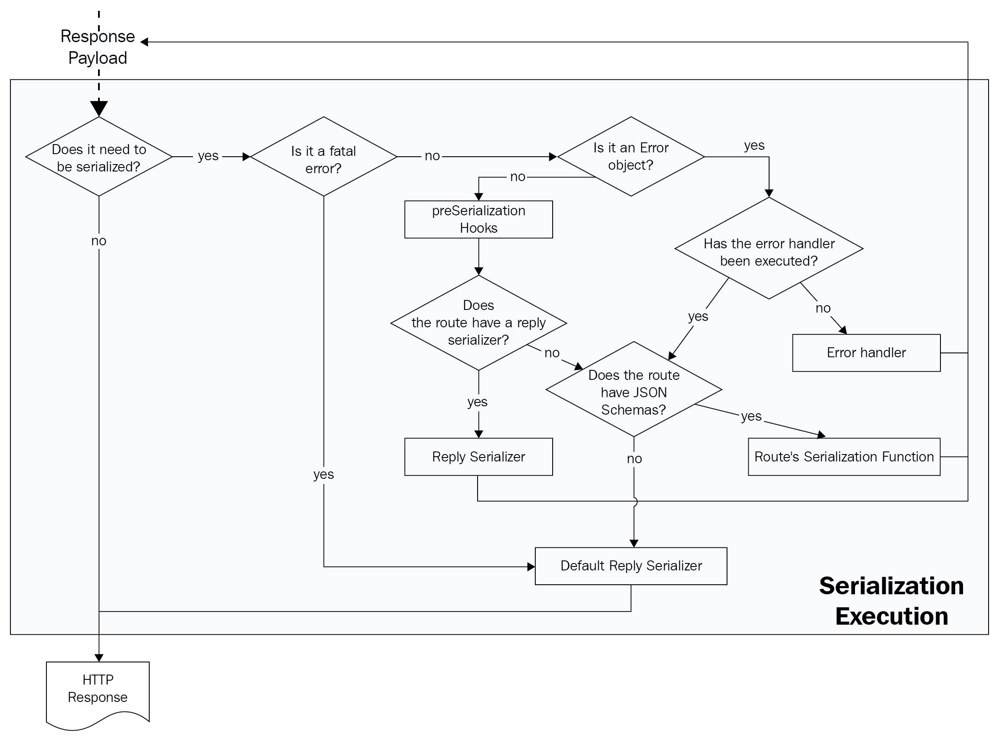

# Exploring Validation and Serialization

Fastify is secure and fast, but that doesn’t protect it from misuse. This chapter will teach you how to implement secure endpoints with input validation and make them faster with the serialization process.

This framework provides all the tools you need to take advantage of these two critical steps, which will support you while exposing straightforward API interfaces and enable your clients to consume them.

You will learn how to use and configure Fastify’s components in order to control and adapt the default setup to your application logic.

This is the learning path we will cover in this chapter:

-   Understanding validation and serialization
-   Understanding the validation process
-   Customizing the validator compiler
-   Managing the validator compiler
-   Understanding the serialization process

## Technical requirements

As mentioned in the previous chapters, you will need the following:

-   A working Node.js 18 installation
-   A text editor to try the example code
-   An HTTP client to test out code, such as CURL or Postman

All the snippets in this chapter are on GitHub at <https://github.com/PacktPublishing/Accelerating-Server-Side-Development-with-Fastify/tree/main/Chapter%205>.

## Understanding validation and serialization

Fastify has been built with a focus on the developer’s experience, and on reducing the developer effort needed to draft a new project. For this reason, Fastify has built-in features to reduce the following burdens:

-   Validating the user’s input
-   Filtering the server’s output

The aim is to find solutions for and prevent the most common security attacks, such as code injection or sensitive data exposure. The answer is declaring the expected input and output data format for every route. Therefore, the validation and serialization processes have been introduced into the framework by design:


<center>Figure 5.1 – The Validation and Serialization phases</center>

This preceding diagram shows the request lifecycle steps’ macro architecture, which you read about in detail in [_Chapter 4_](./hooks.md).

The **Validation** phase happens when the **HTTP Request** comes into the server. It allows you to approve or deny access to the **Business Logic** step.

The **Serialization** step transforms high-level data produced by the business logic, such as JSON objects or errors, into low-level data (`strings` or `buffers`) to reply to the client’s request.

The next question is: how do you define the information passing through the validation and the response data? Fortunately, the solution is the **JSON Schema** specification, which is embraced by both Fastify and the web community.

But what is JSON Schema? We are going to understand this important application’s concept, which focuses on security and speed. The following sections are more theoretical than practical: we need to know how the system works before seeing it in action, otherwise, we may miss important concepts.

### The JSON Schema specification

The JSON Schema standard describes the structure of JSON documents. Therefore, by using a JSON Schema interpreter, it is possible to verify whether a JSON object adapts to a defined structure and act accordingly.

Writing a schema gives you the possibility to apply some automation to your Node.js application:

-   Validating JSON objects
-   Generating documentation
-   Filtering JSON object fields

The standard is still in the draft phase, and it has reached version 2020-12. By default, Fastify v4 adopts an older version of the specification, **Draft-07**, which is broadly supported and used. For this reason, all the next JSON Schema examples follow this standard. Let’s see in practice what a JSON Schema looks like by trying to validate the following JSON object through a schema:

```json
{
    "id": 1,
    "name": "Foo",
    "hobbies": ["Soccer", "Scuba"]
}
```

The corresponding JSON Schema could assume the following structure:

```json
{
    "$schema": "http://json-schema.org/draft-07/schema#",
    "$id": "http://foo/user",
    "type": "object",
    "properties": {
        "identifier": {
            "type": "integer"
        },
        "name": {
            "type": "string",
            "maxLength": 50
        },
        "hobbies": {
            "type": "array",
            "items": {
                "type": "number"
            }
        }
    },
    "required": ["id", "name"]
}
```

_This schema validates the initial JSON object._ As you can see, the schema is JSON that is readable even without knowing the standard format. Let’s try to understand it together.

We expect a `type` object as input with some properties that we have named and configured as follows:

-   The required `identifier` field must be an integer
-   A mandatory `name` string that cannot be longer than 50 characters
-   An optional `hobbies` string array

In this case, a software interpreter’s output that checks if the input JSON is compliant with the schema would be successful. The same check would fail if the input object doesn’t contain one of the mandatory fields, or if one of the types doesn’t match the schema’s `type` field.

So far, we have talked about the JSON object’s validation, but we haven’t mentioned the serialization. These two aspects are different, and they share the JSON Schema specification only. The specification is written keeping the validation process in mind. The serialization is a nice “side effect,” introduced to improve security and performance; we will see how within this section.

The example schema we have just seen is a demo showing the basic schema syntax, which will become more intuitive. JSON Schema supports a large set of keywords to implement strict validation, such as default values, recursive objects, date and time input types, email format, and so on.

Providing a complete overview of the JSON Schema specification could take up the whole book. This is why you can deepen your knowledge of this aspect by checking the official website at <https:// json-schema.org/>. We will have looked at other keywords by the end of this chapter and new ones will be introduced and described gradually.

As you may have noticed reading the previous schema example, some keywords have the dollar symbol prefix, `$`. This is special metadata defined in the draft standard. One of the most important and most used ones is the `$id` property. It identifies the JSON Schema univocally, and Fastify relies upon it to process the schema objects and reuse them across the application.

The `$schema` keyword in the example tells us the JSON document’s format, which is Draft-07. Whenever you see a JSON Schema in these pages, it is implicit that it follows that version due to Fastify’s default setup.

Now we have an idea of what a schema is, but how does it integrate with Fastify’s logic? Let’s find out.

### Compiling a JSON Schema

A JSON Schema is not enough to validate a JSON document. We need to transform the schema into a function that our software can execute. For this reason, it is necessary to use a **compiler** that does the work.

It is essential to understand that a JSON Schema compiler tries to implement the specification, adding valuable features to ease our daily job. This implies knowing which compiler your application uses to tweak the configuration and how to benefit from some extra features such as new non-standard keywords, type coercion, and additional input formats.

!!!note "Compiler implementation lock-in"

    Generally, writing JSON Schema by using a new compiler’s keywords and features leads to lock-in. In this case, you will not be able to change the compiler, and you may find issues during integrations that rely on standard JSON schemas only, such as API document generation. This is fine if you consider the pros and cons that we will present in this chapter.

The same logic has been carried out in the serialization process. The idea was quite simple: if it is possible to build a JavaScript function to validate a JSON object, it is possible to compile a new function that produces a string output. The string would be based only on the fields defined in the JSON schema’s source!

By following this step, you can define only the data you want to enter your server and go out of the application! This improves the application’s security. In fact, the compiler’s implementation has a secure mechanism to block code injection, and you can configure it to reject bad input data, such as `strings` that are too long.

We have now clarified the JSON Schema and explained how it can help improve an application within a compiler component. Let’s understand how Fastify has integrated this logic into the framework.

### Fastify’s compilers

Fastify has two compilers by default:

-   **The Validator Compiler**: Compiles the JSON Schema to validate the request’s input
-   **The Serializer Compiler**: Compiles the response’s JSON Schema to serialize the application’s data

These compilers are basically Node.js modules that take JSON Schema as input and give us back a function. Keep this in mind because it will be important later, in the [Building a new validator compiler](#building-a-new-validator-compiler) section.

Fastify’s detailed workflow can be schematized as follows:


<center>Figure 5.2 – Fastify’s JSON Schema compilation workflow</center>

As you can see, there are two distinct processes:

-   The **Route initialization**, where the schemas are compiled during the startup phase.
-   The request through the **Request Lifecycle**, which uses the compiled functions stored in the route’s context.

Now you should have a complete overview of Fastify’s generic components and the logic they implement. It’s time to see it all in action. Note that to ease understanding and avoid confusion, we will discuss validation and serialization separately.

## Understanding the validation process

The validation process in Fastify follows the same logic to validate the incoming HTTP request parts. This business logic comprises two main steps, as we saw in _Figure 5.2_:

-   The schema compilation executed by the **Validator Compiler**
-   The validation execution

We will discuss these aspects one by one.

### The validator compiler

Fastify doesn’t implement a JSON Schema interpreter itself. Still, it has integrated the **Ajv** (<https://www.npmjs.com/package/ajv>) module to accomplish the validation process. The Ajv integration into Fastify is implemented to keep it as fast as possible and support the encapsulation as well. You will always be able to change the default settings and provide a new JSON Schema interpreter to the application, but we will learn how to do it later, in the [Managing the validator compiler](#managing-the-validator-compiler) section.

!!!note "Ajv version"

    Fastify has included the Ajv module version 8. This is important to know when you need to search for new configurations or to ask for support from the Ajv community. Moreover, the Ajv version defines the supported JSON Schema versions. At the time of writing, the lastest Ajv module version is v8, which supports the 2020-12 specification.

The validator compiler component is a factory function that must compile the application’s route schemas. Every route may define one schema per HTTP part:

-   `params` for the path parameters
-   `body` for the payload
-   `querystring` (or the `query` alias field) for the URL’s query strings
-   `headers` for the request’s headers

All these properties are optional, so you can choose freely which HTTP part has to be validated.

The schemas must be provided during the route declaration:

```js
app.post(
    '/echo/:myInteger',
    {
        schema: {
            params: jsonSchemaPathParams,
            body: jsonSchemaBody,
            querystring: jsonSchemaQuery,
            headers: jsonSchemaHeaders,
        },
    },
    function handler(request, reply) {
        reply.send(request.body);
    }
);
```

You are done! Now, whenever you start the application, the schemas will be compiled by the default validator compiler. The generated functions will be stored in the route’s context, so every HTTP request that hits the `/echo/:myinteger` endpoint will execute the validation process.

We can call our endpoint with the incorrect data to check our code, for example, `/echo/not-a-number`. This input will trigger a validation error, and we will get back a `400 Bad Request` response:

```json
{
    "statusCode": 400,
    "error": "Bad Request",
    "message": "params.myInteger should be integer"
}
```

As we saw, the compilation seems relatively easy, but you also need to know that this feature is _fully encapsulated_. This architectural pattern, which we have discussed already, is designed as follows:

-   One validation compiler per different plugin context and they will not collide
-   You can add schemas with the same `$id` in different contexts and they may have different structures

Before further discussing the validator compiler and how to configure and change it, let’s continue on this “happy path” to get a complete picture of one of Fastify’s key aspects.

### Validation execution

Fastify applies the HTTP request part’s validation during the request lifecycle: after executing the `preValidation` hooks and before the `preHandler` hooks.

The purpose of this validation is to check the input format and to produce one of these actions:

-   **Pass**: Validates the HTTP request part successfully
-   **Deny**: Throws an error when an HTTP request part’s validation fails
-   **Append error**: When an HTTP request part’s validation fails and continues the process successfully – configuring the `attachValidation` route option

This process is not designed to verify data correctness – for that, you should rely on the `preHandler` hook.

As you have seen in the preceding code example, the `schema` object has a defined structure, where every property maps an HTTP part: `params`, `body`, `querystring`, and `headers`. When you set a JSON Schema to `body`, the HTTP request payload must be JSON input by default. You can overwrite this behavior, and we will see how to do it in the next section.

In the previous chapters, all of our route examples did not have the `schema` route option. By doing so, _we skipped the validation_ phase of the request lifecycle.

!!!note "Validation execution order"

    The HTTP part list mentioned in [The validator compiler](#the-validator-compiler) section is ordered by execution. This means that if the `params` validation fails, the subsequent HTTP parts will not be processed.

The validation process is quite straightforward. Let’s zoom in on this process’ logic, looking at the entire request lifecycle:


<center>Figure 5.3 – The validation execution workflow</center>

Let’s understand the flow diagram step by step:

-   The dotted arrow is an HTTP request that has started its lifecycle into the Fastify server and has reached the `preValidation` hooks step. All will work as expected, and we are ready to start the **Validation Execution**.
-   Every HTTP part is validated if a JSON Schema has been provided during the route’s declaration.
-   The validation passes and proceeds to the next step.
-   When the validation fails, a particular `Error` object is thrown, and it will be processed by the **error handler** configured in the server instance where the route has been registered. Note that the error is suppressed if the `attachValidation` route option is set. We will look at an example in the [Flow control](#flow-control) section.
-   If all the validations are successful, the lifecycle continues its flow to the `preHandler` hooks, and it will continue as discussed in the previous chapters.
-   The **Business Logic** dashed box represents the handler execution that has been omitted because the image is specifically focused on validating the execution flow.

These steps happen when the schema option is set into the route definition, as in the previous code snippet in [The validator compiler](#the-validator-compiler) section.

Now we have a complete overview of the entire validation process, from the startup to the server’s runtime. The information provided covers the most common use cases for an application and, thanks to Fastify’s default settings, it is ready to use.

Great applications need great features. This is why we will now focus on the validator compiler customization.

## Customizing the validator compiler

Fastify exposes a lot of options to provide a flexible validation process and complete control of it. We are going to explore all the possible customizations one by one, so you will be a validator compiler guru by the end of this section! Let’s jump into this journey one step at a time!

### Flow control

In the previous section, we mentioned the `attachValidation` route option – it’s time to look at an example (although you probably already know how to use it, thanks to the previous chapters):

```js
app.get('/attach-validation', {
    attachValidation: true,
    schema: {
        headers: jsonSchemaHeaders,
    },
    handler: (request, reply) => {
        reply.send(request.validationError);
    },
});
```

Adding the flag into the route option will prevent a validation error from being thrown. Instead, the validation execution process will be interrupted at the first error occurrence, and the process will continue as the validation has been successful. In this case, a `validationError` object will be attached to the `request` argument. The subsequent route’s entities in the request lifecycle have to deal with the error and act accordingly or the error will not be managed. As in the previous code example, the handler function is always executed.

### Understanding the Ajv configuration

The Ajv configuration defines how the validation’s functions are built and how they will behave in some circumstances. The default settings are the following, and it is worth knowing about them:

```js
{
  coerceTypes:'array',
  useDefaults: true,
  removeAdditional: true,
  uriResolver: require('fast-uri'),
  allErrors: false,
  nullable: true
}
```

Let’s get an understanding of them, and then we will provide an example to see all these options in action:

-   The `coerceTypes` flag tries to coerce the input data to the type defined in the schema. For example, if an input body property is the string `foo:"42"`, and if the field itself is defined as `type: integer`, the `request.body.foo` field will be coerced to Number. We will investigate the `array` value later in this section.
-   The `useDefaults` option will enable the use of the `default` JSON Schema keyword, letting you define an initial value if a property is missing or undefined.
-   The `removeAdditional` setting allows you to evict all the properties that are not listed in the JSON Schema from the HTTP part field.
-   `uriResolver` is a parameter introduced by the Fastify community. It speeds up the Ajv module processing even more.
-   A JSON object may have multiple validation errors, such as two fields that are not the correct data type. The `allErrors` flag configures the validation function to stop at the first error occurrence.
-   The `nullable` flag lets you use the `nullable` keyword’s syntactic sugar in your JSON schemas.

These options and more are well documented on the Ajv site at <https://ajv.js.org/options>. html. You can refer to them to find new options or to change the default ones. We will look at a couple of the most used configurations as a baseline in the [Configuring the default Ajv validator compiler](#configuring-the-default-ajv-validator-compiler) section.

It is important to note that these options let the validation function manipulate the original request’s input. This implies that the raw body is processed and modified.

!!!note "How is the preValidation hook born?"

    The `preValidation` hook was first introduced in Fastify’s core due to the raw body manipulation that the validation functions were doing. This has been necessary in limited cases only, such as a signed body payload that requires an unmodified client’s input.

To see it all in action, here is a JSON Schema:

```js
const ajvConfigDemoSchema = {
    type: 'object',
    properties: {
        coerceTypesDemo: { type: 'integer' },
        useDefaultsDemo: {
            type: 'string',
            default: 'hello',
        },
        removeAdditional: {
            type: 'object',
            additionalProperties: false,
            properties: {
                onlyThisField: {
                    type: 'boolean',
                },
            },
        },
        nullableDemo: { type: 'string', nullable: true },
        notNullableDemo: { type: 'string' },
    },
};
```

This schema introduces three new keywords:

-   The `default` property lets you define a default value when the JSON input object does not contain the `useDefaultsDemo` property or its value is `null`.
-   The `additionalProperties` parameter is used to control the handling of extra properties. In the example, you see the `boolean false`, which evicts the additional data from the HTTP part. An object could also apply more complex filters. Please refer to the official specification: <https://json-schema.org/understanding-json-schema/reference/object.html#additional-properties>.
-   The `nullable` flag is not defined in the standard. It is syntactic sugar to avoid the standard type definition for `nullable` fields: `{ type: ["string", "null"] }`.

Using this schema in a route handler will give us a clear understanding of the configured options:

```js
app.post('/config-in-action', {
    schema: {
        body: ajvConfigDemoSchema,
    },
    handler(request, reply) {
        reply.send(request.body);
    },
});
```

Calling the endpoint, defined with the following payload, should set a reply with the modified body after the validation function’s execution:

```sh
curl --location --request POST 'http://localhost:8080/config-in-
action' \
--header 'Content-Type: application/json' \
--data-raw '{
    "coerceTypesDemo": "42",
    "removeAdditional": {
        "remove": "me",
        "onlyThisField": true
    },
    "nullableDemo": null,
    "notNullableDemo": null
}'
```

We should get back this response as an output:

```json
{
    "coerceTypesDemo": 42,
    "removeAdditional": {
        "onlyThisField": true
    },
    "nullableDemo": null,
    "notNullableDemo": "",
    "useDefaultsDemo": "hello"
}
```

The changes have been highlighted, and each property name describes the Ajv option that triggered the change.

So far, we have a complete understanding of the default validator compiler’s configuration. This covers the most common use cases and gives you the possibility to use it out of the box without struggling with complex configuration or having to learn about the `Ajv` module. Unfortunately, it is crucial to control all Fastify’s components and configuration in order to manage a real-world application. In the following section, you will learn how to customize the validator compiler.

## Managing the validator compiler

Fastify offers you the possibility to customize the validator compiler in two different manners:

-   Configuring the default Ajv validator compiler
-   Implementing a brand-new validator compiler, such as a new JSON Schema compiler module

These options give you total control over the validation process and the ability to react to every situation you may face, such as adopting a new validator compiler module or managing how the Ajv package processes the input data.

### Configuring the default Ajv validator compiler

In the [Understanding the Ajv configuration](#understanding-the-ajv-configuration) section, we saw the default Ajv settings and a link to its documentation to explore them all. If you find some useful options you would like to apply, you can set them during the Fastify instance instantiation:

```js
const app = fastify({
    ajv: {
        customOptions: {
            coerceTypes: 'array',
            removeAdditional: 'all',
        },
        plugins: [[require('ajv-keywords'), 'transform']],
    },
});
```

Fastify’s factory accepts an Ajv option parameter. The parameter has two main fields:

-   `customOptions` lets you extend Ajv’s settings. Note that this JSON will be merged within the default settings.
-   The `plugins` array accepts the Ajv’s external plugins.

The new settings used in the example are the ones I prefer the most. The `coerceTypes` value solves the issue when you need to receive an array parameter via `querystring`:

```js
app.get('/search', {
    handler: echo,
    schema: {
        query: {
            item: {
                type: 'array',
                maxItems: 10,
            },
        },
    },
});
```

Without the `coerceTypes: 'array'`, if your endpoint receives just one parameter, it won’t be coerced to an array within one element by default, thus leading to an error of type mismatch. Note that this option is already set as a default by Fastify.

The `removeAdditional` option value makes it possible to avoid redefining `additional Properties: false` in all our schema objects. Note that it is crucial to list all the properties in the application’s schemas, or you will not be able to read the input in your handlers!

!!!note "JSON Schema shorthand declaration"

    In the previous example, the query’s schema didn’t have some of the mandatory JSON Schema fields: `type` and `properties`. Fastify will wrap the input JSON Schema in parent JSON Schema scaffolding if it does not recognize the two properties. This is how Fastify’s syntactic sugar works, to ease the route’s configuration.

After the `customOptions` Ajv configuration option field, it is possible to set the `plugins` property. It adds new features and keywords to the JSON Schema specification, improving your developer experience.

The `plugins` option must be an array, where each element should be either of the following:

-   The Ajv plugin’s function
-   A two-element array, where the first item is the Ajv plugin’s function and the second is the plugin’s options

We can see how to use it in the following snippet. We are registering the same plugin multiple times for the sake of showing the syntaxes:

```js
plugins: [
    require('ajv-keywords'), // [1]
    [
        // [2]
        require('ajv-keywords'),
        'transform',
    ],
];
```

As you have seen, Fastify’s validator compiler is highly configurable and lets you find the best settings for your application. We have almost covered all the settings that Fastify exposes, in order to configure the default compiler.

So far we have used the validation output as is, but if you are asking yourself whether it is customizable, of course it is! Let’s see how to do it.

### The validation error

The validator function is going to throw an error whenever an HTTP part doesn’t match the route’s schema. The route’s context error handler manages the error. Here is a quick example to show how a custom error handler could manage an input validation error in a different way:

```js
app.get('/custom-error-handler', {
    handler: echo,
    schema: {
        query: { myId: { type: 'integer' } },
    },
});
app.setErrorHandler(function (error, request, reply) {
    if (error.validation) {
        const { validation, validationContext } = error;
        this.log.warn({ validationError: validation });
        const errorMessage = `Validation error on
    ${validationContext}`;
        reply.status(400).send({ fail: errorMessage });
    } else {
        this.log.error(error);
        reply.status(500).send(error);
    }
});
```

As you can see, when the validation fails, two parameters are appended to the Error object:

-   The `validationContext` property is the HTTP part’s string representation, responsible for generating the error
-   The `validation` field is the raw error object, returned by the validator compiler implementation

The default Fastify error handler manages the Ajv error object and returns a clear error message.

!!!note "The validation error data type"

    The default compiler produces an Ajv error array. Therefore, the `validation` property is generated by Ajv’s compiled function. Whenever we use the custom validator compiler with a new error format, the `validation` field mutates its data type accordingly.

Customizing the error handler gives you the control to make the validation errors conform to your application’s error format output. We saw an example earlier, in the [The validator compiler](#the-validator-compiler) section.

If you just need to customize the error message instead, Fastify has an option even for that! The `schemaErrorFormatter` option accepts a function that must generate the `Error` object, which will be thrown during the validation process flow. This option can be set in the following ways:

-   During the root server initialization
-   As the route’s option
-   Or on the plugin registration’s instance

Here is a complete overview of the three possibilities in the same order as in the preceding list:

```js
const app = fastify({
    schemaErrorFormatter: function (errors, httpPart) {
        //[1]
        return new Error('root error formatter');
    },
});
app.get('/custom-route-error-formatter', {
    handler: echo,
    schema: { query: { myId: { type: 'integer' } } },
    schemaErrorFormatter: function (errors, httpPart) {
        //[2]
        return new Error('route error formatter');
    },
});
app.register(function plugin(instance, opts, next) {
    instance.get('/custom-error-formatter', routeConfig);
    instance.setSchemaErrorFormatter(function (
        errors,
        httpPart
    ) {
        // [3]
        return new Error('plugin error formatter');
    });
    next();
});
```

The `setSchemaErrorFormatter` input function must be synchronous. It is going to receive the raw `errors` object returned by the compiled validation function, plus the part of HTTP that is not valid.

So far, we have tweaked the default Fastify validator compiler, since it generates the validation function for the error output. There are quite a lot of settings, but they allow you to customize your server based on your choices, without dealing with the compilation complexity. We still have to explain how to change the validator compiler implementation, but we must learn how to reuse JSON schemas first.

### Reusing JSON schemas

JSON schemas may seem huge and long to read and understand at first sight. In fact, in the [The JSON Schema specification](#the-json-schema-specification) section, we saw a ~20-line schema to validate a three-field JSON object.

The JSON Schema specification solves this issue by providing schema reusability through the `$ref` keyword. This property is used to reference a schema and must be a string URI. `$ref` may reference an external JSON Schema or a local one in the schema itself.

To reference an external schema, we must start with the following two actions:

1.  Set the `$id` property of the external schema and the `$ref` values to reference it.
2.  Add the external schema to the Fastify context, calling the `app.addSchema(json Schema)` method.

To understand it better, we are going to use an example:

```js
app.addSchema({
    $id: 'http://myapp.com/user.json',
    definitions: {
        user: {
            $id: '#usermodel',
            type: 'object',
            properties: {
                name: { type: 'string', maxLength: 50 },
            },
        },
        address: {
            $id: 'address.json',
            definitions: {
                home: {
                    $id: '#house',
                    type: 'string',
                    maxLength: 150,
                },
                work: {
                    $id: '#job',
                    type: 'string',
                    maxLength: 200,
                },
            },
        },
    },
});
```

The `addSchema` method accepts a valid JSON Schema as an argument, and it must have the `$id` value. Otherwise, the schema can’t be referenced. If the `$id` value is missing, an error is thrown. Adding a schema by following this example lets us reference it in the route configuration’s `schema` property.

!!!note "The schema’s `$id`"

    In the previous code block, the `$id` value is an absolute **Uniform Resource (URI)**. The JSON Schema specification defines that the root schema’s `$id` should be in this format. The URI set doesn’t need to be a real HTTP endpoint as in the example. It must be unique. Following the specification will help you adopt external tools to manipulate your application’s schemas, such as documentation generation. As an example, I like to use a URI in this format: `schema:myapplication:user:create`, which can be summarized as `schema:<application code>:<model>:<scope>`.

To reference the <http://myapp.com/user.json> schema, we must use the `$ref` keyword:

```js
app.post('/schema-ref', {
    handler: echo,
    schema: {
        body: {
            type: 'object',
            properties: {
                user: {
                    $ref:
                        'http://myapp.com/user.json#usermodel',
                }, // [1]
                homeAdr: {
                    $ref:
                        'http://myapp.com/address.json#house',
                }, // [2]
                jobAdr: {
                    $ref:
                        'http://myapp.com/address.json#/definitions/work',
                    // [3]
                },
                notes: { $ref: '#/definitions/local' }, // [4]
            },
            definitions: {
                local: { type: 'boolean' },
            },
        },
    },
});
```

We used four different URI reference formats. Generally, the `$ref` format has this syntax:

```
<absolute URI>#<local fragment>
```

Here is a brief explanation:

1.  **Reference to an external fragment**: The user’s property points to an external `$id`, defined in the `user.json` URI domain.
2.  **Reference to an external subschema fragment**: `homeAdr` has replaced the absolute URI, from `user.json` to `address.json`. This happens because if `$id` doesn’t start with the `#` char, it is a relative path to the root URI. So, in the external schema, we have defined an `address.json` subschema.
3.  **Relative path to an external subschema**: The local fragment can be a relative path to the JSON Schema to apply. Note that the relative path uses the JSON field name `work` and not the `$id` value.
4.  **Local reference**: You can reference the schema itself. When `$ref` does not have an absolute URI before the `#` char, the local fragment is resolved locally.

This example gives you a complete tool belt and helps you to define your own schema’s references. This setup covers the most common use cases. In fact, the specification is comprehensive and covers many more use cases that could not adapt to our applications. You may refer to the official documentation example to deep dive into `$ref` and `$id` linking <https://datatracker.ietf.org/doc/html/draft-handrews-json-schema-01#section-8.2.4>.

We have learned how to share schemas across the application and use them in our routes’ configuration. But how can we read them? Let’s find out in the next section.

#### Retrieving your schemas

You must be aware that the schemas added through the `addSchema()` method are stored in a `bucket` component. Every plugin instance has one `bucket` instance to support the encapsulation. Let’s see this code:

```js
app.register(async (instance, opts) => {
    instance.addSchema({
        $id: 'http://myapp.com/user.json',
        type: 'string',
        maxLength: 10,
    });
});
app.register(async (instance, opts) => {
    instance.addSchema({
        $id: 'http://myapp.com/user.json',
        type: 'string',
        maxLength: 50,
    });
});
```

Adding two schemas with the same `$id` is going to throw an error during the startup phase. The usual Fastify logic will apply as always: schemas added in the plugin’s parent scope are inherited in the child one. But, two schemas can have the same `$id` only in different encapsulated contexts.

!!!note "Fastify loves optimizing"

    As mentioned, every plugin context has a `bucket` component that contains all the context’s schemas. This is not totally true. The schema objects could be vast and repetitive. Therefore, Fastify optimizes the bucket logic to reduce the `bucket` instances to the minimum that is needed to isolate them in an encapsulated context. For example, adding all the shared application’s schemas in the root context leads to a single `bucket` instance.

To read the application’s schemas from the `bucket` component, you can use these methods:

```js
const json = instance.getSchema(
    'http://myapp.com/user.json'
);
const jsonIdSchemaPair = instance.getSchemas();
```

`getSchema(id)` needs a string argument within the `$id` to retrieve the corresponding schema. The `getSchemas()` method returns a JSON key-value pair where the key is the schema’s `$id` and the value is the JSON Schema itself.

Now we know about all the aspects of the default validator compiler, how can we configure and extend it? It is time to drop it in favor of a custom one!

### Building a new validator compiler

Fastify’s validator compiler can be replaced totally. You may need to do this in the following situations:

-   You need a unique validator compiler for each HTTP part. For example, you need a specific Ajv configuration for the body part and a different configuration for `querystring`.
-   You prefer to use a different JSON Schema compiler module, such as `@hapi/joi` or `yup`.
-   You want to build your compiler to optimize your application.

It is important to keep in mind that rewriting this Fastify component requires knowing the validation flow, because not being able to find the schemas is one of the most common pitfalls.

Fastify provides you with a couple of ways to substitute the compiler:

-   The root instance’s **Schema Controller Factory**
-   The root or plugin’s validator or serializer compiler component

These two options interact with each other as shown in the following diagram:


<center>Figure 5.4 – The compiler’s customization process</center>

During the startup, Fastify decides when it needs a validator compiler or serializer compiler, based on the following questions:

-   Does the root or the plugin instance need a compiler?
-   Does the root or the plugin instance have a compiler already?
-   Are the `bucket` schemas changed, compared to the parent instance?

When all these conditions are met, Fastify asks the schema controller factory to build a new compiler. Note that the following logic applies to both the validator compiler and the serializer compiler. We are going to focus on the validator compiler, but the flow is the same for each of them. We will explore the serializer compiler in the [The serializer compiler](#the-serializer-compiler) section.

The input to produce the compiler is as follows:

-   The compiler option. For the validation compiler, it corresponds to the application’s `ajv` option property.
-   The instance’s `bucket` schemas.

Within these arguments, the factory must produce a Fastify compiler.

The validator compiler is a function that, given the route’s schemas, must return a new function to validate the HTTP request’s parts – we know, it seems a bit tricky, but let’s look at a complete example to understand this idea:

```js
const app = fastify({
    schemaController: {
        // [1]
        compilersFactory: {
            buildValidator: myCompilerFactory, // [2]
        },
    },
});
app.addSchema({
    $id: 'http://myapp.com/string.json',
    type: 'string',
    maxLength: 50,
});
function myCompilerFactory(
    externalSchemas,
    ajvServerOption
) {
    return myValidatorCompiler; // [3]
}
function myValidatorCompiler(routeData) {
    const { schema, method, url, httpPart } = routeData;
    return function validate(jsonPayload) {
        // [4]
        return true;
    };
}
```

The example shows all the schema controller’s entities, which are just simple functions that don’t really do anything. Still, they provide us with an excellent overview of how the single parts can work together, adding some `console.log` statements during your experiments.

!!!note "Disclaimer"

    Be patient and try to follow the code: we are going to explore a function that returns a function that returns another function! It is pretty easy to get lost when first reading it, but hang in there!

There is a new `schemaController` option `[1]`. This parameter lets us configure and take control of the compilers through the `compilersFactory` object. It accepts two parameters, `buildValidator` and `buildSerializer`.

We are going to focus on the former: providing a function `[2]` as input. The `myCompilerFactory` function can access all the instance’s schema via the `externalSchemas` argument and `ajvServerOption`. In this example, there is just one external schema, `'http://myapp.com/string.json'`, and the ajv server options are empty.

!!!note "External schemas"

    The `externalSchemas` argument is provided by Fastify’s schemas bucket. It is populated by calling `instance.getSchemas()` internally. The word “external” refers to those schemas that are referenced by the routes’ schemas.

`myCompilerFactory` is executed whenever Fastify needs a new compiler, based on the checklist we saw at the beginning of this section. For example, the smallest memory footprint case is set by calling this function once: there is only one validator compiler for the whole application.

!!!note "Fastify uses the same APIs exposed to the user"

    It is important to mention that Fastify uses this API to implement the default schema controller. The default `myCompilerFactory` implementation creates the default Ajv instance, and it is isolated in an external module named `@fastify/ajv-compiler`. Thanks to this module, it is possible to run Fastify with a different Ajv version out of the box. Please give it a check!

The `myCompilerFactory` function returns the `myValidatorCompiler` function `[3]`. The latter function target is to “compile” the input schema and transform it into an executable JavaScript function. The `myValidatorCompiler` function is executed during the startup phase, once for every route’s JSON Schema. The `routeData` argument is an object within the route’s coordinates where the following applies:

-   `schema` is the object provided to the route’s schema option (sorry for the redundancy).
-   `method` is the route’s HTTP method string in uppercase.
-   `url` is the raw route’s URL string. For example, the path parameters such as `/hello/:name`.
-   `httpPart` tells us which HTTP request’s part should be validated. It can be one of the well- known `body`, `params`, `querystring`, or `headers` strings.

The `myValidatorCompiler` `[3]` function returns... another function! It is the last one, I swear. The `validate` `[4]` function is what the compilation of the schema must produce. It is stored in the route’s context and executed for every HTTP request routed to that endpoint. We saw the schema of this process in _Figure 5.3_.

The `validate` function is the one that is run when the server is listening. The `schemaController` flow, we have just seen, is executed once during the startup, and it is the heaviest task Fastify must complete before accepting incoming requests. To put it in practice, Fastify’s default `schemaController` component uses the Ajv module to build these `validate` functions – no more, no less.

In the example, we customized `schemaController` with a validation that always returns `true`. But we could implement our logic based on `httpPart`, such as using a primary validation function for `querystring` and `headers` and a more complex one for the `body` part. The most common use case is to apply different ajv settings for each HTTP part. You can find a complete example at <https://github.com/fastify/help/issues/128>.

Congratulations! You have explored the hardest and most complicated Fastify components. It could take a while before gaining full control over these functions, so don’t rush – take your time. Keep in mind that it is fine to not customize the schema controller and use the default one. This section’s takeaway is how the system works under the hood, but it’s still a valuable option to explore because then you will not have nasty surprises during your application development.

Now that you have learned about the Schema Controller Factory component and its configuration and customization, we can move on. Keep calm; it will be easier from now on.

### Customizing the schema validator compiler

In the previous section, we explored the Schema Controller Factory, one of the two ways to substitute Fastify’s schema compiler. Looking at _Figure 5.4_ and the conditions to check whether Fastify must create a compiler, we can tackle the question _Does the root or the plugin instance have a compiler already?_

Customizing the schema validator is quite easy at this point:

```js
app.setValidatorCompiler(myValidatorCompiler); // [1]
app.register(async function plugin(instance, opts) {
    instance.setValidatorCompiler(myValidatorCompiler); // [2]
    app.post('/schema-ref', {
        handler: echo,
        validatorCompiler: myValidatorCompiler, // [3]
        schema: {
            body: mySchema,
        },
    });
});
```

The `myValidatorCompiler` variable is the same as in the previous section: it has the same interface and the same result is returned.

As you know, Fastify lets you customize the schema compiler in two different stages:

-   Customize the validator compiler for the root application instance `[1]` or plugin instance `[2]`
-   Customize the validator compiler for a single route through the route’s options `[3]`

As we have just seen in the example, customizing the validator compiler forces Fastify to skip the Schema Controller Factory call. The function you provide is used instead of building it.

This type of customization is easier to apply compared to the Schema Controller Factory, and it gives you the possibility to change even the tiniest pieces of your application. The typical function of this feature is to support two different compilers in the same Fastify application. This is really useful to migrate applications written using the `joi` module. The following code shows an example:

```js
app.register(async function plugin(instance, opts) {
    function joiCompiler({
        schema,
        method,
        url,
        httpPart,
    }) {
        return function (data) {
            return schema.validate(data);
        };
    }
    instance.setValidatorCompiler(joiCompiler);
    instance.post('/joi', {
        handler: echo,
        schema: {
            body: Joi.object({
                hello: Joi.string().required(),
            }),
        },
    });
});
```

All the routes registered in the `plugin` rely on the `joiCompiler` returned function to validate the HTTP parts. Notice that the `schema` argument is actually a `Joi.object()` instance object. It has been provided during the route registration, and it is not a standard JSON Schema at all. Fastify doesn’t complain about this because you have provided a custom validator compiler, so it is okay if the provided compiler knows how to manage the input schema object.

The routes registered out of the plugin context rely on Fastify’s default validator compiler! We must thank the encapsulation yet again!

Now the validation process and all its pieces have no more secrets for you. You have acquired a deep knowledge of how your routes’ input is validated before executing the handler.

It is time to meet the serializer compiler, but don’t worry, the concepts we explored in this extensive section will be the same in the next one.

## Understanding the serialization process

Serialization is the process of transforming complex objects or primitive data into a valid data type that can be transmitted to the client. A **valid data type** is a String, a Stream, or a Buffer.

In the [Understanding validation and serialization](#understanding-validation-and-serialization) section, we introduced the concept of Fastify’s serialization process, which uses JSON schemas to adapt a response payload to a defined format. This is the only task that this process carries out. It doesn’t apply any sort of validation of the output. This is often confusing because the JSON Schema is associated with the validation phase. Therefore, it would be more appropriate to compare it to filter processing rather than to a validation.

The actors in action are quite similar to what we saw in the [Building a new validator compiler](#building-a-new-validator-compiler) section, with some additions. In the following diagram, _Figure 5.5_, we are going to present these additions, extending the **Serialization** box we saw in _Figure 5.3_:



<center>Figure 5.5 – The serialization workflow</center>

_Figure 5.5_ shows the complete workflow Fastifty carries out to serialize the response payload you are sending, calling `reply.send()` or executing a `return` statement in an `async` handler.

!!!note "Too many payloads"

    To improve this section’s clarity, we will name the endpoint’s output object a **response payload**. For reference, it is the one that you give as an argument to the `reply.send()` method. The **serialized payload** is the response payload transformed to a valid data type and ready to be transmitted to the client.

The diagram might look a bit complex, but it condenses these Fastify rules:

-   It is sending or returning an object that is not a String, a Buffer, or a Stream that triggers the serialization process
-   Returning or throwing an error object will trigger the error handler we saw in [Chapter 3](./routes.md)
-   Fastify applies a fallback to avoid starving requests due to a component’s misuse, such as throwing an error in an error handler

Let’s start analyzing _Figure 5.5_ in detail. The first thing that stands out is that the serialization process is skipped when the response payload is a valid data type. This usually happens for web page rendering or for a file download.

When the response payload is not valid, it is processed by five main blocks that manage the payload:

-   The `preSerialization` hooks manipulate the payload before the serialization. We saw this in action in [Chapter 4](./hooks.md).
-   The error handler must manage the error and reply to the HTTP request. As you can see, it is executed only once, but we read about it in [Chapter 3](./routes.md).
-   The **Reply Serializer** is a new simple component. It must convert the object to a valid data type.
-   The **Route’s Serialization Function** is produced by the serializer compiler.
-   The last one, the **Default Reply Serializer**, acts when there is no customization.

Thanks to the flowchart, it should be easier to navigate through the serialization process. For example, it is clear that a custom reply serializer has priority over the serialization function. But let’s look at the code to learn how to use these components to serialize a response payload.

### The reply serializer

This component helps you manage a response that is not JSON and needs to be serialized in a different format. It is a synchronous function that must return a valid data type (a String, or a Stream, or a Buffer). If something else is returned or thrown, a fatal error will be sent in response. The reply serializer’s `this` context is the reply object itself – it may be helpful to set additional headers.

The usage is quite straightforward at this point of your path through the Fastify world:

```js
function mySerializer(payload, statusCode) {
    return `<payload>${payload}</payload>`;
}
app.setReplySerializer(mySerializer); // [1]
app.get('/reply-serializer', function handler(
    request,
    reply
) {
    reply
        .type('application/xml')
        .serializer(mySerializer) // [2]
        .send({ hello: 'world' });
});
```

You can assign a custom serializer to the root or plugin server instance `[1]`. As always, in this case, all the routes registered in that context will run it.

The other option is to run the custom serializer only when needed to call the `reply.serializer()` method and passing `serializer` as an argument `[2]`. Remember to set the content-type header in this case, or you may encounter Fastify’s unpredictable results.

That is all you must know about the reply serializer. This component is used to reply with content types that are not JSON, such as XML, compression buffers, YML, and so on.

Having closed this parenthesis, we can start to complete our serialization journey by discussing the serialization function produced by the serializer compiler.

### The serializer compiler

The serializer compiler builds a JavaScript function from a JSON Schema to serialize the response payload. It removes all the fields that are not declared in the schema, and it coerces the output fields’ type. These are the tasks that Fastify’s default serializer compiler does.

The module that compiles the JSON Schemas is `fast-json-stringify` (<https://www.npmjs.com/package/fast-json-stringify>).

!!!note "The speed increment"

    The serialization process through a compiled function reduces the time taken to serialize the response’s JSON object. The `fast-json-stringify` and Fastify modules have published a comprehensive benchmark that compares them to other frameworks too (<https://github.com/fastify/benchmarks/>).

But how can we use the JSON Schema to serialize the payload? Let’s see an example:

```js
app.post('/filter', {
    async handler(request, reply) {
        return {
            username: 'Foo',
            password: 'qwerty',
        };
    },
    schema: {
        response: {
            '2xx': {
                type: 'object',
                properties: {
                    username: { type: 'string' },
                },
            },
        },
    },
});
```

The code snippet shows a new option field on the schema route’s options object: the `response` property. It accepts a JSON object where each key must be the following:

-   An HTTP status code such as `200`, `404`, or `500`
-   An HTTP status code pattern looks like: `2xx`, meaning all the status codes from `200` to `299`

In this way, you can customize every response payload with a defined JSON Schema.

As you can see, the `/filter` endpoint returns a `password` field, but thanks to the response schema, it will not be sent to the client! The schema object will use the same schemas within the `$ref` keyword as the validator compiler: they share the `bucket` schemas, as said in the [How to build a new validator compiler](#how-to-build-a-new-validator-compiler) section.

!!!note "Knowing the default serializer compiler"

The `fast-json-stringify` module has its own implementation, and it doesn’t support all the keywords provided by the Ajv validator. This is understandable because they have different functions. One great example you need to learn from is that, while the `maxLength` property of a string field is fundamental to validate the input, it is ignored by the default JSON serializer. Remember, the default JSON Schema serialization doesn’t validate the data; it only filters and coerces the types.

Now we know how to use Fastify’s default serializer compiler, but how is it possible to customize it? Let’s learn about it in the next section.

### Managing the serializer compiler

Just as you can customize the validator compiler, you can do the same with the serializer compiler. To complete the code snippet described in _Figure 5.5_, check out the following code:

```js
const app = fastify({
    serializerOpts: { rounding: 'ceil' },
    schemaController: {
        compilersFactory: {
            buildSerializer: myFactory, // [1]
        },
    },
});
app.addSchema({
    $id: 'http://myapp.com/string.json',
    type: 'string',
});
function myFactory(
    externalSchemas,
    serializerOptsServerOption
) {
    return mySerializerCompiler; // [2]
}
function mySerializerCompiler(routeData) {
    const {
        schema,
        method,
        url,
        httpStatus,
    } = routeData[3]; //
    return function serializer(responsePayload) {
        // [4]
        return `This is the payload ${responsePayload}`;
    };
}
```

The source code should look very familiar to you: the logic flow is the same as we discussed in the [How to build a new validator compiler](#how-to-build-a-new-validator-compiler) section, with minimal changes:

1.  The `compilersFactory` option accepts the new `buildSerializer` property.
2.  The `myFactory` function receives the `serializerOptsServerOption` input equal to the `serializerOpts` object (instead of the `ajv` one).
3.  The `mySerializerCompiler` function receives `httpStatus` as route data `[3]`. The validator receives `httpPart`.
4.  The compiler must return a synchronous function [4] that builds a string object.

The compiled function is then stored in the route’s context, and it will be executed when the serialization process requires it, as we saw in _Figure 5.5_.

Finally, like the validator compiler, you can set the serializer compiler in every context you need it:

```js
app.setSerializerCompiler(mySerializerCompiler); // [1]
app.register(async function plugin(instance, opts) {
    instance.setSerializerCompiler(mySerializerCompiler)[2]; //
    app.post('/respose-schema', {
        handler: echo,
        serializerCompiler: mySerializerCompiler, // [3]
        schema: {
            response: {
                '2xx': mySchema,
                '5xx': myErrorSchema,
            },
        },
    });
});
```

The Fastify way to customize the compiler is consistent with the validator way:

-   Customize the serializer compiler for the root application instance `[1]` or the plugin instance `[2]`
-   Customize the serializer compiler for a single route through the route’s options `[3]`

We have explored the serializer compiler without annoying you by repeating the logic behind the schema controller.

You should be able to customize Fastify’s serializer and change the module that implements schema compilation by adopting the library that best fits your needs. As you have read, Fastify keeps its components consistent, adopting solid patterns that ease your learning curve and improve the framework itself.

## Summary

This chapter has followed a long path inside Fastify’s internals to unveil the JSON schema’s power. Now you understand why defining a JSON Schema is a critical phase in your application setup. It can be a hard task, but data validation and a fast response are the two main reasons to do this.

We have looked at the JSON Schema specification’s basics and how to use it in our routes, adopting the default Fastify components. We did not step back to configure these components, and now you have seen the whole process, you can control them to reach your goals.

It has not been easy. The concepts in this chapter are the most misused by developers that use Fastify. You did a great job, and I hope the diagrams have helped you follow the logic behind the validation and the serialization.

This chapter is the last theoretical one: congratulations! In many chapter’s sections, we read concepts that were already discussed in the previous chapters. This is proof that the Fastify architecture is recursive in all its components.

Now, things are getting serious: in the next chapter, we will start building a real application that we’ll use for the rest of the book to create a solid, reusable scaffolding project.
