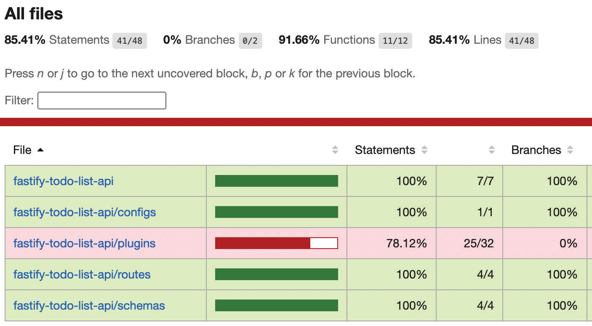

# Application Testing

Proper testing is a primary, essential aspect that will make an application reliable for years to come. Fastify comes with several integrated tools specifically developed for making the testing experience as slick as possible. This means that writing an application test will not be frustrating and slow to run. Nevertheless, Fastify is test runner-agnostic; it perfectly integrates with the runner of your choice.

In this chapter, you will learn how to use integrated methods and run tests in parallel without having to spin an actual HTTP server.

The learning path we will cover in this chapter is as follows:

-   Writing good tests
-   Testing the Fastify application
-   Dealing with complex tests
-   Speeding up the test suite
-   Where tests should run

## Technical requirements

To go through this chapter, you will need the following:

-   A working Node.js 18 installation
-   [The VSCode IDE](https://code.visualstudio.com/)
-   A Docker installation
-   A public GitHub repository
-   A working command shell

All the snippets in this chapter are on [GitHub](https://github.com/PacktPublishing/Accelerating-Server-Side-Development-with-Fastify/tree/main/Chapter%209).

## Writing good tests

Implementing tests for an application is an investment to free you up from the stress that a new project could give you. Thanks to these tests, you can be (pretty) sure of implementing new features or fixing bugs without breaking the existing software. Unfortunately, writing tests often gets sacrificed whenever a project is running out of time. This is also an activity that many consider to be boring and frustrating, due to the many blockers you may face by testing an HTTP server, such as the server port already in use. So, the tests are often written quickly and without the required attention.

We can say that an application’s test suite is successful under the following conditions:

-   It’s automated – you just need to click a button to get many hours’ worth of work done
-   It’s easy to maintain – adding a new test must be easy, and it should not take more time than developing the feature itself
-   Running the tests must not take a lot of time
-   Every developer can run the tests locally on their PC

Fastify’s team knows this, and it has worked to give you the right tooling to support you on these focal tasks for a project’s success.

We will explore the world of testing to learn how to write proper tests for the application we have developed so far, since [Chapter 6](./project-structure.md).

So, let’s jump into a quick introduction to testing.

### What tests need to be written?

There are tons of books about tests and how to write them, and this chapter does not aim to replace those sources. This book offers you a practical approach based on our experience, covering the most common use cases you will face during your development.

You will need to distinguish these main test categories:

-   **Unit tests**: Check that a small piece of software works as expected. Unit tests are mainly used to verify utilities or plugins. For example, testing a utility that sanitizes the user’s input is a unit test.
-   **Integration tests**: These aim to ensure that all the pieces of your application work together. Usually, integration tests require an additional setup to run correctly because they rely on external services, such as a database or a third-party API. For example, making an HTTP request to test that a row has been inserted into a database is an integration test.
-   **Functional tests**: these tests track business requirements and real-world scenarios replicating the application usage. For example, a functional test checks whether the user can register and log in successfully to our system.
-   **Regression tests**: Every solved bug in your application must be traced with a test that fails before the fix is applied to the code. For example, every bug fix should accompany a regression test associated with whatever the implementation requires, such as a running database or unusual API usage by the client.

Regardless of the framework used, every application needs this minimal set of tests to provide valuable support to the project.

!!!note "The test pyramid"

    To deepen the tests, you should read these articles: <https://martinfowler.com/bliki/TestPyramid.html> and <https://martinfowler.com/articles/practical-test-pyramid.html>. These articles explain in detail how tests impact your application life cycle. The former analyzes that there is a monetary cost behind every test and the latter shows how to balance costs and tests writing because they are sensible aspects.

That being said, the most challenging thing to do when writing tests is to list all the use cases that need to be covered. The checklist I follow involves writing down a minimal test list and defining the priorities, as follows:

1.  Add basic tests to ensure the correct application loading.
2.  Write at least one success case covering the _happy path_ for every endpoint. The happy path is the more straightforward case when no errors happen.
3.  Write at least one failure case covering the _unhappy path_ for every endpoint. As you can imagine, the unhappy path covers the most common errors, such as a wrong password when a user tries to log in.
4.  The business cases should support you in defining the most common scenarios, such as user registration and unsubscribing a workflow.

Now we know _why_ we are going to write tests and _which_ tests we need, but we must also understand _how_ we can write them. Let’s find out in the next section.

### How to write tests?

Implementing a test case using “pure” Node.js is simple, and it helps us understand the basic concepts of testing.

Let’s create an `example.js` file, where we test that a variable is equal to the number `42`:

```js
const assert = require('assert');
const myVar = '42';
assert.strictEqual(myVar, 42);
```

Running this file by `node example.js` will produce an error output:

```
AssertionError [ERR_ASSERTION]: Expected values to be strictly equal:
'42' !== 42
```

Congratulations! You have written your first failing test!

This step is essential during the test implementation; _the tests must fail_ in the first place. When you have “red” tests, you define the input and the expected output. By doing so, you can start writing your code and verify that the implementation fits the desired result.

!!!note "Test-driven development"

Writing failing tests is called the “red phase” in **Test-Driven Development (TDD)**. This is a methodology created by Kent Beck to write better and well-tested software applications. Even if you don’t know or don’t use this process, you can benefit from it by applying some simple rules, such as the one we have seen in this section.

In our example, the `myVar` declaration corresponds to our implementation, and we spotted the first bug in the code – the `'42'` string is not equal to the number `42`! Fixing the code and rerunning the file will not produce any output; this means that the test is successful.

The takeaway here is that our test files are made of a long list of **assertions** that define our expectations. When these assertions are successful, we can say that the tests are passing or are green.

The other notion to know about testing is the **coverage**. This gives you insight into how much of your code is tested. Let’s see an example of updating our previous test file:

```js
const assert = require('assert');
const myVar = 42;
if (typeof myVar === 'string') {
    assert.strictEqual(myVar, '42');
} else {
    assert.strictEqual(myVar, 42);
}
```

The previous snippet is a simple code example to help you become confident with the concept of coverage; the if statement will always be `false`, as we expect.

Now, we need to use an external tool to see the coverage in action. To be specific, we are going to use the `istanbul` coverage tool and its command-line interface called `nyc`:

```sh
npx nyc node example.js
```

The preceding command downloads the `nyc` module, thanks to `npx`, and runs `node example.js`. As a result, we get a nice clear report:


<center>Figure 9.1 – The coverage report</center>

This report tells us a lot about our test execution:

-   `% Stmts`: The percentage of the statement executed during the run.
-   `% Branch`: The percentage of tested paths the code can follow. A branch is created using conditional statements (`if`, the ternary operator, and `&&` and `||` operators), conditional loops (such as `while`, `for`, and `do-while`), `break` and `continue` statements, or a function’s default parameters.
-   `Uncovered Line #s`: The source code lines have not been executed.

To learn more about the output report, you can visit the <https://istanbul.js.org/> site.

!!!note "100% coverage does not mean bug-free"

    Reaching 100% code coverage can be a complex task and sometimes a waste of time. You don’t need to struggle to build up the coverage to consider your application tested. You should focus on the test cases that matter to your application; one more functional test is better than a not- so-useful test to reach 100% coverage.

The coverage report is handy to analyze; you can spot dead code branches that need to be removed or use cases that you forgot to list and check. This way, the code base maintenance is simplified, and it is possible to monitor the report results, while the test suite becomes larger.

Now you have learned the basic concepts about testing – assertions and coverage. All the Node.js testing frameworks provide these two capabilities. When you compare the packages to choose the best for you, it is highly suggested that you start evaluating the assertions that the framework implements and the coverage reports it generates.

We are now ready to write our application’s tests in the next section.

## Testing the Fastify application

We are ready to implement the tests for our Fastify application. Before we start, we need to choose a framework that will help us write the code. Let’s complete this task first!

### Installing the test framework

There are a lot of testing frameworks in the Node.js panorama. Some of them are highly opinionated, and others try to be agnostic. We are not going to discuss comparing the most famous modules. It is worth mentioning the ones most used by the community (in alphabetical order):

-   [AVA](https://www.npmjs.com/package/ava)
-   [Jest](https://www.npmjs.com/package/jest)
-   [Mocha](https://www.npmjs.com/package/mocha)
-   [node-tap](https://www.npmjs.com/package/tap)
-   [Tape](https://www.npmjs.com/package/tape)

The framework we will use is `node-tap` because it has all the key features out of the box without needing extra configuration, such as the following:

-   An easy-to-use and solid implementation
-   Comprehensive assertions
-   Parallel test execution
-   An HTML coverage report format

It is simple to use, and the source code is easy to read, so it is perfect.

!!!note "Choose wisely"

    You may be tempted to use the most downloaded testing framework from the previous list, such as Jest or Mocha. However, you must be aware that those frameworks were not designed to test server-side Node.js code. They heavily rely on implicit globals – an antipattern for testing predictable software output. This may impact your developer experience: <https://github.com/fastify/help/issues/555>.

Nonetheless, `node-tap` is largely used by the Fastify team. This might seem piddling, but it’s worth remembering – sometimes, the plugins’ documentation doesn’t show a complete code example, but there are certainly some tests you can read to get more information and a full working example.

We need to install the `node-tap` dependency by running `npm install tap@15 --save-dev`. Let’s see how to use its API.

### Creating your `node-tap` cheatsheet test

Before writing the application’s tests, we need to learn how to use `node-tap`. So, let’s create a comprehensive test file to become familiar with all the most used features.

Create a new `test/cheatsheet.test.js` file and write this code:

```js
const t = require('tap');
t.test('a test description', (t) => {
    t.plan(1);
    const myVar = '42';
    t.equal(myVar, 42, 'this number is 42');
});
```

The previous code shows a minimal test case that already teaches us a couple of good practices. After importing the module, we can start defining our test cases using the `t.test()` method. We must provide a test description and a test function that implements the logic to verify that our code is working.

The test function accepts one single argument. It is a `node-tap` object that provides you with the assertion methods to implement the test `logic.t.plan()` is a mandatory setup; you must declare how many assertions your test case will execute. If you don’t set it, the run will fail.

!!!note "Skip the test’s plan"

    The `t.plan()` method is the best approach to ensure that all the assertions have been checked. It is instrumental when you are testing asynchronous code in callback style. Whenever you don’t know how many assertions your code will execute exactly, for your convenience you can use `t.end()` instead of setting `t.plan()` in the initial implementation phase.

Running the script is as easy as running node `test/cheatsheet.test.js`. You will see some nice output that shows all the successful and failed steps. The code example should fail though. Try to fix it and rerun the file. Spoiler: `myVar` is not a number, as we learned in the previous [How to write tests](#how-to-write-tests) section.

The smart reader should have spotted that the `t.equal()` assertion function follows a strict comparison. Almost all the `node-tap` assertion functions accept three parameters in the following order:

1.  What value do you want to compare?
2.  What value do you expect?
3.  An optional string message or option object.

Let’s check the most used assertion functions by adding new test cases in our test file.

To check that a JSON object is like another, we can’t use `t.equal`, which is used to compare values. We must use the following method instead to compare every object’s field:

```js
const sameStructure = { hello: 'world' };
t.strictSame(
    sameStructure,
    { hello: 'world' },
    'the object is correct'
);
```

We want to check that a JSON object has some fields in some other cases. This is why we must use the `match` function:

```js
const almostLike = {
    hello: 'world',
    foo: 'bar',
};
t.match(
    almostLike,
    { hello: 'world' },
    'the object is similar'
);
```

We have checked that the `almostLike` variable has at least the `hello` property field. The `t.match()` assertion is more powerful than the previous example. It processes every regular expression against all the JSON input’s enumerable fields. You can try it by setting a `RegExp` Node.js object:

```js
t.match(
    almostLike,
    {
        hello: 'world',
        foo: /BAR/i,
    },
    'the object is similar with regex'
);
```

In the past example, the `foo` input property must match the `/BAR/i` regular expression.

For the last assertion functions, we will see the boolean checks and the nested tests:

```js
t.test('sub test', function testFunction(t) {
    t.plan(2);
    const falsyValue = null;
    t.notOk(falsyValue, 'it is a falsy value');
    t.test('boolean asserions', (subTapTest) => {
        subTapTest.plan(1);
        subTapTest.ok(true, 'true is ok');
    });
});
```

In this code snippet, you can read the `t.notOk()` and `subTapTest.ok()` functions that pass whether the value is falsy or truthy respectively. Moreover, the example shows a `t.test()` call inside another `t.test()`. This sub-test enables you to organize your use cases better and group them into logical steps. Note that a `t.test()` sub-test counts as an assertion when the plan counter is set up.

We must talk about one more thing before proceeding with the next section. So far, we have seen synchronous functions. What about `async` functions instead? `node-tap` makes it easy:

```js
const fs = require('fs').promises
t.test('async test', async t => {
  const fileContent = await fs.readFile('./package.json',
    'utf8')
  t.type(fileContent, 'string', 'the file content is a
    string')
  await t.test('check main file', async subTest => {
    const json = JSON.parse(fileContent)
    subTest.match(json, { version: '1.0.0' })
    const appIndex = await fs.readFile(json.main, 'utf8')
    subTest.match(appIndex, 'use strict', 'the main file is
    correct')
  })
  t.pass('test completed')
})
```

Looking at the code example, we have provided an `async` function as a parameter. We do not need to set `t.plan` or call the `t.end` function. By default, the test ends when `Promise` returned by the `async` operation is fulfilled successfully. If `Promise` is rejected, the test fails.

Another note about the code is that the `t.test()` function returns `Promise` that can be awaited. This can be helpful to run some tests serially. We will delve more into this in the _Speeding up the test suite_ section.

You can rely on the new `t.pass()` assertion in order to be sure about the code execution order, because it serves as a milestone that our code must meet.

We have learned how to use `node-tap` and write the assertions we will use to test the Fastify application. We did not cover all the assertions at our disposal. For further information, you can take a look at the official documentation: <https://node-tap.org/docs/api/asserts/>.

Now, let’s move on to the next section and practice what we have learned so far.

### How to write tests with Fastify?

We are ready to write out the first application test! Writing good tests is a process and it requires starting from a basis to build a solid structure. We will iterate multiple times on the same file to improve the test suite repeatedly.

As mentioned in the [Starting an optimal project](./project-structure.md#starting-an-optimal-project) section of Chapter 6, we need to think about the tests we are going to write first. The most basic questions we could ask with our test are as follows:

-   Does the application start correctly?
-   Are the routes ready to listen to incoming HTTP requests?
-   Does the application manage the unhealthy system?

To answer these questions, we can write the `test/basic.test.js` file:

```js
const t = require('tap');
t.todo('the application should start', async (t) => {});
t.todo('the alive route is online', async (t) => {});
t.todo('the application should not start', async (t) => {});
```

We have listed the test cases we will write using the `t.todo()` method instead of the usual `t.test()`. The “todo” acts as a reminder to find those functions that need to be implemented.

Let’s start with the first test. We need to load the application, but we are using the `fastify-cli` module to load our `app.js` file. Luckily, there is the `fastify-cli/helper` utility that helps us:

```js
const fcli = require('fastify-cli/helper');
const startArgs = '-l info --options app.js';
t.test('the application should start', async (t) => {
    const envParam = {
        NODE_ENV: 'test',
        MONGO_URL: 'mongodb://localhost:27017/test',
    };
    const app = await fcli.build(startArgs, {
        configData: envParam,
    });
    t.teardown(() => {
        app.close();
    });
    await app.ready();
    t.pass('the application is ready');
});
```

First of all, we need to load the `fastify-cli/helper` utility. It works as the `fastify` command in the `package.json > scripts` tag. In fact, we need the `startArgs` constant that includes the same configuration we use to start the server. You can copy and paste it from the `start` script in `package.json`.

The `fcli.build()` method is an asynchronous function that returns the Fastify instance. It is the same as running `fastify start <args>` from the shell. The key difference is that the server is not listening. We have already seen the difference between `fastify.ready()` and `fastify.listen()` in [Chapter 2](../basic/plugin-system.md).

Note that the `build` function accepts an extra JSON parameter. The second option argument accepts a `configData` parameter, `opts`, received as input in the `app.js` file:

```js
module.exports = async function (fastify, opts) { ... }
```

This technique is one of the best practices to inject all the possible configurations the application supports. We will test every possible combination without building odd algorithms to load files using pattern matching.

To complete the test setup, we need to edit the `plugins/config.js` file by adding the following line:

```js
await fastify.register(fastifyEnv, {
    confKey: 'secrets',
    data: opts.configData,
    schema: fastify.getSchema('schema:dotenv'),
});
```

By doing so, we can control the `@fastify/env` data source. By default, the plugin reads data from `process.env`. By adding the `data` parameter to the plugin, it will be preferred over `env`, so it is possible to run the tests controlling the environment variables.

After building the Fastify instance, we need to track that we want to close the server when the test ends. The `t.teardown()` method accepts a function executed when this condition is met. If we forget to add it, the test script will never end because the open connections to the database will keep the Node.js runtime up and running.

Looking at the last two lines of the test implementation, we run `await app.ready()` to load the application without starting the HTTP server. All the plugins and routes are loaded only if the load itself is completed successfully. This test helps us find system-wide errors, such as broken plugins and misconfiguration.

Before starting the tests, we must not forget to turn on MongoDB by running `npm run mongo:start`. Now, the `node test/basic.test.js` command leads to a successful test run.

You have completed the first important step in a battle-tested Fastify application! Let’s now implement the other tests case, focusing on improving our code step by step.

The second test case involves checking that the base route is up and running. The first challenge is to avoid repeating code to build the Fastify instance. It would be easy to copy and paste, but look at the following code:

```js
async function buildApp(t, env = envParam, serverOptions) {
    const app = await fcli.build(
        startArgs,
        { configData: env },
        serverOptions
    );
    t.teardown(() => {
        app.close();
    });
    return app;
}
t.test('the alive route is online', async (t) => {
    const app = await buildApp(t);
    const response = await app.inject({
        method: 'GET',
        url: '/',
    });
    t.same(response.json(), { root: true });
});
```

We have defined a `buildApp` function that reduces the complexity of building the application. It requires the test object as input and an optional JSON object that simulates the environment variables. Moreover, it is possible to merge the `configs/server-options.js` file’s content with the `serverOptions` object, by providing a third parameter for the `fcli.build` function. It is really handy to be able to control every aspect of your Fastify server when running the tests.

The new notable utility is `app.inject(options[, callback])`. This function is a Fastify instance method that starts the server with a ready status, and it creates a fake HTTP request on the Fastify server. This means that the application is fully loaded, but the HTTP server is not listening for incoming HTTP requests. Nonetheless, you can call your routes, injecting a fake HTTP request. The fake HTTP request simulates a real HTTP one, creating `http.IncomingMessage` and `http.ServerResponse` objects.

Having an application up and running without holding the host’s port has great advantages:

-   The tests run faster
-   It is possible to run tests simultaneously

The `app.inject()` interface accepts a JSON argument to compose the HTTP request. The most used properties are as follows:

-   `method`: The request’s HTTP method.
-   `url` or `path`: The URL to call during the fake request.
-   `headers`: A key-string JSON that sets the request’s headers.
-   `payload` or `body`: This can be a string, buffer, stream, or JSON object. The latter will be stringified and the content-type header will be set as `application/json` by default.
-   `query`: A key-string JSON to set the request’s query string.
-   `cookies`: A key-string JSON to attach to the request cookies’ headers.

You can find a complete options list by reading the `light-my-request` documentation at <https://github.com/fastify/light-my-request#injectdispatchfunc-options-callback>.

The `inject` API returns `Promise` when a callback is missing – as the `app.ready()` does. `Promise` fulfills an enhanced `http.ServerResponse` object that you can read in a simplified way – for instance, we used `response.json()` to get a JSON in our code example. This works only if the application returns a JSON payload. Other than that, you can access these properties:

-   `statusCode`: Returns the HTTP status code response number
-   `headers`: Returns a key-string JSON object that maps the response’s headers
-   `payload`: Returns the response’s payload as a UTF-8 string
-   `rawPayload`: Returns the response’s payload as a `Buffer` object
-   `cookies`: Returns a key-string JSON, mapping the response’s cookie headers

The `light-my-request` module makes the application testing friendly and easy, thanks to the listed option utilities reducing the code we must write and incrementing what we can assert. The previous code snippet that implements the route test can be summarized in these three steps:

1.  Building the application.
2.  Making a fake HTTP call.
3.  Checking the response output.

I hope you are as excited about it as I am! In a few code lines, we have been able to spin up the whole application and make HTTP calls to the Fastify server.

Last but not least, we must deal with error cases. Testing the application’s happy path could become boring at some point in the future. The real challenge is to verify how the software deals with errors, such as disconnection or wrong data input. We will complete our basic tests by adding some sub-tests to the `t.todo('the application should not start')` case.

We will force a bad environment to check that the server does not start when the configuration is wrong, but we must also be sure that the error tells us the correct information. Let’s jump to the following code:

```js
t.test(
    'the application should not start',
    async (mainTest) => {
        mainTest.test(
            'if there are missing ENV vars',
            async (t) => {
                try {
                    await buildApp(t, {
                        NODE_ENV: 'test',
                        MONGO_URL: undefined,
                    });
                    t.fail('the server must not start');
                } catch (error) {
                    t.ok(error, 'error must be set');
                    t.match(
                        error.message,
                        "required property 'MONGO_URL'"
                    );
                }
            }
        );
    }
);
```

In this code snippet, we have added a sub-test that verifies that the `@fastify/env` plugin reacts correctly when the preconditions are not satisfied. The `t.fail()` method works as a trap; when executed, it stops the test and sets it as failed. By doing so, you are declaring that “this code must not execute.”

Another useful test to add is an unreachable `mongodb` connection:

```js
mainTest.test('when mongodb is unreachable', async (t) => {
    try {
        await buildApp(t, {
            NODE_ENV: 'test',
            MONGO_URL: 'mongodb://localhost:27099/test',
        });
        t.fail('the server must not start');
    } catch (error) {
        t.ok(error, 'error must be set');
        t.match(error.message, 'connect ECONNREFUSED');
    }
});
```

If you set the `MONGO_URL` incorrectly, the Fastify server will not be able to connect and not start as expected.

Well done! You have now written your first basic application tests. There is much more to consider in order to declare your application tested, but now you have a solid knowledge of the tools and methodology to add more and more checks.

In the next section, we will improve code reusability and the developer experience to write tests as smoothly as possible.

### How to improve the developer experience?

Before writing all the test cases for the application’s endpoints, we must ask ourselves whether there are repetitive tasks we must automate. In fact, we need to remember to start the MongoDB container and stop it every time. For this reason, we can optimize this process by adding a simple script to run before our tests. We will use the `dockerode` module (<https://www.npmjs.com/package/dockerode>) for this purpose.

Let’s create a file named `test/helper-docker.js` and then map the `docker run` command into a configuration:

```js
const Containers = {
    mongo: {
        name: 'fastify-mongo',
        Image: 'mongo:5',
        Tty: false,
        HostConfig: {
            PortBindings: {
                '27017/tcp': [
                    {
                        HostIp: '0.0.0.0',
                        HostPort: '27017',
                    },
                ],
            },
            AutoRemove: true,
        },
    },
};
```

The previous code will be useful to control all the Docker images we may need in the future. The code snippet replicates the `docker run -d -p 27017:27017 --rm --name fastify-mongo mongo:5` command as a Node.js script that is easier to maintain and read.

Now, the software should be able to do the following:

-   Understand whether MongoDB is running
-   Start the MongoDB container
-   Stop the MongoDB container

At this point, we can define the interface exported by the `helper-docker.js` file:

```js
const Docker = require('dockerode');
function dockerConsole() {
    const docker = new Docker();
    return {
        async getRunningContainer(container) {
            // TODO
        },
        async startContainer(container) {
            // TODO
        },
        async stopContainer(container) {
            // TODO
        },
    };
}
module.exports = dockerConsole;
module.exports.Containers = Containers;
```

We can use the `dockerode` module to implement the utility function to know it. To get the running container, the script must read all the running containers and then look for the one we are interested in:

```js
async getRunningContainer(container) {
	const containers = await docker.listContainers();
	return containers.find((running) => {
		return running.Names.some((name) =>
			name.includes(container.name)
		);
	});
},
```

The `container` argument will be `Containers.mongo`, defined in the code snippet at the beginning of this section.

To implement the function that starts the container instead, we need to pass the same `Containers.mongo` object to `dockerode`:

```js
async startContainer(container) {
	const run = await this.getRunningContainer(
		container
	);
	if (!run) {
		await pullImage(container);
		const containerObj = await docker.createContainer(
			container
		);
		await containerObj.start();
	}
},
```

The `startContainer` function will start the MongoDB server locally if it is not already running – nice and easy!

Finally, the last `stopContainer` function utility to stop the container will look as follows:

```js
async stopContainer(container) {
	const run = await this.getRunningContainer(
		container
	);
	if (run) {
		const containerObj = await docker.getContainer(
			run.Id
		);
		await containerObj.stop();
	}
},
```

We have completed the `docker` utility, but we still need to use it in our tests. To do it, we need to update the `basic.test.js` source code by adding the following script:

```js
const dockerHelper = require('./helper-docker');
const docker = dockerHelper();
const { Containers } = dockerHelper;
t.before(async function before() {
    await docker.startContainer(mongo);
});
t.teardown(async () => {
    await docker.stopContainer(
        dockerHelper.Containers.mongo
    );
});
```

You should be able to recognize three steps in the script:

1.  Load the `helper-docker` script and initialize the variables.
2.  Set the `t.before()` function that will start the MongoDB container. The `before` function will run once and before all the `t.test()` functions.
3.  The `teardown` function will stop the container when all the tests are completed.

Now, whenever you and your team need to run the tests, it will no longer be necessary to remember anything more than just executing `npm test`.

The application’s tests have not been completed yet, nor has the source code refactoring. This process is a continuous evolution and still requires some iteration before becoming stable. We have written just one single test file. The next challenge will be to write a new test file, without duplicating the source code. So, let’s complete our tests in the next section.

## Dealing with complex tests

So far, we have seen simple test cases that did not require multiple API requests. So, let’s create the `test/login.test.js` file to verify the sign-up and first user login to our application. We will use what we have learned so far, keeping in mind that we don’t want to replicate code.

We need to build the Fastify instance to write new test cases, as we did in the `test/basic.test.js` file. To do so, we need to do the following:

1.  Create a new utility file and call it `test/helper.js`.
2.  In the `test/helper.js` file, move the `buildApp` function and its configuration variables, `startArgs` and `envParam`. This action requires some copying and pasting.
3.  Update the `test/basic.test.js` file within the new import, `const { buildApp } = require('./helper')`.

By doing so, we can reuse code to instantiate the Fastify application across all the test files we are going to create. We are now ready to write more complex tests.

### Reusing multiple requests

Every route has data requirements that can be satisfied by replicating a client’s workflow – for example, we need to create a user first to test user deletion. So, we can start writing test cases for the login process. The test suite should answer these questions:

-   Does the authorization check block unauthorized users?
-   Do the register and login endpoints work as expected?

The first check should verify that the protected routes are protected, so we can implement a bit more logic into the test’s source code:

```js
t.test('cannot access protected routes', async (t) => {
  const app = await buildApp(t)
  const privateRoutes = [ '/me' ]
  for (const url of privateRoutes) {
    const response = await app.inject({ method: 'GET', url
    })
    t.equal(response.statusCode, 401)
    t.same(response.json(), {
      statusCode: 401,
      error: 'Unauthorized',
      message: 'No Authorization was found in
      request.headers'
    })
  }
})
```

We can iterate the `privateRoutes` array to check that the routes are secured. Here, I’m showing how to automate code without repeating yourself.

Before logging into the application, the user must register to the platform, so we should add a test for it. This is a simple task nowadays, but here is the code for completeness:

```js
t.test('register the user', async (t) => {
    const app = await buildApp(t);
    const response = await app.inject({
        method: 'POST',
        url: '/register',
        payload: {
            username: 'test',
            password: 'icanpass',
        },
    });
    t.equal(response.statusCode, 201);
    t.same(response.json(), { registered: true });
});
```

Then, we need to test the login endpoint to verify that it works as expected. It must return a **JWT token** (as discussed in [Chapter 8](./auth.md)), and we can use it to access the `privateRoutes` endpoints. As you can imagine, the login test is straightforward, as follows:

```js
t.test('successful login', async (t) => {
    const app = await buildApp(t);
    const login = await app.inject({
        method: 'POST',
        url: '/authenticate',
        payload: {
            username: 'test',
            password: 'icanpass',
        },
    });
    t.equal(login.statusCode, 200);
    t.match(login.json(), { token: /(\w*\.){2}.*/ });
});
```

The authentication test executes a `POST` call, providing the correct user’s data and verifying that the service returns a token string. You can apply a stricter validation to the output token as well. Now, we can use the generated token by adding a new sub-test after the `t.match()` assertion:

```js
t.test('access protected route', async (t) => {
    const response = await app.inject({
        method: 'GET',
        url: '/me',
        headers: {
            authorization: `Bearer ${login.json().token}`,
        },
    });
    t.equal(response.statusCode, 200);
    t.match(response.json(), { username: 'John Doe' });
});
```

The `access protected route` test relies on the `login` object to authenticate the request and successfully access the endpoint. Note that the sub-test does not need to build the application; we can use the one created by the parent test case. It is possible to create complex workflows and simulate every scenario to cover the business cases.

### Mocking the data

To complete our test journey, we must talk about **mocks**. A mock is a fake implementation of a real application’s component that acts conditionally to simulate behaviors that would be hard to replicate. We will use a mock to test a failed registration while the service inserts data into a database.

Many tools help you write mocks, but we will keep it at a low level to understand how they work. Let’s jump into the code:

```js
function cleanCache() {
    Object.keys(require.cache).forEach(function (key) {
        delete require.cache[key];
    });
}
t.test('register error', async (t) => {
    const path = '../routes/data-store.js';
    cleanCache(); // [1]
    require(path); // [2]
    require.cache[require.resolve(path)].exports = {
        // [3]
        async store() {
            throw new Error('Fail to store');
        },
    };
    t.teardown(cleanCache); // [4]
    const app = await buildApp(t);
    const response = await app.inject({
        url: '/register',
        // ...
    });
    t.equal(response.statusCode, 500);
});
```

Mocks rely on how Node.js loads the source code of an application. For this reason, we need to take over the default logic for our scope. Every time a `require('something')` statement runs, a global cache is fulfilled within the `module.exports` exported data, so if you run the `require` statement twice, the file is loaded just once. That being said, we need a function to clean this cache to inject our mock implementation. We need the `cleanCache` function that removes all the loaded code. This is not performant at all. You could filter the output based on your project path to optimize it.

The test implementation does a few things before calling the `buildApp` function (as seen in the preceding code block):

1.  `[1]` cleans the cache; we need to remove all the cached files that use the `path` file. It is unmanageable to know every file that uses it, so we will clean the whole cache as a demonstration.
2.  At `[2]` we load the target file we are going to mock.
3.  The `[3]` applies the mock to the cache. To do it, we need to know the `path` file interface. As you can understand, this is an invasive test that does not adapt to any refactor.
4.  Finally the `[4]` block must remove the mock implementation when the test ends to let Node.js reload the original file. We can’t clean just the `path` cache because all the files that used the mock have been cached within the mock itself.

As you can see, the mock testing technique requires knowledge of the Node.js internals. The modules that help you mock your code work as the previous code snippet but provide a better user experience. Moreover, this test may change over time when the `path` file changes. You should evaluate whether you need to couple your tests within the code base.

Sometimes, this technique is not an option. An example is a third-party module that you don’t need to test in your test suite, such as an external authorization library.

Now you have added new tools to your test toolkit that you will use to evaluate more options during your test suite implementation. We have slowed down the test by clearing the cache in the previous section. Let’s find out how to speed up the tests in the next section.

## Speeding up the test suite

There are not many tests in the actual application, but they’re all pretty fast. While your project will grow, the tests will become more and more time-consuming and more annoying to run. It is not uncommon to have a test suite that runs in a span of 15 minutes, but that is too much time! Now, we are going to see how to speed up a test run to avoid a situation like this, by parallelizing the tests’ executions and evaluating the pitfall this technique carries.

### Running tests in parallel

To improve our test run, we need to update the test script in `package.json`:

```json
"test": "tap test/**/**.test.js",
```

The `npm test` command will execute all the files in the `test/` folder that ends with the `test.js` suffix. The cool thing is that each file runs in parallel on a dedicated Node.js process! That being said, it hides some considerations you must be aware of when writing tests:

-   `process.env` is different for every test file
-   There are no shared global variables across files (and tests)
-   The `require` module is performed at least once per Node.js process spawned
-   Executing `process.exit()` will stop one execution file

These are not limitations, but having these rules helps you to organize code in the best way possible, and to run tests the fastest. Moreover, you are forced to avoid global objects and functions that add [side effects](https://softwareengineering.stackexchange.com/questions/40297/what-is-a-side-effect). For this reason, the factory pattern we have adopted since the first chapter is a big win – every test case will build its own objects with its own configuration, without conflicting with other files.

!!!note "The `--jobs` argument"

    The `tap` command interface accepts a `-j=<n> --job=<n>` parameter that sets how many test files can be run in parallel. By default, it is set as the system’s CPU core count. Setting it to `1` disables the parallelism.

The `node-tap` framework has a comprehensive section about [running tests in parallel](https://node-tap.org/docs/api/parallel-tests/).

### How to manage shared resources?

Managing shared resources is a parallelism con. We need to implement the last refactor on our test suite to achieve this result. The shared resource I’m talking about is a database. Using the `helper-docker` utility in every test file is not an option. We would face errors due to the host’s port already in use or a Docker conflict, such as the following:

```
Conflict. The container name "/fastify-mongo" is already in use by
container "e24326". You have to remove (or rename) that container to
be able to reuse that name
```

There are some options to solve this issue:

-   Customize the configuration of each test file. Running a database container for every file requires a lot of system resources, so you must evaluate this option carefully. It is the easiest way to fix the issue, but we would slow down the suite as a result.
-   Change the database. Right now, we are turning on an actual database, but there are many alternatives in the npm ecosystem, such as in-memory databases that emulated NoSQL databases or SQL ones. This is for sure a good option you must take into account.
-   Create the pre-test and the post-test scripts to spin up the shared resources before the tests’ execution. Note that every file needs its own dataset or database schema to border the assertions, or one test could erase all the data for other tests!

These are the most common solutions to the shared resources problem. The first option does not work with limited resources. The second option does not work if you use a database that does not have an in-memory implementation. So, we will implement the third option because it teaches you one real scenario that works every time. Don’t be afraid. It is a matter of refactoring the source code a bit.

Let’s create a new `test/run-before.js` file; cut and paste the `before/teardown` code from the `test/basic.test.js` file. The new file outcome will be as follows:

```js
const t = require('tap');
const dockerHelper = require('./helper-docker');
const docker = dockerHelper();
const { Containers } = dockerHelper;
t.before(async function before() {
    await docker.startContainer(Containers.mongo);
});
```

The `basic.test.js` file will be smaller and smaller at every refactor. It means we are doing great. Now, we need another file called `test/run-after.js`. It will be similar to the `run-before` one, but in place of `t.before()`, we must cut the `teardown` function:

```js
t.teardown(async () => {
    await docker.stopContainer(Containers.mongo);
});
```

We are almost done with our refactoring. Now, we must update the `basic.test.js` file by updating all the `buildApp` usages and setting the default database:

```js
const app = await buildApp(t, {
    MONGO_URL: 'mongodb://localhost:27017/basis-test-db',
});
```

Then, it is the `login.test.js` file’s turn to set up its own database instance:

```js
const app = await buildApp(t, {
    MONGO_URL: 'mongodb://localhost:27017/login-test-db',
});
```

Finally, we need to use two new `node-tap` arguments by editing `package.json`:

```json
"test": "tap --before=test/run-before.js test/**/**.test.js --after=test/run-after.js",
"test:nostop": "tap --before=test/before.js test/**/**.test.js"
```

The `--before` parameter will execute the input file before the whole test suite. The `--after` argument does the same but at the end of the test suite run. Note that the `test:nostop` addition is equal to the `test` script but does not stop and clean the database server at the end of the process. This script is really helpful when you are developing and you need to check the data on your database manually.

Do you find it difficult to manage shared resources? If yes, then thanks to the Fastify coding style pattern, you should become very comfortable with these refactors. We can only do so because there are no global objects, and we can instantiate as many Fastify instances as we need without caring about the host’s ports.

Now, you have the initial knowledge to deal with parallelism complexity. It is not easy, but you can overcome the complexity with clear code and reusable functions.

In the next section, we will provide some suggestions to push your code base to the stars.

## Where tests should run

Up until now, we have executed our test manually on our PC. That is fine, and it is mandatory during the development phase. However, this is not enough because our installation could be edited, or we could have some uncommitted files.

To solve this issue, it is possible to add a **Continuous Integration (CI)** pipeline that runs remotely to manage our repository. The CI pipeline’s primary duties are as follows:

-   Running the test suite to check the code in the remote Git repository
-   Building a code base to create artifacts if necessary
-   Releasing the artifacts by triggering a **Continuous Delivery (CD)** pipeline to deploy the software

The CI workflow will notify us about its status, and if it is in a red state, the application’s tests are failing with the last commit. Running the test remotely will prevent false-positive issues due to our local environment setup.

We will build a simple CI workflow by adopting GitHub Actions. This is a free service for public repositories, with a free limited quota for private ones. We will not go into detail and just take a quick look at how easy it is to start using a CI pipeline.

To create a CI workflow, you need to create a new file named `.github/workflows/ci.yml`. The source must be as follows:

```yml
name: CI
on: [push, pull_request]
jobs:
    test-job:
        runs-on: ubuntu-latest
        steps:
            - name: Check out the source code
              uses: actions/checkout@v2
            - name: Install Node.js
              uses: actions/setup-node@v2
              with:
                  node-version: 18
            - name: Install Dependencies
              run: npm install
            - name: Run Tests
              run: npm test
```

As you can see, the script maps every step you should follow to run the project:

1.  Check out the source code.
2.  Install the desired Node.js version.
3.  Install the project.
4.  Run the test script.

This step-by-step process is crucial in a CI configuration. If you want to try other vendors, such as CircleCI, Bitbucket Pipelines, or Travis CI, you will need to change the configuration file’s syntax, but the logic will be unaltered.

Committing the previous code example will trigger the GitHub action automatically. You can see it by looking at the repository’s **Actions** tab, as shown in the following screenshot:


<center>Figure 9.2 – The CI executions</center>

As you can see in _Figure 9.2_, the workflow will fail on the first try. We need to fix our test script. So, we must read the console’s output in order to understand what was not working properly.

The observant among you would have noticed this error output at the end of the `npm test` command, even if the tests were successful:

```
ERROR: Coverage for lines (85.41%) does not meet global threshold
(100%)
ERROR: Coverage for functions (91.66%) does not meet global threshold
(100%)
ERROR: Coverage for branches (0%) does not meet global threshold
(100%)
ERROR: Coverage for statements (85.41%) does not meet global threshold
(100%)
```

The error is due to a default `node-tap` configuration that requires 100% coverage. To reach this coverage level, we must add a new flag to the `package.json`’s test script:

```json
"test": "tap --before=test/run-before.js test/**/**.test.js --after=test/run-after.js --no-check-coverage",
"test:coverage": "tap --coverage-report=html --before=test/run-before.js test/**/**.test.js --after=test/run-after.js",
```

The `--no-check-coverage` argument solves the test failure due to its coverage below the 100% threshold.

The last addition to complete this journey into the `node-tap` framework and application tests is the `test:coverage` script, added in the previous code snippet. Running the script by executing the `npm run test:coverage` command should open your system’s browser at the end, showing a nice HTML report as follows:



<center>Figure 9.3 – A coverage HTML report</center>

If the browser doesn’t open automatically the web page, it is possible to open it manually by clicking on the `coverage/lcov-report/index.html` file, that has been generated in the project’s root path during the test execution.

_Figure 9.3_ shows how you can build a coverage report that you can navigate using your browser. By clicking on the blue highlighted links, you will see every repository’s file and how many times a single code line has been executed during the test execution:


<center>Figure 9.4 – Source code coverage</center>

The coverage output helps you understand what is not tested in your application, allowing you to make appropriate decisions.

## Summary

This chapter is dense with information about new processes and tools. Now, you should be comfortable designing a test suite for a Node.js backend application. You should be able to evaluate a testing framework that fits your needs and boosts your productivity.

You have learned how to use `node-tap`, from basic assertions to advanced parallel test execution. Moreover, you can test a Fastify application and take advantage of Fastify’s `inject` feature. You don’t have to worry about testing your API’s routes, whatever the level of complexity is.

Finally, we have seen how to integrate a CI pipeline using GitHub Actions and its logic to keep our repository away from regressions and production issues.

Now, you are ready to proceed to the next step and build a secure and reliable application. We mentioned CD earlier in this chapter; it is now time to see it in action in [Chapter 10](./deploy.md).
