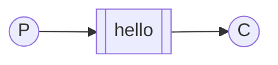
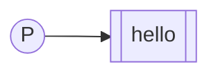
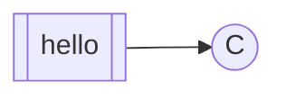

# "Hello World!"

!!!info "Информация"

    **Предварительные условия**

    В этом руководстве предполагается, что RabbitMQ [установлен](https://www.rabbitmq.com/docs/download) и работает на localhost на [стандартном порту](https://www.rabbitmq.com/docs/networking#ports) (5672). Если вы используете другой хост, порт или учетные данные, настройки подключения потребуют корректировки.

    **Где получить помощь**

    Если у вас возникли проблемы при прохождении этого руководства, вы можете связаться с нами через [GitHub Discussions](https://github.com/rabbitmq/rabbitmq-server/discussions) или [RabbitMQ community Discord](https://www.rabbitmq.com/discord).

## Введение

**RabbitMQ** — это брокер сообщений: он принимает и пересылает сообщения. Можно сравнить его с почтовым отделением: когда вы опускаете письмо в почтовый ящик, вы можете быть уверены, что почтальон в конечном итоге доставит его адресату. В этой аналогии RabbitMQ — это почтовый ящик, почтовое отделение и почтальон.

Основное отличие RabbitMQ от почтового отделения заключается в том, что он не работает с бумагой, а принимает, хранит и пересылает двоичные блоки данных — «сообщения».

RabbitMQ, как и системы обмена сообщениями в целом, использует некоторый жаргон.

-   _Производство_ означает не что иное, как отправку. Программа, которая отправляет сообщения, является _производителем_:

    ```mermaid
    flowchart LR
        P((P))
        class P mermaid-producer
    ```

-   _Очередь_ — это название почтового ящика в RabbitMQ. Хотя сообщения проходят через RabbitMQ и ваши приложения, они могут храниться только в _очереди_. _Очередь_ ограничена только объемом памяти и дискового пространства хоста, по сути, это большой буфер сообщений.

    Многие _производители_ могут отправлять сообщения, которые поступают в одну очередь, а многие _потребители_ могут пытаться получать данные из одной _очереди_.

    Так мы представляем очередь:

    ```mermaid
    flowchart LR
    	Q[[queue_name]]
    	class Q mermaid-queue
    ```

-   _Потребление_ имеет значение, схожее с получением. _Потребитель_ — это программа, которая в основном ожидает получения сообщений:

    ```mermaid
    flowchart LR
        C((C))
        class C mermaid-consumer
    ```

Обратите внимание, что производитель, потребитель и брокер не обязательно должны находиться на одном хосте; в большинстве приложений это не так. Приложение может быть одновременно и производителем, и потребителем.

## «Hello World»

В этой части учебника мы напишем две небольшие программы на Javascript: производителя, который отправляет одно сообщение, и потребителя, который принимает сообщения и выводит их на печать. Мы не будем вдаваться в подробности API [amqp.node](http://www.squaremobius.net/amqp.node/), сосредоточившись на этой очень простой задаче, чтобы начать работу. Это «Hello World» в области обмена сообщениями.

На схеме ниже «P» — наш производитель, а «C» — наш потребитель. Блок в середине — это очередь, буфер сообщений, который RabbitMQ хранит от имени потребителя.



!!!info "Клиентская библиотека amqp.node"

    RabbitMQ поддерживает несколько протоколов. В этом руководстве используется AMQP 0-9-1, который является открытым протоколом общего назначения для обмена сообщениями. Существует ряд клиентов для RabbitMQ на [многих разных языках](https://www.rabbitmq.com/client-libraries/devtools). В этом руководстве мы будем использовать [клиент amqp.node](http://www.squaremobius.net/amqp.node/).

    Сначала установите amqp.node с помощью [npm](https://www.npmjs.com):

    ```bash
    npm install amqplib
    ```

Теперь, когда мы установили amqp.node, можем приступить к написанию кода.

### Отправка



Мы назовем наш производитель сообщений (отправитель) `send.js`, а наш потребитель сообщений (получатель) `receive.js`. Производитель подключится к RabbitMQ, отправит одно сообщение, а затем завершит работу.

В [`send.js`](https://github.com/rabbitmq/rabbitmq-tutorials/blob/main/javascript-nodejs/src/send.js) нам сначала нужно подключить библиотеку:

```sh
#!/usr/bin/env node

var amqp = require('amqplib/callback_api');
```

затем подключимся к серверу RabbitMQ

```javascript
amqp.connect('amqp://localhost', function (
    error0,
    connection
) {});
```

Далее мы создаем канал, в котором находится большая часть API для выполнения задач:

```javascript
amqp.connect('amqp://localhost', function (
    error0,
    connection
) {
    if (error0) {
        throw error0;
    }
    connection.createChannel(function (error1, channel) {});
});
```

Чтобы отправить сообщение, мы должны объявить очередь, в которую мы будем отправлять сообщения; затем мы можем опубликовать сообщение в этой очереди:

```javascript
amqp.connect('amqp://localhost', function (
    error0,
    connection
) {
    if (error0) {
        throw error0;
    }
    connection.createChannel(function (error1, channel) {
        if (error1) {
            throw error1;
        }
        var queue = 'hello';
        var msg = 'Hello world';

        channel.assertQueue(queue, {
            durable: false,
        });

        channel.sendToQueue(queue, Buffer.from(msg));
        console.log(' [x] Sent %s', msg);
    });
});
```

Объявление очереди является идемпотентным — она будет создана только в том случае, если еще не существует. Содержимое сообщения представляет собой массив байтов, поэтому вы можете кодировать в нем все, что угодно.

Наконец, мы закрываем соединение и выходим:

```javascript
setTimeout(function () {
    connection.close();
    process.exit(0);
}, 500);
```

[Вот весь скрипт send.js](https://github.com/rabbitmq/rabbitmq-tutorials/blob/main/javascript-nodejs/src/send.js).

!!!warning "Отправка не работает!"

    Если вы впервые используете RabbitMQ и не видите сообщение «Sent», то, возможно, вы будете ломать голову, гадая, в чем может быть проблема. Возможно, брокер был запущен без достаточного количества свободного места на диске (по умолчанию требуется не менее 50 МБ свободного места) и поэтому отказывается принимать сообщения. Проверьте [файл журнала](https://www.rabbitmq.com/docs/logging) брокера, чтобы увидеть, есть ли в нем [сигнал тревоги о ресурсах](https://www.rabbitmq.com/docs/alarms), и при необходимости уменьшите порог свободного места на диске. В [Руководстве по настройке](https://www.rabbitmq.com/docs/configure#config-items) описано, как установить `disk_free_limit`.

### Прием

На этом все для нашего издателя. Наш потребитель прослушивает сообщения от RabbitMQ, поэтому, в отличие от издателя, который публикует одно сообщение, мы будем держать потребителя в рабочем состоянии, чтобы он прослушивал сообщения и распечатывал их.



Код (в [`receive.js`](https://github.com/rabbitmq/rabbitmq-tutorials/blob/main/javascript-nodejs/src/receive.js)) имеет тот же `require`, что и `send.js`:

```sh
#!/usr/bin/env node

var amqp = require('amqplib/callback_api');
```

Настройка такая же, как и у издателя: мы открываем соединение и канал, а также объявляем очередь, из которой будем потреблять данные. Обратите внимание, что она совпадает с очередью, в которую публикует `sendToQueue`.

```javascript
amqp.connect('amqp://localhost', function (
    error0,
    connection
) {
    if (error0) {
        throw error0;
    }
    connection.createChannel(function (error1, channel) {
        if (error1) {
            throw error1;
        }
        var queue = 'hello';

        channel.assertQueue(queue, {
            durable: false,
        });
    });
});
```

Обратите внимание, что мы также объявляем очередь здесь. Поскольку мы можем запустить потребителя раньше издателя, мы хотим убедиться, что очередь существует, прежде чем пытаться потреблять сообщения из нее.

Мы собираемся попросить сервер доставить нам сообщения из очереди. Поскольку он будет отправлять нам сообщения асинхронно, мы предоставляем обратный вызов, который будет выполняться, когда RabbitMQ отправляет сообщения нашему потребителю. Это то, что делает `Channel.consume`.

```javascript
console.log(
    ' [*] Waiting for messages in %s. To exit press CTRL+C',
    queue
);
channel.consume(
    queue,
    function (msg) {
        console.log(
            ' [x] Received %s',
            msg.content.toString()
        );
    },
    {
        noAck: true,
    }
);
```

[Вот весь скрипт receive.js](https://github.com/rabbitmq/rabbitmq-tutorials/blob/main/javascript-nodejs/src/receive.js).

### Сборка всего вместе

Теперь мы можем запустить оба скрипта. В терминале, из папки rabbitmq-tutorials/javascript-nodejs/src/, запустите издателя:

```bash
./send.js
```

затем запустите потребителя:

```bash
./receive.js
```

Потребитель будет печатать сообщение, полученное от издателя через RabbitMQ. Потребитель будет продолжать работать, ожидая сообщений (для остановки нажмите ++ctrl+c++), поэтому попробуйте запустить издателя из другого терминала.

!!!info "Список очередей"

    Возможно, вы захотите посмотреть, какие очереди есть в RabbitMQ и сколько сообщений в них находится. Вы можете сделать это (как привилегированный пользователь) с помощью инструмента `rabbitmqctl`:

    ```bash
    sudo rabbitmqctl list_queues
    ```

    В Windows опустите sudo:

    ```PowerShell
    rabbitmqctl.bat list_queues
    ```

Пришло время перейти к [части 2](./work-queues.md) и создать простую _очередь задач_.

<small>:material-information-outline: Источник &mdash; <https://www.rabbitmq.com/tutorials/tutorial-one-javascript></small>
