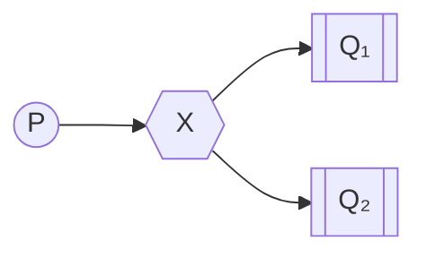
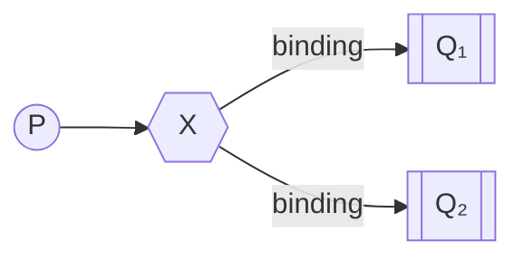
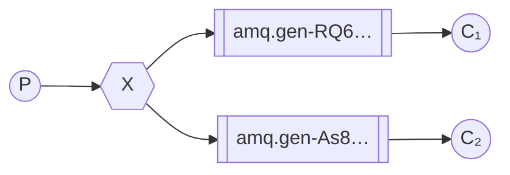

# Публикация и подписка

!!!info "Информация"

    **Предварительные условия**

    В этом руководстве предполагается, что RabbitMQ [установлен](https://www.rabbitmq.com/docs/download) и работает на localhost на [стандартном порту](https://www.rabbitmq.com/docs/networking#ports) (5672). Если вы используете другой хост, порт или учетные данные, настройки подключения потребуют корректировки.

    **Где получить помощь**

    Если у вас возникли проблемы при прохождении этого руководства, вы можете связаться с нами через [GitHub Discussions](https://github.com/rabbitmq/rabbitmq-server/discussions) или [RabbitMQ community Discord](https://www.rabbitmq.com/discord).

В [предыдущем уроке](./work-queues.md) мы создали рабочую очередь. Рабочая очередь основана на предположении, что каждая задача доставляется ровно одному воркеру. В этой части мы сделаем что-то совершенно другое — мы будем доставлять сообщение нескольким потребителям. Этот паттерн известен как «публикация и подписка».

Чтобы проиллюстрировать этот паттерн, мы создадим простую систему регистрации. Она будет состоять из двух программ — первая будет генерировать сообщения журнала, а вторая — принимать и печатать их.

В нашей системе регистрации каждая запущенная копия программы-приемника будет получать сообщения. Таким образом, мы сможем запустить один приемник и направлять журналы на диск, а одновременно с этим запустить другой приемник и просматривать журналы на экране.

По сути, опубликованные сообщения журнала будут транслироваться всем приемникам.

## Обменники

В предыдущих частях учебника мы отправляли и получали сообщения в очередь и из очереди. Теперь пришло время представить полную модель обмена сообщениями в Rabbit.

Давайте быстро пройдемся по тому, что мы рассмотрели в предыдущих учебниках:

-   _Производитель_ — это пользовательское приложение, которое отправляет сообщения.
-   _Очередь_ — это буфер, в котором хранятся сообщения.
-   _Потребитель_ — это пользовательское приложение, которое принимает сообщения.

Основная идея модели обмена сообщениями в RabbitMQ заключается в том, что производитель никогда не отправляет сообщения напрямую в очередь. На самом деле, довольно часто производитель даже не знает, будет ли сообщение доставлено в какую-либо очередь.

Вместо этого производитель может отправлять сообщения только в _обменник_. Обменник — это очень простая вещь. С одной стороны, он принимает сообщения от производителей, а с другой — отправляет их в очереди. Обменник должен точно знать, что делать с полученным сообщением. Должно ли оно быть добавлено в определенную очередь? Должно ли оно быть добавлено во многие очереди? Или же оно должно быть отброшено? Правила для этого определяются _типом обменника_.



Доступно несколько типов обмена: `direct`, `topic`, `headers` и `fanout`. Мы сосредоточимся на последнем — `fanout`. Давайте создадим обменник этого типа и назовем его `logs`:

```javascript
ch.assertExchange('logs', 'fanout', { durable: false });
```

Обменник `fanout` очень прост. Как можно догадаться из названия, он просто транслирует все полученные сообщения во все известные ему очереди. И это именно то, что нам нужно для нашего логгера.

!!!info "Список обменников"

    Чтобы отобразить список обменников на сервере, можно запустить полезную команду `rabbitmqctl`:

    ```bash
    sudo rabbitmqctl list_exchanges
    ```

    В этом списке будут некоторые обменники `amq.*` и обменник по умолчанию (без имени). Они создаются по умолчанию, но в данный момент вам вряд ли понадобится их использовать.

!!!info "Обменник по умолчанию"

    В предыдущих частях учебника мы ничего не знали об обменниках, но все равно могли отправлять сообщения в очереди. Это было возможно, потому что мы использовали обменник по умолчанию, который обозначается пустой строкой (`""`).

    Вспомните, как мы публиковали сообщение ранее:

    ```javascript
    channel.sendToQueue('hello', Buffer.from('Hello World!'));
    ```

    Здесь мы используем обменник по умолчанию или _без имени_: сообщения направляются в очередь с именем, указанным в качестве первого параметра, если она существует.

Теперь мы можем вместо этого публиковать в нашем именованном обменнике:

```javascript
channel.publish('logs', '', Buffer.from('Hello World!'));
```

Пустая строка в качестве второго параметра означает, что мы не хотим отправлять сообщение в какую-либо конкретную очередь. Мы хотим только опубликовать его в нашем обменнике «`logs`».

## Временные очереди

Как вы помните, ранее мы использовали очереди с конкретными именами (помните `hello` и `task_queue`?). Возможность называть очереди было для нас очень важно — нам нужно было направить рабочих к одной и той же очереди. Название очереди важно, когда вы хотите поделиться очередью между производителями и потребителями.

Но это не относится к нашему логгеру. Мы хотим получать все сообщения журнала, а не только их часть. Нас также интересуют только текущие сообщения, а не старые. Для решения этой задачи нам нужно две вещи.

Во-первых, при каждом подключении к Rabbit нам нужна новая пустая очередь. Для этого мы можем создать очередь с случайным именем или, что еще лучше, позволить серверу выбрать для нас случайное имя очереди.

Во-вторых, после отключения потребителя очередь должна быть автоматически удалена.

В клиенте [amqp.node](http://www.squaremobius.net/amqp.node/), когда мы указываем имя очереди в виде пустой строки, мы создаем недолговечную очередь с сгенерированным именем:

```javascript
channel.assertQueue('', {
    exclusive: true,
});
```

Когда метод возвращается, экземпляр очереди содержит случайное имя очереди, сгенерированное RabbitMQ. Например, оно может выглядеть как `amq.gen-JzTY20BRgKO-HjmUJj0wLg`.

Когда соединение, которое его объявило, закрывается, очередь будет удалена, поскольку она объявлена как эксклюзивная. Вы можете узнать больше о флаге `exclusive` и других свойствах очереди в [руководстве по очередям](https://www.rabbitmq.com/docs/queues).

## Привязки



Мы уже создали обменник `fanout` и очередь. Теперь нам нужно сказать обменнику, чтобы он отправлял сообщения в нашу очередь. Эта связь между обменником и очередью называется _привязкой_.

```javascript
channel.bindQueue(queue_name, 'logs', '');
```

Отныне обменник `logs` будет добавлять сообщения в нашу очередь.

!!!info "Список привязок"

    Вы можете посмотреть существующие привязки, используя команду:

    ```bash
    rabbitmqctl list_bindings
    ```

## Складывая все воедино



Программа-производитель, которая выдает сообщения журнала, не сильно отличается от предыдущей. Самое важное изменение заключается в том, что теперь мы хотим публиковать сообщения в нашем обменнике `logs`, а не в безымянном. При отправке нам нужно указать маршрутизационный ключ, но его значение игнорируется для обменников `fanout`. Вот код для скрипта `emit_log.js`:

```js
#!/usr/bin/env node

var amqp = require('amqplib/callback_api');

amqp.connect('amqp://localhost', function (
    error0,
    connection
) {
    if (error0) {
        throw error0;
    }
    connection.createChannel(function (error1, channel) {
        if (error1) {
            throw error1;
        }
        var exchange = 'logs';
        var msg =
            process.argv.slice(2).join(' ') ||
            'Hello World!';

        channel.assertExchange(exchange, 'fanout', {
            durable: false,
        });
        channel.publish(exchange, '', Buffer.from(msg));
        console.log(' [x] Sent %s', msg);
    });

    setTimeout(function () {
        connection.close();
        process.exit(0);
    }, 500);
});
```

[(emit_log.js source)](https://github.com/rabbitmq/rabbitmq-tutorials/blob/main/javascript-nodejs/src/emit_log.js)

Как видите, после установления соединения мы объявили обменник. Этот шаг необходим, так как публикация на несуществующем обменнике запрещена.

Сообщения будут потеряны, если к обменнику еще не привязана очередь, но для нас это не проблема; если еще нет потребителей, которые бы их прослушивали, мы можем безопасно удалить сообщение.

Код для `receive_logs.js`:

```javascript
#!/usr/bin/env node

var amqp = require('amqplib/callback_api');

amqp.connect('amqp://localhost', function (
    error0,
    connection
) {
    if (error0) {
        throw error0;
    }
    connection.createChannel(function (error1, channel) {
        if (error1) {
            throw error1;
        }
        var exchange = 'logs';

        channel.assertExchange(exchange, 'fanout', {
            durable: false,
        });

        channel.assertQueue(
            '',
            {
                exclusive: true,
            },
            function (error2, q) {
                if (error2) {
                    throw error2;
                }
                console.log(
                    ' [*] Waiting for messages in %s. To exit press CTRL+C',
                    q.queue
                );
                channel.bindQueue(q.queue, exchange, '');

                channel.consume(
                    q.queue,
                    function (msg) {
                        if (msg.content) {
                            console.log(
                                ' [x] %s',
                                msg.content.toString()
                            );
                        }
                    },
                    {
                        noAck: true,
                    }
                );
            }
        );
    });
});
```

[(receive_logs.js source)](https://github.com/rabbitmq/rabbitmq-tutorials/blob/main/javascript-nodejs/src/receive_logs.js)

Если вы хотите сохранить журналы в файл, просто откройте консоль и введите:

```bash
./receive_logs.js > logs_from_rabbit.log
```

Если вы хотите увидеть журналы на экране, запустите новый терминал и выполните:

```bash
./receive_logs.js
```

И, конечно же, для вывода журналов введите:

```bash
./emit_log.js
```

С помощью `rabbitmqctl list_bindings` вы можете убедиться, что код действительно создает привязки и очереди, как мы хотим. При запуске двух программ `receive_logs.js` вы должны увидеть примерно следующее:

```bash
sudo rabbitmqctl list_bindings
# => Listing bindings ...
# => logs    exchange     amq.gen-JzTY20BRgKO-HjmUJj0wLg  queue        []
# => logs    exchange     amq.gen-vso0PVvyiRIL2WoV3i48Yg  queue        []
# => ...done.
```

Интерпретация результата проста: данные из журналов обмена поступают в две очереди с именами, назначенными сервером. И это именно то, что мы и хотели.

Чтобы узнать, как прослушивать подмножество сообщений, перейдем к [уроку 4](./routing.md).

<small>:material-information-outline: Источник &mdash; <https://www.rabbitmq.com/tutorials/tutorial-three-javascript></small>
