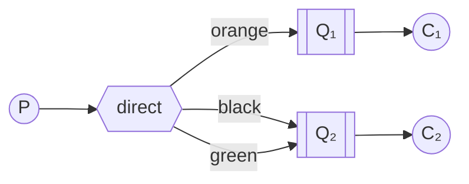
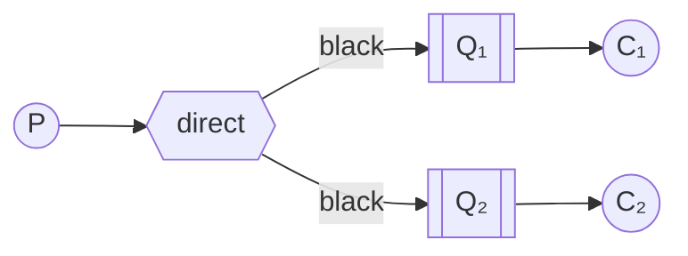
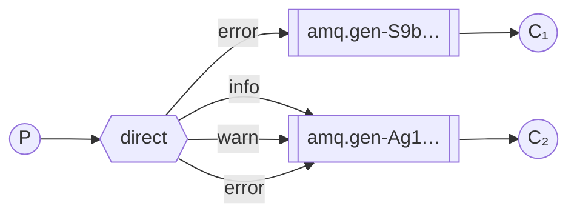

# Маршрутизация

!!!info "Информация"

    **Предварительные условия**

    В этом руководстве предполагается, что RabbitMQ [установлен](https://www.rabbitmq.com/docs/download) и работает на localhost на [стандартном порту](https://www.rabbitmq.com/docs/networking#ports) (5672). Если вы используете другой хост, порт или учетные данные, настройки подключения потребуют корректировки.

    **Где получить помощь**

    Если у вас возникли проблемы при прохождении этого руководства, вы можете связаться с нами через [GitHub Discussions](https://github.com/rabbitmq/rabbitmq-server/discussions) или [RabbitMQ community Discord](https://www.rabbitmq.com/discord).

В [предыдущем уроке](./publish-subscribe.md) мы создали простую систему регистрации событий. Мы смогли транслировать сообщения журнала многим получателям.

В этом уроке мы добавим к ней новую функцию — сделаем возможной подписку только на часть сообщений. Например, мы сможем направлять в файл журнала только сообщения о критических ошибках (чтобы сэкономить место на диске), при этом по-прежнему имея возможность выводить все сообщения журнала на консоль.

## Привязки

В предыдущих примерах мы уже создавали привязки. Вы, возможно, помните такой код:

```javascript
channel.bindQueue(q.queue, exchange, '');
```

Привязка — это связь между обменником и очередью. Проще говоря, это означает, что очередь заинтересована в сообщениях от этого обменника.

Привязки могут принимать дополнительный параметр ключа привязки (пустая строка в приведенном выше коде). Так мы можем создать привязку с ключом:

```javascript
channel.bindQueue(queue_name, exchange_name, 'black');
```

Значение связующего ключа зависит от типа обменника. Обменники `fanout`, которые мы использовали ранее, просто игнорировали его значение.

## Прямой обменник

Наша система регистрации из предыдущего урока транслирует все сообщения всем потребителям. Мы хотим расширить ее, чтобы можно было фильтровать сообщения по их серьезности. Например, мы можем захотеть, чтобы скрипт, который записывает сообщения журнала на диск, получал только критические ошибки и не тратил место на диске на предупреждения или информационные сообщения журнала.

Мы использовали обменник `fanout`, который не дает нам большой гибкости — он способен только на бездумную трансляцию.

Вместо этого мы будем использовать обменник `direct`. Алгоритм маршрутизации, лежащий в основе обменника `direct`, прост — сообщение поступает в очереди, чей `ключ привязки` точно соответствует `ключу маршрутизации` сообщения.

Чтобы проиллюстрировать это, рассмотрим следующую настройку:



В этой конфигурации мы видим обменник `X` с двумя привязанными к нему очередями. Первая очередь привязана с ключом привязки `orange`, а вторая имеет две привязки: одну с ключом привязки `black`, а другую с ключом `green`.

В такой конфигурации сообщение, опубликованное на обменнике с ключом маршрутизации `orange`, будет направлено в очередь `Q1`. Сообщения с ключом маршрутизации `black` или `green` будут направлены в `Q2`. Все остальные сообщения будут отброшены.

## Несколько привязок



Совершенно законно связывать несколько очередей с одним и тем же ключом привязки. В нашем примере мы могли бы добавить привязку между `X` и `Q1` с ключом привязки `black`. В этом случае обменник `direct` будет вести себя как `fanout` и будет транслировать сообщение во все соответствующие очереди. Сообщение с ключом маршрутизации `black` будет доставлено как в `Q1`, так и в `Q2`.

## Вывод журналов

Мы будем использовать эту модель для нашей системы ведения журналов. Вместо `fanout` мы будем отправлять сообщения в обменник `direct`. Мы будем предоставлять уровень серьезности журнала в качестве `ключа маршрутизации`. Таким образом, принимающий скрипт сможет выбрать уровень серьезности, который он хочет получить. Давайте сначала сосредоточимся на выводе журналов.

Как всегда, нам нужно сначала создать обменник:

```javascript
var exchange = 'direct_logs';

channel.assertExchange(exchange, 'direct', {
    durable: false,
});
```

И мы готовы отправить сообщение:

```javascript
var exchange = 'direct_logs';

channel.assertExchange(exchange, 'direct', {
    durable: false,
});
channel.publish(exchange, severity, Buffer.from(msg));
```

Для упрощения будем считать, что `severity` может принимать значения `info`, `warning` или `error`.

## Подписка

Получение сообщений будет работать так же, как и в предыдущем уроке, за одним исключением — мы создадим новую привязку для каждой интересующей нас степени серьезности.

```javascript
args.forEach(function (severity) {
    channel.bindQueue(q.queue, exchange, severity);
});
```

## Складывая все воедино



Код для скрипта `emit_log_direct.js`:

```javascript
#!/usr/bin/env node

var amqp = require('amqplib/callback_api');

amqp.connect('amqp://localhost', function (
    error0,
    connection
) {
    if (error0) {
        throw error0;
    }
    connection.createChannel(function (error1, channel) {
        if (error1) {
            throw error1;
        }
        var exchange = 'direct_logs';
        var args = process.argv.slice(2);
        var msg = args.slice(1).join(' ') || 'Hello World!';
        var severity = args.length > 0 ? args[0] : 'info';

        channel.assertExchange(exchange, 'direct', {
            durable: false,
        });
        channel.publish(
            exchange,
            severity,
            Buffer.from(msg)
        );
        console.log(" [x] Sent %s: '%s'", severity, msg);
    });

    setTimeout(function () {
        connection.close();
        process.exit(0);
    }, 500);
});
```

Код для `receive_logs_direct.js`:

```javascript
#!/usr/bin/env node

var amqp = require('amqplib/callback_api');

var args = process.argv.slice(2);

if (args.length == 0) {
    console.log(
        'Usage: receive_logs_direct.js [info] [warning] [error]'
    );
    process.exit(1);
}

amqp.connect('amqp://localhost', function (
    error0,
    connection
) {
    if (error0) {
        throw error0;
    }
    connection.createChannel(function (error1, channel) {
        if (error1) {
            throw error1;
        }
        var exchange = 'direct_logs';

        channel.assertExchange(exchange, 'direct', {
            durable: false,
        });

        channel.assertQueue(
            '',
            {
                exclusive: true,
            },
            function (error2, q) {
                if (error2) {
                    throw error2;
                }
                console.log(
                    ' [*] Waiting for logs. To exit press CTRL+C'
                );

                args.forEach(function (severity) {
                    channel.bindQueue(
                        q.queue,
                        exchange,
                        severity
                    );
                });

                channel.consume(
                    q.queue,
                    function (msg) {
                        console.log(
                            " [x] %s: '%s'",
                            msg.fields.routingKey,
                            msg.content.toString()
                        );
                    },
                    {
                        noAck: true,
                    }
                );
            }
        );
    });
});
```

Если вы хотите сохранять в файл только сообщения журнала с пометками `warning` и `error` (а не `info`), просто откройте консоль и введите:

```bash
./receive_logs_direct.js warning error > logs_from_rabbit.log
```

Если вы хотите увидеть все сообщения журнала на экране, откройте новый терминал и выполните следующее:

```bash
./receive_logs_direct.js info warning error
# => [*] Waiting for logs. To exit press CTRL+C
```

И, например, чтобы вывести сообщение журнала `error`, просто введите:

```bash
./emit_log_direct.js error "Run. Run. Or it will explode."
# => [x] Sent 'error':'Run. Run. Or it will explode.'
```

(Полный исходный код для [(emit_log_direct.js source)](https://github.com/rabbitmq/rabbitmq-tutorials/blob/main/javascript-nodejs/src/emit_log_direct.js) и [(receive_logs_direct.js source)](https://github.com/rabbitmq/rabbitmq-tutorials/blob/main/javascript-nodejs/src/receive_logs_direct.js))

Перейдите к [уроку 5](./topics.md), чтобы узнать, как прослушивать сообщения на основе шаблона.

<small>:material-information-outline: Источник &mdash; <https://www.rabbitmq.com/tutorials/tutorial-four-javascript></small>
