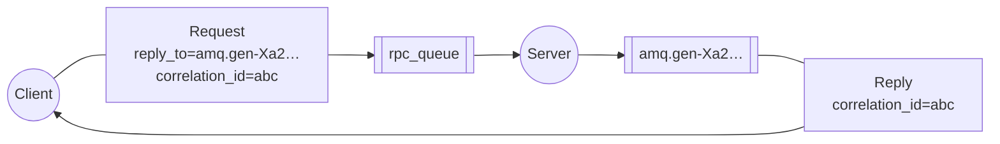

# Удаленный вызов процедур (RPC)

!!!info "Информация"

    **Предварительные условия**

    В этом руководстве предполагается, что RabbitMQ [установлен](https://www.rabbitmq.com/docs/download) и работает на localhost на [стандартном порту](https://www.rabbitmq.com/docs/networking#ports) (5672). Если вы используете другой хост, порт или учетные данные, настройки подключения потребуют корректировки.

    **Где получить помощь**

    Если у вас возникли проблемы при прохождении этого руководства, вы можете связаться с нами через [GitHub Discussions](https://github.com/rabbitmq/rabbitmq-server/discussions) или [RabbitMQ community Discord](https://www.rabbitmq.com/discord).

Во [втором уроке](./work-queues.md) мы узнали, как использовать _Work Queues_ для распределения трудоемких задач между несколькими работниками.

Но что, если нам нужно запустить функцию на удаленном компьютере и дождаться результата? Ну, это уже совсем другая история. Этот паттерн широко известен как _Remote Procedure Call_ или _RPC_.

В этом уроке мы будем использовать RabbitMQ для построения системы RPC: клиента и масштабируемого сервера RPC. Поскольку у нас нет трудоемких задач, которые стоило бы распределять, мы создадим фиктивный сервис RPC, который возвращает числа Фибоначчи.

!!!info "Примечание по поводу RPC"

    Хотя RPC является довольно распространенным паттерном в вычислениях, его часто критикуют. Проблемы возникают, когда программист не знает, является ли вызов функции локальным или это медленный RPC. Подобные путаницы приводят к непредсказуемости системы и добавляют ненужную сложность к отладке. Вместо упрощения программного обеспечения, неправильное использование RPC может привести к появлению неуправляемого спагетти-кода.

    Имея это в виду, примите во внимание следующие советы:

    -   Убедитесь, что очевидно, какой вызов функции является локальным, а какой — удаленным.
    -   Документируйте свою систему. Четко обозначьте зависимости между компонентами.
    -   Обрабатывайте ошибки. Как должен реагировать клиент, когда сервер RPC долго не работает?

    В случае сомнений избегайте RPC. Если возможно, используйте асинхронный конвейер — вместо блокировки, подобной RPC, результаты асинхронно передаются на следующий этап вычислений.

## Очередь обратных вызовов

В целом, выполнение RPC через RabbitMQ не представляет сложности. Клиент отправляет запрос, а сервер отвечает сообщением. Чтобы получить ответ, необходимо отправить адрес очереди обратных вызовов вместе с запросом. Давайте попробуем:

```javascript
channel.assertQueue('', {
  exclusive: true
});

channel.sendToQueue('rpc_queue', Buffer.from('10'), {
   replyTo: queue_name
});

# ... затем код для чтения ответного сообщения
# из очереди обратных вызовов ...
```

!!!info "Свойства сообщения"

    Протокол AMQP 0-9-1 предопределяет набор из 14 свойств, которые сопровождают сообщение. Большинство свойств используются редко, за исключением следующих:

    -   `persistent`: помечает сообщение как постоянное (со значением `true`) или временное (`false`). Вы можете помнить это свойство из [второго учебника](./work-queues.md) .
    -   `content_type`: используется для описания MIME-типа кодировки. Например, для часто используемой кодировки JSON рекомендуется установить для этого свойства значение: `application/json`.
    -   `reply_to`: обычно используется для именования очереди обратных вызовов.
    -   `correlation_id`: полезно для сопоставления ответов RPC с запросами.

### Идентификатор корреляции

Создание очереди обратных вызовов для каждого запроса RPC неэффективно. Лучше создать одну очередь обратных вызовов для каждого клиента.

Это поднимает новую проблему: после получения ответа в этой очереди неясно, к какому запросу он относится. Именно в этом случае используется свойство `correlation_id`. Мы установим для него уникальное значение для каждого запроса. Позже, когда мы получим сообщение в очереди обратных вызовов, мы посмотрим на это свойство и на его основе сможем сопоставить ответ с запросом. Если мы увидим неизвестное значение `correlation_id`, мы можем безопасно отбросить сообщение — оно не относится к нашим запросам.

Вы можете спросить, почему мы должны игнорировать неизвестные сообщения в очереди обратных вызовов, а не выдавать ошибку? Это связано с возможностью возникновения условия гонки на стороне сервера. Хотя это маловероятно, но возможно, что RPC-сервер завершит работу сразу после отправки нам ответа, но до отправки подтверждающего сообщения для запроса. Если это произойдет, перезапущенный RPC-сервер обработает запрос снова. Вот почему на клиенте мы должны корректно обрабатывать дубликаты ответов, а RPC в идеале должен быть идемпотентным.

### Резюме



Наш RPC будет работать следующим образом:

-   При запуске клиент создает эксклюзивную очередь обратных вызовов.
-   Для RPC-запроса клиент отправляет сообщение с двумя свойствами: `reply_to`, которое устанавливается в очередь обратных вызовов, и `correlation_id`, которое устанавливается в уникальное значение для каждого запроса.
-   Запрос отправляется в очередь `rpc_queue`.
-   Рабочий процесс RPC (он же сервер) ожидает запросов в этой очереди. Когда появляется запрос, он выполняет задачу и отправляет сообщение с результатом обратно клиенту, используя очередь из поля `reply_to`.
-   Клиент ожидает данных в очереди обратных вызовов. Когда появляется сообщение, он проверяет свойство `correlation_id`. Если оно совпадает со значением из запроса, он возвращает ответ приложению.

## Сводка

Функция Фибоначчи:

```javascript
function fibonacci(n) {
    if (n == 0 || n == 1) return n;
    else return fibonacci(n - 1) + fibonacci(n - 2);
}
```

Мы объявляем нашу функцию Фибоначчи. Она принимает только действительные положительные целые числа в качестве входных данных. (Не ожидайте, что она будет работать с большими числами, и, вероятно, это самая медленная рекурсивная реализация из возможных).

Код для нашего RPC-сервера [rpc_server.js](https://github.com/rabbitmq/rabbitmq-tutorials/blob/main/javascript-nodejs/src/rpc_server.js) выглядит следующим образом:

```js
#!/usr/bin/env node

var amqp = require('amqplib/callback_api');

amqp.connect('amqp://localhost', function (
    error0,
    connection
) {
    if (error0) {
        throw error0;
    }
    connection.createChannel(function (error1, channel) {
        if (error1) {
            throw error1;
        }
        var queue = 'rpc_queue';

        channel.assertQueue(queue, {
            durable: false,
        });
        channel.prefetch(1);
        console.log(' [x] Awaiting RPC requests');
        channel.consume(queue, function reply(msg) {
            var n = parseInt(msg.content.toString());

            console.log(' [.] fib(%d)', n);

            var r = fibonacci(n);

            channel.sendToQueue(
                msg.properties.replyTo,
                Buffer.from(r.toString()),
                {
                    correlationId:
                        msg.properties.correlationId,
                }
            );

            channel.ack(msg);
        });
    });
});

function fibonacci(n) {
    if (n == 0 || n == 1) return n;
    else return fibonacci(n - 1) + fibonacci(n - 2);
}
```

Код сервера довольно прост:

-   Как обычно, мы начинаем с установления соединения, канала и объявления очереди.
-   Возможно, мы захотим запустить более одного серверного процесса. Чтобы равномерно распределить нагрузку между несколькими серверами, нам нужно установить настройку `prefetch` на канале.
-   Мы используем `Channel.consume` для потребления сообщений из очереди. Затем мы входим в функцию обратного вызова, где выполняем работу и отправляем ответ обратно.

Код для нашего RPC-клиента [rpc_client.js](https://github.com/rabbitmq/rabbitmq-tutorials/blob/main/javascript-nodejs/src/rpc_client.js):

```javascript
#!/usr/bin/env node

var amqp = require('amqplib/callback_api');

var args = process.argv.slice(2);

if (args.length == 0) {
    console.log('Usage: rpc_client.js num');
    process.exit(1);
}

amqp.connect('amqp://localhost', function (
    error0,
    connection
) {
    if (error0) {
        throw error0;
    }
    connection.createChannel(function (error1, channel) {
        if (error1) {
            throw error1;
        }
        channel.assertQueue(
            '',
            {
                exclusive: true,
            },
            function (error2, q) {
                if (error2) {
                    throw error2;
                }
                var correlationId = generateUuid();
                var num = parseInt(args[0]);

                console.log(' [x] Requesting fib(%d)', num);

                channel.consume(
                    q.queue,
                    function (msg) {
                        if (
                            msg.properties.correlationId ==
                            correlationId
                        ) {
                            console.log(
                                ' [.] Got %s',
                                msg.content.toString()
                            );
                            setTimeout(function () {
                                connection.close();
                                process.exit(0);
                            }, 500);
                        }
                    },
                    {
                        noAck: true,
                    }
                );

                channel.sendToQueue(
                    'rpc_queue',
                    Buffer.from(num.toString()),
                    {
                        correlationId: correlationId,
                        replyTo: q.queue,
                    }
                );
            }
        );
    });
});

function generateUuid() {
    return (
        Math.random().toString() +
        Math.random().toString() +
        Math.random().toString()
    );
}
```

Сейчас самое время взглянуть на полный пример исходного кода для [rpc_client.js](https://github.com/rabbitmq/rabbitmq-tutorials/blob/main/javascript-nodejs/src/rpc_client.js) и [rpc_server.js](https://github.com/rabbitmq/rabbitmq-tutorials/blob/main/javascript-nodejs/src/rpc_server.js).

Наш RPC-сервис готов. Можно запускать сервер:

```bash
./rpc_server.js
# => [x] Awaiting RPC requests
```

Чтобы запросить число Фибоначчи, запустите клиент:

```bash
./rpc_client.js 30
# => [x] Requesting fib(30)
```

Представленный здесь дизайн не является единственной возможной реализацией службы RPC, но он имеет ряд важных преимуществ:

-   Если сервер RPC работает слишком медленно, вы можете увеличить его производительность, просто запустив еще один. Попробуйте запустить второй `rpc_server.js` в новой консоли.
-   На стороне клиента RPC требует отправки и получения только одного сообщения. В результате RPC-клиенту требуется только один сетевой цикл для одного RPC-запроса.

Наш код по-прежнему довольно прост и не пытается решать более сложные (но важные) проблемы, такие как:

-   Как должен реагировать клиент, если нет работающих серверов?
-   Должен ли клиент иметь какой-то тайм-аут для RPC?
-   Если сервер неисправен и выдает исключение, следует ли его пересылать клиенту?
-   Защита от недействительных входящих сообщений (например, проверка границ, типа) перед обработкой.

> Если вы хотите поэкспериментировать, вам может пригодиться [интерфейс управления](https://www.rabbitmq.com/docs/management) для просмотра очередей.

<small>:material-information-outline: Источник &mdash; <https://www.rabbitmq.com/tutorials/tutorial-six-javascript></small>
