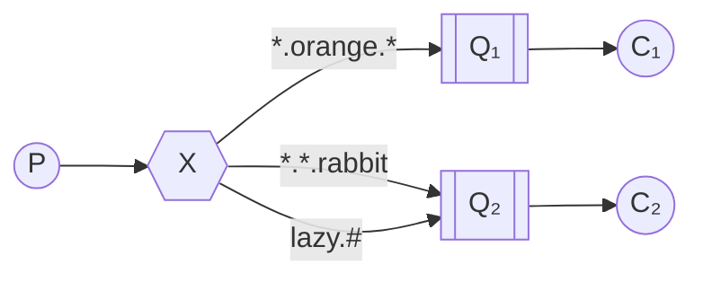

# Обменник topic

!!!info "Информация"

    **Предварительные условия**

    В этом руководстве предполагается, что RabbitMQ [установлен](https://www.rabbitmq.com/docs/download) и работает на localhost на [стандартном порту](https://www.rabbitmq.com/docs/networking#ports) (5672). Если вы используете другой хост, порт или учетные данные, настройки подключения потребуют корректировки.

    **Где получить помощь**

    Если у вас возникли проблемы при прохождении этого руководства, вы можете связаться с нами через [GitHub Discussions](https://github.com/rabbitmq/rabbitmq-server/discussions) или [RabbitMQ community Discord](https://www.rabbitmq.com/discord).

В [предыдущем уроке](./routing.md) мы улучшили нашу систему логирования. Вместо использования обменника `fanout`, способного только к фиктивной трансляции, мы использовали обменник `direct` и получили возможность выборочного получения логов.

Хотя использование обменника `direct` улучшило нашу систему, она все еще имеет ограничения — она не может выполнять маршрутизацию на основе нескольких критериев.

В нашей системе регистрации событий мы можем захотеть подписаться не только на журналы в зависимости от их серьезности, но и в зависимости от источника, который их выдал. Вы, возможно, знакомы с этой концепцией из утилиты Unix [`syslog`](https://ru.wikipedia.org/wiki/Syslog), которая маршрутизирует журналы в зависимости как от их серьезности (info/warn/crit...), так и от источника (auth/cron/kern...).

Это дает нам большую гибкость — мы можем хотеть получать только критические ошибки, поступающие из `cron`, но также и все логи из `kern`.

Чтобы реализовать это в нашей системе логирования, нам нужно узнать о более сложном обменнике `topic`.

Сообщения, отправляемые на обменник `topic`, не могут иметь произвольный `routing_key` — это должен быть список слов, разделенных точками. Слова могут быть любыми, но обычно они указывают на некоторые особенности, связанные с сообщением. Несколько примеров действительных ключей маршрутизации: `stock.usd.nyse`, `nyse.vmw`, `quick.orange.rabbit`. В маршрутизационном ключе может быть любое количество слов, но не более 255 байт.

Ключ привязки также должен быть в том же формате. Логика обменника `topic` аналогична логике обменника `direct` — сообщение, отправленное с определенным маршрутизационным ключом, будет доставлено во все очереди, привязанные к соответствующему ключу привязки. Однако есть два важных особых случая для ключей привязки:

-   `*` (звездочка) может заменить ровно одно слово.
-   `#` (решетка) может заменить ноль или более слов.

Проще всего объяснить это на примере:



В этом примере мы будем отправлять сообщения, которые все описывают животных. Сообщения будут отправляться с ключом маршрутизации, состоящим из трех слов (двух точек). Первое слово в ключе маршрутизации будет описывать скорость, второе — цвет, а третье — вид: `<speed>.<colour>.<species>`.

Мы создали три привязки: Q1 привязан с ключом привязки `*.orange.*`, а Q2 — с `*.*.rabbit` и `lazy.#`.

Эти привязки можно обобщить следующим образом:

-   Q1 интересуются всеми оранжевыми животными.
-   Q2 хочет слышать все о кроликах и все о ленивых животных.

Сообщение с ключом маршрутизации, установленным на `quick.orange.rabbit`, будет доставлено в обе очереди. Сообщение `lazy.orange.elephant` также пойдет в обе очереди. С другой стороны, `quick.orange.fox` пойдет только в первую очередь, а `lazy.brown.fox` — только во вторую. `lazy.pink.rabbit` будет доставлено во вторую очередь только один раз, даже если оно соответствует двум связям. `quick.brown.fox` не соответствует ни одной связи, поэтому оно будет отброшено.

Что произойдет, если мы нарушим наш договор и отправим сообщение с одним или четырьмя словами, например `orange` или `quick.orange.new.rabbit`? Эти сообщения не будут соответствовать ни одной привязке и будут потеряны.

С другой стороны, `lazy.orange.new.rabbit`, несмотря на то, что оно состоит из четырех слов, будет соответствовать последней привязке и будет доставлено во вторую очередь.

!!!info "Обменник topic"

    Обменник `topic` является мощным инструментом и может вести себя как другие обмены.

    Когда очередь привязана с помощью ключа привязки `#` (хэш), она будет получать все сообщения, независимо от ключа маршрутизации, как в обмене `fanout`.

    Когда специальные символы `*` (звездочка) и `#` (хэш) не используются в привязках, обмен темами будет вести себя так же, как `direct`.

Мы будем использовать обменник `topic` в нашей системе регистрации событий. Начнем с рабочей гипотезы, что маршрутизационные ключи журналов будут состоять из двух слов: `<facility>.<severity>`.

Код почти такой же, как в [предыдущем уроке](./routing.md).

```javascript title="emit_log_topic.js"
#!/usr/bin/env node

var amqp = require('amqplib/callback_api');

amqp.connect('amqp://localhost', function (
    error0,
    connection
) {
    if (error0) {
        throw error0;
    }
    connection.createChannel(function (error1, channel) {
        if (error1) {
            throw error1;
        }
        var exchange = 'topic_logs';
        var args = process.argv.slice(2);
        var key =
            args.length > 0 ? args[0] : 'anonymous.info';
        var msg = args.slice(1).join(' ') || 'Hello World!';

        channel.assertExchange(exchange, 'topic', {
            durable: false,
        });
        channel.publish(exchange, key, Buffer.from(msg));
        console.log(" [x] Sent %s:'%s'", key, msg);
    });

    setTimeout(function () {
        connection.close();
        process.exit(0);
    }, 500);
});
```

---

```javascript title="receive_logs_topic.js"
#!/usr/bin/env node

var amqp = require('amqplib/callback_api');

var args = process.argv.slice(2);

if (args.length == 0) {
    console.log(
        'Usage: receive_logs_topic.js <facility>.<severity>'
    );
    process.exit(1);
}

amqp.connect('amqp://localhost', function (
    error0,
    connection
) {
    if (error0) {
        throw error0;
    }
    connection.createChannel(function (error1, channel) {
        if (error1) {
            throw error1;
        }
        var exchange = 'topic_logs';

        channel.assertExchange(exchange, 'topic', {
            durable: false,
        });

        channel.assertQueue(
            '',
            {
                exclusive: true,
            },
            function (error2, q) {
                if (error2) {
                    throw error2;
                }
                console.log(
                    ' [*] Waiting for logs. To exit press CTRL+C'
                );

                args.forEach(function (key) {
                    channel.bindQueue(
                        q.queue,
                        exchange,
                        key
                    );
                });

                channel.consume(
                    q.queue,
                    function (msg) {
                        console.log(
                            " [x] %s:'%s'",
                            msg.fields.routingKey,
                            msg.content.toString()
                        );
                    },
                    {
                        noAck: true,
                    }
                );
            }
        );
    });
});
```

Чтобы получить все журналы:

```bash
./receive_logs_topic.js "#"
```

Чтобы получить все журналы с объекта `kern`:

```bash
./receive_logs_topic.js "kern.*"
```

Или, если вы хотите слышать только о `critical` журналах:

```bash
./receive_logs_topic.js "*.critical"
```

Вы можете создать несколько привязок:

```bash
./receive_logs_topic.js "kern.*" "*.critical"
```

И чтобы вывести журнал с ключом маршрутизации типа `kern.critical`, введите:

```bash
./emit_log_topic.js "kern.critical" "A critical kernel error"
```

Получайте удовольствие от работы с этими программами. Обратите внимание, что код не делает никаких предположений о маршрутизации или связывающих ключах, вы можете поэкспериментировать с более чем двумя параметрами маршрутизации.

(Полный исходный код для [emit_log_topic.js](https://github.com/rabbitmq/rabbitmq-tutorials/blob/main/javascript-nodejs/src/emit_log_topic.js) и [receive_logs_topic.js](https://github.com/rabbitmq/rabbitmq-tutorials/blob/main/javascript-nodejs/src/receive_logs_topic.js))

Далее узнайте, как выполнить обратную передачу сообщения в виде удаленного вызова процедуры в [уроке 6](./rpc.md)

<small>:material-information-outline: Источник &mdash; <https://www.rabbitmq.com/tutorials/tutorial-five-javascript></small>
