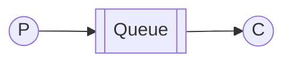
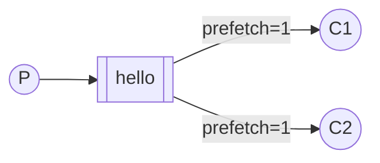

# Очереди задач

!!!info "Информация"

    **Предварительные условия**

    В этом руководстве предполагается, что RabbitMQ [установлен](https://www.rabbitmq.com/docs/download) и работает на localhost на [стандартном порту](https://www.rabbitmq.com/docs/networking#ports) (5672). Если вы используете другой хост, порт или учетные данные, настройки подключения потребуют корректировки.

    **Где получить помощь**

    Если у вас возникли проблемы при прохождении этого руководства, вы можете связаться с нами через [GitHub Discussions](https://github.com/rabbitmq/rabbitmq-server/discussions) или [RabbitMQ community Discord](https://www.rabbitmq.com/discord).



В [первом уроке](./hello-world.md) мы написали программы для отправки и получения сообщений из именованной очереди. В этом уроке мы создадим _очередь задач_, которая будет использоваться для распределения трудоемких задач между несколькими рабочими процессами.

Основная идея очередей задач заключается в том, чтобы избежать немедленного выполнения ресурсоемких задач и необходимости ждать их завершения. Вместо этого мы планируем выполнение задачи на более поздний срок. Мы инкапсулируем _задачу_ в виде сообщения и отправляем его в очередь. Рабочий процесс, запущенный в фоновом режиме, извлекает задачи и в конечном итоге выполняет работу. При запуске нескольких рабочих процессов задачи будут распределены между ними.

Эта концепция особенно полезна в веб-приложениях, где невозможно обработать сложную задачу в течение короткого окна HTTP-запроса.

## Подготовка

В предыдущей части этого урока мы отправили сообщение, содержащее «Hello World!». Теперь мы будем отправлять строки, которые обозначают сложные задачи. У нас нет реальных задач, таких как изменение размера изображений или рендеринг PDF-файлов, поэтому давайте имитируем их, просто притворившись, что мы заняты, с помощью метода `setTimeout`. Мы будем считать количество точек в строке ее сложностью; каждая точка будет означать одну секунду «работы». Например, поддельная задача, описанная как «Hello...», займет три секунды.

Мы немного изменим код `send.js` из нашего предыдущего примера, чтобы можно было отправлять произвольные сообщения из командной строки. Эта программа будет планировать задачи в нашу рабочую очередь, поэтому назовем ее `new_task.js`:

```javascript
var queue = 'task_queue';
var msg = process.argv.slice(2).join(' ') || 'Hello World!';

channel.assertQueue(queue, {
    durable: true,
});
channel.sendToQueue(queue, Buffer.from(msg), {
    persistent: true,
});
console.log(" [x] Sent '%s'", msg);
```

Наш старый скрипт `receive.js` также требует некоторых изменений: он должен имитировать секунду работы для каждой точки в теле сообщения. Он будет извлекать сообщения из очереди и выполнять задачу, поэтому назовем его `worker.js`:

```javascript
var queue = 'task_queue';

// This makes sure the queue is declared before attempting to consume from it
channel.assertQueue(queue, {
    durable: true,
});

channel.consume(
    queue,
    function (msg) {
        var secs =
            msg.content.toString().split('.').length - 1;

        console.log(
            ' [x] Received %s',
            msg.content.toString()
        );
        setTimeout(function () {
            console.log(' [x] Done');
        }, secs * 1000);
    },
    {
        // automatic acknowledgment mode,
        // see /docs/confirms for details
        noAck: true,
    }
);
```

Обратите внимание, что наша фиктивная задача имитирует время выполнения.

Запустите их, как в первом уроке:

```bash
# shell 1
./worker.js
```

---

```bash
# shell 2
./new_task.js
```

## Распределение по кругу

Одним из преимуществ использования очереди задач является возможность легко параллелизировать работу. Если у нас накапливается задержка в работе, мы можем просто добавить больше рабочих и таким образом легко масштабироваться.

Сначала давайте попробуем запустить два скрипта `worker.js` одновременно. Оба они будут получать сообщения из очереди, но как именно? Давайте посмотрим.

Вам нужно открыть три консоли. Две из них будут запускать скрипт `worker.js`. Эти консоли будут нашими двумя потребителями — C1 и C2.

```bash
# shell 1
./worker.js
# => [*] Waiting for messages. To exit press CTRL+C
```

---

```bash
# shell 2
./worker.js
# => [*] Waiting for messages. To exit press CTRL+C
```

В третьем мы опубликуем новые задачи. После запуска потребителей вы можете опубликовать несколько сообщений:

```bash
# shell 3
./new_task.js First message.
./new_task.js Second message..
./new_task.js Third message...
./new_task.js Fourth message....
./new_task.js Fifth message.....
```

Давайте посмотрим, что доставляется нашим работникам:

```bash
# shell 1
./worker.js
# => [*] Waiting for messages. To exit press CTRL+C
# => [x] Received 'First message.'
# => [x] Received 'Third message...'
# => [x] Received 'Fifth message.....'
```

---

```bash
# shell 2
./worker.js
# => [*] Waiting for messages. To exit press CTRL+C
# => [x] Received 'Second message..'
# => [x] Received 'Fourth message....'
```

По умолчанию RabbitMQ отправляет каждое сообщение следующему потребителю по порядку. В среднем каждый потребитель получает одинаковое количество сообщений. Такой способ распределения сообщений называется `round-robin`. Попробуйте это с тремя или более рабочими процессами.

## Подтверждение получения сообщения

Выполнение задачи может занять несколько секунд, и вы можете задаться вопросом, что произойдет, если потребитель запустит длительную задачу, а она завершится до ее завершения. В нашем текущем коде, как только RabbitMQ доставляет сообщение потребителю, он сразу же помечает его для удаления. В этом случае, если вы завершите работу воркера, вы потеряете сообщение, которое он только что обрабатывал. Сообщения, которые были отправлены этому конкретному воркеру, но еще не были обработаны, также будут потеряны.

Но мы не хотим терять никаких задач. Если воркер завершается, мы хотим, чтобы задача была доставлена другому воркеру.

Чтобы гарантировать, что сообщение никогда не будет потеряно, RabbitMQ поддерживает [подтверждения сообщений](https://www.rabbitmq.com/docs/confirms). Подтверждение (acknowledgement) отправляется потребителем, чтобы сообщить RabbitMQ, что конкретное сообщение было получено, обработано и RabbitMQ может его удалить.

Если потребитель завершается (его канал закрыт, соединение закрыто или TCP-соединение потеряно) без отправки подтверждения, RabbitMQ поймет, что сообщение не было полностью обработано, и повторно поместит его в очередь. Если в это же время в сети есть другие потребители, он быстро доставит его другому потребителю. Таким образом, вы можете быть уверены, что ни одно сообщение не будет потеряно, даже если воркеры иногда завершаются.

На подтверждение доставки потребителем налагается таймаут (по умолчанию 30 минут). Это помогает обнаружить ошибочных (зависших) потребителей, которые никогда не подтверждают доставку. Вы можете увеличить этот таймаут, как описано в [Таймаут подтверждения доставки](https://www.rabbitmq.com/docs/consumers#acknowledgement-timeout).

В предыдущих примерах ручные подтверждения потребителей были отключены. Пришло время включить их с помощью опции `{noAck: false}` и отправить соответствующее подтверждение от рабочего процесса, как только мы завершим задачу.

```javascript
channel.consume(
    queue,
    function (msg) {
        var secs =
            msg.content.toString().split('.').length - 1;

        console.log(
            ' [x] Received %s',
            msg.content.toString()
        );
        setTimeout(function () {
            console.log(' [x] Done');
            channel.ack(msg);
        }, secs * 1000);
    },
    {
        // manual acknowledgment mode,
        // see /docs/confirms for details
        noAck: false,
    }
);
```

Используя этот код, вы можете гарантировать, что даже если вы завершите рабочий процесс с помощью ++ctrl+c++ во время обработки сообщения, ничего не будет потеряно. Вскоре после завершения рабочего процесса все неподтвержденные сообщения будут повторно доставлены.

Подтверждение должно быть отправлено по тому же каналу, по которому была получена доставка. Попытки подтверждения с использованием другого канала приведут к исключению протокола на уровне канала. Для получения дополнительной информации см. [руководство по подтверждениям](https://www.rabbitmq.com/docs/confirms).

!!!note "Забытые подтверждения"

    Частая ошибка — пропустить `ack`. Это простая ошибка, но последствия ее серьезны. Сообщения будут повторно доставлены, когда ваш клиент завершит работу (что может выглядеть как случайная повторная доставка), но RabbitMQ будет потреблять все больше и больше памяти, поскольку не сможет освободить не подтвержденные сообщения.

    Чтобы отладить такую ошибку, можно использовать `rabbitmqctl` для вывода поля `messages_unacknowledged`:

    ```bash
    sudo rabbitmqctl list_queues name messages_ready messages_unacknowledged
    ```

    Для Windows пропустите `sudo`:

    ```PowerShell
    rabbitmqctl.bat list_queues name messages_ready messages_unacknowledged
    ```

## Долговечность сообщений

Мы узнали, как обеспечить, чтобы даже в случае сбоя потребителя задача не была потеряна. Но наши задачи все равно будут потеряны, если сервер RabbitMQ перестанет работать.

Когда RabbitMQ завершает работу или выходит из строя, он забудет очереди и сообщения, если вы не укажете ему не делать этого. Чтобы сообщения не были потеряны, необходимо сделать две вещи: мы должны пометить очередь и сообщения как долговечные.

Во-первых, мы должны убедиться, что очередь переживет перезапуск узла RabbitMQ. Для этого нам нужно объявить ее как `durable`:

```javascript
channel.assertQueue('hello', { durable: true });
```

Хотя эта команда сама по себе правильная, она не будет работать в нашей текущей конфигурации. Это потому, что мы уже определили очередь с именем `hello`, которая не является постоянной. RabbitMQ не позволяет переопределять существующую очередь с другими параметрами и вернет ошибку любой программе, которая попытается это сделать. Но есть быстрый обходной путь — давайте объявим очередь с другим именем, например `task_queue`:

```javascript
channel.assertQueue('task_queue', { durable: true });
```

Это изменение опции `durable` необходимо применить как к коду производителя, так и к коду потребителя.

На данный момент мы уверены, что очередь `task_queue` не будет потеряна даже в случае перезапуска RabbitMQ. Теперь нам нужно пометить наши сообщения как постоянные с помощью опции `persistent`, которую принимает `Channel.sendToQueue`.

```javascript
channel.sendToQueue(queue, Buffer.from(msg), {
    persistent: true,
});
```

!!!info "Примечание по поводу сохранности сообщений"

    Пометка сообщений как постоянных не гарантирует полную сохранность сообщения. Хотя это указывает RabbitMQ сохранить сообщение на диске, все же существует короткий промежуток времени, когда RabbitMQ принял сообщение, но еще не сохранил его. Кроме того, RabbitMQ не выполняет `fsync(2)` для каждого сообщения — оно может быть просто сохранено в кэше, а не записано на диск. Гарантии постоянства не являются надежными, но их вполне достаточно для нашей простой очереди задач. Если вам нужны более надежные гарантии, вы можете использовать [подтверждение издателя](https://www.rabbitmq.com/docs/confirms).

## Равномерная отправка

Вы, возможно, заметили, что отправка все еще не работает так, как нам хотелось бы. Например, в ситуации с двумя воркерами, когда все нечетные сообщения являются тяжелыми, а четные — легкими, один воркер будет постоянно занят, а другой почти не будет выполнять никакой работы. RabbitMQ об этом не знает и будет по-прежнему распределять сообщения равномерно.

Это происходит потому, что RabbitMQ просто распределяет сообщение, когда оно поступает в очередь. Он не смотрит на количество неподтвержденных сообщений для потребителя. Он просто слепо распределяет каждое n-е сообщение n-му потребителю.



Чтобы решить эту проблему, мы можем использовать метод `prefetch` со значением `1`. Это указывает RabbitMQ не передавать рабочему процессу более одного сообщения за раз. Или, другими словами, не отправлять рабочему процессу новое сообщение, пока он не обработал и не подтвердил предыдущее. Вместо этого оно будет отправлено следующему рабочему процессу, который еще не занят.

```javascript
channel.prefetch(1);
```

!!!info "Примечание о размере очереди"

    Если все воркеры заняты, ваша очередь может заполниться. Вам нужно следить за этим и, возможно, добавить больше воркеров или применить какую-то другую стратегию.

## Сводка

Окончательный код нашего класса `new_task.js`:

```sh
#!/usr/bin/env node

var amqp = require('amqplib/callback_api');

amqp.connect('amqp://localhost', function (
    error0,
    connection
) {
    if (error0) {
        throw error0;
    }
    connection.createChannel(function (error1, channel) {
        if (error1) {
            throw error1;
        }
        var queue = 'task_queue';
        var msg =
            process.argv.slice(2).join(' ') ||
            'Hello World!';

        channel.assertQueue(queue, {
            durable: true,
        });
        channel.sendToQueue(queue, Buffer.from(msg), {
            persistent: true,
        });
        console.log(" [x] Sent '%s'", msg);
    });
    setTimeout(function () {
        connection.close();
        process.exit(0);
    }, 500);
});
```

[new_task.js](https://github.com/rabbitmq/rabbitmq-tutorials/blob/main/javascript-nodejs/src/new_task.js)

И наш `worker.js`:

```sh
#!/usr/bin/env node

var amqp = require('amqplib/callback_api');

amqp.connect('amqp://localhost', function (
    error0,
    connection
) {
    if (error0) {
        throw error0;
    }
    connection.createChannel(function (error1, channel) {
        if (error1) {
            throw error1;
        }
        var queue = 'task_queue';

        channel.assertQueue(queue, {
            durable: true,
        });
        channel.prefetch(1);
        console.log(
            ' [*] Waiting for messages in %s. To exit press CTRL+C',
            queue
        );
        channel.consume(
            queue,
            function (msg) {
                var secs =
                    msg.content.toString().split('.')
                        .length - 1;

                console.log(
                    ' [x] Received %s',
                    msg.content.toString()
                );
                setTimeout(function () {
                    console.log(' [x] Done');
                    channel.ack(msg);
                }, secs * 1000);
            },
            {
                // manual acknowledgment mode,
                // see /docs/confirms for details
                noAck: false,
            }
        );
    });
});
```

[worker.js](https://github.com/rabbitmq/rabbitmq-tutorials/blob/main/javascript-nodejs/src/worker.js)

Используя подтверждения сообщений и `prefetch`, вы можете настроить рабочую очередь. Параметры долговечности позволяют задачам сохраняться даже в случае перезапуска RabbitMQ.

Для получения дополнительной информации о методах `Channel` и свойствах сообщений вы можете просмотреть [документацию amqplib](http://www.squaremobius.net/amqp.node/channel_api.html).

Теперь мы можем перейти к [уроку 3](./publish-subscribe.md) и узнать, как доставить одно и то же сообщение многим потребителям.

<small>:material-information-outline: Источник &mdash; <https://www.rabbitmq.com/tutorials/tutorial-two-javascript></small>
