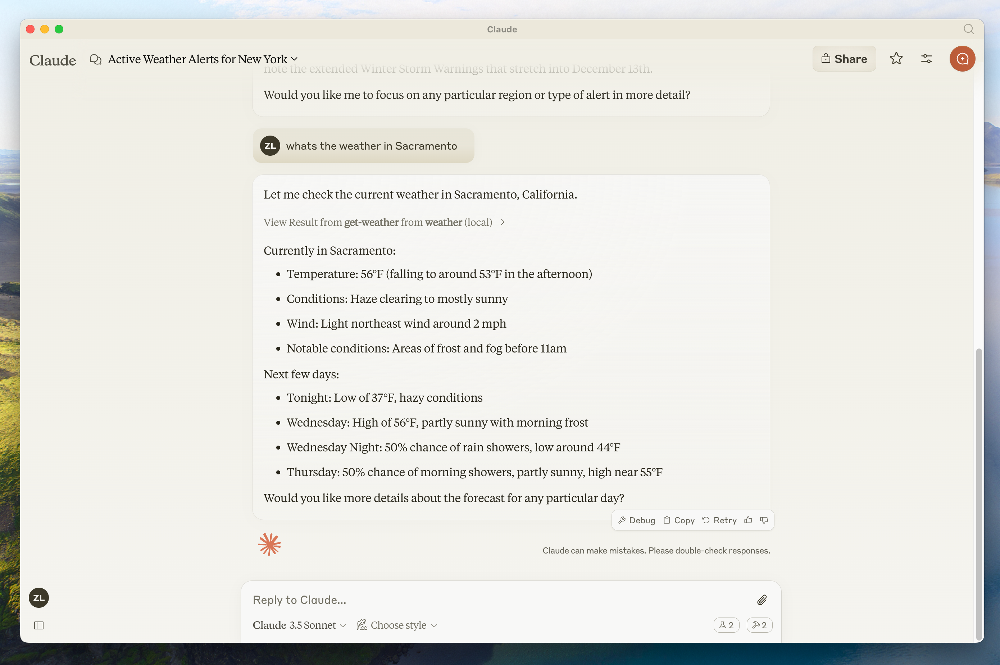
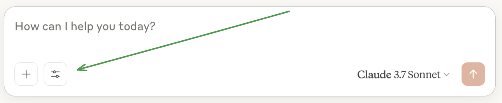
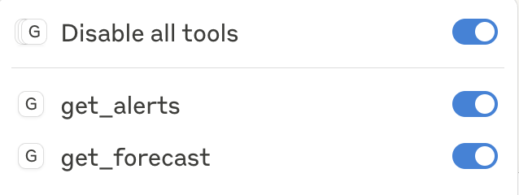
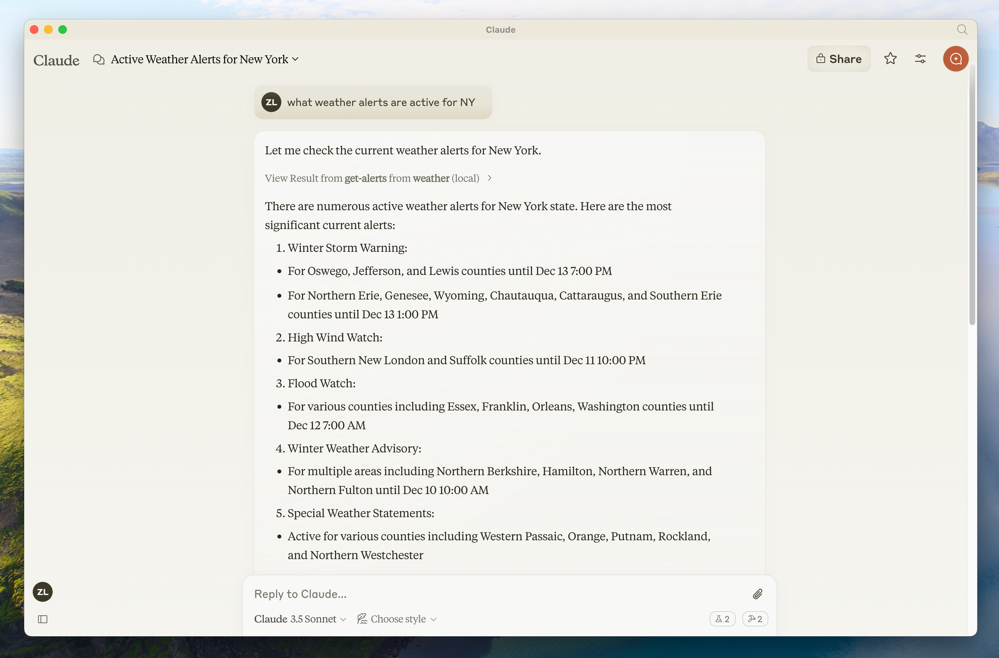

# Создание MCP‑сервера

<big>
Начните создавать собственный сервер для использования в Claude for Desktop и других клиентах.
</big>

В этом руководстве мы создадим простой погодный MCP‑сервер и подключим его к хосту — Claude for Desktop.

## Что мы будем делать

Мы создадим сервер, который предоставляет два инструмента: `get_alerts` и `get_forecast`. Затем подключим сервер к MCP‑хосту (в нашем случае — Claude for Desktop):



!!!info ""

    Серверы могут подключаться к любому клиенту. Для простоты мы выбрали Claude for Desktop, но у нас также есть гайды по [созданию собственного клиента](https://modelcontextprotocol.io/docs/develop/build-client), а также [список других клиентов](https://modelcontextprotocol.io/clients).

## Базовые концепции MCP

Серверы MCP могут предоставлять три основных типа возможностей:

1.  [Resources](https://modelcontextprotocol.io/docs/learn/server-concepts#resources): данные, похожие на файлы, которые клиент может читать (например, ответы API или содержимое файлов)
2.  [Tools](https://modelcontextprotocol.io/docs/learn/server-concepts#tools): функции, которые LLM может вызывать (с одобрения пользователя)
3.  [Prompts](https://modelcontextprotocol.io/docs/learn/server-concepts#prompts): заготовленные шаблоны, помогающие пользователям решать конкретные задачи

В этом туториале мы сосредоточимся на инструментах.

### Что нужно знать заранее

Этот гайд предполагает, что вы знакомы с:

-   TypeScript
-   LLM, такими как Claude

### Логирование в MCP‑серверах

При реализации MCP‑серверов важно аккуратно обращаться с логированием:

**Для серверов на STDIO**: Никогда не пишите в стандартный вывод (stdout). Это включает:

-   `print()` в Python
-   `console.log()` в JavaScript
-   `fmt.Println()` в Go
-   Аналогичные функции stdout в других языках

Запись в stdout повредит сообщения JSON‑RPC и сломает ваш сервер.

**Для серверов на HTTP**: Логирование в стандартный вывод допустимо, так как оно не мешает HTTP‑ответам.

### Рекомендации

1.  Используйте библиотеку логирования, пишущую в `stderr` или файлы, например `logging` в Python.
2.  В JavaScript будьте особенно внимательны — `console.log()` по умолчанию пишет в `stdout`.

### Короткие примеры

```js
// ❌ Плохо (STDIO)
console.log('Server started');

// ✅ Хорошо (STDIO)
console.error('Server started'); // писать в stderr безопасно
```

### Системные требования

Для TypeScript убедитесь, что у вас установлена актуальная версия Node.

### Настройка окружения

Сначала установите Node.js и npm, если они ещё не установлены. Их можно скачать с сайта [nodejs.org](https://nodejs.org/). Проверьте установку Node.js:

```sh
node --version
npm --version
```

Для этого руководства потребуется Node.js версии 16 или выше.

Теперь создадим и настроим проект:

```sh
# Инициализируем новый npm‑проект
npm init -y

# Устанавливаем зависимости
npm install @modelcontextprotocol/sdk zod
npm install -D @types/node typescript
```

Обновите `package.json`, добавив type: "module" и скрипт сборки:

```json title="package.json"
{
    "type": "module",
    "bin": {
        "weather": "./build/index.js"
    },
    "scripts": {
        "build": "tsc && chmod 755 build/index.js"
    },
    "files": ["build"]
}
```

Создайте `tsconfig.json` в корне проекта:

```json title="tsconfig.json"
{
    "compilerOptions": {
        "target": "ES2022",
        "module": "Node16",
        "moduleResolution": "Node16",
        "outDir": "./build",
        "rootDir": "./src",
        "strict": true,
        "esModuleInterop": true,
        "skipLibCheck": true,
        "forceConsistentCasingInFileNames": true
    },
    "include": ["src/**/*"],
    "exclude": ["node_modules"]
}
```

Теперь перейдём к созданию сервера.

## Создание сервера

### Импорт пакетов и инициализация экземпляра

Добавьте это в начало файла `src/index.ts`:

```ts title="src/index.ts"
import { McpServer } from '@modelcontextprotocol/sdk/server/mcp.js';
import { StdioServerTransport } from '@modelcontextprotocol/sdk/server/stdio.js';
import { z } from 'zod';

const NWS_API_BASE = 'https://api.weather.gov';
const USER_AGENT = 'weather-app/1.0';

// Создаём экземпляр сервера
const server = new McpServer({
    name: 'weather',
    version: '1.0.0',
    capabilities: {
        resources: {},
        tools: {},
    },
});
```

### Вспомогательные функции

Далее добавим вспомогательные функции для запросов и форматирования данных из API Национальной метеослужбы США (NWS):

```ts
// Вспомогательная функция для запросов к NWS API
async function makeNWSRequest<T>(
    url: string
): Promise<T | null> {
    const headers = {
        'User-Agent': USER_AGENT,
        Accept: 'application/geo+json',
    };

    try {
        const response = await fetch(url, { headers });
        if (!response.ok) {
            throw new Error(
                `HTTP error! status: ${response.status}`
            );
        }
        return (await response.json()) as T;
    } catch (error) {
        console.error('Error making NWS request:', error);
        return null;
    }
}

interface AlertFeature {
    properties: {
        event?: string;
        areaDesc?: string;
        severity?: string;
        status?: string;
        headline?: string;
    };
}

// Форматирование данных предупреждения
function formatAlert(feature: AlertFeature): string {
    const props = feature.properties;
    return [
        `Event: ${props.event || 'Unknown'}`,
        `Area: ${props.areaDesc || 'Unknown'}`,
        `Severity: ${props.severity || 'Unknown'}`,
        `Status: ${props.status || 'Unknown'}`,
        `Headline: ${props.headline || 'No headline'}`,
        '---',
    ].join('\n');
}

interface ForecastPeriod {
    name?: string;
    temperature?: number;
    temperatureUnit?: string;
    windSpeed?: string;
    windDirection?: string;
    shortForecast?: string;
}

interface AlertsResponse {
    features: AlertFeature[];
}

interface PointsResponse {
    properties: {
        forecast?: string;
    };
}

interface ForecastResponse {
    properties: {
        periods: ForecastPeriod[];
    };
}
```

### Реализация выполнения инструментов

Обработчик выполнения инструмента отвечает за непосредственную логику каждого инструмента. Добавим его:

```ts
// Регистрируем погодные инструменты
server.tool(
    'get_alerts',
    'Get weather alerts for a state',
    {
        state: z
            .string()
            .length(2)
            .describe(
                'Two-letter state code (e.g. CA, NY)'
            ),
    },
    async ({ state }) => {
        const stateCode = state.toUpperCase();
        const alertsUrl = `${NWS_API_BASE}/alerts?area=${stateCode}`;
        const alertsData = await makeNWSRequest<
            AlertsResponse
        >(alertsUrl);

        if (!alertsData) {
            return {
                content: [
                    {
                        type: 'text',
                        text:
                            'Failed to retrieve alerts data',
                    },
                ],
            };
        }

        const features = alertsData.features || [];
        if (features.length === 0) {
            return {
                content: [
                    {
                        type: 'text',
                        text: `No active alerts for ${stateCode}`,
                    },
                ],
            };
        }

        const formattedAlerts = features.map(formatAlert);
        const alertsText = `Active alerts for ${stateCode}:\n\n${formattedAlerts.join(
            '\n'
        )}`;

        return {
            content: [
                {
                    type: 'text',
                    text: alertsText,
                },
            ],
        };
    }
);

server.tool(
    'get_forecast',
    'Get weather forecast for a location',
    {
        latitude: z
            .number()
            .min(-90)
            .max(90)
            .describe('Latitude of the location'),
        longitude: z
            .number()
            .min(-180)
            .max(180)
            .describe('Longitude of the location'),
    },
    async ({ latitude, longitude }) => {
        // Получаем данные по координатам точки
        const pointsUrl = `${NWS_API_BASE}/points/${latitude.toFixed(
            4
        )},${longitude.toFixed(4)}`;
        const pointsData = await makeNWSRequest<
            PointsResponse
        >(pointsUrl);

        if (!pointsData) {
            return {
                content: [
                    {
                        type: 'text',
                        text: `Failed to retrieve grid point data for coordinates: ${latitude}, ${longitude}. This location may not be supported by the NWS API (only US locations are supported).`,
                    },
                ],
            };
        }

        const forecastUrl = pointsData.properties?.forecast;
        if (!forecastUrl) {
            return {
                content: [
                    {
                        type: 'text',
                        text:
                            'Failed to get forecast URL from grid point data',
                    },
                ],
            };
        }

        // Получаем данные прогноза
        const forecastData = await makeNWSRequest<
            ForecastResponse
        >(forecastUrl);
        if (!forecastData) {
            return {
                content: [
                    {
                        type: 'text',
                        text:
                            'Failed to retrieve forecast data',
                    },
                ],
            };
        }

        const periods =
            forecastData.properties?.periods || [];
        if (periods.length === 0) {
            return {
                content: [
                    {
                        type: 'text',
                        text:
                            'No forecast periods available',
                    },
                ],
            };
        }

        // Форматируем периоды прогноза
        const formattedForecast = periods.map(
            (period: ForecastPeriod) =>
                [
                    `${period.name || 'Unknown'}:`,
                    `Temperature: ${
                        period.temperature || 'Unknown'
                    }°${period.temperatureUnit || 'F'}`,
                    `Wind: ${
                        period.windSpeed || 'Unknown'
                    } ${period.windDirection || ''}`,
                    `${
                        period.shortForecast ||
                        'No forecast available'
                    }`,
                    '---',
                ].join('\n')
        );

        const forecastText = `Forecast for ${latitude}, ${longitude}:\n\n${formattedForecast.join(
            '\n'
        )}`;

        return {
            content: [
                {
                    type: 'text',
                    text: forecastText,
                },
            ],
        };
    }
);
```

### Запуск сервера

Наконец, реализуем функцию `main` для запуска сервера:

```ts
async function main() {
    const transport = new StdioServerTransport();
    await server.connect(transport);
    console.error('Weather MCP Server running on stdio');
}

main().catch((error) => {
    console.error('Fatal error in main():', error);
    process.exit(1);
});
```

Не забудьте выполнить `npm run build`, чтобы собрать сервер! Это критически важный шаг для успешного подключения сервера.

Теперь протестируем сервер из существующего MCP‑хоста — Claude for Desktop.

## Тестирование сервера в Claude for Desktop

!!!info ""

    Приложение Claude for Desktop пока недоступно в Linux. Пользователи Linux могут перейти к туториалу [Building a client](https://modelcontextprotocol.io/docs/develop/build-client) и создать MCP‑клиент, подключающийся к только что созданному серверу.

Сначала убедитесь, что у вас установлен Claude for Desktop. [Скачать последнюю версию можно здесь](https://claude.ai/download). Если он уже установлен, **убедитесь, что приложение обновлено до последней версии**.

Нам нужно сконфигурировать Claude for Desktop для MCP‑серверов, которые вы хотите использовать. Для этого откройте конфигурацию приложения по пути `~/Library/Application Support/Claude/claude_desktop_config.json` в текстовом редакторе. Если файла нет — создайте его.

Например, если у вас установлен [VS Code](https://code.visualstudio.com/):

```sh
code $env:AppData\Claude\claude_desktop_config.json
```

Затем добавьте ваши серверы в ключ `mcpServers`. Элементы UI для MCP появятся в Claude for Desktop только если настроен хотя бы один сервер.

В нашем случае добавим единственный сервер погоды следующим образом:

```json
{
    "mcpServers": {
        "weather": {
            "command": "node",
            "args": [
                "C:\\PATH\\TO\\PARENT\\FOLDER\\weather\\build\\index.js"
            ]
        }
    }
}
```

Это сообщает Claude for Desktop:

1.  Есть MCP‑сервер с именем «weather»
2.  Запускать его командой `node /ABSOLUTE/PATH/TO/PARENT/FOLDER/weather/build/index.js`

Сохраните файл и перезапустите **Claude for Desktop**.

### Тест с командами

Проверим, что Claude for Desktop «видит» два инструмента, которые предоставляет наш сервер `weather`. Для этого найдите иконку «Поиск и инструменты» :fontawesome-solid-sliders-h::



После нажатия на иконку ползунков вы должны увидеть два инструмента:



Если иконка настроек инструментов появилась, можно протестировать сервер, выполняя в Claude for Desktop команды:

-   What’s the weather in Sacramento?
-   What are the active weather alerts in Texas?




!!!info ""

    Поскольку используется Национальная метеослужба США, запросы будут работать только для локаций в США.

## Что происходит «под капотом»

Когда вы задаёте вопрос:

1.  Клиент отправляет ваш вопрос Claude
2.  Claude анализирует доступные инструменты и решает, какие использовать
3.  Клиент выполняет выбранные инструменты через MCP‑сервер
4.  Результаты отправляются обратно Claude
5.  Claude формирует ответ на естественном языке
6.  Ответ показывается вам

<small>:material-information-outline: Источник — <https://modelcontextprotocol.io/docs/develop/build-server></small>
