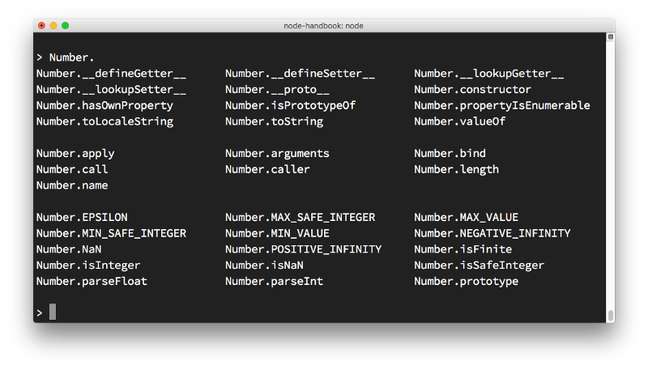
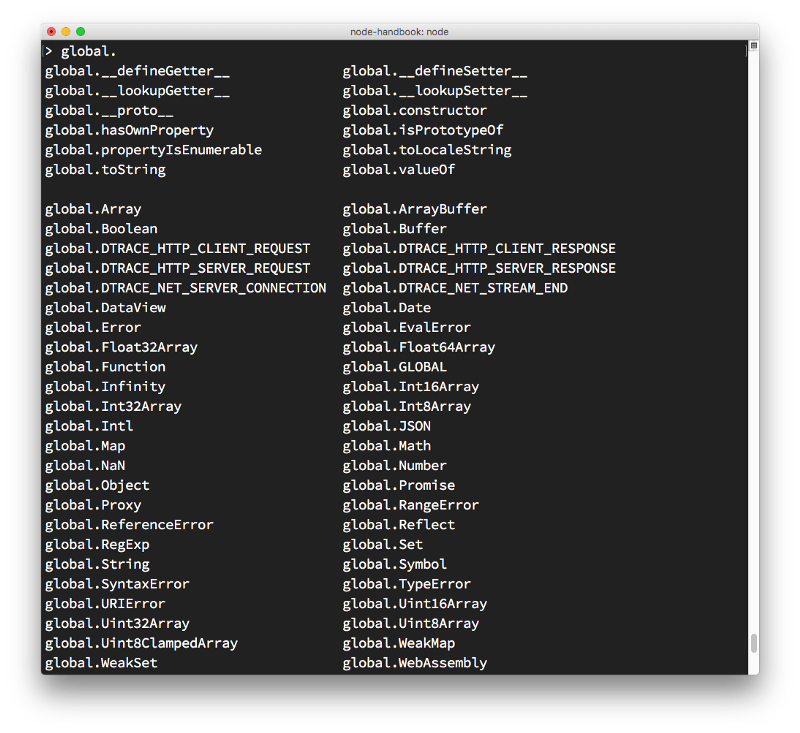
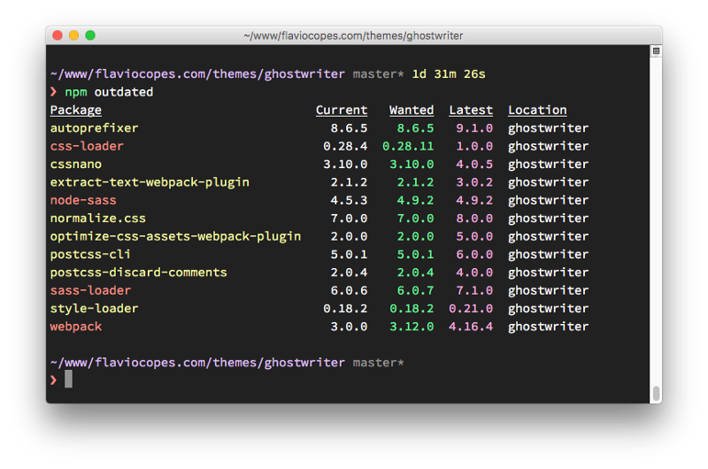
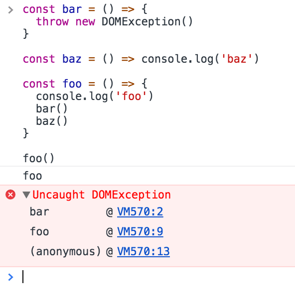
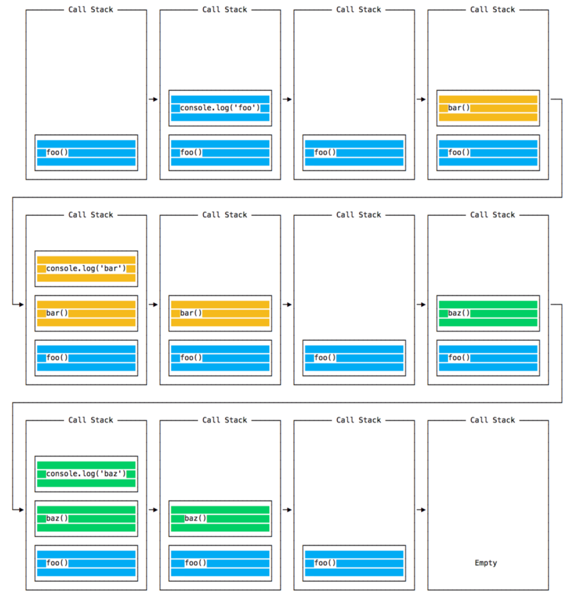
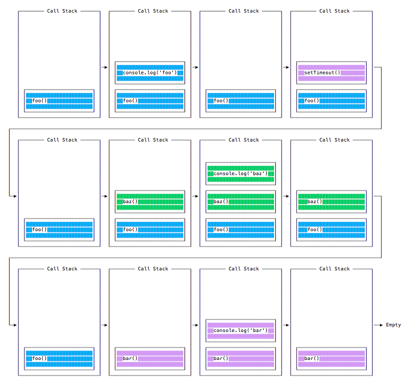
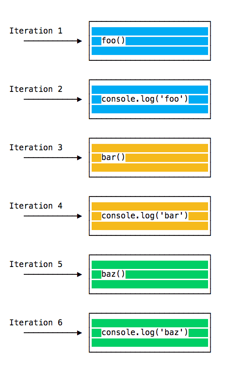
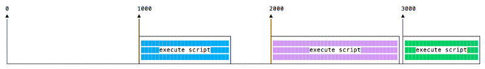
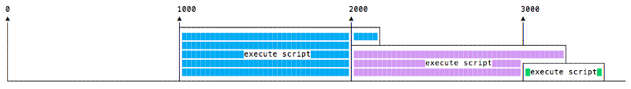

# Полное руководство по Node.js — Изучите Node для начинающих

## Введение в Node.js {#introduction-to-node-js}

Это руководство является руководством по началу работы с Node.js, серверной средой выполнения JavaScript.

### Обзор

Node.js - это **среда выполнения для JavaScript**, которая работает на **сервере**.

Node.js с открытым исходным кодом, кросс-платформенный, и с момента своего появления в 2009 году он приобрел огромную популярность и сейчас играет значительную роль на сцене веб-разработки. Если звезды GitHub являются одним из факторов популярности, то наличие 58000+ звезд означает большую популярность.

Node.js запускает движок V8 JavaScript, ядро Google Chrome, вне браузера. Node.js может использовать работу инженеров, которые сделали (и будут продолжать делать) Chrome JavaScript runtime молниеносно быстрым, и это позволяет Node.js воспользоваться огромными улучшениями производительности и компиляцией Just-In-Time, которую выполняет V8. Благодаря этому код JavaScript, выполняемый в Node.js, может стать очень производительным.

Приложение Node.js выполняется одним процессом, без создания нового потока для каждого запроса. Node предоставляет набор примитивов асинхронного ввода-вывода в своей стандартной библиотеке, которые предотвращают блокировку кода JavaScript, и в целом библиотеки в Node.js написаны с использованием неблокирующих парадигм, что делает блокирующее поведение скорее исключением, чем нормой.

Когда Node.js необходимо выполнить операцию ввода-вывода, например, чтение из сети, доступ к базе данных или файловой системе, вместо блокировки потока Node.js возобновит операции после получения ответа, вместо того чтобы тратить циклы процессора на ожидание.

Это позволяет Node.js обрабатывать тысячи одновременных соединений с одним сервером без необходимости управления параллелизмом потоков, что стало бы основным источником ошибок.

Node.js имеет уникальное преимущество, поскольку миллионы разработчиков фронтенда, которые пишут JavaScript для браузера, теперь могут выполнять код на стороне сервера и код на стороне фронтенда без необходимости изучать совершенно другой язык.

В Node.js можно без проблем использовать новые стандарты ECMAScript, поскольку вам не нужно ждать, пока все ваши пользователи обновят свои браузеры — вы сами решаете, какую версию ECMAScript использовать, изменяя версию Node.js, и вы также можете включить определенные экспериментальные функции, запустив Node с флагами.

### Он содержит огромное количество библиотек.

Благодаря своей простой структуре менеджер пакетов node (`npm`) помог экосистеме Node.js разрастись. Сейчас в реестре [npm](https://www.npmjs.com/) размещено почти 500 000 пакетов с открытым исходным кодом, которые вы можете свободно использовать.

## Пример приложения Node.js {#a-sample-node-js-application}

Самый распространенный пример Hello World из Node.js - это веб-сервер:

```js
const http = require('http');

const hostname = '127.0.0.1';
const port = 3000;

const server = http.createServer((req, res) => {
    res.statusCode = 200;
    res.setHeader('Content-Type', 'text/plain');
    res.end('Hello World\n');
});

server.listen(port, hostname, () => {
    console.log(
        `Server running at http://${hostname}:${port}/`
    );
});
```

Чтобы запустить этот фрагмент, сохраните его как файл `server.js` и запустите `node server.js` в терминале.

Этот код сначала включает в себя модуль Node.js [`http`](../api/http.md).

Node.js имеет удивительную [стандартную библиотеку](../api/index.md), включая первоклассную поддержку сетевых технологий.

Метод `createServer()` из `http` создает новый HTTP-сервер и возвращает его.

Сервер настроен на прослушивание указанного порта и имени хоста. Когда сервер готов, вызывается функция обратного вызова, в данном случае информирующая нас о том, что сервер запущен.

При получении нового запроса вызывается функция `request` [event](../api/http.md#http_event_request), которая предоставляет два объекта: запрос (объект [`http.IncomingMessage`](../api/http.md#http_class_http_incomingmessage)) и ответ (объект [`http.ServerResponse`](../api/http.md#http_class_http_serverresponse)).

Эти 2 объекта необходимы для обработки HTTP-вызова.

Первый предоставляет детали запроса. В этом простом примере он не используется, но вы можете получить доступ к заголовкам запроса и данным запроса.

Второй используется для возврата данных вызывающей стороне.

В данном случае с:

```js
res.statusCode = 200;
```

Мы устанавливаем свойство `statusCode` в `200`, чтобы указать на успешный ответ.

Мы устанавливаем заголовок `Content-Type`:

```js
res.setHeader('Content-Type', 'text/plain');
```

...и мы завершаем закрытие ответа, добавляя содержимое в качестве аргумента к `end()`:

```js
res.end('Hello World\n');
```

### Node.js фреймворки и инструменты {#node-js-frameworks-and-tools}

Node.js - это низкоуровневая платформа. Чтобы сделать работу разработчиков проще и интереснее, на базе Node.js были созданы тысячи библиотек.

Многие из них со временем стали популярными. Вот неполный список тех, которые я считаю очень важными и достойными изучения:

-   [**Express**](../expressjs4/index.md) — Один из самых простых и в то же время мощных способов создания веб-сервера. Его минималистский подход и беспристрастное внимание к основным функциям сервера является ключом к его успеху.
-   [**Meteor**](https://www.meteor.com/) — Невероятно мощный фреймворк полного стека, позволяющий использовать изоморфный подход к созданию приложений на JavaScript и разделять код на клиенте и сервере. Когда-то он был готовым инструментом, который предоставлял все, но теперь он интегрируется с такими библиотеками front-end, как [React](https://reactdev.ru/), [Vue](https://vuejs.org/) и [Angular](https://angdev.ru/). Meteor можно использовать и для создания мобильных приложений.
-   [**Koa**](http://koajs.com/) — Созданный той же командой, что и Express, Koa стремится быть еще проще и меньше, опираясь на многолетние знания. Новый проект родился из необходимости создавать несовместимые изменения, не нарушая существующего сообщества.
-   [**Next.js**](https://reactdev.ru/nextjs/) — Это фреймворк для рендеринга приложений на стороне сервера [React](https://reactdev.ru/).
-   [**Micro**](https://github.com/zeit/micro) — Это очень легкий сервер для создания асинхронных HTTP микросервисов.
-   [**Socket.io**](https://socket.io/) — Это механизм коммуникации в реальном времени для создания сетевых приложений.

### Как установить Node.js {#how-to-install-node-js}

#### Как можно установить Node.js на вашу систему: пакетный менеджер, установщик с официального сайта или nvm {#how-you-can-install-node-js-on-your-system-a-package-manager-the-official-website-installer-or-nvm}

Node.js может быть установлен различными способами. В этой заметке освещены наиболее распространенные и удобные из них.

Официальные пакеты для всех основных платформ доступны [здесь](https://nodejs.org/en/download/).

Один из очень удобных способов установки Node.js — через менеджер пакетов. В данном случае у каждой операционной системы он свой.

На macOS стандартом де-факто является [Homebrew](https://brew.sh/), который — после установки — позволяет установить Node.js очень легко, выполнив эту команду в CLI:

```sh
brew install node
```

Другие менеджеры пакетов для Linux и Windows перечислены [здесь](https://nodejs.org/en/download/package-manager/).

[nvm](https://github.com/creationix/nvm/blob/master/README.md) — популярный способ запуска Node.js. Он позволяет легко менять версию Node.js, устанавливать новые версии, чтобы попробовать и легко откатиться назад, если, например, что-то сломается.

Это также очень полезно для тестирования вашего кода со старыми версиями Node.js.

Я рекомендую использовать официальную программу установки, если вы только начинаете и еще не используете Homebrew. В противном случае Homebrew - мое любимое решение.

### Сколько JavaScript нужно знать, чтобы использовать Node.js? {#how-much-javascript-do-you-need-to-know-to-use-node-js}

Если вы только начинаете изучать JavaScript, насколько глубоко вам нужно знать язык?

Новичку трудно достичь того момента, когда вы будете достаточно уверены в своих способностях программиста.

Изучая язык, вы также можете запутаться, где заканчивается JavaScript и начинается Node.js, и наоборот.

Я бы рекомендовал вам хорошо усвоить основные концепции JavaScript, прежде чем погружаться в Node.js:

-   [Лексическая структура](https://learn.javascript.ru/structure)
-   Выражения
-   [Типы](https://learn.javascript.ru/types)
-   [Переменные](https://learn.javascript.ru/variables)
-   [Функции](https://learn.javascript.ru/function-basics)
-   [`this`](https://learn.javascript.ru/object-methods)
-   [Стрелочные функции](https://learn.javascript.ru/arrow-functions-basics)
-   [Циклы](https://learn.javascript.ru/while-for)
-   Циклы и область видимости
-   [Массивы](https://learn.javascript.ru/array)
-   Шаблонные литералы
-   Точки с запятой
-   [Строгий режим](https://learn.javascript.ru/strict-mode)
-   ECMAScript 6+

Зная эти понятия, вы уже на пути к тому, чтобы стать опытным разработчиком JavaScript как в браузере, так и в Node.js.

Следующие концепции также являются ключевыми для понимания асинхронного программирования, которое является одной из фундаментальных составляющих Node.js:

-   [Асинхронное программирование и колбеки](https://learn.javascript.ru/callbacks)
-   [Таймеры](https://learn.javascript.ru/settimeout-setinterval)
-   [Промисы](https://learn.javascript.ru/promise-basics)
-   [`async` и `await`](https://learn.javascript.ru/async-await)
-   [Замыкания](https://learn.javascript.ru/closure)
-   Цикл событий

### Различия между Node.js и браузером {#differences-between-node-js-and-the-browser}

Чем написание JavaScript-приложений в Node.js отличается от программирования для Web в браузере?

И браузер, и Node используют JavaScript в качестве языка программирования.

Создание приложений, работающих в браузере, - это совершенно другое дело, чем создание приложения в Node.js.

Несмотря на то, что это всегда JavaScript, есть несколько ключевых различий, которые делают опыт радикально другим.

У front-end разработчика, который пишет приложения на Node.js, есть огромное преимущество - язык все тот же.

У вас есть огромная возможность, потому что мы знаем, как трудно полностью, глубоко изучить язык программирования. Используя один и тот же язык для выполнения всей работы в Интернете - как на клиенте, так и на сервере - вы находитесь в уникальном положении преимущества.

Что меняется, так это экосистема.

В браузере большую часть времени вы взаимодействуете с DOM или другими API веб-платформы, такими как Cookies. В Node.js их, конечно, не существует. У вас нет `document`, `window` и всех остальных объектов, предоставляемых браузером.

И в браузере у нас нет всех тех приятных API, которые Node.js предоставляет через свои модули, например, функции доступа к файловой системе.

Еще одно большое различие заключается в том, что в Node.js вы контролируете среду. Если только вы не создаете приложение с открытым исходным кодом, которое каждый может развернуть где угодно, вы знаете, на какой версии Node.js вы будете запускать приложение. По сравнению с браузерной средой, где у вас нет возможности выбирать, какой браузер будут использовать ваши посетители, это очень удобно.

Это означает, что вы можете писать все современные ES6--7--8--9 JavaScript, которые поддерживает ваша версия Node.

Поскольку JavaScript развивается так быстро, но браузеры могут быть немного медленными, а пользователи немного медлят с обновлением - иногда в Интернете вы застреваете в использовании старых версий JavaScript/ECMAScript.

Вы можете использовать Babel для преобразования вашего кода в ES5-совместимый перед отправкой его в браузер, но в Node.js вам это не понадобится.

Еще одно отличие заключается в том, что в Node.js используется система модулей [CommonJS](../api/modules.md), в то время как в браузере мы начинаем видеть внедрение стандарта ES Modules.

На практике это означает, что пока что вы используете `require()` в Node.js и `import` в браузере.

### Движок JavaScript V8

V8 - это название движка JavaScript, на котором работает Google Chrome. Именно он принимает наш JavaScript и выполняет его во время просмотра веб-страниц в Chrome.

V8 обеспечивает среду выполнения, в которой выполняется JavaScript. DOM и другие API веб-платформы предоставляются браузером.

Самое интересное, что движок JavaScript не зависит от браузера, в котором он размещен. Эта ключевая особенность обеспечила подъем Node.js. Движок V8 был выбран Node.js еще в 2009 году, и по мере роста популярности Node.js, V8 стал тем движком, на котором сейчас работает невероятное количество кода на стороне сервера, написанного на JavaScript.

Экосистема Node.js огромна, и благодаря ей V8 также используется в приложениях для настольных компьютеров, в таких проектах, как [Electron](https://electronjs.org/).

#### Другие движки JS

Другие браузеры имеют свой собственный движок JavaScript:

-   Firefox имеет [Spidermonkey](https://developer.mozilla.org/en-US/docs/Mozilla/Projects/SpiderMonkey).
-   Safari имеет [JavaScriptCore](https://developer.apple.com/documentation/javascriptcore) (также называется Nitro)
-   Edge имеет [Chakra](https://github.com/Microsoft/ChakraCore)

и многие другие.

Все эти движки реализуют стандарт ECMA ES-262, также называемый ECMAScript, стандарт, используемый в JavaScript.

#### Стремление к производительности

V8 написан на C++ и постоянно совершенствуется. Он переносимый и работает на Mac, Windows, Linux и некоторых других системах.

В этом введении в V8 я буду игнорировать детали реализации V8. Их можно найти на более авторитетных сайтах, включая [официальный сайт V8](https://developers.google.com/v8/), и они меняются со временем, часто радикально.

V8 постоянно развивается, как и другие движки JavaScript, чтобы ускорить работу Сети и экосистемы Node.js.

В Интернете существует гонка за производительностью, которая продолжается уже много лет, и мы (как пользователи и разработчики) получаем большую выгоду от этой конкуренции, поскольку год за годом получаем более быстрые и оптимизированные машины.

#### Компиляция

JavaScript принято считать интерпретируемым языком, но современные движки JavaScript уже не просто интерпретируют JavaScript, они его компилируют.

Это происходит с 2009 года, когда компилятор SpiderMonkey JavaScript был добавлен в Firefox 3.5, и все последовали этой идее.

JavScript компилируется внутри V8 с помощью компиляции just-in-time (JIT) для ускорения выполнения.

Это может показаться неинтуитивным. Но с момента появления Google Maps в 2004 году JavaScript превратился из языка, который обычно выполнял несколько десятков строк кода, в полноценные приложения с тысячами и сотнями тысяч строк, работающие в браузере.

Теперь наши приложения могут часами работать в браузере, а не быть просто несколькими правилами проверки форм или простыми скриптами.

В этом **новом мире** компиляция JavaScript имеет смысл, потому что, хотя на подготовку JavaScript **готового** кода может потребоваться немного больше времени, он будет гораздо более производительным, чем чисто интерпретируемый код.

### Как выйти из программы Node.js {#how-to-exit-from-a-node-js-program}

Существуют различные способы завершения работы приложения Node.js.

При запуске программы в консоли вы можете закрыть ее с помощью `ctrl-C`, но то, что я хочу обсудить здесь, это программный выход.

Давайте начнем с самого радикального варианта и посмотрим, почему его лучше **не использовать**.

Основной модуль `process` предоставляет удобный метод, который позволяет вам программно выйти из программы Node.js: `process.exit()`.

Когда Node.js выполняет эту строку, процесс немедленно завершается.

Это означает, что любой ожидающий обратный вызов, любой сетевой запрос, который все еще отправляется, любой доступ к файловой системе или процессы, пишущие в `stdout` или `stderr` — все это будет немедленно безболезненно завершено.

Если вас это устраивает, вы можете передать целое число, которое сообщит операционной системе код завершения:

```js
process.exit(1);
```

По умолчанию код выхода равен `0`, что означает успех. Различные коды выхода имеют разное значение, которое вы можете использовать в своей системе, чтобы программа могла общаться с другими программами.

Подробнее о кодах выхода вы можете прочитать [здесь](../api/process.md#process_exit_codes).

Вы также можете установить свойство `process.exitCode`:

```js
process.exitCode = 1;
```

и когда программа впоследствии завершится, Node.js вернет этот код выхода.

Программа изящно завершится, когда вся обработка будет закончена.

Много раз с помощью Node.js мы запускаем серверы, например, этот HTTP-сервер:

```js
const express = require('express');
const app = express();

app.get('/', (req, res) => {
    res.send('Hi!');
});

app.listen(3000, () => console.log('Server ready'));
```

Эта программа никогда не завершится. Если вы вызовете `process.exit()`, любой ожидающий или выполняющийся запрос будет прерван. Это **нехорошо**.

В этом случае вам нужно послать команде сигнал `SIGTERM` и обработать его с помощью обработчика сигнала процесса:

**Примечание:** `process` не требует `require`, он автоматически доступен.

```js
const express = require('express');

const app = express();

app.get('/', (req, res) => {
    res.send('Hi!');
});

const server = app.listen(3000, () =>
    console.log('Server ready')
);

process.on('SIGTERM', () => {
    server.close(() => {
        console.log('Process terminated');
    });
});
```

Что такое сигналы? Сигналы — это система обмена данными Portable Operating System Interface (POSIX): уведомление, посылаемое процессу, чтобы оповестить его о произошедшем событии.

`SIGKILL` — это сигнал, который сообщает процессу о немедленном завершении, и в идеале должен действовать подобно `process.exit()`.

`SIGTERM` — это сигнал, который сообщает процессу о необходимости плавного завершения. Это сигнал, который посылается менеджерами процессов, такими как `upstart` или `supervisord` и многими другими.

Вы можете послать этот сигнал изнутри программы, в другой функции:

```js
process.kill(process.pid, 'SIGTERM');
```

Или из другой программы, запущенной на Node.js, или из любого другого приложения, запущенного в вашей системе, которое знает PID процесса, который вы хотите завершить.

### Как читать переменные окружения из Node.js {#how-to-read-environment-variables-from-node-js}

Модуль `process` ядра Node предоставляет свойство `env`, в котором хранятся все переменные окружения, которые были установлены в момент запуска процесса.

Вот пример, который обращается к переменной окружения `NODE_ENV`, которая по умолчанию установлена в `development`.

```js
process.env.NODE_ENV; // "development"
```

Установив ее в `production` перед запуском сценария, вы сообщите Node.js, что это производственная среда.

Таким же образом вы можете получить доступ к любой пользовательской переменной окружения, которую вы установили.

Здесь мы задали 2 переменные для `API_KEY` и `API_SECRET`

```sh
API_KEY=123123 API_SECRET=456456 node app.js
```

Мы можем получить их в Node.js, выполнив команду

```js
process.env.API_KEY; // "123123"
process.env.API_SECRET; // "456456"
```

Вы можете записать переменные окружения в файл `.env` (который следует добавить в `.gitignore`, чтобы избежать публикации на GitHub), затем

```sh
npm install dotenv
```

и в начале вашего основного файла Node добавьте

```js
require('dotenv').config();
```

Таким образом, вы можете не указывать переменные окружения в командной строке перед командой `node`, и эти переменные будут подхвачены автоматически.

**Примечание:** Некоторые инструменты, например, Next.js, делают переменные окружения, определенные в `.env`, автоматически доступными без необходимости использования `dotenv`.

### Где разместить приложение Node.js {#where-to-host-a-node-js-app}

Приложение Node.js может быть размещено во многих местах, в зависимости от ваших потребностей.

Вот неполный список вариантов, которые вы можете рассмотреть, когда захотите развернуть свое приложение и сделать его общедоступным.

Я буду перечислять варианты от самых простых и ограниченных к более сложным и мощным.

#### Самый простой вариант: локальный туннель.

Даже если у вас динамический IP или вы находитесь под NAT, вы можете развернуть свое приложение и обслуживать запросы прямо со своего компьютера, используя локальный туннель.

Этот вариант подходит для быстрого тестирования, демонстрации продукта или совместного использования приложения с очень небольшой группой людей.

Очень хорошим инструментом для этого, доступным на всех платформах, является [ngrok](https://ngrok.com/).

Используя его, вы можете просто набрать `ngrok PORT` и нужный вам PORT будет открыт для интернета. Вы получите домен `ngrok.io`, но при платной подписке вы можете получить пользовательский URL, а также больше возможностей безопасности (помните, что вы открываете свою машину для публичного Интернета).

Еще один сервис, который вы можете использовать, - [localtunnel](https://github.com/localtunnel/localtunnel).

#### Развертывание нулевой конфигурации

#### Glitch

[Glitch](https://glitch.com/) - это игровая площадка и способ создавать свои приложения быстрее, чем когда-либо, и видеть их в реальном времени на собственном поддомене glitch.com. В настоящее время вы не можете иметь собственный домен, и есть несколько [ограничений](https://glitch.com/faq#restrictions), но это действительно здорово для создания прототипов. Он выглядит забавно (и это плюс), и это не отупляющая среда - вы получаете всю мощь Node.js, CDN, безопасное хранение учетных данных, импорт/экспорт GitHub и многое другое.

Предоставляется компанией, стоящей за FogBugz и Trello (и соавторами Stack Overflow).

Я часто использую его в демонстрационных целях.

#### Codepen

[Codepen](https://codepen.io/) - это удивительная платформа и сообщество. Вы можете создать проект с несколькими файлами и развернуть его с помощью пользовательского домена.

#### Serverless

Способ публикации приложений и отсутствие сервера для управления - это Serverless. Serverless - это парадигма, в которой вы публикуете свои приложения как **функции**, а они отвечают на запросы конечной точки сети (также называемой FAAS — Functions As A Service).

К очень популярным решениям относятся:

-   [Serverless Framework](https://serverless.com/framework/)
-   [Стандартная библиотека](https://stdlib.com/).

Они оба предоставляют слой абстракции для публикации на AWS Lambda и других FAAS-решений на базе Azure или Google Cloud.

#### PAAS

PAAS расшифровывается как Platform As A Service. Эти платформы убирают многие вещи, о которых вы должны беспокоиться при развертывании вашего приложения.

#### Zeit Now

[Zeit](https://zeit.co/now) - интересный вариант. Вы просто вводите `now` в терминале, и он берет на себя заботу о развертывании вашего приложения. Есть бесплатная версия с ограничениями, а платная версия более мощная. Вы просто забываете о существовании сервера, вы просто развертываете приложение.

#### Nanobox

[Nanobox](https://nanobox.io/)

#### Heroku

[Heroku](https://www.heroku.com/) - удивительная платформа.

Это отличная статья о [начале работы с Node.js на Heroku](https://devcenter.heroku.com/articles/getting-started-with-node).

#### Microsoft Azure

[Azure](https://azure.microsoft.com/en-us/) - это облачное предложение Microsoft.

Посмотрите, как [создать веб-приложение Node.js в Azure](https://docs.microsoft.com/en-us/azure/app-service/app-service-web-get-started-node).

#### Google Cloud Platform

[Google Cloud](https://cloud.google.com/) - это удивительная структура для ваших приложений.

У них есть хороший [Раздел документации по Node.js](https://cloud.google.com/node/).

#### Виртуальный выделенный сервер

В этом разделе вы найдете обычных подозреваемых, упорядоченных от более удобных для пользователя к менее удобным:

-   [Digital Ocean](https://www.digitalocean.com/)
-   [Linode](https://www.linode.com/)
-   [Amazon Web Services](https://aws.amazon.com/), в частности, я упоминаю Amazon Elastic Beanstalk, поскольку он немного абстрагирует сложность AWS.

Поскольку они предоставляют пустую Linux-машину, на которой вы можете работать, специального руководства по ним нет.

Есть много других вариантов в категории VPS, это только те, которые я использовал и рекомендую.

#### Bare metal

Другим решением является получение [bare metal сервера](https://en.wikipedia.org/wiki/Bare-metal_server), установка дистрибутива Linux, подключение к интернету (или аренда сервера на месяц, как это можно сделать с помощью сервиса [Vultr Bare Metal](https://www.vultr.com/pricing/baremetal/)).

---

### Как использовать Node.js REPL {#how-to-use-the-node-js-repl}

REPL расшифровывается как Read-Evaluate-Print-Loop, и это отличный способ быстро изучить возможности Node.js.

Команда `node` - это команда, которую мы используем для запуска наших скриптов Node.js:

    node script.js

Если мы опускаем имя файла, мы используем его в режиме REPL:

    node

Если вы попробуете сделать это сейчас в терминале, вот что произойдет:

    ❯ node
    >

команда остается в режиме ожидания и ждет, пока мы что-нибудь введем.

**Совет**: если вы не знаете, как открыть терминал, наберите в Google "How to open terminal on \<ваша операционная система\>".

REPL ждет, пока мы введем какой-нибудь код JavaScript.

Начните с простого и введите:

    > console.log('test')
    test
    undefined
    >

Первое значение, `test`, - это вывод, который мы сказали консоли вывести, затем мы получаем undefined, которое является возвращаемым значением выполнения `console.log()`.

Теперь мы можем ввести новую строку JavaScript.

#### Использование вкладки для автозаполнения

Самое замечательное в REPL то, что он интерактивен.

По мере написания кода, если вы нажмете клавишу `tab`, REPL попытается автозаполнить то, что вы написали, чтобы соответствовать переменной, которую вы уже определили, или предопределенной переменной.

#### Изучение объектов JavaScript

Попробуйте ввести имя класса JavaScript, например `Number`, добавить точку и нажать `tab`.

REPL выведет все свойства и методы этого класса, к которым вы можете получить доступ:



#### Исследуйте глобальные объекты

Вы можете просмотреть глобальные объекты, к которым у вас есть доступ, набрав `global.` и нажав `tab`:



#### Специальная переменная `_`

Если после некоторого кода вы напечатаете `_`, то будет выведен результат последней операции.

#### Команды с точкой

В REPL есть несколько специальных команд, все они начинаются с точки `.`. К ним относятся

-   `.help`: показывает справку по точечным командам.
-   `.editor`: включает режим редактора, позволяющий легко писать многострочный код JavaScript. Как только вы окажетесь в этом режиме, введите ctrl-D, чтобы запустить написанный вами код.
-   `.break`: при вводе многострочного выражения ввод команды .break прерывает дальнейший ввод. Аналогично нажатию клавиши ctrl-C.
-   `.clear`: сбрасывает контекст REPL на пустой объект и очищает любое многострочное выражение, вводимое в данный момент.
-   `.load`: загружает файл JavaScript, относительно текущего рабочего каталога.
-   `.save`: сохраняет все, что вы ввели в сеансе REPL, в файл (укажите имя файла).
-   `.exit`: завершает работу (то же самое, что два раза нажать ctrl-C).

REPL знает, когда вы набираете многострочный оператор, без необходимости вызывать `.editor`.

Например, если вы начинаете набирать итерацию следующим образом:

```js
[1, 2, 3].forEach(num => {
```

и вы нажмете `enter`, REPL перейдет на новую строку, начинающуюся с 3 точек, указывая, что теперь вы можете продолжить работу над этим блоком.

```js
...   console.log(num)
... })
```

Если вы напечатаете `.break` в конце строки, многострочный режим остановится и утверждение не будет выполнено.

### Node.js, принимать аргументы из командной строки {#node-js-accept-arguments-from-the-command-line}

Как принимать аргументы в программе Node.js, передаваемые из командной строки

Вы можете передавать любое количество аргументов при вызове приложения Node.js с помощью:

    node app.js

Аргументы могут быть отдельными или иметь ключ и значение.

Например:

    node app.js flavio

или

    node app.js name=flavio

Это меняет способ получения этого значения в коде Node.js.

Для его получения используется объект `process`, встроенный в Node.js.

Он раскрывает свойство `argv`, которое представляет собой массив, содержащий все аргументы командной строки.

Первый аргумент - это полный путь команды `node`.

Второй элемент - полный путь выполняемого файла.

Все дополнительные аргументы присутствуют с третьей позиции и далее.

Вы можете перебирать все аргументы (включая путь к узлу и путь к файлу) с помощью цикла:

```js
process.argv.forEach((val, index) => {
    console.log(`${index}: ${val}`);
});
```

Вы можете получить только дополнительные аргументы, создав новый массив, исключающий первые 2 параметра:

```js
const args = process.argv.slice(2);
```

Если у вас есть один аргумент без имени индекса, например, так:

    node app.js flavio

вы можете получить к нему доступ, используя

```js
const args = process.argv.slice(2);
args[0];
```

В данном случае:

    node app.js name=flavio

`args[0]` - это `name=flavio`, и вам нужно разобрать его. Лучший способ сделать это - использовать `minimist` [library](https://www.npmjs.com/package/minimist), который помогает работать с аргументами:

```js
const args = require('minimist')(process.argv.slice(2));
args['name']; // flavio
```

### Вывод в командную строку с помощью Node.js {#output-to-the-command-line-using-node-js}

Как выводить в консоль командной строки с помощью Node.js, от базового console.log до более сложных сценариев.

#### Базовый вывод с помощью модуля консоли

Node.js предоставляет `console` [модуль](https://nodejs.org/api/console.html), который обеспечивает множество очень полезных способов взаимодействия с командной строкой.

По сути, это то же самое, что и объект `console`, который можно найти в браузере.

Самым основным и наиболее используемым методом является `console.log()`, который печатает строку, которую вы передаете в консоль.

Если вы передадите объект, он будет отображен как строка.

В `console.log` можно передать несколько переменных, например:

```js
const x = 'x';
const y = 'y';
console.log(x, y);
```

и Node.js выведет обе фразы.

Мы также можем форматировать красивые фразы, передавая переменные и спецификатор формата.

Например:

```js
console.log('My %s has %d years', 'cat', 2);
```

-   `%s` форматирует переменную как строку
-   `%d` или `%i` форматируют переменную как целое число
-   `%f` форматирует переменную как число с плавающей точкой
-   `%O` используется для печати представления объекта

Пример:

```js
console.log('%O', Number);
```

#### Очистить консоль

`console.clear()` очищает консоль (поведение может зависеть от используемой консоли).

#### Подсчет элементов

`console.count()` - удобный метод.

Возьмите этот код:

```js
const x = 1;
const y = 2;
const z = 3;

console.count(
    'The value of x is ' +
        x +
        ' and has been checked .. how many times?'
);

console.count(
    'The value of x is ' +
        x +
        ' and has been checked .. how many times?'
);

console.count(
    'The value of y is ' +
        y +
        ' and has been checked .. how many times?'
);
```

Происходит это так: `count` будет считать, сколько раз печатается строка, и выводить рядом с ней счет.

Вы можете просто считать яблоки и апельсины:

```js
const oranges = ['orange', 'orange'];
const apples = ['just one apple'];

oranges.forEach((fruit) => {
    console.count(fruit);
});

apples.forEach((fruit) => {
    console.count(fruit);
});
```

#### Печать трассировки стека

Бывают случаи, когда полезно распечатать трассировку стека вызовов функции, возможно, чтобы ответить на вопрос: "Как вы достигли этой части кода?".

Вы можете сделать это с помощью `console.trace()`:

```js
const function2 = () => console.trace();
const function1 = () => function2();
function1();
```

Это выведет трассировку стека. Вот что будет выведено, если я попробую сделать это в Node REPL:

    Trace
      at function2 (repl:1:33)
      at function1 (repl:1:25)
      at repl:1:1
      at ContextifyScript.Script.runInThisContext (vm.js:44:33)
      at REPLServer.defaultEval (repl.js:239:29)
      at bound (domain.js:301:14)
      at REPLServer.runBound [as eval] (domain.js:314:12)
      at REPLServer.onLine (repl.js:440:10)
      at emitOne (events.js:120:20)
      at REPLServer.emit (events.js:210:7)

#### Вычислите затраченное время

Вы можете легко подсчитать, сколько времени занимает выполнение функции, используя `time()` и `timeEnd()`.

```js
const doSomething = () => console.log('test');
const measureDoingSomething = () => {
    console.time('doSomething()');
    // do something, and measure the time it takes
    doSomething();
    console.timeEnd('doSomething()');
};

measureDoingSomething();
```

#### stdout и stderr

Как мы видели, console.log отлично подходит для печати сообщений в консоли. Это то, что называется стандартным выводом, или `stdout`.

Ошибка `console.error` печатается в поток `stderr`.

Он не появится в консоли, но появится в журнале ошибок.

#### Цвет вывода

Вы можете раскрасить выводимый в консоль текст, используя управляющие последовательности. Эскейп-последовательность - это набор символов, идентифицирующих цвет.

Пример:

```js
console.log('\x1b[33m%s\x1b[0m', 'hi!');
```

Вы можете попробовать сделать это в Node REPL, и он выведет `hi!` желтым цветом.

Однако это низкоуровневый способ сделать это. Самый простой способ раскрасить вывод консоли - это использовать библиотеку. [Chalk](https://github.com/chalk/chalk) является такой библиотекой, и в дополнение к раскрашиванию она также помогает с другими средствами стилизации, например, делает текст жирным, курсивным или подчеркнутым.

Вы устанавливаете ее с помощью `npm install chalk`, а затем можете использовать ее:

```js
const chalk = require('chalk');
console.log(chalk.yellow('hi!'));
```

Использовать `chalk.yellow` гораздо удобнее, чем пытаться запомнить escape-коды, и код становится гораздо более читабельным.

Проверьте ссылку на проект, которую я разместил выше, чтобы найти больше примеров использования.

#### Создание индикатора выполнения

[Progress](https://www.npmjs.com/package/progress) - это замечательный пакет для создания прогресс-бара в консоли. Установите его с помощью `npm install progress`.

Этот фрагмент создает 10-шаговый прогресс-бар, и каждые 100 мс завершается один шаг. Когда полоса завершается, мы очищаем интервал:

```js
const ProgressBar = require('progress');

const bar = new ProgressBar(':bar', { total: 10 });
const timer = setInterval(() => {
    bar.tick();
    if (bar.complete) {
        clearInterval(timer);
    }
}, 100);
```

### Принять ввод из командной строки в Node.js {#accept-input-from-the-command-line-in-node-js}

Как сделать программу Node.js CLI интерактивной?

Node, начиная с версии 7, предоставляет `readline` [модуль](https://nodejs.org/api/readline.html) для выполнения именно этого: получения ввода из читаемого потока, такого как поток `process.stdin`, который во время выполнения программы Node является вводом терминала, по одной строке за раз.

```js
const readline = require('readline').createInterface({
    input: process.stdin,
    output: process.stdout,
});

readline.question(`What's your name?`, (name) => {
    console.log(`Hi ${name}!`);
    readline.close();
});
```

Этот фрагмент кода запрашивает имя пользователя, и как только текст будет введен и пользователь нажмет клавишу Enter, мы отправим приветствие.

Метод `question()` показывает первый параметр (вопрос) и ожидает ввода пользователем. Он вызывает функцию обратного вызова после нажатия клавиши Enter.

В этой функции обратного вызова мы закрываем интерфейс readline.

`readline` предлагает несколько других методов, и я позволю вам ознакомиться с ними в документации по пакету, ссылку на которую я привел выше.

Если вам нужно потребовать пароль, лучше всего теперь выводить его обратно эхом, а вместо него показывать символ `*`.

Самый простой способ - использовать readline-sync [package](https://www.npmjs.com/package/readline-sync), который очень похож по API и справляется с этим из коробки.

Более полное и абстрактное решение предоставляет пакет [Inquirer.js](https://github.com/SBoudrias/Inquirer.js).

Вы можете установить его с помощью `npm install inquirer`, а затем воспроизвести приведенный выше код следующим образом:

```js
const inquirer = require('inquirer');

let questions = [
    {
        type: 'input',
        name: 'name',
        message: "What's your name?",
    },
];

inquirer.prompt(questions).then((answers) => {
    console.log(`Hi ${answers['name']}!`);
});
```

Inquirer.js позволяет вам делать множество вещей, например, задавать несколько вариантов ответа, иметь радиокнопки, подтверждения и многое другое.

Стоит знать все альтернативы, особенно встроенные, предоставляемые Node.js, но если вы планируете вывести CLI-ввод на новый уровень, Inquirer.js - оптимальный выбор.

### Выявление функциональности из файла Node.js с помощью экспорта {#expose-functionality-from-a-node-js-file-using-exports}

Как использовать API `module.exports` для передачи данных в другие файлы вашего приложения или в другие приложения.

Node.js имеет встроенную систему модулей.

Файл Node.js может импортировать функциональность, открытую другими файлами Node.js.

Когда вы хотите импортировать что-то, вы используете:

```js
const library = require('./library');
```

для импорта функциональности, раскрытой в файле `library.js`, который находится в папке текущего файла.

В этом файле функциональность должна быть раскрыта, прежде чем она может быть импортирована другими файлами.

Любой другой объект или переменная, определенные в файле, по умолчанию являются приватными и не раскрываются внешнему миру.

Именно это позволяет сделать API `module.exports`, предлагаемый `module` [system](https://nodejs.org/api/modules.html).

Когда вы назначаете объект или функцию в качестве нового свойства `exports`, это и есть то, что раскрывается. Как таковой, он может быть импортирован в другие части вашего приложения или в другие приложения.

Вы можете сделать это двумя способами.

Первый - присвоить объект свойству `module.exports`, которое является объектом, предоставляемым из коробки системой модулей, и это заставит ваш файл экспортировать **только этот объект**:

```js
const car = {
    brand: 'Ford',
    model: 'Fiesta',
};

module.exports = car;

// ...in the other file

const car = require('./car');
```

Второй способ - добавить экспортируемый объект в качестве свойства `exports`. Этот способ позволяет экспортировать **множество** объектов, функций или данных:

```js
const car = {
    brand: 'Ford',
    model: 'Fiesta',
};

exports.car = car;
```

или непосредственно

```js
exports.car = {
    brand: 'Ford',
    model: 'Fiesta',
};
```

А в другом файле вы будете использовать его, ссылаясь на свойство вашего импорта:

```js
const items = require('./items');
items.car;
```

или

```js
const car = require('./items').car;
```

В чем разница между `module.exports` и `exports`?

Первый раскрывает **объект**, на который он указывает. Второй раскрывает **свойства** объекта, на который он указывает.

### Введение в npm

`npm` означает **менеджер пакетов Node**.

В январе 2017 года в реестре npm было зарегистрировано более 350 000 пакетов, что делает его самым большим хранилищем кода на одном языке на Земле, и вы можете быть уверены, что здесь есть пакет для (почти!) всего.

Он начинался как способ загрузки и управления зависимостями пакетов Node.js, но с тех пор стал инструментом, используемым и в front-end JavaScript.

Есть много вещей, которые делает `npm`.

#### Загрузка

`npm` управляет загрузкой зависимостей вашего проекта.

#### Установка всех зависимостей

Если в проекте есть файл `packages.json`, то, выполнив команду

    npm install

установит все, что нужно проекту, в папку `node_modules`, создав ее, если она еще не существует.

#### Установка одного пакета

Вы также можете установить определенный пакет, выполнив команду

    npm install <package-name>

Часто можно увидеть дополнительные флаги, добавляемые к этой команде:

-   `--save` устанавливает и добавляет запись в файл `package.json` `dependencies`.
-   `--save-dev` устанавливает и добавляет запись в файл `package.json` `devDependencies`.

Разница в основном заключается в том, что `devDependencies` обычно являются инструментами разработки, например, библиотекой для тестирования, в то время как `dependencies` поставляются с приложением в продакшене.

#### Обновление пакетов

Обновление пакетов также упрощается, если выполнить

    npm update

`npm` проверит все пакеты на наличие более новой версии, удовлетворяющей вашим ограничениям по версионности.

Вы также можете указать отдельный пакет для обновления:

    npm update <package-name>

#### Версионирование

Помимо простой загрузки, `npm` также управляет **версионированием**, так что вы можете указать любую конкретную версию пакета или потребовать версию выше или ниже той, которая вам нужна.

Много раз вы можете обнаружить, что библиотека совместима только с основным выпуском другой библиотеки.

Или ошибка в последнем выпуске библиотеки, до сих пор не исправленная, вызывает проблему.

Указание явной версии библиотеки также помогает держать всех на одной и той же точной версии пакета, так что вся команда работает с одной и той же версией до тех пор, пока файл `package.json` не будет обновлен.

Во всех этих случаях версионирование очень помогает, и `npm` следует стандарту семантического версионирования (semver).

#### Выполняемые задачи

Файл package.json поддерживает формат для указания задач командной строки, которые могут быть запущены с помощью команды

    npm run <task-name>

Например:

```json
{
    "scripts": {
        "start-dev": "node lib/server-development",
        "start": "node lib/server-production"
    }
}
```

Очень часто эта функция используется для запуска Webpack:

```json
{
    "scripts": {
        "watch": "webpack --watch --progress --colors --config webpack.conf.js",
        "dev": "webpack --progress --colors --config webpack.conf.js",
        "prod": "NODE_ENV=production webpack -p --config webpack.conf.js"
    }
}
```

Поэтому вместо того, чтобы набирать эти длинные команды, которые легко забыть или напечатать неправильно, вы можете выполнить

    $ npm watch
    $ npm dev
    $ npm prod

### Куда npm устанавливает пакеты?

Когда вы устанавливаете пакет с помощью `npm` (или [yarn](https://flaviocopes.com/yarn/)), вы можете выполнить 2 типа установки:

-   локальная установка
-   глобальная установка

По умолчанию, когда вы вводите команду `npm install`, например:

    npm install lodash

пакет устанавливается в текущее дерево файлов, в подпапку `node_modules`.

При этом `npm` также добавляет запись `lodash` в свойство `dependencies` файла `package.json`, находящегося в текущей папке.

Глобальная установка выполняется с помощью флага `-g`:

    npm install -g lodash

Когда это происходит, npm не будет устанавливать пакет в локальную папку, а вместо этого будет использовать глобальное расположение.

Где именно?

Команда `npm root -g` скажет вам, где именно находится это место на вашей машине.

На macOS или Linux это место может быть `/usr/local/lib/node_modules`. В Windows это может быть `C:\Users\YOU\AppData\Roaming\npm\node_modules`.

Если вы используете `nvm` для управления версиями Node.js, однако, это расположение будет отличаться.

Я, например, использую `nvm` и расположение моих пакетов было показано как `/Users/flavio/.nvm/versions/node/v8.9.0/lib/node_modules`.

### Как использовать или выполнить пакет, установленный с помощью npm

#### Как включить и использовать в коде пакет, установленный в папке node_modules

Когда вы устанавливаете с помощью `npm` пакет в папку `node_modules` или глобально, как вы используете его в своем коде Node?

Скажем, вы устанавливаете `lodash`, популярную библиотеку утилит JavaScript, используя

    npm install lodash

Это позволит установить пакет в локальную папку `node_modules`.

Чтобы использовать его в своем коде, вам просто нужно импортировать его в свою программу с помощью `require`:

```js
const _ = require('lodash');
```

Что если ваш пакет является исполняемым файлом?

В этом случае он поместит исполняемый файл в папку `node_modules/.bin/`.

Один из простых способов продемонстрировать это - [cowsay](https://www.npmjs.com/package/cowsay).

Пакет cowsay предоставляет программу командной строки, которая может быть выполнена, чтобы заставить корову сказать что-нибудь (и других животных тоже).

Когда вы устанавливаете пакет с помощью `npm install cowsay`, он установит себя и несколько зависимостей в папку node_modules.

Там есть скрытая папка .bin, которая содержит символические ссылки на двоичные файлы cowsay.

Как их выполнить?

Конечно, вы можете набрать `./node_modules/.bin/cowsay`, чтобы запустить его, и это работает, но [npx](https://flaviocopes.com/npx/), включенный в последние версии npm (начиная с 5.2), является гораздо лучшим вариантом. Вы просто запускаете:

    npx cowsay

и npx найдет местоположение пакета.

### Руководство по package.json {#the-package-json-guide}

Файл package.json является ключевым элементом во многих кодовых базах приложений, основанных на экосистеме Node.js.

Если вы работаете с JavaScript или когда-либо взаимодействовали с проектом JavaScript, Node.js или front-end проектом, вы наверняка встречали файл `package.json`.

Для чего он нужен? Что вы должны знать о нем, и какие интересные вещи вы можете с ним делать?

Файл `package.json` - это своего рода манифест вашего проекта. Он может делать множество вещей, совершенно не связанных между собой. Например, это центральное хранилище конфигурации для инструментов. В нем также хранятся имена и версии установленных пакетов [`npm`](https://flaviocopes.com/npm/) и [`yarn`](https://flaviocopes.com/yarn/).

#### Структура файла

Вот пример файла package.json:

```json
{}
```

Он пустой! Не существует фиксированных требований к тому, что должно быть в файле `package.json` для приложения. Единственное требование - это соблюдение формата JSON, иначе он не может быть прочитан программами, которые пытаются получить доступ к его свойствам программно.

Если вы создаете пакет Node.js, который вы хотите распространять через `npm`, ситуация радикально меняется, и вы должны иметь набор свойств, которые помогут другим людям использовать его. Подробнее об этом мы поговорим позже.

Это еще один package.json:

```json
{
    "name": "test-project"
}
```

Он определяет свойство `name`, которое сообщает имя приложения или пакета, содержащегося в той же папке, где находится этот файл.

Вот гораздо более сложный пример, который я извлек из примера приложения Vue.js:

```json
{
    "name": "test-project",
    "version": "1.0.0",
    "description": "A Vue.js project",
    "main": "src/main.js",
    "private": true,
    "scripts": {
        "dev": "webpack-dev-server --inline --progress --config build/webpack.dev.conf.js",
        "start": "npm run dev",
        "unit": "jest --config test/unit/jest.conf.js --coverage",
        "test": "npm run unit",
        "lint": "eslint --ext .js,.vue src test/unit",
        "build": "node build/build.js"
    },
    "dependencies": {
        "vue": "^2.5.2"
    },
    "devDependencies": {
        "autoprefixer": "^7.1.2",
        "babel-core": "^6.22.1",
        "babel-eslint": "^8.2.1",
        "babel-helper-vue-jsx-merge-props": "^2.0.3",
        "babel-jest": "^21.0.2",
        "babel-loader": "^7.1.1",
        "babel-plugin-dynamic-import-node": "^1.2.0",
        "babel-plugin-syntax-jsx": "^6.18.0",
        "babel-plugin-transform-es2015-modules-commonjs": "^6.26.0",
        "babel-plugin-transform-runtime": "^6.22.0",
        "babel-plugin-transform-vue-jsx": "^3.5.0",
        "babel-preset-env": "^1.3.2",
        "babel-preset-stage-2": "^6.22.0",
        "chalk": "^2.0.1",
        "copy-webpack-plugin": "^4.0.1",
        "css-loader": "^0.28.0",
        "eslint": "^4.15.0",
        "eslint-config-airbnb-base": "^11.3.0",
        "eslint-friendly-formatter": "^3.0.0",
        "eslint-import-resolver-webpack": "^0.8.3",
        "eslint-loader": "^1.7.1",
        "eslint-plugin-import": "^2.7.0",
        "eslint-plugin-vue": "^4.0.0",
        "extract-text-webpack-plugin": "^3.0.0",
        "file-loader": "^1.1.4",
        "friendly-errors-webpack-plugin": "^1.6.1",
        "html-webpack-plugin": "^2.30.1",
        "jest": "^22.0.4",
        "jest-serializer-vue": "^0.3.0",
        "node-notifier": "^5.1.2",
        "optimize-css-assets-webpack-plugin": "^3.2.0",
        "ora": "^1.2.0",
        "portfinder": "^1.0.13",
        "postcss-import": "^11.0.0",
        "postcss-loader": "^2.0.8",
        "postcss-url": "^7.2.1",
        "rimraf": "^2.6.0",
        "semver": "^5.3.0",
        "shelljs": "^0.7.6",
        "uglifyjs-webpack-plugin": "^1.1.1",
        "url-loader": "^0.5.8",
        "vue-jest": "^1.0.2",
        "vue-loader": "^13.3.0",
        "vue-style-loader": "^3.0.1",
        "vue-template-compiler": "^2.5.2",
        "webpack": "^3.6.0",
        "webpack-bundle-analyzer": "^2.9.0",
        "webpack-dev-server": "^2.9.1",
        "webpack-merge": "^4.1.0"
    },
    "engines": {
        "node": ">= 6.0.0",
        "npm": ">= 3.0.0"
    },
    "browserslist": [
        "> 1%",
        "last 2 versions",
        "not ie <= 8"
    ]
}
```

здесь происходит **много** вещей:

-   `name` задает имя приложения/пакета
-   `version` указывает текущую версию
-   `description` - краткое описание приложения/пакета
-   `main` задает точку входа для приложения
-   `private`, если установлено значение `true`, предотвращает случайную публикацию приложения/пакета на `npm`.
-   `scripts` определяет набор скриптов для node, которые вы можете запускать
-   `dependencies` задает список пакетов `npm`, установленных в качестве зависимостей
-   `devDependencies` задает список пакетов `npm`, установленных в качестве зависимостей для разработки
-   `engines` устанавливает, на каких версиях Node работает этот пакет/приложение
-   `browserslist` используется для указания того, какие браузеры (и их версии) вы хотите поддерживать.

Все эти свойства используются либо `npm`, либо другими инструментами, которые мы можем использовать.

#### Разбивка свойств

В этом разделе подробно описаны свойства, которые вы можете использовать. Я ссылаюсь на "пакет", но то же самое относится и к локальным приложениям, которые вы не используете как пакеты.

Большинство из этих свойств используется только на сайте npm [website](https://www.npmjs.com/), другие скриптами, которые взаимодействуют с вашим кодом, например `npm` или другими.

#### `name`

Устанавливает имя пакета.

Пример:

```json
"name": "test-project"
```

Имя должно быть меньше 214 символов, не должно содержать пробелов, может содержать только строчные буквы, дефисы (`-`) или символы подчеркивания (`_`).

Это необходимо потому, что когда пакет публикуется на `npm`, он получает свой собственный URL, основанный на этом свойстве.

Если вы опубликовали этот пакет на GitHub, хорошим значением для этого свойства будет имя репозитория GitHub.

#### `author`

Перечисляет имя автора пакета.

Пример:

```json
{
    "author": "Flavio Copes <flavio@flaviocopes.com> (https://flaviocopes.com)"
}
```

Может также использоваться с этим форматом:

```json
{
    "author": {
        "name": "Flavio Copes",
        "email": "your@email.com",
        "url": "https://flaviocopes.com"
    }
}
```

#### `contributors`

Помимо автора, у проекта может быть один или несколько соавторов. Это свойство представляет собой массив, в котором они перечислены.

Пример:

```json
{
    "contributors": [
        "Flavio Copes <your@email.com> (https://flaviocopes.com)"
    ]
}
```

Может также использоваться с этим форматом:

```json
{
    "contributors": [
        {
            "name": "Flavio Copes",
            "email": "your@email.com",
            "url": "https://flaviocopes.com"
        }
    ]
}
```

#### `bugs`

Ссылка на трекер проблем пакета, скорее всего, на страницу проблем GitHub

Пример:

```json
{
    "bugs": "https://github.com/flaviocopes/package/issues"
}
```

#### `homepage`

Устанавливает домашнюю страницу пакета

Пример:

```json
{
    "homepage": "https://flaviocopes.com/package"
}
```

#### `version`

Указывает текущую версию пакета.

Пример:

```json
"version": "1.0.0"
```

Это свойство соответствует нотации семантического версионирования (semver) для версий, что означает, что версия всегда выражается 3 числами: `x.x.x`.

Первое число - это основная версия, второе - второстепенная версия, а третье - версия патча.

Эти числа имеют определенный смысл: релиз, который только исправляет ошибки, является патчем, релиз, который вносит обратно совместимые изменения, является минорным релизом, а мажорный релиз может содержать ломающие изменения.

#### `license`

Указывает лицензию пакета.

Пример:

```json
"license": "MIT"
```

#### `keywords`

Это свойство содержит массив ключевых слов, которые ассоциируются с тем, что делает ваш пакет.

Пример:

```json
"keywords": [
  "email",
  "machine learning",
  "ai"
]
```

Это поможет людям найти ваш пакет при навигации по похожим пакетам или при просмотре сайта npm.

#### `description`

Это свойство содержит краткое описание пакета.

Пример:

```json
"description": "A package to work with strings"
```

Это особенно полезно, если вы решили опубликовать свой пакет в `npm`, чтобы люди могли узнать, о чем этот пакет.

#### `repository`

Это свойство определяет, где находится репозиторий данного пакета.

Пример:

    "repository": "github:flaviocopes/testing",

Обратите внимание на префикс `github`. Есть и другие популярные сервисы:

```json
"repository": "gitlab:flaviocopes/testing",
```

```json
"repository": "bitbucket:flaviocopes/testing",
```

Вы можете явно задать систему контроля версий:

```json
"repository": {
  "type": "git",
  "url": "https://github.com/flaviocopes/testing.git"
}
```

Вы можете использовать различные системы контроля версий:

```json
"repository": {
  "type": "svn",
  "url": "..."
}
```

#### `main`

Устанавливает точку входа для пакета.

Когда вы импортируете этот пакет в приложение, именно здесь приложение будет искать экспорты модуля.

Пример:

```json
"main": "src/main.js"
```

#### `private`

если установлено значение `true`, предотвращает случайную публикацию приложения/пакета на `npm`.

Пример:

```json
"private": true
```

#### `scripts`

Определяет набор сценариев узла, которые можно запускать.

Пример:

```json
"scripts": {
  "dev": "webpack-dev-server --inline --progress --config build/webpack.dev.conf.js",
  "start": "npm run dev",
  "unit": "jest --config test/unit/jest.conf.js --coverage",
  "test": "npm run unit",
  "lint": "eslint --ext .js,.vue src test/unit",
  "build": "node build/build.js"
}
```

Эти скрипты являются приложениями командной строки. Вы можете запустить их, вызвав `npm run XXXX` или `yarn XXXX`, где `XXXX` - имя команды.

Пример:

```
npm run dev
```

Вы можете использовать любое имя для команды, а скрипты могут делать буквально все, что угодно.

#### `dependencies`

Задает список пакетов `npm`, установленных в качестве зависимостей.

Когда вы устанавливаете пакет с помощью npm или yarn:

    npm install <PACKAGENAME>
    yarn add <PACKAGENAME>

этот пакет автоматически вставляется в этот список.

Пример:

```json
"dependencies": {
  "vue": "^2.5.2"
}
```

#### `devDependencies`

Задает список пакетов `npm`, установленных в качестве зависимостей для разработки.

Они отличаются от `зависимостей` тем, что предназначены для установки только на машине разработки и не нужны для запуска кода в продакшене.

Когда вы устанавливаете пакет с помощью `npm` или `yarn`:

    npm install --dev <PACKAGENAME>
    yarn add --dev <PACKAGENAME>

этот пакет автоматически вставляется в этот список.

Пример:

```json
"devDependencies": {
  "autoprefixer": "^7.1.2",
  "babel-core": "^6.22.1"
}
```

#### `engines`

Устанавливает, на каких версиях Node.js и других команд работает этот пакет/приложение.

Пример:

```json
"engines": {
  "node": ">= 6.0.0",
  "npm": ">= 3.0.0",
  "yarn": "^0.13.0"
}
```

#### `browserslist`

Используется для указания того, какие браузеры (и их версии) вы хотите поддерживать. На него ссылаются Babel, Autoprefixer и другие инструменты, чтобы добавлять только те полифиллы и fallbacks, которые необходимы для браузеров, на которые вы ориентируетесь.

Пример:

```json
"browserslist": [
  "> 1%",
  "last 2 versions",
  "not ie <= 8"
]
```

Эта конфигурация означает, что вы хотите поддерживать 2 последние основные версии всех браузеров с не менее 1% использования (из статистики [CanIUse.com](https://caniuse.com/)), кроме IE8 и ниже ([see more](https://www.npmjs.com/package/browserslist) в browserslist).

#### Свойства, специфичные для команды

Файл `package.json` также может содержать специфическую конфигурацию команд, например, для Babel, ESLint и других.

Каждая из них имеет специфическое свойство, например `eslintConfig`, `babel` и другие. Они специфичны для конкретной команды, и вы можете найти, как их использовать, в документации по соответствующей команде/проекту.

#### Версии пакетов

Вы видели в описании выше такие номера версий, как: `~3.0.0` или `^0.13.0`. Что они означают, и какие еще спецификаторы версий вы можете использовать?

Этот символ указывает, какие обновления принимает ваш пакет, из данной зависимости.

Учитывая, что при использовании semver (semantic versioning) все версии имеют 3 цифры, первая - основной выпуск, вторая - минорный выпуск и третья - выпуск патча, у вас есть следующие правила:

-   `~`: если вы пишете `~0.13.0`, вы хотите обновлять только выпуски патчей: `0.13.1` подходит, а `0.14.0` - нет.
-   `^`: если вы пишете `^0.13.0`, вы хотите обновлять патч и минорные релизы: `0.13.1`, `0.14.0` и так далее.
-   `*`: если вы пишете `*`, это означает, что вы принимаете все обновления, включая основные обновления версий.
-   `>`: вы принимаете любую версию выше той, которую вы указали.
-   `>=`: вы принимаете любую версию, равную или более высокую, чем та, которую вы указали
-   `<=`: вы принимаете любую версию, равную или ниже указанной вами
-   `<`: вы принимаете любую версию ниже указанной.

Существуют и другие правила:

-   без символа: вы принимаете только ту конкретную версию, которую вы указали
-   `latest`: вы хотите использовать последнюю доступную версию

и вы можете объединить большинство из вышеперечисленных правил в диапазоны, например: `1.0.0 || >=1.1.0 <1.2.0`, чтобы использовать либо 1.0.0, либо один релиз, начиная с 1.1.0, но ниже 1.2.0.

### Файл package-lock.json {#the-package-lock-json-file}

Файл package-lock.json автоматически генерируется при установке пакетов node.

В версии 5 npm представил файл `package-lock.json`.

Что это такое? Вы, вероятно, знаете о файле `package.json`, который гораздо более распространен и существует гораздо дольше.

Цель этого файла - отслеживать точную версию каждого установленного пакета, чтобы продукт на 100% воспроизводился одинаково, даже если пакеты обновляются их сопровождающими.

Это решает очень специфическую проблему, которую `package.json` оставил нерешенной. В package.json вы можете указать, до каких версий вы хотите обновиться (patch или minor), используя нотацию **semver**, например:

-   если вы пишете `~0.13.0`, вы хотите обновлять только релизы патчей: `0.13.1` подойдет, а `0.14.0` - нет.
-   если вы пишете `^0.13.0`, вы хотите обновлять патч и минорные релизы: `0.13.1`, `0.14.0` и так далее.
-   если вы пишете `0.13.0`, это точная версия, которая будет использоваться всегда.

Вы не фиксируете в Git свою папку node_modules, которая обычно огромна, и когда вы пытаетесь воспроизвести проект на другой машине с помощью команды `npm install`, если вы указали синтаксис `~` и был выпущен патч-релиз пакета, будет установлен именно он. То же самое для `^` и минорных релизов.

Если вы указываете точные версии, как `0.13.0` в примере, эта проблема вас не коснется.

Это можете быть вы, или другой человек, пытающийся инициализировать проект на другом конце света, запустив `npm install`.

Таким образом, ваш исходный проект и вновь инициализированный проект на самом деле разные. Даже если патч или минорный релиз не должен вносить разрушающих изменений, мы все знаем, что в них могут (и будут) проскальзывать ошибки.

В `package-lock.json` устанавливается текущая версия каждого пакета **в камне**, и `npm` будет использовать именно эти версии при выполнении `npm install`.

Эта концепция не нова, и менеджеры пакетов других языков программирования (например, Composer в PHP) используют подобную систему в течение многих лет.

Файл `package-lock.json` должен быть зафиксирован в вашем Git-репозитории, чтобы его могли получить другие люди, если проект публичный или у вас есть соавторы, или если вы используете Git в качестве источника для развертывания.

Версии зависимостей будут обновлены в файле `package-lock.json`, когда вы запустите `npm update`.

#### Пример

Это пример структуры файла `package-lock.json`, который мы получаем, когда запускаем `npm install cowsay` в пустой папке:

```json
{
    "requires": true,
    "lockfileVersion": 1,
    "dependencies": {
        "ansi-regex": {
            "version": "3.0.0",
            "resolved": "https://registry.npmjs.org/ansi-regex/-/ansi-regex-3.0.0.tgz",
            "integrity": "sha1-7QMXwyIGT3lGbAKWa922Bas32Zg="
        },
        "cowsay": {
            "version": "1.3.1",
            "resolved": "https://registry.npmjs.org/cowsay/-/cowsay-1.3.1.tgz",
            "integrity": "sha512-3PVFe6FePVtPj1HTeLin9v8WyLl+VmM1l1H/5P+BTTDkMAjufp+0F9eLjzRnOHzVAYeIYFF5po5NjRrgefnRMQ==",
            "requires": {
                "get-stdin": "^5.0.1",
                "optimist": "~0.6.1",
                "string-width": "~2.1.1",
                "strip-eof": "^1.0.0"
            }
        },
        "get-stdin": {
            "version": "5.0.1",
            "resolved": "https://registry.npmjs.org/get-stdin/-/get-stdin-5.0.1.tgz",
            "integrity": "sha1-Ei4WFZHiH/TFJTAwVpPyDmOTo5g="
        },
        "is-fullwidth-code-point": {
            "version": "2.0.0",
            "resolved": "https://registry.npmjs.org/is-fullwidth-code-point/-/is-fullwidth-code-point-2.0.0.tgz",
            "integrity": "sha1-o7MKXE8ZkYMWeqq5O+764937ZU8="
        },
        "minimist": {
            "version": "0.0.10",
            "resolved": "https://registry.npmjs.org/minimist/-/minimist-0.0.10.tgz",
            "integrity": "sha1-3j+YVD2/lggr5IrRoMfNqDYwHc8="
        },
        "optimist": {
            "version": "0.6.1",
            "resolved": "https://registry.npmjs.org/optimist/-/optimist-0.6.1.tgz",
            "integrity": "sha1-2j6nRob6IaGaERwybpDrFaAZZoY=",
            "requires": {
                "minimist": "~0.0.1",
                "wordwrap": "~0.0.2"
            }
        },
        "string-width": {
            "version": "2.1.1",
            "resolved": "https://registry.npmjs.org/string-width/-/string-width-2.1.1.tgz",
            "integrity": "sha512-nOqH59deCq9SRHlxq1Aw85Jnt4w6KvLKqWVik6oA9ZklXLNIOlqg4F2yrT1MVa",
            "requires": {
                "is-fullwidth-code-point": "^2.0.0",
                "strip-ansi": "^4.0.0"
            }
        },
        "strip-ansi": {
            "version": "4.0.0",
            "resolved": "https://registry.npmjs.org/strip-ansi/-/strip-ansi-4.0.0.tgz",
            "integrity": "sha1-qEeQIusaw2iocTibY1JixQXuNo8=",
            "requires": {
                "ansi-regex": "^3.0.0"
            }
        },
        "strip-eof": {
            "version": "1.0.0",
            "resolved": "https://registry.npmjs.org/strip-eof/-/strip-eof-1.0.0.tgz",
            "integrity": "sha1-u0P/VZim6wXYm1n80SnJgzE2Br8="
        },
        "wordwrap": {
            "version": "0.0.3",
            "resolved": "https://registry.npmjs.org/wordwrap/-/wordwrap-0.0.3.tgz",
            "integrity": "sha1-o9XabNXAvAAI03I0u68b7WMFkQc="
        }
    }
}
```

Мы установили `cowsay`, который зависит от:

-   `get-stdin`
-   `optimist`
-   `string-width`
-   `strip-eof`

В свою очередь, эти пакеты требуют других пакетов, что видно из свойства `requires`, которым обладают некоторые из них:

-   `ansi-regex`
-   `is-fullwidth-code-point`
-   `minimist`
-   `wordwrap`
-   `strip-eof`

Они добавляются в файл в алфавитном порядке, и каждый из них имеет поле `version`, поле `resolved`, указывающее на местоположение пакета, и строку `integrity`, которую мы можем использовать для проверки пакета.

### Найти установленную версию пакета npm

Чтобы узнать последнюю версию всех установленных пакетов npm, включая их зависимости:

    npm list

Пример:

    ❯ npm list
    /Users/flavio/dev/node/cowsay
    └─┬ cowsay@1.3.1
      ├── get-stdin@5.0.1
      ├─┬ optimist@0.6.1
      │ ├── minimist@0.0.10
      │ └── wordwrap@0.0.3
      ├─┬ string-width@2.1.1
      │ ├── is-fullwidth-code-point@2.0.0
      │ └─┬ strip-ansi@4.0.0
      │ └── ansi-regex@3.0.0
      └── strip-eof@1.0.0

Вы также можете просто открыть файл `package-lock.json`, но это требует некоторого визуального сканирования.

`npm list -g` - то же самое, но для глобально установленных пакетов.

Чтобы получить только пакеты верхнего уровня (в основном те, которые вы сказали npm установить и перечислили в файле `package.json`), выполните команду `npm list --depth=0`:

    ❯ npm list --depth=0
    /Users/flavio/dev/node/cowsay
    └── cowsay@1.3.1

Вы можете получить версию конкретного пакета, указав его имя:

    ❯ npm list cowsay
    /Users/flavio/dev/node/cowsay
    └── cowsay@1.3.1

Это также работает для зависимостей пакетов, которые вы установили:

    ❯ npm list minimist
    /Users/flavio/dev/node/cowsay
    └─┬ cowsay@1.3.1
      └─┬ optimist@0.6.1
      └── minimist@0.0.10

Если вы хотите посмотреть, какая последняя версия пакета доступна в репозитории npm, выполните команду `npm view [имя_пакета] version`:

    ❯ npm view cowsay version

    1.3.1

### Установка старой версии пакета npm

Установка старой версии пакета npm может быть полезна для решения проблемы совместимости.

Вы можете установить старую версию пакета npm, используя синтаксис `@`:

    npm install <package>@<version>

Пример:

    npm install cowsay

устанавливает версию 1.3.1 (на момент написания статьи).

Установите версию 1.2.0 с помощью:

    npm install cowsay@1.2.0

То же самое можно сделать и с глобальными пакетами:

    npm install -g webpack@4.16.4

Вас также может заинтересовать список всех предыдущих версий пакета. Вы можете сделать это с помощью `npm view <package> versions`:

    ❯ npm view cowsay versions

    [ '1.0.0',
      '1.0.1',
      '1.0.2',
      '1.0.3',
      '1.1.0',
      '1.1.1',
      '1.1.2',
      '1.1.3',
      '1.1.4',
      '1.1.5',
      '1.1.6',
      '1.1.7',
      '1.1.8',
      '1.1.9',
      '1.2.0',
      '1.2.1',
      '1.3.0',
      '1.3.1' ]

### Обновление всех зависимостей Node до последней версии

Когда вы устанавливаете пакет с помощью `npm install <packagename>`, последняя доступная версия пакета загружается и помещается в папку node_modules, и соответствующая запись добавляется в файлы package.json и package-lock.json, которые присутствуют в вашей текущей папке.

npm вычисляет зависимости и устанавливает последние доступные версии этих зависимостей.

Допустим, вы устанавливаете [`cowsay`](https://www.npmjs.com/package/cowsay), классный инструмент командной строки, позволяющий заставить корову говорить **вещи**.

Когда вы `npm install cowsay`, эта запись будет добавлена в файл `package.json`:

```json
{
    "dependencies": {
        "cowsay": "^1.3.1"
    }
}
```

а это выдержка из `package-lock.json`, где я удалил вложенные зависимости для ясности:

```json
{
    "requires": true,
    "lockfileVersion": 1,
    "dependencies": {
        "cowsay": {
            "version": "1.3.1",
            "resolved": "https://registry.npmjs.org/cowsay/-/cowsay-1.3.1.tgz",
            "integrity": "sha512-3PVFe6FePVtPj1HTeLin9v8WyLl+VmM1l1H/5P+BTTDkMAjufp+0F9eLjzRnOH",
            "requires": {
                "get-stdin": "^5.0.1",
                "optimist": "~0.6.1",
                "string-width": "~2.1.1",
                "strip-eof": "^1.0.0"
            }
        }
    }
}
```

Теперь эти 2 файла говорят нам, что мы установили версию `1.3.1` cowsay, а наше правило для обновлений - `^1.3.1`, что для правил версионности npm (объяснение позже) означает, что npm может обновляться до патчей и минорных релизов: `0.13.1`, `0.14.0` и так далее.

Если появляется новый минорный или патч релиз и мы набираем `npm update`, установленная версия обновляется, а файл `package-lock.json` старательно заполняется новой версией.

`package.json` остается неизменным.

Чтобы узнать о новых выпусках пакетов, вы выполняете команду `npm outdated`.

Вот список нескольких устаревших пакетов в одном репозитории, который я не обновлял довольно долгое время:



Некоторые из этих обновлений являются основными релизами. Запуск `npm update` не обновит их версию. Основные релизы никогда не обновляются таким образом, потому что они (по определению) вносят разрушающие изменения, а `npm` хочет избавить вас от проблем.

Чтобы обновить до новой мажорной версии все пакеты, установите пакет `npm-check-updates` глобально:

    npm install -g npm-check-updates

затем запустите его:

    ncu -u

Это обновит все подсказки о версии в файле `package.json`, в `dependencies` и `devDependencies`, чтобы npm мог установить новую основную версию.

Теперь вы готовы к запуску обновления:

    npm update

Если вы только что загрузили проект без зависимостей `node_modules` и хотите сначала установить новые блестящие версии, просто выполните команду

    npm install

### Семантическое версионирование с помощью npm

Semantic Versioning - это соглашение, используемое для придания смысла версиям.

Если и есть что-то хорошее в пакетах Node.js, так это то, что все согласились использовать Semantic Versioning для нумерации версий.

Концепция Semantic Versioning проста: все версии состоят из 3 цифр: `x.y.z`.

-   первая цифра - основная версия
-   вторая цифра - минорная версия
-   третья цифра - версия патча.

Когда вы выпускаете новый релиз, вы не просто увеличиваете номер по своему усмотрению, но у вас есть правила:

-   вы повышаете основную версию, когда вносите несовместимые изменения в API
-   вы повышаете минорную версию, когда добавляете функциональность, совместимую с предыдущей версией
-   вы повышаете версию патча, когда исправляете ошибки, совместимые с обратным развитием.

Эта конвенция принята во всех языках программирования, и очень важно, чтобы каждый пакет `npm` придерживался ее, потому что от этого зависит вся система.

Почему это так важно?

Потому что `npm` установил некоторые правила, которые мы можем использовать в [`package.json` файле](https://flaviocopes.com/package-json/) для выбора версий, до которых он может обновить наши пакеты, когда мы запускаем `npm update`.

Правила используют эти символы:

-   `^`
-   `~`
-   `>`
-   `>=`
-   `<`
-   `<=`
-   `=`
-   `-`
-   `||`

Давайте рассмотрим эти правила подробнее:

-   `^`: если вы пишете `^0.13.0`, при запуске `npm update` он может обновиться до патча и минорных релизов: `0.13.1`, `0.14.0` и так далее.
-   `~`: если вы напишете `~0.13.0`, при запуске `npm update` он может обновляться до патчей: `0.13.1` - нормально, а `0.14.0` - нет.
-   `<`: вы принимаете любую версию выше той, которую вы указали.
-   `>=`: вы принимаете любую версию, равную или более высокую, чем та, которую вы указали
-   `<=`: вы принимаете любую версию, равную или меньшую указанной вами
-   `<`: вы принимаете любую версию ниже указанной вами
-   `=`: вы принимаете именно эту версию
-   `-`: вы принимаете диапазон версий. Пример: `2.1.0 - 2.6.2`.
-   `||`: вы объединяете наборы. Пример: `< 2.1 || > 2.6`.

Вы можете комбинировать некоторые из этих обозначений, например, использовать `1.0.0 || >=1.1.0 <1.2.0`, чтобы использовать либо 1.0.0, либо один релиз, начиная с 1.1.0, но ниже 1.2.0.

Существуют и другие правила:

-   нет символа: вы принимаете только ту конкретную версию, которую вы указали (`1.2.1`)
-   `latest`: вы хотите использовать последнюю доступную версию.

### Удаление пакетов npm локально или глобально

Чтобы удалить пакет, который вы ранее установили **локально** (используя `npm install <package-name>` в папке `node_modules`), выполните:

    npm uninstall <package-name>

из корневой папки проекта (папки, содержащей папку `node_modules`).

Эта операция также удалит ссылку в [`package.json`](https://flaviocopes.com/package-json/) [file](https://flaviocopes.com/package-json/).

Если пакет был зависимостью разработки, перечисленной в `devDependencies` файла `package.json`, вы должны использовать флаг `-D` / `--save-dev`, чтобы удалить его из файла:

    npm uninstall -D <package-name>

Если пакет установлен **глобально**, необходимо добавить флаг `-g` / `--global`:

    npm uninstall -g <package-name>

Пример:

    npm uninstall -g webpack

и вы можете запустить эту команду из любого места вашей системы, потому что папка, в которой вы сейчас находитесь, не имеет значения.

### npm глобальные или локальные пакеты

Когда пакет лучше всего устанавливать глобально? И почему?

Основное различие между локальными и глобальными пакетами заключается в следующем:

-   **локальные пакеты** устанавливаются в директорию, где вы запустили `npm install <имя пакета>`, и помещаются в папку `node_modules` в этой директории.
-   **глобальные пакеты** устанавливаются в одно место в вашей системе (где именно - зависит от вашей установки), независимо от того, где вы запустили `npm install -g <package-name>`.

В вашем коде они оба требуются одинаково:

```js
require('package-name');
```

Когда же следует устанавливать тем или иным способом?

В целом, все пакеты следует устанавливать **локально**.

Это гарантирует, что вы можете иметь десятки приложений на своем компьютере, и все они будут работать с разными версиями каждого пакета, если это необходимо.

Обновление глобального пакета заставит все ваши проекты использовать новый релиз, и, как вы можете себе представить, это может привести к кошмарам в плане обслуживания, поскольку некоторые пакеты могут нарушить совместимость с другими зависимостями и так далее.

Все проекты имеют собственную локальную версию пакета, даже если это может показаться пустой тратой ресурсов, она минимальна по сравнению с возможными негативными последствиями.

Пакет должен быть установлен **глобально**, если он предоставляет исполняемую команду, которую вы запускаете из оболочки (CLI), и она используется повторно в разных проектах.

Вы также можете установить исполняемые команды локально и запускать их с помощью [npx](https://flaviocopes.com/npx/), но некоторые пакеты лучше устанавливать глобально.

Отличными примерами популярных глобальных пакетов, которые вы можете знать, являются:

-   `npm`
-   `create-react-app`
-   `vue-cli`
-   `grunt-cli`
-   `mocha`
-   `react-native-cli`
-   `gatsby-cli`
-   `forever`
-   `nodemon`

Вероятно, в вашей системе уже установлены некоторые глобальные пакеты. Вы можете увидеть их, выполнив команду:

    npm list -g --depth 0

в командной строке.

### npm dependencies и devDependencies

Когда пакет является зависимостью, а когда - зависимостью разработки?

Когда вы устанавливаете пакет npm с помощью `npm install <имя пакета>`, вы устанавливаете его **как зависимость**.

Пакет автоматически перечисляется в файле package.json в списке `dependencies` (начиная с npm 5: до этого вам нужно было вручную указывать `--save`).

Когда вы добавляете флаг `-D`, или `--save-dev`, вы устанавливаете пакет как зависимость разработки, что добавляет его в список `devDependencies`.

**Зависимости разработки** - это пакеты, предназначенные только для разработки, которые не нужны в производстве. Например, пакеты для тестирования, webpack или Babel.

Когда вы переходите **в продакшн**, если вы набираете `npm install` и папка содержит файл `package.json`, они будут установлены, так как npm предполагает, что это развертывание разработки.

Вам нужно установить флаг `--production` (`npm install --production`), чтобы избежать установки этих зависимостей разработки.

### npx Node Package Runner

`npx` - это очень крутой способ запуска кода Node.js, предоставляющий множество полезных функций.

В этом разделе я хочу представить очень мощную команду, которая доступна в **npm** начиная с версии 5.2, выпущенной в июле 2017 года: **npx**.

Если вы не хотите устанавливать npm, вы можете установить npx как [standalone package](https://www.npmjs.com/package/npx).

`npx` позволяет запускать код, созданный с помощью Node.js и опубликованный через реестр npm.

#### Легкий запуск локальных команд

Раньше разработчики Node.js публиковали большинство исполняемых команд в виде глобальных пакетов, чтобы они были в пути и исполнялись немедленно.

Это было неудобно, потому что вы не могли установить разные версии одной и той же команды.

Выполнение команды `npx commandname` автоматически находит нужную ссылку команды в папке `node_modules` проекта, без необходимости знать точный путь, и без необходимости устанавливать пакет глобально и в пути пользователя.

#### Выполнение команд без установки

Есть еще одна замечательная особенность `npm` - это возможность запускать команды без предварительной установки.

Это довольно полезно, в основном потому, что:

1.  вам не нужно ничего устанавливать
2.  вы можете запускать разные версии одной и той же команды, используя синтаксис `@version`.

Типичной демонстрацией использования `npx` является команда `cowsay`. Команда `cowsay` выведет корову, говорящую то, что вы написали в команде. Например:

`cowsay "Hello"` напечатает

     _______
    < Hello >
     -------
            \   ^__^
             \  (oo)\_______
                (__)\       )\/\
                    ||----w |
                    ||     ||

Это возможно, если команда `cowsay` была установлена глобально из npm ранее, в противном случае вы получите ошибку при попытке запустить команду.

`npx` позволяет вам запустить эту команду npm без ее локальной установки:

    npx cowsay "Hello"

Это забавная бесполезная команда. Другие сценарии включают:

-   использование инструмента `vue` CLI для создания новых приложений и их запуска: `npx vue create my-vue-app`.
-   создание нового приложения React с помощью `create-react-app`: `npx create-react-app my-react-app`.

и многое другое.

После загрузки загруженный код будет стерт.

#### Запустите некоторый код, используя другую версию Node.js {#run-some-code-using-a-different-node-js-version}.

Используйте `@`, чтобы указать версию, и объедините ее с пакетом `node` npm:

    npx node@6 -v #v6.14.3
    npx node@8 -v #v8.11.3

Это помогает избежать таких инструментов, как `nvm` или других инструментов управления версиями Node.

#### Запуск произвольных фрагментов кода непосредственно из URL

`npx` не ограничивает вас пакетами, опубликованными в реестре npm.

Вы можете запускать код, который находится, например, в гисте [GitHub](https://flaviocopes.com/github/):

    npx https://gist.github.com/zkat/4bc19503fe9e9309e2bfaa2c58074d32

Конечно, нужно быть осторожным при выполнении кода, который вы не контролируете, поскольку с большой властью приходит большая ответственность.

### Цикл событий

Цикл событий - один из самых важных аспектов JavaScript. Этот раздел объясняет внутренние детали того, как JavaScript работает с одним потоком, и как он обрабатывает асинхронные функции.

Я много лет программировал на JavaScript, но никогда **полностью** не понимал, как все работает под капотом. Совершенно нормально не знать эту концепцию в деталях. Но, как обычно, полезно знать, как это работает, а также вы можете быть просто немного любопытным в этот момент.

Ваш код JavaScript работает в однопоточном режиме. Одновременно выполняется только одно действие.

Это ограничение на самом деле очень полезно, так как оно упрощает многие способы программирования, не беспокоясь о проблемах параллелизма.

Вам просто нужно обратить внимание на то, как вы пишете свой код, и избегать всего, что может заблокировать поток, например, синхронных сетевых вызовов или бесконечных [циклов](https://flaviocopes.com/javascript-loops/).

Как правило, в большинстве браузеров для каждой вкладки браузера существует цикл событий, чтобы сделать каждый процесс изолированным и избежать появления веб-страницы с бесконечными циклами или тяжелой обработкой, блокирующей весь браузер.

Среда управляет несколькими параллельными циклами событий для обработки вызовов API, например. [Web Workers](https://flaviocopes.com/web-workers/) также работают в своем собственном цикле событий.

Вам в основном нужно быть озабоченным тем, что **ваш код** будет работать в одном цикле событий, и писать код с учетом этого, чтобы избежать его блокировки.

#### Блокирование цикла событий

Любой код JavaScript, который слишком долго возвращает управление циклу событий, блокирует выполнение любого кода JavaScript на странице — даже блокирует поток пользовательского интерфейса — и пользователь не может щелкать мышью, прокручивать страницу и так далее.

Почти все примитивы ввода-вывода в JavaScript являются неблокирующими. Сетевые запросы, операции с файловой системой Node.js и так далее. Блокировка является исключением, и именно поэтому JavaScript так сильно основан на обратных вызовах, а в последнее время на промисах и async/await.

#### Стек вызовов

Стек вызовов представляет собой очередь LIFO (Last In, First Out).

Цикл событий постоянно проверяет стек **вызовов** на предмет наличия функции, которая должна быть запущена.

При этом он добавляет все найденные вызовы функций в стек вызовов и выполняет каждый из них по порядку.

Вам знакома трассировка стека ошибок в отладчике или в консоли браузера?

Браузер просматривает имена функций в стеке вызовов, чтобы сообщить вам, какая функция является источником текущего вызова:



#### Простое объяснение цикла событий

Давайте выберем пример:

```js
const bar = () => console.log('bar');

const baz = () => console.log('baz');

const foo = () => {
    console.log('foo');
    bar();
    baz();
};

foo();
```

Этот код печатает:

    foo
    bar
    baz

как и ожидалось.

Когда этот код выполняется, сначала вызывается `foo()`. Внутри `foo()` мы сначала вызываем `bar()`, затем `baz()`.

В этот момент стек вызовов выглядит следующим образом:



Цикл событий на каждой итерации смотрит, есть ли что-то в стеке вызовов, и выполняет это:


пока стек вызовов не опустеет.

#### Очередь выполнения функций

Приведенный выше пример выглядит нормально, в нем нет ничего особенного: JavaScript находит функции для выполнения и выполняет их по порядку.

Давайте посмотрим, как отложить выполнение функции до тех пор, пока стек вызовов не станет пустым.

Смысл использования `setTimeout(() => {}), 0)` заключается в том, чтобы вызвать функцию, но выполнить ее после того, как все остальные функции в коде будут выполнены.

Возьмем такой пример:

```js
const bar = () => console.log('bar');

const baz = () => console.log('baz');

const foo = () => {
    console.log('foo');
    setTimeout(bar, 0);
    baz();
};

foo();
```

Этот код печатает, что, возможно, удивительно:

    foo
    baz
    bar

Когда этот код выполняется, сначала вызывается `foo()`. Внутри `foo()` мы сначала вызываем `setTimeout`, передавая `bar` в качестве аргумента, и инструктируем его выполнить немедленно так быстро, как он может, передавая `0` в качестве таймера. Затем мы вызываем `baz()`.

В этот момент стек вызовов выглядит следующим образом:



Вот порядок выполнения всех функций в нашей программе:



Почему это происходит?

#### Очередь сообщений

Когда вызывается `setTimeout()`, браузер или Node.js запускает таймер. Как только таймер истечет, в данном случае немедленно, поскольку в качестве таймаута мы указали `0`, функция обратного вызова будет помещена в **очередь сообщений**.

Очередь сообщений - это место, где инициированные пользователем события, такие как щелчки мышью или клавиатурой, или ответы на выборку ставятся в очередь, прежде чем ваш код получит возможность отреагировать на них. А также события DOM, такие как `onLoad`.

В цикле приоритет отдается стеку вызовов. Сначала он обрабатывает все, что находит в стеке вызовов, а когда там ничего нет, переходит к обработке событий в очереди сообщений.

Нам не нужно ждать, пока такие функции, как `setTimeout`, fetch или другие, выполнят свою работу, потому что они предоставляются браузером и живут в своих собственных потоках. Например, если вы установите таймаут `setTimeout` на 2 секунды, вам не придется ждать 2 секунды - ожидание происходит в другом месте.

#### ES6 Очередь заданий

В ECMAScript 2015 появилась концепция очереди заданий, которая используется Promises (также представленными в ES6/ES2015). Это способ выполнить результат асинхронной функции как можно быстрее, а не помещать его в конец стека вызовов.

Промисы, которые разрешаются до завершения текущей функции, будут выполнены сразу после текущей функции.

Мне кажется удачной аналогия с американскими горками в парке развлечений: очередь сообщений возвращает вас в очередь после всех остальных людей в очереди, в то время как очередь заданий - это билет fastpass, который позволяет вам прокатиться на другом аттракционе сразу после того, как вы закончили предыдущий.

Пример:

```js
const bar = () => console.log('bar');

const baz = () => console.log('baz');

const foo = () => {
    console.log('foo');
    setTimeout(bar, 0);
    new Promise((resolve, reject) =>
        resolve('should be right after baz, before bar')
    ).then((resolve) => console.log(resolve));
    baz();
};

foo();
```

Это печатает:

    foo
    baz
    should be right after foo, before bar
    bar

Это большая разница между Promises (и `async/await`, который построен на promises) и обычными асинхронными функциями через `setTimeout()` или другие API платформы.

### Понимание process.nextTick() {#understanding-process-nexttick-}

По мере того как вы пытаетесь понять цикл событий Node.js, одной из важных его частей является `process.nextTick()`. Она взаимодействует с циклом событий особым образом.

Каждый раз, когда цикл событий совершает полный цикл, мы называем это тиком.

Когда мы передаем функцию в `process.nextTick()`, мы инструктируем движок вызывать эту функцию в конце текущей операции, перед началом следующего тика цикла событий:

```js
process.nextTick(() => {
    // do something
});
```

Цикл событий занят обработкой кода текущей функции.

Когда эта операция заканчивается, движок JavaScript запускает все функции, переданные в вызовы `nextTick` во время этой операции.

Так мы можем сказать движку JavaScript обрабатывать функцию асинхронно (после текущей функции), но как можно быстрее, а не ставить ее в очередь.

Вызов `setTimeout(() => {}, 0)` выполнит функцию в следующем тике, гораздо позже, чем при использовании `nextTick()`.

Используйте `nextTick()`, когда хотите быть уверены, что на следующей итерации цикла событий код уже будет выполнен.

### Понимание setImmediate() {#understanding-setimmediate-}

Когда вы хотите выполнить некоторый фрагмент кода асинхронно, но как можно скорее, один из вариантов - использовать функцию `setImmediate()`, предоставляемую Node.js:

```js
setImmediate(() => {
    // run something
});
```

Любая функция, переданная в качестве аргумента `setImmediate()`, является обратным вызовом, который выполняется в следующей итерации цикла событий.

Чем `setImmediate()` отличается от `setTimeout(() => {}, 0)` (передача таймаута 0 мс) и от `process.nextTick()`?

Функция, переданная в `process.nextTick()`, будет выполнена на текущей итерации цикла событий, после завершения текущей операции. Это означает, что она всегда будет выполняться перед `setTimeout()` и `setImmediate()`.

Обратный вызов `setTimeout()` с задержкой в 0 мс очень похож на `setImmediate()`. Порядок выполнения будет зависеть от различных факторов, но оба они будут выполняться в следующей итерации цикла событий.

### Таймеры

При написании кода JavaScript может возникнуть необходимость отложить выполнение функции. Узнайте, как использовать `setTimeout()` и `setInterval()` для планирования функций на будущее.

#### `setTimeout()` {#settimeout-}

При написании кода JavaScript может возникнуть необходимость отложить выполнение функции. Этой задачей занимается `setTimeout`.

Вы можете указать функцию обратного вызова, которая будет выполнена позже, и значение, выражающее, через какое время она должна быть запущена, в миллисекундах:

```js
setTimeout(() => {
    // runs after 2 seconds
}, 2000);

setTimeout(() => {
    // runs after 50 milliseconds
}, 50);
```

Этот синтаксис определяет новую функцию. Вы можете вызвать в ней любую другую функцию, которую хотите, или передать имя существующей функции и набор параметров:

```js
const myFunction = (firstParam, secondParam) => {
    // do something
};

// runs after 2 seconds
setTimeout(myFunction, 2000, firstParam, secondParam);
```

`setTimeout()` возвращает идентификатор таймера. Обычно он не используется, но вы можете хранить этот идентификатор и очищать его, если хотите удалить выполнение этой запланированной функции:

```js
const id = setTimeout(() => {
    // should run after 2 seconds
}, 2000);

// I changed my mind
clearTimeout(id);
```

#### Нулевая задержка

Если вы зададите задержку тайм-аута равной `0`, функция обратного вызова будет выполнена как можно быстрее, но после выполнения текущей функции:

```js
setTimeout(() => {
    console.log('after ');
}, 0);

console.log(' before ');
```

будет выводить `до после`.

Это особенно полезно для того, чтобы избежать блокировки процессора при выполнении интенсивных задач и позволить другим функциям выполняться во время выполнения тяжелых вычислений, ставя функции в очередь в планировщике.

Некоторые браузеры (IE и Edge) реализуют метод `setImmediate()`, который делает такую же точно функциональность, но он не является стандартным и [недоступен в других браузерах](https://caniuse.com/#feat=setimmediate). Но это стандартная функция в Node.js.

#### `setInterval()` {#setinterval-}

`setInterval()` - это функция, похожая на `setTimeout()` с некоторым отличием. Вместо того чтобы запускать функцию обратного вызова один раз, она будет запускать ее вечно, через определенный интервал времени, который вы укажете (в миллисекундах):

```js
setInterval(() => {
    // runs every 2 seconds
}, 2000);
```

Приведенная выше функция выполняется каждые 2 секунды, пока вы не прикажете ей остановиться, используя `clearInterval`, передавая ей идентификатор интервала, который вернула `setInterval`:

```js
const id = setInterval(() => {
    // runs every 2 seconds
}, 2000);

clearInterval(id);
```

Обычно принято вызывать `clearInterval` внутри функции обратного вызова `setInterval`, чтобы позволить ей автоматически определять, следует ли ей запуститься снова или остановиться. Например, этот код запускает что-то, если `App.somethingIWait` имеет значение `arrived`:

```js
const interval = setInterval(() => {
    if (App.somethingIWait === 'arrived') {
        clearInterval(interval);
        return;
    }
    // otherwise do things
}, 100);
```

#### Рекурсивный setTimeout

`setInterval` запускает функцию каждые `n` миллисекунд, без какого-либо учета того, когда функция закончила свое выполнение.

Если функция выполняется всегда одинаковое количество времени, то все в порядке:


Возможно, функция занимает разное время выполнения, например, в зависимости от условий сети:



И, возможно, одна долгая казнь накладывается на следующую:



Чтобы избежать этого, вы можете запланировать рекурсивный setTimeout, который будет вызван по завершении функции обратного вызова:

```js
const myFunction = () => {
    // do something
    setTimeout(myFunction, 1000);
};

setTimeout(myFunction, 1000);
```

для реализации этого сценария:


`setTimeout` и `setInterval` также доступны в Node.js, через модуль [Timers](https://nodejs.org/api/timers.html).

Node.js также предоставляет `setImmediate()`, что эквивалентно использованию `setTimeout(() => {}, 0)`, в основном используется для работы с циклом событий Node.js.

### Асинхронное программирование и обратные вызовы

JavaScript по умолчанию является синхронным и однопоточным. Это означает, что код не может создавать новые потоки и работать параллельно.

#### Асинхронность в языках программирования

Компьютеры асинхронны по своей конструкции.

Асинхронность означает, что события могут происходить независимо от основного потока программы.

В современных потребительских компьютерах каждая программа выполняется в течение определенного промежутка времени, а затем останавливает свое выполнение, чтобы дать возможность другой программе продолжить выполнение. Это происходит настолько быстро, что невозможно заметить, и мы думаем, что наши компьютеры выполняют много программ одновременно, но это иллюзия (за исключением многопроцессорных машин).

Программы внутри используют **прерывания**, сигнал, который подается процессору, чтобы привлечь внимание системы.

Я не буду вдаваться в подробности, но просто имейте в виду, что для программ нормально быть асинхронными и останавливать свое выполнение, пока им не понадобится внимание, а компьютер тем временем может выполнять другие действия. Когда программа ожидает ответа от сети, она не может остановить процессор, пока запрос не завершится.

Как правило, языки программирования являются синхронными, а некоторые предоставляют возможность управлять асинхронностью, в самом языке или с помощью библиотек. C, Java, C#, PHP, Go, Ruby, Swift, Python - все они по умолчанию синхронны. Некоторые из них управляют асинхронностью с помощью потоков, порождая новый процесс.

#### JavaScript

JavaScript является **синхронным** по умолчанию и однопоточным. Это означает, что код не может создавать новые потоки и выполняться параллельно.

Строки кода выполняются последовательно, одна за другой.

Например:

```js
const a = 1;
const b = 2;
const c = a * b;
console.log(c);
doSomething();
```

Но JavaScript родился внутри браузера. Вначале его основной задачей было реагировать на действия пользователя, такие как `onClick`, `onMouseOver`, `onChange`, `onSubmit` и так далее. Как он мог это делать при синхронной модели программирования?

Ответ кроется в его окружении. Браузер предоставляет способ сделать это, предоставляя набор API, которые могут обрабатывать такого рода функциональность.

Совсем недавно Node.js представил неблокирующую среду ввода-вывода, чтобы распространить эту концепцию на доступ к файлам, сетевые вызовы и так далее.

#### Обратные вызовы

Вы не можете знать, когда пользователь собирается нажать на кнопку, поэтому вы делаете следующее: **определяете обработчик события для события click**.

Этот обработчик события принимает функцию, которая будет вызываться при срабатывании события:

```js
document
    .getElementById('button')
    .addEventListener('click', () => {
        // item clicked
    });
```

Это так называемый **обратный вызов**.

Обратный вызов - это простая функция, которая передается в качестве значения другой функции и будет выполнена только тогда, когда произойдет событие. Мы можем сделать это, потому что JavaScript имеет функции первого класса, которые можно присваивать переменным и передавать другим функциям (называемым **функциями высшего порядка**).

Обычно весь клиентский код оборачивается в слушатель события `load` на объекте `window`, который запускает функцию обратного вызова только тогда, когда страница готова:

```js
window.addEventListener('load', () => {
    // window loaded
    //do what you want
});
```

Обратные вызовы используются повсеместно, а не только в событиях DOM.

Одним из распространенных примеров является использование таймеров:

```js
setTimeout(() => {
    // runs after 2 seconds
}, 2000);
```

[XHR-запросы](https://en.wikipedia.org/wiki/XMLHttpRequest) также принимают обратный вызов, в данном примере назначая свойству функцию, которая будет вызываться при наступлении определенного события (в данном случае изменения состояния запроса):

```js
const xhr = new XMLHttpRequest();
xhr.onreadystatechange = () => {
    if (xhr.readyState === 4) {
        xhr.status === 200
            ? console.log(xhr.responseText)
            : console.error('error');
    }
};

xhr.open('GET', 'https://yoursite.com');
xhr.send();
```

#### Обработка ошибок в обратных вызовах

Как обрабатывать ошибки в обратных вызовах? Одной из очень распространенных стратегий является использование того, что принято в Node.js: первым параметром любой функции обратного вызова является объект ошибки — обратные вызовы с ошибками.

Если ошибки нет, объект является `null`. Если ошибка есть, он содержит некоторое описание ошибки и другую информацию.

```js
fs.readFile('/file.json', (err, data) => {
    if (err !== null) {
        //handle error
        console.log(err);
        return;
    }

    // no errors, process data
    console.log(data);
});
```

#### Проблема с обратными вызовами

Обратные вызовы отлично подходят для простых случаев!

Однако каждый обратный вызов добавляет уровень вложенности. Когда у вас много обратных вызовов, код начинает быстро усложняться:

```js
window.addEventListener('load', () => {
    document
        .getElementById('button')
        .addEventListener('click', () => {
            setTimeout(() => {
                items.forEach((item) => {
                    // your code here
                });
            }, 2000);
        });
});
```

Это всего лишь простой 4-уровневый код, но я видел гораздо больше уровней вложенности, и это не весело.

Как нам решить эту проблему?

#### Альтернативы обратным вызовам

Начиная с ES6, JavaScript представил несколько возможностей, которые помогают нам работать с асинхронным кодом, не используя обратные вызовы:

-   Промисы (ES6)
-   Async/Await (ES8)

### Промисы

Промисы - это один из способов работы с асинхронным кодом в JavaScript без написания большого количества обратных вызовов в коде.

#### Введение в промисы

Промис обычно определяется как **прокси для значения, которое со временем станет доступным**.

Хотя промисы существуют уже много лет, они были стандартизированы и введены в ES2015, а в ES2017 их вытеснили асинхронные функции.

Функции **Async** используют API promises в качестве своего строительного блока, поэтому их понимание является фундаментальным, даже если в более новом коде вы, скорее всего, будете использовать функции async вместо promises.

#### Как работают промисы, вкратце

Как только промис будет вызван, он начинает выполняться в **состоянии ожидания**. Это означает, что вызывающая функция продолжает выполнение, ожидая, пока промис выполнит свою собственную обработку и даст вызывающей функции обратную связь.

В этот момент вызывающая функция ожидает, что промис вернется либо в **решенном состоянии**, либо в **отклоненном состоянии**, но, как вы знаете, JavaScript асинхронен - поэтому функция продолжает выполнение, пока промис делает свою работу.

#### Какие JS API используют промисы?

Помимо вашего собственного кода и кода библиотек, промисы используются стандартными современными Web API, такими как:

-   Battery API
-   [Fetch API](https://flaviocopes.com/fetch-api/)
-   [Service Workers](https://flaviocopes.com/service-workers/).

Маловероятно, что в современном JavaScript вы найдете себя **не** использующим промисы, поэтому давайте начнем погружаться в них.

#### Создание промиса

Promise API предоставляет конструктор Promise, который вы инициализируете с помощью `new Promise()`:

```js
let done = true;

const isItDoneYet = new Promise((resolve, reject) => {
    if (done) {
        const workDone = 'Here is the thing I built';
        resolve(workDone);
    } else {
        const why = 'Still working on something else';
        reject(why);
    }
});
```

Как вы видите, промис проверяет глобальную константу `done`, и если она верна, мы возвращаем разрешенный промис, в противном случае - отклоненный промис.

Используя `resolve` и `reject`, мы можем передать обратно значение, в приведенном выше случае мы просто возвращаем строку, но это может быть и объект.

#### Использование промисов

В предыдущем разделе мы представили, как создается промис.

Теперь давайте посмотрим, как промис может быть **получен** или использован:

```js
const isItDoneYet = new Promise();
//...

const checkIfItsDone = () => {
    isItDoneYet
        .then((ok) => {
            console.log(ok);
        })
        .catch((err) => {
            console.error(err);
        });
};
```

Выполнение `checkIfItsDone()` выполнит промис `isItDoneYet()` и будет ждать его разрешения, используя обратный вызов `then`, а если возникнет ошибка, то она будет обработана в обратном вызове `catch`.

#### Цепочка промисов

Промис может быть возвращен в другой промис, создавая цепочку промисов.

Отличным примером цепочки промисов является [Fetch API](https://flaviocopes.com/fetch-api), слой поверх API `XMLHttpRequest`, который мы можем использовать для получения ресурса и составления очереди цепочки промисов для выполнения при получении ресурса.

Fetch API - это механизм, основанный на промисах, и вызов `fetch()` эквивалентен определению нашего собственного промиса с помощью `new Promise()`.

#### Пример цепочки промисов

```js
const status = (response) => {
    if (response.status >= 200 && response.status < 300) {
        return Promise.resolve(response);
    }
    return Promise.reject(new Error(response.statusText));
};

const json = (response) => response.json();

fetch('/todos.json')
    .then(status)
    .then(json)
    .then((data) => {
        console.log(
            'Request succeeded with JSON response',
            data
        );
    })
    .catch((error) => {
        console.log('Request failed', error);
    });
```

В этом примере мы вызываем `fetch()` для получения списка элементов TODO из файла `todos.json`, находящегося в корне домена, и создаем цепочку промисов.

Выполнение `fetch()` возвращает [response](https://fetch.spec.whatwg.org/#concept-response), который имеет множество свойств, и в них мы ссылаемся на:

-   `status`, числовое значение, представляющее код статуса HTTP
-   `statusText`, сообщение о статусе, которое равно `OK`, если запрос прошел успешно.

`response` также имеет метод `json()`, который возвращает промис, которое будет разрешено с содержимым тела, обработанным и преобразованным в JSON.

Итак, учитывая эти предпосылки, вот что происходит: первый промис в цепочке - это определенная нами функция `status()`, которая проверяет статус ответа и, если это не успешный ответ (между 200 и 299), она отклоняет промис.

Эта операция приведет к тому, что цепочка промисов пропустит все перечисленные промисы и перейдет непосредственно к оператору `catch()` внизу, записывая в журнал текст `Request failed` вместе с сообщением об ошибке.

В случае успеха вместо этого вызывается определенная нами функция `json()`. Поскольку предыдущий промис в случае успеха возвращало объект `response`, мы получаем его в качестве входных данных для второго промиса.

В данном случае мы возвращаем обработанные данные JSON, поэтому третий промис получает JSON напрямую:

```js
.then((data) => {
  console.log('Request succeeded with JSON response', data)
})
```

и мы просто выводим его в консоль.

#### Обработка ошибок

В примере, приведенном в предыдущем разделе, у нас был `catch`, который добавлялся к цепочке промисов.

Когда что-то в цепочке промисов не срабатывает и вызывает ошибку или отклоняет промис, управление переходит к ближайшему по цепочке оператору `catch()`.

```js
new Promise((resolve, reject) => {
    throw new Error('Error');
}).catch((err) => {
    console.error(err);
});

// or

new Promise((resolve, reject) => {
    reject('Error');
}).catch((err) => {
    console.error(err);
});
```

#### Каскадирование ошибок

Если внутри `catch()` возникает ошибка, вы можете добавить второй `catch()` для ее обработки, и так далее.

```js
new Promise((resolve, reject) => {
    throw new Error('Error');
})
    .catch((err) => {
        throw new Error('Error');
    })
    .catch((err) => {
        console.error(err);
    });
```

### Оркестрирование промисов

#### `Promise.all()` {#promise-all-}

Если вам нужно синхронизировать различные промисы, `Promise.all()` поможет вам определить список промисов и выполнить что-то, когда все они будут разрешены.

Пример:

```js
const f1 = fetch('/something.json');
const f2 = fetch('/something2.json');

Promise.all([f1, f2])
    .then((res) => {
        console.log('Array of results', res);
    })
    .catch((err) => {
        console.error(err);
    });
```

Синтаксис [ES2015 destructuring assignment](https://flaviocopes.com/ecmascript/#destructuring-assignments) позволяет также делать:

```js
Promise.all([f1, f2]).then(([res1, res2]) => {
    console.log('Results', res1, res2);
});
```

Конечно, вы не ограничены использованием `fetch`, **любой промис подходит**.

#### `Promise.race()` {#promise-race-}

`Promise.race()` запускается, когда разрешается первое из переданных вам промисов, и выполняет присоединенный обратный вызов только один раз, с результатом первого разрешенного промиса.

Пример:

```js
const promiseOne = new Promise((resolve, reject) => {
    setTimeout(resolve, 500, 'one');
});

const promiseTwo = new Promise((resolve, reject) => {
    setTimeout(resolve, 100, 'two');
});

Promise.race([promiseOne, promiseTwo]).then((result) => {
    console.log(result); // 'two'
});
```

#### Общая ошибка, Uncaught TypeError: undefined is not a promise

Если вы получаете в консоли ошибку `Uncaught TypeError: undefined is not a promise`, убедитесь, что вы используете `new Promise()`, а не просто `Promise()`.

### Асинхронность и ожидание

Откройте для себя современный подход к асинхронным функциям в JavaScript.

JavaScript за очень короткое время эволюционировал от обратных вызовов к промисам (ES2015), а с ES2017 асинхронный JavaScript стал еще проще благодаря синтаксису async/await.

Асинхронные функции - это комбинация промисов и генераторов, и, по сути, они являются абстракцией более высокого уровня над промисами. Позвольте мне повторить: `async/await` построены на промисах.

#### Почему были введены async/await? {#why-were-async-await-introduced}

Они уменьшают кодовую таблицу вокруг промисов и ограничение "не разрывать цепочку" при построении цепочек промисов.

Когда промисы были введены в ES2015, они должны были решить проблему с асинхронным кодом, и они ее решили, но за 2 года, которые разделяли ES2015 и ES2017, стало ясно, что промисы не могут быть окончательным решением.

Промисы были введены для решения знаменитой проблемы "ада обратных вызовов", но они сами по себе привносили сложность, причем синтаксическую сложность.

Они были хорошими примитивами, вокруг которых можно было бы предложить разработчикам лучший синтаксис, поэтому, когда пришло время, мы получили **async-функции**.

Благодаря им код выглядит как синхронный, но за кулисами он асинхронный и неблокирующий.

#### Как это работает

Функция `async` возвращает промис, как в этом примере:

```js
const doSomethingAsync = () => {
    return new Promise((resolve) => {
        setTimeout(() => resolve('I did something'), 3000);
    });
};
```

Когда вы хотите вызвать эту функцию, вы добавляете `await`, и вызывающий код будет остановлен **пока промис не будет разрешен или отклонен**. Одна оговорка: клиентская функция должна быть определена как `async`.

Вот пример:

```js
const doSomething = async () => {
    console.log(await doSomethingAsync());
};
```

#### Быстрый пример

Это простой пример использования `async/await` для асинхронного запуска функции:

```js
const doSomethingAsync = () => {
    return new Promise((resolve) => {
        setTimeout(() => resolve('I did something'), 3000);
    });
};

const doSomething = async () => {
    console.log(await doSomethingAsync());
};

console.log('Before');
doSomething();
console.log('After');
```

Приведенный выше код выведет в консоль браузера следующее:

    Before
    After
    I did something // after 3s

#### Обещайте все вещи

Добавление ключевого слова `async` к любой функции означает, что функция будет возвращать промис.

Даже если она не делает этого явно, внутренне это заставит ее вернуть промис.

Вот почему этот код действителен:

    const aFunction = async () => {
      return 'test'
    }

    aFunction().then(alert) // This will alert 'test'

и это то же самое, что:

```js
const aFunction = async () => {
    return Promise.resolve('test');
};

aFunction().then(alert); // This will alert 'test'
```

#### Код гораздо проще читать.

Как видно из примера выше, наш код выглядит очень просто. Сравните его с кодом, использующим обычные промисы, с цепочками и функциями обратного вызова.

И это очень простой пример, основные преимущества появятся, когда код будет намного сложнее.

Например, вот как можно получить ресурс JSON и разобрать его, используя промисы:

```js
const getFirstUserData = () => {
    return fetch('/users.json') // get users list
        .then((response) => response.json()) // parse JSON
        .then((users) => users[0]) // pick first user
        .then((user) => fetch(`/users/${user.name}`)) // get user data
        .then((userResponse) => userResponse.json()); // parse JSON
};

getFirstUserData();
```

А вот та же функциональность, предоставляемая с помощью `await/async`:

```js
const getFirstUserData = async () => {
    const response = await fetch('/users.json'); // get users list
    const users = await response.json(); // parse JSON
    const user = users[0]; // pick first user
    const userResponse = await fetch(`/users/${user.name}`); // get user data
    const userData = await userResponse.json(); // parse JSON
    return userData;
};

getFirstUserData();
```

#### Несколько последовательных асинхронных функций

Функции `async` можно очень легко объединять в цепочки, а синтаксис гораздо более читабелен, чем у простых промисов:

```js
const promiseToDoSomething = () => {
    return new Promise((resolve) => {
        setTimeout(() => resolve('I did something'), 10000);
    });
};

const watchOverSomeoneDoingSomething = async () => {
    const something = await promiseToDoSomething();
    return something + ' and I watched';
};

const watchOverSomeoneWatchingSomeoneDoingSomething = async () => {
    const something = await watchOverSomeoneDoingSomething();
    return something + ' and I watched as well';
};

watchOverSomeoneWatchingSomeoneDoingSomething().then(
    (res) => {
        console.log(res);
    }
);
```

Будет печататься:

    I did something and I watched and I watched as well

#### Более простая отладка

Отлаживать промисы сложно, потому что отладчик не будет переступать через асинхронный код.

`async/await` делает это очень легко, потому что для компилятора это просто как синхронный код.

### Эмиттер событий Node.js {#the-node-js-event-emitter}

В Node.js можно работать с пользовательскими событиями.

Если вы работали с JavaScript в браузере, вы знаете, что большая часть взаимодействия с пользователем обрабатывается через события: щелчки мыши, нажатия кнопок клавиатуры, реакция на движение мыши и так далее.

С обратной стороны Node.js предлагает нам возможность построить подобную систему, используя `events` [модуль](https://nodejs.org/api/events.html).

Этот модуль, в частности, предлагает класс `EventEmitter`, который мы будем использовать для обработки наших событий.

Вы инициализируете его, используя:

```js
const EventEmitter = require('events');
const eventEmitter = new EventEmitter();
```

Этот объект раскрывает, среди многих других, методы `on` и `emit`.

-   `emit` используется для запуска события
-   `on` используется для добавления функции обратного вызова, которая будет выполняться при срабатывании события.

Например, давайте создадим событие `start`, и в качестве примера мы отреагируем на него, просто выведя журнал в консоль:

```js
eventEmitter.on('start', () => {
    console.log('started');
});
```

Когда мы запустим:

```js
eventEmitter.emit('start');
```

Функция обработчика события срабатывает, и мы получаем консольный журнал.

**Примечание:** `addListener()` - это псевдоним для `on()`, если вы видите, что он используется.

#### Передача аргументов событию

Вы можете передать аргументы обработчику события, передав их в качестве дополнительных аргументов в `emit()`:

```js
eventEmitter.on('start', (number) => {
    console.log(`started ${number}`);
});

eventEmitter.emit('start', 23);
```

Несколько аргументов:

```js
eventEmitter.on('start', (start, end) => {
    console.log(`started from ${start} to ${end}`);
});

eventEmitter.emit('start', 1, 100);
```

Объект EventEmitter также предоставляет несколько других методов для взаимодействия с событиями, например:

-   `once()`: добавление одноразового слушателя события
-   `removeListener()` / `off()`: удалить слушателя из события
-   `removeAllListeners()`: удаление всех слушателей для события

### Как работают HTTP-запросы

Что происходит, когда вы набираете URL в браузере, от начала и до конца?

В этом разделе описывается, как браузеры выполняют запросы страниц по протоколу HTTP/1.1.

Если вы когда-нибудь проходили собеседование, вас могли спросить: "Что происходит, когда вы набираете что-то в поисковой строке Google и нажимаете клавишу Enter?".

Это один из самых популярных вопросов, которые вам задают. Люди просто хотят узнать, можете ли вы объяснить некоторые базовые понятия и имеете ли вы хоть какое-то представление о том, как на самом деле работает интернет.

В этом разделе я проанализирую, что происходит, когда вы вводите URL-адрес в адресную строку браузера и нажимаете клавишу Enter.

Это очень интересная тема для рассмотрения в данном руководстве, поскольку она затрагивает множество технологий, в которые я могу погрузиться в отдельных статьях.

Это технологии, которые очень редко меняются, и они обеспечивают работу одной из самых сложных и широких экосистем, когда-либо созданных человеком.

### Протокол HTTP

Я анализирую только URL-запросы.

Современные браузеры имеют возможность определить, является ли то, что вы написали в адресной строке, реальным URL или поисковым запросом, и они будут использовать поисковую систему по умолчанию, если это не действительный URL.

Я предполагаю, что вы вводите фактический URL.

Когда вы вводите URL и нажимаете enter, браузер сначала строит полный URL.

Если вы просто ввели домен, например `flaviocopes.com`, браузер по умолчанию добавит к нему `HTTP://`, по умолчанию используя протокол HTTP.

#### Вещи относятся к macOS / Linux.

К вашему сведению. Windows может делать некоторые вещи немного по-другому.

#### Фаза поиска DNS

Браузер начинает DNS-поиск, чтобы получить IP-адрес сервера.

Доменное имя - это удобное сокращение для нас, людей, но интернет устроен таким образом, что компьютеры могут узнать точное местоположение сервера по его IP-адресу, который представляет собой набор цифр типа `222.324.3.1` (IPv4).

Сначала проверяется локальный кэш DNS, чтобы узнать, не был ли домен недавно разрешен.

**_Chrome имеет удобный визуализатор кэша DNS, который можно посмотреть по этому URL: chrome://net-internals/#dns (скопируйте и вставьте его в адресную строку браузера Chrome)_**.

Если там ничего не найдено, браузер использует DNS-резольвер, используя системный вызов POSIX `gethostbyname` для получения информации о хосте.

#### gethostbyname

`gethostbyname` сначала ищет информацию в локальном файле hosts, который в macOS или Linux находится в `/etc/hosts`, чтобы проверить, предоставляет ли система информацию локально.

Если это не дает никакой информации о домене, система делает запрос на DNS-сервер.

Адрес DNS-сервера хранится в настройках системы.

Вот 2 популярных DNS-сервера:

-   `8.8.8.8`: публичный DNS-сервер Google
-   `1.1.1.1.1`: DNS-сервер CloudFlare.

Большинство людей используют DNS-сервер, предоставляемый их интернет-провайдером.

Браузер выполняет DNS-запрос, используя протокол UDP.

TCP и UDP - два основополагающих протокола компьютерных сетей. Они находятся на одном концептуальном уровне, но TCP ориентирован на соединение, а UDP - это протокол без соединения, более легкий, используемый для передачи сообщений с небольшими накладными расходами.

То, как выполняется запрос UDP, не входит в задачи данного руководства.

DNS-сервер может иметь IP-адрес домена в кэше. Если нет, он обратится к **корневому DNS-серверу**. Это система (состоящая из 13 реальных серверов, распределенных по всей планете), которая управляет всем интернетом.

DNS-сервер **не** знает адреса всех и каждого доменного имени на планете.

Он знает, где находятся **верхнеуровневые DNS-резолверы**.

Домен верхнего уровня - это расширение домена: `.com`, `.it`, `.pizza` и так далее.

Как только корневой DNS-сервер получает запрос, он перенаправляет его на DNS-сервер домена верхнего уровня (TLD).

Допустим, вы ищете `flaviocopes.com`. DNS-сервер корневого домена возвращает IP-адрес сервера TLD .com.

Теперь наш DNS-резольвер будет кэшировать IP-адрес этого сервера TLD, поэтому ему не придется снова запрашивать его у корневого DNS-сервера.

DNS-сервер ДВУ будет иметь IP-адреса авторитетных серверов имен для домена, который мы ищем.

Каким образом? Когда вы покупаете домен, регистратор домена отправляет соответствующий TDL серверам имен. Когда вы обновляете серверы имен (например, при смене хостинг-провайдера), эта информация автоматически обновляется регистратором домена.

Это DNS-серверы хостинг-провайдера. Их обычно больше одного, чтобы служить в качестве резервных.

Например:

-   `ns1.dreamhost.com`
-   `ns2.dreamhost.com`
-   `ns3.dreamhost.com`

DNS-резольвер начинает с первого и пытается узнать IP-адрес домена (с поддоменом тоже), который вы ищете.

Это окончательный источник истины для IP-адреса.

Теперь, когда у нас есть IP-адрес, мы можем продолжить наше путешествие.

#### TCP request handshaking

Имея IP-адрес сервера, браузер может инициировать TCP-соединение с ним.

TCP-соединение требует некоторого квитирования, прежде чем оно будет полностью инициализировано и вы сможете начать отправку данных.

Как только соединение установлено, мы можем отправить запрос

#### Отправка запроса

Запрос представляет собой обычный текстовый документ, структурированный определенным образом, определяемым протоколом связи.

Он состоит из 3 частей:

-   строка запроса
-   заголовок запроса
-   тело запроса

#### Строка запроса

Строка запроса содержит, в одной строке:

-   метод HTTP
-   местоположение ресурса
-   версия протокола

Пример:

    GET / HTTP/1.1

#### Заголовок запроса

Заголовок запроса представляет собой набор пар `поле: значение`, которые задают определенные значения.

Есть 2 обязательных поля, одно из которых `Host`, а другое `Connection`, в то время как все остальные поля являются необязательными:

    Host: flaviocopes.com
    Connection: close

`Host` указывает доменное имя, на которое мы хотим нацелиться, а `Connection` всегда устанавливается на `close`, если только соединение не должно оставаться открытым.

Некоторые из наиболее используемых полей заголовка следующие:

-   `Origin`
-   `Accept`
-   `Accept-Encoding`
-   `Cookie`
-   `Cache-Control`
-   `Dnt`

но существует и множество других.

Заголовочная часть завершается пустой строкой.

#### Тело запроса

Тело запроса необязательно, оно не используется в GET-запросах, но очень часто используется в POST-запросах и иногда в других глаголах, и может содержать данные в формате JSON.

Поскольку мы сейчас анализируем GET-запрос, тело запроса пустое, и мы не будем рассматривать его подробнее.

#### Ответ

После отправки запроса сервер обрабатывает его и отправляет ответ.

Ответ начинается с кода статуса и сообщения о статусе. Если запрос успешен и возвращает значение 200, то ответ начинается с:

    200 OK

Запрос может вернуть другой код состояния и сообщение, например, одно из следующих:

    404 Not Found
    403 Forbidden
    301 Moved Permanently
    500 Internal Server Error
    304 Not Modified
    401 Unauthorized

Ответ содержит список HTTP-заголовков и тело ответа (которое, поскольку мы делаем запрос в браузере, будет HTML).

#### Разбор HTML

Теперь браузер, получив HTML, начинает его разбирать и повторяет тот же самый процесс, который мы не делали для всех ресурсов, необходимых странице:

-   CSS-файлы
-   изображения
-   фавикон
-   JavaScript-файлы
-   ...

То, как браузеры отображают страницу, выходит за рамки темы, но важно понимать, что процесс, который я описал, относится не только к HTML-страницам, но и к любому элементу, который обслуживается по HTTP.

### Build an HTTP Server with Node.js {#build-an-http-server-with-node-js}

Вот веб-сервер HTTP, который мы использовали в качестве приложения Node.js Hello World во введении:

```js
const http = require('http');

const hostname = 'localhost';
const port = 3000;

const server = http.createServer((req, res) => {
    res.statusCode = 200;
    res.setHeader('Content-Type', 'text/plain');
    res.end('Hello World\n');
});

server.listen(port, hostname, () => {
    console.log(
        `Server running at http://${hostname}:${port}/`
    );
});
```

Давайте кратко проанализируем его. Мы включаем `http` [модуль](https://nodejs.org/api/http.html).

Мы используем модуль для создания HTTP-сервера.

Сервер настроен на прослушивание указанного порта, `3000`. Когда сервер готов, вызывается функция обратного вызова `listen`.

Функция обратного вызова, которую мы передаем, будет выполняться при каждом поступающем запросе. При получении нового запроса вызывается функция `request` [event](https://nodejs.org/api/http.html#http_event_request), которая предоставляет два объекта: запрос (объект [`http.IncomingMessage`](https://nodejs.org/api/http.html#http_class_http_incomingmessage)) и ответ (объект [`http.ServerResponse`](https://nodejs.org/api/http.html#http_class_http_serverresponse)).

`request` предоставляет детали запроса. Через него мы получаем доступ к заголовкам запроса и данным запроса.

`response` используется для заполнения данных, которые мы собираемся вернуть клиенту.

В данном случае с:

```js
res.statusCode = 200;
```

Мы устанавливаем свойство `statusCode` в `200`, чтобы указать на успешный ответ.

Мы также устанавливаем заголовок `Content-Type`:

```js
res.setHeader('Content-Type', 'text/plain');
```

и мы завершаем закрытие ответа, добавляя содержимое в качестве аргумента к `end()`:

```js
res.end('Hello World\n');
```

### Выполнение HTTP-запросов с помощью Node.js {#making-http-requests-with-node-js}

Как выполнять HTTP-запросы с помощью Node.js, используя GET, POST, PUT и DELETE.

Я использую термин HTTP, но HTTPS - это то, что должно использоваться везде, поэтому в этих примерах используется HTTPS вместо HTTP.

#### Выполнение запроса GET

```js
const https = require('https');
const options = {
    hostname: 'flaviocopes.com',
    port: 443,
    path: '/todos',
    method: 'GET',
};

const req = https.request(options, (res) => {
    console.log(`statusCode: ${res.statusCode}`);
    res.on('data', (d) => {
        process.stdout.write(d);
    });
});

req.on('error', (error) => {
    console.error(error);
});

req.end();
```

#### Выполнить POST-запрос

```js
const https = require('https');

const data = JSON.stringify({
    todo: 'Buy the milk',
});

const options = {
    hostname: 'flaviocopes.com',
    port: 443,
    path: '/todos',
    method: 'POST',
    headers: {
        'Content-Type': 'application/json',
        'Content-Length': data.length,
    },
};

const req = https.request(options, (res) => {
    console.log(`statusCode: ${res.statusCode}`);
    res.on('data', (d) => {
        process.stdout.write(d);
    });
});

req.on('error', (error) => {
    console.error(error);
});

req.write(data);
req.end();
```

#### PUT и DELETE

Запросы PUT и DELETE используют тот же формат запроса POST и просто изменяют значение `options.method`.

### HTTP-запросы в Node.js с использованием Axios {#http-requests-in-node-js-using-axios}

Axios - это очень популярная библиотека JavaScript, которую можно использовать для выполнения HTTP-запросов, работающая как в браузере, так и на платформе Node.js.

Она поддерживает все современные браузеры, включая поддержку IE8 и выше.

Она основана на промисах, и это позволяет нам писать асинхронный/ожидающий код для выполнения [XHR](https://flaviocopes.com/xhr/) запросов очень легко.

Использование Axios имеет довольно много преимуществ перед родным Fetch API:

-   поддерживает старые браузеры (Fetch нуждается в полифилле)
-   есть возможность прервать запрос
-   есть возможность установить таймаут ответа
-   встроенная защита от CSRF
-   поддерживает прогресс загрузки
-   выполняет автоматическое преобразование данных JSON
-   работает в Node.js

#### Установка

Axios можно установить с помощью npm:

    npm install axios

или yarn:

    yarn add axios

или просто включите его в свою страницу с помощью unpkg.com:

```js
<script src="https://unpkg.com/axios/dist/axios.min.js"></script>
```

#### API Axios

Вы можете начать HTTP-запрос с объекта `axios`:

```js
axios({
    url: 'https://dog.ceo/api/breeds/list/all',
    method: 'get',
    data: {
        foo: 'bar',
    },
});
```

но для удобства вы обычно используете:

-   `axios.get()`
-   `axios.post()`

(как в jQuery вы бы использовали `$.get()` и `$.post()` вместо `$.ajax()`).

Axios предлагает методы для всех глаголов HTTP, которые менее популярны, но все еще используются:

-   `axios.delete()`
-   `axios.put()`
-   `axios.patch()`
-   `axios.options()`

и метод для получения HTTP-заголовков запроса, отбрасывая тело:

-   `axios.head()`

#### GET-запросы

Одним из удобных способов использования Axios является использование современного (ES2017) синтаксиса `async/await`.

Этот пример Node.js запрашивает [Dog API](https://dog.ceo/) для получения списка всех пород собак, используя `axios.get()`, и подсчитывает их:

```js
const axios = require('axios');

const getBreeds = async () => {
    try {
        return await axios.get(
            'https://dog.ceo/api/breeds/list/all'
        );
    } catch (error) {
        console.error(error);
    }
};

const countBreeds = async () => {
    const breeds = await getBreeds();
    if (breeds.data.message) {
        console.log(
            `Got ${
                Object.entries(breeds.data.message).length
            } breeds`
        );
    }
};

countBreeds();
```

Если вы не хотите использовать `async/await`, вы можете использовать синтаксис [Promises](https://flaviocopes.com/javascript-promises/):

```js
const axios = require('axios');

const getBreeds = () => {
    try {
        return axios.get(
            'https://dog.ceo/api/breeds/list/all'
        );
    } catch (error) {
        console.error(error);
    }
};

const countBreeds = async () => {
    const breeds = getBreeds()
        .then((response) => {
            if (response.data.message) {
                console.log(
                    `Got ${
                        Object.entries(
                            response.data.message
                        ).length
                    } breeds`
                );
            }
        })
        .catch((error) => {
            console.log(error);
        });
};

countBreeds();
```

#### Добавление параметров в GET-запросы

GET-ответ может содержать параметры в URL, например, так: [`https://site.com/?foo=bar`](https://site.com/?foo=bar.).

С помощью Axios вы можете сделать это, просто используя этот URL:

```js
axios.get('https://site.com/?foo=bar');
```

или вы можете использовать свойство `params` в опциях:

```js
axios.get('https://site.com/', {
    params: {
        foo: 'bar',
    },
});
```

#### POST-запросы

Выполнение POST-запроса аналогично GET-запросу, но вместо `axios.get` вы используете `axios.post`:

    axios.post('https://site.com/')

Объект, содержащий параметры POST, является вторым аргументом:

```js
axios.post('https://site.com/', {
    foo: 'bar',
});
```

### Использование WebSockets в Node.js {#using-websockets-in-node-js}

WebSockets - это альтернатива HTTP-коммуникации в веб-приложениях.

Они предлагают долговечный двунаправленный канал связи между клиентом и сервером.

После установления канал остается открытым, обеспечивая очень быстрое соединение с низкой задержкой и накладными расходами.

### Поддержка WebSockets браузерами

WebSockets поддерживаются всеми современными браузерами.

### Чем WebSockets отличаются от HTTP

HTTP - это совсем другой протокол, и у него другой способ общения.

HTTP - это протокол запроса/ответа: сервер возвращает некоторые данные, когда клиент их запрашивает.

С помощью WebSockets:

-   **сервер может отправить сообщение клиенту** без явного запроса со стороны клиента
-   клиент и сервер могут **разговаривать друг с другом одновременно**
-   для отправки сообщений требуется обмен очень небольшим количеством данных. Это означает **низкую задержку связи**.

WebSockets отлично подходит для обмена данными в реальном времени и на длительный срок.

HTTP отлично подходит для периодического обмена данными и взаимодействия, инициируемого клиентом.

HTTP намного проще в реализации, в то время как WebSockets требует немного больше накладных расходов.

### Безопасные WebSockets

Всегда используйте безопасный, зашифрованный протокол для WebSockets, `wss://`.

Протокол `ws://` относится к небезопасной версии WebSockets (`http://` WebSockets), и его следует избегать по очевидным причинам.

### Создайте новое соединение WebSockets

```js
const url = 'wss://myserver.com/something';
const connection = new WebSocket(url);
```

`connection` - это объект [WebSocket](https://developer.mozilla.org/en-US/docs/Web/API/WebSocket).

Когда соединение успешно установлено, происходит событие `open`.

Прослушайте его, назначив функцию обратного вызова свойству `onopen` объекта `connection`:

```js
connection.onopen = () => {
    // ...
};
```

При возникновении ошибки происходит обратный вызов функции `onerror`:

```js
connection.onerror = (error) => {
    console.log(`WebSocket error: ${error}`);
};
```

### Отправка данных на сервер с помощью WebSockets

Как только соединение открыто, вы можете отправлять данные на сервер.

Это удобно делать внутри функции обратного вызова `onopen`:

```js
connection.onopen = () => {
    connection.send('hey');
};
```

### Получение данных с сервера с помощью WebSockets

Слушайте с функцией обратного вызова `onmessage`, которая вызывается при получении события `message`:

```js
connection.onmessage = (e) => {
    console.log(e.data);
};
```

### Реализация сервера WebSockets в Node.js {#implement-a-websockets-server-in-node-js}

[ws](https://github.com/websockets/ws) - это популярная библиотека WebSockets для Node.js.

Мы будем использовать ее для создания сервера WebSockets. Она также может быть использована для реализации клиента и использования WebSockets для связи между двумя внутренними сервисами.

Легко установить ее с помощью:

    yarn init
    yarn add ws

Код, который вам нужно написать, очень мал:

```js
const WebSocket = require('ws');

const wss = new WebSocket.Server({ port: 8080 });

wss.on('connection', (ws) => {
    ws.on('message', (message) => {
        console.log(`Received message => ${message}`);
    });
    ws.send('ho!');
});
```

Этот код создает новый сервер на порту 8080 (порт по умолчанию для WebSockets) и добавляет функцию обратного вызова при установлении соединения, отправляя `ho!` клиенту и регистрируя полученные сообщения.

### Посмотрите живой пример на Glitch

[Здесь](https://glitch.com/edit/#!/flavio-websockets-server-example) - живой пример сервера WebSockets.

[Здесь](https://glitch.com/edit/#!/flavio-websockets-client-example) - это клиент WebSockets, который взаимодействует с сервером.

### Работа с дескрипторами файлов в Node.js {#working-with-file-descriptors-in-node-js}

Прежде чем вы сможете взаимодействовать с файлом, который находится в вашей файловой системе, вы должны получить файловый дескриптор.

Дескриптор файла - это то, что возвращается при открытии файла с помощью метода `open()`, предлагаемого модулем `fs`:

```js
const fs = require('fs');

fs.open('/Users/flavio/test.txt', 'r', (err, fd) => {
    //fd is our file descriptor
});
```

Обратите внимание на `r`, который мы использовали в качестве второго параметра для вызова `fs.open()`.

Этот флаг означает, что мы открываем файл для чтения.

Другие флаги, которые вы обычно используете, следующие

-   `r+` открыть файл для чтения и записи
-   `w+` открыть файл для чтения и записи, позиционируя поток в начало файла. Файл создается, если он не существует
-   `a` открыть файл для записи, расположив поток в конце файла. Файл создается, если не существует
-   `a+` открыть файл для чтения и записи, расположив поток в конце файла. Файл создается, если не существует

Вы также можете открыть файл с помощью метода `fs.openSync`, который вместо того, чтобы предоставить объект дескриптора файла в обратном вызове, возвращает его:

```js
const fs = require('fs');

try {
    const fd = fs.openSync('/Users/flavio/test.txt', 'r');
} catch (err) {
    console.error(err);
}
```

Получив дескриптор файла любым выбранным вами способом, вы можете выполнять все операции, требующие его, например, вызывать `fs.open()` и многие другие операции, взаимодействующие с файловой системой.

### Node.js file stats {#node-js-file-stats}

Каждый файл поставляется с набором деталей, которые мы можем проверить с помощью Node.js.

В частности, используя метод `stat()`, предоставляемый модулем `fs`.

Вы вызываете его, передавая путь к файлу, и как только Node.js получит данные о файле, он вызовет переданную вами функцию обратного вызова с двумя параметрами: сообщением об ошибке и статистикой файла:

```js
const fs = require('fs');
fs.stat('/Users/flavio/test.txt', (err, stats) => {
    if (err) {
        console.error(err);
        return;
    }
    // we have access to the file stats in `stats`
});
```

Node.js также предоставляет метод sync, который блокирует поток до тех пор, пока статистика файлов не будет готова:

```js
const fs = require('fs');
try {
    const stats = fs.stat('/Users/flavio/test.txt');
} catch (err) {
    console.error(err);
}
```

Информация о файле включена в переменную stats. Какую информацию мы можем извлечь с помощью stats?

Много, включая:

-   является ли файл каталогом или файлом, используя `stats.isFile()` и `stats.isDirectory()`
-   является ли файл символической ссылкой, используя `stats.isSymbolicLink()`
-   размер файла в байтах с помощью `stats.size`.

Существуют и другие продвинутые методы, но основная часть того, что вы будете использовать в повседневном программировании, заключается в следующем:

```js
const fs = require('fs');
fs.stat('/Users/flavio/test.txt', (err, stats) => {
    if (err) {
        console.error(err);
        return;
    }

    stats.isFile(); // true
    stats.isDirectory(); // false
    stats.isSymbolicLink(); // false
    stats.size; // 1024000 //= 1MB
});
```

### Node.js Пути к файлам {#node-js-file-paths}

Каждый файл в системе имеет путь.

В Linux и macOS путь может выглядеть следующим образом:

`/users/flavio/file.txt`.

В то время как компьютеры под управлением Windows отличаются, и имеют такую структуру, как:

`C:\users\flavio\file.txt`.

Вы должны быть внимательны при использовании путей в ваших приложениях, так как эта разница должна быть учтена.

Вы включаете этот модуль в свои файлы, используя:

```js
const path = require('path');
```

и вы сможете начать использовать его методы.

#### Получение информации из пути

Получив путь, вы можете извлечь из него информацию, используя эти методы:

-   `dirname`: получить родительскую папку файла
-   `basename`: получить часть имени файла
-   `extname`: получить расширение файла

Пример:

```js
const notes = '/users/flavio/notes.txt';

path.dirname(notes); // /users/flavio
path.basename(notes); // notes.txt
path.extname(notes); // .txt
```

Вы можете получить имя файла без расширения, указав второй аргумент `basename`:

```js
path.basename(notes, path.extname(notes)); // notes
```

#### Работа с путями

Вы можете объединить две или более частей пути с помощью функции `path.join()`:

```js
const name = 'flavio';
path.join('/', 'users', name, 'notes.txt'); // '/users/flavio/notes.txt'
```

Вы можете получить расчет абсолютного пути относительного пути с помощью `path.resolve()`:

```js
path.resolve('flavio.txt'); // '/Users/flavio/flavio.txt' if run from my home folder
```

В этом случае Node.js просто добавит `/flavio.txt` в текущий рабочий каталог. Если вы укажете вторую папку с параметрами, `resolve` будет использовать первую в качестве основы для второй:

```js
path.resolve('tmp', 'flavio.txt'); // '/Users/flavio/tmp/flavio.txt' if run from my home folder
```

Если первый параметр начинается со слэша, это означает, что это абсолютный путь:

```js
path.resolve('/etc', 'flavio.txt'); // '/etc/flavio.txt'
```

`path.normalize()` - еще одна полезная функция, которая попытается вычислить фактический путь, если он содержит относительные спецификаторы типа `.` или `..`, или двойные косые черты:

```js
path.normalize('/users/flavio/..//test.txt'); //  /users/test.txt
```

Но `resolve` и `normalize` **не** проверяют, существует ли путь. Они просто вычисляют путь на основе полученной информации.

### Чтение файлов с помощью Node.js {#reading-files-with-node-js}

Самый простой способ прочитать файл в Node.js - это использовать метод `fs.readFile()`, передав ему путь к файлу и функцию обратного вызова, которая будет вызвана с данными файла (и ошибкой):

```js
const fs = require('fs');

fs.readFile('/Users/flavio/test.txt', (err, data) => {
    if (err) {
        console.error(err);
        return;
    }
    console.log(data);
});
```

В качестве альтернативы можно использовать синхронную версию `fs.readFileSync()`:

```js
const fs = require('fs');

try {
    const data = fs.readFileSync(
        '/Users/flavio/test.txt',
        'utf8'
    );
    console.log(data);
} catch (err) {
    console.error(err);
}
```

По умолчанию используется кодировка `utf8`, но вы можете указать собственную кодировку с помощью второго параметра.

И `fs.readFile()`, и `fs.readFileSync()` считывают полное содержимое файла в память перед возвратом данных.

Это означает, что большие файлы будут сильно влиять на потребление памяти и скорость выполнения программы.

В этом случае лучшим вариантом будет чтение содержимого файла с помощью потоков.

### Запись файлов с помощью Node.js {#writing-files-with-node-js}

Самый простой способ записи в файлы в Node.js - использовать API `fs.writeFile()`.

Пример:

```js
const fs = require('fs');

const content = 'Some content!';

fs.writeFile('/Users/flavio/test.txt', content, (err) => {
    if (err) {
        console.error(err);
        return;
    }
    // file written successfully
});
```

В качестве альтернативы можно использовать синхронную версию `fs.writeFileSync()`:

```js
const fs = require('fs');

const content = 'Some content!';

try {
    const data = fs.writeFileSync(
        '/Users/flavio/test.txt',
        content
    );
    // file written successfully
} catch (err) {
    console.error(err);
}
```

По умолчанию этот API **заменяет содержимое файла**, если он уже существует.

Вы можете изменить значение по умолчанию, указав флаг:

```js
fs.writeFile(
    '/Users/flavio/test.txt',
    content,
    { flag: 'a+' },
    (err) => {}
);
```

Флаги, которые вы, скорее всего, будете использовать, следующие:

-   `r+` открыть файл для чтения и записи
-   `w+` открыть файл для чтения и записи, позиционируя поток в начало файла. Файл создается, если он не существует
-   `a` открыть файл для записи, расположив поток в конце файла. Файл создается, если не существует
-   `a+` открыть файл для чтения и записи, расположив поток в конце файла. Файл создается, если не существует

Вы можете узнать больше о [flags](https://nodejs.org/api/fs.html#fs_file_system_flags).

#### Добавить в файл

Удобным методом добавления содержимого в конец файла является `fs.appendFile()` (и его аналог `fs.appendFileSync()`):

```js
const content = 'Some content!';

fs.appendFile('file.log', content, (err) => {
    if (err) {
        console.error(err);
        return;
    }
    // done!
});
```

#### Использование потоков

Все эти методы записывают полное содержимое в файл перед тем, как вернуть управление обратно вашей программе (в асинхронной версии это означает выполнение обратного вызова).

В этом случае лучшим вариантом будет запись содержимого файла с помощью потоков.

### Работа с папками в Node.js {#working-with-folders-in-node-js}

Основной модуль Node.js `fs` предоставляет множество удобных методов, которые вы можете использовать для работы с папками.

#### Проверка существования папки

Используйте `fs.access()`, чтобы проверить, существует ли папка, и может ли Node.js получить к ней доступ со своими разрешениями.

#### Создание новой папки

Используйте `fs.mkdir()` или `fs.mkdirSync()` для создания новой папки:

```js
const fs = require('fs');

const folderName = '/Users/flavio/test';

try {
    if (!fs.existsSync(dir)) {
        fs.mkdirSync(dir);
    }
} catch (err) {
    console.error(err);
}
```

#### Чтение содержимого каталога

Используйте `fs.readdir()` или `fs.readdirSync` для чтения содержимого каталога.

Эта часть кода читает содержимое папки, как файлы, так и вложенные папки, и возвращает их относительный путь:

```js
const fs = require('fs');
const path = require('path');

const folderPath = '/Users/flavio';

fs.readdirSync(folderPath);
```

Вы можете получить полный путь:

```js
fs.readdirSync(folderPath).map(fileName => {
  return path.join(folderPath, fileName)
}
```

Можно также отфильтровать результаты, чтобы вернуть только файлы и исключить папки:

```js
const isFile = (fileName) => {
    return fs.lstatSync(fileName).isFile();
};

fs.readdirSync(folderPath)
    .map((fileName) => {
        return path.join(folderPath, fileName);
    })
    .filter(isFile);
```

#### Переименование папки

Используйте `fs.rename()` или `fs.renameSync()` для переименования папки.

Первый параметр - текущий путь, второй - новый путь:

```js
const fs = require('fs');

fs.rename('/Users/flavio', '/Users/roger', (err) => {
    if (err) {
        console.error(err);
        return;
    }
    // done
});
```

`fs.renameSync()` - это синхронная версия:

```js
const fs = require('fs');

try {
    fs.renameSync('/Users/flavio', '/Users/roger');
} catch (err) {
    console.error(err);
}
```

#### Удаление папки

Используйте `fs.rmdir()` или `fs.rmdirSync()` для удаления папки.

Удаление папки с содержимым может быть сложнее, чем вам нужно.

В этом случае я рекомендую установить модуль `fs-extra`, который очень популярен и хорошо поддерживается, и является заменой модуля `fs`, предоставляя больше возможностей поверх него.

В этом случае метод `remove()` - это то, что вам нужно.

Установите его с помощью:

`npm install fs-extra`

и используйте его следующим образом:

```js
const fs = require('fs-extra');

const folder = '/Users/flavio';

fs.remove(folder, (err) => {
    console.error(err);
});
```

Его также можно использовать с промисами:

```js
fs.remove(folder)
    .then(() => {
        // done
    })
    .catch((err) => {
        console.error(err);
    });
```

или с `async/await`:

```js
async function removeFolder(folder) {
    try {
        await fs.remove(folder);
        // done
    } catch (err) {
        console.error(err);
    }
}

const folder = '/Users/flavio';
removeFolder(folder);
```

### Модуль Node.js fs {#the-node-js-fs-module}

Модуль `fs` предоставляет множество очень полезных функций для доступа и взаимодействия с файловой системой.

Нет необходимости устанавливать его. Будучи частью ядра Node.js, он может быть использован простым запросом:

```js
const fs = require('fs');
```

Как только вы это сделаете, вы получите доступ ко всем его методам, которые включают:

-   `fs.access()`: проверить, существует ли файл и может ли Node получить к нему доступ с его разрешениями
-   `fs.appendFile()`: добавление данных в файл. Если файл не существует, он создается
-   `fs.chmod()`: изменить разрешения файла, указанного переданным именем. Сопутствующие: `fs.lchmod()`, `fs.fchmod()`.
-   `fs.chown()`: изменение владельца и группы файла, указанного переданным именем. Связанные: `fs.fchown()`, `fs.lchown()`.
-   `fs.close()`: закрыть дескриптор файла
-   `fs.copyFile()`: копирование файла
-   `fs.createReadStream()`: создание потока файлов для чтения
-   `fs.createWriteStream()`: создание потока файлов на запись
-   `fs.link()`: создание новой жесткой ссылки на файл
-   `fs.mkdir()`: создание новой папки
-   `fs.mkdtemp()`: создание временного каталога
-   `fs.open()`: установить режим работы с файлом
-   `fs.readdir()`: чтение содержимого каталога
-   `fs.readFile()`: чтение содержимого файла. Связанные: `fs.read()`
-   `fs.readlink()`: чтение значения символической ссылки
-   `fs.realpath()`: преобразование относительных указателей пути к файлу (`.`, `..`) в полный путь
-   `fs.rename()`: переименовать файл или папку
-   `fs.rmdir()`: удалить папку
-   `fs.stat()`: возвращает статус файла, идентифицированного переданным именем. Связанные: `fs.fstat()`, `fs.lstat()`.
-   `fs.symlink()`: создание новой символической ссылки на файл
-   `fs.truncate()`: усечь до заданной длины файл, идентифицированный переданным именем. Связанные: `fs.ftruncate()`.
-   `fs.unlink()`: удаление файла или символической ссылки
-   `fs.unwatchFile()`: прекратить наблюдение за изменениями в файле
-   `fs.utimes()`: изменение временной метки файла, идентифицированного переданным именем. Связанные: `fs.futimes()`.
-   `fs.watchFile()`: начать наблюдение за изменениями в файле. Связанные: `fs.watch()`.
-   `fs.writeFile()`: запись данных в файл. Связанные: `fs.write()`.

Одна особенность модуля `fs` заключается в том, что все методы по умолчанию асинхронны, но они могут работать и синхронно, добавляя `Sync`.

Например:

-   `fs.rename()`
-   `fs.renameSync()`
-   `fs.write()`
-   `fs.writeSync()`

Это вносит огромную разницу в поток вашего приложения.

**Примечание:** Node 10 включает [экспериментальную поддержку](https://nodejs.org/api/fs.html#fs_fs_promises_api) для API на основе промисов.

Для примера рассмотрим метод `fs.rename()`. Асинхронный API используется с обратным вызовом:

```js
const fs = require('fs');

fs.rename('before.json', 'after.json', (err) => {
    if (err) {
        return console.error(err);
    }
    // done
});
```

Синхронный API можно использовать подобным образом, с блоком `try/catch` для обработки ошибок:

```js
const fs = require('fs');

try {
    fs.renameSync('before.json', 'after.json');
    // done
} catch (err) {
    console.error(err);
}
```

Ключевое различие здесь в том, что во втором примере выполнение вашего скрипта будет блокироваться до тех пор, пока операция с файлом не завершится успешно.

### Модуль пути Node.js {#the-node-js-path-module}

Модуль `path` предоставляет множество очень полезных функций для доступа и взаимодействия с файловой системой.

Нет необходимости устанавливать его. Будучи частью ядра Node.js, он может быть использован простым запросом:

```js
const path = require('path');
```

Этот модуль предоставляет `path.sep`, который предоставляет разделитель сегментов пути (`\` в Windows, и `/` в Linux / macOS), и `path.delimiter`, который предоставляет разделитель путей (`;` в Windows, и `:` в Linux / macOS).

Это методы `path`.

#### `path.basename()` {#path-basename-}

Возвращает последнюю часть пути. Второй параметр может отфильтровать расширение файла:

```js
require('path').basename('/test/something'); // something
require('path').basename('/test/something.txt'); // something.txt
require('path').basename('/test/something.txt', '.txt'); // something
```

#### `path.dirname()` {#path-dirname-}

Возвращает часть пути, относящуюся к каталогу:

```js
require('path').dirname('/test/something'); // /test
require('path').dirname('/test/something/file.txt'); // /test/something
```

#### `path.extname()` {#path-extname-}

Возвращает расширенную часть пути:

```js
require('path').dirname('/test/something'); // ''
require('path').dirname('/test/something/file.txt'); // '.txt'
```

#### `path.isAbsolute()` {#path-isabsolute-}

Возвращает true, если это абсолютный путь:

```js
require('path').isAbsolute('/test/something'); // true
require('path').isAbsolute('./test/something'); // false
```

#### `path.join()` {#path-join-}

Объединяет две или более частей пути:

```js
const name = 'flavio';
require('path').join('/', 'users', name, 'notes.txt'); // '/users/flavio/notes.txt'
```

#### `path.normalize()` {#path-normalize-}

Пытается вычислить фактический путь, если он содержит относительные спецификаторы, такие как `.` или `..`, или двойные косые черты:

```js
require('path').normalize('/users/flavio/..//test.txt'); // /users/test.txt
```

#### `path.parse()` {#path-parse-}

Разбирает путь к объекту с сегментами, которые его составляют:

-   `root`: корень
-   `dir`: путь к папке, начиная с корня
-   `base`: имя файла + расширение
-   `name`: имя файла
-   `ext`: расширение файла

Пример:

```js
require('path').parse('/users/test.txt');
```

результаты:

```js
{
  root: '/',
  dir: '/users',
  base: 'test.txt',
  ext: '.txt',
  name: 'test'
}
```

#### `path.relative()` {#path-relative-}

Принимает 2 пути в качестве аргументов. Возвращает относительный путь от первого пути ко второму, основанный на текущем рабочем каталоге.

Пример:

```js
require('path').relative(
    '/Users/flavio',
    '/Users/flavio/test.txt'
); // 'test.txt'
require('path').relative(
    '/Users/flavio',
    '/Users/flavio/something/test.txt'
); // 'something/test.txt'
```

#### `path.resolve()` {#path-resolve-}

Вы можете получить расчет абсолютного пути относительного пути с помощью `path.resolve()`:

```js
path.resolve('flavio.txt'); // '/Users/flavio/flavio.txt' if run from my home folder
```

Указав второй параметр, `resolve` будет использовать первый в качестве основы для второго:

```js
path.resolve('tmp', 'flavio.txt'); // '/Users/flavio/tmp/flavio.txt' if run from my home folder
```

Если первый параметр начинается со слэша, это означает, что это абсолютный путь:

```js
path.resolve('/etc', 'flavio.txt'); // '/etc/flavio.txt'
```

### Модуль Node.js os {#the-node-js-os-module}

Этот модуль предоставляет множество функций, которые вы можете использовать для получения информации от базовой **операционной системы** и компьютера, на котором работает программа, и взаимодействия с ней.

```js
const os = require('os');
```

Есть несколько полезных свойств, которые сообщают нам некоторые ключевые вещи, связанные с работой с файлами:

`os.EOL` указывает последовательность разделителей строк. Это\n`в Linux и macOS, и`\r\n` в Windows.

Когда я говорю Linux и macOS, я имею в виду POSIX платформы. Для простоты я исключаю другие менее популярные операционные системы, на которых может работать Node.

`os.constants.signals` сообщает нам все константы, связанные с обработкой сигналов процесса, таких как SIGHUP, SIGKILL и так далее.

`os.constants.errno` устанавливает константы для сообщений об ошибках, таких как EADDRINUSE, EOVERFLOW и так далее.

Вы можете прочитать их все [здесь](https://nodejs.org/api/os.html#os_signal_constants).

Давайте теперь посмотрим на основные методы, которые предоставляет `os`:

-   `os.arch()`
-   `os.cpus()`
-   `os.endianness()`
-   `os.freemem()`
-   `os.homedir()`
-   `os.hostname()`
-   `os.loadavg()`
-   `os.networkInterfaces()`
-   `os.platform()`
-   `os.release()`
-   `os.tmpdir()`
-   `os.totalmem()`
-   `os.type()`
-   `os.uptime()`
-   `os.userInfo()`

#### `os.arch()` {#os-arch-}

Возвращает строку, идентифицирующую базовую архитектуру, например `arm`, `x64`, `arm64`.

#### `os.cpus()` {#os-cpus-}

Возвращает информацию о процессорах, доступных в вашей системе.

Пример:

```js
[
    {
        model: 'Intel(R) Core(TM)2 Duo CPU P8600 @ 2.40GHz',
        speed: 2400,
        times: {
            user: 281685380,
            nice: 0,
            sys: 187986530,
            idle: 685833750,
            irq: 0,
        },
    },
    {
        model: 'Intel(R) Core(TM)2 Duo CPU P8600 @ 2.40GHz',
        speed: 2400,
        times: {
            user: 282348700,
            nice: 0,
            sys: 161800480,
            idle: 703509470,
            irq: 0,
        },
    },
];
```

#### `os.endianness()` {#os-endianness-}

Возвращает `BE` или `LE` в зависимости от того, был ли Node.js скомпилирован с [Big Endian или Little Endian](https://en.wikipedia.org/wiki/Endianness).

#### `os.freemem()` {#os-freemem-}

Возвращает количество байтов, представляющих свободную память в системе.

#### `os.homedir()` {#os-homedir-}

Возвращает путь к домашнему каталогу текущего пользователя.

Пример:

```js
'/Users/flavio';

```

#### `os.hostname()` {#os-hostname-}

Возвращает имя хоста.

#### `os.loadavg()` {#os-loadavg-}

Возвращает расчет, произведенный операционной системой по среднему значению нагрузки.

Возвращает значимое значение только в Linux и macOS.

Пример:

```js
[3.68798828125, 4.00244140625, 11.1181640625];
```

#### `os.networkInterfaces()` {#os-networkinterfaces-}

Возвращает сведения о сетевых интерфейсах, доступных в вашей системе.

Пример:

```js
{
  lo0: [
    {
      address: '127.0.0.1',
      netmask: '255.0.0.0',
      family: 'IPv4',
      mac: 'fe:82:00:00:00:00',
      internal: true,
    },
    {
      address: '::1',
      netmask: 'ffff:ffff:ffff:ffff:ffff:ffff:ffff:ffff',
      family: 'IPv6',
      mac: 'fe:82:00:00:00:00',
      scopeid: 0,
      internal: true,
    },
    {
      address: 'fe80::1',
      netmask: 'ffff:ffff:ffff:ffff::',
      family: 'IPv6',
      mac: 'fe:82:00:00:00:00',
      scopeid: 1,
      internal: true,
    },
  ],
  en1: [
    {
      address: 'fe82::9b:8282:d7e6:496e',
      netmask: 'ffff:ffff:ffff:ffff::',
      family: 'IPv6',
      mac: '06:00:00:02:0e:00',
      scopeid: 5,
      internal: false,
    },
    {
      address: '192.168.1.38',
      netmask: '255.255.255.0',
      family: 'IPv4',
      mac: '06:00:00:02:0e:00',
      internal: false,
    },
  ],
  utun0: [
    {
      address: 'fe80::2513:72bc:f405:61d0',
      netmask: 'ffff:ffff:ffff:ffff::',
      family: 'IPv6',
      mac: 'fe:80:00:20:00:00',
      scopeid: 8,
      internal: false,
    },
  ]
}
```

#### `os.platform()` {#os-platform-}

Возвращает платформу, для которой был скомпилирован Node.js:

-   `darwin`
-   `freebsd`
-   `linux`
-   `openbsd`
-   `win32`
-   ...more

#### `os.release()` {#os-release-}

Возвращает строку, определяющую номер выпуска операционной системы.

#### `os.tmpdir()` {#os-tmpdir-}

Возвращает путь к назначенной временной папке.

#### `os.totalmem()` {#os-totalmem-}

Возвращает количество байтов, представляющих общую память, доступную в системе.

#### `os.type()` {#os-type-}

Идентифицирует операционную систему:

-   `Linux`
-   `Darwin` на macOS
-   `Windows_NT` на Windows

#### `os.uptime()` {#os-uptime-}

Возвращает количество секунд, прошедших с момента последней перезагрузки компьютера.

### Модуль событий Node.js {#the-node-js-events-module}

Модуль `events` предоставляет нам класс `EventEmitter`, который является ключевым для работы с событиями в Node.js.

Я опубликовал полную [статью](https://flaviocopes.com/node-event-emitter/) об этом, поэтому здесь я просто опишу API без дополнительных примеров его использования.

```js
const EventEmitter = require('events');
const door = new EventEmitter();
```

Слушатель событий ест свой собственный собачий корм и использует эти события:

-   `newListener`, когда добавляется слушатель
-   `removeListener`, когда слушатель удаляется.

Вот подробное описание наиболее полезных методов:

-   `emitter.addListener()`
-   `emitter.emit()`
-   `emitter.eventNames()`
-   `emitter.getMaxListeners()`
-   `emitter.listenerCount()`
-   `emitter.listeners()`
-   `emitter.off()`
-   `emitter.on()`
-   `emitter.once()`
-   `emitter.prependListener()`
-   `emitter.prependOnceListener()`
-   `emitter.removeAllListeners()`
-   `emitter.removeListener()`
-   `emitter.setMaxListeners()`

#### `emitter.addListener()` {#emitter-addlistener-}

Псевдоним для `emitter.on()`.

#### `emitter.emit()` {#emitter-emit-}

Вызывает событие. Оно синхронно вызывает каждый слушатель события в том порядке, в котором они были зарегистрированы.

#### `emitter.eventNames()` {#emitter-eventnames-}

Возвращает массив строк, которые представляют события, зарегистрированные на текущем EventListener:

```js
door.eventNames();
```

#### `emitter.getMaxListeners()` {#emitter-getmaxlisteners-}

Получение максимального количества слушателей, которое можно добавить к объекту EventListener. По умолчанию это значение равно 10, но может быть увеличено или уменьшено с помощью `setMaxListeners()`:

```js
door.getMaxListeners();
```

#### `emitter.listenerCount()` {#emitter-listenercount-}

Получить количество слушателей события, переданного в качестве параметра:

```js
door.listenerCount('open');
```

#### `emitter.listeners()` {#emitter-listeners-}

Получает массив слушателей события, переданного в качестве параметра:

```js
door.listeners('open');
```

#### `emitter.off()` {#emitter-off-}

Псевдоним для `emitter.removeListener()`, добавленный в Node 10.

#### `emitter.on()` {#emitter-on-}

Добавляет функцию обратного вызова, которая вызывается, когда испускается событие.

Использование:

```js
door.on('open', () => {
    console.log('Door was opened');
});
```

#### `emitter.once()` {#emitter-once-}

Добавляет функцию обратного вызова, которая вызывается, когда событие испускается в первый раз после регистрации этой функции. Этот обратный вызов будет вызван только один раз, больше никогда.

```js
const EventEmitter = require('events');
const ee = new EventEmitter();

ee.once('my-event', () => {
    // call callback function once
});
```

#### `emitter.prependListener()` {#emitter-prependlistener-}

Когда вы добавляете слушателя с помощью `on` или `addListener`, он добавляется последним в очередь слушателей и вызывается последним. При использовании `prependListener` он добавляется и вызывается раньше других слушателей.

#### `emitter.prependOnceListener()` {#emitter-prependoncelistener-}

Когда вы добавляете слушателя с помощью `once`, он добавляется последним в очереди слушателей и вызывается последним. При использовании `prependOnceListener` он добавляется и вызывается раньше других слушателей.

#### `emitter.removeAllListeners()` {#emitter-removealllisteners-}

Удаляет всех слушателей объекта-эмиттера события, слушающих определенное событие:

```js
door.removeAllListeners('open');
```

#### `emitter.removeListener()` {#emitter-removelistener-}

Удалить определенный слушатель. Это можно сделать, сохранив функцию обратного вызова в переменной при добавлении, чтобы можно было ссылаться на нее позже:

```js
const doSomething = () => {};
door.on('open', doSomething);
door.removeListener('open', doSomething);
```

#### `emitter.setMaxListeners()` {#emitter-setmaxlisteners-}

Устанавливает максимальное количество слушателей, которое можно добавить к объекту EventListener. По умолчанию это значение равно 10, но может быть увеличено или уменьшено:

```js
door.setMaxListeners(50);
```

### The Node.js http module {#the-node-js-http-module}

Модуль `http` в Node.js предоставляет полезные функции и классы для построения HTTP-сервера. Это ключевой модуль для сетевой работы Node.js.

Его можно включить, используя:

```js
const http = require('http');
```

Модуль предоставляет некоторые свойства и методы, а также некоторые классы.

#### Properties

#### `http.METHODS` {#http-methods}

В этом свойстве перечислены все поддерживаемые методы HTTP:

    > require('http').METHODS

    /* [
      'ACL',
      'BIND',
      'CHECKOUT',
      'CONNECT',
      'COPY',
      'DELETE',
      'GET',
      'HEAD',
      'LINK',
      'LOCK',
      'M-SEARCH',
      'MERGE',
      'MKACTIVITY',
      'MKCALENDAR',
      'MKCOL',
      'MOVE',
      'NOTIFY',
      'OPTIONS',
      'PATCH',
      'POST',
      'PROPFIND',
      'PROPPATCH',
      'PURGE',
      'PUT',
      'REBIND',
      'REPORT',
      'SEARCH',
      'SUBSCRIBE',
      'TRACE',
      'UNBIND',
      'UNLINK',
      'UNLOCK',
      'UNSUBSCRIBE'
    ] */

#### `http.STATUS_CODES` {#http-status_codes}

В этом свойстве перечислены все коды состояния HTTP и их описание:

```js
> require('http').STATUS_CODES

/* {
  100: 'Continue',
  101: 'Switching Protocols',
  102: 'Processing',
  200: 'OK',
  201: 'Created',
  202: 'Accepted',
  203: 'Non-Authoritative Information',
  204: 'No Content',
  205: 'Reset Content',
  206: 'Partial Content',
  207: 'Multi-Status',
  208: 'Already Reported',
  226: 'IM Used',
  300: 'Multiple Choices',
  301: 'Moved Permanently',
  302: 'Found',
  303: 'See Other',
  304: 'Not Modified',
  305: 'Use Proxy',
  307: 'Temporary Redirect',
  308: 'Permanent Redirect',
  400: 'Bad Request',
  401: 'Unauthorized',
  402: 'Payment Required',
  403: 'Forbidden',
  404: 'Not Found',
  405: 'Method Not Allowed',
  406: 'Not Acceptable',
  407: 'Proxy Authentication Required',
  408: 'Request Timeout',
  409: 'Conflict',
  410: 'Gone',
  411: 'Length Required',
  412: 'Precondition Failed',
  413: 'Payload Too Large',
  414: 'URI Too Long',
  415: 'Unsupported Media Type',
  416: 'Range Not Satisfiable',
  417: 'Expectation Failed',
  418: "I'm a teapot",
  421: 'Misdirected Request',
  422: 'Unprocessable Entity',
  423: 'Locked',
  424: 'Failed Dependency',
  425: 'Unordered Collection',
  426: 'Upgrade Required',
  428: 'Precondition Required',
  429: 'Too Many Requests',
  431: 'Request Header Fields Too Large',
  451: 'Unavailable For Legal Reasons',
  500: 'Internal Server Error',
  501: 'Not Implemented',
  502: 'Bad Gateway',
  503: 'Service Unavailable',
  504: 'Gateway Timeout',
  505: 'HTTP Version Not Supported',
  506: 'Variant Also Negotiates',
  507: 'Insufficient Storage',
  508: 'Loop Detected',
  509: 'Bandwidth Limit Exceeded',
  510: 'Not Extended',
  511: 'Network Authentication Required',
} */
```

#### `http.globalAgent` {#http-globalagent}

Указывает на глобальный экземпляр объекта Agent, который является экземпляром класса `http.Agent`.

Он используется для управления сохранением и повторным использованием соединений для HTTP-клиентов и является ключевым компонентом HTTP-сети Node.js.

Подробнее об описании класса `http.Agent` позже.

#### Методы

#### `http.createServer()` {#http-createserver-}

Возвращает новый экземпляр класса `http.Server`.

Использование:

    const server = http.createServer((req, res) => {
      // handle every single request with this callback
    })

#### `http.request()` {#http-request-}

Выполняет HTTP-запрос к серверу, создавая экземпляр класса `http.ClientRequest`.

#### `http.get()` {#http-get-}

Аналогичен `http.request()`, но автоматически устанавливает метод HTTP на GET и автоматически вызывает `req.end()`.

#### Классы

Модуль HTTP предоставляет 5 классов:

-   `http.Agent`
-   `http.ClientRequest`
-   `http.Server`
-   `http.ServerResponse`
-   `http.IncomingMessage`

#### `http.Agent` {#http-agent}

Node создает глобальный экземпляр класса `http.Agent` для управления сохранением и повторным использованием соединений для HTTP-клиентов, ключевого компонента HTTP-сети Node.

Этот объект следит за тем, чтобы каждый запрос к серверу ставился в очередь, а один сокет использовался повторно.

Он также поддерживает пул сокетов. Это важно для повышения производительности.

#### `http.ClientRequest` {#http-clientrequest}

Объект `http.ClientRequest` создается при вызове `http.request()` или `http.get()`.

Когда ответ получен, вызывается событие `response` с ответом, с экземпляром `http.IncomingMessage` в качестве аргумента.

Возвращенные данные ответа могут быть прочитаны двумя способами:

-   вы можете вызвать метод `response.read()`.
-   в обработчике события `response` вы можете установить слушателя события `data`, чтобы вы могли прослушивать данные, передаваемые в поток.

#### `http.Server` {#http-server}

Этот класс обычно инстанцируется и возвращается при создании нового сервера с помощью `http.createServer()`.

Как только у вас есть объект сервера, вы получаете доступ к его методам:

-   `close()` останавливает сервер от приема новых соединений
-   `listen()` запускает HTTP-сервер и прослушивает соединения

#### `http.ServerResponse` {#http-serverresponse}

Создается `http.Server` и передается в качестве второго параметра в событие `request`, которое он запускает.

Обычно известен и используется в коде как `res`:

```js
const server = http.createServer((req, res) => {
    // res is an http.ServerResponse object
});
```

Метод, который вы всегда будете вызывать в обработчике, это `end()`, который закрывает ответ, сообщение завершено, и сервер может отправить его клиенту. Он должен вызываться при каждом ответе.

Эти методы используются для взаимодействия с HTTP-заголовками:

-   `getHeaderNames()` получить список имен уже установленных HTTP-заголовков
-   `getHeaders()` получить копию уже установленных HTTP-заголовков
-   `setHeader('headername', value)` устанавливает значение HTTP-заголовка
-   `getHeader('headername')` получает уже установленный HTTP-заголовок
-   `removeHeader('headername')` удаляет уже установленный HTTP-заголовок
-   `hasHeader('headername')` возвращает true, если в ответе установлен этот заголовок
-   `headersSent()` возвращает true, если заголовки уже были отправлены клиенту.

После обработки заголовков вы можете отправить их клиенту, вызвав функцию `response.writeHead()`, которая принимает в качестве первого параметра statusCode, необязательное сообщение о статусе и объект заголовков.

Чтобы отправить данные клиенту в теле ответа, вы используете `write()`. Она отправит буферизованные данные в поток HTTP-ответа.

Если заголовки еще не были отправлены с помощью `response.writeHead()`, то сначала будут отправлены заголовки с кодом статуса и сообщением, заданными в запросе, которые вы можете изменить, установив значения свойств `statusCode` и `statusMessage`:

```js
response.statusCode = 500;
response.statusMessage = 'Internal Server Error';
```

#### `http.IncomingMessage` {#http-incomingmessage}

Объект `http.IncomingMessage` создается:

-   `http.Server` при прослушивании события `запрос`
-   `http.ClientRequest` при прослушивании события `response`.

Он может быть использован для доступа к ответу:

-   статус с помощью методов `statusCode` и `statusMessage`
-   заголовки с помощью метода `headers` или `rawHeaders`
-   метод HTTP с помощью метода `method`
-   версия HTTP с помощью метода `httpVersion`.
-   URL с помощью метода `url`
-   базовый сокет с помощью метода `сокет`.

Доступ к данным осуществляется с помощью потоков, поскольку `http.IncomingMessage` реализует интерфейс Readable Stream.

### Node.js Потоки {#node-js-streams}

Потоки - это одна из фундаментальных концепций, на которых основаны приложения Node.js.

Они представляют собой способ эффективной обработки чтения/записи файлов, сетевых коммуникаций или любого вида сквозного обмена информацией.

Потоки не являются концепцией, уникальной для Node.js. Они появились в операционной системе Unix несколько десятилетий назад, и программы могут взаимодействовать друг с другом, передавая потоки через оператор pipe (`|`).

Например, традиционным способом, когда вы говорите программе прочитать файл, файл считывается в память от начала до конца, а затем вы его обрабатываете.

Используя потоки, вы читаете файл по частям, обрабатывая его содержимое, не сохраняя все в памяти.

Node.js `stream` [модуль](https://nodejs.org/api/stream.html) обеспечивает основу, на которой строятся все потоковые API.

#### Почему именно потоки?

Потоки в основном обеспечивают два основных преимущества перед другими методами обработки данных:

-   **Эффективность памяти**: вам не нужно загружать большие объемы данных в память, прежде чем вы сможете их обработать
-   **Эффективность по времени**: требуется гораздо меньше времени, чтобы начать обработку данных сразу после их получения, а не ждать, пока весь объем данных будет доступен для начала работы.

#### Пример потока

Типичным примером является чтение файлов с диска.

Используя модуль Node.js `fs`, вы можете прочитать файл и передать его по HTTP при установлении нового соединения с вашим `http` сервером:

```js
const http = require('http');
const fs = require('fs');

const server = http.createServer(function (req, res) {
    fs.readFile(__dirname + '/data.txt', (err, data) => {
        res.end(data);
    });
});

server.listen(3000);
```

`readFile()` считывает полное содержимое файла и вызывает функцию обратного вызова по завершении.

`res.end(data)` в обратном вызове вернет содержимое файла HTTP-клиенту.

Если файл большой, операция займет довольно много времени. Вот то же самое, написанное с использованием потоков:

```js
const http = require('http');
const fs = require('fs');

const server = http.createServer((req, res) => {
    const stream = fs.createReadStream(
        __dirname + '/data.txt'
    );
    stream.pipe(res);
});

server.listen(3000);
```

Вместо того чтобы ждать, пока файл будет полностью прочитан, мы начинаем передавать его HTTP-клиенту, как только у нас появляется фрагмент данных, готовый к отправке.

#### pipe() {#pipe-}

В приведенном выше примере используется строка `stream.pipe(res)`: метод `pipe()` вызывается на файловом потоке.

Что делает этот код? Он берет источник и передает его в место назначения.

Вы вызываете его на исходном потоке, поэтому в данном случае файловый поток передается в HTTP-ответ.

Возвращаемым значением метода `pipe()` является поток назначения, что очень удобно и позволяет нам соединять несколько вызовов `pipe()` в цепочку, например, так:

```js
src.pipe(dest1).pipe(dest2);
```

Эта конструкция - то же самое, что и "делать":

```js
src.pipe(dest1);
dest1.pipe(dest2);
```

#### API Node.js с поддержкой потоков {#streams-powered-node-js-apis}

Благодаря своим преимуществам, многие модули ядра Node.js предоставляют встроенные возможности работы с потоками, в частности:

-   `process.stdin` возвращает поток, подключенный к stdin
-   `process.stdout` возвращает поток, подключенный к stdout
-   `process.stderr` возвращает поток, подключенный к stderr
-   `fs.createReadStream()` создает поток для чтения файла
-   `fs.createWriteStream()` создает поток записи в файл
-   `net.connect()` инициирует соединение на основе потока
-   `http.request()` возвращает экземпляр класса http.ClientRequest, который является записываемым потоком
-   `zlib.createGzip()` сжимает данные с помощью gzip (алгоритм сжатия) в поток
-   `zlib.createGunzip()` распаковывает поток gzip.
-   `zlib.createDeflate()` сжимает данные с помощью deflate (алгоритм сжатия) в поток
-   `zlib.createInflate()` распаковывает поток deflate.

#### Различные типы потоков

Существует четыре класса потоков:

-   `Readable`: поток, из которого можно передавать данные, но нельзя передавать в него (вы можете получать данные, но не отправлять их в него). Когда вы передаете данные в читаемый поток, они буферизируются, пока потребитель не начнет читать данные.
-   `Записываемый`: поток, в который можно передавать данные, но не передавать из него (можно отправлять данные, но не получать из него).
-   `Duplex`: поток, в который можно передавать и из которого можно передавать данные, по сути, это комбинация потоков Readable и Writable.
-   `Transform`: поток Transform похож на Duplex, но выход является преобразованием его входа.

#### Как создать читаемый поток

Мы получаем поток `Readable` из модуля `stream` и инициализируем его:

```js
const Stream = require('stream');
const readableStream = new Stream.Readable();
```

Теперь, когда поток инициализирован, мы можем отправлять в него данные:

```js
readableStream.push('hi!');
readableStream.push('ho!');
```

#### Как создать записываемый поток

Для создания записываемого потока мы расширяем базовый объект `Writable` и реализуем его метод `_write()`.

Сначала создадим объект stream:

```js
const Stream = require('stream');
const writableStream = new Stream.Writable();
```

тогда реализуйте `_write`:

```js
writableStream._write = (chunk, encoding, next) => {
    console.log(chunk.toString());
    next();
};
```

Теперь вы можете передавать читаемый поток:

```js
process.stdin.pipe(writableStream);
```

#### Как получить данные из читаемого потока

Как читать данные из читаемого потока? Используя записываемый поток:

```js
const Stream = require('stream');

const readableStream = new Stream.Readable();
const writableStream = new Stream.Writable();

writableStream._write = (chunk, encoding, next) => {
    console.log(chunk.toString());
    next();
};

readableStream.pipe(writableStream);

readableStream.push('hi!');
readableStream.push('ho!');
```

Вы также можете потреблять читаемый поток напрямую, используя событие `readable`:

```js
readableStream.on('readable', () => {
    console.log(readableStream.read());
});
```

#### Как отправить данные в поток с возможностью записи.

Используя метод потока `write()`:

```js
writableStream.write('hey!\n');
```

#### Сигнализация записываемого потока о том, что вы закончили запись.

Используйте метод `end()`:

```js
const Stream = require('stream');

const readableStream = new Stream.Readable();
const writableStream = new Stream.Writable();

writableStream._write = (chunk, encoding, next) => {
    console.log(chunk.toString());
    next();
};

readableStream.pipe(writableStream);

readableStream.push('hi!');
readableStream.push('ho!');

writableStream.end();
```

### Основы работы с MySQL и Node.js {#the-basics-of-working-with-mysql-and-node-js}

MySQL - одна из самых популярных реляционных баз данных в мире.

В экосистеме Node.js есть несколько различных пакетов, которые позволяют взаимодействовать с MySQL, хранить данные, получать данные и так далее.

Мы будем использовать [`mysqljs/mysql`](https://github.com/mysqljs/mysql), пакет, который имеет более 12 000 звезд на GitHub и существует уже много лет.

#### Установка пакета Node.js MySql {#installing-the-node-js-mysql-package}.

Вы устанавливаете его с помощью:

    npm install mysql

#### Инициализация подключения к базе данных

Сначала вы включаете пакет:

```js
const mysql = require('mysql');
```

и вы создаете связь:

```js
const options = {
    user: 'the_mysql_user_name',
    password: 'the_mysql_user_password',
    database: 'the_mysql_database_name',
};

const connection = mysql.createConnection(options);
```

Вы инициируете новое соединение, позвонив по телефону:

```js
connection.connect((err) => {
    if (err) {
        console.error(
            'An error occurred while connecting to the DB'
        );
        throw err;
    }
});
```

#### Параметры подключения

В приведенном выше примере объект `options` содержал 3 опции:

```js
const options = {
    user: 'the_mysql_user_name',
    password: 'the_mysql_user_password',
    database: 'the_mysql_database_name',
};
```

Вы можете использовать множество других параметров, включая:

-   `host`, имя хоста базы данных, по умолчанию `localhost`.
-   `port`, номер порта сервера MySQL, по умолчанию 3306
-   `socketPath`, используется для указания сокета unix вместо хоста и порта
-   `debug`, по умолчанию отключен, может быть использован для отладки
-   `trace`, по умолчанию включено, печатает трассировку стека при возникновении ошибок
-   `ssl`, используется для установки SSL-соединения с сервером (выходит за рамки данного руководства).

#### Выполнение запроса SELECT

Теперь вы готовы выполнить SQL-запрос к базе данных. После выполнения запроса будет вызвана функция обратного вызова, которая содержит возможную ошибку, результаты и поля:

```js
connection.query(
    'SELECT * FROM todos',
    (error, todos, fields) => {
        if (error) {
            console.error(
                'An error occurred while executing the query'
            );
            throw error;
        }
        console.log(todos);
    }
);
```

Вы можете передавать значения, которые будут автоматически экранированы:

```js
const id = 223;
connection.query(
    'SELECT * FROM todos WHERE id = ?',
    [id],
    (error, todos, fields) => {
        if (error) {
            console.error(
                'An error occurred while executing the query'
            );
            throw error;
        }
        console.log(todos);
    }
);
```

Чтобы передать несколько значений, просто поместите больше элементов в массив, который вы передаете в качестве второго параметра:

```js
const id = 223
const author = 'Flavio'
connection.query('SELECT * FROM todos WHERE id = ? AND author = ?', [id, author], (error,
  if (error) {
    console.error('An error occurred while executing the query')
    throw error
  }
  console.log(todos)
})
```

#### Выполните запрос INSERT.

Вы можете передать объект:

```js
const todo = {
  thing: 'Buy the milk'
  author: 'Flavio'
}

connection.query('INSERT INTO todos SET ?', todo, (error, results, fields) => {
  if (error) {
    console.error('An error occurred while executing the query')
    throw error
  }
})
```

Если таблица имеет первичный ключ с `auto_increment`, его значение будет возвращено в значении `results.insertId`:

```js
const todo = {
  thing: 'Buy the milk'
  author: 'Flavio'
}

connection.query('INSERT INTO todos SET ?', todo, (error, results, fields) => {
  if (error) {
    console.error('An error occurred while executing the query')
    throw error
  }}

  const id = results.resultId
  console.log(id)
)
```

#### Закрыть соединение

Когда вам нужно прервать соединение с базой данных, вы можете вызвать метод `end()`:

```js
connection.end();
```

Это гарантирует, что любой ожидающий запрос будет отправлен, и соединение будет изящно завершено.

### Разница между разработкой и производством

Вы можете иметь различные конфигурации для производственной среды и среды разработки.

Node.js предполагает, что он всегда работает в среде разработки. Вы можете сообщить Node.js, что вы работаете в production, установив переменную окружения `NODE_ENV=production`.

Обычно это делается путем выполнения команды:

    export NODE_ENV=production

в оболочке, но лучше поместить ее в файл конфигурации оболочки (например, `.bash_profile` в оболочке Bash), поскольку в противном случае настройка не сохранится в случае перезагрузки системы.

Вы также можете применить переменную окружения, добавив ее в команду инициализации приложения:

    NODE_ENV=production node app.js

Эта переменная окружения является соглашением, которое широко используется и во внешних библиотеках.

Установка окружения в `production` обычно гарантирует, что:

-   протоколирование сведено к минимально необходимому уровню
-   больше уровней кэширования для оптимизации производительности.

Например, [Pug](https://pugjs.org/api/express.html), библиотека шаблонов, используемая Express, компилируется в режиме отладки, если `NODE_ENV` не установлен в `production`. Представления Express компилируются в каждом запросе в режиме разработки, в то время как в режиме производства они кэшируются. Существует множество других примеров.

Express предоставляет конфигурационные хуки, специфичные для среды, которые автоматически вызываются на основе значения переменной `NODE_ENV`:

```js
app.configure('development', () => {
    // ...
});

app.configure('production', () => {
    // ...
});

app.configure('production', 'staging', () => {
    // ...
});
```

Например, вы можете использовать это для установки различных обработчиков ошибок для разных режимов:

```js
app.configure('development', () => {
    app.use(
        express.errorHandler({
            dumpExceptions: true,
            showStack: true,
        })
    );
});

app.configure('production', () => {
    app.use(express.errorHandler());
});
```

### Заключительные слова

Я надеюсь, что это введение в Node.js поможет вам начать его использовать или понять некоторые его концепции. Надеюсь, теперь вы знаете достаточно, чтобы начать создавать замечательные вещи!
