# Как построить REST API с помощью JS, Node.js и Express.js

За последние несколько лет я создал и использовал множество API. За это время я сталкивался с хорошими и плохими практиками и переживал неприятные ситуации при использовании и создании API. Но были и замечательные моменты.

В Интернете есть полезные статьи, в которых описано множество лучших практик, но многим из них, на мой взгляд, не хватает практичности. Знание теории на нескольких примерах - это хорошо, но мне всегда было интересно, как будет выглядеть реализация в более реальном примере.

Приведение простых примеров помогает понять саму концепцию без особых сложностей, но на практике все не всегда так просто. Я уверен, что вы понимаете, о чем я говорю 😁.

Именно поэтому я решил написать этот учебник. Я собрал все эти знания (хорошие и плохие) в одну статью, которая легко усваивается, и привел практический пример, которому можно следовать. В итоге мы создадим полноценный API, применяя одну лучшую практику за другой.

Прежде чем мы начнем, необходимо запомнить несколько моментов:

Лучшие практики - это, как вы уже догадались, не конкретные законы или правила, которым нужно следовать. Это условности или советы, которые сложились с течением времени и оказались эффективными. Некоторые из них уже стали стандартом. Но это не означает, что вы должны адаптировать их 1:1.

Они должны дать вам направление, чтобы сделать ваши API лучше с точки зрения пользовательского опыта (для потребителя и разработчика), безопасности и производительности.

Не забывайте, что проекты бывают разные и требуют разных подходов. Могут возникнуть ситуации, когда нельзя или не нужно следовать определенным правилам. Поэтому каждый инженер должен решать это для себя или вместе со своими.

Теперь, когда мы разобрались с этими вопросами, давайте приступим к работе!

## Наш пример проекта


Прежде чем мы начнем внедрять лучшие практики в наш примерный проект, я хотел бы кратко рассказать вам о том, что мы будем создавать.

Мы создадим REST API для тренировочного приложения CrossFit. Если вы не знакомы с CrossFit, то это фитнес-метод и соревновательный вид спорта, сочетающий высокоинтенсивные тренировки с элементами нескольких видов спорта (олимпийской тяжелой атлетики, гимнастики и других).

В нашем приложении мы хотели бы создавать, читать, обновлять и удалять **WOD** (**W**orkouts **o**f the **D**ay). Это поможет нашим пользователям (владельцам тренажерных залов) составлять планы тренировок и вести свои собственные тренировки в рамках одного приложения. Кроме того, они смогут добавлять важные советы по каждой тренировке.

Наша задача - разработать и реализовать API для этого приложения.

### Необходимые условия

Для того чтобы продолжить работу, необходимо иметь некоторый опыт работы с JavaScript, Node.js, Express.js и архитектурой backend. Такие термины, как REST и API, не должны быть для вас новыми, и вы должны иметь представление о модели [Клиент-Сервер](https://ru.wikipedia.org/wiki/%D0%9A%D0%BB%D0%B8%D0%B5%D0%BD%D1%82_%E2%80%94_%D1%81%D0%B5%D1%80%D0%B2%D0%B5%D1%80).

Конечно, вы не обязаны быть экспертом в этих вопросах, но знакомства и, в идеале, некоторого опыта должно быть достаточно.

Если не все предварительные условия применимы к вам, это, конечно, не повод пропускать данный учебник. Вам все равно придется многому научиться. Но наличие этих навыков облегчит вам дальнейшую работу.

Несмотря на то, что данный API написан на JavaScript и Express, лучшие практики не ограничиваются этими инструментами. Они могут быть применены и к другим языкам программирования или фреймворкам.

### Архитектура

Как уже говорилось выше, мы будем использовать Express.js для нашего API. Я не хочу придумывать сложную архитектуру, поэтому я хотел бы придерживаться трехслойной архитектуры:

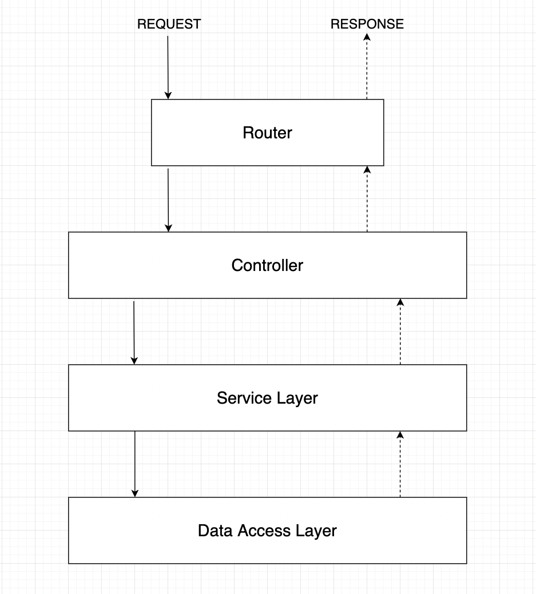

Внутри **Controller** мы будем обрабатывать все, что связано с HTTP. Это означает, что мы будем работать с запросами и ответами для наших конечных точек. Над этим слоем также находится небольшой **маршрутизатор** из Express, который передает запросы соответствующему контроллеру.

Вся бизнес-логика будет находиться в **Service Layer**, который экспортирует определенные сервисы (методы), используемые контроллером.

Третий слой - это **Слой доступа к данным**, где мы будем работать с нашей базой данных. Мы будем экспортировать некоторые методы для определенных операций с базой данных, таких как создание WOD, которые могут быть использованы нашим сервисным слоем.

В нашем примере мы не будем использовать _реальную_ базу данных, такую как MongoDB или PostgreSQL, поскольку я хотел бы сосредоточиться на лучших практиках. Поэтому мы используем локальный JSON-файл, который имитирует нашу базу данных. Но эту логику, конечно, можно перенести и на другие базы данных.

### Базовая настройка

Теперь мы должны быть готовы создать базовую настройку для нашего API. Мы не будем усложнять и построим простую, но организованную структуру проекта.

Сначала создадим общую структуру папок со всеми необходимыми файлами и зависимостями. После этого проведем быстрый тест, чтобы проверить, все ли работает правильно:

```shell
# Create project folder & navigate into it
mkdir crossfit-wod-api && cd crossfit-wod-api
```

```shell
# Create a src folder & navigate into it
mkdir src && cd src
```

```shell
# Create sub folders
mkdir controllers && mkdir services && mkdir database && mkdir routes
```

```shell
# Create an index file (entry point of our API)
touch index.js
```

```shell
# We're currently in the src folder, so we need to move one level up first
cd ..

# Create package.json file
npm init -y
```

Установите зависимости для базовой установки:

```shell
# Dev Dependencies
npm i -D nodemon

# Dependencies
npm i express
```

Откройте проект в вашем любимом текстовом редакторе и настройте Express:

```js
// In src/index.js
const express = require('express');

const app = express();
const PORT = process.env.PORT || 3000;

// For testing purposes
app.get('/', (req, res) => {
    res.send("<h2>It's Working!</h2>");
});

app.listen(PORT, () => {
    console.log(`API is listening on port ${PORT}`);
});
```

Интегрируйте новый скрипт под названием **"dev "** в файл `package.json`:

```json
{
    "name": "crossfit-wod-api",
    "version": "1.0.0",
    "description": "",
    "main": "index.js",
    "scripts": {
        "dev": "nodemon src/index.js"
    },
    "keywords": [],
    "author": "",
    "license": "ISC",
    "devDependencies": {
        "nodemon": "^2.0.15"
    },
    "dependencies": {
        "express": "^4.17.3"
    }
}
```

Сценарий обеспечивает автоматический перезапуск сервера разработки при внесении изменений (благодаря `nodemon`).

Запустите сервер разработки:

```shell
npm run dev
```

Посмотрите в терминал, там должно появиться сообщение о том, что **"API прослушивает порт 3000"**.

Зайдите на **localhost:3000** в браузере. Если все настроено правильно, вы должны увидеть следующее:


Отлично! Теперь у нас все готово для внедрения лучших практик.

## REST API лучшие практики

Да! Теперь, когда у нас есть базовая настройка Express, мы можем расширить наш API с помощью следующих лучших практик.

Начнем с фундаментальных конечных точек CRUD. После этого мы будем расширять API с помощью каждой из лучших практик.

### Версионирование

Подождите секунду. Прежде чем писать код, специфичный для API, мы должны знать о версионировании. Как и в других приложениях, в API будут появляться улучшения, новые возможности и т.п. Поэтому важно версифицировать и наш API.

Большим преимуществом является то, что мы можем работать над новыми возможностями или улучшениями в новой версии, в то время как клиенты все еще используют текущую версию и не подвержены влиянию изменений.

Кроме того, мы не заставляем клиентов сразу переходить на новую версию. Они могут использовать текущую версию и перейти на нее самостоятельно, когда новая версия станет стабильной.

Текущая и новая версии, по сути, работают параллельно и не влияют друг на друга.

Но как отличить версии друг от друга? Одна из эффективных практик - добавление в URL сегмента пути, например **v1** или **v2**.

```js
// Version 1
'/api/v1/workouts';

// Version 2
'/api/v2/workouts';

// ...

```

Это то, что мы выставляем на всеобщее обозрение и что может быть использовано другими разработчиками. Но нам также необходимо структурировать наш проект, чтобы различать каждую версию.

Существует множество различных подходов к работе с версиями внутри Express API. В нашем случае я хотел бы создать внутри каталога `src` вложенную папку для каждой версии под названием `v1`.

```shell
mkdir src/v1
```

Теперь мы перенесем нашу папку `routes` в этот новый каталог v1.

```shell
# Get the path to your current directory (copy it)
pwd

# Move "routes" into "v1" (insert the path from above into {pwd})
mv {pwd}/src/routes {pwd}/src/v1
```

В новом каталоге `/src/v1/routes` будут храниться все наши маршруты для версии 1. Позже мы добавим "реальное" содержимое. А пока давайте добавим простой файл `index.js` для проверки.

```shell
# In /src/v1/routes
touch index.js
```

Внутри него мы запускаем простой маршрутизатор.

```js
// In src/v1/routes/index.js
const express = require('express');
const router = express.Router();

router.route('/').get((req, res) => {
    res.send(`<h2>Hello from ${req.baseUrl}</h2>`);
});

module.exports = router;
```

Теперь нам нужно хукнуть наш маршрутизатор для v1 в корневой точке входа в `src/index.js`.

```js
// In src/index.js
const express = require('express');
// *** ADD ***
const v1Router = require('./v1/routes');

const app = express();
const PORT = process.env.PORT || 3000;

// *** REMOVE ***
app.get('/', (req, res) => {
    res.send("<h2>It's Working!</h2>");
});

// *** ADD ***
app.use('/api/v1', v1Router);

app.listen(PORT, () => {
    console.log(`API is listening on port ${PORT}`);
});
```

Теперь посетите `localhost:3000/api/v1` в браузере, и вы должны увидеть следующее:


Поздравляем! Вы только что структурировали проект для работы с различными версиями. Теперь мы передаем входящие запросы с "`/api/v1`" нашему маршрутизатору версии 1, который в дальнейшем будет направлять каждый запрос в соответствующий метод контроллера.

Прежде чем мы двинемся дальше, я хотел бы кое-что отметить.

Мы только что переместили папку `routes` в каталог `v1`. Остальные папки, такие как `controllers` или `services`, по-прежнему находятся в каталоге `src`. Пока что это нормально, поскольку мы создаем довольно небольшой API. Мы можем глобально использовать одни и те же контроллеры и сервисы в каждой версии.

Когда API будет расти и потребуются различные методы контроллеров, специфичные, например, для версии v2, будет лучше перенести папку `controllers` в каталог `v2`, чтобы вся логика, специфичная для этой версии, была инкапсулирована.

Другая причина может заключаться в том, что мы можем изменить сервис, который используется всеми остальными версиями. Мы не хотим ломать что-то в других версиях. Поэтому разумным решением будет перенести папку `services` также в папку конкретной версии.

Но, как я уже сказал, в нашем примере мне достаточно различать только маршруты, а все остальное пусть делает маршрутизатор. Тем не менее, важно помнить об этом, чтобы иметь четкую структуру, когда API будет расширяться и потребует изменений.

### Именование ресурсов во множественном числе

После настройки всего этого мы можем приступить к реальной реализации нашего API. Как я уже сказал, я хотел бы начать с наших фундаментальных конечных точек CRUD.

Другими словами, начнем реализовывать конечные точки для создания, чтения, обновления и удаления отработок.

Для начала давайте хукнем контроллер, сервис и маршрутизатор для наших тренировок.

```shell
touch src/controllers/workoutController.js

touch src/services/workoutService.js

touch src/v1/routes/workoutRoutes.js
```

Я всегда предпочитаю начинать с маршрутов. Давайте подумаем, как назвать наши конечные точки. Это связано с конкретной лучшей практикой.

Мы можем назвать конечную точку создания `/api/v1/workout`, потому что мы хотим добавить одну тренировку, верно? В принципе, в таком подходе нет ничего плохого - но это может привести к недоразумениям.

Всегда помните: ваш API используется другими людьми, и он должен быть точным. Это касается и именования ресурсов.

Я всегда представляю себе ресурс как коробку. В нашем примере коробка - это коллекция, в которой хранятся различные **тренировки**.

Именование ресурсов во множественном числе имеет то преимущество, что другим людям совершенно ясно, что это коллекция, состоящая из различных тренировок.

Итак, давайте определим конечные точки внутри нашего маршрутизатора тренировок.

```js
// In src/v1/routes/workoutRoutes.js
const express = require('express');
const router = express.Router();

router.get('/', (req, res) => {
    res.send('Get all workouts');
});

router.get('/:workoutId', (req, res) => {
    res.send('Get an existing workout');
});

router.post('/', (req, res) => {
    res.send('Create a new workout');
});

router.patch('/:workoutId', (req, res) => {
    res.send('Update an existing workout');
});

router.delete('/:workoutId', (req, res) => {
    res.send('Delete an existing workout');
});

module.exports = router;
```

Вы можете удалить наш тестовый файл `index.js` внутри `src/v1/routes`.

Теперь перейдем к нашей точке входа и подключим наш маршрутизатор v1.

```js
// In src/index.js
const express = require('express');
// *** REMOVE ***
const v1Router = require('./v1/routes');
// *** ADD ***
const v1WorkoutRouter = require('./v1/routes/workoutRoutes');

const app = express();
const PORT = process.env.PORT || 3000;

// *** REMOVE ***
app.use('/api/v1', v1Router);

// *** ADD ***
app.use('/api/v1/workouts', v1WorkoutRouter);

app.listen(PORT, () => {
    console.log(`API is listening on port ${PORT}`);
});
```

Все прошло гладко, верно? Теперь мы перехватываем все запросы, идущие к `/api/v1/workouts`, с помощью нашего маршрутизатора `v1WorkoutRouter`.

Внутри маршрутизатора для каждой конечной точки мы будем вызывать свой метод, управляемый нашим контроллером.

Давайте создадим метод для каждой конечной точки. Пока достаточно просто отправить сообщение.

```js
// In src/controllers/workoutController.js
const getAllWorkouts = (req, res) => {
    res.send('Get all workouts');
};

const getOneWorkout = (req, res) => {
    res.send('Get an existing workout');
};

const createNewWorkout = (req, res) => {
    res.send('Create a new workout');
};

const updateOneWorkout = (req, res) => {
    res.send('Update an existing workout');
};

const deleteOneWorkout = (req, res) => {
    res.send('Delete an existing workout');
};

module.exports = {
    getAllWorkouts,
    getOneWorkout,
    createNewWorkout,
    updateOneWorkout,
    deleteOneWorkout,
};
```

Теперь пришло время немного рефакторить наш маршрутизатор и использовать методы контроллера.

```js
// In src/v1/routes/workoutRoutes.js
const express = require('express');
const workoutController = require('../../controllers/workoutController');

const router = express.Router();

router.get('/', workoutController.getAllWorkouts);

router.get('/:workoutId', workoutController.getOneWorkout);

router.post('/', workoutController.createNewWorkout);

router.patch(
    '/:workoutId',
    workoutController.updateOneWorkout
);

router.delete(
    '/:workoutId',
    workoutController.deleteOneWorkout
);

module.exports = router;
```

Теперь мы можем протестировать нашу конечную точку `GET /api/v1/workouts/:workoutId`, набрав в браузере `localhost:3000/api/v1/workouts/2342`. Вы должны увидеть нечто подобное:


Мы сделали это! Первый слой нашей архитектуры готов. Давайте создадим наш сервисный слой, реализовав следующую лучшую практику.

### Принимать и отвечать данными в формате JSON

Взаимодействуя с API, вы всегда отправляете определенные данные с запросом или получаете их в ответ. Существует множество различных форматов данных, но JSON (Javascript Object Notation) является стандартизованным форматом.

Хотя в JSON присутствует термин **JavaScript**, он не привязан конкретно к нему. Вы также можете написать свой API на Java или Python, который также может работать с JSON.

В силу своей стандартизации API должны принимать данные в формате JSON и отвечать на них.

Давайте рассмотрим нашу текущую реализацию и посмотрим, как мы можем интегрировать эту лучшую практику.

Сначала мы создадим наш сервисный слой.

```js
// In src/services/workoutService.js
const getAllWorkouts = () => {
    return;
};

const getOneWorkout = () => {
    return;
};

const createNewWorkout = () => {
    return;
};

const updateOneWorkout = () => {
    return;
};

const deleteOneWorkout = () => {
    return;
};

module.exports = {
    getAllWorkouts,
    getOneWorkout,
    createNewWorkout,
    updateOneWorkout,
    deleteOneWorkout,
};
```

Также рекомендуется называть методы сервиса так же, как и методы контроллера, чтобы между ними была связь. Начнем с того, что мы просто ничего не возвращаем.

Внутри нашего контроллера `workout` мы можем использовать эти методы.

```js
// In src/controllers/workoutController.js
// *** ADD ***
const workoutService = require('../services/workoutService');

const getAllWorkouts = (req, res) => {
    // *** ADD ***
    const allWorkouts = workoutService.getAllWorkouts();
    res.send('Get all workouts');
};

const getOneWorkout = (req, res) => {
    // *** ADD ***
    const workout = workoutService.getOneWorkout();
    res.send('Get an existing workout');
};

const createNewWorkout = (req, res) => {
    // *** ADD ***
    const createdWorkout = workoutService.createNewWorkout();
    res.send('Create a new workout');
};

const updateOneWorkout = (req, res) => {
    // *** ADD ***
    const updatedWorkout = workoutService.updateOneWorkout();
    res.send('Update an existing workout');
};

const deleteOneWorkout = (req, res) => {
    // *** ADD ***
    workoutService.deleteOneWorkout();
    res.send('Delete an existing workout');
};

module.exports = {
    getAllWorkouts,
    getOneWorkout,
    createNewWorkout,
    updateOneWorkout,
    deleteOneWorkout,
};
```

На данный момент внутри наших ответов ничего не должно измениться. Но под капотом наш слой контроллеров теперь взаимодействует с нашим сервисным слоем.

Внутри сервисных методов мы будем обрабатывать бизнес-логику, например, преобразовывать структуры данных и взаимодействовать со слоем баз данных.

Для этого нам нужна база данных и набор методов, которые, собственно, и обеспечивают взаимодействие с базой данных. Наша база данных будет представлять собой простой JSON-файл, предварительно заполненный некоторыми отработками.

```shell
# Create a new file called db.json inside src/database
touch src/database/db.json

# Create a Workout File that stores all workout specific methods in /src/database
touch src/database/Workout.js
```

Скопируйте в файл `db.json` следующее:

```json
{
    "workouts": [
        {
            "id": "61dbae02-c147-4e28-863c-db7bd402b2d6",
            "name": "Tommy V",
            "mode": "For Time",
            "equipment": ["barbell", "rope"],
            "exercises": [
                "21 thrusters",
                "12 rope climbs, 15 ft",
                "15 thrusters",
                "9 rope climbs, 15 ft",
                "9 thrusters",
                "6 rope climbs, 15 ft"
            ],
            "createdAt": "4/20/2022, 2:21:56 PM",
            "updatedAt": "4/20/2022, 2:21:56 PM",
            "trainerTips": [
                "Split the 21 thrusters as needed",
                "Try to do the 9 and 6 thrusters unbroken",
                "RX Weights: 115lb/75lb"
            ]
        },
        {
            "id": "4a3d9aaa-608c-49a7-a004-66305ad4ab50",
            "name": "Dead Push-Ups",
            "mode": "AMRAP 10",
            "equipment": ["barbell"],
            "exercises": [
                "15 deadlifts",
                "15 hand-release push-ups"
            ],
            "createdAt": "1/25/2022, 1:15:44 PM",
            "updatedAt": "3/10/2022, 8:21:56 AM",
            "trainerTips": [
                "Deadlifts are meant to be light and fast",
                "Try to aim for unbroken sets",
                "RX Weights: 135lb/95lb"
            ]
        },
        {
            "id": "d8be2362-7b68-4ea4-a1f6-03f8bc4eede7",
            "name": "Heavy DT",
            "mode": "5 Rounds For Time",
            "equipment": ["barbell", "rope"],
            "exercises": [
                "12 deadlifts",
                "9 hang power cleans",
                "6 push jerks"
            ],
            "createdAt": "11/20/2021, 5:39:07 PM",
            "updatedAt": "11/20/2021, 5:39:07 PM",
            "trainerTips": [
                "Aim for unbroken push jerks",
                "The first three rounds might feel terrible, but stick to it",
                "RX Weights: 205lb/145lb"
            ]
        }
    ]
}
```

Как видно, здесь вставлены три тренировки. Одна тренировка состоит из `id`, `name`, `mode`, `equipment`, `exercises`, `createdAt`, `updatedAt` и `trainerTips`.

Начнем с самого простого - вернем все тренировки, которые хранятся в памяти, и приступим к реализации соответствующего метода в нашем Data Access Layer (`src/database/Workout.js`).

Опять же, я решил назвать метод здесь так же, как и в сервисе и контроллере. Но это совершенно необязательно.

```js
// In src/database/Workout.js
const DB = require('./db.json');

const getAllWorkouts = () => {
    return DB.workouts;
};

module.exports = { getAllWorkouts };
```

Вернитесь в наш сервис тренировок и реализуйте логику для `getAllWorkouts`.

```js
// In src/database/workoutService.js
// *** ADD ***
const Workout = require('../database/Workout');
const getAllWorkouts = () => {
    // *** ADD ***
    const allWorkouts = Workout.getAllWorkouts();
    // *** ADD ***
    return allWorkouts;
};

const getOneWorkout = () => {
    return;
};

const createNewWorkout = () => {
    return;
};

const updateOneWorkout = () => {
    return;
};

const deleteOneWorkout = () => {
    return;
};

module.exports = {
    getAllWorkouts,
    getOneWorkout,
    createNewWorkout,
    updateOneWorkout,
    deleteOneWorkout,
};
```

Возврат всех вычислений довольно прост, и нам не нужно выполнять преобразования, поскольку это уже JSON-файл. Нам также пока не нужно принимать никаких аргументов. Таким образом, эта реализация довольно проста. Но мы вернемся к этому позже.

Вернувшись в контроллер тренировок, мы получаем возвращаемое значение из `workoutService.getAllWorkouts()` и просто отправляем его в качестве ответа клиенту. Мы передали ответ базы данных через наш сервис в контроллер.

```js
// In src/controllers/workoutControllers.js
const workoutService = require('../services/workoutService');

const getAllWorkouts = (req, res) => {
    const allWorkouts = workoutService.getAllWorkouts();
    // *** ADD ***
    res.send({ status: 'OK', data: allWorkouts });
};

const getOneWorkout = (req, res) => {
    const workout = workoutService.getOneWorkout();
    res.send('Get an existing workout');
};

const createNewWorkout = (req, res) => {
    const createdWorkout = workoutService.createNewWorkout();
    res.send('Create a new workout');
};

const updateOneWorkout = (req, res) => {
    const updatedWorkout = workoutService.updateOneWorkout();
    res.send('Update an existing workout');
};

const deleteOneWorkout = (req, res) => {
    workoutService.deleteOneWorkout();
    res.send('Delete an existing workout');
};

module.exports = {
    getAllWorkouts,
    getOneWorkout,
    createNewWorkout,
    updateOneWorkout,
    deleteOneWorkout,
};
```

Перейдите по адресу `localhost:3000/api/v1/workouts` в браузере, и вы увидите JSON-ответ.

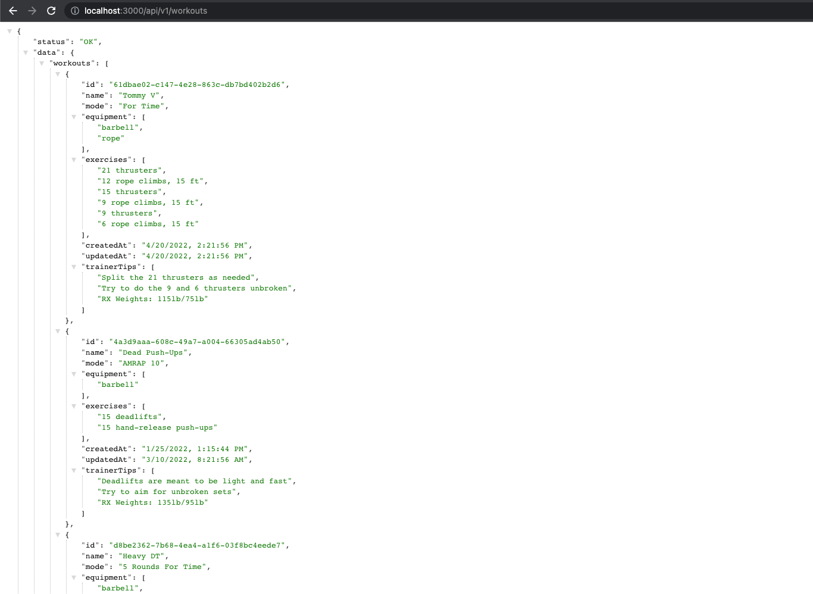

Все прошло отлично! Мы отправляем данные в формате JSON. Но как быть с его приемом? Давайте подумаем, в какой конечной точке нам нужно получить от клиента данные в формате JSON. Конечная точка для создания или обновления тренировки нуждается в данных от клиента.

Внутри нашего контроллера тренировок мы извлекаем тело запроса на создание новой тренировки и передаем его в сервис тренировок. Внутри сервиса `workout` мы вставим его в наш `DB.json` и отправим созданную тренировку обратно клиенту.

Чтобы иметь возможность разобрать присланный JSON внутри тела запроса, нам необходимо сначала установить `body-parser` и настроить его.

```shell
npm i body-parser
```

```js
// In src/index.js
const express = require('express');
// *** ADD ***
const bodyParser = require('body-parser');
const v1WorkoutRouter = require('./v1/routes/workoutRoutes');

const app = express();
const PORT = process.env.PORT || 3000;

// *** ADD ***
app.use(bodyParser.json());
app.use('/api/v1/workouts', v1WorkoutRouter);

app.listen(PORT, () => {
    console.log(`API is listening on port ${PORT}`);
});
```

Теперь мы можем получать JSON-данные внутри наших контроллеров в `req.body`.

Для того чтобы проверить это, просто откройте ваш любимый HTTP-клиент (я использую Postman), создайте POST-запрос на `localhost:3000/api/v1/workouts` и тело запроса в формате JSON, как показано ниже:

```js
{
  "name": "Core Buster",
  "mode": "AMRAP 20",
  "equipment": [
    "rack",
    "barbell",
    "abmat"
  ],
  "exercises": [
    "15 toes to bars",
    "10 thrusters",
    "30 abmat sit-ups"
  ],
  "trainerTips": [
    "Split your toes to bars into two sets maximum",
    "Go unbroken on the thrusters",
    "Take the abmat sit-ups as a chance to normalize your breath"
  ]
}
```

Как вы могли заметить, некоторые свойства, такие как "id", "createdAt" и "updatedAt", отсутствуют. Это задача нашего API - добавить эти свойства перед вставкой. Мы позаботимся об этом в нашем сервисе тренировок позже.

Внутри метода **createNewWorkout** нашего контроллера тренировок мы можем извлечь тело из объекта запроса, выполнить некоторую проверку и передать его в качестве аргумента нашему сервису тренировок.

```js
// In src/controllers/workoutController.js
// ...

const createNewWorkout = (req, res) => {
    const { body } = req;
    // *** ADD ***
    if (
        !body.name ||
        !body.mode ||
        !body.equipment ||
        !body.exercises ||
        !body.trainerTips
    ) {
        return;
    }
    // *** ADD ***
    const newWorkout = {
        name: body.name,
        mode: body.mode,
        equipment: body.equipment,
        exercises: body.exercises,
        trainerTips: body.trainerTips,
    };
    // *** ADD ***
    const createdWorkout = workoutService.createNewWorkout(
        newWorkout
    );
    // *** ADD ***
    res.status(201).send({
        status: 'OK',
        data: createdWorkout,
    });
};

// ...
```

Для улучшения проверки запросов обычно используется сторонний пакет, например [express-validator](https://express-validator.github.io/docs/).

Перейдем в наш сервис тренировок и получим данные в методе `createNewWorkout`.

После этого добавим к объекту недостающие свойства и передадим его новому методу в нашем слое доступа к данным, чтобы сохранить его в нашей БД.

Сначала мы создадим простую функцию Util Function для перезаписи нашего JSON-файла, чтобы сохранить данные.

```shell
# Create a utils file inside our database directory
touch src/database/utils.js
```

```js
// In src/database/utils.js
const fs = require('fs');

const saveToDatabase = (DB) => {
    fs.writeFileSync(
        './src/database/db.json',
        JSON.stringify(DB, null, 2),
        {
            encoding: 'utf-8',
        }
    );
};

module.exports = { saveToDatabase };
```

Затем мы можем использовать эту функцию в нашем файле `Workout.js`.

```js
// In src/database/Workout.js
const DB = require('./db.json');
// *** ADD ***
const { saveToDatabase } = require('./utils');

const getAllWorkouts = () => {
    return DB.workouts;
};

// *** ADD ***
const createNewWorkout = (newWorkout) => {
    const isAlreadyAdded =
        DB.workouts.findIndex(
            (workout) => workout.name === newWorkout.name
        ) > -1;
    if (isAlreadyAdded) {
        return;
    }
    DB.workouts.push(newWorkout);
    saveToDatabase(DB);
    return newWorkout;
};

module.exports = {
    getAllWorkouts,
    // *** ADD ***
    createNewWorkout,
};
```

Все прошло гладко! Следующий шаг - использование методов базы данных внутри нашего сервиса `workout`.

```shell
# Install the uuid package
npm i uuid
```

```js
// In src/services/workoutService.js
// *** ADD ***
const { v4: uuid } = require('uuid');
// *** ADD ***
const Workout = require('../database/Workout');

const getAllWorkouts = () => {
    const allWorkouts = Workout.getAllWorkouts();
    return allWorkouts;
};

const getOneWorkout = () => {
    return;
};

const createNewWorkout = (newWorkout) => {
    // *** ADD ***
    const workoutToInsert = {
        ...newWorkout,
        id: uuid(),
        createdAt: new Date().toLocaleString('en-US', {
            timeZone: 'UTC',
        }),
        updatedAt: new Date().toLocaleString('en-US', {
            timeZone: 'UTC',
        }),
    };
    // *** ADD ***
    const createdWorkout = Workout.createNewWorkout(
        workoutToInsert
    );
    return createdWorkout;
};

const updateOneWorkout = () => {
    return;
};

const deleteOneWorkout = () => {
    return;
};

module.exports = {
    getAllWorkouts,
    getOneWorkout,
    createNewWorkout,
    updateOneWorkout,
    deleteOneWorkout,
};
```

Ух ты! Это было весело, правда? Теперь вы можете обратиться к своему HTTP-клиенту, снова отправить POST-запрос, и вы должны получить только что созданную тренировку в формате JSON.

Если вы попытаетесь добавить ту же тренировку во второй раз, то получите код состояния `201`, но без новой вставленной тренировки.

Это означает, что наш метод базы данных пока отменяет вставку и просто ничего не возвращает. Это связано с тем, что сработал наш оператор `if`, проверяющий, не была ли уже вставлена тренировка с таким же именем. Пока все в порядке, мы разберемся с этим случаем в следующем примере!

Теперь отправим GET-запрос на `localhost:3000/api/v1/workouts`, чтобы прочитать все тренировки. Я выбираю для этого браузер. Вы должны увидеть, что наша тренировка успешно вставлена и сохранена:

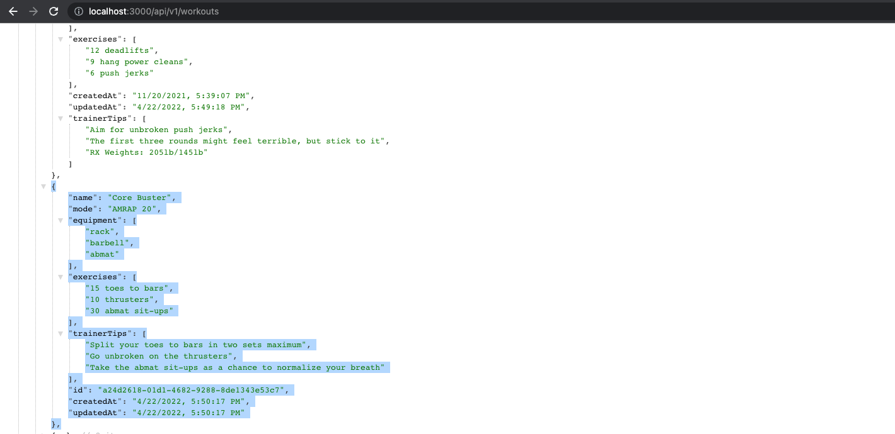

Остальные методы вы можете реализовать самостоятельно или просто скопировать мои реализации.

Сначала контроллер тренировки (можно просто скопировать все содержимое):

```js
// In src/controllers/workoutController.js
const workoutService = require('../services/workoutService');

const getAllWorkouts = (req, res) => {
    const allWorkouts = workoutService.getAllWorkouts();
    res.send({ status: 'OK', data: allWorkouts });
};

const getOneWorkout = (req, res) => {
    const {
        params: { workoutId },
    } = req;
    if (!workoutId) {
        return;
    }
    const workout = workoutService.getOneWorkout(workoutId);
    res.send({ status: 'OK', data: workout });
};

const createNewWorkout = (req, res) => {
    const { body } = req;
    if (
        !body.name ||
        !body.mode ||
        !body.equipment ||
        !body.exercises ||
        !body.trainerTips
    ) {
        return;
    }
    const newWorkout = {
        name: body.name,
        mode: body.mode,
        equipment: body.equipment,
        exercises: body.exercises,
        trainerTips: body.trainerTips,
    };
    const createdWorkout = workoutService.createNewWorkout(
        newWorkout
    );
    res.status(201).send({
        status: 'OK',
        data: createdWorkout,
    });
};

const updateOneWorkout = (req, res) => {
    const {
        body,
        params: { workoutId },
    } = req;
    if (!workoutId) {
        return;
    }
    const updatedWorkout = workoutService.updateOneWorkout(
        workoutId,
        body
    );
    res.send({ status: 'OK', data: updatedWorkout });
};

const deleteOneWorkout = (req, res) => {
    const {
        params: { workoutId },
    } = req;
    if (!workoutId) {
        return;
    }
    workoutService.deleteOneWorkout(workoutId);
    res.status(204).send({ status: 'OK' });
};

module.exports = {
    getAllWorkouts,
    getOneWorkout,
    createNewWorkout,
    updateOneWorkout,
    deleteOneWorkout,
};
```

Затем - сервис тренировки (можно просто скопировать все содержимое):

```js
// In src/services/workoutServices.js
const { v4: uuid } = require('uuid');
const Workout = require('../database/Workout');

const getAllWorkouts = () => {
    const allWorkouts = Workout.getAllWorkouts();
    return allWorkouts;
};

const getOneWorkout = (workoutId) => {
    const workout = Workout.getOneWorkout(workoutId);
    return workout;
};

const createNewWorkout = (newWorkout) => {
    const workoutToInsert = {
        ...newWorkout,
        id: uuid(),
        createdAt: new Date().toLocaleString('en-US', {
            timeZone: 'UTC',
        }),
        updatedAt: new Date().toLocaleString('en-US', {
            timeZone: 'UTC',
        }),
    };
    const createdWorkout = Workout.createNewWorkout(
        workoutToInsert
    );
    return createdWorkout;
};

const updateOneWorkout = (workoutId, changes) => {
    const updatedWorkout = Workout.updateOneWorkout(
        workoutId,
        changes
    );
    return updatedWorkout;
};

const deleteOneWorkout = (workoutId) => {
    Workout.deleteOneWorkout(workoutId);
};

module.exports = {
    getAllWorkouts,
    getOneWorkout,
    createNewWorkout,
    updateOneWorkout,
    deleteOneWorkout,
};
```

И, наконец, методы нашей базы данных внутри Data Access Layer (можно просто скопировать все содержимое):

```js
// In src/database/Workout.js
const DB = require('./db.json');
const { saveToDatabase } = require('./utils');

const getAllWorkouts = () => {
    return DB.workouts;
};

const getOneWorkout = (workoutId) => {
    const workout = DB.workouts.find(
        (workout) => workout.id === workoutId
    );
    if (!workout) {
        return;
    }
    return workout;
};

const createNewWorkout = (newWorkout) => {
    const isAlreadyAdded =
        DB.workouts.findIndex(
            (workout) => workout.name === newWorkout.name
        ) > -1;
    if (isAlreadyAdded) {
        return;
    }
    DB.workouts.push(newWorkout);
    saveToDatabase(DB);
    return newWorkout;
};

const updateOneWorkout = (workoutId, changes) => {
    const indexForUpdate = DB.workouts.findIndex(
        (workout) => workout.id === workoutId
    );
    if (indexForUpdate === -1) {
        return;
    }
    const updatedWorkout = {
        ...DB.workouts[indexForUpdate],
        ...changes,
        updatedAt: new Date().toLocaleString('en-US', {
            timeZone: 'UTC',
        }),
    };
    DB.workouts[indexForUpdate] = updatedWorkout;
    saveToDatabase(DB);
    return updatedWorkout;
};

const deleteOneWorkout = (workoutId) => {
    const indexForDeletion = DB.workouts.findIndex(
        (workout) => workout.id === workoutId
    );
    if (indexForDeletion === -1) {
        return;
    }
    DB.workouts.splice(indexForDeletion, 1);
    saveToDatabase(DB);
};

module.exports = {
    getAllWorkouts,
    createNewWorkout,
    getOneWorkout,
    updateOneWorkout,
    deleteOneWorkout,
};
```

Отлично! Давайте перейдем к следующей лучшей практике и посмотрим, как правильно обрабатывать ошибки.

### Отвечать стандартными кодами ошибок HTTP

Мы зашли уже довольно далеко, но еще не закончили. Теперь наш API способен выполнять базовые CRUD-операции с хранением данных. Это замечательно, но не совсем идеально.

Почему? Сейчас объясню.

В идеальном мире все работает гладко и без ошибок. Но, как вы, наверное, знаете, в реальном мире может произойти множество ошибок - как с человеческой, так и с технической точки зрения.

Вам, наверное, знакомо это странное чувство, когда все работает с самого начала без каких-либо ошибок. Это здорово и приятно, но как разработчики мы больше привыкли к тому, что все работает неправильно. 😁

То же самое относится и к нашему API. Мы должны обрабатывать определенные случаи, которые могут пойти не так, как надо, или привести к ошибке. Это также повысит надежность нашего API.

Когда что-то идет не так (либо в запросе, либо внутри нашего API), мы отправляем обратно коды ошибок HTTP. Я видел и использовал API, которые постоянно возвращали код ошибки `400`, когда запрос был ошибочным, без какого-либо конкретного сообщения о том, ПОЧЕМУ произошла эта ошибка или в чем она заключалась. Поэтому отладка становилась мучением.

Именно поэтому хорошей практикой является возврат соответствующих кодов ошибок HTTP для различных случаев. Это помогает потребителю или инженеру, создавшему API, легче определить проблему.

Для улучшения качества работы мы также можем отправить быстрое сообщение об ошибке вместе с ответом на нее. Но, как я уже писал во введении, это не всегда разумно и должно быть продумано самим инженером.

Например, возврат чего-то вроде **"Имя пользователя уже зарегистрировано"** должен быть хорошо продуман, поскольку вы предоставляете информацию о своих пользователях, которую следует скрывать.

В нашем Crossfit API мы рассмотрим конечную точку создания и увидим, какие ошибки могут возникнуть и как их можно разрешить. В конце этого совета вы найдете полную реализацию других конечных точек.

Начнем с метода `createNewWorkout` внутри нашего контроллера тренировок:

```js
// In src/controllers/workoutController.js
// ...

const createNewWorkout = (req, res) => {
    const { body } = req;
    if (
        !body.name ||
        !body.mode ||
        !body.equipment ||
        !body.exercises ||
        !body.trainerTips
    ) {
        return;
    }
    const newWorkout = {
        name: body.name,
        mode: body.mode,
        equipment: body.equipment,
        exercises: body.exercises,
        trainerTips: body.trainerTips,
    };
    const createdWorkout = workoutService.createNewWorkout(
        newWorkout
    );
    res.status(201).send({
        status: 'OK',
        data: createdWorkout,
    });
};

// ...
```

Мы уже отловили случай, когда тело запроса построено неправильно и в нем отсутствуют ожидаемые нами ключи.

Это хороший пример для отправки в ответ HTTP-ошибки `400` с соответствующим сообщением об ошибке.

```js
// In src/controllers/workoutController.js
// ...

const createNewWorkout = (req, res) => {
    const { body } = req;
    if (
        !body.name ||
        !body.mode ||
        !body.equipment ||
        !body.exercises ||
        !body.trainerTips
    ) {
        res.status(400).send({
            status: 'FAILED',
            data: {
                error:
                    "One of the following keys is missing or is empty in request body: 'name', 'mode', 'equipment', 'exercises', 'trainerTips'",
            },
        });
        return;
    }
    const newWorkout = {
        name: body.name,
        mode: body.mode,
        equipment: body.equipment,
        exercises: body.exercises,
        trainerTips: body.trainerTips,
    };
    const createdWorkout = workoutService.createNewWorkout(
        newWorkout
    );
    res.status(201).send({
        status: 'OK',
        data: createdWorkout,
    });
};

// ...
```

Если мы попытаемся добавить новую тренировку, но забудем указать свойство "mode" в теле запроса, то увидим сообщение об ошибке вместе с кодом ошибки `400` HTTP.

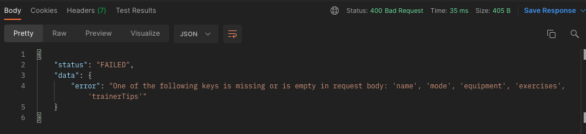

Разработчик, использующий API, теперь лучше осведомлен о том, на что следует обратить внимание. Он сразу понимает, что нужно зайти в тело запроса и посмотреть, не пропустил ли он одно из необходимых свойств.

Пока можно оставить это сообщение об ошибке более общим для всех свойств. Обычно для этого используется валидатор схемы.

Давайте заглянем на один уровень глубже в наш сервис тренировок и посмотрим, какие потенциальные ошибки могут возникнуть.

```js
// In src/services/workoutService.js
// ...

const createNewWorkout = (newWorkout) => {
    const workoutToInsert = {
        ...newWorkout,
        id: uuid(),
        createdAt: new Date().toLocaleString('en-US', {
            timeZone: 'UTC',
        }),
        updatedAt: new Date().toLocaleString('en-US', {
            timeZone: 'UTC',
        }),
    };
    const createdWorkout = Workout.createNewWorkout(
        workoutToInsert
    );
    return createdWorkout;
};

// ...
```

Одна вещь, которая может пойти не так, - это вставка в базу данных `Workout.createNewWorkout()`. Я предпочитаю обернуть этот процесс в блок `try`/`catch`, чтобы поймать ошибку, когда она произойдет.

```js
// In src/services/workoutService.js
// ...

const createNewWorkout = (newWorkout) => {
    const workoutToInsert = {
        ...newWorkout,
        id: uuid(),
        createdAt: new Date().toLocaleString('en-US', {
            timeZone: 'UTC',
        }),
        updatedAt: new Date().toLocaleString('en-US', {
            timeZone: 'UTC',
        }),
    };
    try {
        const createdWorkout = Workout.createNewWorkout(
            workoutToInsert
        );
        return createdWorkout;
    } catch (error) {
        throw error;
    }
};

// ...
```

Каждая ошибка, возникающая в методе `Workout.createNewWorkout()`, будет перехвачена в нашем блоке `catch`. Мы просто возвращаем ее обратно, чтобы позже скорректировать наши ответы внутри контроллера.

Давайте определим наши ошибки в файле `Workout.js`:

```js
// In src/database/Workout.js
// ...

const createNewWorkout = (newWorkout) => {
    const isAlreadyAdded =
        DB.workouts.findIndex(
            (workout) => workout.name === newWorkout.name
        ) > -1;
    if (isAlreadyAdded) {
        throw {
            status: 400,
            message: `Workout with the name '${newWorkout.name}' already exists`,
        };
    }
    try {
        DB.workouts.push(newWorkout);
        saveToDatabase(DB);
        return newWorkout;
    } catch (error) {
        throw {
            status: 500,
            message: error?.message || error,
        };
    }
};

// ...
```

Как видно, ошибка состоит из двух частей - статуса и сообщения. Я использую здесь только ключевое слово **`throw`**, чтобы передать не строку, а другую структуру данных, которая требуется в `throw new Error()`.

Небольшим недостатком простого отбрасывания является то, что мы не получаем трассировку стека. Но обычно отбрасыванием ошибок занимается сторонняя библиотека по нашему выбору (например, Mongoose, если вы используете базу данных MongoDB). Но для целей данного руководства это вполне достаточно.

Теперь мы можем отбрасывать и ловить ошибки на уровне сервиса и доступа к данным. Теперь мы можем перейти к контроллеру тренировки, отлавливать ошибки и реагировать на них соответствующим образом.

```js
// In src/controllers/workoutController.js
// ...

const createNewWorkout = (req, res) => {
    const { body } = req;
    if (
        !body.name ||
        !body.mode ||
        !body.equipment ||
        !body.exercises ||
        !body.trainerTips
    ) {
        res.status(400).send({
            status: 'FAILED',
            data: {
                error:
                    "One of the following keys is missing or is empty in request body: 'name', 'mode', 'equipment', 'exercises', 'trainerTips'",
            },
        });
        return;
    }
    const newWorkout = {
        name: body.name,
        mode: body.mode,
        equipment: body.equipment,
        exercises: body.exercises,
        trainerTips: body.trainerTips,
    };
    // *** ADD ***
    try {
        const createdWorkout = workoutService.createNewWorkout(
            newWorkout
        );
        res.status(201).send({
            status: 'OK',
            data: createdWorkout,
        });
    } catch (error) {
        res.status(error?.status || 500).send({
            status: 'FAILED',
            data: { error: error?.message || error },
        });
    }
};

// ...
```

Проверить это можно, дважды добавив одноименную заготовку или не указав необходимое свойство в теле запроса. Вместе с сообщением об ошибке вы должны получить соответствующие коды ошибок HTTP.

Чтобы закончить эту тему и перейти к следующему совету, вы можете скопировать остальные реализованные методы в следующие файлы или попробовать сделать это самостоятельно:

=== "workoutController.js"

    ```js
    // In src/controllers/workoutController.js
    const workoutService = require('../services/workoutService');

    const getAllWorkouts = (req, res) => {
    	try {
    		const allWorkouts = workoutService.getAllWorkouts();
    		res.send({ status: 'OK', data: allWorkouts });
    	} catch (error) {
    		res.status(error?.status || 500).send({
    			status: 'FAILED',
    			data: { error: error?.message || error },
    		});
    	}
    };

    const getOneWorkout = (req, res) => {
    	const {
    		params: { workoutId },
    	} = req;
    	if (!workoutId) {
    		res.status(400).send({
    			status: 'FAILED',
    			data: {
    				error:
    					"Parameter ':workoutId' can not be empty",
    			},
    		});
    	}
    	try {
    		const workout = workoutService.getOneWorkout(
    			workoutId
    		);
    		res.send({ status: 'OK', data: workout });
    	} catch (error) {
    		res.status(error?.status || 500).send({
    			status: 'FAILED',
    			data: { error: error?.message || error },
    		});
    	}
    };

    const createNewWorkout = (req, res) => {
    	const { body } = req;
    	if (
    		!body.name ||
    		!body.mode ||
    		!body.equipment ||
    		!body.exercises ||
    		!body.trainerTips
    	) {
    		res.status(400).send({
    			status: 'FAILED',
    			data: {
    				error:
    					"One of the following keys is missing or is empty in request body: 'name', 'mode', 'equipment', 'exercises', 'trainerTips'",
    			},
    		});
    		return;
    	}
    	const newWorkout = {
    		name: body.name,
    		mode: body.mode,
    		equipment: body.equipment,
    		exercises: body.exercises,
    		trainerTips: body.trainerTips,
    	};
    	try {
    		const createdWorkout = workoutService.createNewWorkout(
    			newWorkout
    		);
    		res.status(201).send({
    			status: 'OK',
    			data: createdWorkout,
    		});
    	} catch (error) {
    		res.status(error?.status || 500).send({
    			status: 'FAILED',
    			data: { error: error?.message || error },
    		});
    	}
    };

    const updateOneWorkout = (req, res) => {
    	const {
    		body,
    		params: { workoutId },
    	} = req;
    	if (!workoutId) {
    		res.status(400).send({
    			status: 'FAILED',
    			data: {
    				error:
    					"Parameter ':workoutId' can not be empty",
    			},
    		});
    	}
    	try {
    		const updatedWorkout = workoutService.updateOneWorkout(
    			workoutId,
    			body
    		);
    		res.send({ status: 'OK', data: updatedWorkout });
    	} catch (error) {
    		res.status(error?.status || 500).send({
    			status: 'FAILED',
    			data: { error: error?.message || error },
    		});
    	}
    };

    const deleteOneWorkout = (req, res) => {
    	const {
    		params: { workoutId },
    	} = req;
    	if (!workoutId) {
    		res.status(400).send({
    			status: 'FAILED',
    			data: {
    				error:
    					"Parameter ':workoutId' can not be empty",
    			},
    		});
    	}
    	try {
    		workoutService.deleteOneWorkout(workoutId);
    		res.status(204).send({ status: 'OK' });
    	} catch (error) {
    		res.status(error?.status || 500).send({
    			status: 'FAILED',
    			data: { error: error?.message || error },
    		});
    	}
    };

    module.exports = {
    	getAllWorkouts,
    	getOneWorkout,
    	createNewWorkout,
    	updateOneWorkout,
    	deleteOneWorkout,
    	getRecordsForWorkout,
    };
    ```

=== "workoutService.js"

    ```js
    // In src/services/workoutService.js
    const { v4: uuid } = require('uuid');
    const Workout = require('../database/Workout');

    const getAllWorkouts = () => {
    	try {
    		const allWorkouts = Workout.getAllWorkouts();
    		return allWorkouts;
    	} catch (error) {
    		throw error;
    	}
    };

    const getOneWorkout = (workoutId) => {
    	try {
    		const workout = Workout.getOneWorkout(workoutId);
    		return workout;
    	} catch (error) {
    		throw error;
    	}
    };

    const createNewWorkout = (newWorkout) => {
    	const workoutToInsert = {
    		...newWorkout,
    		id: uuid(),
    		createdAt: new Date().toLocaleString('en-US', {
    			timeZone: 'UTC',
    		}),
    		updatedAt: new Date().toLocaleString('en-US', {
    			timeZone: 'UTC',
    		}),
    	};
    	try {
    		const createdWorkout = Workout.createNewWorkout(
    			workoutToInsert
    		);
    		return createdWorkout;
    	} catch (error) {
    		throw error;
    	}
    };

    const updateOneWorkout = (workoutId, changes) => {
    	try {
    		const updatedWorkout = Workout.updateOneWorkout(
    			workoutId,
    			changes
    		);
    		return updatedWorkout;
    	} catch (error) {
    		throw error;
    	}
    };

    const deleteOneWorkout = (workoutId) => {
    	try {
    		Workout.deleteOneWorkout(workoutId);
    	} catch (error) {
    		throw error;
    	}
    };

    module.exports = {
    	getAllWorkouts,
    	getOneWorkout,
    	createNewWorkout,
    	updateOneWorkout,
    	deleteOneWorkout,
    };
    ```

=== "Workout.js"

    ```js
    // In src/database/Workout.js
    const DB = require('./db.json');
    const { saveToDatabase } = require('./utils');

    const getAllWorkouts = () => {
    	try {
    		return DB.workouts;
    	} catch (error) {
    		throw { status: 500, message: error };
    	}
    };

    const getOneWorkout = (workoutId) => {
    	try {
    		const workout = DB.workouts.find(
    			(workout) => workout.id === workoutId
    		);
    		if (!workout) {
    			throw {
    				status: 400,
    				message: `Can't find workout with the id '${workoutId}'`,
    			};
    		}
    		return workout;
    	} catch (error) {
    		throw {
    			status: error?.status || 500,
    			message: error?.message || error,
    		};
    	}
    };

    const createNewWorkout = (newWorkout) => {
    	try {
    		const isAlreadyAdded =
    			DB.workouts.findIndex(
    				(workout) =>
    					workout.name === newWorkout.name
    			) > -1;
    		if (isAlreadyAdded) {
    			throw {
    				status: 400,
    				message: `Workout with the name '${newWorkout.name}' already exists`,
    			};
    		}
    		DB.workouts.push(newWorkout);
    		saveToDatabase(DB);
    		return newWorkout;
    	} catch (error) {
    		throw {
    			status: error?.status || 500,
    			message: error?.message || error,
    		};
    	}
    };

    const updateOneWorkout = (workoutId, changes) => {
    	try {
    		const isAlreadyAdded =
    			DB.workouts.findIndex(
    				(workout) => workout.name === changes.name
    			) > -1;
    		if (isAlreadyAdded) {
    			throw {
    				status: 400,
    				message: `Workout with the name '${changes.name}' already exists`,
    			};
    		}
    		const indexForUpdate = DB.workouts.findIndex(
    			(workout) => workout.id === workoutId
    		);
    		if (indexForUpdate === -1) {
    			throw {
    				status: 400,
    				message: `Can't find workout with the id '${workoutId}'`,
    			};
    		}
    		const updatedWorkout = {
    			...DB.workouts[indexForUpdate],
    			...changes,
    			updatedAt: new Date().toLocaleString('en-US', {
    				timeZone: 'UTC',
    			}),
    		};
    		DB.workouts[indexForUpdate] = updatedWorkout;
    		saveToDatabase(DB);
    		return updatedWorkout;
    	} catch (error) {
    		throw {
    			status: error?.status || 500,
    			message: error?.message || error,
    		};
    	}
    };

    const deleteOneWorkout = (workoutId) => {
    	try {
    		const indexForDeletion = DB.workouts.findIndex(
    			(workout) => workout.id === workoutId
    		);
    		if (indexForDeletion === -1) {
    			throw {
    				status: 400,
    				message: `Can't find workout with the id '${workoutId}'`,
    			};
    		}
    		DB.workouts.splice(indexForDeletion, 1);
    		saveToDatabase(DB);
    	} catch (error) {
    		throw {
    			status: error?.status || 500,
    			message: error?.message || error,
    		};
    	}
    };

    module.exports = {
    	getAllWorkouts,
    	createNewWorkout,
    	getOneWorkout,
    	updateOneWorkout,
    	deleteOneWorkout,
    };
    ```

### Избегайте глаголов в именах конечных точек

Использование глаголов в названиях конечных точек не имеет особого смысла и, по сути, является бесполезным. Как правило, каждый URL должен указывать на ресурс (вспомните пример с коробкой, приведенный выше). Ничего больше и ничего меньше.

Использование глагола внутри URL показывает определенное поведение, которого не может быть у самого ресурса.

Мы уже правильно реализовали конечные точки без использования глаголов внутри URL, но давайте посмотрим, как бы выглядели наши URL, если бы мы использовали глаголы.

```js
// Current implementations (without verbs)
GET "/api/v1/workouts"
GET "/api/v1/workouts/:workoutId"
POST "/api/v1/workouts"
PATCH "/api/v1/workouts/:workoutId"
DELETE "/api/v1/workouts/:workoutId"

// Implementation using verbs
GET "/api/v1/getAllWorkouts"
GET "/api/v1/getWorkoutById/:workoutId"
CREATE "/api/v1/createWorkout"
PATCH "/api/v1/updateWorkout/:workoutId"
DELETE "/api/v1/deleteWorkout/:workoutId"
```

Видите ли вы разницу? Наличие совершенно разных URL для каждого поведения может быстро привести к путанице и излишней сложности.

Представьте, что у нас есть 300 различных конечных точек. Использование отдельного URL для каждой из них может стать настоящим адом для накладных расходов (и документации).

Еще одна причина, по которой не следует использовать глаголы внутри URL, заключается в том, что сам HTTP-глагол уже указывает на действие.

Такие вещи, как **"GET /api/v1/getAllWorkouts"** или **"DELETE api/v1/deleteWorkout/workoutId"**, являются излишними.

Если взглянуть на нашу текущую реализацию, то она становится намного чище, поскольку мы используем только два разных URL, а фактическое поведение осуществляется через HTTP-глагол и соответствующую полезную нагрузку запроса.

Я всегда представляю, что HTTP-глагол описывает действие (то, что мы хотим сделать), а сам URL (указывающий на ресурс) - цель. **"GET /api/v1/workouts"** также более понятен на человеческом языке.

### Группировать связанные ресурсы вместе (логическая вложенность) {#group-associated-resources-together-logical-nesting-}

При разработке API могут возникнуть ситуации, когда ресурсы связаны с другими ресурсами. Хорошей практикой является их объединение в одну конечную точку и соответствующее вложение.

Допустим, в нашем API есть список участников, которые записались в нашу секцию CrossFit ("секция" - это название тренажерного зала CrossFit). Для того чтобы мотивировать наших участников, мы отслеживаем общие рекорды бокса на каждой тренировке.

Например, есть тренировка, в которой нужно как можно быстрее выполнить определенный порядок упражнений. Мы фиксируем время всех участников, чтобы иметь список времени каждого участника, выполнившего эту тренировку.

Теперь фронтенду нужна конечная точка, которая отвечает на запрос всех записей по конкретной тренировке, чтобы отобразить ее в пользовательском интерфейсе.

Тренировки, участники и записи хранятся в разных местах базы данных. Таким образом, нам нужна коробка (записи) внутри другой коробки (тренировки), верно?

URI для этой конечной точки будет **/api/v1/workouts/:workoutId/records**. Это хорошая практика для обеспечения логической вложенности URL. Сам URL не обязательно должен повторять структуру базы данных.

Давайте приступим к реализации этой конечной точки.

Во-первых, добавьте в `db.json` новую таблицу "`members`". Поместите ее в раздел "`workouts`".

```json
{
    "workouts": [
        // ...
    ],
    "members": [
        {
            "id": "12a410bc-849f-4e7e-bfc8-4ef283ee4b19",
            "name": "Jason Miller",
            "gender": "male",
            "dateOfBirth": "23/04/1990",
            "email": "jason@mail.com",
            "password": "666349420ec497c1dc890c45179d44fb13220239325172af02d1fb6635922956"
        },
        {
            "id": "2b9130d4-47a7-4085-800e-0144f6a46059",
            "name": "Tiffany Brookston",
            "gender": "female",
            "dateOfBirth": "09/06/1996",
            "email": "tiffy@mail.com",
            "password": "8a1ea5669b749354110dcba3fac5546c16e6d0f73a37f35a84f6b0d7b3c22fcc"
        },
        {
            "id": "11817fb1-03a1-4b4a-8d27-854ac893cf41",
            "name": "Catrin Stevenson",
            "gender": "female",
            "dateOfBirth": "17/08/2001",
            "email": "catrin@mail.com",
            "password": "18eb2d6c5373c94c6d5d707650d02c3c06f33fac557c9cfb8cb1ee625a649ff3"
        },
        {
            "id": "6a89217b-7c28-4219-bd7f-af119c314159",
            "name": "Greg Bronson",
            "gender": "male",
            "dateOfBirth": "08/04/1993",
            "email": "greg@mail.com",
            "password": "a6dcde7eceb689142f21a1e30b5fdb868ec4cd25d5537d67ac7e8c7816b0e862"
        }
    ]
}
```

Прежде чем вы начнете спрашивать - да, пароли хэшируются 😉.

После этого добавьте несколько "записей" в раздел "Участники".

```json
{
    "workouts": [
        // ...
    ],
    "members": [
        // ...
    ],
    "records": [
        {
            "id": "ad75d475-ac57-44f4-a02a-8f6def58ff56",
            "workout": "4a3d9aaa-608c-49a7-a004-66305ad4ab50",
            "record": "160 reps"
        },
        {
            "id": "0bff586f-2017-4526-9e52-fe3ea46d55ab",
            "workout": "d8be2362-7b68-4ea4-a1f6-03f8bc4eede7",
            "record": "7:23 minutes"
        },
        {
            "id": "365cc0bb-ba8f-41d3-bf82-83d041d38b82",
            "workout": "a24d2618-01d1-4682-9288-8de1343e53c7",
            "record": "358 reps"
        },
        {
            "id": "62251cfe-fdb6-4fa6-9a2d-c21be93ac78d",
            "workout": "4a3d9aaa-608c-49a7-a004-66305ad4ab50",
            "record": "145 reps"
        }
    ]
}
```

Чтобы убедиться, что у вас те же тренировки, что и у меня, с теми же идентификаторами, скопируйте и их:

```json
{
    "workouts": [
        {
            "id": "61dbae02-c147-4e28-863c-db7bd402b2d6",
            "name": "Tommy V",
            "mode": "For Time",
            "equipment": ["barbell", "rope"],
            "exercises": [
                "21 thrusters",
                "12 rope climbs, 15 ft",
                "15 thrusters",
                "9 rope climbs, 15 ft",
                "9 thrusters",
                "6 rope climbs, 15 ft"
            ],
            "createdAt": "4/20/2022, 2:21:56 PM",
            "updatedAt": "4/20/2022, 2:21:56 PM",
            "trainerTips": [
                "Split the 21 thrusters as needed",
                "Try to do the 9 and 6 thrusters unbroken",
                "RX Weights: 115lb/75lb"
            ]
        },
        {
            "id": "4a3d9aaa-608c-49a7-a004-66305ad4ab50",
            "name": "Dead Push-Ups",
            "mode": "AMRAP 10",
            "equipment": ["barbell"],
            "exercises": [
                "15 deadlifts",
                "15 hand-release push-ups"
            ],
            "createdAt": "1/25/2022, 1:15:44 PM",
            "updatedAt": "3/10/2022, 8:21:56 AM",
            "trainerTips": [
                "Deadlifts are meant to be light and fast",
                "Try to aim for unbroken sets",
                "RX Weights: 135lb/95lb"
            ]
        },
        {
            "id": "d8be2362-7b68-4ea4-a1f6-03f8bc4eede7",
            "name": "Heavy DT",
            "mode": "5 Rounds For Time",
            "equipment": ["barbell", "rope"],
            "exercises": [
                "12 deadlifts",
                "9 hang power cleans",
                "6 push jerks"
            ],
            "createdAt": "11/20/2021, 5:39:07 PM",
            "updatedAt": "4/22/2022, 5:49:18 PM",
            "trainerTips": [
                "Aim for unbroken push jerks",
                "The first three rounds might feel terrible, but stick to it",
                "RX Weights: 205lb/145lb"
            ]
        },
        {
            "name": "Core Buster",
            "mode": "AMRAP 20",
            "equipment": ["rack", "barbell", "abmat"],
            "exercises": [
                "15 toes to bars",
                "10 thrusters",
                "30 abmat sit-ups"
            ],
            "trainerTips": [
                "Split your toes to bars in two sets maximum",
                "Go unbroken on the thrusters",
                "Take the abmat sit-ups as a chance to normalize your breath"
            ],
            "id": "a24d2618-01d1-4682-9288-8de1343e53c7",
            "createdAt": "4/22/2022, 5:50:17 PM",
            "updatedAt": "4/22/2022, 5:50:17 PM"
        }
    ],
    "members": [
        // ...
    ],
    "records": [
        // ...
    ]
}
```

Итак, давайте на несколько минут задумаемся о нашей реализации.

С одной стороны у нас есть ресурс "отработки", с другой - "записи".

Чтобы двигаться дальше в нашей архитектуре, было бы целесообразно создать еще один контроллер, еще один сервис и еще одну коллекцию методов базы данных, отвечающих за записи.

Велика вероятность, что нам придется реализовать конечные точки CRUD и для записей, поскольку в будущем записи также должны добавляться, обновляться или удаляться. Но пока это не будет основной задачей.

Нам также понадобится маршрутизатор записей, который будет отлавливать специфические запросы к записям, но сейчас он нам не нужен. Это может быть отличным шансом для вас реализовать CRUD-операции для записей с их собственными маршрутами и немного потренироваться.

```shell
# Create records controller
touch src/controllers/recordController.js

# Create records service
touch src/services/recordService.js

# Create records database methods
touch src/database/Record.js
```

Это было просто. Давайте двигаться дальше и приступим к реализации методов нашей базы данных.

```js
// In src/database/Record.js
const DB = require('./db.json');

const getRecordForWorkout = (workoutId) => {
    try {
        const record = DB.records.filter(
            (record) => record.workout === workoutId
        );
        if (!record) {
            throw {
                status: 400,
                message: `Can't find workout with the id '${workoutId}'`,
            };
        }
        return record;
    } catch (error) {
        throw {
            status: error?.status || 500,
            message: error?.message || error,
        };
    }
};
module.exports = { getRecordForWorkout };
```

Довольно просто, верно? Мы отфильтровываем все записи, относящиеся к `id` тренировки из параметра запроса.

Следующей будет наша служба записей:

```js
// In src/services/recordService.js
const Record = require('../database/Record');

const getRecordForWorkout = (workoutId) => {
    try {
        const record = Record.getRecordForWorkout(
            workoutId
        );
        return record;
    } catch (error) {
        throw error;
    }
};
module.exports = { getRecordForWorkout };
```

Опять же, ничего нового здесь нет.

Теперь мы можем создать новый маршрут в нашем маршрутизаторе и направить запрос в службу записи.

```js
// In src/v1/routes/workoutRoutes.js
const express = require('express');
const workoutController = require('../../controllers/workoutController');
// *** ADD ***
const recordController = require('../../controllers/recordController');

const router = express.Router();

router.get('/', workoutController.getAllWorkouts);

router.get('/:workoutId', workoutController.getOneWorkout);

// *** ADD ***
router.get(
    '/:workoutId/records',
    recordController.getRecordForWorkout
);

router.post('/', workoutController.createNewWorkout);

router.patch(
    '/:workoutId',
    workoutController.updateOneWorkout
);

router.delete(
    '/:workoutId',
    workoutController.deleteOneWorkout
);

module.exports = router;
```

Отлично! Давайте протестируем работу в браузере.

Сначала мы переберем все тренировки, чтобы получить идентификатор тренировки.

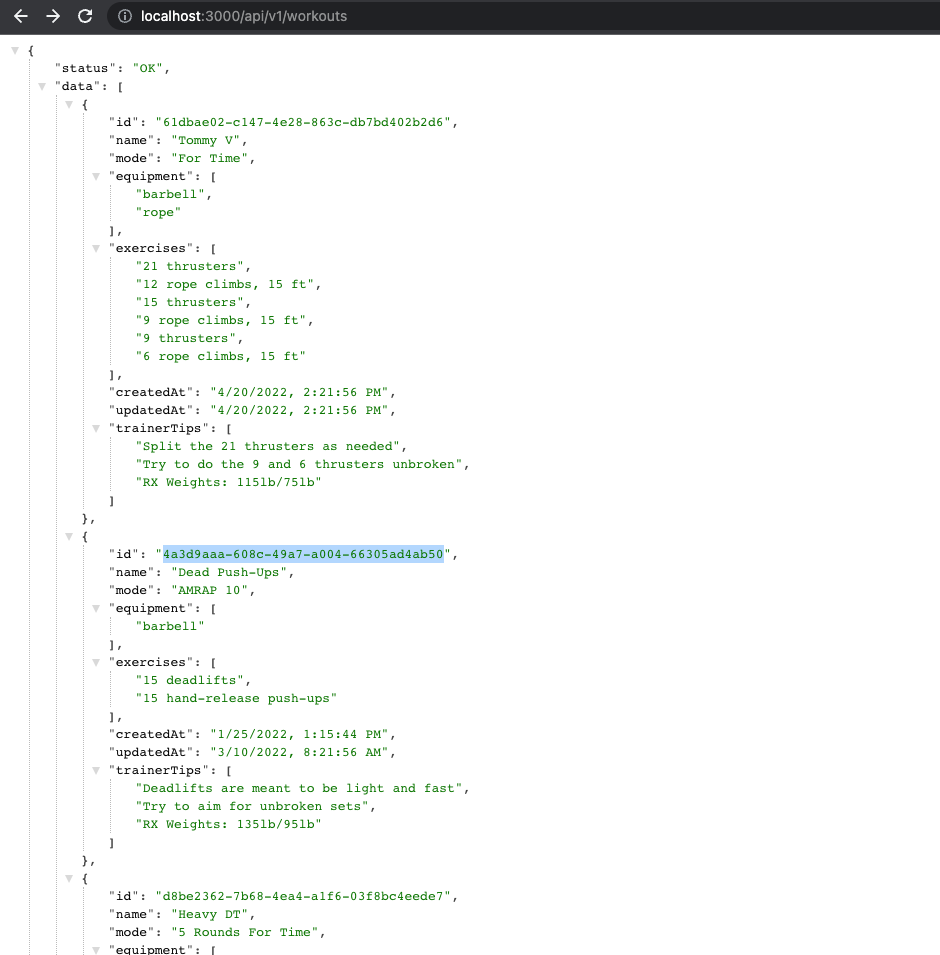

Посмотрим, сможем ли мы получить все записи для этого:

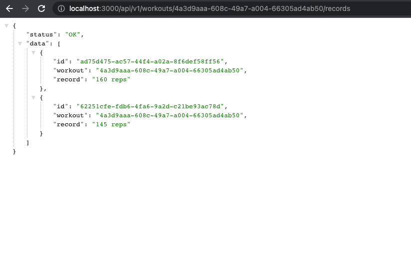

Как видите, логическая вложенность имеет смысл, когда у вас есть ресурсы, которые можно связать между собой. Теоретически вы можете вложить их как угодно глубоко, но эмпирическим правилом здесь является максимум три уровня.

Если вы хотите сделать вложение глубже, то можно немного подправить записи в вашей базе данных. Я покажу вам небольшой пример.

Представьте, что фронтенду также нужна конечная точка для получения информации о том, какой именно участник является владельцем текущей записи, и он хочет получать метаданные о нем.

Конечно, мы можем реализовать следующий URI:

```js
GET /api/v1/workouts/:workoutId/records/members/:memberId
```

Конечная точка становится все менее управляемой, чем больше вложенности мы к ней добавляем. Поэтому целесообразно хранить URI для получения информации об участнике непосредственно в записи.

В базе данных это выглядит следующим образом:

```json
{
    "workouts": [
        // ...
    ],
    "members": [
        // ...
    ],
    "records": [
        // ...
        {
            "id": "ad75d475-ac57-44f4-a02a-8f6def58ff56",
            "workout": "4a3d9aaa-608c-49a7-a004-66305ad4ab50",
            "record": "160 reps",
            "memberId": "11817fb1-03a1-4b4a-8d27-854ac893cf41",
            "member": "/members/:memberId"
        }
    ]
}
```

Как видно, мы добавили два свойства "memberId" и "member" к нашим записям в базе данных. Это дает огромное преимущество: нам не нужно встраивать в существующую конечную точку более глубокие свойства.

Фронтенду достаточно вызвать **GET /api/v1/workouts/:workoutId/records**, и он автоматически получает все записи, связанные с данной тренировкой.

Кроме того, он получает идентификатор участника и конечную точку для получения информации об этом участнике. Таким образом, мы избежали более глубокой вложенности нашей конечной точки.

Конечно, это работает только в том случае, если мы можем обрабатывать запросы к "`/members/:memberId`" 😁 Похоже, это отличная тренировочная возможность для реализации такой ситуации!

### Интеграция фильтрации, сортировки и пагинации {#integrate-filtering-sorting-pagination}

Сейчас мы можем выполнять достаточно много операций с помощью нашего API. Это большой прогресс, но это еще не все.

В последних разделах мы сосредоточились на улучшении опыта разработчиков и способов взаимодействия с нашим API. Но общая производительность нашего API - это еще один ключевой фактор, над которым нам следует поработать.

Поэтому интеграция фильтрации, сортировки и пагинации также является важным фактором в моем списке.

Представьте, что в нашей БД хранится 2 000 тренировок, 450 записей и 500 участников. При вызове конечной точки для получения всех тренировок мы не хотим отправлять все 2000 тренировок сразу. Это, конечно, будет очень медленный отклик или приведет к падению нашей системы (возможно, с 200 000 😁).

Вот почему так важны фильтрация и пагинация. Фильтрация, как уже понятно из названия, полезна тем, что позволяет получить конкретные данные из всей нашей коллекции. Например, все тренировки, имеющие режим "На время".

Пагинация - это еще один механизм, позволяющий разделить всю коллекцию тренировок на несколько "страниц", где каждая страница состоит, например, только из двадцати тренировок. Этот прием позволяет нам не отправлять одновременно с ответом клиенту более двадцати тренировок.

Сортировка может оказаться сложной задачей. Поэтому эффективнее сделать ее в нашем API и отправлять отсортированные данные клиенту.

Начнем с интеграции механизма фильтрации в наш API. Мы модернизируем нашу конечную точку, которая отправляет все отработки, принимая параметры фильтра. Обычно в GET-запросе мы добавляем критерии фильтрации в качестве параметра запроса.

Наш новый URI будет выглядеть следующим образом, если мы хотим получить только те тренировки, которые находятся в режиме "AMRAP" (**A**s **M**any **R**ounds **A**s **P**ossible): **/api/v1/workouts?mode=amrap.**.

Чтобы сделать это более интересным, нам нужно добавить еще несколько тренировок. Вставьте эти тренировки в коллекцию "workouts" внутри `db.json`:

```json
({
    "name": "Jumping (Not) Made Easy",
    "mode": "AMRAP 12",
    "equipment": ["jump rope"],
    "exercises": ["10 burpees", "25 double-unders"],
    "trainerTips": [
        "Scale to do 50 single-unders, if double-unders are too difficult"
    ],
    "id": "8f8318f8-b869-4e9d-bb78-88010193563a",
    "createdAt": "4/25/2022, 2:45:28 PM",
    "updatedAt": "4/25/2022, 2:45:28 PM"
},
{
    "name": "Burpee Meters",
    "mode": "3 Rounds For Time",
    "equipment": ["Row Erg"],
    "exercises": [
        "Row 500 meters",
        "21 burpees",
        "Run 400 meters",
        "Rest 3 minutes"
    ],
    "trainerTips": [
        "Go hard",
        "Note your time after the first run",
        "Try to hold your pace"
    ],
    "id": "0a5948af-5185-4266-8c4b-818889657e9d",
    "createdAt": "4/25/2022, 2:48:53 PM",
    "updatedAt": "4/25/2022, 2:48:53 PM"
},
{
    "name": "Dumbbell Rower",
    "mode": "AMRAP 15",
    "equipment": ["Dumbbell"],
    "exercises": [
        "15 dumbbell rows, left arm",
        "15 dumbbell rows, right arm",
        "50-ft handstand walk"
    ],
    "trainerTips": [
        "RX weights for women: 35-lb",
        "RX weights for men: 50-lb"
    ],
    "id": "3dc53bc8-27b8-4773-b85d-89f0a354d437",
    "createdAt": "4/25/2022, 2:56:03 PM",
    "updatedAt": "4/25/2022, 2:56:03 PM"
})
```

После этого мы должны принимать и обрабатывать параметры запроса. Наш контроллер тренировки будет правильным местом для начала:

```js
// In src/controllers/workoutController.js
// ...

const getAllWorkouts = (req, res) => {
    // *** ADD ***
    const { mode } = req.query;
    try {
        // *** ADD ***
        const allWorkouts = workoutService.getAllWorkouts({
            mode,
        });
        res.send({ status: 'OK', data: allWorkouts });
    } catch (error) {
        res.status(error?.status || 500).send({
            status: 'FAILED',
            data: { error: error?.message || error },
        });
    }
};

// ...
```

Из объекта `req.query` мы извлекаем "`mode`" и определяем параметр `workoutService.getAllWorkouts`. Это будет объект, состоящий из параметров нашего фильтра.

Я использую здесь сокращенный синтаксис, чтобы создать новый ключ "`mode`" внутри объекта со значением, равным значению, содержащемуся в "`req.query.mode`". Это может быть либо истинное значение, либо неопределенное, если параметр запроса с названием "`mode`" отсутствует. Мы можем расширить этот объект, если хотим принимать больше параметров фильтрации.

В нашем сервисе `workout` передадим его в метод базы данных:

```js
// In src/services/workoutService.js
// ...

const getAllWorkouts = (filterParams) => {
    try {
        // *** ADD ***
        const allWorkouts = Workout.getAllWorkouts(
            filterParams
        );
        return allWorkouts;
    } catch (error) {
        throw error;
    }
};

// ...
```

Теперь мы можем использовать его в нашем методе базы данных и применить фильтрацию:

```js
// In src/database/Workout.js
// ...

const getAllWorkouts = (filterParams) => {
    try {
        let workouts = DB.workouts;
        if (filterParams.mode) {
            return DB.workouts.filter((workout) =>
                workout.mode
                    .toLowerCase()
                    .includes(filterParams.mode)
            );
        }
        // Other if-statements will go here for different parameters
        return workouts;
    } catch (error) {
        throw { status: 500, message: error };
    }
};

// ...
```

Довольно просто, верно? Все, что мы здесь делаем, это проверяем, действительно ли у нас есть истинное значение для ключа "`mode`" внутри наших "`filterParams`". Если оно истинно, то мы отфильтруем все те тренировки, которые имеют такое же значение "`mode`". Если это значение не истинно, то параметр запроса "`mode`" отсутствует, и мы возвращаем все тренировки, поскольку в фильтрации нет необходимости.

Мы определили "`workouts`" здесь как переменную "`let`", потому что при добавлении дополнительных if-заявок для различных фильтров мы можем перезаписать "`workouts`" и выстроить цепочку фильтров.

В браузере можно зайти по адресу `localhost:3000/api/v1/workouts?mode=amrap` и получить все хранящиеся "AMRAP" тренировки:

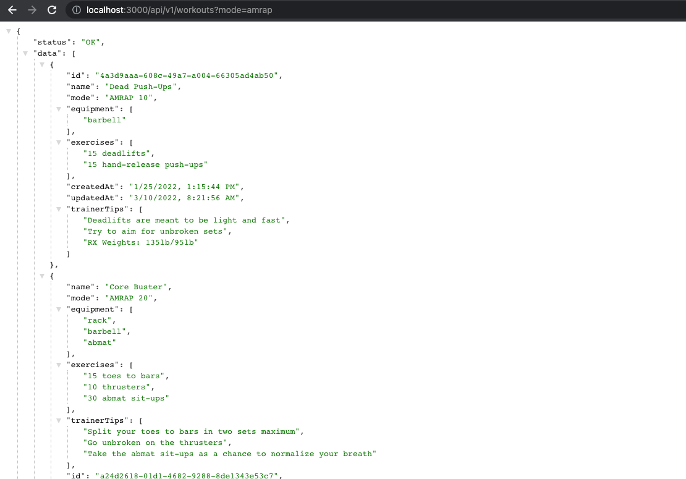

Если не указывать параметр запроса, то вы получите все тренировки, как и раньше. Далее можно попробовать добавить "for%20time" в качестве значения параметра "mode" (помните --> "%20" означает "пробел") и получить все тренировки с режимом "For Time", если таковые имеются в памяти.

При вводе значения, которое не хранится в памяти, вы должны получить пустой массив.

Параметры сортировки и пагинации следуют той же философии. Рассмотрим несколько функций, которые мы могли бы реализовать:

-   Получение всех тренировок, для которых требуется штанга: **/api/v1/workouts?equipment=barbell**.
-   Получить только 5 тренировок: **/api/v1/workouts?length=5**.
-   При использовании пагинации получать вторую страницу: **/api/v1/workouts?page=2**
-   Отсортируйте тренировки в ответе в порядке убывания по дате их создания: **/api/v1/workouts?sort=-createdAt**.
-   Можно также комбинировать параметры, чтобы получить, например, 10 последних обновленных тренировок: **/api/v1/workouts?sort=-updatedAt&length=10**.

### Использование кэширования данных для повышения производительности

Использование кэша данных также является отличной практикой для улучшения общего впечатления и производительности нашего API.

Имеет смысл использовать кэш для обслуживания данных, если эти данные являются часто запрашиваемым ресурсом или/и запрос этих данных из базы данных является тяжелой задачей и может занимать несколько секунд.

Вы можете хранить такие данные в кэше и обслуживать их оттуда, вместо того чтобы каждый раз обращаться к базе данных для запроса.

При обслуживании данных из кэша следует помнить, что эти данные могут устареть. Поэтому необходимо следить за тем, чтобы данные в кэше всегда были актуальными.

Для этого существует множество различных решений. Одним из подходящих примеров является использование [redis](https://www.npmjs.com/package/redis) или промежуточного ПО express [apicache](https://www.npmjs.com/package/apicache).

Я бы выбрал apicache, но если вы хотите использовать Redis, то я могу настоятельно порекомендовать вам ознакомиться с их замечательной [docs](https://docs.redis.com/latest/rs/references/client_references/client_nodejs/).

Давайте подумаем о сценарии использования нашего API, в котором кэш имел бы смысл. Я думаю, что запрос на получение всех отработок будет эффективно обслуживаться из нашего кэша.

Сначала установим наше промежуточное ПО:

```shell
npm i apicache
```

Теперь нам нужно импортировать его в наш маршрутизатор и настроить его.

```js
// In src/v1/routes/workoutRoutes.js
const express = require('express');
// *** ADD ***
const apicache = require('apicache');
const workoutController = require('../../controllers/workoutController');
const recordController = require('../../controllers/recordController');

const router = express.Router();
// *** ADD ***
const cache = apicache.middleware;

// *** ADD ***
router.get(
    '/',
    cache('2 minutes'),
    workoutController.getAllWorkouts
);

router.get('/:workoutId', workoutController.getOneWorkout);

router.get(
    '/:workoutId/records',
    recordController.getRecordForWorkout
);

router.post('/', workoutController.createNewWorkout);

router.patch(
    '/:workoutId',
    workoutController.updateOneWorkout
);

router.delete(
    '/:workoutId',
    workoutController.deleteOneWorkout
);

module.exports = router;
```

Начало работы довольно простое, не так ли? Мы можем определить новый кэш, вызвав **apicache.middleware**, и использовать его как промежуточное звено внутри нашего маршрута get. Его нужно просто поместить в качестве параметра между фактическим маршрутом и нашим контроллером тренировки.

Внутри него можно определить, как долго будут кэшироваться данные. Для данного руководства я выбрал значение 2 минуты. Время зависит от того, как быстро или как часто меняются данные в кэше.

Давайте протестируем!

В Postman или другом HTTP-клиенте на ваш выбор создайте новый запрос, который получит все отработки. До сих пор я делал это в браузере, но мне хотелось бы лучше представить время отклика. Поэтому сейчас я запрашиваю ресурс через Postman.

Давайте вызовем наш запрос в первый раз:

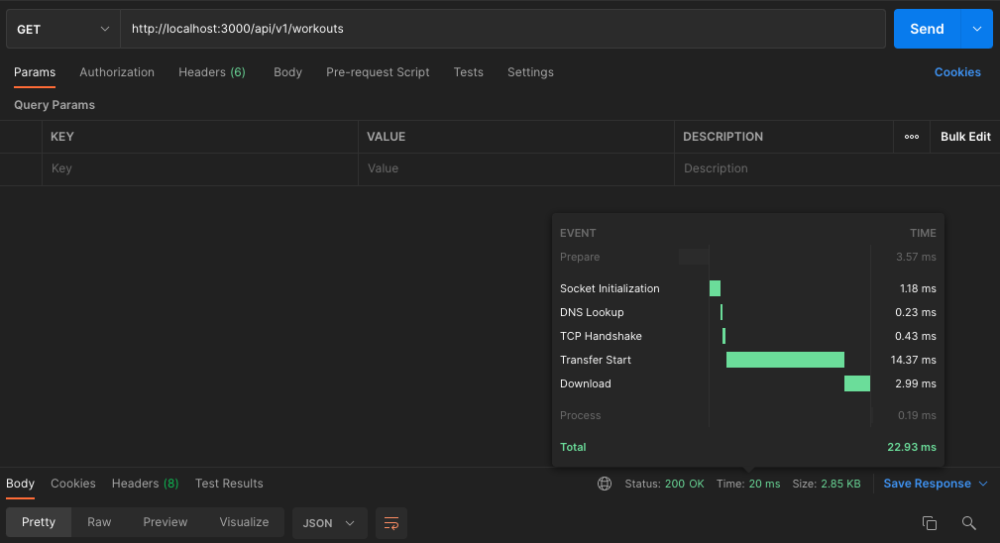

Как видно, на ответ нашему API потребовалось 22,93 мс. Как только наш кэш снова опустеет (через две минуты), его необходимо снова заполнить. Это происходит с первым запросом.

Таким образом, в приведенном выше случае данные были получены НЕ из нашего кэша. Они были получены "обычным" путем из базы данных и заполнили наш кэш.

Теперь, при втором запросе, мы получаем меньшее время отклика, поскольку данные были получены непосредственно из кэша:

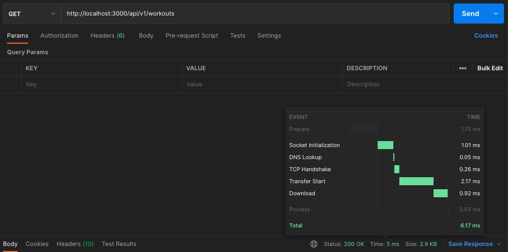

Мы смогли обслужить запрос в три раза быстрее, чем при предыдущем запросе! И все это благодаря нашему кэшу.

В нашем примере мы кэшировали только один маршрут, но вы также можете кэшировать все маршруты, реализовав это следующим образом:

```js
// In src/index.js
const express = require('express');
const bodyParser = require('body-parser');
// *** ADD ***
const apicache = require('apicache');
const v1WorkoutRouter = require('./v1/routes/workoutRoutes');

const app = express();
// *** ADD ***
const cache = apicache.middleware;
const PORT = process.env.PORT || 3000;

app.use(bodyParser.json());
// *** ADD ***
app.use(cache('2 minutes'));
app.use('/api/v1/workouts', v1WorkoutRouter);

app.listen(PORT, () => {
    console.log(`API is listening on port ${PORT}`);
});
```

Есть одна **важная** вещь, которую я хотел бы отметить, когда речь идет о кэшировании. Несмотря на то, что оно, казалось бы, решает множество проблем, оно также может принести некоторые проблемы в ваше приложение.

При использовании кэша необходимо помнить о нескольких вещах:

-   необходимо всегда следить за тем, чтобы данные в кэше были актуальными, поскольку вы не хотите предоставлять устаревшие данные
-   пока обрабатывается первый запрос, а кэш вот-вот заполнится и поступят новые запросы, необходимо решить, задерживать ли эти запросы и обслуживать данные из кэша или же они также получат данные прямо из базы данных, как и первый запрос
-   это еще один компонент в вашей инфраструктуре, если вы выбираете распределенный кэш, такой как Redis (поэтому вы должны спросить себя, действительно ли имеет смысл его использовать).

Вот как это обычно делается:

Я люблю начинать как можно проще и чище со всего, что я создаю. То же самое относится и к API.

Когда я начинаю создавать API и нет особых причин использовать кэш сразу, я оставляю его и смотрю, что произойдет со временем. Когда появятся причины для использования кэша, я смогу его внедрить.

### Хорошие методы обеспечения безопасности

Вот это да! Это было очень интересное путешествие. Мы затронули множество важных моментов и соответствующим образом расширили наш API.

Мы рассказали о лучших практиках, позволяющих повысить удобство использования и производительность нашего API. Безопасность также является ключевым фактором для API. Можно создать самый лучший API, но если он представляет собой уязвимую часть программного обеспечения, работающего на сервере, он становится бесполезным и опасным.

Первым и обязательным условием является использование SSL/TLS, поскольку это стандарт для коммуникаций в Интернете. Это еще более важно для API, когда между клиентом и нашим API передаются конфиденциальные данные.

Если у вас есть ресурсы, которые должны быть доступны только аутентифицированным пользователям, то их необходимо защитить с помощью проверки подлинности.

В Express, например, это можно реализовать в виде промежуточного ПО, как мы это сделали с нашим кэшем для определенных маршрутов, и проверять сначала, аутентифицирован ли запрос, прежде чем он получит доступ к ресурсу.

Также могут быть ресурсы или взаимодействия с нашим API, которые мы не хотим разрешать запрашивать каждому пользователю. Тогда необходимо придумать систему ролей для пользователей. Тогда необходимо добавить в маршрут еще одну логику проверки и подтвердить, что пользователь имеет право доступа к этому ресурсу.

Роли пользователей также имеют смысл в нашем случае, когда мы хотим, чтобы только определенные пользователи (например, тренеры) могли создавать, обновлять и удалять наши тренировки и записи. Чтение может быть для всех (также для "обычных" членов клуба).

Это может быть обработано внутри другого промежуточного ПО, которое мы используем для маршрутов, которые мы хотели бы защитить. Например, наш POST-запрос к `/api/v1/workouts` для создания новой тренировки.

Внутри первого промежуточного ПО мы проверим, аутентифицирован ли пользователь. Если это так, то мы перейдем к следующему промежуточному модулю, который будет проверять роль пользователя. Если пользователь имеет соответствующую роль для доступа к данному ресурсу, то запрос будет передан соответствующему контроллеру.

Внутри обработчика маршрута это будет выглядеть следующим образом:

```js
// In src/v1/routes/workoutRoutes.js
// ...

// Custom made middlewares
const authenticate = require('../../middlewares/authenticate');
const authorize = require('../../middlewares/authorize');

router.post(
    '/',
    authenticate,
    authorize,
    workoutController.createNewWorkout
);

// ...
```

Для более подробного ознакомления с лучшими практиками по этой теме я могу предложить прочитать [эту статью](https://restfulapi.net/security-essentials/).

### Документируйте свой API должным образом

Я знаю, что документирование, безусловно, не является любимой задачей разработчиков, но это необходимая вещь. Особенно когда речь идет об API.

Некоторые люди говорят:

> "An API is just as good as it's documentation"

Я думаю, что в этом утверждении есть большая доля истины, поскольку если API не документирован, то его невозможно правильно использовать, а значит, он становится бесполезным. Документация также помогает значительно облегчить жизнь разработчикам.

Всегда помните, что документация - это, как правило, первое взаимодействие пользователей с вашим API. Чем быстрее пользователи смогут разобраться в документации, тем быстрее они смогут использовать API.

Поэтому наша задача - создать хорошую и точную документацию. Существует несколько замечательных инструментов, которые облегчают нам жизнь.

Как и в других областях информатики, существует некий стандарт для документирования API, называемый [OpenAPI Specification](https://swagger.io/specification/).

Давайте посмотрим, как можно создать документацию, подтверждающую эту спецификацию. Для этого мы будем использовать пакеты [swagger-ui-express](https://www.npmjs.com/package/swagger-ui-express) и [swagger-jsdoc](https://www.npmjs.com/package/swagger-jsdoc). Через секунду вы будете поражены, насколько это здорово!

Сначала мы создадим "голую" структуру для нашей документации. Поскольку мы планируем иметь разные версии нашего API, то и документация будет немного отличаться. Поэтому я хотел бы определить наш swagger-файл, чтобы он расшаривал нашу документацию в папке соответствующей версии.

```shell
# Install required npm packages
npm i swagger-jsdoc swagger-ui-express

# Create a new file to setup the swagger docs
touch src/v1/swagger.js
```

---

```js
// In src/v1/swagger.js
const swaggerJSDoc = require('swagger-jsdoc');
const swaggerUi = require('swagger-ui-express');

// Basic Meta Informations about our API
const options = {
    definition: {
        openapi: '3.0.0',
        info: {
            title: 'Crossfit WOD API',
            version: '1.0.0',
        },
    },
    apis: [
        './src/v1/routes/workoutRoutes.js',
        './src/database/Workout.js',
    ],
};

// Docs in JSON format
const swaggerSpec = swaggerJSDoc(options);

// Function to setup our docs
const swaggerDocs = (app, port) => {
    // Route-Handler to visit our docs
    app.use(
        '/api/v1/docs',
        swaggerUi.serve,
        swaggerUi.setup(swaggerSpec)
    );
    // Make our docs in JSON format available
    app.get('/api/v1/docs.json', (req, res) => {
        res.setHeader('Content-Type', 'application/json');
        res.send(swaggerSpec);
    });
    console.log(
        `Version 1 Docs are available on http://localhost:${port}/api/v1/docs`
    );
};

module.exports = { swaggerDocs };
```

Итак, установка довольно проста. Мы определили некоторые основные метаданные нашего API, создали документацию в формате JSON и создали функцию, которая делает нашу документацию доступной.

Чтобы проверить, все ли работает, мы выводим в консоль простое сообщение о том, где мы можем найти наши документы.

Эту функцию мы будем использовать в нашем корневом файле, где мы создали Express-сервер, чтобы убедиться, что документация также загружается.

```js
// In src/index.js
const express = require('express');
const bodyParser = require('body-parser');
const v1WorkoutRouter = require('./v1/routes/workoutRoutes');
// *** ADD ***
const {
    swaggerDocs: V1SwaggerDocs,
} = require('./v1/swagger');

const app = express();
const PORT = process.env.PORT || 3000;

app.use(bodyParser.json());
app.use('/api/v1/workouts', v1WorkoutRouter);

app.listen(PORT, () => {
    console.log(`API is listening on port ${PORT}`);
    /// *** ADD ***
    V1SwaggerDocs(app, PORT);
});
```

Теперь вы должны увидеть в терминале, где запущен ваш сервер разработки:

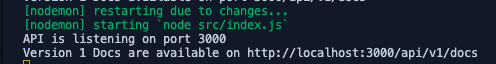

А когда вы зайдете на `localhost:3000/api/v1/docs`, вы уже должны увидеть нашу страницу с документами:

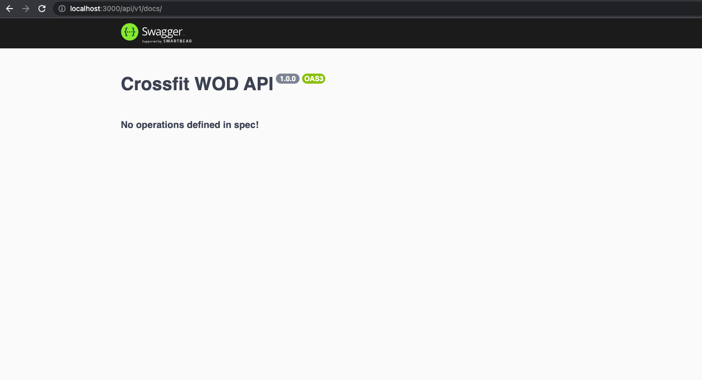

Каждый раз я поражаюсь, насколько хорошо это работает. Теперь базовая структура создана, и мы можем приступить к реализации документации для наших конечных точек. Поехали!

Если вы посмотрите на **options.apis** в нашем файле `swagger.js`, то увидите, что мы включили путь к нашим маршрутам тренировок и к файлу тренировок в папке с базой данных. Это самая важная вещь в настройке, благодаря которой произойдет вся магия.

Наличие этих файлов, определенных в опциях `swagger`, позволит нам использовать комментарии, ссылающиеся на OpenAPI и имеющие синтаксис, как в yaml-файлах, которые необходимы для настройки наших документов.

Теперь мы готовы создать документацию для нашей первой конечной точки! Давайте приступим к работе.

```js
// In src/v1/routes/workoutRoutes.js
// ...

/**
 * @openapi
 * /api/v1/workouts:
 *   get:
 *     tags:
 *       - Workouts
 *     responses:
 *       200:
 *         description: OK
 *         content:
 *           application/json:
 *             schema:
 *               type: object
 *               properties:
 *                 status:
 *                   type: string
 *                   example: OK
 *                 data:
 *                   type: array
 *                   items:
 *                     type: object
 */
router.get(
    '/',
    cache('2 minutes'),
    workoutController.getAllWorkouts
);

// ...
```

Вот, собственно, и вся магия добавления конечной точки в наши swagger-документы. Вы можете посмотреть все спецификации для описания конечной точки в их [great docs](https://swagger.io/docs/specification/about/).

Когда вы перезагрузите страницу с документами, вы должны увидеть следующее:

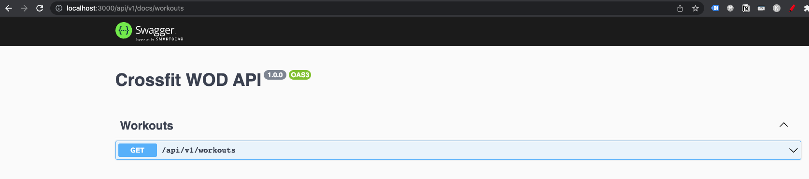

Это должно выглядеть очень знакомо, если вы уже работали с API, имеющими документацию OpenAPI. Это представление, в котором будут перечислены все наши конечные точки, и вы сможете расширить каждую из них, чтобы получить о ней дополнительную информацию.

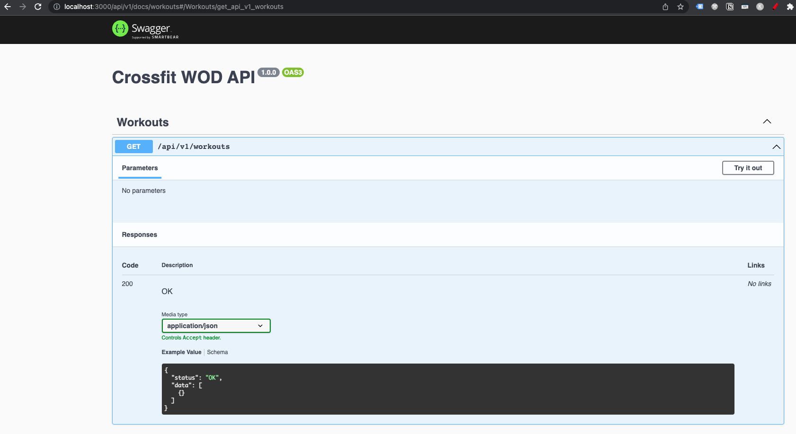

Если внимательно посмотреть на наш ответ, то можно заметить, что мы не определили правильное возвращаемое значение, поскольку просто сказали, что наше свойство "data" будет представлять собой массив пустых объектов.

Вот тут-то и пригодятся схемы.

```js
// In src/databse/Workout.js
// ...

/**
 * @openapi
 * components:
 *   schemas:
 *     Workout:
 *       type: object
 *       properties:
 *         id:
 *           type: string
 *           example: 61dbae02-c147-4e28-863c-db7bd402b2d6
 *         name:
 *           type: string
 *           example: Tommy V
 *         mode:
 *           type: string
 *           example: For Time
 *         equipment:
 *           type: array
 *           items:
 *             type: string
 *           example: ["barbell", "rope"]
 *         exercises:
 *           type: array
 *           items:
 *             type: string
 *           example: ["21 thrusters", "12 rope climbs, 15 ft", "15 thrusters", "9 rope climbs, 15 ft", "9 thrusters", "6 rope climbs, 15 ft"]
 *         createdAt:
 *           type: string
 *           example: 4/20/2022, 2:21:56 PM
 *         updatedAt:
 *           type: string
 *           example: 4/20/2022, 2:21:56 PM
 *         trainerTips:
 *           type: array
 *           items:
 *             type: string
 *           example: ["Split the 21 thrusters as needed", "Try to do the 9 and 6 thrusters unbroken", "RX Weights: 115lb/75lb"]
 */

// ...
```

В приведенном выше примере мы создали нашу первую схему. Обычно это определение находится в файле схемы или модели, в котором определены модели базы данных.

Как можно видеть, она также довольно проста. Мы определили все свойства, из которых состоит разработка, включая тип и пример.

Вы можете снова посетить нашу страницу docs, и мы получим еще один раздел, содержащий наши схемы.

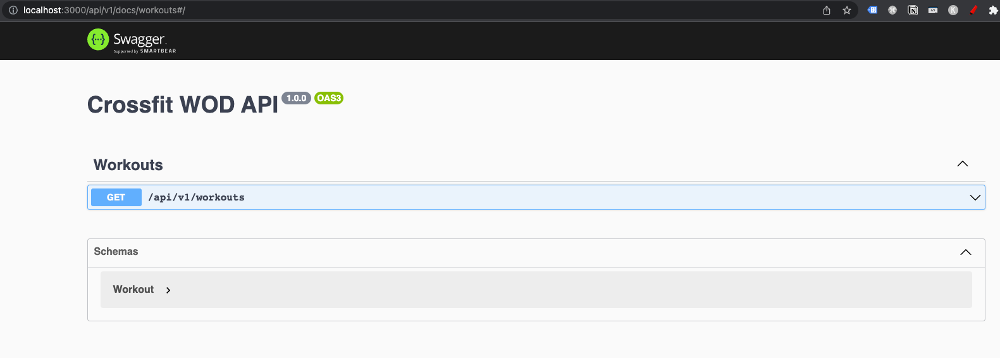

Теперь на эту схему можно ссылаться в ответе нашей конечной точки.

```js
// In src/v1/routes/workoutRoutes.js
// ...

/**
 * @openapi
 * /api/v1/workouts:
 *   get:
 *     tags:
 *       - Workouts
 *     responses:
 *       200:
 *         description: OK
 *         content:
 *           application/json:
 *             schema:
 *               type: object
 *               properties:
 *                 status:
 *                   type: string
 *                   example: OK
 *                 data:
 *                   type: array
 *                   items:
 *                     $ref: "#/components/schemas/Workout"
 */
router.get(
    '/',
    cache('2 minutes'),
    workoutController.getAllWorkouts
);

// ...
```

Внимательно посмотрите на нижнюю часть нашего комментария в разделе "items". Мы используем "`$ref`" для создания ссылки и ссылаемся на путь к нашей схеме, которую мы определили внутри нашего файла тренировки.

Теперь мы можем показать полную тренировку в нашем ответе.

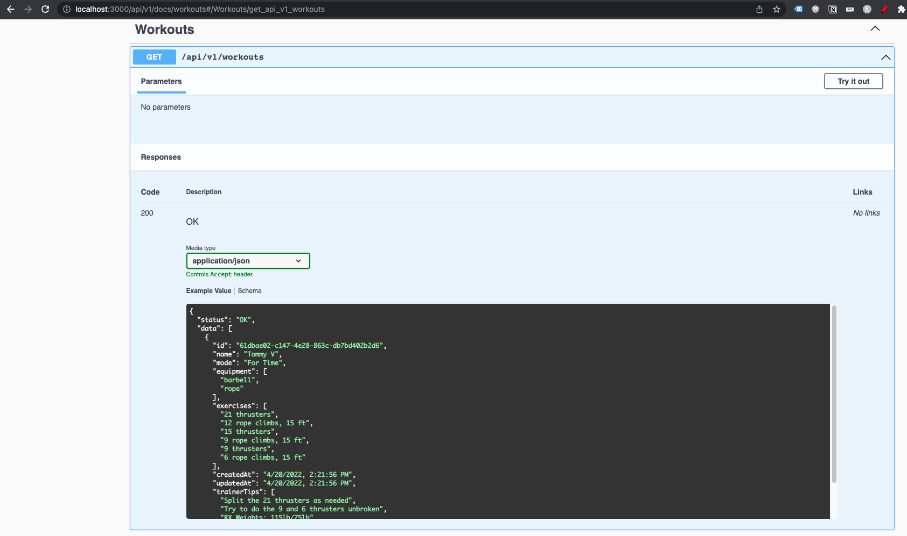

Довольно здорово, правда? Вы можете подумать, что "набирать эти комментарии вручную может быть утомительным занятием".

Возможно, это и так, но подумайте вот о чем. Те комментарии, которые находятся в вашей кодовой базе, также являются отличной документацией для вас как разработчика API. Вам не нужно постоянно заходить в документацию, когда вы хотите узнать документацию по конкретной конечной точке. Вы можете просто посмотреть ее в одном месте в своем исходном коде.

Документирование конечных точек также помогает лучше понять их и "заставляет" вспомнить о том, что вы могли забыть реализовать.

Как видите, я действительно кое-что забыл. Возможные ответы на ошибки и параметры запроса все еще отсутствуют!

Давайте это исправим:

```js
// In src/v1/routes/workoutRoutes.js
// ...

/**
 * @openapi
 * /api/v1/workouts:
 *   get:
 *     tags:
 *       - Workouts
 *     parameters:
 *       - in: query
 *         name: mode
 *         schema:
 *           type: string
 *         description: The mode of a workout
 *     responses:
 *       200:
 *         description: OK
 *         content:
 *           application/json:
 *             schema:
 *               type: object
 *               properties:
 *                 status:
 *                   type: string
 *                   example: OK
 *                 data:
 *                   type: array
 *                   items:
 *                     $ref: "#/components/schemas/Workout"
 *       5XX:
 *         description: FAILED
 *         content:
 *           application/json:
 *             schema:
 *               type: object
 *               properties:
 *                 status:
 *                   type: string
 *                   example: FAILED
 *                 data:
 *                   type: object
 *                   properties:
 *                     error:
 *                       type: string
 *                       example: "Some error message"
 */
router.get(
    '/',
    cache('2 minutes'),
    workoutController.getAllWorkouts
);

// ...
```

Если посмотреть на верхнюю часть нашего комментария в разделе "`tags`", то можно увидеть, что я добавил еще один ключ под названием "`parameters`", где я определил наш параметр запроса для фильтрации.

Теперь в наших документах он отображается правильно:

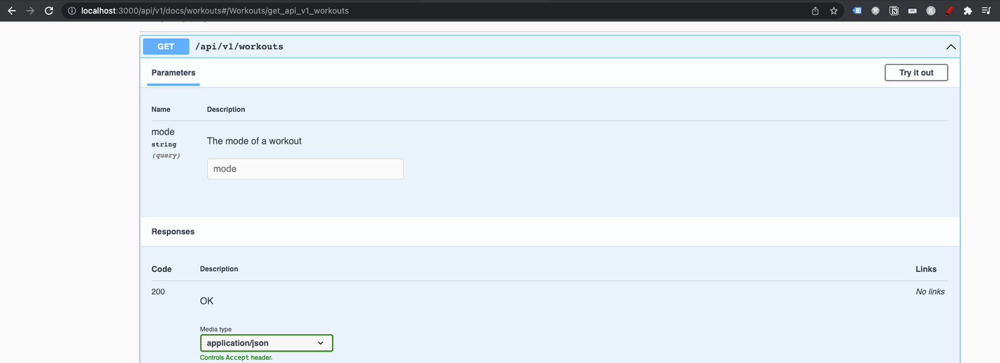

И чтобы задокументировать возможный случай ошибки, мы на данный момент выбрасываем только ошибку 5XX. Поэтому в разделе "Ответы" вы можете увидеть, что я также определил другую документацию для этого.

На нашей странице документации она выглядит следующим образом:

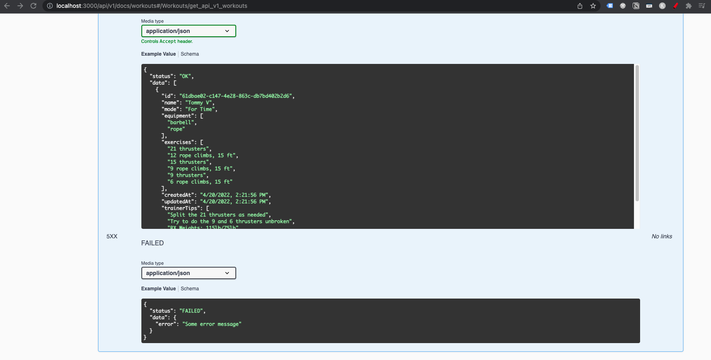

Потрясающе! Мы только что создали полную документацию для одной конечной точки. Я бы настоятельно рекомендовал вам самостоятельно реализовать остальные конечные точки, чтобы поработать с ними. В процессе работы вы узнаете много нового!

Как вы могли убедиться, документирование API не всегда должно быть головной болью. Я думаю, что инструменты, с которыми я вас познакомил, сокращают общие усилия, а настройка их довольно проста.

Поэтому мы можем сконцентрироваться на главном - на самой документации. На мой взгляд, документация по swagger/OpenAPI очень хороша, и в Интернете можно найти множество замечательных примеров.

Отсутствие документации из-за слишком большого объема "лишней" работы больше не должно быть причиной.

## Заключение

Это была очень веселая поездка. Мне очень понравилось писать для вас эту статью, и я тоже многому научился.

Возможно, некоторые лучшие практики являются важными, в то время как другие могут показаться неприменимыми к вашей текущей ситуации. Это нормально, потому что, как я уже говорил, каждый инженер обязан выбрать лучшие практики, которые можно применить к его текущей ситуации.

Я постарался сделать все возможное, чтобы объединить все те лучшие практики, которые я сделал до сих пор, и при этом создать собственный API. Это доставило мне массу удовольствия!

Я буду рад любой обратной связи. Если вы хотите что-то рассказать мне (хорошее или плохое), не стесняйтесь, обращайтесь:

Вот [мой Instagram](https://www.instagram.com/jean_marc.dev/) (вы также можете следить за моим путешествием в качестве разработчика программного обеспечения).

Увидимся в следующий раз!

## Ссылки

-   [REST API Design Best Practices Handbook – How to Build a REST API with JavaScript, Node.js, and Express.js](https://www.freecodecamp.org/news/rest-api-design-best-practices-build-a-rest-api/)
