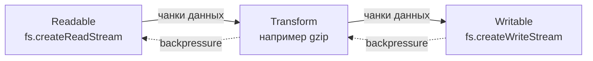

# Потоки Node.js: обратное давление и поток данных

Источник: [theNodeBook — Node.js Streams: Backpressure & Data Flow](https://www.thenodebook.com/streams/foundation-of-streams)

Потоки (streams) в Node.js — объекты, которые передают данные **чанками**. Readable производит чанки. Writable потребляет. Transform принимает, меняет и отдаёт новые чанки. В основе — буферизация, события, жизненный цикл и **обратное давление** (backpressure) при передаче чанков. Потоки не складывают весь вход в одну гигантскую аллокацию: небольшие куски проходят через конечный автомат состояний.

Ключевая операционная деталь — backpressure. Когда потребитель отстаёт, слой stream сигнализирует об этом через возвращаемые значения, событие `drain`, приостановку чтения или координацию в `pipeline`. Поэтому потоки везде в файловом I/O, телах HTTP, TCP‑сокетах, сжатии, crypto и длинных конвейерах данных.

Прежде чем писать код с `stream.Readable` и `pipeline`, стоит понять задачу, которую они решают. В программировании она стара как мир: **как обрабатывать данные, которые больше доступной памяти?** Ответ на этот вопрос сформировал ОС, БД, сетевые протоколы и почти любую систему с реальными объёмами данных. Потоки Node.js — прямой ответ на ограничения физической памяти и природу I/O.

## Что такое потоки в Node.js

Поток — абстракция для управления потоком **чанков** данных: чтение, буферизация при необходимости и доставка в вашу логику. Это структурированный способ думать о пошаговой асинхронной обработке без загрузки всего набора в память.

---

## Проблема больших данных

Реалистичный сценарий: веб‑сервис обрабатывает загруженные файлы — изображения, видео, документы. Нужно прочитать файл, возможно преобразовать (сжать картинку, извлечь метаданные, просканировать на вирусы) и сохранить или отправить дальше.

Самый прямой путь — прочитать весь файл в один `Buffer`, обработать и записать результат. В коде это выглядит просто:

```javascript
const data = await fs.readFile('input.mp4');
const processed = transform(data);
await fs.writeFile('output.mp4', processed);
```

Три строки. Понятно. Для маленьких файлов — отлично. Но что, если пользователь загружает видео на 2 ГБ? Или дамп БД на 10 ГБ? Программе нужно выделить 2 ГБ только под один файл. Десять одновременных загрузок — 20 ГБ RAM. Такой подход не масштабируется.

Проблема глубже, чем объём памяти. Даже при 128 ГБ RAM загрузка файла на 2 ГБ означает: ждать, пока **весь** файл прочитается с диска или по сети, прежде чем обработать первый байт. Если чтение занимает 5 секунд, программа простаивает 5 секунд до начала обработки. После обработки снова ждать полной записи 2 ГБ. Поток данных по сути синхронный: прочитать всё → обработать всё → записать всё.

Это неэффективно. Пока диск отдаёт последний мегабайт, можно уже обрабатывать первый. Пока обрабатывается середина, можно писать начало на выход. Чтение, обработка и запись могли бы **перекрываться во времени** — но подход «всё в память» это запрещает.

При последовательной схеме (чтение 5 с + обработка 3 с + запись 4 с) суммарно **12 секунд**, и каждый этап ждёт завершения предыдущего. При перекрытии этапов суммарное время ближе к самому медленному звену, а не к сумме — потому что пока один этап занят, другие уже работают с другими частями файла.

---

## Зачем чанки

Ключевая мысль: **не обязательно держать весь набор данных в памяти**, чтобы его обработать. Достаточно части, с которой вы работаете прямо сейчас.

Вместо чтения всего файла — читать, скажем, 64 КБ, обработать, записать результат, затем следующие 64 КБ и так далее.

Чанковая обработка решает обе проблемы:

1.  **Память ограничена размером чанка**, а не файла. Для файла 2 ГБ в каждый момент нужно около 64 КБ, а не 2 ГБ.
2.  **Операции могут перекрываться**: пока обрабатывается чанк N, ОС может читать N+1; пока пишется обработанный N, можно обрабатывать N+1.

Для файла 2 ГБ пик при «всё в память» — около 2000 МБ; при чанках по 64 КБ — около 64 МБ. Разница на порядки.

Но появляется сложность: когда читать следующий чанк, когда обрабатывать и писать; что делать, если производитель быстрее потребителя (или наоборот); как корректно освободить ресурсы при ошибке посередине; как сигнализировать конец данных.

Здесь и входит **парадигма потоков** — абстракция над потоком чанков с готовой механикой буферов, событий и backpressure.

---

## Две базовые модели потоковой передачи

Есть два принципиально разных способа организовать поток данных. Это не специфика Node.js — два взгляда на то, **кто управляет потоком**.

**Push (проталкивание).** Производитель **активно отправляет** чанки потребителю. Он решает, когда отдавать данные. Потребитель реагирует на приход. Модель событий: producer эмитит, consumer слушает.

**Pull (вытягивание).** Потребитель **сам запрашивает** чанки у производителя. Он решает, когда готов к следующей порции. Производитель отвечает на запросы. Модель итераторов: consumer вызывает `next()` и получает следующее значение.

| - | Push | Pull |
| --- | --- | --- |
| Кто задаёт темп | Производитель | Потребитель |
| Типичная интеграция | События, `EventEmitter` | Итератор, `for...of` |
| Плюсы | Несколько слушателей, естественно для event-driven | Backpressure «из коробки», ленивые вычисления |
| Минусы | Потребителя можно «залить» данными | Обычно один потребитель; хуже для непредсказуемых внешних событий |

У моделей разные компромиссы и сценарии. Потоки Node.js — **гибрид**: ни чистый push, ни чистый pull. Сначала разберём чистые формы.

---

## Push-архитектура

Push уходит корнями в **паттерн Observer** («Gang of Four», 1994): зависимость «один ко многим» — при изменении субъекта все наблюдатели уведомляются.

В потоках субъект — источник данных, наблюдатели — потребители. Когда есть новые данные, субъект **проталкивает** их подписчикам.

В Node.js кирпич для push — класс `EventEmitter` (вы уже встречали его в контексте event loop и асинхронных примитивов).

Один `EventEmitter` может разослать одно событие нескольким слушателям одновременно:

```javascript
// Все три слушателя получают одно и то же событие
stream.on('data', (chunk) => {
    console.log('Listener 1:', chunk);
});

stream.on('data', (chunk) => {
    console.log('Listener 2:', chunk);
});

stream.on('data', (chunk) => {
    console.log('Listener 3:', chunk);
});

// При emit срабатывают ВСЕ слушатели
stream.emit('data', buffer); // → три лога
```

Соберём минимальный push‑поток на `EventEmitter`. В продакшене уже есть `stream.Readable`; здесь — чтобы увидеть механику push.

```javascript
import { EventEmitter } from 'events';

class SimplePushStream extends EventEmitter {
    constructor(data) {
        super();
        this.data = data;
        this.index = 0;
    }

    start() {
        this._pushNext();
    }

    _pushNext() {
        if (this.index >= this.data.length) {
            this.emit('end');
            return;
        }

        const chunk = this.data[this.index++];
        this.emit('data', chunk);
        setImmediate(() => this._pushNext());
    }
}
```

Класс расширяет `EventEmitter`. В конструкторе — массив чанков. `start()` начинает эмитить `data`; когда чанки кончились — `end`.

Потребитель подписывается:

```javascript
const stream = new SimplePushStream([1, 2, 3, 4, 5]);

stream.on('data', (chunk) => {
    console.log('Received:', chunk);
});

stream.on('end', () => {
    console.log('Stream ended');
});

stream.start();
```

Суть push: поток **сам** отдаёт данные, потребитель реагирует по приходу.

`setImmediate()` в `_pushNext()` меняет поведение. Синхронный цикл выталкнул бы все чанки за один вызов `start()`. С `setImmediate` каждый чанк — отдельный тик event loop: есть шанс обработать другие события, поток **уступает** управление между чанками — простейшая форма yielding, типичная для асинхронной архитектуры Node.

---

## Плюсы и ограничения push-модели

**Плюсы:**

1.  Концептуальная простота: производитель решает, когда отдавать данные; потребитель реагирует. Естественно для event-driven Node.
2.  Эффективность при схожих скоростях producer и consumer — данные текут с минимальной буферизацией.
3.  **Fan-out**: несколько слушателей на одни и те же события получают один поток данных.

**Главная проблема — backpressure.** Что, если производитель быстрее потребителя? В примере выше push идёт так быстро, как может, независимо от готовности consumer. Если обработка чанка медленная (диск, сеть), producer продолжает слать чанки. Они копятся в буфере. Буфер растёт без границы → рост памяти → падение процесса.

В продакшене consumer должен сказать producer: «ещё не готов, притормози». Это и есть backpressure — потребитель **отталкивает** поток назад. В чистом push это нетривиально: нужен контракт паузы/возобновления, а не только `emit`.

Потоки Node.js реализуют backpressure (подробнее в следующих главах). В «чистом» push его приходится добавлять поверх событий.

!!!warning ""

    Без backpressure быстрый producer и медленный consumer приводят к неограниченному росту внутреннего буфера. Всегда проектируйте регулирование потока: `write()` → `false`, `drain`, `pause()`/`resume()`, `stream.pipeline()`.

---

## Pull-архитектура

Pull **инвертирует управление**: не producer толкает данные, а consumer **вытягивает** их, когда готов.

В JavaScript pull формализован протоколами **Iterator** и **Iterable**. `for...of` по массиву — это встроенный итератор.

Итератор — объект с методом `next()`. Каждый вызов возвращает `{ value, done }`.

Простой pull‑поток:

```javascript
class SimplePullStream {
    constructor(data) {
        this.data = data;
        this.index = 0;
    }

    next() {
        if (this.index >= this.data.length) {
            return { done: true };
        }
        return {
            value: this.data[this.index++],
            done: false,
        };
    }
}
```

Потребитель сам вызывает `next()`:

```javascript
const stream = new SimplePullStream([1, 2, 3, 4, 5]);

let result = stream.next();
while (!result.done) {
    console.log('Pulled:', result.value);
    result = stream.next();
}
```

Суть pull: consumer в контроле, producer отвечает на запросы.

---

## Генераторы и протокол Iterable

Синтаксический сахар для итераторов — **функции-генераторы** (`function*`, `yield`):

```javascript
function* simplePullStream(data) {
    for (const chunk of data) {
        yield chunk;
    }
}
```

Тот же порядок значений, что у ручного итератора, но короче. Вызов generator-функции возвращает итератор; каждый `next()` выполняет код до следующего `yield`.

Генераторы также **Iterable**: есть `[Symbol.iterator]()`, возвращающий итератор. Массивы и строки — iterable; generator-функции возвращают iterable.

```javascript
for (const chunk of simplePullStream([1, 2, 3, 4, 5])) {
    console.log('Pulled:', chunk);
}
```

`for...of` сам вызывает `next()`, пока `done` не станет `true`.

**Цикл вызов–yield–возобновление:** при `const gen = myGenerator()` тело функции не выполняется целиком. Первый `gen.next()` доходит до `yield 1` и возвращает `{ value: 1, done: false }`, состояние **замораживается**. Следующий `next()` продолжает после `yield` до `yield 2`, и так далее, пока функция не завершится (`done: true`). Каждый `yield` — точка паузы и отдачи значения наружу.

---

## Асинхронные итераторы и `for await...of`

Генераторы удобны для **синхронных** последовательностей. Файл, сеть, БД в Node — асинхронны. Нужен pull с `await`.

**Async iterators:** `next()` возвращает Promise. Async generator — `async function*`, внутри можно `await`:

```javascript
async function* asyncPullStream(data) {
    for (const chunk of data) {
        await new Promise((resolve) =>
            setImmediate(resolve)
        );
        yield chunk;
    }
}
```

Потребление:

```javascript
for await (const chunk of asyncPullStream([1, 2, 3])) {
    console.log('Pulled:', chunk);
}
```

`for await...of` ждёт Promise от `next()` на каждой итерации. Асинхронный pull ощущается почти как обычный `for...of`.

Async iterators (ES2018) — мощный композиционный инструмент для асинхронных последовательностей. Readable в Node поддерживает async iteration.

---

## Плюсы и ограничения pull-модели

**Плюсы:**

1.  **Backpressure неявный:** consumer тянет чанки сам — producer не может «залить» быстрее, чем consumer запрашивает. Медленный consumer просто реже вызывает `next()`; producer ждёт. Сложная сигнализация не обязательна.
2.  **Ленивость:** работа производителя начинается по запросу. Из потенциально бесконечной последовательности можно взять первые N элементов — остальное не генерируется.
3.  **Композиция:** цепочка pull‑стадий тянет данные только когда нужно финальному потребителю; запрос распространяется назад по цепочке.

**Ограничения:**

-   Менее естественно для чисто событийных источников (WebSocket, внезапные сообщения): нельзя «вытянуть» то, что ещё не пришло.
-   **Fan-out** не встроен: значение из итератора потребляется один раз; для нескольких потребителей нужен отдельный broadcast/tee.

---

## Гибридный подход потоков Node.js

Потоки Node — не чистый push и не чистый pull.

**В ядре — push:** наследование от `EventEmitter`, данные через событие `data`. Это стыкуется с event-driven архитектурой.

**Плюс явный backpressure:** consumer сигнализирует «не готов», producer обязан учесть — pull‑подобный контроль поверх push.

**Плюс async iteration:** Readable можно читать через `for await...of` как async iterator. Под капотом итератор тянет из внутреннего буфера, а stream согласует поток с источником. Вы выбираете модель: события (push) или итератор (pull).

Гибрид не бесплатен: API эволюционировал несколько итераций — краткая история объясняет сегодняшнее поведение.

---

## Немного истории

Потоки были в Node с самого начала: `data` events, без паузы и backpressure — при отставании consumer данные копились в памяти.

**Node.js 0.10 — Streams2:** явный backpressure. У Readable два режима — **paused** (consumer вызывает `read()` и тянет из буфера) и **flowing** (push через `data`, с возможностью `pause()`). У Writable `write()` возвращает boolean «буфер полон»; producer ждёт `drain`.

**Node.js v10+:** `stream.pipeline()` для надёжной обработки ошибок, `stream.finished()` для завершения, поддержка async iterators. Потоки стали удобнее для продакшена.

Сегодня это зрелая абстракция: `fs`, `http`, `zlib`, `crypto` и тысячи библиотек.

!!!note ""

    В современном коде предпочитайте `stream.pipeline()` (или `pipeline` из `node:stream/promises`) вместо цепочки `.pipe()` без единой обработки ошибок — pipeline корректно уничтожает потоки при сбое.

---

## Четыре типа потоков

Node определяет четыре основных роли в потоке данных.

**Readable** — источник. Примеры: `fs.createReadStream()`, тело HTTP‑запроса на сервере (`http.IncomingMessage`), `process.stdin`.

**Writable** — приёмник. Примеры: `fs.createWriteStream()`, `http.ServerResponse`, `process.stdout`.

**Transform** — и readable, и writable: принимает чанки, преобразует, отдаёт новые. Writable‑сторона → readable‑сторона. Примеры: `zlib.createGzip()`, `crypto.createCipheriv()`. Transform — частный случай Duplex, когда выход напрямую следует из входа.

**Duplex** — обе стороны независимы (два канала). Классический пример — `net.Socket`: запись уходит в сеть, чтение приходит отдельным потоком.

Из этих типов собирают конвейеры: Readable → Transform → … → Writable. Каждая стадия обрабатывает чанки; backpressure распространяется **назад**, чтобы память оставалась ограниченной.

---

## Как представить поток данных

Простой конвейер из трёх стадий:

1.  Readable читает чанки с диска.
2.  Transform, например, переводит текст в верхний регистр.
3.  Writable пишет в другой файл.

**Данные идут вперёд** по цепочке: источник → преобразование → приёмник.

**Сигналы управления идут назад.** Если буфер Writable переполнен (медленный диск), он сигнализирует backpressure. Transform перестаёт забирать из Readable. Readable перестаёт читать файл. Весь конвейер **замирает**, пока Writable не освободит буфер и не сообщит, что готов снова. Затем цепочка продолжается.



Двунаправленный поток — **данные вперёд, backpressure назад** — и есть секрет ограниченной памяти. Без backpressure быстрые стадии забьют буферы; с backpressure скорость всего конвейера равна скорости самого медленного звена.

---

## Когда использовать потоки

Потоки — не всегда лучший выбор.

Для **небольших** данных, которые спокойно помещаются в память, проще и часто быстрее прочитать всё в `Buffer` или строку: `fs.readFile()`, парсинг JSON — и готово. Потоки добавляют накладные расходы: колбэки event loop, чанки, backpressure. JSON на 10 КБ — overkill.

Потоки уместны для **больших** и **неограниченных** объёмов: многогигабайтные логи, тело HTTP неизвестного размера, непрерывный протокол.

Они ценны, когда нужно **начать обработку до полной загрузки**: HTTP‑ответ с файлом может отдавать первые чанки сразу после чтения с диска — меньше time to first byte.

И когда нужен **конвейер преобразований**: прочитать → распаковать → распарсить → преобразовать → записать — каждая стадия отдельным потоком, линейная композиция.

---

## Типичные сценарии

**Файловый I/O.** Большие файлы почти всегда через streams — без загрузки целиком и с ранним стартом обработки.

**Сеть.** Тела HTTP‑запросов и ответов — потоки. TCP‑сокеты — duplex streams. Данные приходят и уходят по частям; streams совпадают с формой протокола.

**Конвейеры ETL и аналитика.** Парсинг, фильтрация, map, агрегация — отдельные стадии, composable pipeline.

**Обработка в реальном времени.** Очереди сообщений, IoT, события в веб‑приложении — обрабатывать по мере прихода, не копить всё в RAM.

**Прокси и мультиплексирование.** Прокси и балансировщики пересылают данные между сокетами через `pipe`, без буферизации целого сообщения — большие запросы и ответы остаются управляемыми.

---

## Что дальше

Мы заложили концептуальный фундамент:

-   задача: большие и неограниченные данные без исчерпания памяти;
-   две модели: push и pull, и гибрид Node.js;
-   четыре типа потоков и роли в потоке данных;
-   данные вперёд, backpressure назад.

Дальше — настоящие классы `stream.Readable`, `stream.Writable`, `stream.Transform`, `stream.Duplex`: кастомные потоки, внутренние буферы, режимы paused/flowing, `pipeline` и обработка ошибок. Следующая глава углубляется в **Readable streams**.

Потоки не магия. Это системный ответ на память и асинхронный I/O: паттерны Observer и Iterator, адаптированные под event-driven Node. С пониманием с первых принципов проще отлаживать, проектировать свои pipeline и уверенно читать документацию API.

Дальше будет интереснее.

## Связанное чтение

-   Предыдущая: [Фрагментация Buffer, внешняя память и slab](../buffers/fragmentation-and-challenges.md)
-   Далее: [Readable streams](readable-streams.md)
